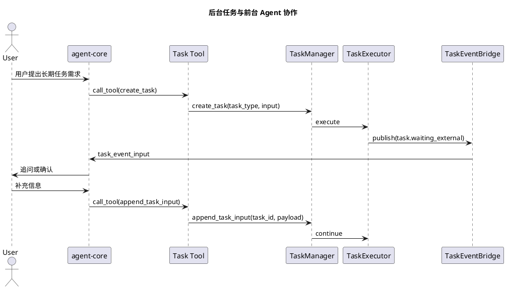
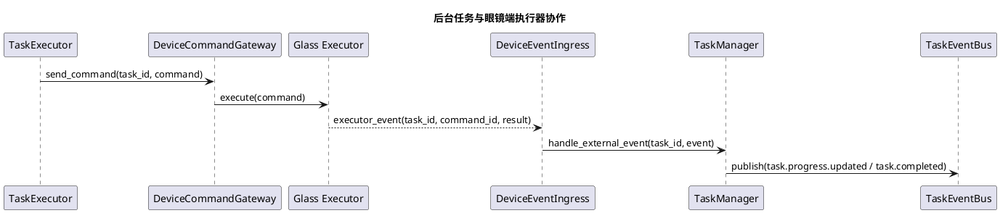

# backend-task-core 开发指南

## 1. 文档定位

本文档是 [大模型能力扩展开发指南.md](/Users/elio/dev/llm-project/OpenAIglassesDemo_2/doc/structure-design/大模型能力扩展开发指南.md) 中 `Task` 开发部分的补充文档。

本文面向未参与架构设计和框架开发的开源社区开发者。

本文档重点回答以下问题：

1. 社区开发者应该改哪些文件。
2. 社区开发者应如何新增一个复杂后台任务。
3. 后台任务如何与前台 `agent-core` 协作。
4. 后台任务如何与眼镜端执行器协作。

阅读顺序建议如下：

1. 先读 [agent-core设计.md](/Users/elio/dev/llm-project/OpenAIglassesDemo_2/doc/structure-design/agent-core设计.md)
2. 再读 [backend-task-core设计.md](/Users/elio/dev/llm-project/OpenAIglassesDemo_2/doc/structure-design/backend-task-core设计.md)
3. 最后按本文档落具体代码

---

## 2. 先判断是不是应该写 Task

满足以下条件时，优先写 `Task`，而不是只写普通 Tool：

1. 能力执行时间明显长于一次模型调用。
2. 能力需要跨多个步骤持续推进。
3. 能力需要等待定时器、设备回报、外部系统回调或用户补充信息。
4. 能力需要在服务端保存结构化运行时状态。

不满足以上条件时，优先写普通 `Function Tool`、`Skill Tool` 或 `MCP Tool`。

一句话判断：

1. 模型侧暴露的是 Tool。
2. 后台持续运行的是 Task。

---

## 3. 先看最短路径

如果你只想尽快新增一个后台能力，按下面 6 步做：

1. 在 `backend_task_core/tasks/` 下新建一个 `BaseTask` 子类。
2. 定义 `spec`，填好 `task_type`、`input_model`、`timeout_seconds` 等字段。
3. 在 `run()` 中只写业务逻辑，不要手工维护生命周期状态。
4. 业务阶段写入 `runtime.context["phase"]`。
5. 需要等待设备回报或用户补充信息时，调用框架动作接口进入等待。
6. 为该任务补单元测试、集成测试和跨设备联调说明。

只有当你确实需要理解更多边界时，再继续看下面的组件说明。

---

## 4. 框架已经帮你处理什么

社区开发者默认不需要自己处理以下事情：

1. `TaskRuntime.state` 生命周期状态维护
2. 状态迁移合法性校验
3. `created_at / updated_at / completed_at` 等时间戳维护
4. `task.started / task.completed / task.failed` 等标准事件发布
5. 异常捕获与 `failed` 终态处理
6. 超时转 `timeout`
7. 取消转 `cancelled`
8. `TaskRuntime` 存储
9. 任务与 `session_id / device_id` 的关联
10. 任务事件回流 `agent-core`

社区开发者主要只需要关心：

1. 任务输入是什么
2. 业务步骤怎么推进
3. 什么时候需要等外部事件
4. 什么时候需要回流 Agent
5. 什么时候算完成，以及完成结果是什么

---

## 5. 组件快速说明

下面只保留社区开发者必须知道的最小解释。

### 5.1 核心运行时组件

#### `TaskRegistry`

作用：

1. 统一发现和注册 `BaseTask` 子类。
2. 根据 `task_type` 找到具体任务模板。

你只需要知道：

1. 新增一个任务模板时，只需要把文件放到约定目录。
2. 保证 `spec.task_type` 唯一。
3. 不要在业务代码里手工维护多个任务查找表。

#### `TaskManager`

作用：

1. 是 `backend-task-core` 的 northbound 控制入口。
2. 接收来自 `Task Tool` 的创建、查询、取消、追加输入等调用。
3. 接收来自设备事件入口的外部事件推进调用。

你只需要知道：

1. `agent-core` 侧的 `Task Tool` 只调用 `TaskManager`。
2. `Task` 模板内部不要反向直接 new 另一个 `TaskManager`。
3. 如果任务要进入下一步，应调用 `services.manager` 暴露的标准推进接口。

#### `TaskContextStore`

作用：

1. 是 `TaskRuntime` 的事实来源。
2. 保存输入、上下文、状态、结果、错误和任务关联关系。

你只需要知道：

1. 不要把关键状态只保存在局部变量里。
2. 需要跨步骤恢复的信息都写入 `runtime.context` 或标准结果字段。
3. 查询任务事实状态时，只信任 `TaskContextStore`，不要信任内存临时对象。

#### `TaskStateMachine`

你只需要知道：

1. 它负责统一维护生命周期状态。
2. 你不需要自己写状态机。
3. 你只需要维护业务阶段，例如 `runtime.context["phase"]`。

#### `TaskScheduler`

作用：

1. 负责延迟触发和超时检测。
2. 负责唤醒需要稍后继续执行的任务。

你只需要知道：

1. 定时类任务通过 `services.scheduler` 注册唤醒。
2. 不要在任务模板里直接 `sleep` 很长时间占住执行线程。

#### `TaskExecutor`

作用：

1. 负责真正调用 `BaseTask.run()`。
2. 在每次推进时写状态、捕获异常、产出事件。

你只需要知道：

1. 把任务逻辑写在 `BaseTask` 子类里。
2. 不要在 `TaskManager` 里堆具体任务业务。

#### `TaskEventBus`

作用：

1. 统一发布任务生命周期事件。
2. 向 Agent 桥接器、通知口、观测系统分发事件。

你只需要知道：

1. 任务模板产出的是结构化事件，不是最终回复文案。
2. 长任务进度变化要主动发布 `task.progress.updated`。

### 5.2 Agent 协作组件

#### `TaskEventBridge`

作用：

1. 把 `TaskEvent` 转换成 `agent-core` 可消费的结构化输入。
2. 让前台 Agent 在任务关键节点重新获得决策权。

你只需要知道：

1. 当任务需要用户补充信息时，发布 `requires_agent_decision=true` 的事件。
2. 不要让后台任务自己拼自然语言追问用户。

#### `TaskNotificationPort`

作用：

1. 承接后台任务申请的直发通知。
2. 把申请交给统一通知协调模块判断是否允许发送。

你只需要知道：

1. 默认仍然优先回流 `agent-core`。
2. 只有强时效、高优先级或安全场景才申请直发。

### 5.3 设备协作组件

#### `DeviceCommandGateway`

作用：

1. 把结构化命令发给眼镜端执行器。
2. 屏蔽底层通信协议细节。

你只需要知道：

1. 所有拍照、播报、界面切换、导航界面拉起等动作都走这里。
2. 任务模板不要直接操作底层 WebSocket。

#### `DeviceEventIngress`

作用：

1. 接收眼镜端执行器的结构化回报。
2. 将回报交给 `TaskManager.handle_external_event(...)` 推进任务。

你只需要知道：

1. 外部回报要带上 `task_id`、`command_id` 或其他可关联标识。
2. 设备回报不能直接修改 `TaskRuntime`，必须走统一入口。

---

## 6. 推荐目录结构

建议目录如下：

```text
server/src/backend_task_core/
  models/
    task_models.py
    event_models.py
  runtime/
    manager.py
    executor.py
    scheduler.py
    state_machine.py
    context_store.py
    event_bus.py
    event_bridge.py
    notification_port.py
  gateways/
    device_command_gateway.py
    device_event_ingress.py
    camera_gateway.py
    audio_gateway.py
  tasks/
    base.py
    timer_task.py
    navigation_task.py
  registry.py
```

约束：

1. `tasks/` 目录只放任务模板。
2. 运行时框架代码不要混进具体任务目录。
3. 设备适配代码不要散落到任务模板文件里。

---

## 7. 开发者必须遵守的统一接口

说明：

1. 本节中的类名、方法名和目录名是推荐写法。
2. 实际代码可以按项目现有命名细节调整，但语义边界不应改变。

### 7.1 `BaseTask`

推荐基类：

```python
from __future__ import annotations

from abc import ABC, abstractmethod
from typing import ClassVar


class BaseTask(ABC):
    """后台任务模板统一基类。"""

    spec: ClassVar[object]

    @abstractmethod
    def run(self, runtime, services) -> None:
        """执行或推进一次任务。"""
```

要求：

1. 每个 `BaseTask` 子类都必须定义 `spec`。
2. `run()` 必须是可重复推进的，不要假设只会调用一次。
3. 长任务不能把全部状态放在局部变量里，要写回 `runtime.context`。
4. 不要在任务模板里手工维护生命周期状态，生命周期状态由框架自动维护。

### 7.2 `TaskSpec`

建议最少包含：

1. `task_type`
2. `version`
3. `description`
4. `input_model`
5. `supports_cancel`
6. `supports_pause`
7. `supports_resume`
8. `timeout_seconds`

### 7.3 `TaskServices`

推荐把任务依赖统一通过 `services` 注入：

```python
class TaskServices:
    """任务运行时依赖集合。"""

    manager: object
    scheduler: object
    event_bus: object
    device_gateway: object
    camera_gateway: object
    audio_gateway: object
    amap_client: object
```

要求：

1. `Task` 模板只依赖 `services` 暴露的依赖。
2. 不要在任务模板内部自己创建底层 client。
3. 这样更容易做单元测试和替身注入。

### 7.4 你最常用的框架动作

社区开发者通常不需要自己改 `TaskRuntime.state`，而是调用框架动作接口。

推荐至少提供下面这些动作：

```python
services.manager.update_context(task_id, context_patch) -> None
services.manager.request_continue(task_id) -> None
services.manager.mark_waiting_external(task_id, reason) -> None
services.manager.publish_progress(task_id, payload) -> None
services.manager.mark_completed(task_id, result) -> None
services.manager.mark_failed(task_id, error) -> None
```

你应该怎么理解：

1. 业务阶段放进 `update_context(...)`
2. 生命周期状态交给 `mark_waiting_external(...)`、`mark_completed(...)`、`mark_failed(...)`
3. 不要自己直接改 `runtime.state`

---

## 8. 新增一个复杂 Task 的标准步骤

### 8.1 第一步：定义输入模型和 `TaskSpec`

示例：

```python
from pydantic import BaseModel, Field


class NavigationTaskInput(BaseModel):
    """导航任务输入。"""

    destination: str = Field(description="用户要去的目的地")
    mode: str = Field(default="walking", description="出行方式")


class NavigationTask(BaseTask):
    """导航后台任务。"""

    spec = {
        "task_type": "navigation_task",
        "version": "v1",
        "description": "持续导航后台任务",
        "input_model": NavigationTaskInput,
        "supports_cancel": True,
        "supports_pause": False,
        "supports_resume": True,
        "timeout_seconds": 7200,
    }
```

要求：

1. `task_type` 要稳定，不要频繁改名。
2. 输入字段要能被 `create_task` 这种通用 `Task Tool` 直接透传。

### 8.2 第二步：在 `run()` 中拆成可推进步骤

复杂任务不要写成一个大函数从头跑到尾。

推荐写法：

1. 读取 `runtime.context["phase"]` 或 `runtime.context["step"]`
2. 按当前步骤执行当前动作
3. 写回下一步业务阶段
4. 需要等待外部输入时调用框架动作接口进入 `waiting_external`
5. 需要稍后继续时交给 `TaskScheduler`

示例：

```python
class NavigationTask(BaseTask):
    """导航后台任务。"""

    spec = {...}

    def run(self, runtime, services) -> None:
        """推进导航任务。"""

        phase = runtime.context.get("phase", "prepare_route")

        if phase == "prepare_route":
            route = services.amap_client.route_plan(
                destination=runtime.input["destination"],
                mode=runtime.input.get("mode", "walking"),
            )
            services.manager.update_context(
                task_id=runtime.task_id,
                context_patch={
                    "step": "start_navigation",
                    "phase": "start_navigation",
                    "route_id": route["route_id"],
                    "route_summary": route["summary"],
                },
            )
            services.manager.request_continue(task_id=runtime.task_id)
            return

        if phase == "start_navigation":
            receipt = services.device_gateway.send_command(
                device_id=runtime.device_id,
                command={
                    "command_name": "start_navigation",
                    "task_id": runtime.task_id,
                    "route_id": runtime.context["route_id"],
                },
            )
            services.manager.update_context(
                task_id=runtime.task_id,
                context_patch={
                    "phase": "wait_executor_ready",
                    "command_id": receipt.command_id,
                },
            )
            services.manager.mark_waiting_external(
                task_id=runtime.task_id,
                reason="waiting_glass_executor",
            )
            return
```

关键点：

1. 每一步都尽量幂等。
2. 任务被再次推进时，应该能从 `runtime.context` 恢复。
3. 不要把等待眼镜端回报的逻辑写成阻塞循环。
4. 生命周期状态由框架维护，任务代码只维护 `phase`

### 8.3 第三步：定义需要发布的事件

至少思考三类事件：

1. 生命周期事件
   - `task.started`
   - `task.completed`
   - `task.failed`
2. 进度事件
   - `task.progress.updated`
3. 协作事件
   - `task.waiting_external`
   - `task.requires_agent_input`

要求：

1. 事件描述“发生了什么”，不要直接写最终用户话术。
2. 如果要让 `agent-core` 决定下一步动作，要显式带上 `requires_agent_decision=true`。

### 8.4 第四步：如果需要用户补充信息，交回 Agent

典型场景：

1. 目的地歧义
2. 用户需要确认路线方案
3. 任务执行到中途需要新参数

正确做法：

1. 任务发布结构化事件
2. `TaskEventBridge` 把事件回流给 `agent-core`
3. 前台 Agent 决定如何向用户提问
4. Agent 再通过 `append_task_input` 或 `resume_task` 把新信息送回任务

不要这样做：

1. 后台任务自己直接生成自然语言追问用户
2. 在任务模板内部偷偷持有对话状态

### 8.5 第五步：如果需要眼镜端动作，通过设备网关协作

典型场景：

1. 拍照
2. 播放提示音
3. 打开导航界面
4. 关闭某个持续能力

正确做法：

1. 任务通过 `DeviceCommandGateway` 下发结构化命令
2. 眼镜端执行器执行命令
3. 眼镜端执行器通过 `DeviceEventIngress` 回报结构化结果
4. `TaskManager.handle_external_event(...)` 推进任务

---

## 9. 与前台 Agent 协作的标准模式

### 9.1 主模式

主模式固定为：

1. `agent-core` 通过 `create_task` 创建任务
2. `backend-task-core` 托管任务运行
3. 任务关键事件通过 `TaskEventBridge` 回流 `agent-core`
4. `agent-core` 决定是否播报、追问、确认、取消或继续调用其他 Tool

### 9.2 典型时序



### 9.3 规则

1. 前台 Agent 负责自然语言互动。
2. 后台任务负责结构化执行。
3. 两者之间的中介是 `Task Tool + TaskEventBridge`，不要绕开。

---

## 10. 与眼镜端执行器协作的标准模式

### 10.1 角色分工

1. `backend-task-core` 负责控制平面。
2. 眼镜端执行器负责设备动作执行。
3. 眼镜端执行器回报的事件必须结构化。

### 10.2 典型时序



### 10.3 规则

1. 端侧执行结果必须可关联到 `task_id` 或 `command_id`。
2. 设备动作失败要映射成结构化错误，而不是只打一条日志。
3. 任务是否完成，以框架维护的 `TaskRuntime` 终态为准，不以端侧局部状态为准。

---

## 11. 一个复杂 Task 的完整思路

下面以 `navigation_task` 为例说明完整思路。

### 11.1 任务阶段拆分

建议最少拆成：

1. `prepare_route`
2. `wait_user_confirmation`
3. `start_navigation`
4. `wait_executor_ready`
5. `running_navigation`
6. `completed`

### 11.2 每一阶段分别由谁负责

1. `prepare_route`
   - `backend-task-core`
   - 调地图能力准备结构化路线
2. `wait_user_confirmation`
   - `agent-core`
   - 负责向用户澄清和确认
3. `start_navigation`
   - `backend-task-core`
   - 调设备命令网关拉起眼镜端导航执行器
4. `running_navigation`
   - `backend-task-core + 眼镜端执行器`
   - 服务端维护任务态，眼镜端负责具体展示和播报

### 11.3 什么时候回流 Agent

建议至少在以下场景回流：

1. 路线歧义
2. 用户需要确认
3. 导航失败但需要重新决策
4. 高优先级状态变化需要决定是否播报

### 11.4 什么时候可以直发端侧

仅限：

1. 已批准的高优先级提醒
2. 安全相关的立即提示
3. 当前任务无需额外自然语言决策的确定性结果

---

## 12. 测试与联调要求

### 12.1 单元测试

至少覆盖：

1. `TaskSpec` 输入校验
2. `run()` 的成功路径
3. `run()` 的失败路径
4. 生命周期状态迁移是否合法
5. 事件是否按预期产出

### 12.2 集成测试

至少覆盖：

1. `TaskManager.create_task(...)` 是否能正确创建实例
2. `TaskExecutor` 是否能推进任务
3. `TaskEventBridge` 是否能正确回流 `agent-core`
4. 如果涉及设备协作，`DeviceEventIngress` 是否能推进任务

### 12.3 跨设备联调

如果任务涉及眼镜端执行器，联调文档至少写清：

1. 服务端如何启动
2. 眼镜端执行器如何启动
3. 如何人工触发 `create_task`
4. 眼镜端会收到什么结构化命令
5. 服务端预期会收到什么执行回报
6. 最终任务应进入什么状态

---

## 13. 开发者自检清单

提交任务相关代码前，请至少检查：

1. 我新增的是 `Task` 模板，而不是误把后台逻辑堆进 `Task Tool`
2. `task_type` 是否稳定且唯一
3. `run()` 是否可重复推进
4. 关键业务阶段是否写回 `runtime.context["phase"]` 或 `runtime.context["step"]`
5. 是否通过 `TaskEvent` 回流关键结果
6. 如果需要用户决策，是否交回 `agent-core`
7. 如果需要眼镜端动作，是否走 `DeviceCommandGateway`
8. 眼镜端回报是否通过 `DeviceEventIngress` 进入
9. 是否补了单元测试、集成测试和跨设备联调说明

---

## 14. 最终结论

1. `Task` 是 `backend-task-core` 的主要扩展点。
2. `Task Tool` 只是模型侧管理任务的入口，不应承载复杂后台业务。
3. 复杂任务应拆成可推进步骤，并把业务阶段写回 `runtime.context`。
4. 生命周期状态、标准事件、超时、取消和回流链路应尽量由框架统一处理。
5. 需要自然语言决策时，要回流 `agent-core`；需要设备动作时，要走眼镜端执行器协作链路。
