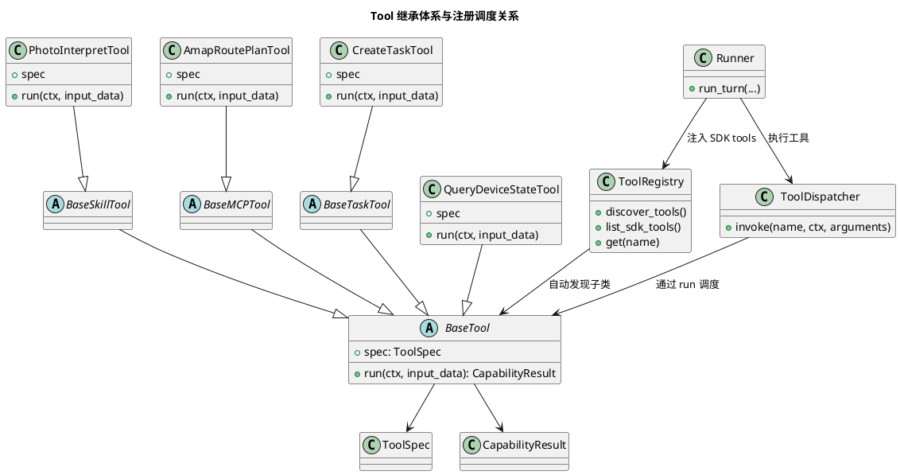

# 大模型能力扩展开发指南

## 1. 文档定位

本文档是给未参与架构设计和框架开发的开源社区开发者直接落代码用的实现指南。

本文档回答以下问题：

1. 在当前框架下，`function tool`、`skill`、`mcp`、`task` 分别应该怎么写。
2. 需要继承哪个类。
3. 需要实现哪些成员。
4. 如何完成注册。
5. 调度器如何执行。
6. 输入输出、错误、任务事件要遵守什么协议。

系统级设计请同时参考：

1. [agent-core设计.md](/Users/elio/dev/llm-project/OpenAIglassesDemo_2/doc/structure-design/agent-core设计.md)
2. [backend-task-core设计.md](/Users/elio/dev/llm-project/OpenAIglassesDemo_2/doc/structure-design/backend-task-core设计.md)
3. [agent-core与backend-task-core通知协调设计.md](/Users/elio/dev/llm-project/OpenAIglassesDemo_2/doc/structure-design/agent-core与backend-task-core通知协调设计.md)

---

## 2. 先记住最终规则

### 2.1 模型侧只有 Tool

大模型只看到统一的 `function tools`。

这意味着：

1. `function tool` 直接是 Tool。
2. `skill` 最终也必须落成 Tool。
3. `mcp` 最终也必须落成 Tool。
4. `task` 对模型不可见，模型只通过 `Task Tool` 管理任务。

### 2.2 代码侧只有一套 Tool 继承体系

当前统一采用以下继承体系：

1. `BaseTool`
2. `BaseSkillTool`
3. `BaseMCPTool`
4. `BaseTaskTool`

约束：

1. 普通 `function tool` 直接继承 `BaseTool`
2. `skill` 继承 `BaseSkillTool`
3. `mcp tool` 继承 `BaseMCPTool`
4. `task tool` 继承 `BaseTaskTool`

### 2.3 所有 Tool 统一遵守 `spec + run`

凡是 `BaseTool` 的子类，都必须至少定义两个成员：

1. `spec`
2. `run`

其中：

1. `spec` 负责声明工具元信息
2. `run` 负责执行业务逻辑

注册器只认 `spec`，调度器只认 `run`。

---

## 3. 类关系图



---

## 4. 当前目录约定

开发者扩展能力时，统一按下面目录组织代码。

```text
server/src/
  agent_core/
    context/
      models.py
      assembler.py
      session_store.py
    facade/
      agent_facade.py
    models/
      capability_models.py
    runtime/
      runner.py
    tools/
      base.py
      registry.py
      dispatcher.py
      function_tools/
      skill_tools/
      mcp_tools/
      task_tools/
  backend_task_core/
    models.py
    manager.py
    registry.py
    state_machine.py
    event_bus.py
    event_bridge.py
    scheduler.py
    tasks/
```

测试目录建议：

```text
server/test/
  unit/
    agent_core/
    backend_task_core/
  integration/
```

说明：

1. 当前仓库部分设计骨架已经存在。
2. 如果某些标准文件还没补齐，新增能力时应优先补齐标准位置，不要另起炉灶。

---

## 5. 统一协议

### 5.1 输入输出模型

所有 Tool 都必须使用 `pydantic.BaseModel` 定义输入输出。

统一要求：

1. `input_model` 使用 `BaseModel`
2. `output_model` 使用 `BaseModel`
3. `run()` 返回 `CapabilityResult`

推荐统一模型：

1. `CapabilityError`
2. `CapabilityResult`
3. `ToolSpec`
4. `TaskRuntime`
5. `TaskEvent`

### 5.2 推荐模型定义

建议放在：

`server/src/agent_core/models/capability_models.py`

```python
from __future__ import annotations

from typing import Any

from pydantic import BaseModel, Field


class CapabilityError(BaseModel):
    """统一能力错误模型。"""

    code: str = Field(description="稳定错误码")
    message: str = Field(description="日志错误信息")
    user_message: str = Field(description="面向用户的安全文案")
    retryable: bool = Field(default=False, description="是否允许重试")
    details: dict[str, Any] = Field(default_factory=dict, description="补充详情")


class CapabilityResult(BaseModel):
    """统一能力执行结果。"""

    ok: bool = Field(description="本次执行是否成功")
    data: dict[str, Any] = Field(default_factory=dict, description="成功结果")
    error: CapabilityError | None = Field(default=None, description="失败时错误")
    asset_refs: list[Any] = Field(default_factory=list, description="关联媒体资产")
    derived_artifacts: list[Any] = Field(default_factory=list, description="关联派生结果")
    task_refs: list[Any] = Field(default_factory=list, description="关联任务引用")


class ToolSpec(BaseModel):
    """Tool 元信息。"""

    name: str = Field(description="工具名称")
    description: str = Field(description="工具说明")
    input_model: type[BaseModel] = Field(description="输入模型类型")
    output_model: type[BaseModel] = Field(description="输出模型类型")
    tags: list[str] = Field(default_factory=list, description="工具标签")
    visible_to_model: bool = Field(default=True, description="是否暴露给模型")
```

### 5.3 统一校验规则

每次工具执行都必须遵守：

1. 进入 `run()` 前先校验输入
2. 返回成功结果前先校验输出
3. Task 事件发布前先构造标准事件模型

禁止：

1. 直接把未校验的 `dict` 传给工具
2. 直接把未校验的 `dict` 返回给模型
3. 自己定义随意变化的事件结构

---

## 6. 统一上下文对象

所有 Tool 都通过统一上下文对象拿运行时信息，不直接依赖全局变量。

推荐类名：

`AgentToolContext`

建议至少包含：

1. `session_id`
2. `device_id`
3. `turn_id`
4. `device_state_reader`
5. `trace_sink`
6. `asset_sink`
7. `artifact_sink`
8. `task_ref_sink`

示例：

```python
from dataclasses import dataclass
from typing import Any, Callable


@dataclass(slots=True)
class AgentToolContext:
    """工具调用上下文。"""

    session_id: str
    device_id: str
    turn_id: str
    device_state_reader: Callable[[], dict[str, Any]]
    trace_sink: Callable[[Any], None]
    asset_sink: Callable[[Any], None]
    artifact_sink: Callable[[Any], None]
    task_ref_sink: Callable[[Any], None]
```

---

## 7. BaseTool 继承体系

### 7.1 基类定义

建议在：

`server/src/agent_core/tools/base.py`

定义以下类：

```python
from __future__ import annotations

from abc import ABC, abstractmethod
from typing import ClassVar

from pydantic import BaseModel

from agent_core.models import CapabilityResult, ToolSpec


class BaseTool(ABC):
    """所有模型可见工具的统一基类。"""

    spec: ClassVar[ToolSpec]

    @abstractmethod
    def run(self, ctx, input_data: BaseModel) -> CapabilityResult:
        """执行工具逻辑。"""


class BaseSkillTool(BaseTool):
    """内部实现为固定复合流程的工具基类。"""


class BaseMCPTool(BaseTool):
    """内部依赖 MCP Server 的工具基类。"""


class BaseTaskTool(BaseTool):
    """内部依赖 backend-task-core 的工具基类。"""
```

### 7.2 子类约束

任意 Tool 子类都必须满足：

1. `spec.name` 唯一
2. `spec.input_model` 明确
3. `spec.output_model` 明确
4. `run()` 只做当前工具职责，不越层

---

## 8. 自动注册与透明调度

### 8.1 注册器应该怎么工作

`ToolRegistry` 是唯一工具注册器。

它负责：

1. 自动发现所有 `BaseTool` 子类
2. 通过 `spec` 完成注册
3. 构建 OpenAI Agents SDK 需要的 `function tools`

推荐接口：

```python
class ToolRegistry:
    """统一工具注册器。"""

    def discover_tools(self) -> None:
        """自动发现并注册所有 BaseTool 子类。"""

    def get(self, name: str):
        """按名称返回工具类或工具实例。"""

    def list_sdk_tools(self) -> list[object]:
        """返回注入 OpenAI Agents SDK 的工具列表。"""
```

### 8.2 自动注册不等于不导入模块

这里要特别说明：

Python 不能扫描“尚未 import 的类”。

所以“自动注册”的真实含义是：

1. 开发者不需要手写 `registry.register(MyTool())`
2. 但必须保证工具模块被导入

推荐做法二选一：

1. 在 `agent_core/tools/function_tools/__init__.py` 等包入口显式导入工具模块
2. 在 `ToolRegistry.discover_tools()` 中按约定目录主动 import 模块

推荐第二种。

### 8.3 调度器应该怎么工作

`ToolDispatcher` 或 `ToolGateway` 负责：

1. 输入校验
2. 输出校验
3. 错误包装
4. 调用轨迹记录
5. `asset_refs / derived_artifacts / task_refs` 回写
6. 调用具体 Tool 的 `run()`

推荐接口：

```python
class ToolDispatcher:
    """统一工具调度器。"""

    def invoke(self, *, name: str, context, arguments: dict[str, object] | None = None):
        """根据工具名调度执行。"""
```

关键约束：

1. 调度器不关心这个工具是 `Function / Skill / MCP / Task`
2. 只关心：
   - 取到工具
   - 读 `spec`
   - 调 `run`

---

## 9. 四类能力分别怎么写

## 9.1 Function Tool

### 适用场景

满足以下条件时优先使用：

1. 一次调用即可完成
2. 不依赖 MCP Server
3. 不需要后台长期运行

### 代码示例

文件建议：

`server/src/agent_core/tools/function_tools/query_device_state.py`

```python
from __future__ import annotations

from pydantic import BaseModel, Field

from agent_core.models import CapabilityResult, ToolSpec
from agent_core.tools.base import BaseTool


class QueryDeviceStateInput(BaseModel):
    """查询设备状态输入。"""

    target_device_id: str | None = Field(default=None, description="目标设备编号")


class QueryDeviceStateOutput(BaseModel):
    """查询设备状态输出。"""

    device_id: str = Field(description="设备编号")
    online: bool = Field(description="设备是否在线")
    state: str = Field(description="设备当前状态")


class QueryDeviceStateTool(BaseTool):
    """查询设备当前运行状态。"""

    spec = ToolSpec(
        name="query_device_state",
        description="查询设备当前运行状态",
        input_model=QueryDeviceStateInput,
        output_model=QueryDeviceStateOutput,
        tags=["device", "status"],
    )

    def run(self, ctx, input_data: QueryDeviceStateInput) -> CapabilityResult:
        snapshot = ctx.device_state_reader()
        result = {
            "device_id": input_data.target_device_id or ctx.device_id,
            "online": True,
            "state": str(snapshot.get("state", "unknown")),
        }
        return CapabilityResult(ok=True, data=result)
```

---

## 9.2 Skill Tool

### 适用场景

满足以下条件时使用：

1. 模型只需要一个工具名
2. 但内部需要固定编排多个步骤
3. 不需要后台长期运行

### 代码示例

文件建议：

`server/src/agent_core/tools/skill_tools/photo_interpret.py`

```python
from __future__ import annotations

from pydantic import BaseModel, Field

from agent_core.models import CapabilityResult, ToolSpec
from agent_core.tools.base import BaseSkillTool


class PhotoInterpretInput(BaseModel):
    """图片解读输入。"""

    question: str = Field(description="用户希望基于图片回答的问题")


class PhotoInterpretOutput(BaseModel):
    """图片解读输出。"""

    answer: str = Field(description="基于图片内容的回答")
    asset_id: str = Field(description="图片资产编号")


class PhotoInterpretTool(BaseSkillTool):
    """拍照并基于图片回答用户问题。"""

    spec = ToolSpec(
        name="photo_interpret",
        description="触发拍照并结合图片内容回答用户问题",
        input_model=PhotoInterpretInput,
        output_model=PhotoInterpretOutput,
        tags=["skill", "photo", "vision"],
    )

    def __init__(self, *, capture_photo_tool, vision_service) -> None:
        self._capture_photo_tool = capture_photo_tool
        self._vision_service = vision_service

    def run(self, ctx, input_data: PhotoInterpretInput) -> CapabilityResult:
        photo_result = self._capture_photo_tool.run(
            ctx,
            self._capture_photo_tool.spec.input_model(question=input_data.question),
        )
        if not photo_result.ok:
            return photo_result

        asset = photo_result.asset_refs[0]
        answer = self._vision_service.describe(asset_id=asset.asset_id, question=input_data.question)
        return CapabilityResult(
            ok=True,
            data={"answer": answer, "asset_id": asset.asset_id},
            asset_refs=photo_result.asset_refs,
            derived_artifacts=photo_result.derived_artifacts,
        )
```

说明：

1. `Skill Tool` 不再要求额外的 `SkillRegistry`
2. 复合流程直接写在 `run()` 中
3. 如果逻辑过长，可以抽私有 helper，但不要再额外造一套模型侧不可见的注册面

---

## 9.3 MCP Tool

### 适用场景

满足以下条件时使用：

1. 内部需要调用 MCP Server
2. 需要做参数转换或结果整理
3. 模型不应该直接看到 MCP Server 细节

### 代码示例

文件建议：

`server/src/agent_core/tools/mcp_tools/amap_route_plan.py`

```python
from __future__ import annotations

from pydantic import BaseModel, Field

from agent_core.models import CapabilityResult, ToolSpec
from agent_core.tools.base import BaseMCPTool


class AmapRoutePlanInput(BaseModel):
    """路线规划输入。"""

    origin: str = Field(description="起点")
    destination: str = Field(description="终点")
    mode: str = Field(default="walking", description="路线模式")


class AmapRoutePlanOutput(BaseModel):
    """路线规划输出。"""

    summary: str = Field(description="路线摘要")


class AmapRoutePlanTool(BaseMCPTool):
    """调用高德路线规划能力。"""

    spec = ToolSpec(
        name="amap_route_plan",
        description="规划从起点到终点的路线",
        input_model=AmapRoutePlanInput,
        output_model=AmapRoutePlanOutput,
        tags=["mcp", "map", "navigation"],
    )

    def __init__(self, *, amap_client) -> None:
        self._amap_client = amap_client

    def run(self, ctx, input_data: AmapRoutePlanInput) -> CapabilityResult:
        response = self._amap_client.route_plan(
            origin=input_data.origin,
            destination=input_data.destination,
            mode=input_data.mode,
        )
        return CapabilityResult(
            ok=True,
            data={"summary": response["summary"]},
        )
```

说明：

1. `MCP Tool` 默认不需要 `McpRegistry`
2. 只有当 MCP 方法很多、需要统一连接生命周期管理时，才额外抽内部 client 或 adapter 层
3. 即使抽了 adapter，模型看到的仍然只是 Tool

---

## 9.4 Task Tool

### 适用场景

满足以下条件时使用：

1. 需要创建后台任务
2. 需要查询状态、取消任务
3. 需要任务完成后回流 `agent-core`

### 设计约束

`Task Tool` 默认不应该按任务类型无限扩张。

推荐优先保留少数通用管理工具：

1. `create_task`
2. `query_task_status`
3. `cancel_task`
4. 按需补 `append_task_input`

任务方向的主要扩展点应该是新增 `BaseTask` 子类，而不是不断新增 `CreateXxxTaskTool`。

### 代码示例

文件建议：

`server/src/agent_core/tools/task_tools/create_task.py`

```python
from __future__ import annotations

from typing import Any

from pydantic import BaseModel, Field

from agent_core.context.models import TaskRef
from agent_core.models import CapabilityResult, ToolSpec
from agent_core.tools.base import BaseTaskTool


class CreateTaskInput(BaseModel):
    """创建后台任务输入。"""

    task_type: str = Field(description="任务模板名称，例如 timer_task")
    input: dict[str, Any] = Field(default_factory=dict, description="任务输入参数")


class CreateTaskOutput(BaseModel):
    """创建后台任务输出。"""

    task_id: str = Field(description="任务编号")
    task_type: str = Field(description="任务类型")
    state: str = Field(description="任务状态")
    summary: str = Field(description="任务摘要")


class CreateTaskTool(BaseTaskTool):
    """创建后台任务。"""

    spec = ToolSpec(
        name="create_task",
        description="创建一个后台任务",
        input_model=CreateTaskInput,
        output_model=CreateTaskOutput,
        tags=["task"],
    )

    def __init__(self, *, task_manager) -> None:
        self._task_manager = task_manager

    def run(self, ctx, input_data: CreateTaskInput) -> CapabilityResult:
        runtime = self._task_manager.create_task(
            task_type=input_data.task_type,
            session_id=ctx.session_id,
            device_id=ctx.device_id,
            input_data=input_data.input,
        )
        task_ref = TaskRef(
            task_id=runtime.task_id,
            task_type=runtime.task_type,
            state=runtime.state,
            summary=f"已创建任务 {runtime.task_type}",
        )
        return CapabilityResult(
            ok=True,
            data={
                "task_id": runtime.task_id,
                "task_type": runtime.task_type,
                "state": runtime.state,
                "summary": task_ref.summary,
            },
            task_refs=[task_ref],
        )
```

说明：

1. `BaseTaskTool` 直接调用 `TaskManager`
2. 不再要求额外包一层 `TaskGateway`
3. 默认优先复用通用 `Task Tool`，任务扩展优先通过新增 `BaseTask` 模板完成
4. 如果后续确实需要边界适配层，再补，但不要作为第一阶段必需抽象
5. `Task` 模板、`TaskManager`、设备协作和事件回流的细化开发方式，详见 [backend-task-core开发指南.md](/Users/elio/dev/llm-project/OpenAIglassesDemo_2/doc/structure-design/backend-task-core开发指南.md)

---

## 10. Task 模板怎么写

注意：

1. `Task Tool` 是模型可见能力
2. `Task` 模板是 `backend-task-core` 内部后台执行模板

### 10.1 推荐基类

建议在：

`server/src/backend_task_core/tasks/base.py`

定义：

```python
from __future__ import annotations

from abc import ABC, abstractmethod
from typing import ClassVar


class BaseTask(ABC):
    """后台任务模板统一基类。"""

    spec: ClassVar[object]

    @abstractmethod
    def run(self, runtime, services) -> None:
        """执行后台任务逻辑。"""
```

### 10.2 `timer_task` 示例

文件建议：

`server/src/backend_task_core/tasks/timer_task.py`

```python
class TimerTask(BaseTask):
    """最小计时器任务模板。"""

    spec = {
        "task_type": "timer_task",
        "version": "v1",
        "description": "计时器后台任务",
        "supports_cancel": True,
    }

    def run(self, runtime, services) -> None:
        duration_seconds = int(runtime.input["duration_seconds"])
        services.scheduler.sleep(duration_seconds)
        services.manager.mark_completed(
            task_id=runtime.task_id,
            result={"summary": f"{duration_seconds} 秒计时已结束"},
        )
```

说明：

1. `TaskManager.create_task(task_type=..., input_data=...)` 应根据 `task_type` 选择对应 `BaseTask` 模板
2. 新增一种后台能力时，优先新增新的 `BaseTask` 子类
3. 只有当模型侧确实需要更强约束入口时，才额外新增专用 `Task Tool`

---

## 11. 任务模型与事件协议

### 11.1 TaskRuntime

建议至少包含：

1. `task_id`
2. `task_type`
3. `session_id`
4. `device_id`
5. `state`
6. `input`
7. `context`
8. `result`
9. `error`
10. `created_at_ms`
11. `updated_at_ms`

说明：

1. `TaskRuntime.state` 是框架统一维护的生命周期状态。
2. 社区开发者不应在 `Task` 模板中手工维护该字段。
3. 任务自己的业务步骤应写在 `context["phase"]` 或 `context["step"]` 中。

### 11.2 第一阶段最小任务状态

建议先只维护：

1. `scheduled`
2. `running`
3. `completed`
4. `cancelled`
5. `failed`

这些状态应由框架统一维护，不应由社区开发者手工维护。

### 11.3 TaskEvent

建议至少包含：

1. `event_id`
2. `event_name`
3. `task_id`
4. `task_type`
5. `session_id`
6. `device_id`
7. `priority`
8. `payload`

统一要求：

1. Task 完成后必须发布标准 `TaskEvent`
2. Task 结果默认先回流 `agent-core`
3. 直发端侧通知必须走统一通知协调模块

---

## 12. 开发者应该怎么接入框架

### 12.1 新增一个 Function Tool

步骤：

1. 在 `agent_core/tools/function_tools/` 下新建文件
2. 写 `Input` / `Output` 模型
3. 写 `BaseTool` 子类
4. 定义 `spec`
5. 实现 `run()`
6. 确保模块能被 `ToolRegistry.discover_tools()` 导入
7. 补测试

### 12.2 新增一个 Skill Tool

步骤：

1. 在 `agent_core/tools/skill_tools/` 下新建文件
2. 写 `BaseSkillTool` 子类
3. 在 `run()` 里实现固定复合流程
4. 确保模块能被自动发现
5. 补测试

### 12.3 新增一个 MCP Tool

步骤：

1. 在 `agent_core/tools/mcp_tools/` 下新建文件
2. 写 `BaseMCPTool` 子类
3. 在 `run()` 里调用 MCP client / adapter
4. 做参数转换与结果整理
5. 确保模块能被自动发现
6. 补测试

### 12.4 新增一个 Task Tool

步骤：

1. 先判断现有通用 `Task Tool` 是否已经够用
2. 只有确实需要新的模型侧入口时，才在 `agent_core/tools/task_tools/` 下新建文件
3. 写 `BaseTaskTool` 子类
4. 在 `run()` 里调用 `TaskManager`
5. 返回 `TaskRef` 或任务结果
6. 确保模块能被自动发现
7. 补测试

### 12.5 新增一个 Task 模板

步骤：

1. 在 `backend_task_core/tasks/` 下新建文件
2. 写 `BaseTask` 子类
3. 定义 `spec`
4. 实现 `run()`
5. 确保 `TaskManager.create_task(task_type=...)` 能解析到该模板
6. 在 `backend_task_core/registry.py` 中自动发现或集中导入
7. 补任务状态和事件测试

---

## 13. Runner / Facade 应该怎么装配

运行期依赖应分开看：

1. `Runner` 只依赖 `ToolRegistry`
2. `Runner` 只依赖 `ToolDispatcher`
3. `AgentFacade` 或其他装配层在初始化阶段负责拿到 `TaskManager`、设备网关、MCP client 等底层依赖

建议装配流程：

1. 初始化 `TaskManager`
2. 初始化设备网关、MCP client、视觉服务等其他底层依赖
3. 初始化 `ToolRegistry`
4. 由装配层把 `TaskManager` 和其他依赖注入各个 Tool
5. 调用 `ToolRegistry.discover_tools()`
6. 初始化 `ToolDispatcher`
7. `Runner` 通过 `ToolRegistry.list_sdk_tools()` 把工具注入 OpenAI Agents SDK
8. `Runner` 通过 `ToolDispatcher.invoke(...)` 执行具体工具

不要在 `Runner` 里写某个具体工具的特判装配逻辑，也不要让 `Runner` 直接依赖 `TaskManager`。

---

## 14. 测试要求

每次新增能力都至少补两类测试。

### 14.1 单元测试

至少覆盖：

1. 输入校验
2. 输出校验
3. 成功路径
4. 失败路径

### 14.2 集成测试

至少覆盖：

1. 自动注册是否成功
2. 模型是否能命中该 Tool
3. 调度器是否能正确执行 `run()`
4. 如果是 Task，是否能完成任务创建和事件回流

### 14.3 跨设备联调说明

如果能力涉及：

1. 相机
2. 音频播放
3. 任务完成通知
4. 手机协同

必须额外补联调说明，至少写清：

1. 服务端如何启动
2. 设备端如何连接
3. 如何人工触发能力
4. 预期日志和消息是什么

---

## 15. 不允许的写法

以下写法禁止：

1. 直接把 `Skill` 暴露给模型
2. 直接把 MCP Server 暴露给模型
3. 直接把 `Task` 暴露给模型
4. 在 `Runner` 里手写 `if tool_name == ...` 的业务分支
5. 在 Tool 中偷偷启动长期后台线程
6. 在 `agent-core` 里维护任务内部状态
7. 让开发者自己到多个注册器里手工逐个注册子类

---

## 16. 开发者自检清单

提交代码前，请至少检查：

1. 这个能力最终是不是 `BaseTool` 子类？
2. 是否定义了 `spec`？
3. 是否实现了 `run()`？
4. 输入输出是否都有 `BaseModel`？
5. 是否返回 `CapabilityResult`？
6. 是否能被自动发现？
7. 如果涉及任务，是否先判断现有通用 `Task Tool` 已足够？
8. 如果涉及任务完成，是否发布标准 `TaskEvent`？
9. 如果新增了任务类型，是否主要通过新增 `BaseTask` 模板完成？
10. 是否补了单元测试和集成测试？

---

## 17. 最终结论

1. 当前框架下，开发者扩展任何模型能力，最终都必须落成 `BaseTool` 体系下的子类。
2. `Function Tool`、`Skill Tool`、`MCP Tool`、`Task Tool` 只是 `BaseTool` 的不同子类型，不是四套平行调用面。
3. 注册器统一通过 `spec` 自动发现和注册工具，调度器统一通过 `run()` 透明执行工具。
4. `Task` 方向的主要扩展点是新增 `BaseTask` 模板，模型侧应优先只保留少数通用 `Task Tool`。
5. `Task` 与 `TaskRuntime` 继续保留在 `backend-task-core`，只通过 `Task Tool` 暴露管理能力。
6. `Runner` 不直接依赖 `TaskManager`，`TaskManager` 只应在装配阶段注入给相关 `Task Tool`。
7. 其他开发者在该框架下扩展能力时，不应绕过 `BaseTool` 体系、自动注册机制和统一协议。
