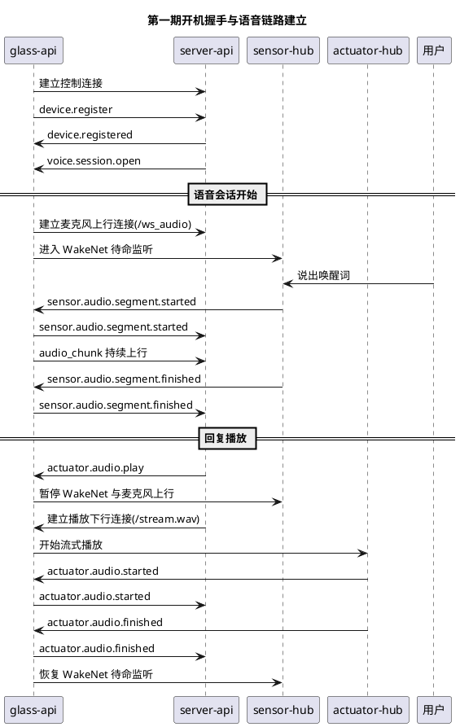

# 设备握手与注册协议设计

## 1. 目标

本设计对应 [第一期功能开发计划.md](/Users/elio/dev/llm-project/OpenAIglassesDemo_2/doc/restriction/第一期功能开发计划.md) 的第 1 项。

第一期这里只解决最小问题：

- 眼镜启动后先和服务器建立一条控制连接
- 眼镜在控制连接上完成 `device.register`
- 服务器确认这条连接已经对应到某个 `device_id`
- 后续语音链路知道何时建立麦克风上行连接，何时建立播放下行连接

第一期不追求复杂配对流程，也不追求完整设备状态中心。

## 2. 第一期开销最小的模型

第一期只保留三类连接：

1. 控制连接
   - 眼镜启动后立即建立
   - 用于注册、心跳、控制消息
2. 麦克风音频上行连接
   - 只在语音会话打开后建立
   - 用于眼镜向服务器发送 `audio_chunk`
3. 播放音频下行连接
   - 只在服务器准备播报回复时建立
   - 用于服务器向眼镜持续下发回复音频

这样做的目标很直接：

- 启动流程简单
- 运行期容易排错
- 先把语音对话主链路打通

真实媒体流的帧格式见 [媒体流传输格式设计.md](/Users/elio/dev/llm-project/OpenAIglassesDemo_2/doc/structure-design/媒体流传输格式设计.md)。

## 3. 三类连接的时机

### 3.1 控制连接

时机：

- 眼镜启动完成后立即建立

建议承载：

- WebSocket 长连接

用途：

- `device.register`
- `device.registered`
- `device.heartbeat`
- `voice.session.open`
- `sensor.audio.segment.started`
- `sensor.audio.segment.finished`
- `actuator.audio.play`
- `actuator.audio.started`
- `actuator.audio.finished`

规则：

- 没有控制连接，就不能开始任何业务
- 控制连接断开后，当前语音会话直接视为失败

### 3.2 麦克风音频上行连接

时机：

- 服务器下发 `voice.session.open` 后建立

建议承载：

- 沿用旧项目音频上行流通道，例如 `/ws_audio`

规则：

- 这条连接不用在设备启动时就创建
- 只有当语音会话已经打开，才需要建立这条连接
- 建立后，设备进入待命监听
- 只有 WakeNet 唤醒成功并进入当前采集窗口后，才真正发送 `audio_chunk`
- 一旦开始回复播放，必须暂停这条上行链路上的真实音频发送
- 当 `voice.session.close` 或连接异常时，关闭这条上行连接

### 3.3 播放音频下行连接

时机：

- 服务器准备开始播报模型回复时建立

建议承载：

- 沿用旧项目音频下行流通道，例如 `/stream.wav`

规则：

- 这条连接不用在设备启动时就创建
- 也不用在 `voice.session.open` 时提前创建
- 收到 `actuator.audio.play` 后，再建立或打开这条下行播放流
- 播放期间设备必须暂停 WakeNet 和麦克风上行，避免喇叭串音
- 播放完成或播放失败后，关闭这条下行连接
- 下行播放流关闭后，设备恢复待命监听

第一期这样最简单，也最符合“按需建立数据面连接”的目标。

## 4. 最小消息集

## 4.1 `device.register`

方向：

- 眼镜 -> 服务器

用途：

- 告诉服务器“这条控制连接对应哪台设备”

第一期建议 payload：

```json
{
  "device_id": "glass-001",
  "device_type": "glass",
  "firmware_version": "0.1.0",
  "auth": {
    "mode": "pair_token",
    "pair_token": "pair_xxx"
  }
}
```

第一期不用把能力声明做得很重，能确认设备身份即可。

## 4.2 `device.registered`

方向：

- 服务器 -> 眼镜

用途：

- 确认注册成功
- 告诉眼镜可以进入业务可用状态

建议 payload：

```json
{
  "device_id": "glass-001",
  "heartbeat_interval_ms": 5000
}
```

## 4.3 `device.register.failed`

方向：

- 服务器 -> 眼镜

用途：

- 明确告诉设备注册失败，不进入业务阶段

## 4.4 `device.heartbeat`

方向：

- 眼镜 -> 服务器

用途：

- 保持控制连接在线

第一期可以只发最简单的 payload：

```json
{
  "device_id": "glass-001"
}
```

## 5. 第一期服务端规则

第一期只需要这几条简单规则：

1. 控制连接建立后，等待 `device.register`
2. 注册成功后，建立 `device_id -> control_connection` 映射
3. 注册成功前，不下发 `voice.session.open`
4. 眼镜注册成功后，由服务端自动发起一次 `voice.session.open`
5. 同一个 `device_id` 重连时，新连接覆盖旧连接；新连接再次注册成功后，服务端重新发起 `voice.session.open`
6. 心跳超时后，把设备视为离线

第一期不需要：

- 复杂会话恢复
- 复杂设备能力协商
- 单独的设备状态中心
- 注册前的多轮挑战应答

## 6. 与语音链路的关系

第一期在语音对话前，只检查两件事：

1. 控制连接还活着
2. 设备已经收到 `device.registered`

只要这两点成立，服务器就应主动下发 `voice.session.open`，而不是停留在“允许发起但没人发起”的状态。

不要在第一期引入更复杂的前置检查，例如：

- 最近一次 `device.state.report`
- 音频输入状态快照
- 音频输出状态快照
- 复杂资源占用检查

这些都可以后续再加。

## 7. 启动与语音链路时序



## 8. 第一版实现边界

第一版只需要做到：

1. 启动后先建立控制连接
2. 在控制连接上完成 `device.register`
3. 注册成功后由服务端自动发起 `voice.session.open`
4. `voice.session.open` 时建立麦克风音频上行连接
5. `actuator.audio.play` 时建立播放音频下行连接

做到这一步，就足够支撑第一期语音对话主链路。
