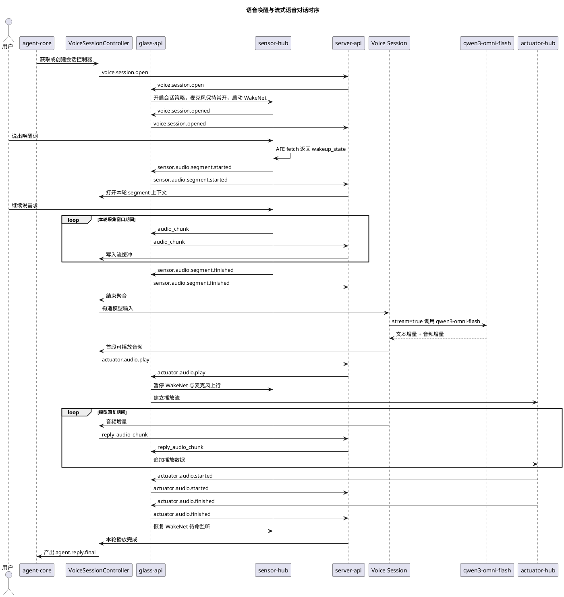

# 语音对话协议与时序设计

## 1. 目标

本设计对应第一期第 2 项：

- 眼镜与服务器基于大模型的语音对话
- 不支持用户打断
- 使用眼镜端麦克风录音
- 使用 ESP32-S3 上的 ESP-SR WakeNet 进行语音唤醒
- 使用 `qwen3-omni-flash`

本设计明确规定：

- 控制消息使用统一 envelope
- 音频数据面继续沿用旧项目的流式传输方式
- 麦克风在待命监听与当前轮采集阶段开启，在回复播放阶段暂停
- 用户语音上行是流式传输，模型回复音频下行也是流式传输
- 若与旧项目保持一致，音频上行可继续走 `/ws_audio`，回复音频下行可继续走 `/stream.wav` 一类持续流通道
- 眼镜侧采用 ESP-SR 的 AFE + WakeNet 方案，本地持续 `feed/fetch` 音频并根据 `wakeup_state` 进入采集流程
- 设备握手与注册完成前，不允许启动语音会话

## 2. 核心流程

### 2.1 总体思路

1. 设备先完成启动后的握手注册，进入业务可用状态。
2. 注册成功后，服务端为该设备创建或获取一条 `VoiceSessionController`。
3. `VoiceSessionController` 通过 `server-api` 自动向眼镜下发 `voice.session.open`，建立逻辑语音会话。
4. 眼镜侧 `sensor-hub` 进入待命监听状态，并在本地运行 AFE + WakeNet。
5. 用户说出唤醒词后，WakeNet 触发，眼镜发送 `sensor.audio.segment.started`。
6. 眼镜进入本轮采集窗口，经既有音频上行流持续发送 `audio_chunk`。
7. 当本地端点检测判定本轮用户输入结束，眼镜发送 `sensor.audio.segment.finished`。
8. `VoiceSessionController` 聚合该轮音频并调用 `qwen3-omni-flash`。
9. 服务端一边接收模型流式音频输出，一边向眼镜下发 `actuator.audio.play` 并持续回推回复音频流。
10. 回复播放期间，眼镜暂停 WakeNet 和麦克风上行。
11. 眼镜侧 `actuator-hub` 播放完毕后回 `actuator.audio.finished`，随后恢复待命监听。

### 2.2 与旧项目的关键区别

旧项目：

- 麦克风基本常开
- 服务端依赖云端实时 ASR 的句子结束
- 普通对话与导航状态切换高度耦合

新方案：

- 保留旧项目的流式音频传输方式
- 保留待命监听模式
- 由本地 WakeNet 决定“什么时候触发一轮语音采集”
- 唤醒成功后，设备进入本轮采集窗口并向服务器持续发流
- 本地通过端点检测决定“什么时候结束这一轮用户输入”
- 回复播放期间暂停麦克风和 WakeNet，避免喇叭串音
- 模型调用和播放控制从旧项目的隐式全局状态，迁移为新架构里的显式会话与控制消息
- 模型回复音频不落整文件后再播，而是边生成边下发边播放

### 2.3 启动前置条件

`voice.session.open` 只能在以下条件满足后发起：

1. 设备已收到 `device.registered`
2. 控制连接当前仍然在线

第一期中，这个动作不需要用户额外触发。设备注册成功后，服务端就应自动发起一次 `voice.session.open`。

对应的握手注册过程见 [设备握手与注册协议设计.md](/Users/elio/dev/llm-project/OpenAIglassesDemo_2/doc/structure-design/设备握手与注册协议设计.md)。

## 3. 消息、流与组件设计

## 3.1 打开语音会话

消息名：

- `voice.session.open`

示例 payload：

```json
{
  "sample_rate": 16000,
  "channels": 1,
  "codec": "pcm16",
  "wake_word": {
    "engine": "esp-sr-wakenet",
    "model": "WakeNet9",
    "enabled": true,
    "max_capture_ms": 10000,
    "pre_roll_ms": 200
  },
  "endpoint": {
    "trailing_silence_ms": 800,
    "max_capture_ms": 10000
  },
  "playback": {
    "mode": "stream",
    "format": "pcm16",
    "interrupt_policy": "forbid"
  }
}
```

说明：

- 按 ESP-SR 官方文档，WakeNet 工作在 AFE 内部，默认通过 `fetch` 结果中的 `wakeup_state` 返回
- 音频输入格式按官方要求采用 `16 kHz`、单声道、signed 16-bit

## 3.2 用户语音上行流

数据流类型：

- `audio_chunk`

建议元数据：

```json
{
  "stream_id": "stream_01J...",
  "segment_id": "seg_01J...",
  "sample_rate": 16000,
  "channels": 1,
  "codec": "pcm16",
  "chunk_index": 12,
  "is_final": false
}
```

建议技术细节：

- 物理通道继续沿用旧项目音频上行通道，例如 `/ws_audio`
- `audio_chunk` 不放在 `ControlMessage.payload` 里，而是走独立二进制 `MediaFrame`
- 每个 `audio_chunk` 的 payload 为原始 `pcm16 little-endian` 字节
- 建议每块时长 `20ms`
- 对应 `16 kHz` 单声道时，每块约 `320` 个采样点，即 `640 bytes`
- `stream_id` 对应当前语音会话，`segment_id` 对应本轮唤醒后的单次输入
- `sensor.audio.segment.started` 发出后才允许发送当前 `segment_id` 的 `audio_chunk`

详细帧格式见 [媒体流传输格式设计.md](/Users/elio/dev/llm-project/OpenAIglassesDemo_2/doc/structure-design/媒体流传输格式设计.md)。

## 3.3 用户语音结束判定方案

本设计不把“静音检测缩写术语”作为协议概念暴露到消息层，但设备侧仍然需要本地端点检测来判断这一轮用户输入何时结束。

建议实现方式：

1. WakeNet 触发后，设备进入本轮采集窗口
2. `sensor-hub` 持续从 AFE `fetch` 获取处理后的音频结果
3. 本地端点检测依据 AFE 返回的人声活动状态，统计尾部静音时长
4. 当尾部静音达到 `trailing_silence_ms`，认为用户本轮输入结束
5. 若达到 `max_capture_ms` 仍未结束，也必须强制收口

需要强调：

- 这里的端点检测是设备内部实现细节
- 协议层只暴露 `sensor.audio.segment.started` 和 `sensor.audio.segment.finished`
- 服务端不再承担“根据持续上行流判断用户何时说完”的职责

## 3.4 本轮采集结束

消息名：

- `sensor.audio.segment.finished`

建议 payload：

```json
{
  "stream_id": "stream_01J...",
  "segment_id": "seg_01J...",
  "duration_ms": 3420,
  "bytes": 109440,
  "finish_reason": "endpoint_detected"
}
```

`finish_reason` 建议枚举：

- `endpoint_detected`
- `max_capture`
- `cancelled`
- `session_close`

## 3.5 麦克风与喇叭互斥策略

第一期不支持打断，设备必须严格按半双工工作。

### 3.5.1 原则

- 设备处于“听”或“说”两种主状态之一
- 播放回复期间，WakeNet 和麦克风上行都必须暂停
- 播放结束后，才能恢复待命监听

### 3.5.2 麦克风开启时机

麦克风处于可用状态的时机：

1. `voice.session.opened` 之后
2. 当前没有回复播放任务
3. 设备处于 `wake_word_listening` 或 `segment_active`

第一期建议：

- 注册成功并收到 `voice.session.open` 后，建立 `/ws_audio`
- 麦克风物理上可以保持初始化完成
- 但只有在 `wake_word_listening` 和 `segment_active` 这两个阶段才允许继续 feed/fetch 与上行音频

### 3.5.3 麦克风关闭时机

麦克风必须暂停的时机：

1. `sensor.audio.segment.finished` 发出后
2. `actuator.audio.play` 到来后
3. 整个回复播放期间
4. `voice.session.close` 或连接异常时

第一期建议实现成两层动作：

- 逻辑关闭
  - 停止产生新的 `audio_chunk`
  - 停止接受新的 WakeNet 触发
- 硬件/采集侧暂停
  - 暂停麦克风采集或暂停 AFE feed

如果设备侧暂停硬件采集成本较高，也至少要做到逻辑关闭，不能让喇叭播报再次触发唤醒。

### 3.5.4 恢复监听时机

只有在下面时刻，才恢复 WakeNet 和麦克风监听：

1. 收到并处理完 `actuator.audio.finished`
2. 当前播放下行连接已关闭或流已耗尽
3. 控制器状态回到 `listening`

恢复后设备重新进入：

- `wake_word_listening`

### 3.5.5 推荐时序

推荐半双工时序如下：

1. `voice.session.opened`
   - 建立 `/ws_audio`
   - 开始待命监听
2. `sensor.audio.segment.started`
   - 进入当前轮采集
3. `sensor.audio.segment.finished`
   - 立即停止继续上行
   - 暂停 WakeNet
4. `actuator.audio.play`
   - 建立播放下行流
   - 麦克风保持关闭
5. `actuator.audio.finished`
   - 关闭播放流
   - 恢复 WakeNet
   - 回到待命监听

## 3.6 agent-core 与 VoiceSessionController

`agent-core` 和 `VoiceSessionController` 的详细设计已独立到：

- [agent-core设计.md](/Users/elio/dev/llm-project/OpenAIglassesDemo_2/doc/structure-design/agent-core设计.md)

这里只保留和语音链路直接相关的结论：

- 第一期第 2 项不以前置完整 `agent-core` 为条件
- 每台眼镜一个 `VoiceSessionController`
- 注册成功后自动进入语音待命
- 每次唤醒只处理一轮用户输入
- 回复播放完成后回到待命状态

## 3.7 调用大模型的详细技术方案

服务端内部：

- 聚合音频
- 调用 `qwen3-omni-flash`
- 接收流式文本与流式音频输出
- 把流式音频直接转发到设备播放链路

建议方案：

1. `VoiceSessionController` 将当前 `segment_id` 的 `audio_chunk` 聚合为完整 `wav`
2. 通过阿里云百炼 OpenAI 兼容接口调用 `qwen3-omni-flash`
3. 使用流式响应，不能等整轮模型结果结束后再下发播放
4. 请求输出模态设置为 `["text","audio"]`
5. 音频输出配置为 `audio={"voice":"Cherry","format":"wav"}`
6. 思考模式关闭，因为 `Qwen3-Omni-Flash` 在思考模式下不支持输出音频

建议请求结构：

```json
{
  "model": "qwen3-omni-flash",
  "stream": true,
  "modalities": ["text", "audio"],
  "audio": {
    "voice": "Cherry",
    "format": "wav"
  },
  "messages": [
    {
      "role": "system",
      "content": "你是眼镜上的中文语音助手，请用简短口语回答。"
    },
    {
      "role": "user",
      "content": [
        {
          "type": "input_audio",
          "input_audio": {
            "data": "<base64-wav>",
            "format": "wav"
          }
        }
      ]
    }
  ]
}
```

实现说明：

- 服务端调用地址建议使用百炼 OpenAI 兼容入口 `https://dashscope.aliyuncs.com/compatible-mode/v1`
- 语音输入在服务端聚合后再上传给模型，当前阶段不直接把设备音频流透传到模型
- 文本输出可同时用于日志、字幕或后续对话上下文维护

来源：

- https://help.aliyun.com/zh/model-studio/user-guide/qwen-omni

## 3.8 模型回复与流式下行播放

控制消息：

- `actuator.audio.play`

下行数据流类型建议：

- `reply_audio_chunk`

示例 payload：

```json
{
  "mode": "stream",
  "stream_id": "stream_reply_01J...",
  "format": "pcm16",
  "sample_rate": 16000,
  "channels": 1,
  "interrupt_policy": "forbid"
}
```

建议技术细节：

- 服务端在收到模型第一段可播放音频后立即发送 `actuator.audio.play`
- `reply_audio_chunk` 不放在 `ControlMessage.payload` 里，而是走独立二进制 `MediaFrame`
- 回复音频数据面第一版继续沿用旧项目下行流式通道 `/stream.wav`
- 第一版不强制把回复下行改成 WebSocket；`/stream.wav` 仍是播放数据面的物理承载
- 模型输出的 Base64 音频块在服务端解码后，统一转成连续 `pcm16le/16kHz/mono` 后再向设备回推
- 眼镜侧 `actuator-hub` 收到首段可播放数据后立即开始播报
- 只有模型流结束且设备播放缓冲耗尽后，眼镜才发送 `actuator.audio.finished`

详细帧格式见 [媒体流传输格式设计.md](/Users/elio/dev/llm-project/OpenAIglassesDemo_2/doc/structure-design/媒体流传输格式设计.md)。

## 4. 按主体划分的状态设计

### 4.1 眼镜侧 `sensor-hub` 唤醒与采集子状态

建议状态：

- `idle`
- `wake_word_listening`
- `wake_word_triggered`
- `segment_active`
- `segment_closing`
- `suspended_for_playback`

约束：

- 麦克风物理上一直处于可采集状态
- `idle`、`wake_word_listening`、`wake_word_triggered`、`suspended_for_playback` 不要求单独持久化，只是实现侧瞬时工作态
- `wake_word_listening` 阶段不向服务器发送当前轮会话音频块
- 只有 `segment_active` 才向服务器发送 `audio_chunk`
- `segment_closing` 表示本地端点检测已满足收口条件，准备发送 `sensor.audio.segment.finished`
- `suspended_for_playback` 表示回复播报期间暂停 WakeNet、暂停麦克风上行

### 4.2 眼镜侧 `actuator-hub` 播放子状态

建议状态：

- `idle`
- `buffering`
- `playing`
- `interrupted`

约束：

- 本阶段不支持用户语音打断播放
- 高优先级系统动作是否可打断，交由 `actuator-hub` 统一策略决定
- `finished` 通过事件表达，不单独保留为长期状态
- `buffering` 表示已收到 `actuator.audio.play`，但还在等待首段可播放数据
- `playing` 期间设备侧必须保持麦克风暂停

### 4.3 服务器侧 `VoiceSession` 会话实例状态

建议状态：

- `opened`
- `receiving_segment`
- `model_running`
- `reply_streaming`
- `replying`
- `closed`
- `failed`

说明：

- `receiving_segment` 属于单个语音会话实例状态，不是服务器全局状态
- 服务器全局只维护多个 `VoiceSession` 实例及其索引关系
- 第一阶段这几个状态建议只保存在内存，不要求单独持久化
- `reply_streaming` 表示模型已开始返回音频，服务端正在向设备持续推送下行播放流

### 4.4 服务器侧 `server-api` 连接状态

建议状态：

- `connected`
- `reconnecting`
- `closed`

## 5. 服务端聚合要求

服务器侧应新增一层独立语音会话编排，而不是把逻辑散在 WebSocket handler 里。

但这层编排不应做成通用状态机框架，第一期只需要维护最小运行态。

建议职责：

- 接收 `voice.session.open`
- 建立 `stream_id` 与 `segment_id` 上下文
- 逐块拼装音频
- 等待 `sensor.audio.segment.finished`
- 转成模型输入格式
- 调用 `qwen3-omni-flash`
- 在下发 `actuator.audio.play` 前要求设备暂停 WakeNet 与麦克风上行
- 在收到模型第一段音频时下发 `actuator.audio.play`
- 持续转发模型音频流到下行播放通道
- 等待播放完成事件
- 在收到 `actuator.audio.finished` 后允许设备恢复待命监听

需要强调：

- 这里不改变旧项目的物理传输方式
- 改变的是“谁来管理语义”和“谁来维护会话状态”
- 第一阶段只需要维护：当前连接表、活跃语音会话表、当前播放任务

## 6. 时序图



## 7. 错误与边界

### 7.1 设备侧错误

- WakeNet 初始化失败
- AFE 初始化失败
- 本地端点检测异常
- 语音片段超过上限
- 上传中断
- 麦克风采集异常

### 7.2 服务端错误

- `stream_id` 不存在
- 音频格式不合法
- 音频聚合不完整
- 模型调用超时
- 回复播放失败

### 7.3 处理建议

- 任何失败都必须回 `voice.session.closed`、`actuator.audio.state` 或 `agent.reply.final` 这类结构化结果
- 不能只打日志
- 不能只靠连接断开表达失败

## 8. 最小落地建议

第一版先不要做：

- 中途打断
- 多设备抢占麦克风
- 历史上下文长记忆

第一版只需要做到：

1. 麦克风常开 + 本地 WakeNet 唤醒
2. 唤醒成功后按段发流
3. 本地端点检测结束后触发模型调用
4. 模型回复继续使用流式下行播放
5. 全链路至少带 `session_id`、`stream_id`、`segment_id`
6. `trace_id` 推荐带，但第 1 版可以按需补齐
7. 普通语音对话默认不要求 `task_id`

做到这一步，就已经满足第一期第 2 项的主验收目标。
