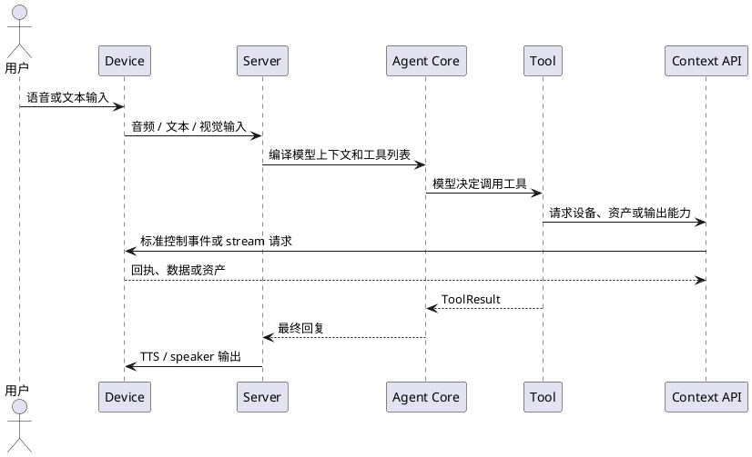

# 开发者总览

`realtime-agent` 是一个面向实时语音、视觉输入和多设备协作的 Agent 开发框架。它把大模型对话、工具调用、后台任务、设备能力和运行排障组织成一套可扩展的 Server SDK、Device SDK 和通讯协议。

如果你想做的不只是一个网页聊天机器人，而是一个可以听、说、看、调用设备、调度长流程任务的实时 AI 应用，这个项目可以作为基础框架。

## 1. 项目是什么

`realtime-agent` 的核心目标是帮助开发者更快做出可以在真实设备上使用的实时 Agent 应用。

很多 Agent 框架适合构建文本聊天、网页助手或后端工作流。但当应用进入智能眼镜、手机、浏览器摄像头、ESP32 或其他端侧设备时，问题会从“模型如何回答”变成“实时交互如何稳定运行、设备能力如何接入、业务能力如何扩展、效果如何持续优化”。

`realtime-agent` 面向的就是这类实时 Agent 应用。它希望让开发者先跑通一个可用骨架，再围绕自己的产品场景逐步扩展：

- 实时音视频对话：如何快速跑起一个会听、会说、能看图的 Agent，并处理实时连接、低延迟输出、用户打断、输出恢复和对话中的视频 / 图片采集。
- 工具和任务调用：如何让 Agent 在对话中调用自己的业务能力，并把持续运行的流程做成后台任务，而不是塞进一次函数调用里。
- 设备开发：如何接入自己的设备，把摄像头、麦克风、播放、震动、屏幕或其他端侧能力提供给 Agent 使用。
- 链路优化：如何优化模型 provider、提示词、上下文、音视频处理和运行产物，让效果、延迟、稳定性和可排障能力可以持续改进。

为了支撑这些场景，项目提供了已经打通的 Server SDK、Device SDK、示例应用和通讯协议。SDK 使用者不需要一开始就理解所有内部模块；更实际的方式是按自己的目标选择开发路径。

从开发者视角，可以把项目理解成三条主要路径：

1. 做 Agent 应用：编写 Tool、Task 和应用配置，让 Agent 获得新的业务能力。
2. 接入端侧设备：使用 Device SDK 声明设备能力，把真实摄像头、麦克风、播放、震动、屏幕或其他端侧能力接进来。
3. 优化模型链路：调整提示词、上下文、provider、ASR、TTS、视觉模型和 realtime 音频模型，让应用在延迟、效果和稳定性之间取得更好的平衡。

这也是项目最重要的价值：它不是只提供一个 demo，而是提供一套可运行、可扩展、可排障的实时 Agent 应用骨架。开发者可以先用示例验证完整链路，再替换其中的工具、任务、设备、提示词和模型链路。

## 2. 已支持的产品能力

### 2.1 实时音视频对话

项目已经支持实时语音对话，并可以把视觉输入接入对话链路。典型链路包括：

```text
sensor.mic -> ASR -> VisionRealtimeAgentCore -> Tool -> Streaming TTS -> actuator.speaker
```

这条链路适合使用视觉语言模型完成“听用户说话、必要时看图、调用工具、再用语音回答”的应用。

项目也支持原生实时音频模型链路：

```text
sensor.mic -> OmniRealtimeAgentCore -> assistant_audio.delta -> actuator.speaker
```

这条链路适合接入可以直接处理音频输入输出的实时模型。Server 侧会把模型音频 delta 映射到统一的播放和运行产物体系里，避免上层应用直接依赖某个 provider 的原始事件格式。

端侧可以是浏览器模拟眼镜、Python 设备、iOS 参考端、ESP32 参考端，或者开发者自己实现的设备应用。项目不强绑定某一种硬件，而是通过能力声明和 Device SDK 接入不同设备。

### 2.2 对话中调用工具

Agent 可以在对话过程中调用工具。工具适合一次性、短生命周期动作，例如：

- 拍一张当前画面。
- 查询路线。
- 搜索资料。
- 触发设备震动。
- 发送一次设备命令。
- 读取某个资产或传感器结果。

工具通过 `ToolContext` 访问设备、资产、输出和上下文能力。开发者不需要在工具里直接操作 WebSocket、拼控制事件或硬编码设备 ID。

工具调用链路可以概括为：



这让工具开发更接近普通 Python 业务代码，同时保留底层事件和运行产物，便于排查。

### 2.3 对话中启动后台任务

除了短动作工具，项目还支持后台任务。后台任务适合持续运行、订阅数据流或维护状态的流程，例如：

- 持续找物。
- 持续观察红绿灯。
- 导航过程管理。
- 周期性检查设备状态。
- 监听某类传感器数据并在条件满足时输出提醒。

工具和任务的边界很重要：

```text
Tool：现在做一次，快速返回结果。
Task：持续做一段时间，可以接收信号、维护状态、产生多次输出。
```

Agent 可以在对话中通过自动生成的 `start_*_task` 工具启动后台任务，后续任务运行状态会进入任务运行产物和调试链路。

## 3. 核心运行链路

### 文本 / 视觉链路

文本 / 视觉链路适合用 ASR、视觉语言模型和 TTS 拼成语音 Agent：

```text
设备麦克风
  -> ASR
  -> VisionRealtimeAgentCore
  -> 工具调用或视觉资产拼接
  -> 语言模型回复
  -> Streaming TTS
  -> 设备 speaker 播放
```

这条链路的优势是容易接入成熟视觉语言模型，也方便通过工具把图片、视频片段、搜索结果和设备能力加入模型上下文。

### 实时音频链路

实时音频链路适合接入原生 realtime / omni 模型：

```text
设备麦克风
  -> Realtime / Omni provider
  -> provider 输出音频 delta
  -> Server 输出仲裁
  -> 设备 speaker 播放
```

这条链路关注低延迟语音交互。Server SDK 会统一处理音频 session、播放输出、打断、事件记录和运行产物。

### 工具调用链路

工具调用链路由 Agent Core、Tool、Context API 和设备能力组成：

```text
模型决定调用工具
  -> SDK 执行 Tool
  -> Tool 通过 Context API 请求设备或外部能力
  -> 设备 / 外部服务返回结果
  -> SDK 把结果回填模型上下文
  -> 模型继续生成回复
```

这条链路的关键不是“能不能调用一个 Python 函数”，而是调用过程可观测、可回放、可和设备能力统一管理。

### 后台任务链路

后台任务链路适合长流程：

```text
模型启动任务
  -> Task Runtime 创建任务实例
  -> Task 订阅设备 stream 或等待控制信号
  -> Task 持续产生状态、输出或设备动作
  -> 运行产物记录任务信号和结果
```

任务不是隐藏在服务端里的业务线程，而是 Agent 可以启动、查询、取消和观测的运行单元。

## 4. 三类扩展方式

### 4.1 扩展 Agent 能力：工具和任务

如果你想让 Agent 学会一个新的业务动作，优先扩展 Tool 或 Task。

业务能力一般放在应用目录：

```text
examples/<your-app>/agent-server/capabilities/
  tools.py
  tasks.py
```

推荐判断方式：

- 一次性动作写 Tool。
- 持续流程写 Task。
- 需要调用设备能力时，通过 `ToolContext` 或 `TaskContext`。
- 需要输出语音时，通过 `context.output.say()` 或 ToolResult。
- 不要把具体业务逻辑写进 `agent-server/realtime_agent/` SDK 核心包。

最小开发路径：

1. 在 `capabilities/tools.py` 或 `capabilities/tasks.py` 中实现能力。
2. 在应用配置中暴露给 Agent。
3. 启动示例 server。
4. 用浏览器眼镜或 Python 设备联调。
5. 查看 `runs/` 中的 `model-request.json`、`tool-events.jsonl` 和 `agent-events.jsonl`。

### 4.2 扩展设备能力：设备协议和能力声明

如果你想接入新设备，例如新的眼镜、手机 App、机器人、ESP32 或 Linux 网关，优先从 Device SDK 和能力声明开始。

设备侧的职责是：

- 注册到 server。
- 声明自己支持哪些传感器、执行器和 stream。
- 处理 server 下发的控制事件。
- 上传音频、图片、视频或传感器数据。
- 消费 server 下发的 speaker stream 或设备命令。

设备能力声明示例：

```yaml
supports:
  sensors:
    - type: rgb
      modes: [single, continuous]
      default:
        format: jpeg
        frequency_hz: 1
        sample_count: 1
  actuators:
    - type: vibrator
      commands: [vibrate]
```

端侧开发者不需要理解 Agent Core 内部如何选择工具，也不应该依赖某个模型 provider 的内部事件。端侧只需要把真实硬件能力接到 Device SDK 暴露的注册、能力、命令和 stream API 上。

### 4.3 优化模型链路：提示词 / 上下文 / ASR / TTS / Vision / Realtime

如果你想提升 Agent 的响应质量、延迟或稳定性，优先优化提示词、上下文、provider 配置和语音视觉处理链路，而不是改工具、任务或设备协议。

可以优化的方向包括：

- 调整 system prompt、工具描述和任务描述。
- 优化上下文裁剪、历史消息和视觉资产进入模型的方式。
- 替换 ASR provider。
- 替换 Streaming TTS provider。
- 替换视觉语言模型 provider。
- 接入 OpenAI 兼容模型服务。
- 接入 DashScope 等模型服务。
- 接入原生 realtime / omni 音频模型。
- 调整低延迟播放、打断恢复和输出释放策略。

模型链路和设备协议是分层的。设备只负责提供输入和消费输出；Agent Core、prompt、上下文编译和 provider 负责把输入交给模型、解释模型事件、执行工具调用并产生输出。

这种分层让同一个设备和同一组 Tool / Task 可以复用到不同提示词、上下文策略和模型 provider 上，降低后续优化和迁移成本。

## 5. 开发者应该改哪里

不同目标对应不同修改位置：

| 目标 | 主要修改位置 | 说明 |
| --- | --- | --- |
| 增加一个业务工具 | `examples/<app>/agent-server/capabilities/tools.py` | 适合一次性动作 |
| 增加一个后台任务 | `examples/<app>/agent-server/capabilities/tasks.py` | 适合持续流程 |
| 调整示例应用配置 | `examples/<app>/agent-server/server.yaml` | 控制模型、工具、任务和运行参数 |
| 接入新设备 | `devices/<language>/` 或自己的端侧工程 | 使用 Device SDK 或协议模型 |
| 调整设备能力声明 | `device.realtime-agent.yaml` 或 DeviceBuilder | 声明 sensors、actuators、endpoint 能力 |
| 优化提示词 / ASR / TTS / 模型 | prompt、上下文配置、provider 配置和 provider 实现 | 保持 Tool / Task 和设备协议稳定 |
| 查看运行问题 | `runs/`、debug API、协议测试 | 用产物定位模型、工具、设备和播放问题 |
| 修改 SDK 核心能力 | `agent-server/realtime_agent/` | 只有通用能力才应该进入 SDK |

建议遵守一个简单原则：

> 业务能力放应用目录，设备能力放端侧，通用框架能力才放 SDK 核心。

这样项目可以同时服务示例应用、第三方应用和未来更多设备，而不会把某个业务场景硬编码进框架。

## 6. 如何本地启动和验证

### 准备环境

本地推荐使用 macOS 或 Linux、Python 3.11 和 `uv`：

```bash
uv sync --python 3.11
uv pip install -e .
```

如果 `uv run realtime-agent.*` 找不到命令，重新执行 editable 安装：

```bash
uv pip install -e .
```

### 启动示例 server

```bash
uv run realtime-agent.server.run --app-name for-blind-app
```

默认地址：

```text
http://127.0.0.1:8765
```

健康检查：

```bash
curl http://127.0.0.1:8765/api/health
curl http://127.0.0.1:8765/api/debug/devices
curl http://127.0.0.1:8765/api/debug/playback
```

### 打开浏览器眼镜模拟组件

在另一个终端运行：

```bash
uv run realtime-agent.web.open --serve
```

这个组件会作为一个普通 Device 接入 server，可用于验证：

- 设备注册。
- 浏览器麦克风输入。
- 浏览器摄像头输入。
- server 下发 speaker stream。
- 控制事件和 stream 生命周期。

### 校验设备能力文件

```bash
uv run realtime-agent.device.validate examples/dev-support/devices/browser-glass/device.realtime-agent.yaml
```

如果想看 JSON 格式结果：

```bash
uv run realtime-agent.device.validate examples/dev-support/devices/browser-glass/device.realtime-agent.yaml --json
```

### 跑一个最小回放测试

```bash
uv run python -m pytest examples/for-blind-app/replay-tests/test_vision_route_audio_samples.py -q
```

这条测试使用录制音频样例和 mock ASR，适合快速确认基础链路是否还能跑通。

### 查看运行产物

示例应用的运行产物默认写到：

```text
examples/for-blind-app/agent-server/runs
```

排查时优先看：

- `model-request.json`：模型实际拿到的消息、工具和上下文。
- `agent-events.jsonl`：Agent Core 和 provider 的关键事件。
- `tool-events.jsonl`：工具调用参数、结果、耗时和错误。
- `stream-events.jsonl`：音频、图片、视频等 stream 生命周期。
- `output-decisions.jsonl`：服务端输出仲裁决策。
- `playback-decisions.jsonl`：端侧播放仲裁决策。

这套产物是项目对开发者很重要的能力：你不只能启动一个 demo，还能知道模型听到了什么、调用了什么、设备有没有收到事件、音频有没有真正下发。

### 下一步

如果你只是想快速体验，先读 [快速开始](quickstart.md)。

如果你想写自己的业务能力，继续读 [第一个 Tool 和 Task](../tutorials/build-first-capability.md)。

如果你想接入自己的端侧设备，继续读 [端侧 App 接入指南](../reference/device-app-integration.md) 和对应语言的 `devices/<language>/README.md`。

如果你想理解项目目录和边界，继续读 [项目结构](../reference/project-layout.md)。
