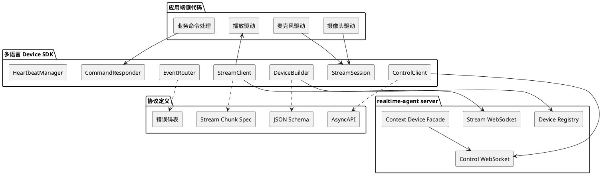
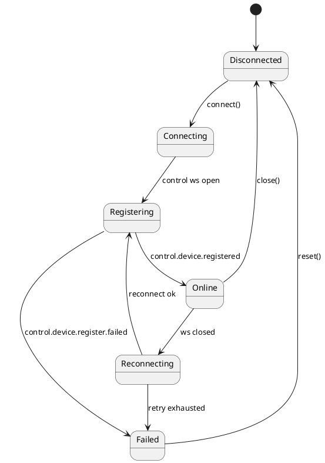
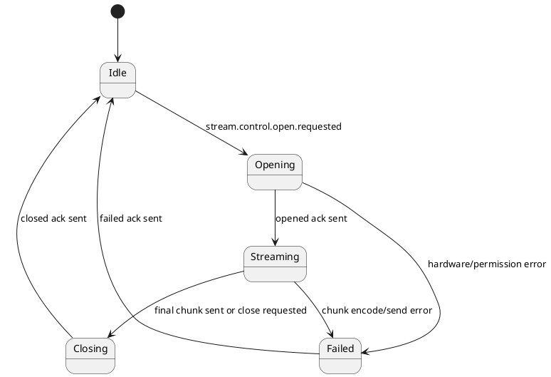

# 多语言端侧通讯 SDK 设计文档

更新时间：2026-05-15

当前状态：首批 SDK 已落在 `devices/`，包括 Python、TypeScript、Swift、
Kotlin/Java 和 C。设计中的“建议新增目录”已按当前仓库实际实现为
`devices/<language>/`；每个语言目录下都有 README、数据模型和测试入口。

## 1. 背景

`realtime-agent` 当前服务端 SDK 主要由 Python 实现，但真实端侧可能运行在浏览器、iOS、Android、ESP32、Linux 网关、桌面应用或其他嵌入式环境中。端侧语言可能是 JavaScript、TypeScript、Swift、Kotlin、Java、C、C++、Dart、Go、Rust、C# 等。

这些端侧都需要完成同一类通讯任务：

1. 连接 server 的控制 WebSocket。
2. 声明自身设备信息和 `supports` 能力。
3. 发送 `control.device.register.requested` 并处理注册结果。
4. 消费 server 下发的控制事件，例如 `command.requested`、`stream.control.open.requested`。
5. 回报命令状态，例如 `command.accepted`、`command.progress`、`command.completed`、`command.failed`。
6. 通过 stream WebSocket 上传或接收音频、图片、视频帧等二进制数据。
7. 上报心跳、断连、运行错误和能力执行状态。

如果每个端侧开发者都直接拼 JSON、手写事件名和 WebSocket 循环，会出现以下问题：

- 协议拼写错误难以及时发现。
- 不同语言参考端重复实现注册、心跳、重连、stream chunk 编解码。
- `supports` 能力声明缺少类型约束，server 侧筛选能力时难以保证一致性。
- 端侧错误回报格式不统一，排障时只能看低层日志。
- 协议演进时需要人工同步多份手写实现。

因此需要提供一组多语言端侧通讯 SDK。这里的 SDK 只覆盖“端侧和 server 通讯”，不包含业务 Tool / Task 开发，不包含硬件驱动，不包含模型、ASR、TTS 或 Agent Core。

## 2. 目标

### 2.1 产品目标

- 端侧开发者不需要手写协议事件名。
- 端侧开发者不需要直接拼注册 JSON。
- 端侧开发者可以用类型化 API 声明设备能力。
- 端侧开发者可以用回调、异步流或事件订阅消费 server 事件。
- 端侧开发者可以用 SDK helper 发送命令回执、stream 打开/关闭回执和二进制 chunk。
- 不同语言 SDK 对外暴露同一套概念模型。
- 协议 schema、文档、参考端和测试保持同源。

### 2.2 工程目标

- 先固化跨语言协议，再实现语言 SDK。
- 协议定义应可被代码生成工具消费。
- 每个语言 SDK 尽量薄，只封装通讯、类型、状态机和错误处理。
- 每个语言 SDK 都必须有契约测试，验证注册、命令、stream 和错误回报。
- P0 语言覆盖当前项目最可能落地的端侧：Python、TypeScript、Swift、Kotlin/Java、C/C++。

### 2.3 非目标

- 不在端侧 SDK 中实现业务 Tool / Task。
- 不在端侧 SDK 中实现摄像头、麦克风、扬声器、蓝牙、Wi-Fi 或传感器驱动。
- 不要求所有语言 SDK 第一版都支持完整 media pipeline。
- 不把 server 内部 `RealtimeAgentApp`、`ToolGateway`、`TaskEngine` 暴露给端侧 SDK。
- 不把 `legacy/` 旧协议复制为新 SDK API。

## 3. 当前协议基础

当前仓库已经收敛到以下协议基础：

| 类型 | 当前约束 |
| --- | --- |
| 设备能力 | `agent-server/realtime_agent/spec/realtime-agent-device.schema.json`，使用结构化 `supports.sensors` 和 `supports.actuators`。 |
| 注册事件 | `control.device.register.requested`、`control.device.registered`、`control.device.register.failed`。 |
| 命令事件 | `command.requested`、`command.accepted`、`command.progress`、`command.completed`、`command.failed`。 |
| stream 控制 | `stream.control.open.requested`、`stream.control.close.requested`。 |
| stream 数据 | `/ws/stream` 二进制帧，当前参考端使用 4 字节 header 长度 + JSON header + payload。 |
| 参考实现 | Python playback glass、browser glass、iOS Swift phone、ESP32-S3 C 骨架。 |

端侧 SDK 的第一阶段应把这些重复逻辑抽成公共协议层。

## 4. 分层设计



分层原则：

1. 协议定义是源头，语言 SDK 不应该各自发明字段。
2. Device SDK 是端侧通讯层，不关心 Agent Core。
3. 硬件驱动由端侧应用提供，SDK 只负责把驱动结果发送给 server。
4. server 侧业务能力继续通过 `ToolContext` / `TaskContext` 调用设备，不依赖某个语言 SDK。

## 5. 协议产物设计

建议新增独立协议目录：

```text
agent-server/realtime_agent/spec/
  realtime-agent-device.schema.json       # 已存在，继续作为设备能力声明 schema
  realtime-agent-event.schema.json        # 新增，控制事件信封和事件 payload schema
  realtime-agent-stream.schema.json       # 新增，stream header schema
  realtime-agent-asyncapi.yaml            # 新增，WebSocket 通道与事件说明
  realtime-agent-error-codes.yaml         # 新增，端侧错误码和建议处理方式
```

### 5.1 事件信封

所有控制事件使用同一信封：

```json
{
  "version": "realtime-agent.v1",
  "event_id": "evt_xxx",
  "event_name": "command.completed",
  "timestamp_ms": 1760000000000,
  "user_id": "user-001",
  "producer_id": "dev-phone-001",
  "session_id": "session-001",
  "stream_id": "stream-001",
  "stream_type": "sensor.rgb",
  "payload": {}
}
```

字段规则：

| 字段 | 规则 |
| --- | --- |
| `version` | 协议版本，第一版固定为 `realtime-agent.v1`。 |
| `event_id` | 端侧或 server 生成的事件唯一 ID。 |
| `event_name` | 受 schema 约束的事件名，不允许 SDK 用户手写自由字符串。 |
| `timestamp_ms` | 事件产生时的毫秒时间戳。 |
| `user_id` | 用户标识。 |
| `producer_id` | 事件生产者，端侧通常是 `device_id`。 |
| `session_id` | 可选，会话标识。 |
| `stream_id` | 可选，stream 标识。 |
| `stream_type` | 可选，能力流类型，例如 `sensor.rgb`。 |
| `payload` | 事件业务数据，按事件类型约束。 |

### 5.2 设备能力声明

端侧 SDK 应隐藏原始 JSON，提供 builder API：

```text
Device
  user_id
  device_id
  name
  device_role
  tags
  runtime
  sdk_version
  supports
    sensors[]
    actuators[]
```

能力类型保持与 server 一致：

| 能力 | 第一版支持 |
| --- | --- |
| `sensor.rgb` | 单帧和连续帧，格式 `jpeg` / `png`。 |
| `sensor.imu` | 连续 IMU 数据。 |
| `sensor.tof` | 单帧和连续深度图。 |
| `actuator.vibrator` | `vibrate` 命令。 |
| `actuator.haptic` | 第一版可作为 `vibrator` 兼容别名或实验能力。 |

`sensor.mic` 和 `actuator.speaker` 属于系统音频主链路，不作为普通 `supports` capability 暴露。端侧 SDK 可以提供音频 stream helper，但不把它放入普通能力声明。

### 5.3 stream chunk

第一版继续采用当前参考端已经使用的二进制格式：

```text
4 bytes big-endian header length
header JSON bytes
payload bytes
```

header 示例：

```json
{
  "version": "realtime-agent.v1",
  "user_id": "user-001",
  "session_id": "session-001",
  "stream_id": "stream_rgb_001",
  "stream_type": "sensor.rgb",
  "seq": 0,
  "timestamp_ms": 1760000000000,
  "codec": "jpeg",
  "payload_size": 102400,
  "final": true,
  "metadata": {
    "request_id": "req-001"
  }
}
```

SDK 必须负责：

- 编码 header 长度。
- 校验 `payload_size`。
- 维护 `seq`。
- 发送 final chunk。
- 把 chunk 编解码错误转换为统一错误。

## 6. 端侧 SDK API 形态

不同语言语法不同，但概念模型应保持一致。

### 6.1 TypeScript 示例

```ts
const device = Device.define("dev-phone-001")
  .user("user-001")
  .name("iPhone")
  .role("phone")
  .runtime({ platform: "ios", language: "typescript" })
  .sensorRgb({ modes: ["single", "continuous"], format: "jpeg" })
  .actuatorVibrator(["vibrate"]);

const client = new RealtimeAgentDeviceClient({
  serverUrl: "http://127.0.0.1:8765",
  device,
});

client.onStreamOpen("sensor.rgb", async (request) => {
  const frame = await camera.captureJpeg();
  await request.opened({ codec: "jpeg" });
  await request.write(frame, { codec: "jpeg", final: true });
  await request.closed();
});

client.onCommand("peer-link-ready", async (command) => {
  await command.accepted();
  await command.completed({
    stream_type: "video.rgb",
    expires_at: Date.now() + 30_000,
  });
});

await client.connect();
await client.register();
```

### 6.2 Swift 示例

```swift
let device = RealtimeAgentDevice(id: "dev-device-demo-ios-001")
    .user("user-001")
    .name("iPhone")
    .role("phone")
    .sensorRgb(modes: [.single, .continuous], format: .jpeg)
    .actuatorVibrator(commands: [.vibrate])

let client = RealtimeAgentDeviceClient(serverURL: serverURL, device: device)

client.onStreamOpen(.sensorRgb) { request in
    let jpeg = try await camera.captureJpeg()
    try await request.opened(codec: .jpeg)
    try await request.write(jpeg, codec: .jpeg, final: true)
    try await request.closed()
}

client.onCommand("peer-link-ready") { command in
    try await command.accepted()
    try await command.completed([
        "stream_type": "video.rgb",
        "expires_at": Date().addingTimeInterval(30).timeIntervalSince1970
    ])
}

try await client.connect()
try await client.register()
```

### 6.3 C 示例

C SDK 不追求高级 DSL，第一版使用结构体和回调：

```c
realtime_agent_device_t device = realtime_agent_device_init("user-001", "dev-esp32-001");
realtime_agent_device_set_name(&device, "ESP32 Glass");
realtime_agent_device_set_role(&device, "glass");
realtime_agent_device_add_rgb_sensor(&device, REALTIME_AGENT_MODE_SINGLE, REALTIME_AGENT_IMAGE_JPEG);

realtime_agent_client_t *client = realtime_agent_client_new(&config, &device);

realtime_agent_client_on_stream_open(client, "sensor.rgb", handle_rgb_open, camera_ctx);
realtime_agent_client_on_command(client, "vibrate", handle_vibrate, motor_ctx);

realtime_agent_client_connect(client);
realtime_agent_client_register(client);
realtime_agent_client_loop(client);
```

C SDK 重点是：

- 不依赖动态内存过多。
- 支持 ESP-IDF component。
- JSON 库和 WebSocket 适配层可替换。
- 能在 Linux native 下跑契约测试，再移植到 ESP32。

## 7. 语言支持策略

### 7.1 P0 语言

| 语言 | 包名建议 | 发布渠道 | 覆盖端侧 | 第一版范围 |
| --- | --- | --- | --- | --- |
| Python | `realtime-agent-device` | PyPI | Python 模拟端、Linux 端侧、测试工具 | 注册、命令、stream、测试 harness。 |
| TypeScript / JavaScript | `@realtime-agent/device` | npm | 浏览器、Node、Electron、WebView | 浏览器和 Node 双 runtime，优先浏览器。 |
| Swift | `RealtimeAgentDeviceKit` | Swift Package Manager | iOS、macOS | 抽出现有 iOS 参考端核心协议。 |
| Kotlin / Java | `io.realtimeagent:device-client` | Maven Central | Android、JVM 网关 | Kotlin-first，Java 可调用。 |
| C / C++ | `realtime-agent-device-c` | 源码包、ESP-IDF component、Conan/vcpkg 可选 | ESP32、嵌入式 Linux | C core + C++ wrapper 可后置。 |

### 7.2 P1 语言

| 语言 | 发布渠道 | 适用场景 | 说明 |
| --- | --- | --- | --- |
| Dart / Flutter | pub.dev | Flutter phone、跨平台移动端 | 如果 phone 侧切 Flutter，应尽快提升优先级。 |
| Go | Go modules | Linux 网关、边缘代理 | 适合守护进程和工具链。 |
| Rust | crates.io | 高可靠端侧、嵌入式网关 | 可先基于 schema 生成类型，再补 WebSocket runtime。 |
| C# / .NET | NuGet | Windows 桌面、Unity、工业端 | 适合后续扩展，不是当前最短路径。 |

### 7.3 P2 语言

PHP、Ruby 等语言可以通过协议文档和 OpenAPI/AsyncAPI 生成基础客户端，但不建议作为第一批官方维护 SDK。它们更偏服务端集成，不是当前多设备端侧通讯的主要压力点。

## 8. 版本策略

协议版本和 SDK 版本分开管理：

```text
protocol version: realtime-agent.v1
python sdk:      0.1.0
typescript sdk:  0.1.0
swift sdk:       0.1.0
```

兼容性规则：

- `realtime-agent.v1` 内新增可选字段，不破坏旧 SDK。
- 删除字段、改字段类型、改事件语义必须进入 `realtime-agent.v2`。
- SDK 启动注册时必须上报 `sdk_version` 和 `runtime`。
- server 注册回包中可以返回 `min_protocol_version`、`recommended_sdk_version`、`heartbeat_interval_seconds`。
- SDK 收到未知事件时不能崩溃，应进入 `onUnknownEvent` 或日志 WARNING。

## 9. 错误模型

统一错误类型：

| 错误码 | 场景 |
| --- | --- |
| `registration_failed` | server 拒绝注册。 |
| `auth_failed` | token 缺失、过期或签名错误。 |
| `unsupported_capability` | 端侧声明或请求的能力不受支持。 |
| `permission_denied` | 相机、麦克风、蓝牙等权限被拒绝。 |
| `hardware_unavailable` | 传感器或执行器初始化失败。 |
| `stream_busy` | 同一能力正在执行，无法并发打开。 |
| `stream_codec_error` | codec、payload 或 header 格式错误。 |
| `network_disconnected` | WebSocket 断开。 |
| `protocol_violation` | 收到不符合 schema 的事件。 |
| `timeout` | 等待 server 或硬件响应超时。 |

端侧 SDK 应支持把错误回报给 server：

```json
{
  "event_name": "command.failed",
  "payload": {
    "command_id": "cmd-001",
    "error": {
      "code": "permission_denied",
      "message": "camera permission denied",
      "retryable": false
    }
  }
}
```

## 10. 状态机

### 10.1 注册和连接



### 10.2 stream 请求



SDK 应内置状态机，避免端侧应用重复处理：

- 重复打开同一 stream 时自动返回 busy，或交给用户配置排队策略。
- 收到 close 请求时尽快释放硬件。
- 网络断开时清理本地 stream。
- 端侧回调抛异常时自动发送 failed 回执。

## 11. 测试策略

每个语言 SDK 都要跑四类测试：

| 测试类型 | 目标 |
| --- | --- |
| schema 测试 | DeviceBuilder 输出必须通过 `realtime-agent-device.schema.json`。 |
| 编解码测试 | 事件信封和 stream chunk 编解码与 Python 基准一致。 |
| 契约测试 | 启动真实 aiohttp 测试 server，完成注册、命令回执、stream 上传。 |
| 静态边界测试 | SDK 不导入 server 内部模块，不依赖示例应用私有代码。 |

跨语言黄金样例：

```text
protocol/data/fixtures/
  device.browser-glass.json
  device.ios-device-demo.json
  event.register.requested.json
  event.command.requested.json
  event.command.completed.json
  stream.rgb.header.json
  stream.rgb.chunk.bin
```

所有 SDK 都应读取这些样例，保证字段和编码一致。

## 12. 发布和仓库组织

第一阶段建议仍在当前 monorepo 中维护：

```text
devices/
  python/
  typescript/
  swift/
  kotlin/
  c/
```

当协议稳定后，可以拆出独立仓库或使用多仓库发布：

```text
realtime-agent-protocol
realtime-agent-device-python
realtime-agent-device-js
realtime-agent-device-swift
realtime-agent-device-android
realtime-agent-device-c
```

包发布原则：

- 每个 SDK 包含 README、最小示例、契约测试说明。
- 每个 SDK 发布前必须跑协议黄金样例测试。
- SDK 版本和协议版本在 changelog 中同时记录。
- 不把 API Key、token、设备私有配置放入示例。

## 13. 安全和鉴权

端侧 SDK 需要提供鉴权扩展点，但第一版不强行绑定某种鉴权方案：

- 支持注册 payload 携带 `auth`。
- 支持 token 刷新回调。
- 支持 server 返回 `control.device.register.failed` 后暴露明确错误。
- 支持 TLS URL。
- 日志默认不打印 token。
- 端侧本地配置文件不应保存明文生产 token。

## 14. 日志和可观测性

SDK 日志级别：

| 级别 | 使用场景 |
| --- | --- |
| DEBUG | WebSocket 连接、事件收发摘要、stream chunk 统计。 |
| INFO | 注册成功、重连成功、stream 打开/关闭。 |
| WARNING | 未知事件、可恢复协议不一致、重试。 |
| ERROR | 注册失败、鉴权失败、硬件失败、不可恢复 stream 错误。 |

SDK 应提供诊断快照：

```json
{
  "registered": true,
  "control_state": "online",
  "stream_state": "online",
  "last_event_name": "stream.control.open.requested",
  "active_streams": 1,
  "sent_events": 12,
  "received_events": 18,
  "last_error": null
}
```

server 的 `runs/` 产物仍是最终排障证据；端侧 SDK 的日志应能和 `control-events.jsonl`、`stream-events.jsonl` 对齐。

## 15. 风险和取舍

| 风险 | 影响 | 处理方式 |
| --- | --- | --- |
| 多语言 SDK 维护成本高 | 容易出现协议漂移 | 协议 schema 和黄金样例先行，SDK 尽量薄。 |
| 代码生成产物不符合端侧习惯 | API 难用 | schema 生成类型，手写小型 ergonomic wrapper。 |
| C/C++ WebSocket 和 JSON 依赖差异大 | 嵌入式移植困难 | C core 只定义接口，网络和 JSON 适配层可替换。 |
| Swift/Kotlin 异步模型不同 | 跨语言 API 无法完全一致 | 保持概念一致，不强求语法一致。 |
| 协议还在演进 | 早期 SDK 频繁破坏兼容 | 先标记 `0.x`，协议变更必须更新契约测试。 |

## 16. 推荐结论

下一阶段应先建设 `realtime-agent-protocol`，再实现 P0 语言 SDK：

1. Python：作为基准实现和测试 harness。
2. TypeScript：覆盖 browser-glass 开发支持组件和 Node 端侧。
3. Swift：抽出现有 iOS 参考端协议层。
4. Kotlin/Java：覆盖 Android。
5. C：覆盖 ESP32 和嵌入式 Linux。

这条路线能最大化复用当前仓库已有实现，同时避免端侧开发者继续手写 JSON、事件名和 stream chunk 编解码。
