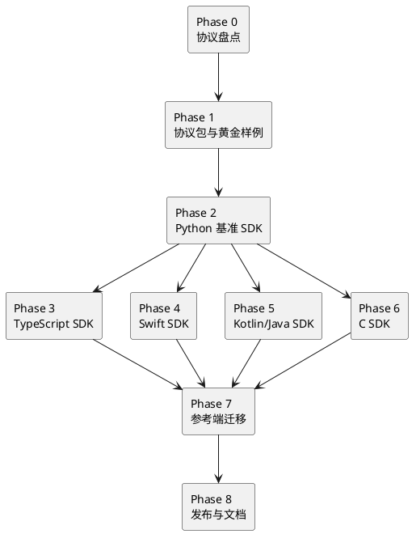

# 多语言端侧通讯 SDK 实施计划

更新时间：2026-05-15

当前状态：Phase 1 到 Phase 8 的最小主线已落地。协议 schema 和黄金样例位于
`audio-server/audio_chat/spec/` 与 `testdata/protocol/`；多语言 SDK 位于
`audio-device/`，目录名已从早期计划中的 `sdks/` 收敛为 `audio-device/`，与
`audio-server/` 对应；Python phone、browser-glass、Python playback glass 等开发/测试支持组件已按当前协议迁移。

## 1. 实施原则

1. 先协议，后 SDK。
2. 先契约测试，后发布包。
3. 先 P0 语言，后长尾语言。
4. SDK 只负责端侧通讯，不混入业务 Tool / Task。
5. 每个阶段都要能用真实 WebSocket 或最小测试 server 验证。
6. 文档中的测试结果必须来自真实命令，不能写设计预期。

## 2. 范围

### 2.1 本计划覆盖

- 协议 schema 拆分和补齐。
- stream chunk 编码规范固化。
- 多语言 SDK 目录和包结构。
- Python / TypeScript / Swift / Kotlin / C 第一批 SDK。
- 跨语言黄金样例。
- 契约测试和发布前检查。
- 参考端迁移到 SDK。

### 2.2 本计划不覆盖

- 真实硬件驱动实现。
- 业务 Tool / Task 改造。
- Agent Core 协议改造。
- ASR、TTS、模型 provider 改造。
- 生产鉴权系统完整设计。

## 3. 阶段总览



## 4. Phase 0：协议盘点和冻结候选

### 4.1 目标

确认当前实际运行协议，不凭文档或命名推断。

### 4.2 工作项

1. 盘点 server 侧控制事件定义。
2. 盘点 `audio-chat-device.schema.json` 当前字段。
3. 盘点 `/ws/control` 注册、心跳、事件路由逻辑。
4. 盘点 `/ws/stream` chunk 编解码逻辑。
5. 盘点参考端：
   - `examples/dev-support/devices/python-playback-glass/`
   - `examples/dev-support/devices/browser-glass/`
   - `examples/for-blind-app/devices/native-ios-phone/`
   - `examples/for-blind-app/devices/native-esp32-glass/`
6. 输出协议差异清单，标记必须统一的字段。

### 4.3 交付物

```text
docs/internal/device-protocol-inventory.md
```

内容应包含：

- 事件名清单。
- payload 字段清单。
- stream header 字段清单。
- 各参考端与 server 的差异。
- 必须修正项和可后置项。

### 4.4 验收标准

- 文档中每个协议结论都能对应到代码位置。
- 明确第一版 SDK 支持哪些事件，暂不支持哪些事件。
- 明确 `sensor.mic` / `actuator.speaker` 与普通 `supports` 能力的边界。

## 5. Phase 1：协议包与黄金样例

### 5.1 目标

把协议定义变成多语言 SDK 的共同输入。

### 5.2 建议文件

```text
audio-server/audio_chat/spec/
  audio-chat-device.schema.json
  audio-chat-event.schema.json
  audio-chat-stream.schema.json
  audio-chat-asyncapi.yaml
  audio-chat-error-codes.yaml

testdata/protocol/
  devices/
    browser-glass.json
    ios-phone.json
    esp32-glass.json
  events/
    register-requested.json
    register-registered.json
    command-requested.json
    command-accepted.json
    command-progress.json
    command-completed.json
    command-failed.json
    stream-open-requested.json
    stream-close-requested.json
  streams/
    rgb-header.json
    rgb-chunk.bin
```

### 5.3 工作项

1. 新增 `audio-chat-event.schema.json`。
2. 新增 `audio-chat-stream.schema.json`。
3. 新增 `audio-chat-error-codes.yaml`。
4. 新增 `audio-chat-asyncapi.yaml`，描述：
   - `/ws/control`
   - `/ws/stream`
   - 注册事件
   - 命令事件
   - stream 控制事件
5. 从现有参考端提取黄金样例。
6. 新增 Python 测试验证黄金样例能被 server 侧 schema 接受。
7. 更新 `docs/reference/cli.md` 或新增命令说明，描述如何校验协议样例。

### 5.4 测试

建议新增：

```text
audio-server/tests/test_protocol_schema_examples.py
audio-server/tests/test_stream_chunk_codec_contract.py
```

测试目标：

- 黄金样例通过 schema。
- 无效事件名被拒绝。
- stream chunk 编解码与参考端一致。
- `payload_size` 不一致时必须报错。

### 5.5 验收标准

- `uv run python -m pytest audio-server/tests/test_protocol_schema_examples.py -q` 通过。
- `uv run python -m pytest audio-server/tests/test_stream_chunk_codec_contract.py -q` 通过。
- 所有黄金样例都有用途说明。

## 6. Phase 2：Python 基准 Device SDK

### 6.1 目标

把现有 Python 参考端中可复用的协议逻辑抽成官方基准 SDK。

### 6.2 建议目录

```text
audio-device/python/
  pyproject.toml
  src/audio_chat_device/
    __init__.py
    client.py
    device.py
    events.py
    stream.py
    errors.py
    diagnostics.py
  tests/
    test_device_builder.py
    test_events.py
    test_stream_codec.py
    test_contract_websocket.py
  README.md
```

### 6.3 API 范围

- `DeviceBuilder`
- `AudioChatDeviceClient`
- `on_command()`
- `on_stream_open()`
- `send_event()`
- `command.accepted()`
- `command.progress()`
- `command.completed()`
- `command.failed()`
- `stream.write()`
- `stream.close()`
- `diagnostics_snapshot()`

### 6.4 迁移对象

优先从以下文件抽取逻辑：

```text
examples/dev-support/devices/python-playback-glass/audio_chat_python_playback_glass/protocol_client.py
examples/dev-support/devices/python-phone/audio_chat_python_phone_mock/phone_mock.py
```

### 6.5 测试

```bash
uv run python -m pytest audio-device/python/tests -q
uv run python -m pytest examples/dev-support/tests/python_playback_glass -q
```

### 6.6 验收标准

- Python SDK 不导入 `AudioChatApp`、`ToolGateway`、`TaskEngine`。
- Python playback glass 可切到 SDK 运行。
- 注册、命令回执、RGB fixture 上传均可通过真实 aiohttp 测试 server。

## 7. Phase 3：TypeScript / JavaScript SDK

### 7.1 目标

覆盖浏览器和 Node 端侧，替代 browser-glass 中手写协议逻辑。

### 7.2 建议目录

```text
audio-device/typescript/
  package.json
  tsconfig.json
  src/
    index.ts
    client.ts
    device.ts
    events.ts
    stream.ts
    errors.ts
    runtime/
      browser.ts
      node.ts
  tests/
    device.test.ts
    events.test.ts
    stream.test.ts
    contract.test.ts
  README.md
```

### 7.3 API 范围

- 浏览器 WebSocket。
- Node WebSocket 适配。
- `Device.define()` 链式能力声明。
- `client.onCommand()`。
- `client.onStreamOpen()`。
- `StreamRequest.write()`。
- 浏览器端 `Blob` / `ArrayBuffer` / `Uint8Array` 支持。

### 7.4 测试

```bash
cd audio-device/typescript
npm test
```

如果仓库暂时不引入 Node 测试工具，先用最小脚本验证：

```bash
node scripts/verify-golden-fixtures.mjs
```

### 7.5 验收标准

- browser-glass 的注册和 RGB 上传可改用 SDK。
- SDK bundle 不包含 server 侧 Python 逻辑。
- 黄金样例编解码与 Python 基准一致。

## 8. Phase 4：Swift SDK

### 8.1 目标

抽出现有 iOS 参考端的协议核心，形成 Swift Package。

### 8.2 建议目录

```text
audio-device/swift/
  Package.swift
  Sources/AudioChatDeviceKit/
    AudioChatDevice.swift
    AudioChatDeviceClient.swift
    AudioChatEvent.swift
    AudioChatStreamChunk.swift
    AudioChatErrors.swift
    AudioChatDiagnostics.swift
  Tests/AudioChatDeviceKitTests/
    DeviceBuilderTests.swift
    EventCodecTests.swift
    StreamChunkTests.swift
  README.md
```

### 8.3 迁移对象

```text
examples/for-blind-app/devices/native-ios-phone/AudioChatPhone/Core/AudioChatEvent.swift
examples/for-blind-app/devices/native-ios-phone/AudioChatPhone/Core/StreamChunkCodec.swift
examples/for-blind-app/devices/native-ios-phone/AudioChatPhone/Core/AudioChatEndpointRuntime.swift
```

### 8.4 测试

```bash
cd audio-device/swift
swift test
```

iOS 示例端额外验证：

```bash
uv run audio-chat.ios.build-sim
```

### 8.5 验收标准

- Swift Package 可被 iOS 示例端引入。
- iOS 示例端不再维护独立 stream chunk 编解码。
- 注册、事件解析、stream chunk 测试通过。

## 9. Phase 5：Kotlin / Java SDK

### 9.1 目标

覆盖 Android 和 JVM 网关。API Kotlin-first，同时保持 Java 可调用。

### 9.2 建议目录

```text
audio-device/kotlin/
  build.gradle.kts
  settings.gradle.kts
  src/main/kotlin/io/audiochat/device/
    AudioChatDevice.kt
    AudioChatDeviceClient.kt
    AudioChatEvent.kt
    AudioChatStreamChunk.kt
    AudioChatErrors.kt
  src/test/kotlin/io/audiochat/device/
    DeviceBuilderTest.kt
    EventCodecTest.kt
    StreamChunkTest.kt
    ContractTest.kt
  README.md
```

### 9.3 技术选型

候选：

- Kotlin serialization：类型和 JSON 编解码。
- OkHttp WebSocket：Android/JVM 都成熟。
- Kotlin coroutines：异步回调和 stream 写入。

### 9.4 测试

```bash
cd audio-device/kotlin
./gradlew test
```

### 9.5 验收标准

- Java 调用示例可以完成设备注册。
- Kotlin 调用示例可以处理 `command.requested`。
- stream chunk 与 Python 黄金样例一致。

## 10. Phase 6：C SDK

### 10.1 目标

覆盖 ESP32 和嵌入式 Linux，先提供协议核心和可替换 transport。

### 10.2 建议目录

```text
audio-device/c/
  CMakeLists.txt
  include/audio_chat_device/
    audio_chat_device.h
    audio_chat_event.h
    audio_chat_stream.h
    audio_chat_error.h
    audio_chat_transport.h
  src/
    audio_chat_device.c
    audio_chat_event.c
    audio_chat_stream.c
    audio_chat_error.c
  tests/
    test_device.c
    test_event.c
    test_stream.c
  examples/
    linux_register_only/
    esp32_component/
  README.md
```

### 10.3 设计约束

- C core 不直接绑定某个 WebSocket 库。
- JSON 适配层可替换。
- 内存分配策略可配置。
- stream 编解码必须支持小内存场景。
- ESP-IDF component 示例和 Linux native 示例分开。

### 10.4 测试

```bash
cmake -S audio-device/c -B audio-device/c/build
cmake --build audio-device/c/build
ctest --test-dir audio-device/c/build --output-on-failure
```

ESP32 dry-run：

```bash
uv run audio-chat.esp32.build --dry-run
```

### 10.5 验收标准

- Linux native 测试通过。
- ESP32 参考固件可以引入 C SDK header。
- stream chunk 编解码与 Python 黄金样例一致。

## 11. Phase 7：开发支持组件和参考端迁移

### 11.1 目标

让现有开发支持组件和端侧参考工程使用 SDK，减少重复协议代码。

### 11.2 迁移顺序

1. Python playback glass。
2. Browser glass。
3. iOS native phone。
4. ESP32-S3 skeleton。
5. Python phone mock / preview。

### 11.3 每个组件 / 参考端迁移要求

- 保留原有功能入口和命令。
- 删除重复事件信封构造代码。
- 删除重复 stream chunk 编解码代码。
- README 说明 SDK 依赖和本地运行方式。
- 原有测试继续通过。

### 11.4 测试

```bash
uv run python -m pytest examples/dev-support/tests -q
uv run python -m pytest examples/for-blind-app/tests -q
uv run audio-chat.device.validate examples/dev-support/devices/browser-glass/device.audio-chat.yaml
```

涉及 iOS / ESP32 的改动必须说明验证层级：

- 只做代码编译。
- 模拟器构建。
- 真机运行。
- 硬件串口监视。

## 12. Phase 8：发布与文档

### 12.1 目标

形成可被外部开发者使用的端侧 SDK 发布形态。

### 12.2 文档

建议新增：

```text
docs/getting-started/build-device-with-sdk.md
docs/reference/device-sdk-api.md
docs/reference/device-protocol.md
docs/how-to/debug-device-sdk.md
```

每个语言 SDK 自带 README：

```text
audio-device/<language>-device/README.md
```

### 12.3 发布前检查

```bash
uv run python -m pytest audio-server/tests -q
uv run python -m pytest audio-device/python/tests -q
cd audio-device/typescript && npm test
cd audio-device/swift && swift test
cd audio-device/kotlin && ./gradlew test
cmake -S audio-device/c -B audio-device/c/build && cmake --build audio-device/c/build
```

### 12.4 发布渠道

| SDK | 渠道 | 第一版建议 |
| --- | --- | --- |
| Python | PyPI | 先发 `0.1.0a1` 或内部包。 |
| TypeScript | npm | 先发 scoped 包 `@audio-chat/device`。 |
| Swift | Git tag + Swift Package Manager | 先用 Git URL 引入。 |
| Kotlin / Java | Maven Central 或 GitHub Packages | 先内部发布，再上 Maven Central。 |
| C | 源码包 + ESP-IDF component | 先随仓库发布，再评估 Conan/vcpkg。 |

## 13. 依赖和负责人视角

### 13.1 必须先完成的基础

- 协议 schema 能表达所有 SDK 需要的事件。
- server 接收端对错误回报有明确记录。
- stream chunk 编解码在 server 和 Python 基准中统一。
- 黄金样例目录稳定。

### 13.2 可以并行的工作

- TypeScript SDK 和 Swift SDK 可以在 Python 基准完成后并行。
- Kotlin SDK 和 C SDK 可以并行，但都应使用同一批黄金样例。
- 文档和示例可以跟随每个 SDK 分支逐步补齐。

### 13.3 不建议并行的工作

- 不建议在协议 schema 未冻结前同时写五种 SDK。
- 不建议先发布包再补契约测试。
- 不建议先迁移参考端再抽 Python 基准 SDK。

## 14. 里程碑建议

| 里程碑 | 目标 | 主要产物 |
| --- | --- | --- |
| M1 | 协议冻结候选 | inventory、event schema、stream schema、黄金样例。 |
| M2 | Python 基准跑通 | `audio-device/python`、真实 WebSocket 契约测试。 |
| M3 | 浏览器端 SDK 跑通 | `audio-device/typescript`、browser-glass 迁移。 |
| M4 | iOS SDK 跑通 | `audio-device/swift`、iOS 示例端迁移。 |
| M5 | Android 与 C 端骨架 | Kotlin/C SDK 编解码和注册测试。 |
| M6 | 发布准备 | API 文档、debug 文档、package check、版本策略。 |

## 15. 第一轮最小可执行任务

建议第一轮只做 M1 + M2 的最小闭环：

1. 新增 `audio-chat-event.schema.json`。
2. 新增 `audio-chat-stream.schema.json`。
3. 提取 8 到 12 个黄金样例。
4. 从 Python playback glass 抽出 stream chunk codec。
5. 建立 `audio-device/python`。
6. 让 Python playback glass 改用 SDK。
7. 跑通：

   ```bash
   uv run python -m pytest audio-server/tests/test_protocol_schema_examples.py -q
   uv run python -m pytest audio-device/python/tests -q
   uv run python -m pytest examples/dev-support/tests/python_playback_glass -q
   ```

这一轮完成后，再决定 TypeScript 和 Swift 是否同时启动。

## 16. 完成定义

整个计划完成时，应满足：

- 协议定义不再散落在各参考端中。
- P0 SDK 都能用类型化 API 完成注册、事件消费、命令回报和 stream chunk 编解码。
- 至少 Python、TypeScript、Swift 三个 SDK 已迁移现有参考端。
- Kotlin 和 C SDK 至少完成注册、事件和 stream 编解码契约。
- 文档提供统一开发入口，不要求端侧开发者阅读 server 内部代码。
- 所有 SDK 均有明确测试命令、发布流程和协议版本声明。

## 17. 执行记录

### 阶段 0：协议盘点和冻结候选

- 状态：已完成。
- 目标：确认当前实际运行协议，输出冻结候选。
- 实现：新增 [端侧协议盘点和冻结候选](device-protocol-inventory.md)，按代码位置整理注册、控制事件、stream header、能力声明和参考端差异。
- 文件：`docs/internal/device-protocol-inventory.md`。
- 验证：文档结论对应 `protocol.py`、`control/service.py`、`server.py`、`stream/service.py`、`device_capabilities.py` 和现有参考端代码。
- 待验收：无需真机验收；后续 TypeScript、Swift、Kotlin、C 阶段需要继续对照该清单。

### 阶段 1：协议包与黄金样例

- 状态：已完成。
- 目标：把协议定义变成多语言 SDK 的共同输入。
- 实现：新增事件 schema、stream schema、错误码表、AsyncAPI 草案和 `testdata/protocol/` 黄金样例；新增测试验证设备样例、事件样例和 stream 二进制帧。
- 文件：
  - `audio-server/audio_chat/spec/audio-chat-event.schema.json`
  - `audio-server/audio_chat/spec/audio-chat-stream.schema.json`
  - `audio-server/audio_chat/spec/audio-chat-error-codes.yaml`
  - `audio-server/audio_chat/spec/audio-chat-asyncapi.yaml`
  - `testdata/protocol/`
  - `audio-server/tests/test_protocol_schema_examples.py`
  - `audio-server/tests/test_stream_chunk_codec_contract.py`
  - `docs/reference/cli.md`
- 验证：
  - `uv run python -m pytest audio-server/tests/test_protocol_schema_examples.py audio-server/tests/test_stream_chunk_codec_contract.py -q`，结果 `5 passed`。
  - `uv run python -m pytest audio-server/tests/test_device_capabilities_semantics.py audio-server/tests/test_protocol_contracts.py -q`，结果 `14 passed`。
- 风险：当前 schema 做了第一版事件名冻结；后续若新增事件，需要同步 schema、黄金样例和 SDK 类型。

### 阶段 2：Python 基准 Device SDK

- 状态：已完成第一轮最小闭环。
- 目标：把现有 Python 参考端中可复用的协议逻辑抽成官方基准 SDK。
- 实现：新增 `audio-device/python`，包含 `DeviceBuilder`、`AudioChatDeviceClient`、事件信封、stream chunk 编解码、命令回执 helper、stream 请求 helper 和诊断快照；Python playback glass 的 stream chunk 编解码已切到 `audio_chat_device.StreamChunkCodec`。
- 文件：
  - `audio-device/python/`
  - `examples/dev-support/devices/python-playback-glass/audio_chat_python_playback_glass/protocol_client.py`
  - `pyproject.toml`
- 验证：
  - `uv run python -m pytest audio-device/python/tests -q`，结果 `8 passed`。
  - `uv run python -m pytest examples/dev-support/tests/python_playback_glass -q`，结果 `8 passed`。
- 风险：Python playback glass 目前优先迁移了协议 codec 和 URL helper；完整替换为 `AudioChatDeviceClient` 主循环可以作为后续清理，不影响当前真实 WebSocket 回放能力。

### 阶段 3：TypeScript / JavaScript SDK

- 状态：已完成第一轮可验证实现。
- 目标：覆盖浏览器和 Node 端侧，替代 browser-glass 中手写事件信封、设备声明、WebSocket URL 和 stream chunk 编解码。
- 实现：新增 `audio-device/typescript`，提供 `AudioChatEvent`、`DeviceBuilder`、`StreamChunkCodec` 和 `AudioChatDeviceClient`；browser-glass 已通过 `examples/dev-support/devices/browser-glass/sdk/audio-chat-device-browser.js` re-export 正式 SDK，并在注册、控制连接、事件构造、stream 连接和 chunk 编解码中复用 SDK。
- 文件：
  - `audio-device/typescript/`
  - `examples/dev-support/devices/browser-glass/index.html`
  - `examples/dev-support/devices/browser-glass/sdk/audio-chat-device-browser.js`
  - `examples/dev-support/tests/test_web_glass_endpoint.py`
- 验证：
  - `cd audio-device/typescript && npm test`，结果 `5 passed`。
  - `uv run python -m pytest examples/dev-support/tests/test_browser_device_example.py examples/dev-support/tests/test_web_glass_endpoint.py -q`，结果 `21 passed`。
- 风险：browser-glass 仍保留页面内业务事件处理函数，这是交互式开发支持组件 UI 逻辑；底层通讯对象已迁移到 TypeScript SDK。

### 阶段 4：Swift SDK

- 状态：已完成第一轮可验证实现。
- 目标：抽出现有 iOS 参考端协议核心，形成 Swift Package。
- 实现：新增 `audio-device/swift` Swift Package，提供 `AudioChatEvent`、`AudioChatDevice`、`AudioChatStreamChunk` 和 `AudioChatStreamChunkCodec`，并读取包内黄金样例测试。
- 文件：`audio-device/swift/`。
- 验证：
  - `cd audio-device/swift && swift test`，结果 `3 passed`。
- 风险：iOS Xcode 工程尚未实际接入本地 Swift Package；下一步需要在 Xcode 项目中替换现有 `Core/AudioChatEvent.swift` 和 `Core/StreamChunkCodec.swift`，并跑 `uv run audio-chat.ios.build-sim`。

### 阶段 5：Kotlin / Java SDK

- 状态：代码已完成，未本机执行。
- 目标：覆盖 Android 和 JVM 网关，Kotlin-first，同时保持 Java 可调用的静态入口。
- 实现：新增 `audio-device/kotlin`，包含 Gradle 配置、`AudioChatDevice`、`AudioChatEvent`、`StreamChunk`、`StreamChunkCodec` 和 Kotlin 测试草案。
- 文件：`audio-device/kotlin/`。
- 验证：未执行。本机缺少 Java Runtime 和 Gradle，`java -version` 返回 “Unable to locate a Java Runtime”，`gradle --version` 返回 command not found。
- 待验收：安装 JDK/Gradle 后执行 `cd audio-device/kotlin && gradle test` 或补 Gradle wrapper 后执行 `./gradlew test`。

### 阶段 6：C SDK

- 状态：已完成第一轮可验证实现。
- 目标：覆盖 ESP32 和嵌入式 Linux，提供协议核心和可替换 transport 基础。
- 实现：新增 `audio-device/c`，提供 CMake library、设备注册 payload 构造和 stream chunk 编解码；ESP32-S3 参考固件 CMake 已接入 C SDK source/header，`app_main` 使用 C SDK 生成注册 payload 模板。
- 文件：
  - `audio-device/c/`
  - `examples/for-blind-app/devices/native-esp32-glass/firmware/main/CMakeLists.txt`
  - `examples/for-blind-app/devices/native-esp32-glass/firmware/main/audio_chat_reference_main.c`
- 验证：
  - `cmake -S audio-device/c -B audio-device/c/build && cmake --build audio-device/c/build && ctest --test-dir audio-device/c/build --output-on-failure`，结果 `100% tests passed, 0 tests failed out of 1`。
- 风险：未执行 ESP-IDF 真机构建和串口监视；需要在安装 ESP-IDF 后继续跑 `uv run audio-chat.esp32.build --dry-run`。

### 阶段 7：开发支持组件和参考端迁移

- 状态：部分完成。
- 已完成：
  - Python playback glass 复用 Python SDK stream codec。
  - Python phone mock / preview 开发支持组件的事件、URL 和 stream chunk 模型迁移到 `audio_chat_device`；其共享 Python 网络基类也已切到 `AudioChatDeviceClient`。
  - browser-glass 复用 TypeScript SDK 的 `AudioChatDeviceClient`、`AudioChatEvent`、`DeviceBuilder` 和 `StreamChunkCodec`。
  - ESP32-S3 skeleton 接入 C SDK source/header。
- 未完成：
  - iOS Xcode 工程尚未引入 Swift Package。
- 验证：
  - `uv run python -m pytest examples/dev-support/tests/python_playback_glass -q`，结果 `8 passed`。
  - `uv run python -m pytest examples/dev-support/tests/test_browser_device_example.py examples/dev-support/tests/test_web_glass_endpoint.py -q`，结果 `21 passed`。
- 风险：iOS 和真实 ESP32 仍需要用户手动构建/真机验收。

### 阶段 8：发布与文档

- 状态：已完成本地发布准备文档；未发布到外部包仓库。
- 实现：各 SDK 均有 README 和本地验证命令；CLI 文档补充协议黄金样例和多语言 SDK 检查命令。
- 文件：
  - `docs/reference/cli.md`
  - `audio-device/python/README.md`
  - `audio-device/typescript/README.md`
  - `audio-device/swift/README.md`
  - `audio-device/kotlin/README.md`
  - `audio-device/c/README.md`
- 未执行：PyPI、npm、SwiftPM tag、Maven Central、Conan/vcpkg、ESP-IDF component registry 发布。
