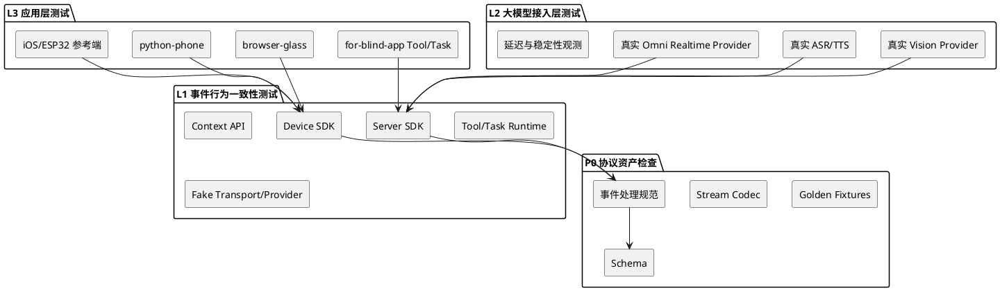

# 回归测试分层设计文档

更新时间：2026-05-19

当前状态：设计草案。本文档用于统一 `realtime-agent` 后续自动化回归测试的分层、范围、命令和测试替身边界。

## 1. 背景

当前仓库已经有较多测试，覆盖协议、Server SDK、Device SDK、开发支持组件和 `for-blind-app` 应用场景。但这些测试尚未形成清晰分层，导致每次修改代码后容易出现几个问题：

1. 底层协议变更需要依赖应用场景测试暴露问题，定位成本高。
2. SDK 能力和应用业务能力混在一起测试，失败后难以判断是 SDK 回归还是 app 回归。
3. 大模型 provider、ASR、TTS、Realtime 接入的稳定性与业务场景混在一起，容易把外部服务波动误判成应用问题。
4. 测试用 fake / mock provider 分散在测试文件中，缺少统一 contract，长期维护成本高。
5. 真实 provider 配置和 mock fallback 边界不够清晰，存在测试路径与生产路径混淆风险。

因此需要把测试体系拆成“协议资产 + 三层系统级回归”：

```text
P0 协议资产检查
L1 事件行为一致性测试
L2 大模型接入层测试
L3 应用层测试
```

核心目标是：先把标准通讯协议沉淀为可版本化的协议资产，再用系统级集成测试保证 Server SDK 和 Device SDK 对协议事件的处理行为一致，然后验证真实大模型接入，最后再测试具体服务器应用功能和端侧应用功能。

这里需要明确一个边界：协议本身不是一个会执行动作的运行时，因此不应把“协议测试”理解为系统级行为测试。协议提供共同语言和版本化资产；真正需要系统级测试的是依赖协议实现的 server / device 运行时代码，是否在收到特定事件后执行了事件处理规范要求的动作。

本文档讨论的“测试”默认不是方法级单元测试。单元测试可以作为辅助，用于覆盖纯函数、边界解析和局部错误处理；但本回归体系的主干必须是系统级集成测试。也就是说，SDK 层测试的输入应是协议事件、stream chunk、WebSocket 消息或协议 golden fixture，测试结果应表达 SDK 对这些输入的响应是否符合预期，例如返回事件、发起 stream、调用 handler、写入 runs 产物、改变连接状态或启动处理流程。

### 1.1 协议的两类版本

协议资产分为两类，二者独立版本化：

| 类型 | 建议版本字段 | 说明 |
| --- | --- | --- |
| 数据结构协议 | `protocol.data.version` | 事件信封、事件名、payload schema、stream header、错误码、golden fixture、反例 fixture。 |
| 事件处理规范 | `protocol.behavior.version` | server 和 device 收到某类事件后应该返回什么事件、触发什么处理流程、更新什么状态、写出什么运行产物。 |

数据结构协议主要通过 JSON / YAML / schema / fixture 显式存储。它可以做静态检查，例如文件存在、JSON 可解析、fixture 引用的 event name 存在、版本号存在，但它不承担“收到事件后执行动作”的系统级测试。

事件处理规范才是 L1 的核心输入。Server SDK 和 Device SDK 可以独立演进，但必须通过同一份事件处理规范的 conformance 测试，证明彼此仍能互认。

## 2. 总体原则

### 2.1 分层职责



每层只回答自己的问题：

| 层级 | 主要问题 |
| --- | --- |
| P0 协议资产检查 | 数据结构协议和事件处理规范是否有明确版本、文档、schema、fixture 和引用关系。 |
| L1 事件行为一致性测试 | Server SDK / Device SDK 面对协议事件时，是否按事件处理规范产生符合预期的响应事件、状态变化、处理流程和开发者 API 行为。 |
| L2 大模型接入层 | 真实 provider 和 Agent runtime 结合是否可靠。 |
| L3 应用层 | 具体应用、端侧参考工程和业务场景是否可用。 |

### 2.2 测试替身原则

SDK 层允许使用测试替身，但必须遵守以下原则：

1. 不 mock SDK 内部核心逻辑，例如 `VisionRealtimeAgentCore`、`ToolGateway`、`Context API`、`ControlService`、`StreamService`。
2. 只替换外部不稳定依赖，例如 LLM、ASR、TTS、Realtime provider、外部 transport、时间、文件系统和真实硬件。
3. 测试替身必须实现与真实 provider 相同的 contract。
4. 测试替身集中放在测试目录，例如 `agent-server/tests/fakes/`，避免散落在大量测试文件中。
5. 生产默认配置不能静默 fallback 到 mock。真实 provider 配置错误应明确失败。
6. 运行产物必须记录实际 provider、model、endpoint、fallback policy 和错误信息。

### 2.3 回归测试和新增功能测试

每一层都分成两类：

| 类型 | 目的 |
| --- | --- |
| 回归测试 | 保证已有协议、SDK API、provider 接入和应用场景没有被破坏。 |
| 新增功能测试 | 新能力、新协议字段、新 SDK API、新 provider 或新应用功能上线前必须补齐的测试。 |

### 2.4 层级依赖关系

层级之间的依赖关系如下：

```text
P0 协议资产是共同契约输入
        ↓
L1 事件行为一致性通过，server/device 可以互认
        ↓
L2 大模型能力通过，真实模型链路具备运行前提
        ↓
L3 应用能力通过，自动化产品功能具备运行前提
        ↓
最终产品整体验收
```

这里的“具备运行前提”不代表外部依赖一定可用。L2 仍受 API Key、网络、provider 服务状态和额度影响；L3 仍不等价于 iOS / ESP32 / 浏览器摄像头权限等真实产品验收。

## 3. P0 协议资产检查

### 3.1 测试目标

P0 不再定义为系统级“协议层测试”，而是协议资产静态检查。它验证协议资产是否完整、可解析、可追踪和可版本化，不验证 server 或 device 收到事件后是否执行动作。

它要保证：

1. 数据结构协议有独立版本号。
2. 事件处理规范有独立版本号。
3. 标准事件信封、事件名、payload schema、stream header 和错误码可被明确定位。
4. 正例 fixture 和反例 fixture 可被读取，并能追溯到对应事件名和 schema。
5. 事件处理规范引用的事件名都存在于数据结构协议中。
6. 多语言 SDK 可复用同一批 golden fixtures。
7. 协议变更流程明确，能说明哪些 server / device 行为测试需要同步更新。

### 3.2 测试内容

| 类型 | 测试内容 |
| --- | --- |
| 数据结构版本 | `protocol.data.version` 存在，且版本变更有记录。 |
| 行为规范版本 | `protocol.behavior.version` 存在，且可独立于数据结构版本演进。 |
| 事件信封资产 | `version`、`event_id`、`event_name`、`timestamp_ms`、`user_id`、`producer_id`、`payload` 的 schema / 文档存在。 |
| payload schema | 注册、能力、命令、stream、输出、错误等 payload schema 可定位。 |
| fixture | 正例和反例 fixture 可解析，引用的事件名存在。 |
| 错误码 | 标准错误码、错误 message、可诊断 metadata 有显式资产。 |
| 行为规范引用 | server / device 行为规范中引用的事件名、状态名和错误码可追踪到协议资产。 |

### 3.3 测试方法

P0 使用静态检查和资产一致性检查：

1. JSON / YAML 可解析性检查。
2. 版本号存在性检查。
3. schema 文件存在性和 schema 引用检查。
4. fixture 引用事件名检查。
5. 行为规范引用事件名检查。
6. 协议变更 checklist 检查。

当前已有基础：

- `protocol/protocol-tests/test_protocol_contracts.py`
- `protocol/protocol-tests/test_protocol_schema_examples.py`
- `protocol/protocol-tests/test_stream_chunk_codec_contract.py`
- `protocol/data/fixtures/`

其中部分测试当前仍使用 `protocol` marker。后续迁移到独立 `protocol/` 目录时，应把“纯资产检查”保留在 P0，把“收到事件后的处理动作”迁入 L1 事件行为一致性测试。

### 3.4 自动化要求

P0 必须 100% 自动化，且不依赖网络、API Key、真实模型或真实设备。

建议命令：

```bash
uv run python -m pytest \
  protocol/protocol-tests/test_protocol_contracts.py \
  protocol/protocol-tests/test_protocol_schema_examples.py \
  protocol/protocol-tests/test_stream_chunk_codec_contract.py \
  devices/python/tests/protocol/test_events.py \
  devices/python/tests/protocol/test_stream_codec.py \
  -q
```

后续可以封装成：

```bash
uv run realtime-agent.test.protocol
```

### 3.5 回归测试准入

P0 回归检查必须覆盖：

1. 数据结构协议版本存在。
2. 事件处理规范版本存在。
3. 所有旧 golden fixtures 仍可解析。
4. 事件名 enum 没有意外漂移。
5. 反例 fixture 仍能表达旧字段、未知事件和非法 payload。
6. 行为规范引用的事件名和错误码都能在协议资产中找到。

### 3.6 新增功能测试准入

新增协议能力时必须先补：

1. 数据结构协议版本或变更记录。
2. 行为规范版本或变更记录。
3. schema。
4. 正例 fixture。
5. 反例 fixture。
6. 如果涉及二进制流，补 stream golden fixture。
7. 如果涉及事件处理动作，必须在 L1 Server SDK / Device SDK 中补事件行为一致性测试。

## 4. L1 事件行为一致性测试

### 4.1 测试目标

L1 是系统级事件行为一致性测试，不是方法级单元测试。它验证 Server SDK 和 Device SDK 在面对标准协议事件、stream chunk、WebSocket 消息或 golden fixture 时，是否按同一份事件处理规范产生符合预期的事件响应、状态变化、处理流程、开发者 API 行为和运行产物。

L1 不测试具体 app 业务，也不依赖真实模型、真实摄像头、真实手机或真实硬件。

L1 是 server 和 device 独立演进的互认门槛。L1 通过，说明 server / device 的事件行为规范仍一致，L2 真实 provider 测试具备启动前提。

Server SDK 的典型测试输入包括：

1. `control.device.register.requested` 等控制事件。
2. `command.*` 回执事件。
3. `stream.control.*` / `stream.input.*` / `stream.output.*` 生命周期事件。
4. `/ws/stream` 二进制 chunk。
5. 由 fake provider 产生的模型 delta、tool call、ASR transcript 和 TTS 音频。

Server SDK 的典型测试输出包括：

1. 返回的注册事件或错误事件。
2. 下发给 device 的控制事件。
3. 发起的 stream open / close / output 流程。
4. Tool / Task / Context API 被触发后的处理过程。
5. `messages.jsonl`、`model-request.json`、`tool-events.jsonl`、`stream-events.jsonl`、`output-decisions.jsonl` 等 runs 产物。

Device SDK 的典型测试输入包括：

1. server 下发的 `control.device.registered`。
2. server 下发的 `command.requested`。
3. server 下发的 `stream.control.open.requested` / `stream.control.close.requested`。
4. server 下发的 `stream.output.*` 事件和输出 stream chunk。
5. 真实 WebSocket control / stream 消息。

Device SDK 的典型测试输出包括：

1. 发送 `control.device.register.requested`。
2. 对命令发送 `accepted`、`progress`、`completed`、`failed`。
3. 对输入 stream 发送 `stream.input.opened`、二进制 chunk、`stream.input.closed`。
4. 调用开发者注册的 handler。
5. 更新 diagnostics 和连接状态。

### 4.2 Server SDK 测试内容

| 模块 | 系统级测试内容 |
| --- | --- |
| control | 输入注册、心跳和设备状态事件，断言返回事件、在线状态、能力索引和路由投递。 |
| stream | 输入 stream 控制事件和 chunk，断言 stream 打开、chunk 组装、超时、失败和关闭事件。 |
| context | 用 Tool / Task 触发 `rgb.one()`、`rgb.stream()`、`commands.call()`、`output.say()`，断言下发协议事件和等待结果。 |
| tools | 通过模型 tool call 或 ToolGateway 触发 Tool，断言 ToolResult、工具事件、资产引用和消息回填。 |
| tasks | 通过 task start / signal 事件触发 Task，断言启动、取消、信号、持久化和持续 stream 行为。 |
| output | 输入 assistant text delta 或 notification，断言 TTS、播放仲裁、输出 stream、打断、队列和播放回执。 |
| agent_core | 输入 ASR final、模型 delta、tool call 和打断事件，断言 agent loop、上下文编排、恢复和输出流程。 |
| runs | 通过完整流程断言 `messages.jsonl`、`model-request.json`、`tool-events.jsonl`、`agent-events.jsonl` 等产物。 |

Server SDK 的 L1 测试形式：

```text
输入：协议事件 / stream chunk / fake provider 事件
执行：agent-server runtime
断言：
  - 返回或下发什么事件
  - 更新什么状态
  - 启动什么处理流程
  - 写出什么 runs artifact
  - 错误是否可观测和可恢复
```

当前已有基础：

- `agent-server/protocol-tests/sdk/runtime/test_typed_device_context_api.py`
- `agent-server/protocol-tests/sdk/agent_core/test_agent_core_router.py`
- `agent-server/protocol-tests/sdk/agent_core/test_vision_agent_tool_loop_async.py`
- `agent-server/protocol-tests/sdk/runtime/test_task_engine_scheduler.py`
- `agent-server/protocol-tests/sdk/runtime/test_task_manage_tool.py`
- `agent-server/protocol-tests/sdk/runtime/test_stream_and_audio_pipeline.py`
- `agent-server/protocol-tests/sdk/runtime/test_streaming_tts_runtime.py`

### 4.3 Device SDK 测试内容

| 模块 | 系统级测试内容 |
| --- | --- |
| DeviceBuilder | 生成注册 payload，并用 schema / golden fixture 验证设备能力声明。 |
| client | 通过真实或 loopback WebSocket 完成连接、注册、心跳、断连和重连。 |
| event router | 输入 server 控制事件，断言对应开发者 handler 被调用。 |
| command responder | 输入 `command.requested`，断言 SDK 发送 `accepted`、`progress`、`completed`、`failed`。 |
| stream codec | 输入 `stream.control.open.requested`，断言 SDK 上传 stream chunk 并发送 opened / closed。 |
| output stream | 输入 server 输出事件和输出 chunk，断言端侧播放 handler 和 finished / failed 回执。 |
| diagnostics | 通过完整交互断言连接状态、最近错误、注册结果和 stream 摘要。 |
| static boundary | 验证 Device SDK 不依赖 server 内部实现，不暴露业务 Tool / Task。 |

Device SDK 的 L1 测试形式：

```text
输入：server 下发事件 / WebSocket 消息 / stream chunk
执行：devices runtime
断言：
  - 调用了哪个开发者 handler
  - 发送了什么 accepted / progress / completed / failed 回执
  - 上传了什么 stream chunk
  - 连接状态和 diagnostics 如何变化
```

当前已有基础：

- `devices/python/tests/client/test_device_builder.py`
- `devices/python/tests/protocol/test_events.py`
- `devices/python/tests/protocol/test_stream_codec.py`
- `devices/python/tests/client/test_contract_websocket.py`
- `devices/typescript/tests/`
- `devices/c/tests/`

### 4.4 测试方法

SDK 层测试使用以下方法：

1. 协议事件驱动测试：直接输入 `Event` 或 JSON fixture，断言响应事件和状态变化。
2. stream chunk 驱动测试：输入二进制 chunk，断言 stream 生命周期和 payload 处理。
3. loopback WebSocket 测试：用真实 `/ws/control` 和 `/ws/stream` 验证 SDK 闭环。
4. in-process fake device / fake server：替代真实设备或真实 server，但仍使用协议事件交互。
5. 标准 fake provider：替代真实模型服务，驱动 AgentCore 分支。
6. runs artifact 断言：把系统行为落成可复查产物。

这里的 fake provider 只替代外部模型服务，不替代 SDK 内部逻辑。

### 4.5 Fake Provider 标准化

当前测试中存在较多内联 fake provider，例如测试文件内定义的固定视觉语言模型、工具调用模型、失败 TTS、立即 final ASR 等。后续应统一迁移到：

```text
agent-server/tests/fakes/
  fake_asr.py
  fake_vision_model.py
  fake_tts.py
  fake_omni.py
  fake_transport.py
```

建议提供以下标准 fake：

| Fake | 用途 |
| --- | --- |
| `ScriptedVisionModel` | 按脚本返回文本 delta、tool call、错误。 |
| `ScriptedAsrProvider` | 根据输入 chunk 或 source_path 返回 transcript。 |
| `ScriptedTtsProvider` | 返回固定 PCM，支持首包失败、finish、cancel。 |
| `ScriptedRealtimeProvider` | 模拟 session open、audio delta、tool call、error、close。 |
| `RecordingDeviceEndpoint` | 记录 server 投递事件和 stream chunk。 |
| `LoopbackTransport` | 不开真实网络时验证 control / stream 行为。 |

Fake provider 必须实现与真实 provider 相同的 Protocol，并通过 contract 测试：

```text
agent-server/tests/provider_contracts/
  test_vision_model_contract.py
  test_asr_contract.py
  test_tts_contract.py
  test_realtime_contract.py
```

### 4.6 Mock 与生产路径边界

后续目标：

1. 生产默认配置不允许静默 fallback 到 mock。
2. 测试通过 fixture 或测试专用 registry 显式注入 fake。
3. 本地 demo 可以保留 `provider: mock`，但必须在运行产物中清晰记录。
4. 真实 provider 配置错误时，除非显式声明本地 fallback，否则应失败。
5. `allow_mock_fallback` 不能成为生产或回归测试的默认兜底。

短期内可以先保持现有 `mock` provider，但要把使用场景写清楚：

| 场景 | 是否允许 mock |
| --- | --- |
| L1 SDK 自动化回归 | 允许，必须显式选择。 |
| 本地 demo | 允许，必须在日志和 runs 中记录。 |
| L2 真实 provider smoke | 不允许。 |
| release 前真实链路验证 | 不允许。 |
| 生产配置 | 默认不允许。 |

### 4.7 自动化要求

SDK 层系统级集成测试必须自动化。方法级单元测试可以存在，但不能作为 L1 回归准入的主证据。推荐命令：

```bash
uv run python -m pytest agent-server/tests -q
uv run python -m pytest devices/python/tests -q
```

后续拆分为：

```bash
uv run realtime-agent.test.sdk.server
uv run realtime-agent.test.sdk.device
uv run realtime-agent.test.sdk.interop
```

### 4.8 回归测试准入

SDK 层回归测试必须覆盖：

1. Server SDK 收到注册、命令回执、stream 生命周期事件后，响应事件和状态变化稳定。
2. Context API 被 Tool / Task 触发后，会下发符合协议的事件并等待端侧结果。
3. Tool / Task 自动发现和执行能通过协议输入触发，并写入 runs 产物。
4. Agent Core 能用 fake provider 跑通普通回复、tool call、异常恢复和打断，且输出事件和产物稳定。
5. Device SDK 能通过协议输入触发 handler，并发送注册、回执、stream chunk 和 diagnostics。
6. loopback WebSocket 能完成 server-device 最小闭环。
7. runs 产物字段可用于排查。

### 4.9 新增功能测试准入

新增 SDK 能力时必须补：

1. 协议输入 fixture。
2. Server SDK 对该协议输入的系统级响应测试。
3. Device SDK 对该协议输入的 handler / stream / response 测试。
4. server-device loopback contract。
5. runs artifact 断言。
6. 文档或示例。

例如新增 `sensor.tof`：

1. P0 补数据结构协议版本、行为规范版本、schema 和 fixture。
2. L1 Server SDK 补 `context.devices.sensors.tof.one()/stream()` 的事件行为一致性测试。
3. L1 Device SDK 补 `DeviceBuilder.sensor_tof()` 和 handler 的事件行为一致性测试。
4. L1 互操作测试补 server 请求 ToF、device 上传 ToF frame。
5. L3 再补具体 app 场景。

## 5. L2 大模型接入层测试

### 5.1 测试目标

大模型接入层测试验证真实 provider 与 Agent runtime 的结合是否可靠。它不验证具体应用业务。

这一层要把以下问题从应用层剥离出来：

1. 模型 API 是否可用。
2. provider adapter 是否正确。
3. streaming delta 是否稳定。
4. tool calling 是否符合 SDK 期望。
5. ASR / TTS 音频格式是否正确。
6. Realtime session 生命周期是否正常。
7. 首 token、首音频和总耗时是否在可接受范围内。
8. 超时、断线、限流和错误是否可诊断。
9. 模型是否泄漏工具名、参数或内部 prompt。

### 5.2 测试内容

| 类型 | 测试内容 |
| --- | --- |
| Vision provider | OpenAI-compatible、DashScope-compatible、streaming text、tool calling。 |
| ASR provider | 固定 WAV / PCM 输入、final transcript、句子边界、超时。 |
| TTS provider | streaming TTS、首音频延迟、PCM 格式、finish、cancel。 |
| Omni Realtime provider | session open、音频输入、audio delta、tool call、interrupt、close。 |
| 稳定性 | 连续短问答、连续 tool call、连续 realtime session。 |
| 性能 | 首 token、首音频、总耗时、失败率。 |
| 观测 | `result.json`、provider events、WAV、messages、model request。 |

当前已有基础：

- `agent-server/model-provider-tests/test_dashscope_providers.py`

### 5.3 测试档位

L2 分成三档：

```text
L2a Provider Contract
验证真实 provider adapter 是否符合 SDK 期望。

L2b Agent Runtime with Real Provider
验证真实 provider 能驱动最小 Agent Core。

L2c Stability / Latency Smoke
小规模连续请求，采集延迟、失败率和产物。
```

### 5.4 自动化要求

L2 可以自动化，但不作为每次提交默认必跑项。原因是它依赖网络、API Key、额度、provider 服务状态和模型行为。

建议策略：

| 测试 | 自动化 | 默认必跑 |
| --- | --- | --- |
| fake provider contract | 是 | 是，归入 L1。 |
| real vision provider smoke | 是 | 否，手动或 nightly。 |
| real ASR / TTS smoke | 是 | 否，手动或 release 前。 |
| realtime audio smoke | 是或半自动 | 否，手动或 release 前。 |
| latency benchmark | 是 | 否，nightly / release candidate。 |
| 稳定性长跑 | 是 | 否，nightly。 |

建议命令：

```bash
uv run python -m pytest agent-server/model-provider-tests/test_dashscope_providers.py -q
```

后续拆分为：

```bash
uv run realtime-agent.test.model.text
uv run realtime-agent.test.model.asr
uv run realtime-agent.test.model.tts
uv run realtime-agent.test.model.realtime
uv run realtime-agent.test.model.latency
```

### 5.5 回归测试准入

大模型接入层回归测试必须覆盖：

1. 真实 vision provider 返回非空 streaming delta。
2. 真实 vision provider tool call 可解析。
3. 真实 ASR provider 能处理固定音频样例。
4. 真实 TTS provider 能输出可播放音频 chunk。
5. 真实 Realtime provider 可打开和关闭 session。
6. 禁止 mock fallback。
7. 失败信息包含 provider、model、endpoint、timeout、fallback policy。

### 5.6 新增功能测试准入

新增 provider 或模型模式时必须补：

1. provider config 构建测试。
2. adapter contract 测试。
3. 真实 provider smoke。
4. 最小 Agent Core 接入测试。
5. latency / artifact 采集。
6. 文档中的环境变量和执行命令。

## 6. L3 应用层测试

### 6.1 测试目标

应用层测试验证具体应用、业务能力和端侧参考工程是否可用。它不应该承担协议层和 SDK 层的主要回归责任。

### 6.2 测试内容

| 类型 | 测试内容 |
| --- | --- |
| 服务器应用功能 | app 配置、capabilities 自动发现、业务 Tool、业务 Task。 |
| 端侧应用功能 | browser-glass、python-phone、python-glass、iOS、ESP32。 |
| 业务场景 | 抓拍问答、找物、红绿灯、视频预览、播放打断。 |
| 模型链路 | mock 模型回归、真实模型冒烟。 |
| 跨设备联调 | server + browser + phone + playback。 |
| 产物验收 | messages、tool-events、stream-events、audio/photos。 |

当前已有基础：

- `examples/for-blind-app/tests/`
- `examples/dev-support/tests/`
- `examples/for-blind-app/replay-tests/test_vision_route_audio_samples.py`

### 6.3 测试档位

应用层分成四档。这里的“组件级”仍应优先以配置、协议输入、fake device、场景回放来驱动；方法级单元测试只作为辅助。

```text
A. 应用组件集成测试
通过 fake Context 或 fake device 触发 Tool / Task，验证业务输入输出和 runs 产物。

B. 应用集成测试
启动 server，使用 mock device / fake provider。

C. 场景回放测试
使用 testdata/audio-sample、image-sample、video-sample。

D. 真机 / 人工验收
iOS、ESP32、真实摄像头、真实麦克风、真实模型。
```

### 6.4 自动化要求

| 档位 | 自动化要求 |
| --- | --- |
| A | 必须自动化，但不以方法级单元测试作为主证据。 |
| B | 必须自动化。 |
| C | 尽量自动化，优先使用真实样例数据。 |
| D | 可半自动化，但必须有固定 checklist 和观察点。 |

建议命令：

```bash
uv run python -m pytest examples/for-blind-app/tests -q
uv run python -m pytest examples/dev-support/tests -q
uv run python -m pytest examples/for-blind-app/replay-tests/test_vision_route_audio_samples.py -q
```

后续拆分为：

```bash
uv run realtime-agent.test.app.for-blind
uv run realtime-agent.test.app.dev-support
uv run realtime-agent.test.app.replay
```

### 6.5 回归测试准入

应用层回归测试必须覆盖：

1. 示例 app 能启动。
2. 核心 Tool / Task 能被发现。
3. mock 语音回放能触发 Tool。
4. browser-glass / python-phone / python-glass 能注册或通过 contract。
5. 关键场景能生成可复查 runs 产物。

### 6.6 新增功能测试准入

新增应用功能时必须补：

1. Tool / Task 组件集成测试。
2. app 配置测试。
3. fake Context 或 fake device 驱动测试。
4. 场景回放测试。
5. 如果涉及真实端侧，补联调 checklist。

## 7. 变更触发矩阵

| 变更类型 | 必跑测试 |
| --- | --- |
| 修改协议 schema / event / stream codec | P0 协议资产检查 + 如影响动作则跑 L1 Server / Device 行为一致性。 |
| 修改 Server SDK control / stream / context | L1 Server SDK 协议输入集成测试 + L1 interop。 |
| 修改 Device SDK | P0 相关 fixture 检查 + 对应语言 L1 Device SDK + L1 interop。 |
| 修改 Agent Core | L1 Agent mock + 必要 L2 provider smoke。 |
| 修改 provider adapter | L1 provider contract + L2 对应真实 provider。 |
| 修改 ASR / TTS / Realtime | L2 对应 provider smoke + L3 关键应用场景。 |
| 修改 Tool / Task 基础类型 | L1 Tool/Task 协议驱动 runtime + L3 app capabilities。 |
| 修改 for-blind-app 业务能力 | L3 app 组件集成 + L3 replay。 |
| 修改 browser / phone / iOS / ESP32 端侧参考工程 | P0 相关 fixture 检查 + L1 device contract + L3 端侧联调。 |
| 修改 runs 产物 | L1 runs contract + L3 场景产物验收。 |

## 8. 建议目录结构

短期先不强制搬迁所有测试，但后续新增测试按以下结构放置：

```text
agent-server/tests/
  protocol/
  sdk/
  model_provider/
  fakes/
  provider_contracts/

devices/
  python/tests/
  typescript/tests/
  swift/Tests/
  kotlin/device/src/test/
  c/tests/

examples/for-blind-app/tests/
  component/
  integration/
  replay/
  acceptance/

examples/dev-support/tests/
  browser/
  python_phone/
  python_playback_glass/
```

当前已有测试文件可以逐步迁移，不要求一次性大规模移动，避免破坏现有回归。

## 9. 建议 pytest markers

建议新增 markers：

```toml
[tool.pytest.ini_options]
markers = [
    "protocol: P0 protocol asset checks",
    "sdk: L1 Server SDK event behavior conformance tests",
    "device_sdk: L1 Device SDK event behavior conformance tests",
    "model_provider: L2 real model provider tests",
    "app: L3 application tests",
    "replay: L3 replay tests using testdata",
    "hardware: real hardware or manual-assisted tests",
]
```

目标命令：

```bash
uv run python -m pytest -m protocol -q
uv run python -m pytest -m sdk -q
uv run python -m pytest -m model_provider -q
uv run python -m pytest -m app -q
```

## 10. 分阶段落地计划

本计划按“协议资产先行、再测事件行为、再测模型、最后测应用”的顺序推进。协议不是一个抽象口号，必须先落成可阅读、可追踪、可变更、可静态检查的规范资产；后续 L1/L2/L3 都以这份协议规范和事件处理规范为基础。

每个阶段都必须产出测试报告。报告可以先保持轻量，但必须让开发者知道本层测了什么、用了什么输入、通过了什么、跳过了什么、失败时应该看哪里。

| 阶段 | 对应层级 | 目标 |
| --- | --- | --- |
| Phase 0 | 协议规范基础 | 把协议从抽象概念落成规范文档、schema、fixture 和代码映射说明。 |
| Phase 1 | 全层测试基础设施 | 给现有测试打标，形成可执行分层命令和统一报告目录。 |
| Phase 2 | P0 协议资产检查 | 把数据结构协议和事件处理规范补成独立、快速、强约束的静态检查入口。 |
| Phase 3 | L1 Device SDK | 让各语言 Device SDK 用协议事件和 stream 输入做事件行为一致性测试。 |
| Phase 4 | L1 Server SDK | 标准化 Server SDK 的协议输入事件行为一致性测试和 fake provider。 |
| Phase 5 | L1 SDK 互操作 | 验证 Server SDK 和 Device SDK 在真实 WebSocket 上能闭环。 |
| Phase 6 | L2 大模型接入 | 建立真实 provider smoke、延迟和稳定性观测。 |
| Phase 7 | L3 应用层 | 收敛 app 回归，让应用层只测应用业务和端侧参考工程。 |

### 10.1 测试报告统一要求

所有阶段都应输出报告。短期建议写入本地 `runs/regression-reports/`，该目录不提交；如果后续接 CI，可以把同样内容作为 CI artifact 上传。

推荐目录：

```text
runs/regression-reports/
  latest/
    protocol-spec-report.json
    l0-protocol-report.json    # 当前文件名保持兼容，语义上对应 P0 协议资产检查
    l1-device-sdk-report.json
    l1-server-sdk-report.json
    l1-interop-report.json
    l2-model-provider-report.json
    l3-app-report.json
    summary.md
```

每份 JSON 报告至少包含：

| 字段 | 说明 |
| --- | --- |
| `layer` | `protocol_spec`、`protocol_assets`、`L1_server_sdk` 等。 |
| `command` | 实际执行命令。 |
| `started_at` / `finished_at` | 测试开始和结束时间。 |
| `status` | `passed`、`failed`、`skipped`、`partial`。 |
| `total` / `passed` / `failed` / `skipped` | 测试数量统计。 |
| `inputs` | schema、fixtures、样例音频、provider、设备配置等输入摘要。 |
| `artifacts` | 生成的 JSONL、WAV、截图、result.json、日志路径。 |
| `failures` | 失败用例、错误摘要、建议排查入口。 |
| `environment` | Python、OS、关键依赖版本、是否使用 API Key。 |

`summary.md` 面向人阅读，包含：

1. 本次执行了哪些层。
2. 每层结果。
3. 失败或跳过原因。
4. 下一步建议。

测试报告不是为了替代 pytest 输出，而是为了把每层测试结果变成可复查证据。

### Phase 0：协议规范落地

对应层级：协议规范基础，先于 L1。

目标：

1. 把“标准通讯协议”落成一份可观测的正式文档。
2. 写清楚协议在代码中由哪些文件体现。
3. 写清楚协议变更流程，避免直接改代码导致多语言 SDK 漂移。
4. 明确 schema、golden fixtures、AsyncAPI、错误码和代码实现之间的关系。
5. 为 P0 协议资产检查和 L1 事件行为一致性测试提供稳定输入。

主要产物：

```text
protocol/docs/protocol.md
agent-server/realtime_agent/spec/realtime-agent-device.schema.json
agent-server/realtime_agent/spec/realtime-agent-event.schema.json
agent-server/realtime_agent/spec/realtime-agent-stream.schema.json
agent-server/realtime_agent/spec/realtime-agent-asyncapi.yaml
agent-server/realtime_agent/spec/realtime-agent-error-codes.yaml
protocol/data/fixtures/
```

`protocol/docs/protocol.md` 至少包含：

1. 协议目标和非目标。
2. 协议版本，例如 `realtime-agent.v1`。
3. 控制通道和 stream 通道说明。
4. 事件信封字段。
5. 设备注册 payload。
6. 结构化 `supports` 能力声明。
7. 命令生命周期。
8. 输入 stream 生命周期。
9. 输出 stream 生命周期。
10. stream 二进制帧格式。
11. 错误码和错误 payload。
12. 协议在代码中的映射表。
13. 协议变更流程。
14. 兼容性策略。

协议在代码中的映射表至少写清楚：

| 协议对象 | 代码位置 | 说明 |
| --- | --- | --- |
| 事件信封 | `agent-server/realtime_agent/protocol.py` | server runtime 的事件对象和校验入口。 |
| 设备能力 schema | `agent-server/realtime_agent/spec/realtime-agent-device.schema.json` | 设备注册和能力声明约束。 |
| 事件 schema | `agent-server/realtime_agent/spec/realtime-agent-event.schema.json` | 公共事件名和事件信封约束。 |
| stream schema | `agent-server/realtime_agent/spec/realtime-agent-stream.schema.json` | stream header 字段约束。 |
| AsyncAPI | `agent-server/realtime_agent/spec/realtime-agent-asyncapi.yaml` | WebSocket 通道和事件说明。 |
| 错误码 | `agent-server/realtime_agent/spec/realtime-agent-error-codes.yaml` | 标准错误码和建议处理。 |
| Python Device SDK | `devices/python/src/realtime_agent_device/` | 端侧事件、builder、client、stream codec。 |
| TypeScript Device SDK | `devices/typescript/src/` | 浏览器 / Node 侧协议模型。 |
| Swift / Kotlin / C SDK | `devices/<language>/` | 端侧协议模型和 stream codec。 |
| golden fixtures | `protocol/data/fixtures/` | 跨语言测试输入。 |

协议变更流程必须写成固定 checklist：

1. 先更新 `protocol/docs/protocol.md` 的协议语义。
2. 同步更新 schema / AsyncAPI / error codes。
3. 更新 `protocol/data/fixtures` 正例和反例 fixtures。
4. 更新 Server SDK 解析和校验代码。
5. 更新 Device SDK 对应语言实现。
6. 更新 P0 协议资产检查。
7. 更新 L1 Server / Device SDK 事件行为一致性测试。
8. 如涉及真实 provider 或应用场景，再更新 L2 / L3。
9. 在测试报告中记录协议版本、变更点和影响范围。

报告产物：

```text
runs/regression-reports/latest/protocol-spec-report.json
```

报告内容：

1. 协议文档是否存在。
2. schema / AsyncAPI / error code 文件是否存在。
3. golden fixtures 数量。
4. 协议文档中的代码映射表是否覆盖关键实现文件。
5. 协议变更 checklist 是否完整。

验收命令：

```bash
uv run python -m pytest -m protocol_spec -q
```

短期没有 marker 前，可以先用文档契约测试：

```bash
uv run python -m pytest agent-server/protocol-tests/acceptance/test_protocol_document_contract.py -q
```

完成标准：

1. `protocol/docs/protocol.md` 成为协议正式入口。
2. 协议文档能反向定位到代码实现、schema 和 fixtures。
3. 任何协议变更都有明确 checklist。
4. P0 协议资产检查和 L1 事件行为一致性测试只从这套协议资产派生，不再依赖口头约定。

### Phase 1：全层测试标记和命令入口

对应层级：P0 / L1 / L2 / L3。

目标：

1. 增加 pytest markers：`protocol_spec`、`protocol`、`sdk`、`device_sdk`、`model_provider`、`app`、`replay`、`hardware`。
2. 给现有核心测试标记对应层级。
3. 在文档中列出每层推荐命令。
4. 建立统一测试报告目录和最小报告生成器。
5. 暂不大规模移动测试文件，降低第一步风险。

主要产物：

1. `pyproject.toml` 中的 markers 定义。
2. 现有测试文件上的分层 marker。
3. 文档中的 P0/L1/L2/L3 命令说明。
4. `runs/regression-reports/latest/summary.md`。
5. 最小测试报告生成脚本或 CLI。

验收命令：

```bash
uv run python -m pytest -m protocol_spec -q
uv run python -m pytest -m protocol -q
uv run python -m pytest -m sdk -q
uv run python -m pytest -m model_provider -q
uv run python -m pytest -m app -q
```

完成标准：

1. 每个 marker 至少能选中一批现有测试。
2. 没有 API Key 时，`model_provider` 层能自动 skip 真实 provider 测试。
3. 默认 `uv run python -m pytest` 行为不被破坏。
4. 每个分层命令都会输出一份本层报告或写入 summary。

### Phase 2：P0 协议资产检查落地

对应层级：P0 协议资产检查。

目标：

1. 把事件 schema、设备 schema、stream schema 和错误码检查集中到协议资产入口。
2. 扩充 `protocol/data/fixtures` golden fixtures。
3. 增加协议反例 fixture，例如旧字段、缺字段、未知事件名、非法 stream header。
4. 增加事件处理规范资产，例如 command 和 stream 生命周期状态机说明。

主要产物：

```text
protocol/protocol-tests/
protocol/data/fixtures/
runs/regression-reports/latest/l0-protocol-report.json
```

短期可以先保留现有文件路径，但所有相关测试必须标记为 `protocol`。

验收命令：

```bash
uv run python -m pytest -m protocol -q
```

完成标准：

1. P0 不依赖网络、API Key、真实模型或真实设备。
2. 所有 protocol golden fixtures 都被至少一个测试消费。
3. 协议变更必须先更新 schema 和 fixture，否则 P0 失败。
4. stream codec 和 event envelope 有正例和反例测试。
5. P0 报告列出本次消费的 schema、fixture 数量、正例数量、反例数量和行为规范版本。

### Phase 3：L1 Device SDK 测试落地

对应层级：L1 SDK 层中的 Device SDK。

目标：

1. Python / TypeScript / Swift / Kotlin / C Device SDK 逐步消费同一批 `protocol/data/fixtures`。
2. 每种语言至少覆盖一条“协议输入 -> SDK 行为 -> 协议输出或 handler 调用”的 contract。
3. Python Device SDK 保持真实 aiohttp WebSocket contract。
4. 补齐静态边界测试，确保 Device SDK 不依赖 Server SDK 内部实现，也不暴露业务 Tool / Task。

主要产物：

```text
devices/python/tests/
devices/typescript/tests/
devices/swift/Tests/
devices/kotlin/device/src/test/
devices/c/tests/
runs/regression-reports/latest/l1-device-sdk-report.json
```

验收命令：

```bash
uv run python -m pytest devices/python/tests -q
cd devices/typescript && npm test
cd devices/c && cmake -S . -B build && cmake --build build && ctest --test-dir build
```

Swift / Kotlin 在对应测试工程补齐后加入验收命令。

完成标准：

1. Python Device SDK 能完成注册、stream open、上传 chunk、closed 回执闭环。
2. TypeScript / C 至少能用 golden stream 输入验证协议解析和输出 chunk 行为。
3. Swift / Kotlin 至少补齐 event 或 stream golden 输入驱动测试。
4. 所有语言 SDK 对协议版本和关键字段命名保持一致。
5. L1 Device SDK 报告按语言列出执行命令、测试结果、消费的 fixtures 和未覆盖语言。

### Phase 4：L1 Server SDK 测试落地

对应层级：L1 SDK 层中的 Server SDK。

目标：

1. 标准化 Server SDK 测试替身，减少测试文件内联 fake provider。
2. 抽出 `ScriptedVisionModel`、`ScriptedAsrProvider`、`ScriptedTtsProvider`、`ScriptedRealtimeProvider`。
3. 给 fake provider 写 contract 测试，确保 fake 与真实 provider adapter 形状一致。
4. 补齐以协议事件、stream chunk、模型 delta 为输入的 Context API、Tool runtime、Task runtime、OutputService、runs artifact 集成测试。

主要产物：

```text
agent-server/tests/fakes/
agent-server/tests/provider_contracts/
agent-server/protocol-tests/sdk/
runs/regression-reports/latest/l1-server-sdk-report.json
```

短期可以先新增 `tests/fakes/`，逐步替换 `test_agent_core_router.py` 等文件中的内联 fake。

验收命令：

```bash
uv run python -m pytest -m sdk -q
```

完成标准：

1. Agent Core 测试不再重复定义大量相似 fake provider。
2. fake provider contract 全部通过。
3. Server SDK 通过 fake provider 和协议输入跑通普通回复、tool call、错误恢复、打断和 TTS 失败恢复。
4. Context API 测试覆盖 typed sensor、command、output、assets，并断言下发事件或等待结果。
5. control、stream、output、task 等模块都有“输入协议事件或 chunk -> 响应事件 / 处理流程 / artifact”的测试。
6. runs 产物字段能在 SDK 层被断言。
7. L1 Server SDK 报告列出 fake provider、协议输入覆盖面、响应事件覆盖面和 runs artifact 路径。

### Phase 5：L1 SDK 互操作测试落地

对应层级：L1 SDK 层中的 Server SDK / Device SDK 互操作。

目标：

1. 用真实 WebSocket 验证 Server SDK 和 Device SDK 能闭环。
2. 不引入真实模型和真实设备。
3. 覆盖注册、能力声明、命令回执、输入 stream、输出 stream 和 diagnostics。
4. 把互操作测试从具体 app 场景中抽离，成为 SDK 层稳定门禁。

主要产物：

```text
agent-server/protocol-tests/sdk/test_server_device_loopback.py
devices/python/tests/client/test_contract_websocket.py
runs/regression-reports/latest/l1-interop-report.json
```

验收命令：

```bash
uv run python -m pytest -m sdk -m device_sdk -q
```

或短期使用显式路径：

```bash
uv run python -m pytest \
  devices/python/tests/client/test_contract_websocket.py \
  agent-server/protocol-tests/sdk/runtime/test_typed_device_context_api.py \
  -q
```

完成标准：

1. SDK 互操作失败时，不需要启动 for-blind-app 就能定位协议或 SDK 问题。
2. server 请求 RGB，device 上传 RGB，server 写入资产或 stream 产物。
3. server 下发 command，device 使用 helper 回执 completed / failed。
4. output stream 至少覆盖打开、写入、完成或取消中的主路径。
5. L1 互操作报告记录 server 事件、device 回执、stream chunk 数量和关键 artifact 路径。

### Phase 6：L2 大模型接入测试落地

对应层级：L2 大模型接入层。

目标：

1. 为真实 provider smoke 增加 marker 和标准命令。
2. 禁止 L2 使用 mock fallback。
3. 输出 provider test artifact，例如 `result.json`、latency summary、WAV 和 provider events。
4. 补真实 vision provider tool calling smoke。
5. 补 Realtime 最小 audio input / output smoke。
6. 建立小规模稳定性和延迟测试。

主要产物：

```text
agent-server/model-provider-tests/
agent-server/model-provider-tests/test_dashscope_providers.py
runs/provider-tests/
runs/regression-reports/latest/l2-model-provider-report.json
```

验收命令：

```bash
uv run python -m pytest -m model_provider -q
```

完成标准：

1. 没有 API Key 时 L2 自动 skip，不影响默认本地回归。
2. 有 API Key 时 L2 产出清晰诊断和 artifact。
3. L2 失败信息包含 provider、model、endpoint、timeout、fallback policy。
4. Vision、ASR、TTS、Omni Realtime 至少各有一个真实 provider smoke。
5. tool calling 至少有一个真实 provider 最小测试。
6. L2 报告记录 provider、model、首 token、首音频、总耗时、错误和生成音频路径。

### Phase 7：L3 应用层测试收敛

对应层级：L3 应用层。

目标：

1. `for-blind-app` 测试只验证应用能力，不承担协议和 SDK 基础能力验证。
2. browser-glass、python-phone、python-glass、iOS、ESP32 测试明确区分端侧参考工程和 SDK contract。
3. 回放测试优先使用 `testdata/audio-sample`、`image-sample`、`video-sample`。
4. 真机/人工测试有 checklist 和观察点。
5. 应用层失败能快速归因到 app、device reference、model provider 或 SDK。

主要产物：

```text
examples/for-blind-app/tests/component/
examples/for-blind-app/tests/integration/
examples/for-blind-app/replay-tests/
examples/for-blind-app/app-tests/acceptance/
examples/dev-support/tests/
docs/how-to/cross-device-local-debug.md
runs/regression-reports/latest/l3-app-report.json
```

验收命令：

```bash
uv run python -m pytest -m app -q
uv run python -m pytest -m replay -q
```

完成标准：

1. 示例 app 能启动。
2. 核心 Tool / Task 能被发现，并能被 fake Context、fake device 或协议事件驱动执行。
3. 语音回放能触发关键 Tool / Task。
4. 关键端侧参考工程有 contract 或构建级验证。
5. 真机联调有固定 checklist，不把契约测试通过写成真机已验证。
6. L3 报告记录场景名称、使用的样例数据、端侧组件、runs 目录和人工验收缺口。

## 11. 当前差距总结

当前仓库已经完成 P0 / L1 / L2 / L3 的首轮自动化落地。核心现状如下：

1. P0 已有正式协议文档、schema / fixture 和反例 fixture 消费测试；后续需要把数据结构协议版本和事件处理规范版本显式资产化。
2. L1 Server SDK 已有协议输入驱动的系统级事件行为一致性测试和集中测试 harness；仍可继续把历史测试中的内联 fake provider 逐步收敛到统一 contract。
3. L1 Device SDK 已覆盖 Python / TypeScript 主要协议事件 contract，并通过分层测试调度 Swift / C / Kotlin 原生测试；Kotlin 当前因缺少 Gradle wrapper 或系统 Gradle 会被明确 skip。
4. L1 互操作层已通过真实 WebSocket 验证 Server SDK 与 Python Device SDK 的注册、RGB stream、command 和 output stream 闭环。
5. L2 大模型接入层已有真实 DashScope ASR、TTS、Vision、Vision tool calling 和 Qwen Omni Realtime smoke，并输出 `runs/provider-tests/latest/` 产物；Realtime 当前仍可能受外部 provider 容量限流影响。
6. Realtime provider 连接入口已增加 SDK 内部并发限流，默认 `max_concurrent_sessions=10`，避免同一 provider / model / endpoint 在单进程内无限制建立 WebSocket 连接。
7. L3 应用层已收敛到 for-blind-app 业务能力、真实 WAV 回放和端侧参考工程自动化测试；真机、浏览器摄像头权限和真实硬件音频效果仍需要人工 checklist。
8. pytest markers 和轻量 JSON 测试报告已经落地，分层命令会写入 `runs/regression-reports/latest/`。

剩余优先级建议：

1. 增强 Realtime provider close/error 诊断，把 provider SDK close frame 或限流文本转成更稳定的 SDK 可观测事件。
2. 继续抽取历史内联 fake provider，形成 `agent-server/tests/provider_contracts/` 级别的统一 contract。
3. 为 Kotlin 补 Gradle wrapper 或明确环境安装文档，让 Device SDK 多语言 contract 在本机和 CI 中更稳定。
4. 为 browser 摄像头、iOS 真机、ESP32 真机和真实 peer video 场景补人工验收 checklist 与运行产物模板。

## 12. 实施记录

### Phase 0：协议规范落地

- 状态：已完成首轮落地
- 目标：把标准通讯协议从抽象概念落成可阅读、可追踪、可变更、可测试的规范资产。
- 实现：
  - 新增 `protocol/docs/protocol.md`，作为协议正式入口。
  - 文档覆盖协议目标、协议版本、控制通道、stream 通道、事件信封、设备注册、能力声明、命令生命周期、输入 / 输出 stream 生命周期、stream 二进制帧、错误码、代码映射、协议资产、协议变更流程和兼容性策略。
  - 新增 `agent-server/protocol-tests/acceptance/test_protocol_document_contract.py`，用 `protocol_spec` marker 验证协议文档关键章节、代码映射和变更 checklist。
  - 在 `docs/README.md` 中把协议文档加入 Reference 入口。
- 文件：
  - `protocol/docs/protocol.md`
  - `agent-server/protocol-tests/acceptance/test_protocol_document_contract.py`
  - `docs/README.md`
- 验证：
  - `uv run python -m pytest -m protocol_spec -q`，结果：`3 passed`。
- 运行证据：
  - `runs/regression-reports/latest/protocol-spec-report.json`
- 风险：
  - 当前协议文档已覆盖主要协议资产，但数据结构协议版本和事件处理规范版本还需要在 Phase 2 中进一步显式化。

### Phase 1：全层测试标记和命令入口

- 状态：已完成首轮落地
- 目标：给现有核心测试建立 P0/L1/L2/L3 marker，并输出轻量分层测试报告。
- 实现：
  - 在 `pyproject.toml` 中新增 markers：`protocol_spec`、`protocol`、`sdk`、`device_sdk`、`model_provider`、`app`、`replay`、`hardware`。
  - 把 `devices/python/tests` 加入 pytest `testpaths`，让 Python Device SDK contract 进入默认可发现范围。
  - 新增根目录 `conftest.py`，在 pytest terminal summary 阶段写入 `runs/regression-reports/latest/*.json` 和 `summary.md`。
  - 给协议、Python Device SDK、Server SDK、真实 provider smoke 和一个稳定应用组件测试添加 marker。
  - 修正 `test_typed_device_context_api.py` 中命令调用测试，使其按系统级协议语义模拟端侧 `command.completed` 回执，而不是只断言投递。
  - 将 `app` marker 从整份回放测试文件收窄到当前稳定的应用组件测试，避免 Phase 1 marker 验收直接承担 L3 回放修复。
- 文件：
  - `pyproject.toml`
  - `conftest.py`
  - `protocol/protocol-tests/test_protocol_contracts.py`
  - `protocol/protocol-tests/test_protocol_schema_examples.py`
  - `protocol/protocol-tests/test_stream_chunk_codec_contract.py`
  - `devices/python/tests/protocol/test_events.py`
  - `devices/python/tests/protocol/test_stream_codec.py`
  - `devices/python/tests/client/test_device_builder.py`
  - `devices/python/tests/client/test_contract_websocket.py`
  - `agent-server/protocol-tests/sdk/runtime/test_typed_device_context_api.py`
  - `agent-server/protocol-tests/sdk/agent_core/test_agent_core_router.py`
  - `agent-server/model-provider-tests/test_dashscope_providers.py`
  - `examples/for-blind-app/replay-tests/test_vision_route_audio_samples.py`
- 验证：
  - `uv run python -m pytest -m protocol_spec -q`，结果：`3 passed`。
  - `uv run python -m pytest -m protocol -q`，结果：`14 passed`。
  - `uv run python -m pytest -m device_sdk -q`，结果：`7 passed`。
  - `uv run python -m pytest -m sdk -q`，结果：`39 passed`。
  - `uv run python -m pytest -m model_provider -q`，结果：`4 passed`。
  - `uv run python -m pytest -m app -q`，结果：`1 passed`。
- 运行证据：
  - `runs/regression-reports/latest/protocol-spec-report.json`
  - `runs/regression-reports/latest/l0-protocol-report.json`
  - `runs/regression-reports/latest/l1-device-sdk-report.json`
  - `runs/regression-reports/latest/l1-server-sdk-report.json`
  - `runs/regression-reports/latest/l2-model-provider-report.json`
  - `runs/regression-reports/latest/l3-app-report.json`
  - `runs/regression-reports/latest/summary.md`
- 风险：
  - `app` marker 当前只覆盖一个稳定应用组件测试，完整 L3 回放收敛留到 Phase 7。
  - `replay` marker 尚未正式启用，因为现有 `test_vision_route_audio_samples.py` 中部分回放测试当前失败，需要后续按 L3 阶段单独修复。
  - L1 fake provider 仍未标准化，留到 Phase 4。
  - Swift / Kotlin / C 的完整 Device SDK contract 尚未补齐，留到 Phase 3。

### Phase 2：P0 协议资产检查落地

- 状态：已完成首轮落地
- 目标：让协议资产检查不只验证正例，还能拦截旧协议写法、非法事件信封，并为 L1 事件行为一致性测试提供生命周期规范输入。
- 实现：
  - 新增 `agent-server/realtime_agent/protocol_state.py`，用独立状态机校验 `command.*`、输入 stream、输出 stream 的事件顺序。
  - 新增 `protocol/protocol-tests/test_protocol_state_machines.py`，覆盖命令标准生命周期、进度早于接受、终态后继续发事件、输入 stream 未 opened 就 closed、输出 stream finished 早于 started、输出 stream 取消流程等系统级协议顺序。
  - 扩充 `protocol/data/fixtures/invalid/`，新增旧 `capabilities`、旧 `routes`、媒体 payload、点对点路由字段、未知事件名等反例 fixtures。
  - 在 `test_protocol_schema_examples.py` 中增加反例 fixture 消费测试，确保反例能被 schema enum 或运行时信封 / 能力校验拦截。
  - 收紧 `validate_device_capabilities_file()`，让设备能力文件运行时校验和 schema 的顶层字段约束保持一致，避免旧字段被静默忽略。
  - 更新 `conftest.py` 的报告输入摘要，兼容文件名 `l0-protocol-report.json` 会记录正例和反例 fixture 数量；语义上该报告对应 P0 协议资产检查。
- 文件：
  - `agent-server/realtime_agent/protocol_state.py`
  - `agent-server/realtime_agent/device_capabilities.py`
  - `protocol/protocol-tests/test_protocol_state_machines.py`
  - `protocol/protocol-tests/test_protocol_schema_examples.py`
  - `protocol/data/fixtures/invalid/devices/legacy-capabilities.json`
  - `protocol/data/fixtures/invalid/devices/legacy-routes.json`
  - `protocol/data/fixtures/invalid/events/control-payload-media.json`
  - `protocol/data/fixtures/invalid/events/target-device-routing.json`
  - `protocol/data/fixtures/invalid/events/unknown-event.json`
  - `conftest.py`
- 验证：
  - `uv run python -m pytest -m protocol -q`，结果：`24 passed`。
  - `uv run python -m pytest -m device_sdk -q`，结果：`7 passed`。
  - `uv run python -m pytest -m protocol_spec -q`，结果：`3 passed`。
- 运行证据：
  - `runs/regression-reports/latest/l0-protocol-report.json`
  - `runs/regression-reports/latest/l1-device-sdk-report.json`
  - `runs/regression-reports/latest/protocol-spec-report.json`
  - `runs/regression-reports/latest/summary.md`
- 风险：
  - 当前状态机仍是事件处理规范资产的辅助表达，还没有接入所有运行时服务入口；后续应在 L1 Server SDK 和 Device SDK 事件行为一致性测试中复用这些状态机。
  - TypeScript / Swift / Kotlin / C 对反例 fixtures 的消费仍留到 Phase 3。

### Phase 3：L1 Device SDK 测试落地

- 状态：已完成首轮落地
- 目标：把 Device SDK 测试从 Python 单语言扩展到多语言原生 contract，并让 Python / TypeScript 直接消费同一套协议正例和反例 fixtures。
- 实现：
  - Python Device SDK 事件测试新增对 `protocol/data/fixtures/events` 的全量读取，确认端侧事件对象能消费协议黄金样例。
  - Python Device SDK 事件信封校验对齐 server 协议，拒绝点对点路由字段和媒体 payload。
  - TypeScript Device SDK 事件信封校验对齐 server 协议，并新增读取协议黄金事件和反例事件的 Node 测试。
  - 新增 `test_multilanguage_device_sdk_contracts.py`，在 `device_sdk` 分层中调用 TypeScript、Swift、C、Kotlin 各自原生测试命令；本机缺少工具时明确 skip。
  - 当前 Kotlin 仓库没有 `gradlew`，本机也没有系统 `gradle`，因此 Kotlin 原生 contract 在本轮报告中为 skip；这比伪造通过更符合回归测试目标。
- 文件：
  - `devices/python/src/realtime_agent_device/events.py`
  - `devices/python/tests/protocol/test_events.py`
  - `devices/python/tests/multilanguage/test_multilanguage_device_sdk_contracts.py`
  - `devices/typescript/src/events.js`
  - `devices/typescript/tests/device.test.js`
- 验证：
  - `uv run python -m pytest -m device_sdk -q`，结果：`12 passed, 1 skipped`。
  - `uv run python -m pytest -m protocol -q`，结果：`26 passed`。
  - `npm test`（`devices/typescript`），结果：`7 pass`。
- 运行证据：
  - `runs/regression-reports/latest/l1-device-sdk-report.json`
  - `runs/regression-reports/latest/l0-protocol-report.json`
  - `runs/regression-reports/latest/summary.md`
- 风险：
  - Swift 当前使用包内 fixture mirror，不是直接引用仓库根目录的 `protocol/data/fixtures`；后续可改成生成/同步机制，避免 fixture 漂移。
  - C 当前原生测试仍主要覆盖本地构造 frame 和注册 JSON，尚未直接读取根目录 `protocol/data/fixtures`。
  - Kotlin 自动化依赖 Gradle wrapper 或本机 Gradle，后续应补 `gradlew` 或在文档中明确安装前置条件。

### Phase 4：L1 Server SDK 测试落地

- 状态：已完成首轮落地
- 目标：把 Server SDK 的测试入口收敛为“协议输入 -> SDK 行为 -> 协议输出 / 运行产物”的系统级集成测试，并集中 test-only fake provider。
- 实现：
  - 新增 `server_sdk_harness.py`，集中提供 `RecordingEndpoint`、`ScriptedAsrProvider`、`ScriptedVisionModel`、音频设备注册和 provider 注入 helper。
  - 新增 `test_server_sdk_protocol_integration.py`，用协议事件和 `sensor.mic` stream chunk 驱动完整 Vision turn。
  - 完整 turn 测试覆盖 `control.user.wake.detected`、`control.audio_session.opened`、`stream.input.opened`、麦克风 chunk、ASR final transcript、Vision provider delta、输出 stream 下发和 `messages.jsonl` 记录。
  - 新增错误协议输入测试，确认 stream 注册为 `sensor.mic` 后，如果收到同 `stream_id` 但 `stream_type=sensor.rgb` 的 chunk，会在 StreamService 入口被拒绝，不进入 Agent Core。
  - fake provider 只存在于测试 harness 中，不进入 `realtime_agent` 真实 SDK 包；真实 provider 切换仍由 `RealtimeAgentConfig` 和现有 provider builder 控制。
- 文件：
  - `agent-server/tests/helpers/server_sdk_harness.py`
  - `agent-server/protocol-tests/sdk/runtime/test_server_sdk_protocol_integration.py`
- 验证：
  - `uv run python -m pytest -m sdk -q`，结果：`41 passed`。
  - `uv run python -m pytest -m protocol -q`，结果：`26 passed`。
  - `uv run python -m pytest -m device_sdk -q`，结果：`12 passed, 1 skipped`。
- 运行证据：
  - `runs/regression-reports/latest/l1-server-sdk-report.json`
  - `runs/regression-reports/latest/l0-protocol-report.json`
  - `runs/regression-reports/latest/l1-device-sdk-report.json`
- 风险：
  - 当前 Server SDK harness 先覆盖 Vision Realtime Agent Core 主路径；Omni Realtime Agent Core 的 provider callback、音频 delta 和工具桥仍留到 Phase 5/6 继续补。
  - 现有 `sdk` marker 仍包含部分偏结构检查的测试；后续可以逐步把纯结构检查从 L1 抽离，保留系统级协议输入测试作为主验收入口。

### Phase 5：L1 SDK 互操作测试落地

- 状态：已完成首轮落地
- 目标：用真实 WebSocket 验证 Server SDK 与 Python Device SDK 在不启动示例应用、不接真实模型的情况下完成协议闭环。
- 实现：
  - 新增 `interop` pytest marker 和 `runs/regression-reports/latest/l1-interop-report.json` 报告入口。
  - 新增 `test_server_device_loopback.py`，启动真实 `RealtimeAgentHttpServer`，再用 `RealtimeAgentDeviceClient` 连接 `/ws/control` 和 `/ws/stream`。
  - 互操作测试覆盖设备注册、结构化能力声明、server 请求 RGB、device 上传 RGB chunk、server 写入 asset、server 下发 command、device 回执 accepted / progress / completed、server 下发 output stream、device 收到输出 chunk。
  - 测试生成本轮 loopback 摘要到临时 runs 目录中的 `loopback-contract-report.json`，记录 server URL、事件名、output chunk 数量、asset_id 和 command_id。
  - 修复真实互操作暴露的跨 WebSocket 竞态：短采集流中，端侧可能先通过 control WebSocket 发 `stream.input.closed`，server 再处理 stream WebSocket 上已经到达的 final chunk。`StreamService.on_chunk()` 现在允许带 `request_id` 的 sensor late chunk 继续进入资产服务，并记录 `stream.chunk.received_after_close`。
- 文件：
  - `pyproject.toml`
  - `conftest.py`
  - `agent-server/protocol-tests/sdk/interop/test_server_device_loopback.py`
  - `agent-server/realtime_agent/stream/service.py`
- 验证：
  - `uv run python -m pytest -m interop -q`，结果：`1 passed`。
  - `uv run python -m pytest -m sdk -q`，结果：`42 passed`。
  - `uv run python -m pytest -m device_sdk -q`，结果：`13 passed, 1 skipped`。
  - `uv run python -m pytest -m protocol -q`，结果：`26 passed`。
- 运行证据：
  - `runs/regression-reports/latest/l1-interop-report.json`
  - `runs/regression-reports/latest/l1-server-sdk-report.json`
  - `runs/regression-reports/latest/l1-device-sdk-report.json`
  - `runs/regression-reports/latest/l0-protocol-report.json`
- 风险：
  - 互操作层当前先覆盖 Python Device SDK；TypeScript / Swift / Kotlin / C 仍以原生 contract 为主，真实 WebSocket 互操作后续按语言逐步补。
  - 本轮 output stream 验证到 open、chunk、finish requested 和端侧 finished 回执；取消路径可以在后续互操作扩展中补齐。
  - Omni Realtime Agent Core 真实 provider 互操作仍留到 L2 大模型接入测试，不在 Phase 5 用 mock 伪装成真实模型能力。

### Phase 6：L2 大模型接入测试落地

- 状态：部分完成，真实 Realtime provider 当前受外部容量限流阻塞
- 目标：把真实 provider 测试从“能否临时跑通”提升为“有标准 marker、禁止 mock fallback、失败可诊断、产物可复查”的 L2 系统级集成测试。
- 实现：
  - 扩充 `test_dashscope_providers.py`，真实 DashScope / DashScope-compatible provider 测试统一写入 `runs/provider-tests/latest/`。
  - 新增 `agent-server/model-provider-tests/artifacts.py`，集中封装 L2 provider 测试的 JSON artifact 和 WAV 写出逻辑，避免每个 provider 测试各自散落临时文件写法。
  - Vision provider smoke 改为使用 `run_provider_call_with_policy()`，产物记录 provider、model、endpoint、timeout、retry、fallback policy、首 token 延迟和首个 delta。
  - 新增真实 vision provider tool calling smoke：只暴露 `lookup_weather` 一个工具，要求模型调用该工具，并断言 SDK 内部统一 `tool_call` 结构可解析。
  - TTS smoke 现在写出 `tts-output.wav`，并在 `tts-result.json` 中记录首音频延迟、音频字节数、模型、音色和 metrics。
  - ASR smoke 现在写出 `asr-result.json`，记录固定 `sensor.mic` PCM 样例、识别文本、期望文本和耗时。
  - Realtime smoke 从“只打开关闭会话”提升为“打开会话、追加固定 PCM、等待 audio delta”，并在失败时写出 `realtime-result.json`。
  - `conftest.py` 的 L2 分层报告增加 `artifacts.provider_tests`，从 `l2-model-provider-report.json` 可直接定位到真实 provider 测试产物目录。
  - 旧实现曾为 `agent-server/tests/` 补 `__init__.py`，让测试辅助模块通过 `tests.model_provider.*` 方式导入；当前测试目录已拆分为 `agent-server/protocol-tests/` 和 `agent-server/model-provider-tests/`，不再依赖 `tests.*` 包名。
  - Realtime provider 配置新增 `max_concurrent_sessions`，默认值为 10；`QwenOmniRealtimeAdapter.open()` 在建立 WebSocket 前占用进程内槽位，达到上限时记录 `omni.provider.concurrency_limited` 并拒绝新会话，`close()` 或打开失败时释放槽位。
- 文件：
  - `agent-server/model-provider-tests/test_dashscope_providers.py`
  - `agent-server/model-provider-tests/__init__.py`
  - `agent-server/model-provider-tests/artifacts.py`
  - `agent-server/tests/__init__.py`
  - `agent-server/protocol-tests/sdk/runtime/test_server_sdk_protocol_integration.py`
  - `agent-server/realtime_agent/agent_core/omni.py`
  - `agent-server/realtime_agent/config.py`
  - `agent-server/realtime_agent/app.py`
  - `conftest.py`
- 验证：
  - `REALTIME_AGENT_TEST_REPORT_DIR=runs/regression-reports/l2-nonrealtime uv run python -m pytest -m model_provider -k 'not qwen_omni' -q`，结果：`4 passed`。
  - `uv run python -m pytest -m model_provider -q`，结果：`4 passed, 1 failed`。
- 运行证据：
  - `runs/provider-tests/latest/asr-result.json`
  - `runs/provider-tests/latest/vision-result.json`
  - `runs/provider-tests/latest/vision-tool-call-result.json`
  - `runs/provider-tests/latest/tts-result.json`
  - `runs/provider-tests/latest/tts-output.wav`
  - `runs/provider-tests/latest/realtime-result.json`
  - `runs/regression-reports/latest/l2-model-provider-report.json`
  - `runs/regression-reports/l2-nonrealtime/l2-model-provider-report.json`
- 当前暴露的问题：
  - Realtime provider 在本机真实调用中由 DashScope WebSocket 返回 `Too many requests. Your requests are being throttled due to system capacity limits. Please try again later.`，随后 `append_audio()` 触发 `WebSocketConnectionClosedException: Connection is already closed.`。
  - 这是 L2 层应该暴露的真实 provider 稳定性问题，不应在测试中改成 mock 或静默通过；当前报告状态为 `partial`，`realtime-result.json` 记录 session 事件、模型、endpoint、fallback policy、耗时和失败原因。
- 风险：
  - 当前 Realtime artifact 只能记录 SDK callback 可见事件；provider SDK 的 close frame 原始限流文本主要出现在 pytest captured log 中，后续可考虑在 Realtime adapter 层增强 close/error 事件诊断。
  - L2 真实 provider 测试依赖 API Key、网络、额度和 provider 服务状态，不纳入默认本地必跑项。

### Phase 7：L3 应用层测试收敛

- 状态：已完成第三轮收敛，dev-support 与 for-blind-app 自动化入口均已通过
- 目标：让应用层测试只表达 for-blind-app 业务能力、真实样例回放和端侧参考工程可用性，不再承担 P0/L1/L2 的协议资产、SDK 行为和模型接入验证职责。
- 实现：
  - 给 `test_vision_route_audio_samples.py` 中三个真实 WAV 回放测试加 `replay` marker，使 `uv run python -m pytest -m replay -q` 不再是空集合。
  - 将 Python glass 进程内回放端点从兼容占位实现为真正的协议驱动端点：注册设备、发布唤醒和音频会话事件、按 WAV `chunk_ms` 切分 `sensor.mic` chunk，并响应 `sensor.rgb` 单帧请求。
  - 将 Python glass 网络端点从“只注册”扩展为可通过 `/ws/control` 和 `/ws/stream` 上传真实 WAV PCM chunk，等待 server 写出 `model-request.json`。
  - 修复 Python glass 网络回放端点的多设备路由表达：默认端点声明 `realtime_agent.audio_input/output`，但显式 `camera.role` 设备不再被默认标记为 speaker，避免 RGB-only 设备收到 `actuator.speaker` chunk。
  - 修复网络回放中的跨 WebSocket 发送节奏：音频 chunk 发送过程中让出事件循环，并在发送 `stream.input.closed` 前给 stream 通道短暂 drain 窗口，避免 control close 先被 server 处理导致 mic chunk 被误判为 late chunk。
  - 将 browser-glass 静态测试对齐当前设计：页面只选择音频 / 图片 / 视频采样资源，不再断言旧的手动 `uploadImageNow` 按钮；RGB 上传必须由 server 请求、CLI 或业务 Task 触发。
  - 将 Python phone mock 旧视觉任务测试对齐当前边界：默认不内置 `find_object_phone_task` / `traffic_light_phone_task` 业务 handler；旧 `phone.task.start` 在未显式注册 handler 时必须通过 `command.failed` 暴露，而不是在参考端里伪造业务能力。
  - 收敛 for-blind-app acceptance：旧 `find_object_phone_task` / `traffic_light_phone_task` 断言改为验证这些旧任务未注册，主线任务为 `find_object_task` / `traffic_light_task`。
  - 补齐 Python playback 参考端的 `register()` 测试夹具入口和 `sensor_profiles` 回放能力；这是测试端点兼容，不是把业务逻辑塞回 SDK。
  - 修复 for-blind-app 测试夹具中未 await 的 `context.output.say()`，让 Output Service 真实写出播放产物。
  - 将 config sync / iOS / ESP32 静态契约测试对齐结构化 `supports` 和 `properties`，不再断言旧 `routes` 字段或旧 Swift `FindObjectPhoneTaskHandler` token。
  - 修复 ESP32-S3 网络 smoke：注册 payload 声明 `realtime_agent.audio_input/output`，网络端点等待 server 的 audio session open 后再上传 `sensor.mic`，并在播放完成后上报 session closed。
  - L3 报告输入摘要增加 for-blind-app 根目录、真实音频 / 图片 / 视频样例目录、端侧参考工程清单和人工验收缺口。
  - 将 replay / hardware 报告从 `l3-app-report.json` 拆成 `l3-replay-report.json`、`l3-hardware-report.json`，避免不同 L3 子层互相覆盖。
- 文件：
  - `examples/for-blind-app/replay-tests/test_vision_route_audio_samples.py`
  - `examples/dev-support/devices/python-glass/realtime_agent_python_glass/playback.py`
  - `examples/dev-support/app-tests/network/test_network_server_playback.py`
  - `examples/dev-support/unit-tests/browser/test_browser_device_example.py`
  - `examples/dev-support/unit-tests/python_phone_mock/test_python_phone_mock_vision_task.py`
  - `examples/for-blind-app/app-tests/acceptance/test_capability_template_playback.py`
  - `examples/for-blind-app/app-tests/acceptance/test_for_blind_capabilities_playback.py`
  - `examples/for-blind-app/app-tests/acceptance/test_phone_visual_task_playback.py`
  - `examples/for-blind-app/app-tests/config/test_app_name_launch.py`
  - `examples/for-blind-app/app-tests/config/test_endpoint_config_sync.py`
  - `examples/for-blind-app/app-tests/endpoints/test_esp32_s3_endpoint_contract.py`
  - `examples/for-blind-app/app-tests/endpoints/test_ios_phone_endpoint_contract.py`
  - `examples/for-blind-app/devices/native-esp32-glass/realtime_agent_esp32_s3/esp32_aec.py`
  - `conftest.py`
- 验证：
  - `uv run python -m pytest -m app -q`，结果：`1 passed`。
  - `uv run python -m pytest -m replay -q`，结果：`3 passed`。
  - `uv run python -m pytest examples/dev-support/unit-tests/playback/test_python_playback.py examples/dev-support/app-tests/network/test_network_server_playback.py -q`，结果：`7 passed`。
  - `uv run python -m pytest examples/dev-support/unit-tests/browser/test_browser_device_example.py examples/dev-support/unit-tests/python_phone_mock/test_python_phone_mock_vision_task.py -q`，结果：`19 passed`。
  - `uv run python -m pytest examples/dev-support/tests -q`，结果：`62 passed`。
  - `uv run python -m pytest examples/for-blind-app/app-tests/acceptance/test_phone_visual_task_playback.py examples/for-blind-app/app-tests/config/test_app_name_launch.py examples/for-blind-app/app-tests/config/test_endpoint_config_sync.py examples/for-blind-app/app-tests/endpoints/test_esp32_s3_endpoint_contract.py examples/for-blind-app/app-tests/endpoints/test_ios_phone_endpoint_contract.py -q`，结果：`23 passed`。
  - `uv run python -m pytest examples/for-blind-app/tests -q`，结果：`61 passed`。
- 运行证据：
  - `runs/regression-reports/latest/l3-app-report.json`
  - `runs/regression-reports/latest/l3-replay-report.json`
  - `runs/regression-reports/latest/summary.md`
- 当前暴露的问题：
  - 自动化层面，dev-support 与 for-blind-app 的 L3 测试已收敛到当前协议和应用边界。
  - 旧视觉任务名仍作为“不能回退”的负向契约保留：旧 `find_object_phone_task` / `traffic_light_phone_task` 不应重新注册。
  - L3 自动化仍不等价于真机验收；browser 摄像头权限、iOS 真机、ESP32 真机和真实 peer video 视觉效果仍需要人工 checklist。
- 风险：
  - 当前 L3 自动化已覆盖 for-blind-app 真实 WAV 回放，但浏览器摄像头权限、iOS 真机和 ESP32 真机仍需要人工 checklist。
  - 当前 ESP32-S3 network smoke 使用 Vision/mock provider，验证协议闭环和端侧 AEC 计数，不代表真实硬件音频效果。

### 后续阶段

- 增强 Realtime provider close/error 诊断，降低外部限流时的排障成本。
- 为 browser 摄像头、iOS 真机、ESP32 真机和真实 peer video 场景补人工验收 checklist 与运行产物模板。
