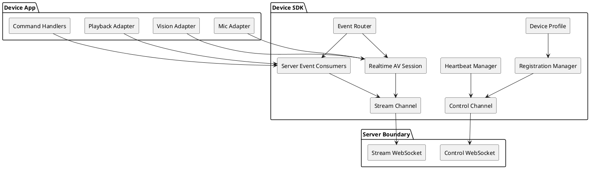
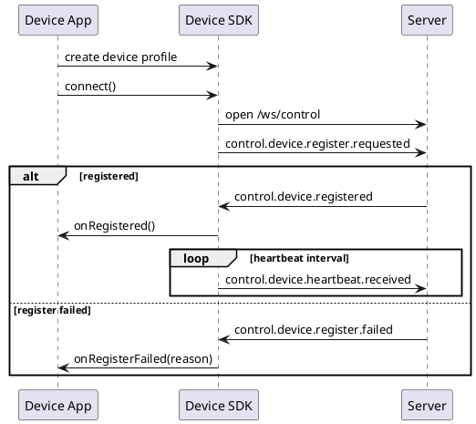
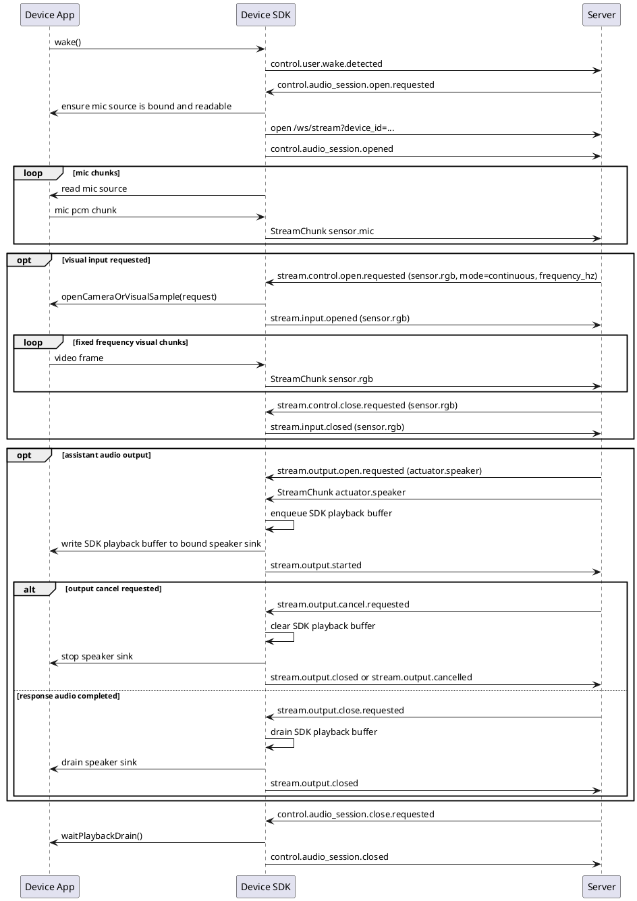
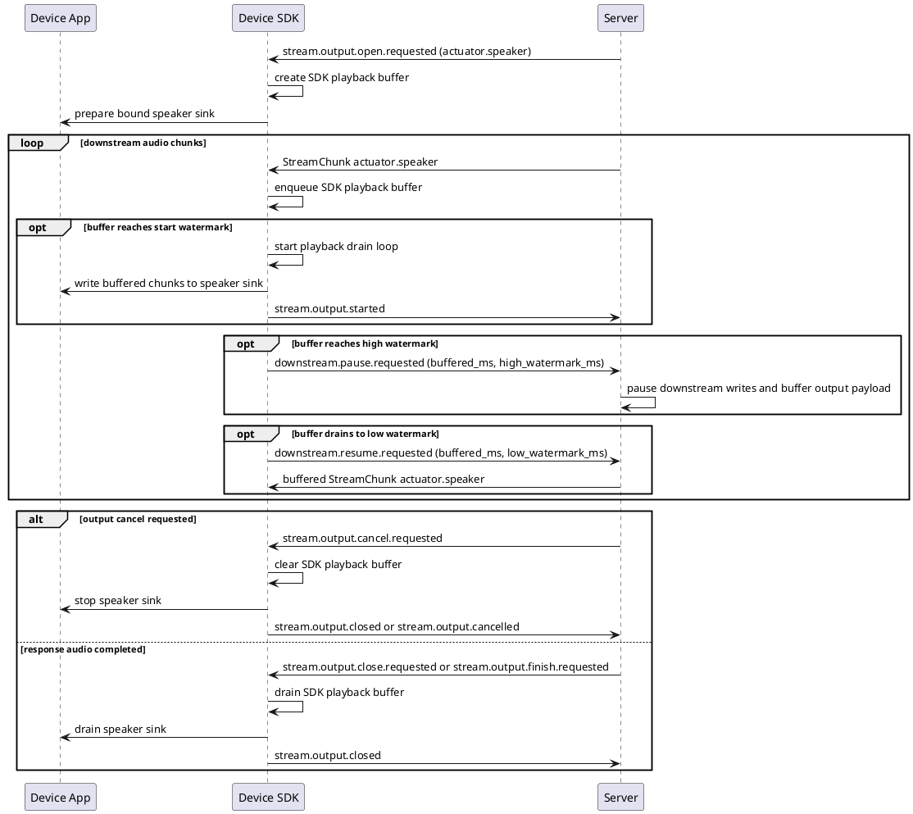
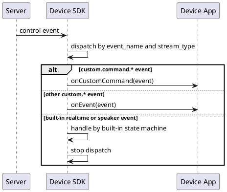
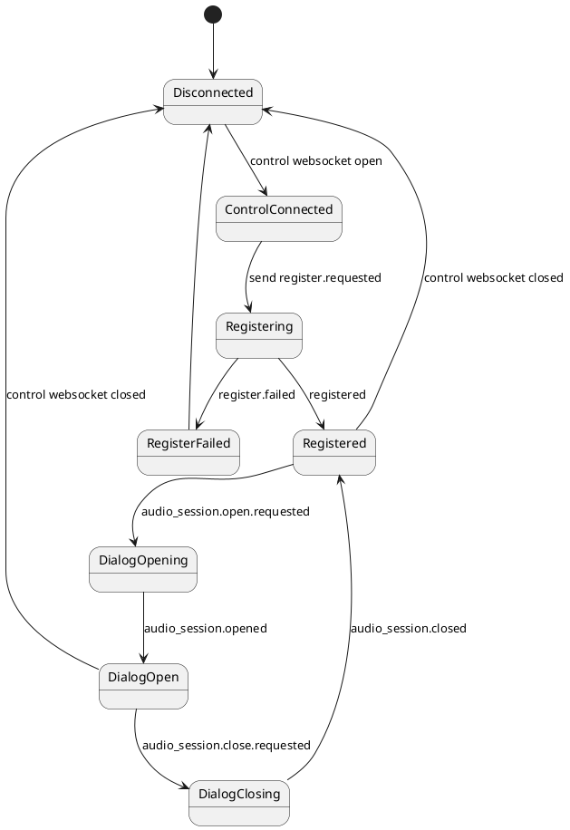

# 端侧 SDK 事件行为实现蓝图

本文给出各语言端侧 SDK 的统一实现蓝图。目标是让浏览器、Python、Swift、Kotlin、C/C++、嵌入式网关等不同端侧实现，按同一套事件行为支持三大功能：

1. 设备注册。
2. 开启实时对话。
3. 设备消费 server 事件。

本文只写时序图和伪代码，不写任何具体语言实现。各语言 SDK 后续应把这些伪代码翻译成符合本语言习惯的 API、状态机和测试。

## 1. SDK 分层

端侧 SDK 负责通讯、事件、stream、状态机、回执和平台默认硬件 adapter。麦克风、相机、喇叭默认禁用；App 显式 enable 后，SDK 才使用平台默认 adapter 注册这些能力。App 可以覆盖默认 adapter，但不应该被迫手写 chunk、WebSocket 或标准事件状态机。



SDK 对外需要暴露的抽象能力：

| 抽象 | 职责 |
| --- | --- |
| Device Profile | 生成注册 payload，包含身份、runtime、properties、supports。 |
| Control Channel | 连接 `/ws/control`，发送和接收 JSON Event。 |
| Stream Channel | 连接 `/ws/stream?device_id=...`，收发 StreamChunk。 |
| Event Router | 按事件名和 stream_type 分发 server 事件。 |
| Registration Manager | 管理注册、注册失败、重连和心跳启动。 |
| Realtime AV Session | 管理唤醒、音频会话、麦克风流和视觉流。 |
| Server Event Consumers | 处理 `stream.control.*`、speaker 专用 `stream.output.*`、`downstream.*`、`custom.*` 并发送回执。 |
| Heartbeat Manager | 注册成功后按 server 返回间隔发送心跳。 |

### 1.1 本地硬件绑定约定

SDK 必须提供“默认禁用、显式启用、可覆盖 adapter”的硬件接入 API。默认情况下不注册麦克风、相机或喇叭；App 显式 enable 后，SDK 使用平台默认 adapter。默认 adapter 不适用时，App 可以覆盖 source / sink。会话过程中 SDK 只使用已启用或已覆盖的 adapter，不要求 App 处理协议 chunk。

| 绑定对象 | 方向 | SDK 使用方式 | 最小能力 |
| --- | --- | --- | --- |
| `sensor.mic` source | SDK/App -> SDK -> Server | 显式启用后，SDK 从默认或覆盖 source 读取 PCM 字节，封装 `StreamChunk sensor.mic` 写入 `/ws/stream` | `format`、`readChunk()` 或 async chunk producer、`close()` |
| `sensor.rgb` source | SDK/App -> SDK -> Server | 显式启用后，SDK 按 server 请求的 `frequency_hz` 读取帧，封装 `StreamChunk sensor.rgb` 写入 `/ws/stream` | `format`、`readFrame()`、`close()` |
| `actuator.speaker` sink | Server -> SDK -> SDK/App | 显式启用后，SDK 接收 `StreamChunk actuator.speaker`，经过 SDK playback buffer 后写入默认或覆盖 sink 播放 | `prepare(format)`、`writeChunk()`、`drain()`、`cancel()`、`close()` |
| 自定义业务动作 | Server -> SDK -> App | SDK 通过 `custom.command.*` 或其他 `custom.*` 调用 App 注册的 handler | `on_custom_command(...)` 或 `on_event(...)` |

目标 API 形态示例：

```text
sdk.enableAudioInput()
sdk.enableCamera()
sdk.enableSpeaker(buffer = PlaybackBuffer.default())

sdk.overrideInput("sensor.mic", customMicSource)
sdk.overrideInput("sensor.rgb", customCameraSource)
sdk.overrideOutput("actuator.speaker", customSpeakerSink)
```

`customMicSource`、`customCameraSource`、`customSpeakerSink` 可以包装真实硬件、浏览器媒体流、文件样例或测试 mock。SDK 不关心资源来自哪里，只要求 adapter 的格式声明和实际字节一致。

speaker sink 不负责实现端侧接收 buffer，也不负责判断水位线。speaker 播放 buffer 是 SDK 的内置能力，用来隐藏网络抖动并控制内存占用。App 开发者只需要配置 SDK 的播放 buffer 参数；SDK 用这些参数决定何时向 server 发送 `downstream.pause.requested` / `downstream.resume.requested`。

```text
sdk.configurePlaybackBuffer("actuator.speaker", {
  start_watermark_ms: 120,
  low_watermark_ms: 300,
  high_watermark_ms: 800,
  max_buffer_ms: 1200
})
```

## 2. 设备注册

### 2.1 时序图



### 2.2 伪代码

```text
TYPE DeviceProfile:
  device_id
  user_id
  name
  client_type
  sdk_version
  runtime
  properties
  supports

FUNCTION buildRegistrationEvent(profile):
  REQUIRE profile.device_id is not empty
  REQUIRE profile.user_id is not empty
  REQUIRE profile.supports uses structured sensors/actuators
  REQUIRE generated payload has no routes
  REQUIRE generated payload has no legacy capabilities

  RETURN Event(
    event_name = "control.device.register.requested",
    user_id = profile.user_id,
    producer_id = profile.device_id,
    payload = {
      device_id = profile.device_id,
      name = profile.name,
      client_type = profile.client_type,
      sdk_version = profile.sdk_version,
      runtime = profile.runtime,
      properties = profile.properties,
      supports = profile.supports
    }
  )

FUNCTION connectAndRegister(profile):
  control.open("/ws/control")
  registration_event = buildRegistrationEvent(profile)
  control.send(registration_event)

  LOOP while control is open:
    event = control.receive()
    IF event.event_name == "control.device.registered":
      state.registered = true
      state.connection_id = event.payload.connection_id
      heartbeat.start(event.payload.heartbeat_interval_seconds)
      callbacks.onRegistered(event)
      eventRouter.start()
    ELSE IF event.event_name == "control.device.register.failed":
      state.registered = false
      callbacks.onRegisterFailed(event.payload.reason)
      STOP registration flow
    ELSE:
      eventRouter.dispatch(event)

FUNCTION heartbeatLoop(interval_seconds):
  LOOP while state.registered and control is open:
    sleep(interval_seconds)
    control.send(Event(
      event_name = "control.device.heartbeat.received",
      user_id = profile.user_id,
      producer_id = profile.device_id,
      payload = {
        connection_state = "online",
        client_type = profile.client_type
      }
    ))
```

## 3. 开启实时对话

实时对话由唤醒事件触发。端侧 SDK 不做语音起止判断，VAD / turn 边界由 server 根据连续 `sensor.mic` 音频流判断。麦克风硬件或系统录音资源可以由 SDK 默认 adapter 管理，也可以由 App 覆盖 adapter；SDK 的协议责任是在收到 `control.audio_session.open.requested` 后建立或复用 stream 通道，发送 `control.audio_session.opened`，并在会话打开后维护麦克风上行、可选视频上行和 server 音频下行播放。

### 3.1 时序图



### 3.2 音频下行播放与 SDK 水位线流控时序图

音频下行播放从主实时对话图中拆出来单独说明。这里的 buffer 是端侧 SDK 的内置播放 buffer，不是 App 或 speaker sink 的自定义队列。App 只提供 `actuator.speaker` sink，并配置 SDK buffer 的启动水位线、低水位线、高水位线和最大容量。



### 3.3 伪代码

```text
TYPE RealtimeAVSession:
  session_id
  mic_stream_id
  mic_state
  visual_stream_id
  visual_state
  stream_channel_state
  playback_state

FUNCTION wake(wake_source):
  REQUIRE state.registered == true
  control.send(Event(
    event_name = "control.user.wake.detected",
    user_id = profile.user_id,
    producer_id = profile.device_id,
    payload = { wake_source }
  ))

FUNCTION handleAudioSessionOpenRequested(event):
  IF realtime.mic_state is "open":
    RETURN

  realtime.session_id = event.session_id OR profile.device_id
  REQUIRE adapters.input["sensor.mic"] exists
  micAdapter = adapters.input["sensor.mic"]
  stream.ensureOpen(device_id = profile.device_id)
  realtime.mic_stream_id = newStreamId("stream_mic")
  realtime.mic_state = "open"

  control.send(Event(
    event_name = "control.audio_session.opened",
    user_id = profile.user_id,
    producer_id = profile.device_id,
    session_id = realtime.session_id,
    payload = {
      reason = "device_upstream_ready",
      input_stream = {
        stream_id = realtime.mic_stream_id,
        stream_type = "sensor.mic",
        format = micAdapter.format
      }
    }
  ))

  START micUploadLoop()

FUNCTION micUploadLoop():
  LOOP while realtime.mic_state == "open":
    WAIT until micAdapter has next chunk
    chunk = micAdapter.readChunk()
    stream.sendChunk(StreamChunk(
      user_id = profile.user_id,
      session_id = realtime.session_id,
      stream_id = realtime.mic_stream_id,
      stream_type = "sensor.mic",
      seq = nextSeq(realtime.mic_stream_id),
      payload = chunk.bytes,
      codec = chunk.codec,
      sample_rate = chunk.sample_rate,
      channels = chunk.channels,
      duration_ms = chunk.duration_ms,
      final = false
    ))

FUNCTION handleVisualOpenRequested(event):
  REQUIRE event.stream_type == "sensor.rgb"
  REQUIRE adapters.input["sensor.rgb"] exists
  visual_stream_id = event.stream_id OR newStreamId("stream_rgb")
  request = event.payload
  visualAdapter = adapters.input["sensor.rgb"]
  frequency_hz = request.frequency_hz OR visualAdapter.default_frequency_hz

  TRY:
    visualSource = visualAdapter.open(request)
    realtime.visual_stream_id = visual_stream_id
    realtime.visual_state = "open"

    control.send(Event(
      event_name = "stream.input.opened",
      user_id = profile.user_id,
      producer_id = profile.device_id,
      session_id = event.session_id OR realtime.session_id,
      stream_id = visual_stream_id,
      stream_type = "sensor.rgb",
      payload = {
        stream_type = "sensor.rgb",
        request_id = request.request_id,
        format = visualSource.format
      }
    ))

    LOOP while realtime.visual_state == "open":
      WAIT until next visual tick at frequency_hz
      frame = visualSource.readFrame()
      stream.sendChunk(StreamChunk(
        user_id = profile.user_id,
        session_id = event.session_id OR realtime.session_id,
        stream_id = visual_stream_id,
        stream_type = "sensor.rgb",
        seq = nextSeq(visual_stream_id),
        payload = frame.bytes,
        codec = frame.codec,
        sample_rate = frame.sample_rate,
        channels = 1,
        duration_ms = frame.duration_ms,
        final = false,
        metadata = {
          request_id = request.request_id,
          width = frame.width,
          height = frame.height,
          captured_at_ms = nowMs()
        }
      ))

  CATCH error:
    control.send(Event(
      event_name = "stream.input.failed",
      user_id = profile.user_id,
      producer_id = profile.device_id,
      session_id = event.session_id OR realtime.session_id,
      stream_id = visual_stream_id,
      stream_type = "sensor.rgb",
      payload = {
        stream_type = "sensor.rgb",
        request_id = request.request_id,
        reason = "visual_capture_failed",
        error = error.message
      }
    ))

FUNCTION handleVisualCloseRequested(event):
  IF event.stream_type != "sensor.rgb":
    RETURN

  realtime.visual_state = "closing"
  visualAdapter = adapters.input["sensor.rgb"]
  visualAdapter.close(event.stream_id OR realtime.visual_stream_id)

  TRY:
    control.send(Event(
      event_name = "stream.input.closed",
      user_id = profile.user_id,
      producer_id = profile.device_id,
      session_id = event.session_id OR realtime.session_id,
      stream_id = event.stream_id OR realtime.visual_stream_id,
      stream_type = "sensor.rgb",
      payload = {
        stream_type = "sensor.rgb",
        request_id = event.payload.request_id,
        reason = "server_close_requested"
      }
    ))
  FINALLY:
    realtime.visual_state = "closed"
    realtime.visual_stream_id = null

FUNCTION handleSpeakerOutputOpenRequested(event):
  REQUIRE event.stream_type == "actuator.speaker"
  REQUIRE adapters.output["actuator.speaker"] exists
  speakerSink = adapters.output["actuator.speaker"]
  output = outputRegistry.open(event.stream_id, event.stream_type)
  playbackBuffer = playbackBuffers.create(
    stream_id = event.stream_id,
    config = sdkConfig.playback_buffer["actuator.speaker"]
  )
  speakerSink.prepare(event.payload.format)
  output.playback_buffer_id = playbackBuffer.id
  output.pause_sent = false

FUNCTION onSpeakerOutputChunk(chunk):
  output = outputRegistry.get(chunk.stream_id)
  playbackBuffer = playbackBuffers.get(output.playback_buffer_id)
  speakerSink = adapters.output["actuator.speaker"]
  playbackBuffer.enqueue(chunk)

  IF output.state != "started" AND playbackBuffer.bufferedMs() >= playbackBuffer.startWatermarkMs:
    START playbackDrainLoop(chunk.stream_id)
    output.state = "started"
    control.send(Event(
      event_name = "stream.output.started",
      user_id = profile.user_id,
      producer_id = profile.device_id,
      session_id = chunk.session_id,
      stream_id = chunk.stream_id,
      stream_type = chunk.stream_type,
      payload = { stream_type = chunk.stream_type }
    ))

  IF playbackBuffer.bufferedMs() >= playbackBuffer.highWatermarkMs AND output.pause_sent == false:
    output.pause_sent = true
    control.send(Event(
      event_name = "downstream.pause.requested",
      user_id = chunk.user_id,
      producer_id = profile.device_id,
      session_id = chunk.session_id,
      stream_id = chunk.stream_id,
      stream_type = chunk.stream_type,
      payload = {
        stream_type = chunk.stream_type,
        buffered_ms = playbackBuffer.bufferedMs(),
        high_watermark_ms = playbackBuffer.highWatermarkMs,
        reason = "speaker_buffer_high"
      }
    ))

FUNCTION playbackDrainLoop(stream_id):
  output = outputRegistry.get(stream_id)
  playbackBuffer = playbackBuffers.get(output.playback_buffer_id)
  speakerSink = adapters.output["actuator.speaker"]

  LOOP while output.state != "cancelled":
    audioChunk = playbackBuffer.readNextOrWait()
    IF audioChunk exists:
      speakerSink.writeChunk(audioChunk)
    onPlaybackBufferDrained(stream_id)
    IF playbackBuffer.isFinalDrained():
      BREAK

FUNCTION onPlaybackBufferDrained(stream_id):
  output = outputRegistry.get(stream_id)
  playbackBuffer = playbackBuffers.get(output.playback_buffer_id)
  IF output.pause_sent == true AND playbackBuffer.bufferedMs() <= playbackBuffer.lowWatermarkMs:
    output.pause_sent = false
    control.send(Event(
      event_name = "downstream.resume.requested",
      user_id = output.user_id,
      producer_id = profile.device_id,
      session_id = output.session_id,
      stream_id = stream_id,
      stream_type = output.stream_type,
      payload = {
        stream_type = output.stream_type,
        buffered_ms = playbackBuffer.bufferedMs(),
        low_watermark_ms = playbackBuffer.lowWatermarkMs,
        reason = "speaker_buffer_low"
      }
    ))

FUNCTION handleSpeakerOutputCloseRequested(event):
  output = outputRegistry.get(event.stream_id)
  playbackBuffer = playbackBuffers.get(output.playback_buffer_id)
  speakerSink = adapters.output["actuator.speaker"]
  output.state = "closing"
  playbackBuffer.markFinal()
  playbackBuffer.waitFinalDrained()
  speakerSink.drain(event.stream_id)
  speakerSink.close(event.stream_id)
  playbackBuffers.remove(event.stream_id)
  outputRegistry.remove(event.stream_id)

  control.send(Event(
    event_name = "stream.output.closed",
    user_id = profile.user_id,
    producer_id = profile.device_id,
    session_id = event.session_id,
    stream_id = event.stream_id,
    stream_type = event.stream_type,
    payload = {
      stream_type = event.stream_type,
      reason = "speaker_output_closed"
    }
  ))

FUNCTION handleSpeakerOutputCancelRequested(event):
  output = outputRegistry.get(event.stream_id)
  playbackBuffer = playbackBuffers.get(output.playback_buffer_id)
  speakerSink = adapters.output["actuator.speaker"]
  output.state = "cancelled"
  playbackBuffer.clear()
  speakerSink.cancel(event.stream_id)
  playbackBuffers.remove(event.stream_id)
  outputRegistry.remove(event.stream_id)

  control.send(Event(
    event_name = "stream.output.closed",
    user_id = profile.user_id,
    producer_id = profile.device_id,
    session_id = event.session_id,
    stream_id = event.stream_id,
    stream_type = event.stream_type,
    payload = {
      stream_type = event.stream_type,
      reason = "server_cancel_requested"
    }
  ))

FUNCTION handleAudioSessionCloseRequested(event):
  realtime.mic_state = "closing"
  micAdapter = adapters.input["sensor.mic"]
  micAdapter.close()

  outputRegistry.waitAllPlaybackDrain()
  control.send(Event(
    event_name = "control.audio_session.closed",
    user_id = profile.user_id,
    producer_id = profile.device_id,
    session_id = realtime.session_id,
    payload = { reason = "device_audio_session_closed" }
  ))

  realtime.reset()
```

## 4. 设备消费其他 Server 事件

本节只覆盖注册、实时对话主链路之外的事件。标准协议事件不应该在本节继续扩展含义。`command.requested` 属于标准命令事件族；`stream.output.open.requested` / `stream.output.close.requested` / `stream.output.cancel.requested` 属于标准 output stream 生命周期，已经在第 3 节作为 `actuator.speaker` 下行播放生命周期讲过。为了避免和这些内置事件族冲突，业务扩展必须使用 `custom.*` 事件名。图中 `SDK -> App` 的箭头表示 SDK 调用宿主应用的本地回调，不是控制面协议事件。

SDK 事件路由必须用事件命名空间隔离标准事件和自定义事件，而不是只靠“未命中内置 handler 再兜底”的隐式约定。标准事件继续使用 `control.*`、`stream.*`、`command.*`、`system.*` 等命名空间；所有业务扩展或 App 自定义事件必须使用 `custom.*` 命名空间。

路由规则必须固定为：

1. `event_name` 以 `custom.` 开头：SDK 不进入任何标准内置状态机，只进入自定义事件分发器。
2. `event_name` 不以 `custom.` 开头：SDK 按标准协议处理，只能进入注册、音频会话、实时视频、speaker 播放、标准命令等内置状态机。
3. 标准事件不能再投递给自定义 `on_event`。因此 `stream.output.open.requested (actuator.speaker)` 只会进入 speaker 播放状态机，不会同时触发自定义事件回调。

未来 SDK 应支持的其他消费入口：

| server 事件 | SDK 入口 | 代表含义 | App 应做什么 |
| --- | --- | --- | --- |
| `custom.command.requested` | `on_custom_command(...)` / `onCustomCommand(...)`；也可以用 `on_event(...)` | 业务自定义的低频端侧动作，例如业务模式切换、peer video 控制、自定义硬件动作 | 执行业务命令；如需回报业务结果，使用 `ctx.emit("custom.<domain>.<event>", payload)` 发送自定义事件 |
| 其他 `custom.<domain>.*` | `on_event(...)` / `onEvent(...)` / `onEvent` | 项目扩展协议事件或 App 自定义事件 | App 自行解释 payload，并按该事件协议回执 |

自定义事件命名建议使用 `custom.<app_or_domain>.<event_name>`，必要时追加状态后缀，例如 `custom.navigation.route.updated`。`custom.command.*` 是独立的自定义事件族，只用于业务扩展；不能替代标准 `command.*`。speaker 音频播放永远使用标准 `stream.output.* (actuator.speaker)` 链路。非音频业务动作优先使用 `custom.command.requested` 或普通 `custom.<domain>.*` 事件，不暴露 `custom.output.*` 作为 App 开发者主路径。

当前协议实现已经允许 `custom.*` 事件名通过 schema 和 server 运行时校验。App 通过端侧 SDK 的 `on_custom_command(...)` / `on_event(...)` 注册回调后，SDK 会在设备注册 payload 的 properties 中声明自定义消费能力，server 再据此生成 `custom.command.requested` 或具体 `custom.<domain>.*` 投递路由。App 不需要手写 routes。

本节伪代码里要区分两类函数：

- `on_event(...)`、`on_custom_command(...)` 是 SDK 暴露给 App 的公开注册 API，App 用它们注册回调。
- `handle*` / `dispatch*` 是 SDK 内部路由函数，只负责把 server 事件转成对应回调调用，不是 App 直接使用的 API。

### 4.1 总时序图



### 4.2 App 回调注册伪代码

```text
FUNCTION on_event(event_name, callback):
  REQUIRE event_name starts with "custom."
  callbackRegistry.custom_events[event_name].append(callback)

FUNCTION on_custom_command(command_name, callback):
  callbackRegistry.custom_commands[command_name] = callback

// App side usage:
sdk.on_custom_command("haptic.vibrate", handleVibrate)
sdk.on_event("custom.navigation.route.updated", handleRouteUpdated)
```

### 4.3 SDK 内部事件路由伪代码

```text
FUNCTION dispatchServerEvent(event):
  IF event.event_name starts with "custom.":
    dispatchCustomEvent(event)
    RETURN

  SWITCH event.event_name:
    CASE "control.audio_session.open.requested":
      handleAudioSessionOpenRequested(event)
      RETURN

    CASE "control.audio_session.close.requested":
      handleAudioSessionCloseRequested(event)
      RETURN

    CASE "stream.control.open.requested":
      // Realtime video input is defined in section 3.
      handleInputOpenRequested(event)
      RETURN

    CASE "stream.control.close.requested":
      // Realtime video input is defined in section 3.
      IF event.stream_type == "sensor.rgb":
        handleVisualCloseRequested(event)
      ELSE:
        handleInputCloseRequested(event)
      RETURN

    CASE "stream.output.open.requested":
      handleStandardOutputOpenRequested(event)
      RETURN

    CASE "stream.output.close.requested":
      handleStandardOutputCloseRequested(event)
      RETURN

    CASE "stream.output.cancel.requested":
      handleStandardOutputCancelRequested(event)
      RETURN

    CASE "command.requested":
      handleStandardCommandRequested(event)
      RETURN

    DEFAULT:
      callbacks.onUnhandledServerEvent(event)

FUNCTION dispatchCustomEvent(event):
  IF event.event_name == "custom.command.requested":
    handleCustomCommandRequested(event)
    RETURN

  eventCallbacks = callbackRegistry.custom_events[event.event_name]
  IF eventCallbacks is empty:
    callbacks.onUnhandledServerEvent(event)
    RETURN

  FOR callback in eventCallbacks:
    callback(event)
```

### 4.4 输入采集 consumer 伪代码

本小节是第 3 节视频输入链路的 SDK 内部路由细节，放在这里是为了展示 consumer 分发形态；它不是本节定义的“其他事件”。

```text
FUNCTION handleInputOpenRequested(event):
  IF event.stream_type == "sensor.rgb":
    handleVisualOpenRequested(event)
    RETURN

  IF event.stream_type is supported by application:
    openGenericSensorStream(event)
    RETURN

  control.send(Event(
    event_name = "stream.input.failed",
    user_id = profile.user_id,
    producer_id = profile.device_id,
    session_id = event.session_id,
    stream_id = event.stream_id,
    stream_type = event.stream_type,
    payload = {
      stream_type = event.stream_type,
      reason = "unsupported_stream_type"
    }
  ))

FUNCTION handleInputCloseRequested(event):
  callbacks.closeSensor(event.stream_type, event.stream_id)
  control.send(Event(
    event_name = "stream.input.closed",
    user_id = profile.user_id,
    producer_id = profile.device_id,
    session_id = event.session_id,
    stream_id = event.stream_id,
    stream_type = event.stream_type,
    payload = {
      stream_type = event.stream_type,
      reason = "server_close_requested"
    }
  ))
```

### 4.5 自定义命令 consumer 伪代码

```text
FUNCTION handleCustomCommandRequested(event):
  command = event.payload.command
  commandCallback = callbackRegistry.custom_commands[command]

  IF commandCallback does not exist:
    callbacks.onUnhandledServerEvent(event)
    RETURN

  TRY:
    commandContext = CustomCommandContext(event)
    commandCallback(commandContext)

  CATCH error:
    callbacks.onHandlerError(event, error)

TYPE CustomCommandContext:
  event
  payload = event.payload

  FUNCTION emit(event_name, payload):
    REQUIRE event_name starts with "custom."
    control.send(Event(
      event_name = event_name,
      user_id = event.user_id,
      producer_id = profile.device_id,
      session_id = event.session_id,
      payload = payload
    ))
```

## 5. 跨语言 SDK 必须保持一致的状态机



状态机伪代码：

```text
STATE Disconnected:
  on connect requested:
    open control websocket
    move to ControlConnected

STATE ControlConnected:
  on control opened:
    send registration
    move to Registering

STATE Registering:
  on registered:
    start heartbeat
    move to Registered
  on register failed:
    stop heartbeat
    move to RegisterFailed

STATE Registered:
  on audio_session.open.requested:
    ensure upstream stream channel
    move to DialogOpening
  on control closed:
    stop heartbeat
    move to Disconnected

STATE DialogOpening:
  on stream channel ready:
    send audio_session.opened
    move to DialogOpen

STATE DialogOpen:
  on mic chunk:
    send StreamChunk sensor.mic
  on visual request:
    upload sensor.rgb stream
  on output request:
    play output and ack
  on custom.command.requested:
    dispatch custom command callback
  on audio_session.close.requested:
    close audio session and drain playback
    move to DialogClosing

STATE DialogClosing:
  on session resources closed:
    send audio_session.closed
    move to Registered
```

## 6. 契约测试建议

每个语言 SDK 至少应有以下契约测试。测试可以使用本地 loopback server，不需要真实模型和真实硬件。

1. 注册成功：SDK 发送 `control.device.register.requested`，收到 `registered` 后启动心跳。
2. 注册失败：SDK 收到 `register.failed` 后不启动心跳，并向应用暴露失败原因。
3. 实时音频打开：收到 `control.audio_session.open.requested` 后，SDK 建立或复用 stream 通道，回 `control.audio_session.opened`，并在 payload 中声明 `sensor.mic` 上行 stream。
4. 麦克风连续上传：SDK 持续发送 `sensor.mic` chunk，且 `final=True` 不代表端侧 VAD 语音结束。
5. 视频输入：收到 `stream.control.open.requested (sensor.rgb, mode=continuous)` 后，SDK 回 `stream.input.opened`，按 `frequency_hz` 持续上传 RGB chunk；收到 `stream.control.close.requested` 或会话关闭后回 `stream.input.closed`。
6. 输出播放：收到标准 `stream.output.open.requested (actuator.speaker)` 和输出 chunk 后，SDK 回 `stream.output.started`；收到 `stream.output.close.requested` 后，等待本地 drain，再回 `stream.output.closed`。
7. 自定义命令执行：收到 `custom.command.requested` 后，SDK 调用 App 通过 `on_custom_command(...)` 注册的回调；如需回报业务结果，handler 使用 `ctx.emit("custom.<domain>.<event>", payload)`。
8. 关闭会话：收到 `control.audio_session.close.requested` 后，SDK 结束本次音频会话、等待播放 drain、回 `control.audio_session.closed`。
