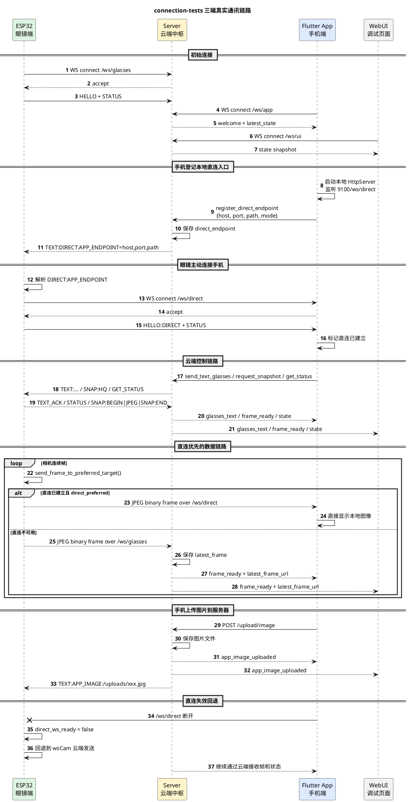

# connection-tests 三端通讯链路与 nextgen 对照

## 1. 文档目的

本文档用于沉淀 `connection-tests/` 目录中的三设备真实连接测试方案，回答两个问题：

- 这套测试代码是如何完成眼镜、手机、服务器三端通讯的
- 它和当前 `nextgen/` 中的新架构相比，哪些设计已经吻合，哪些还没有被吸收进去

本文重点不是评价代码质量，而是把现有真实联调经验转成后续架构演进的输入。

---

## 2. 三端角色定位

`connection-tests` 中的三端职责非常清晰：

- 眼镜端 `esp32/esp32.ino`
  - 常驻连接服务器云端 WebSocket
  - 在拿到手机的局域网直连端点后，主动连接手机本地 WebSocket
  - 负责相机图像发送、状态上报、接收文字命令、抓拍等

- 手机端 `flutter_app`
  - 常驻连接服务器云端 WebSocket
  - 在本机启动一个本地 WebSocket 服务，等待 ESP32 直连
  - 根据当前模式选择“直连优先”或“云端中转”
  - 接收 ESP32 直连图片流和文字消息，并把本地端点上报给服务器

- 服务器端 `server/app.py`
  - 作为三端联调中枢
  - 维护 ESP32、App、WebUI 的连接状态
  - 转发控制命令和状态消息
  - 负责把手机的本地直连端点下发给 ESP32
  - 在直连失败时承接图片和文字的云端回退链路

所以这套方案的本质是：

- 控制面以服务器为中枢
- 数据面优先眼镜和手机直连
- 云端保留兜底路径

这和我们当前讨论的“三端协同 + 控制面/数据面分离”方向是高度一致的。

---

## 3. 核心连接关系

### 3.1 云端连接

- ESP32 主动连接服务器 `WS /ws/glasses`
- Flutter App 主动连接服务器 `WS /ws/app`
- 浏览器调试页面连接服务器 `WS /ws/ui`

### 3.2 本地直连

- Flutter App 在本机监听 `9100/ws/direct`
- App 把 `host/port/path` 通过云端 WebSocket 注册到服务器
- 服务器再把这个直连端点通过文本命令下发给 ESP32
- ESP32 拿到端点后，主动连接 App 的 `/ws/direct`

### 3.3 图像与消息路由原则

- 控制指令、状态查询、调试消息：优先通过服务器中转
- 图像帧和抓拍图片：优先走 ESP32 -> App 直连
- 如果直连不可用：回退到 ESP32 -> Server -> App/UI

---

## 4. 关键实现点

### 4.1 ESP32 如何连接服务器和手机

在 [esp32.ino](/Users/elio/dev/llm-project/OpenAIglasses_for_Navigation/connection-tests/esp32/esp32.ino) 中：

- `wsCam` 连接服务器 `/ws/glasses`
- `wsAud` 连接服务器 `/ws/audio`
- `wsDirect` 连接手机 `/ws/direct`

关键路径：

- `loop()` 中持续重连 `wsCam`
- `handle_text_command()` 中解析服务器下发的 `DIRECT:APP_ENDPOINT=host,port,path`
- `update_direct_endpoint()` 更新手机直连目标
- `try_connect_direct_ws()` 主动连接手机本地 WebSocket

ESP32 实际维持的是“两条链路同时在线”的模式：

- 云端链路 `wsCam`
- 本地直连链路 `wsDirect`

### 4.2 App 如何同时承担客户端和服务端角色

在 [test_screen.dart](/Users/elio/dev/llm-project/OpenAIglasses_for_Navigation/connection-tests/flutter_app/lib/screens/test_screen.dart) 中：

- 通过 [ws_service.dart](/Users/elio/dev/llm-project/OpenAIglasses_for_Navigation/connection-tests/flutter_app/lib/services/ws_service.dart) 连接服务器 `/ws/app`
- 通过 [local_bridge_service.dart](/Users/elio/dev/llm-project/OpenAIglasses_for_Navigation/connection-tests/flutter_app/lib/services/local_bridge_service.dart) 在本机启动 `9100/ws/direct`

这意味着 App 不是单纯的“服务器客户端”，而是：

- 对服务器来说，它是一个 WebSocket client
- 对 ESP32 来说，它是一个 WebSocket server

这点非常重要，因为它证明了：

- “手机端暴露局域网入口，眼镜主动来连”在真实测试里是跑通的

### 4.3 服务器如何做信令中枢

在 [app.py](/Users/elio/dev/llm-project/OpenAIglasses_for_Navigation/connection-tests/server/app.py) 中：

- `BridgeState` 持有全部联调状态
- `/ws/glasses` 负责接 ESP32
- `/ws/app` 负责接 Flutter App
- `handle_app_command()` 处理 App 发来的注册直连端点、发送文字、请求抓拍、请求状态等指令
- `sync_direct_endpoint_to_glasses()` 把 App 的直连端点下发给 ESP32

服务器真正做的是：

- 统一存储当前“谁在线”
- 把 App 的“可直连地址”告诉 ESP32
- 在必要时替 App 和 ESP32 做转发

所以它更像“信令与观测中枢”，而不是“所有数据都必须经过它的中转站”。

---

## 5. 三端详细时序图

下面这张图描述的是 `connection-tests` 当前最核心的一条联调链路：

- App 连云端
- App 注册本地直连端点
- 服务器把直连端点同步给 ESP32
- ESP32 主动连 App
- 后续控制走云端，图像优先走直连，失败时回退云端

---

## 6. 关键通讯机制总结

### 6.1 手机直连端点不是“被发现”，而是“被登记”

这套代码不是用 mDNS、广播或 NAT 穿透去自动发现手机，而是：

- App 自己算出局域网 IP
- App 主动告诉服务器“我在这里”
- 服务器再告诉 ESP32 去连这里

所以它是一个非常明确的“控制面协商 -> 数据面直连”模式。

### 6.2 眼镜始终保留云端连接

即使直连建立，ESP32 也没有断开云端。

这意味着：

- 服务器始终能做状态查询
- 服务器始终能下发控制命令
- 直连失败时可以快速回退到云端

这也是这套测试最有价值的地方之一。

### 6.3 图像传输是“按链路状态动态选路”

ESP32 的 `send_frame_to_preferred_target()` 是整个设计的核心：

- 直连可用就发给手机
- 直连不可用就发给服务器
- 云端和直连都在时，优先直连

所以真正的决策点在眼镜端，而不是服务器端。

### 6.4 音频链路仍然是占位

虽然代码里有：

- `wsAud`
- `/ws/audio`
- `stream.wav`
- PDM 采集和 WAV 播放逻辑

但从当前测试配置看：

- `ENABLE_AUDIO_TEST = false`
- 服务器 `/ws/audio` 只是占位 echo

因此这次真实三设备联调的核心，并不是完整音频能力，而是：

- 文字控制
- 图像帧传输
- 本地直连协商
- 云端回退

---

## 7. 与 nextgen 架构逐项对照

下面按“已吻合 / 部分吻合 / 尚未吸收”三类对照。

### 7.1 已吻合的设计

#### 1. 控制面与数据面分离

`connection-tests` 已经体现出：

- 服务器负责信令、状态、控制命令
- 手机和眼镜负责大图像数据直连

这与我们在 [三端架构模块说明与找物案例.md](/Users/elio/dev/llm-project/OpenAIglasses_for_Navigation/docs/total/constraints/三端架构模块说明与找物案例.md) 中定义的：

- 控制面默认经服务器中转
- 数据面必要时眼镜和手机直连

是一致的。

#### 2. 手机接入层维护本地直连入口

`connection-tests` 中的 App 通过 `LocalBridgeService` 启动本地服务，并向服务器登记直连端点。

这和我们在 `nextgen` 中对 `phone_gateway` 的定位吻合：

- 手机接入层负责手机与服务器、眼镜之间的消息通信
- 手机接入层维护任务级直连或媒体通道

#### 3. 眼镜端保留到服务器的长连接

`connection-tests` 没有因为建立了本地直连就断开云端。

这与 `nextgen` 当前的设计完全一致：

- 眼镜运行时需要始终保留与服务器的长连接
- 服务器是全局状态中心和控制中心

#### 4. 服务器承担协调与兜底，而不是强制承载所有媒体流

`connection-tests` 的服务器不是视频流强制中转站。
它更像一个：

- 状态中心
- 信令协调器
- UI 调试入口
- 云端兜底路径

这与我们当前 `server_gateway + event_router + background_task_center + state_log_store` 的分层思想是对齐的。

---

### 7.2 部分吻合，但还没有完全吸收的设计

#### 1. 任务级直连协商已经存在，但还不是统一任务模型的一部分

`connection-tests` 已经跑通了“服务器告诉眼镜去连手机”的机制。

但它当前还是：

- 以字符串命令 `DIRECT:APP_ENDPOINT=...` 为载体
- 没有纳入 `TaskSession`
- 没有和 `CaptureRequest`、`TaskDefinition` 统一建模

而我们在 `nextgen` 中希望它最终是：

- 一个正式的控制面消息
- 和具体任务实例绑定
- 可记录到任务日志和状态快照里

所以方向一致，但抽象层级还不够高。

#### 2. 眼镜端已经有“按链路状态选路”，但还不是 `sensor_hub + gateway` 统一分工

`connection-tests` 里决定视频发给谁的是 ESP32 中的 `send_frame_to_preferred_target()`。

这说明真实需求已经存在：

- 眼镜端确实要自己决定媒体流往哪里走

但当前实现还是耦在固件逻辑里，没有进一步抽象成：

- `sensor_hub` 管采集
- `glass_gateway` 管链路与路由

也就是说，需求被验证了，架构上的模块化拆分还没被吸收进去。

#### 3. App 已经一边连云端、一边开本地服务，但还没有真正的任务中心

`connection-tests` 中的手机端更像“联调桥 + 调试界面”，不是完整的任务执行器。

它缺少我们在 `nextgen` 中已经规划好的：

- `local_task_center`
- `task_components`
- `local_skills`

所以：

- 手机作为“可直连的本地计算节点”这个方向已经被验证
- 但手机作为“本地任务运行时”还没有真正实现

#### 4. 服务器已经有 WebUI 和状态快照，但还没有任务编排语义

`connection-tests/server/app.py` 里已经有很实用的：

- `BridgeState`
- 最近一帧
- 连接状态
- 日志
- WebUI

但它没有：

- `TaskDefinition`
- `TaskSession`
- `create_hybrid_task`
- `background_task_center`

所以它更像“连接测试中枢”，不是我们 `nextgen` 想要的“任务编排服务器”。

---

### 7.3 还没有吸收进去的设计或能力

#### 1. nextgen 还没有真正吸收“手机作为被眼镜主动连接的本地服务端”这个运行形态

我们现在的 `nextgen` 容器级模拟已经做到了：

- 三端直连 WebSocket 长连接

但它仍然是“联调代码里的对等服务”，还没有明确沉淀成：

- 手机端需要常驻一个本地可被眼镜主动连接的服务入口

而这恰恰是 `connection-tests` 里已经被真实验证过的关键能力。

这点我认为值得尽快吸收进 `phone_gateway` 的正式设计。

#### 2. nextgen 还没有吸收“直连端点动态发现/登记/更新”的完整生命周期

`connection-tests` 中的 App 会：

- 自动选择本机局域网 IP
- 在 IP 变化时重新向服务器登记
- 根据 ESP32 当前 IP 优先选择同网段地址

这些都是真实移动端环境里非常重要的细节。

而 `nextgen` 当前更多停留在协议和抽象层，还没有把这一层真正落到：

- 地址发现
- 网络切换
- 端点更新
- 重新登记

#### 3. nextgen 还没有吸收“云端 UI/调试桥”这套极有用的联调能力

`connection-tests/server/app.py` 的 WebUI 非常简单，但价值很高：

- 可以看三端在线状态
- 可以看最新图片
- 可以发命令
- 可以看日志

这套调试桥对于后续真实联调非常有帮助。

当前 `nextgen` 虽然有测试和模拟，但没有直接对应的“联调控制台”落位。
这部分并不属于正式产品架构，但非常值得保留为工程能力。

#### 4. nextgen 还没有吸收“ESP32 上的链路优先级切换”这类固件级策略

`connection-tests` 里很多真实约束已经体现在固件上：

- 直连优先还是云端优先
- 抓拍时如何临时切高分辨率
- 直连失败如何回退
- 当前是否有可用 camera target

这些都是真硬件端必须存在的策略。

而 `nextgen` 当前更多是 Python 参考实现，还没有把这些“端上策略”正式下沉成眼镜固件侧设计。

---

## 8. 我认为最值得吸收进 nextgen 的 4 个点

### 8.1 手机接入层必须支持“本地服务端模式”

也就是：

- 手机不是只去连服务器
- 手机还要能开本地入口，让眼镜主动来连

这点应当正式纳入 `phone_gateway` 设计。

### 8.2 服务器接入层需要正式支持“直连端点登记与下发”

这类能力在 `nextgen` 中应当成为正式协议，而不是临时字符串命令。

建议后续抽象成：

- `register_peer_endpoint`
- `peer_endpoint_updated`
- `peer_direct_connect_request`

这类控制面消息。

### 8.3 眼镜接入层需要正式支持“媒体流选路”

也就是把 `connection-tests` 中的：

- 直连优先
- 云端回退
- 双链路并存

正式吸收到 `glass_gateway` 的职责里，而不是只停留在模拟器层。

### 8.4 联调控制台应当保留为工程设施

这个不一定进产品，但很建议在 `nextgen` 中保留一个：

- 调试状态面板
- 最新帧查看
- 指令注入
- 日志查看

否则后面真机联调成本会高很多。

---

## 9. 结论

`connection-tests` 最大的价值，不是在于它已经实现了完整业务任务，而是在于它验证了下面这件非常关键的事：

- 手机和眼镜之间的直连链路是真实可行的
- 服务器做信令中枢和兜底是合理的
- 三端并存、双链路并存是能工作的

它和 `nextgen` 的关系可以概括为：

- `nextgen` 已经在架构抽象和任务模型上更先进
- `connection-tests` 在真实网络形态和移动端/固件连接细节上更贴近真实设备

所以后续最好的方向不是二选一，而是：

- 保留 `nextgen` 的任务模型和模块边界
- 吸收 `connection-tests` 已经验证过的真实三端连接机制

如果要往下推进，我建议下一步就做这两件事之一：

1. 基于这份对照，整理一版“nextgen 需要吸收的 connection-tests 设计清单”
2. 直接开始把 `register_direct_endpoint / DIRECT:APP_ENDPOINT / 手机本地服务端` 这条链迁进 `nextgen`
