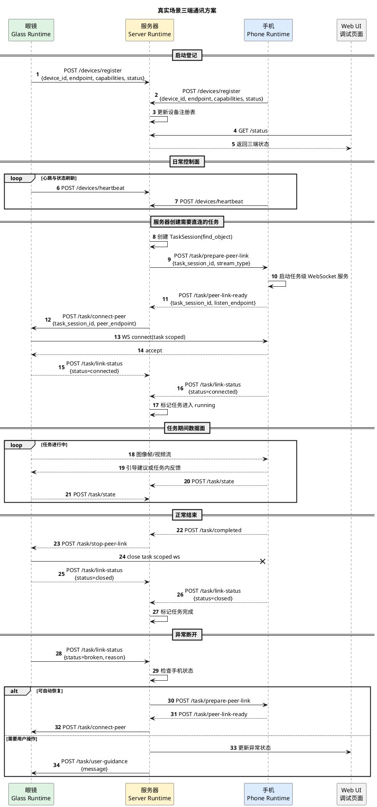

# 真实场景三端通讯方案

## 1. 文档目的

本文档用于定义真实场景下眼镜、手机、服务器三端的通讯方案，重点约束：

- 三端如何建立和维护连接
- 哪些通讯走短时 HTTP，哪些通讯走任务级长连接
- 服务器如何协调眼镜与手机建立任务级连接
- 连接失败、异常断开时如何恢复
- 这套通讯方式如何服务于前面已经确定的功能与架构设计

本文不展开模块内部算法实现，不讨论最终使用哪种端侧语言，重点只讨论真实可落地的通讯方式。

---

## 1.1 当前参考实现落位

本文档对应的 Python 参考实现当前已落到以下代码中：

- 服务器控制面参考实现
  - [http_control_app.py](/Users/elio/dev/llm-project/OpenAIglasses_for_Navigation/nextgen/apps/server/runtime/http_control_app.py)
  - [device_registry.py](/Users/elio/dev/llm-project/OpenAIglasses_for_Navigation/nextgen/apps/server/runtime/device_registry.py)
  - [peer_link_coordinator.py](/Users/elio/dev/llm-project/OpenAIglasses_for_Navigation/nextgen/apps/server/runtime/peer_link_coordinator.py)

- 眼镜控制面参考实现
  - [app.py](/Users/elio/dev/llm-project/OpenAIglasses_for_Navigation/nextgen/apps/glass/runtime/app.py)
  - [http_control_app.py](/Users/elio/dev/llm-project/OpenAIglasses_for_Navigation/nextgen/apps/glass/runtime/http_control_app.py)

- 手机端正式实现
  - [clients/phone_flutter](/Users/elio/dev/llm-project/OpenAIglasses_for_Navigation/clients/phone_flutter)

- 共享控制面模型
  - [control.py](/Users/elio/dev/llm-project/OpenAIglasses_for_Navigation/nextgen/shared/models/control.py)
  - [task.py](/Users/elio/dev/llm-project/OpenAIglasses_for_Navigation/nextgen/shared/models/task.py)

当前这批代码已经覆盖：

- 设备注册
- 设备心跳
- 任务级连接准备
- 手机监听入口就绪上报
- 眼镜连接命令处理
- 任务级连接状态上报
- 任务级连接停止
- 简单 Web 状态页
- 任务级 WebSocket 数据面参考实现
- 手机通过 WebSocket 直接向眼镜回找物引导建议
- 手机只向服务器回任务状态、眼镜向服务器回执行状态
- 断链上报与一次自动恢复参考实现
- 服务器侧语音对话会话管理
- 对讲模式：录音文件 -> ASR -> 对话 -> TTS 流式下发
- 实时模式：音频块 -> 实时 ASR -> 中断式回复 -> TTS 流式下发
- glass 侧本机麦克风采集与本机喇叭 PCM 播放

当前还没有覆盖：

- 原始图片帧 / 音频块的数据面传输
- 多次重试、指数退避等完整恢复策略执行器
- 需要用户参与时的交互式恢复提示链路
- 对 DashScope 真服务的端到端自动化回归测试

### 1.2 当前可运行入口

当前仓库已经提供了真实可启动的参考入口：

- 服务器控制面：
  - `uv run python scripts/run_server_control_runtime.py --host 127.0.0.1 --port 18090`
- 眼镜控制面：
  - `uv run python scripts/run_glass_control_runtime.py --host 127.0.0.1 --port 18091 --advertise-host 127.0.0.1 --server-base-url http://127.0.0.1:18090`
- 手机端：
  - 在 iPhone 上运行 `clients/phone_flutter/`
- 本机联调统一入口：
  - `uv run python scripts/run_local_test_support_service.py`

### 1.3 当前已验证结果

截至 2026-04-05，本仓库已在本地成功验证以下链路：

1. 服务器启动成功，并提供 `/health`、`/snapshot`、`/status`。
2. 眼镜与手机启动后，均能向服务器完成 `register` 与 `heartbeat`。
3. 服务器可创建 `find_object` 的控制面任务实例。
4. 服务器可协调手机先准备任务级监听入口，再下发给眼镜。
5. 眼镜可根据服务器下发参数完成任务级 peer-link 连接动作；手机端正式实现已切换到 Flutter/iPhone 方向。
6. 服务器可收到连接成功状态，并在停止任务后通知双方关闭连接。
7. 眼镜与手机可在任务级 WebSocket 上交换找物单帧消息和引导建议。
8. 手机向服务器回任务状态，眼镜向服务器回执行状态。
9. 服务器可在收到断链上报后执行一次自动恢复。
10. 语音对话当前支持“对讲模式”和“实时对话模式”两条链路。

当前已实际跑通的参考结果包括：

- 设备注册：`glass-001`、`phone-001`
- 任务实例：`find_object`
- 任务级连接状态流转：`pending -> listening -> connected -> closed`
- 找物引导文本示例：`已发现手机，位置：right`
- 当前推荐联调方式：`uv run python scripts/run_local_test_support_service.py` + iPhone 真机运行 `clients/phone_flutter`

---

## 2. 设计前提

基于当前讨论，真实场景采用以下前提：

1. 眼镜端当前使用本机 Python 参考实现；手机端当前使用 iPhone 真机 Flutter 实现。
2. 眼镜与手机在系统启动后，不保持常驻长连接。
3. 眼镜与手机在启动时，都通过 HTTP 向服务器登记自身状态和节点地址。
4. 服务器与眼镜、服务器与手机之间，默认使用短时 HTTP 通讯。
5. 只有当服务器下发某个明确需要大流量或低延迟数据交换的任务时，眼镜与手机才建立任务级长连接。
6. 任务结束后，任务级长连接必须释放，不长期占用。
7. 若眼镜与手机建连失败或中途断开，眼镜应上报服务器，由服务器主导恢复或引导用户。
8. 服务器侧保留一个简单 Web 调试页面，用于查看三端状态和关键连接事件。
9. ESP32 侧的“自动链路切换策略”不进入真实实现。

---

## 3. 总体原则

### 3.1 控制面和数据面分离

- 控制面
  - 眼镜 <-> 服务器
  - 手机 <-> 服务器
  - 默认使用短时 HTTP
  - 负责注册、心跳、任务下发、状态回传、连接协商、异常上报

- 数据面
  - 眼镜 <-> 手机
  - 只在具体任务期间建立
  - 负责图片帧、视频流、音频块等大流量数据
  - 任务结束后立即关闭

### 3.2 服务器是协调者，不是常驻媒体中转站

服务器主要负责：

- 维护三端在线状态
- 决定是否需要眼镜与手机建立任务级连接
- 向双方下发连接参数和任务参数
- 记录连接状态与任务状态
- 在失败时触发重试、回退或用户引导

服务器默认不承担眼镜与手机之间的大流量持续中转。

但对于语音对话链路，服务器可以承担：

- ASR 服务调用
- 对话模型推理
- TTS 服务调用
- 向眼镜流式下发语音音频

### 3.3 连接必须与任务绑定

眼镜与手机之间的长连接必须满足：

- 有明确 `task_session_id`
- 有明确连接目标与用途
- 有明确关闭时机
- 有明确失败处理策略

因此真实实现中不允许：

- 启动后长期保持眼镜 <-> 手机常驻数据通道
- 不带任务上下文地任意建连

---

## 4. 三类连接

## 4.1 设备到服务器的登记与控制连接

### 连接方式

- 协议：HTTP
- 形态：短时请求/响应
- 是否常驻：否

### 主要用途

- 启动登记
- 心跳与状态刷新
- 获取待执行命令
- 回传任务状态
- 回传连接状态
- 回传错误与异常

### 说明

眼镜和手机都需要在本地启动一个轻量 HTTP 服务，用于：

- 接收服务器直接下发的短时命令
- 暴露健康检查和本机能力信息

同时，眼镜和手机也都需要主动向服务器发 HTTP 请求，用于：

- 注册自己当前可达的节点地址
- 定期刷新状态
- 上报连接与任务进展

所以控制面虽然是“短时 HTTP”，但实际是双向的：

- 设备主动调用服务器
- 服务器也可根据登记地址回调设备

---

## 4.2 眼镜与手机的任务级数据连接

### 连接方式

- 协议：任务级长连接
- 第一参考实现建议：WebSocket
- 是否常驻：否

### 主要用途

- 连续图像帧
- 连续视频流
- 必要时的音频块
- 低延迟任务内控制反馈

### 启用时机

仅在以下情况由服务器明确要求建立：

- 寻找物体
- 寻找通路
- 某些高频视觉检测任务
- 未来确有必要的连续感知任务

### 关闭时机

- 任务完成
- 任务取消
- 任务超时
- 服务器明确下发关闭指令
- 长连接异常断开且服务器决定不再恢复

---

## 4.3 Web 调试连接

### 连接方式

- 协议：浏览器访问服务器 Web 页面
- 是否常驻：可选

### 主要用途

- 查看设备在线状态
- 查看任务状态
- 查看最近连接事件
- 查看最近错误
- 必要时手工触发简单调试命令

### 说明

这不是产品链路的一部分，而是工程联调能力。
建议放在服务器上实现，保持简单即可。

## 4.4 眼镜与服务器的语音对话 WebSocket

### 连接方式

- 协议：WebSocket
- 是否常驻：按语音会话维度建立与释放

### 主要用途

- 对讲模式下，服务器向眼镜流式下发 TTS 音频
- 实时模式下，眼镜向服务器持续上传麦克风 PCM 音频块
- 实时模式下，服务器向眼镜流式下发 TTS 音频
- 服务器向眼镜下发 `tts.stop` 等播放控制消息

### 当前实现约束

- glass 不接收 ASR 文本
- 语音链路主要交换音频块和会话控制消息
- 眼镜本地负责播放，下行音频默认采用 PCM

---

## 5. 启动阶段通讯方案

## 5.1 设备启动后做什么

眼镜和手机在启动后都执行同样的基本流程：

1. 启动本地 HTTP 服务
2. 生成当前节点信息
3. 向服务器发送注册请求
4. 定期发心跳和状态刷新
5. 等待服务器下发短时 HTTP 指令

---

## 5.2 节点地址的定义

这里的“节点地址”建议定义为设备当前可被访问的控制入口，例如：

```json
{
  "host": "192.168.31.12",
  "port": 9101,
  "scheme": "http",
  "base_path": "/device-api"
}
```

眼镜和手机都要上报自己的：

- 当前 IP
- 控制端口
- 可达协议
- 当前网络类型

这样服务器才可以：

- 在同一网络环境下直接调用设备
- 给双方下发“去连接谁”的参数

---

## 5.3 设备注册请求

建议定义两个统一接口：

- `POST /devices/register`
- `POST /devices/heartbeat`

注册时建议上报：

- `device_id`
- `runtime_type`
- `node_endpoint`
- `network_info`
- `capabilities`
- `status`
- `boot_id`

这样服务器能建立一份实时设备表。

---

## 6. 任务级连接建立方案

## 6.1 适用范围

下列任务更适合要求眼镜与手机建立任务级长连接：

- 寻找物体
- 寻找通路
- 红绿灯与关键因素连续识别
- 其他高频图像任务

下列任务默认不需要眼镜与手机直连：

- 阅读说明书
- 任务状态查询
- 仅服务器调用云模型的一次性任务
- 配置与设置类任务

---

## 6.2 建连发起者

真实方案中建议固定为：

- 服务器做连接协调者
- 手机做任务级数据连接服务端
- 眼镜做任务级数据连接客户端

原因：

- 手机侧更适合承担本地服务端和任务执行器角色
- 眼镜侧更适合作为按需连接发起方
- 与之前 `connection-tests` 的实际经验一致

---

## 6.3 建连流程

服务器创建需要直连的任务后，执行以下流程：

1. 服务器向手机下发“准备任务级连接”指令
2. 手机启动该任务的本地长连接服务
3. 手机向服务器上报“连接入口已就绪”
4. 服务器向眼镜下发“连接手机”的指令
5. 眼镜发起任务级长连接
6. 眼镜和手机分别向服务器上报“连接成功”
7. 服务器确认任务进入 `streaming` 或 `running`

如果任一环节失败，则服务器进入异常处理流程。

---

## 6.4 任务级连接的最小绑定信息

服务器向眼镜下发建连指令时，至少应包含：

- `task_session_id`
- `peer_device_id`
- `peer_endpoint`
- `stream_type`
- `connect_timeout_ms`
- `retry_policy`

手机上报“连接入口已就绪”时，至少应包含：

- `task_session_id`
- `listen_endpoint`
- `stream_type`
- `expires_at`

这样建连行为就完全和任务绑定了。

---

## 7. 任务级连接关闭方案

## 7.1 正常关闭

当任务完成或取消时：

1. 手机结束本地任务
2. 眼镜停止发送数据
3. 双方关闭任务级长连接
4. 双方分别向服务器上报连接关闭
5. 服务器记录任务完成与连接关闭事件

## 7.2 异常关闭

若长连接意外断开：

1. 眼镜或手机任一侧检测到断开
2. 立即向服务器上报 `link_broken`
3. 服务器检查手机和眼镜当前状态
4. 服务器决定：
   - 自动重建连接
   - 允许任务降级
   - 暂停任务并提示用户
   - 终止任务

---

## 8. 连接失败与恢复策略

## 8.1 眼镜建连失败

如果眼镜在执行某任务时无法连接手机：

1. 眼镜向服务器上报 `link_connect_failed`
2. 服务器检查：
   - 手机最近心跳是否正常
   - 手机本地任务服务是否已就绪
   - 手机登记地址是否仍有效
3. 服务器优先尝试让手机重新准备连接入口
4. 服务器重新向眼镜下发建连指令

如果仍失败：

- 服务器进入人工引导逻辑
- 例如提示用户：
  - 检查手机 App 是否在前台
  - 检查手机和眼镜是否在同一网络
  - 检查热点或 WiFi 状态

---

## 8.2 连接意外断开

如果任务进行中连接断开：

1. 眼镜或手机立即上报断开事件
2. 服务器将任务状态切为 `reconnecting`
3. 服务器查询手机、眼镜状态
4. 若双方仍在线：
   - 重新走一次任务级建连流程
5. 若某一侧状态异常：
   - 提示用户操作
   - 视情况终止任务

服务器不应要求眼镜自行进行复杂链路切换。
链路恢复应由服务器主导。

---

## 9. 实时通知问题的处理

你已经明确要求：

- 眼镜和手机默认不保持常驻长连接
- 后续控制尽量使用 HTTP 短时通讯

在这个前提下，服务器如果要“通知”设备，有两种实现方式：

### 方案 A：服务器直接回调设备 HTTP 接口

前提：

- 服务器能够访问设备登记的节点地址

特点：

- 实时性更强
- 架构更直接
- 需要设备地址在服务器可达

### 方案 B：设备定期短轮询服务器

例如：

- `POST /devices/poll-commands`

特点：

- 服务器不必主动连接设备
- 更适合公网不可直达设备
- 实时性略差，但实现稳定

## 9.1 建议

建议第一版真实实现采用“混合策略”：

- 优先支持服务器直接回调设备
- 若设备地址不可直达，则退化为设备短轮询

但无论采用哪一种，对上层都统一抽象成：

- 服务器向设备下发短时控制命令

---

## 10. 与前面架构设计的关系

## 10.1 对 `glass_gateway`

真实实现中，`glass_gateway` 的职责应明确为：

- 维护眼镜到服务器的登记与控制通讯
- 接收服务器下发的任务控制命令
- 在任务需要时建立到手机的任务级长连接
- 上报长连接状态、任务状态和异常

它不需要：

- 长期维持手机直连
- 自己决定复杂链路切换策略

## 10.2 对 `phone_gateway`

真实实现中，`phone_gateway` 的职责应明确为：

- 维护手机到服务器的登记与控制通讯
- 根据任务要求临时启动本地长连接服务
- 等待眼镜按任务来连接
- 上报本地连接入口状态和连接结果

它需要明确支持：

- 本地服务端模式
- 地址变化后的重新登记
- 任务结束后的连接释放

## 10.3 对 `server_gateway`

真实实现中，`server_gateway` 应成为：

- 设备登记中心
- 节点地址管理中心
- 连接协调者
- 失败恢复协调者
- Web 调试桥承载者

它不应成为默认媒体中转。

## 10.4 对任务模型

是否需要任务级长连接，应写入 `TaskDefinition`。

例如：

- `find_object`
  - `requires_peer_stream = true`
- `read_document`
  - `requires_peer_stream = false`

连接状态也应进入 `TaskSession`，至少包含：

- `link_status`
- `peer_endpoint`
- `connect_attempt_count`
- `last_link_error`

---

## 11. 推荐的真实通讯时序图

下面给出一张符合真实场景的推荐时序图。



---

## 12. 与 connection-tests 的关系

这份真实方案借鉴了 `connection-tests` 中已经被验证过的关键经验：

- 手机做本地服务端
- 眼镜主动连接手机
- 服务器做连接协调者
- 数据面不默认走服务器

但与 `connection-tests` 的不同点也很明确：

- 不再要求眼镜与手机启动后就维持长连接
- 不再要求设备长期保持云端 WebSocket
- 不引入 ESP32 端的自动链路切换
- 连接失败恢复由服务器主导，而不是眼镜自行处理

---

## 13. 结论

真实场景下建议采用：

- 启动阶段：三端通过 HTTP 完成设备登记和状态维护
- 日常运行：控制面走短时 HTTP
- 任务期间：由服务器协调眼镜与手机建立任务级长连接
- 任务结束：立即释放长连接
- 异常情况：由服务器负责重建连接或指导用户

这套方案既保留了前面架构设计中的：

- 控制面/数据面分离
- 服务器协调
- 任务级直连

又吸收了 `connection-tests` 中已经被真实验证过的：

- 手机本地服务端模式
- 眼镜主动连接手机
- 服务器负责协商连接参数

如果下一步继续推进，我建议直接再补一份：

- “真实场景通讯协议最小集合”

把这里涉及的：

- `devices/register`
- `devices/heartbeat`
- `task/prepare-peer-link`
- `task/peer-link-ready`
- `task/connect-peer`
- `task/link-status`
- `task/state`

这些接口逐个定义成 JSON 协议。
