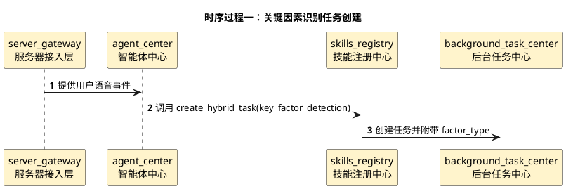
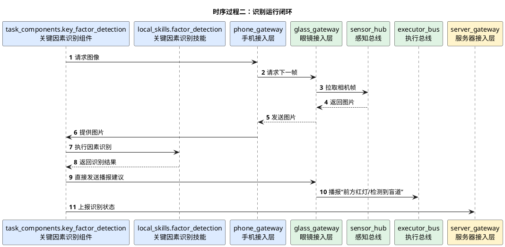

# 关键因素识别详细时序图

## 1. 文档使用说明

本功能文档的通用前提、参与模块字典和配色建议，统一见：

[时序图通用说明.md](/Users/elio/dev/llm-project/OpenAIglasses_for_Navigation/docs/total/sequence-diagram/时序图通用说明.md)

---

## 2. 总览说明

“关键因素识别”用于识别红绿灯、盲道、非机动车道等环境中的关键视觉因素。该功能建议抽象为统一任务模板，不同识别类型作为参数传入。

---

## 3. 时序过程一：任务创建

---

## 4. 时序过程二：识别运行闭环

---

## 5. 关键分支

- 不同 `factor_type` 对应不同模型和播报模板
- 可作为独立任务触发，也可被导航任务内部调用
