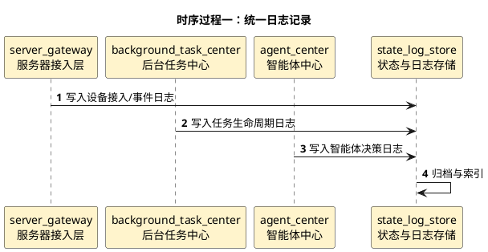

# 后端用户数据管理详细时序图

## 1. 文档使用说明

本功能文档的通用前提、参与模块字典和配色建议，统一见：

[时序图通用说明.md](/Users/elio/dev/llm-project/OpenAIglasses_for_Navigation/docs/total/sequence-diagram/时序图通用说明.md)

---

## 2. 总览说明

后端用户数据管理当前以“日志优先”为主，目标是先把所有系统动作、任务状态和关键事件落日志，为后续管理页面做数据基础。

---

## 3. 时序过程一：统一日志记录

---

## 4. 关键分支

- 手机与眼镜之间直连的数据面不强制全量回传
- 服务器应至少保存状态摘要和关键节点
