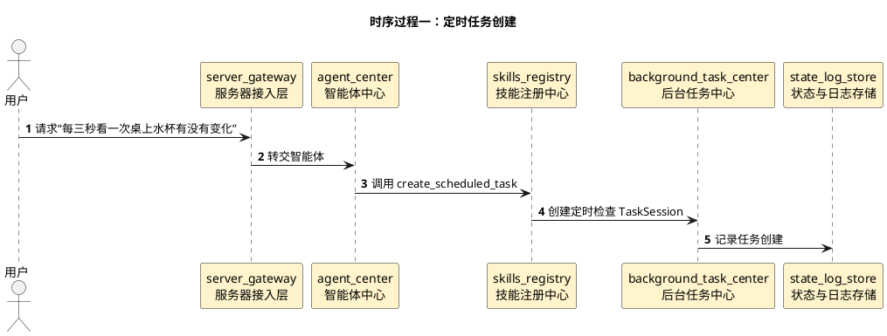
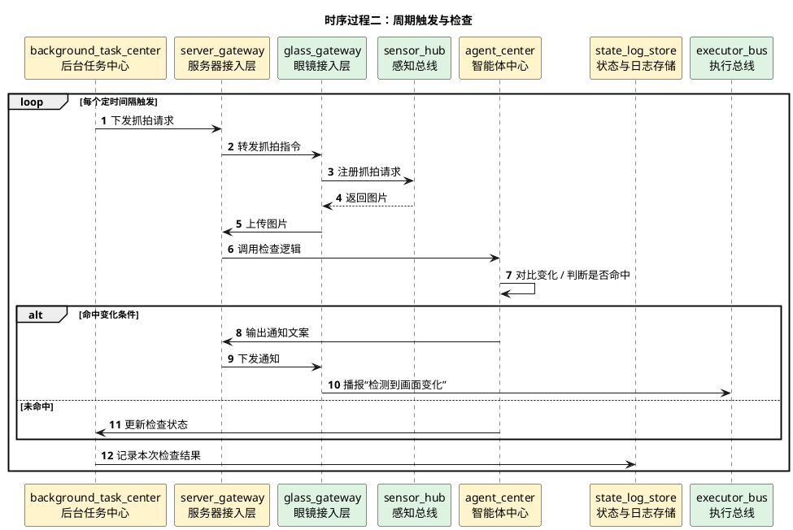

# 定时检查画面变化详细时序图

## 1. 文档使用说明

本功能文档的通用前提、参与模块字典和配色建议，统一见：

[时序图通用说明.md](/Users/elio/dev/llm-project/OpenAIglasses_for_Navigation/docs/total/sequence-diagram/时序图通用说明.md)

---

## 2. 总览说明

该功能是一个“后台定时任务 + 二次能力调用”的组合模式：

1. 用户用自然语言定义检查间隔和检查提示词
2. 服务器创建一个周期性后台任务
3. 每到触发时间，服务器向眼镜发起抓拍请求
4. 服务器调用对应 Skill 或智能体判断画面变化
5. 若命中条件，通知眼镜或主智能体

---

## 3. 时序过程一：定时任务创建

---

## 4. 时序过程二：周期触发与检查

---

## 5. 关键分支

- 定时任务应当可复用任意其他 Skill
- 可以选择“只通知用户”或“同时通知主智能体”
- 长时间未命中时不应频繁打扰用户
