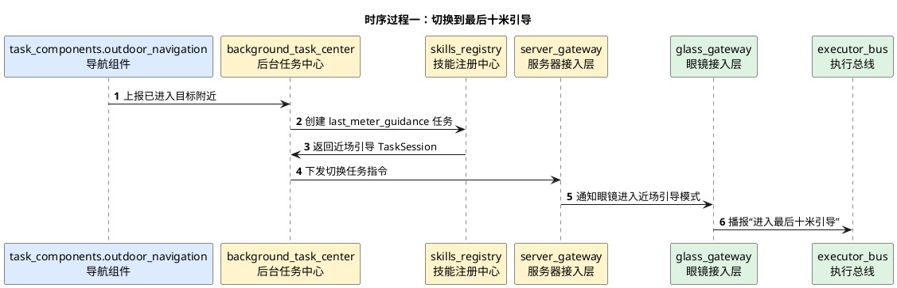
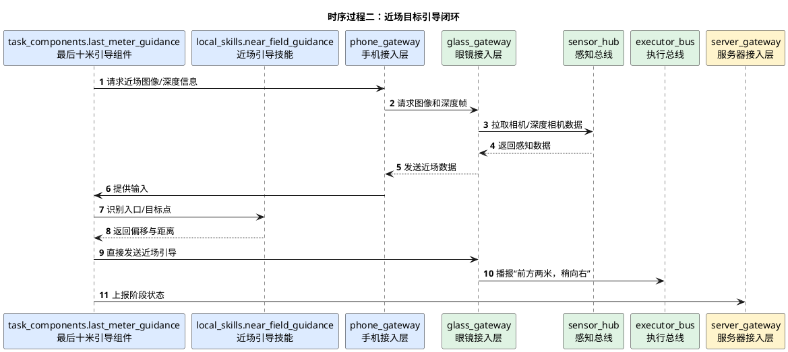

# 室外最后十米引导详细时序图

## 1. 文档使用说明

本功能文档的通用前提、参与模块字典和配色建议，统一见：

[时序图通用说明.md](/Users/elio/dev/llm-project/OpenAIglasses_for_Navigation/docs/total/sequence-diagram/时序图通用说明.md)

---

## 2. 总览说明

“最后十米引导”是导航任务结束前的近场精细引导任务，目标通常不是抽象路线，而是入口、门牌、扶梯口、站点口等具体近场目标。

由于文档中也指出该功能仍有难点，本时序图先给出建议结构，具体识别算法后续再细化。

---

## 3. 时序过程一：由导航任务切换到近场引导

---

## 4. 时序过程二：近场目标引导闭环

---

## 5. 关键分支

- 可由导航任务自动切入
- 也可由用户主动说“帮我找到入口”触发
- 若近场目标无法识别，可回退到一般通路检测
