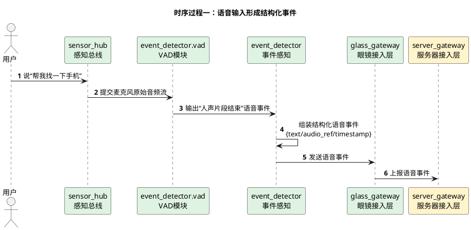
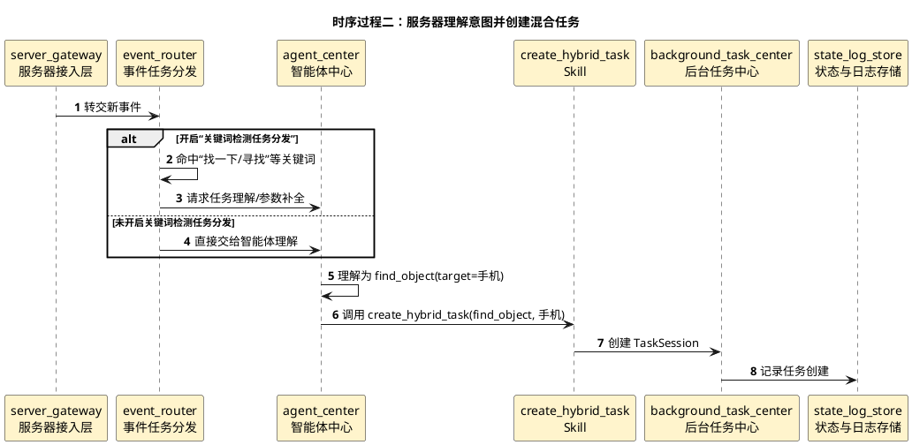
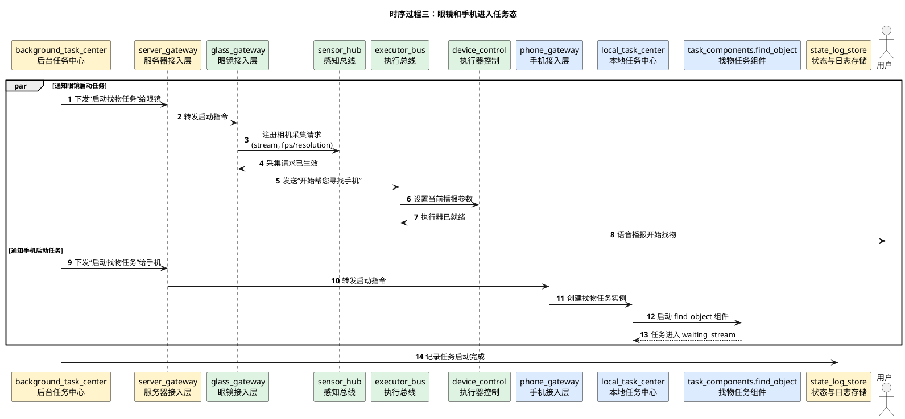
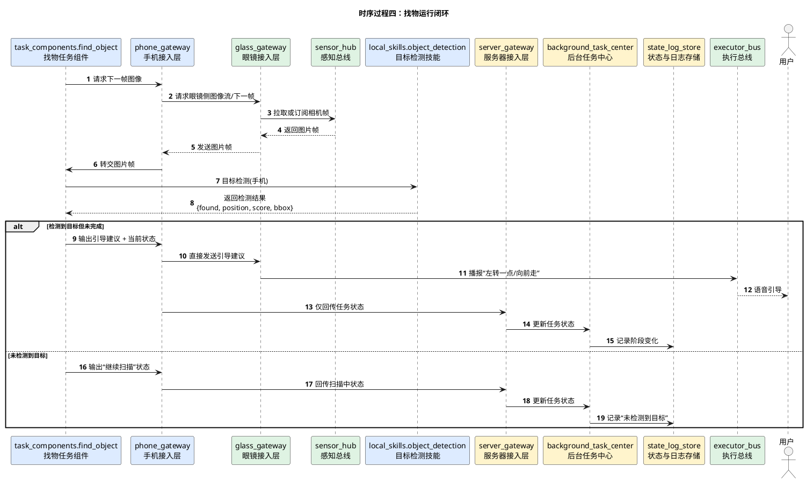
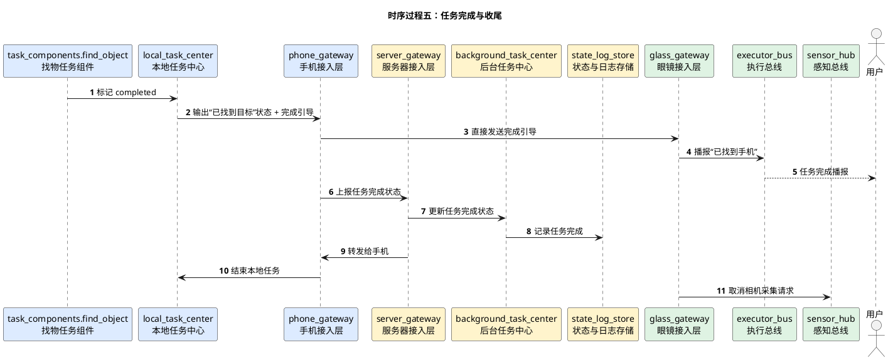
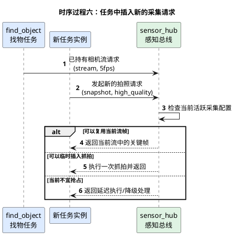

# 寻找物体详细时序图

## 1. 文档使用说明

本功能文档的通用前提、参与模块字典和配色建议，统一见：

[时序图通用说明.md](/Users/elio/dev/llm-project/OpenAIglasses_for_Navigation/docs/total/sequence-diagram/时序图通用说明.md)

---

## 2. 总览说明

“寻找物体”完整链路建议拆成 6 个小的时序过程来讨论：

1. 语音输入变成结构化事件
2. 服务器理解意图并创建混合任务
3. 眼镜和手机进入任务态
4. 找物运行闭环
5. 任务完成与收尾
6. 任务中插入新的采集请求

这样后续讨论协议、状态模型和具体实现时，可以逐段推进，不需要每次都看整张大图。

建议统一采用以下配色：

- 眼镜侧：浅绿 `#DFF3E3`
- 服务器侧：浅黄 `#FFF4CC`
- 手机侧：浅蓝 `#DDEBFF`
- 用户：灰色 `#F2F2F2`

---

## 3. 时序过程一：语音输入形成结构化事件

---

## 4. 时序过程二：服务器理解意图并创建混合任务

---

## 5. 时序过程三：眼镜和手机进入任务态

---

## 6. 时序过程四：找物运行闭环

---

## 7. 时序过程五：任务完成与收尾

---

## 8. 时序过程六：任务中插入新的采集请求

---

## 9. 分阶段说明

### 10.1 阶段一：语音输入形成结构化事件

这一段是必须严格遵守的链路：

1. 用户说话，麦克风原始音频先进入 `sensor_hub`
2. `sensor_hub` 将音频流提供给 `event_detector.vad`
3. `vad` 识别出人声开始、结束或稳定片段后，交给 `event_detector`
4. `event_detector` 将其包装成结构化语音事件
5. `glass_gateway` 才能将该事件发送给服务器

注意：

- `glass_gateway` 不直接处理裸音频含义
- `event_detector` 不直接决定任务创建
- 语音必须先变成事件，才能进入服务器任务链路

---

### 10.2 阶段二：服务器判定并创建混合任务

服务器收到语音事件后：

1. `server_gateway` 接收并规范化事件
2. `event_router` 判断是否启用关键词检测任务分发
3. 如果启用，则优先尝试关键词快速分发
4. 如果未启用或无法直接命中，则交给 `agent_center`
5. `agent_center` 理解用户意图并调用 `create_hybrid_task`
6. `background_task_center` 创建 `TaskSession`

这里建议服务器记录至少三类日志：

- 原始事件日志
- 任务创建日志
- 任务状态变化日志

---

### 10.3 阶段三：眼镜与手机分别进入任务态

任务创建完成后：

- 眼镜侧开始注册相机采集请求
- 手机侧开始创建 `find_object` 任务组件实例
- 服务器侧记录任务已经进入 running 状态

这一阶段要注意：

- 眼镜并不是“直接开相机给手机发流”
- 而是找物任务先向 `sensor_hub` 提出采集请求
- 由 `sensor_hub` 决定当前相机采集配置并供给任务使用

---

### 10.4 阶段四：持续图像流与检测引导闭环

这是找物任务的核心运行循环：

1. 手机侧找物组件请求图像
2. 眼镜侧提供图像
3. 手机侧调用本地目标检测技能
4. 手机侧根据检测结果形成引导建议
5. 手机侧直接将引导建议发给眼镜
6. 服务器只记录任务状态
7. 眼镜执行播报

这一段的关键设计要点：

- 图像处理放在手机
- 任务状态主记录放在服务器
- 引导建议从手机直接发给眼镜
- 用户执行反馈统一放在眼镜
- 眼镜相机采集仍由 `sensor_hub` 仲裁

---

### 10.5 阶段五：任务完成与收尾

当手机侧判定找到目标后：

1. 手机直接把完成引导发给眼镜
2. 手机向服务器上报任务完成状态
3. 服务器更新任务状态并记日志
4. 眼镜取消采集请求
5. 手机释放本地任务资源

建议在收尾时明确记录：

- 完成时间
- 完成原因
- 最后一次检测结果
- 用户最终播报内容

---

## 10. 关键分支

### 11.1 分支一：开启关键词检测任务分发

当服务器开启“关键词检测任务分发”功能时：

- `event_router` 可以快速命中“找一下”“帮我找”“寻找”等关键词
- 命中后可直接走任务创建流程
- 也可以在进入任务前调用 `agent_center` 做参数补全

适用场景：

- 想要提升响应速度
- 找物属于高频、可模板化任务

### 11.2 分支二：关闭关键词检测任务分发

当该功能关闭时：

- 所有语音事件都先交给 `agent_center`
- 由大模型理解是否应启动找物任务

适用场景：

- 希望统一由智能体做意图判断
- 系统处于早期调试阶段

### 11.3 分支三：任务中插入新的采集请求

例如找物过程中，用户又说“看下前面有什么”。

此时正确流程不是新的任务直接抢相机，而应是：

1. 新任务提出新的采集请求
2. `sensor_hub` 判断当前已有相机流请求
3. `sensor_hub` 决定：
   - 复用当前帧
   - 临时插入抓拍
   - 或延迟处理

这也是 `sensor_hub` 存在的核心意义之一。

---

## 11. 建议补充的状态枚举

建议 `find_object` 任务至少具备以下阶段：

- `created`
- `starting`
- `waiting_stream`
- `scanning`
- `guiding`
- `target_locked`
- `completed`
- `failed`
- `cancelled`

建议任务状态更新至少包含：

- `session_id`
- `task_name`
- `phase`
- `target_name`
- `last_hint`
- `last_detection`
- `updated_at`
