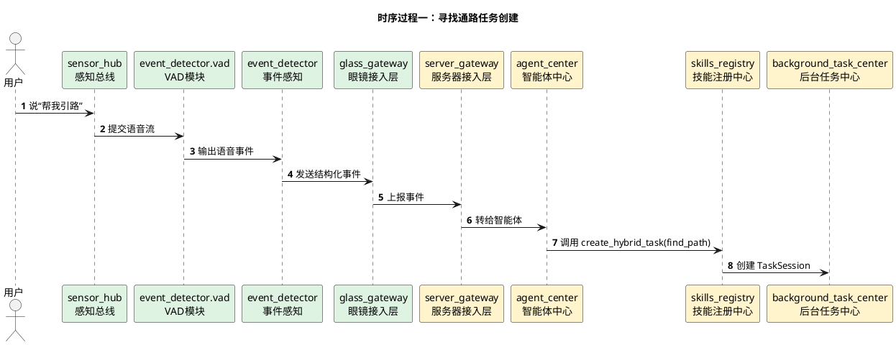
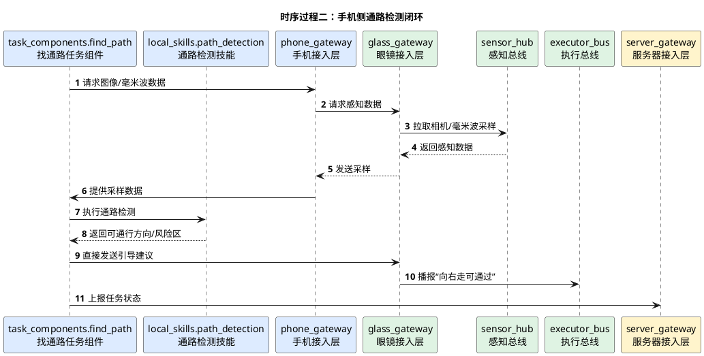

# 寻找通路详细时序图

## 1. 文档使用说明

本功能文档的通用前提、参与模块字典和配色建议，统一见：

[时序图通用说明.md](/Users/elio/dev/llm-project/OpenAIglasses_for_Navigation/docs/total/sequence-diagram/时序图通用说明.md)

---

## 2. 总览说明

寻找通路与寻找物体类似，区别在于：

- 目标不是一个具体物体，而是一条可通行路径
- 手机侧技能可能使用毫米波、视觉分割、通路检测等算法
- 输出的是“向哪里走更安全”的引导建议

---

## 3. 时序过程一：任务创建

---

## 4. 时序过程二：手机侧通路检测闭环

---

## 5. 关键分支

- 若路径被动态障碍阻挡，则重新计算通路
- 若无明显可通路径，可向用户播报“请原地等待”
