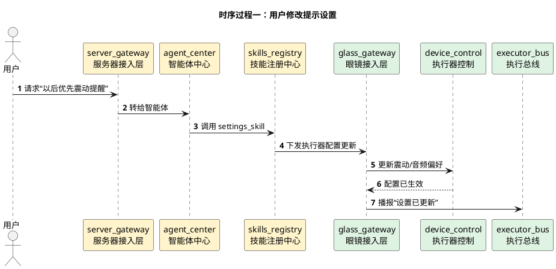

# 提示系统设置详细时序图

## 1. 文档使用说明

本功能文档的通用前提、参与模块字典和配色建议，统一见：

[时序图通用说明.md](/Users/elio/dev/llm-project/OpenAIglasses_for_Navigation/docs/total/sequence-diagram/时序图通用说明.md)

---

## 2. 总览说明

提示系统设置主要包括：

- 提示音开关
- 震动开关
- 优先使用语音还是震动
- 强度和音量偏好

该功能由服务器作为配置中枢，眼镜侧负责执行器生效。

---

## 3. 时序过程一：用户修改设置

---

## 4. 关键分支

- 设置可由用户主动发起
- 也可由智能体根据上下文推荐但需用户确认
