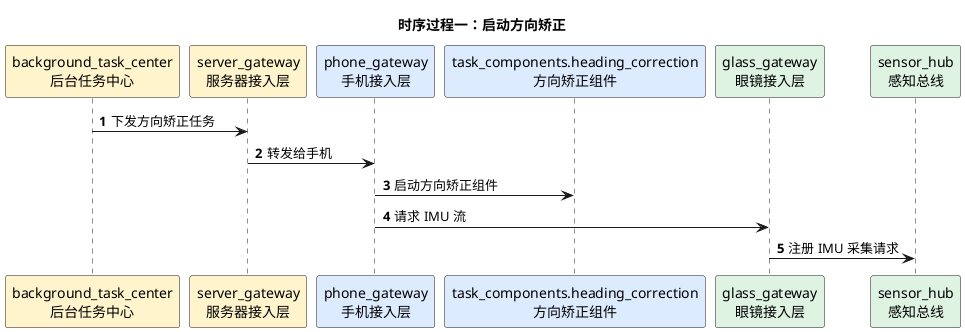
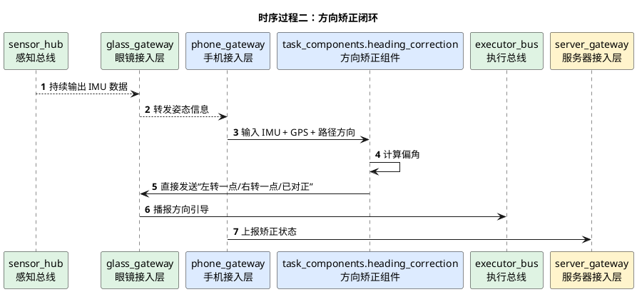

# 方向矫正详细时序图

## 1. 文档使用说明

本功能文档的通用前提、参与模块字典和配色建议，统一见：

[时序图通用说明.md](/Users/elio/dev/llm-project/OpenAIglasses_for_Navigation/docs/total/sequence-diagram/时序图通用说明.md)

---

## 2. 总览说明

方向矫正是导航任务中的一个高频子能力，也可以独立触发。核心输入是：

- 眼镜 IMU
- 手机定位/GPS/罗盘
- 当前导航目标方向

输出是给眼镜的“向左/向右/对正”引导。

---

## 3. 时序过程一：启动方向矫正

---

## 4. 时序过程二：方向矫正闭环

---

## 5. 关键分支

- 若 GPS 漂移过大，可暂时退化为 IMU + 视觉辅助
- 若用户已对正，则进入导航主任务下一阶段
- 若长时间未对正，可通知服务器调整策略
