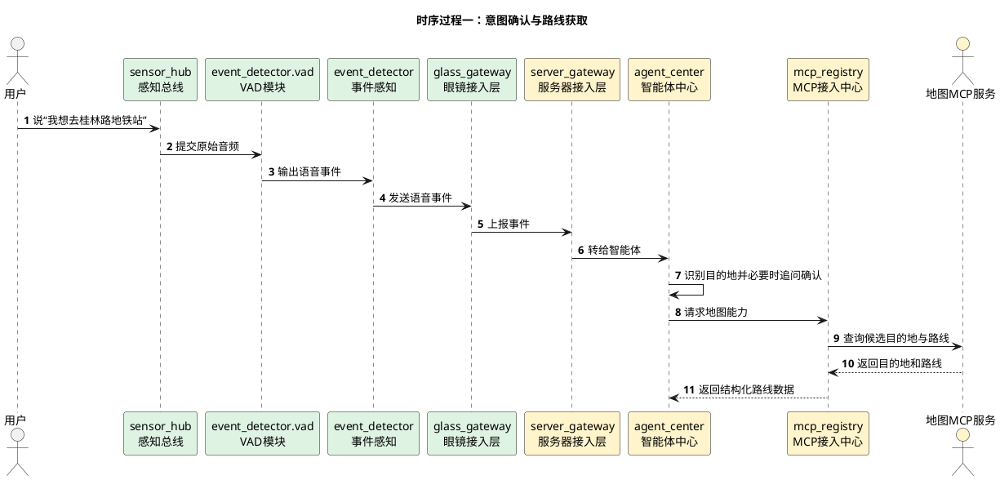
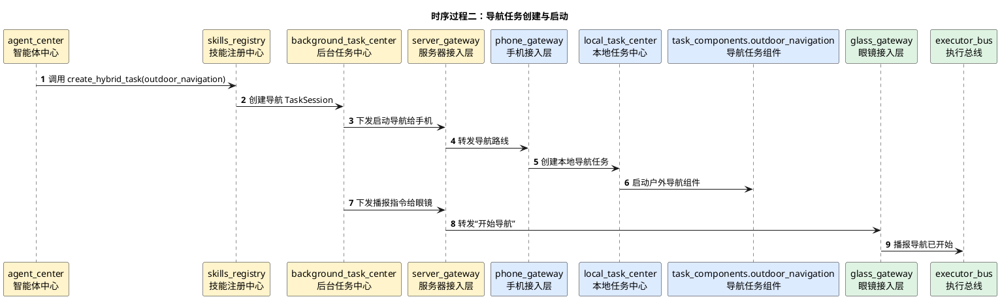
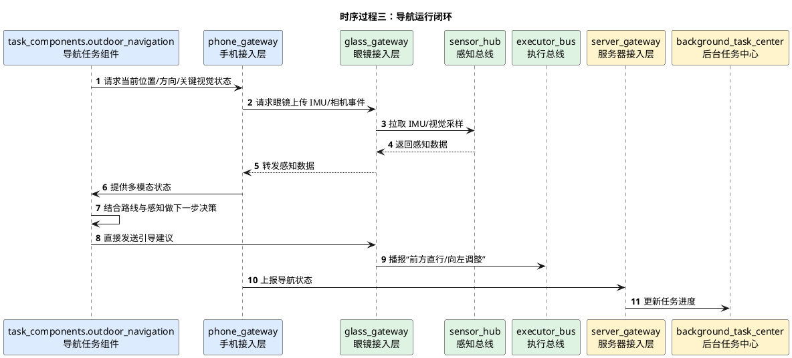

# 点到点引导导航详细时序图

## 1. 文档使用说明

本功能文档的通用前提、参与模块字典和配色建议，统一见：

[时序图通用说明.md](/Users/elio/dev/llm-project/OpenAIglasses_for_Navigation/docs/total/sequence-diagram/时序图通用说明.md)

---

## 2. 总览说明

点到点引导导航是一个服务器编排、手机执行、眼镜反馈的长生命周期后台任务：

1. 用户提出目的地
2. 服务器智能体完成目的地确认
3. 服务器通过 MCP 获取导航路径
4. 创建导航任务
5. 手机侧持续执行导航组件
6. 眼镜侧持续提供 IMU、相机等感知，并执行播报

---

## 3. 时序过程一：意图确认与路线获取

---

## 4. 时序过程二：导航任务创建与启动

---

## 5. 时序过程三：导航运行闭环

---

## 6. 关键分支

- 需要重新规划路线时，由服务器再次调用地图 MCP
- 手机定位和眼镜 IMU 冲突时，以任务组件的融合策略为准
- 进入“最后十米”时，可切换到独立的近场引导任务

---

## 7. 建议补充的状态枚举

- `created`
- `route_confirming`
- `route_ready`
- `running`
- `rerouting`
- `paused`
- `completed`
- `failed`
