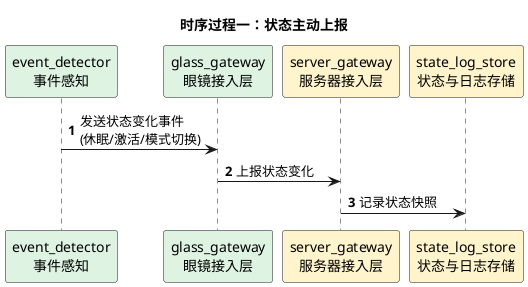
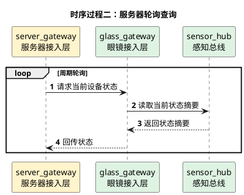

# 状态管理详细时序图

## 1. 文档使用说明

本功能文档的通用前提、参与模块字典和配色建议，统一见：

[时序图通用说明.md](/Users/elio/dev/llm-project/OpenAIglasses_for_Navigation/docs/total/sequence-diagram/时序图通用说明.md)

---

## 2. 总览说明

状态管理关注的是眼镜端休眠、激活、功能模式等设备运行状态，以及这些状态如何同步到服务器。

建议同时支持：

- 眼镜主动上报
- 服务器轮询查询

---

## 3. 时序过程一：状态主动上报

---

## 4. 时序过程二：服务器轮询查询

---

## 5. 关键分支

- 状态变化应尽量走主动上报，轮询仅作补充
- 功能模式切换时应同步到后台任务中心，避免状态与任务不一致
