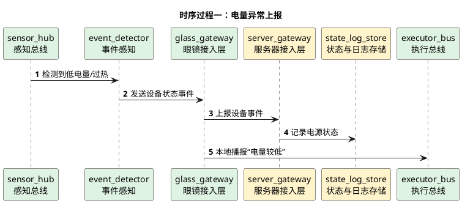

# 电源管理详细时序图

## 1. 文档使用说明

本功能文档的通用前提、参与模块字典和配色建议，统一见：

[时序图通用说明.md](/Users/elio/dev/llm-project/OpenAIglasses_for_Navigation/docs/total/sequence-diagram/时序图通用说明.md)

---

## 2. 总览说明

电源管理属于低优先级系统功能，但应明确基本链路：

- 眼镜端持续感知电量状态
- 当电量低、过热或异常时形成事件
- 服务器记录设备状态
- 必要时触发节能策略或通知用户

---

## 3. 时序过程一：电量异常上报

---

## 4. 关键分支

- 可本地立即提示用户
- 可由服务器决定是否降低后台任务频率
