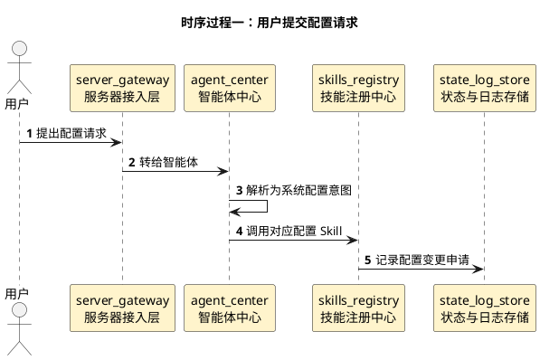
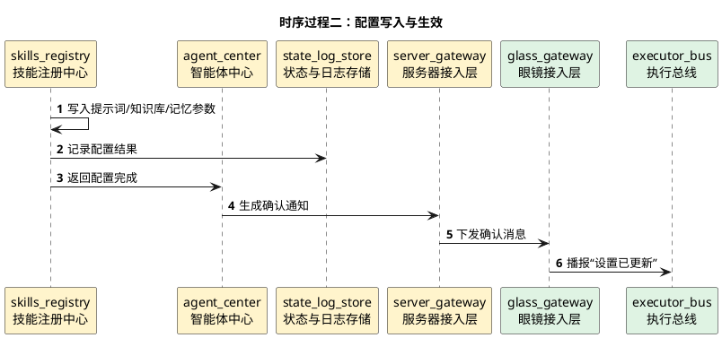

# 自定义提示词与记忆配置详细时序图

## 1. 文档使用说明

本功能文档的通用前提、参与模块字典和配色建议，统一见：

[时序图通用说明.md](/Users/elio/dev/llm-project/OpenAIglasses_for_Navigation/docs/total/sequence-diagram/时序图通用说明.md)

---

## 2. 总览说明

这一类功能包含：

- 用户修改提示词
- 用户新增或编写 Skills
- 用户自定义知识库
- 用户设置记忆时长

这些功能本质上都属于“系统配置任务”，由服务器主导执行并持久化配置结果。

---

## 3. 时序过程一：用户提交配置请求

---

## 4. 时序过程二：配置写入与生效

---

## 5. 关键分支

- 新增 Skill 可能需要校验或审核
- 记忆时长配置可能立即影响智能体上下文压缩策略
- 知识库更新可能影响后续问答结果
