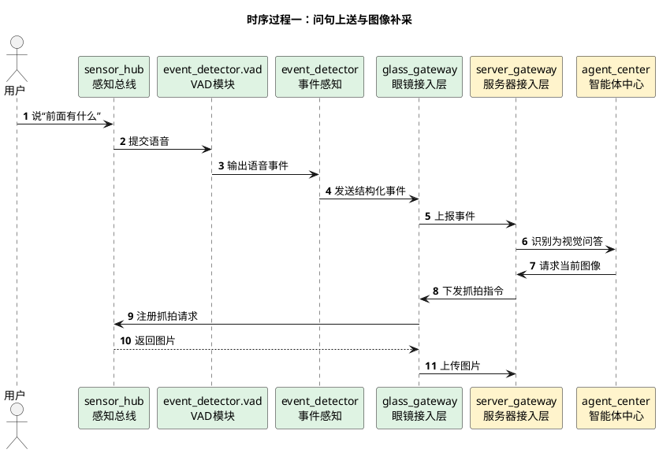
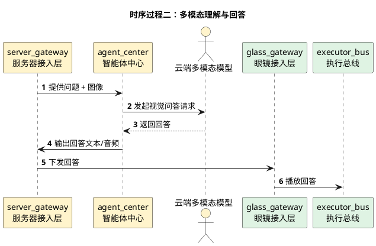

# 自然语言视觉交互详细时序图

## 1. 文档使用说明

本功能文档的通用前提、参与模块字典和配色建议，统一见：

[时序图通用说明.md](/Users/elio/dev/llm-project/OpenAIglasses_for_Navigation/docs/total/sequence-diagram/时序图通用说明.md)

---

## 2. 总览说明

自然语言视觉交互是一个典型的“开放式问答任务”：

1. 用户提出视觉相关问题
2. 眼镜侧抓拍或上传当前图像
3. 服务器智能体调用多模态模型理解图像与问题
4. 结果返回眼镜播放

---

## 3. 时序过程一：问句上送与图像补采

---

## 4. 时序过程二：多模态理解与回答

---

## 5. 关键分支

- 若用户连续追问，可复用最近抓拍图像
- 若画面变化较大，可重新抓拍
