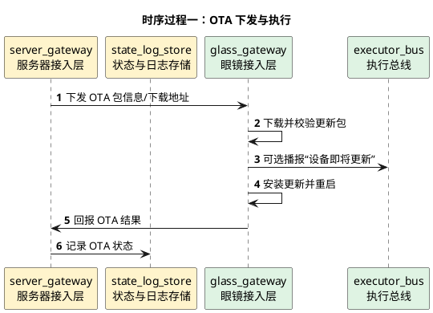

# 远程OTA详细时序图

## 1. 文档使用说明

本功能文档的通用前提、参与模块字典和配色建议，统一见：

[时序图通用说明.md](/Users/elio/dev/llm-project/OpenAIglasses_for_Navigation/docs/total/sequence-diagram/时序图通用说明.md)

---

## 2. 总览说明

远程 OTA 是低优先级系统能力，主要目标是远程下发固件或应用更新，并保证：

- 更新前状态可确认
- 更新中任务可暂停
- 更新后结果可回报

---

## 3. 时序过程一：OTA 下发与执行

---

## 4. 关键分支

- 更新前应检查是否存在运行中高优先级任务
- 更新失败应支持回滚或恢复
