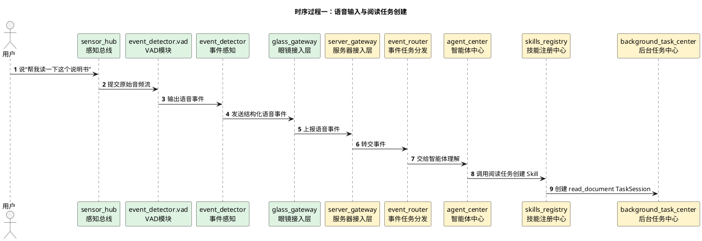
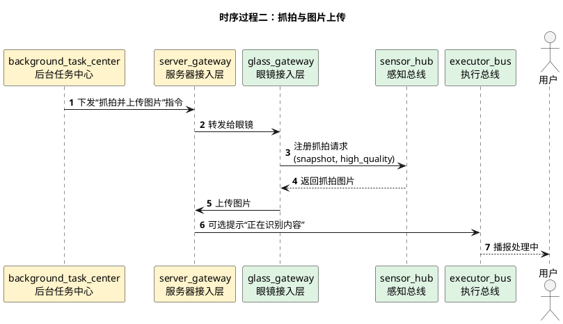
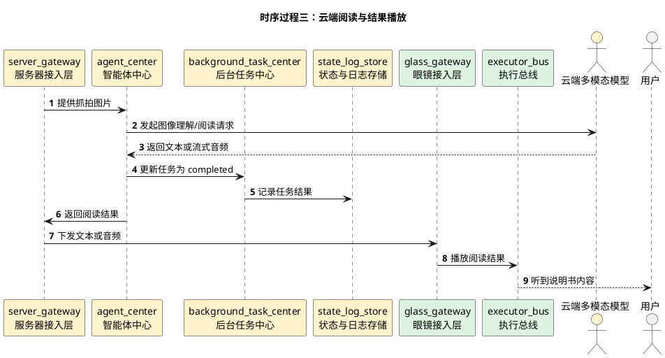

# 阅读纸质书籍与说明书详细时序图

## 1. 文档使用说明

本功能文档的通用前提、参与模块字典和配色建议，统一见：

[时序图通用说明.md](/Users/elio/dev/llm-project/OpenAIglasses_for_Navigation/docs/total/sequence-diagram/时序图通用说明.md)

---

## 2. 总览说明

“阅读纸质书籍/药品说明书”是一个以服务器为主执行的混合任务：

1. 用户通过语音发起阅读请求
2. 眼镜端抓拍高质量图片并上传服务器
3. 服务器侧智能体调用云端全模态模型进行理解
4. 云端返回文本或流式音频
5. 服务器将结果发送给眼镜播放

该任务与“寻找物体”的主要区别：

- 图片不发手机侧做高频检测，而是直接发服务器
- 主要是一次性抓拍 + 云端理解，不是持续视觉闭环

---

## 3. 时序过程一：语音输入与任务创建

---

## 4. 时序过程二：抓拍与图片上传

---

## 5. 时序过程三：云端阅读与结果播放

---

## 6. 分阶段说明

- 阶段一是标准语音事件链路，与所有任务一致
- 阶段二的核心是高质量单次抓拍，而不是持续相机流
- 阶段三由服务器主导调用云模型，手机侧不参与主流程

---

## 7. 关键分支

- 若图片模糊，服务器可要求眼镜重新抓拍
- 若内容过长，智能体可先摘要，再按用户追问继续细读
- 若用户要求“只读药品用法用量”，可由智能体做结构化阅读

---

## 8. 建议补充的状态枚举

- `created`
- `capturing`
- `uploading`
- `reading`
- `streaming_result`
- `completed`
- `failed`
