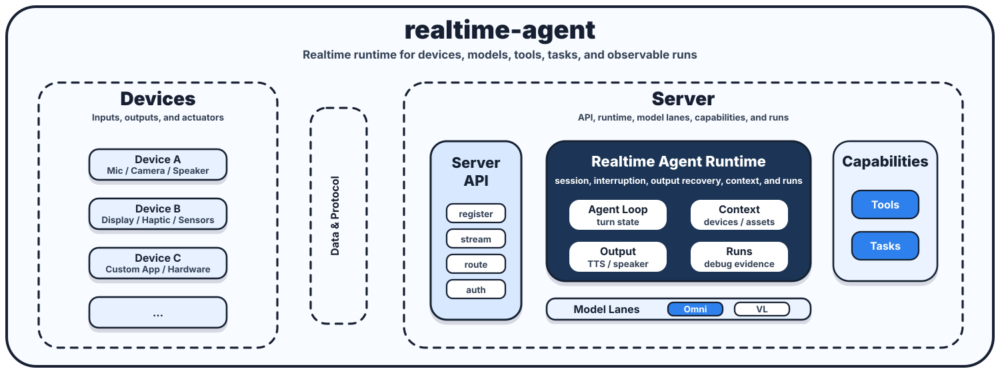

# 开发者总览

`realtime-agent` 是一个面向实时语音、视觉输入和多设备协作的 Agent 开发框架。它把大模型对话、工具调用、后台能力、设备能力和运行排障组织成一套可扩展的 Server SDK、Device SDK 和通讯协议。

如果你想做的不只是一个网页聊天机器人，而是一个可以听、说、看、调用设备、调度长流程的实时 AI 应用，这个项目可以作为基础框架。



## 1. 项目是什么

`realtime-agent` 的核心目标是帮助开发者更快做出可以在真实设备上使用的实时 Agent 应用。

很多 Agent 框架适合构建文本聊天、网页助手或后端工作流。但当应用进入智能眼镜、手机、浏览器摄像头、ESP32 或其他端侧设备时，问题会从“模型如何回答”变成“实时交互如何稳定运行、设备能力如何接入、业务能力如何扩展、效果如何持续优化”。

`realtime-agent` 面向的就是这类实时 Agent 应用。它希望让开发者先跑通一个可用骨架，再围绕自己的产品场景逐步扩展：

- 实时音视频对话：如何快速跑起一个会听、会说、能看图的 Agent，并处理实时连接、低延迟输出、用户打断、输出恢复和对话中的视频 / 图片采集。
- 工具调用：如何让 Agent 在对话中调用自己的业务能力，并把持续运行的流程做成后台工具，而不是塞进一次同步函数调用里。
- 设备开发：如何接入自己的设备，把摄像头、麦克风、播放、震动、屏幕或其他端侧能力提供给 Agent 使用。
- 链路优化：如何优化模型 provider、提示词、上下文、音视频处理和运行产物，让效果、延迟、稳定性和可排障能力可以持续改进。

为了支撑这些场景，项目提供了已经打通的 Server SDK、Device SDK、示例应用和通讯协议。SDK 使用者不需要一开始就理解所有内部模块；更实际的方式是按自己的目标选择开发路径。

从开发者视角，可以把项目理解成三条主要路径：

1. 做 Agent 应用：编写 Tool 和应用配置，让 Agent 获得新的业务能力。
2. 接入端侧设备：使用 Device SDK 声明设备能力，把真实摄像头、麦克风、播放、震动、屏幕或其他端侧能力接进来。
3. 优化模型链路：调整提示词、上下文、provider、ASR、TTS、视觉模型和 realtime 音频模型，让应用在延迟、效果和稳定性之间取得更好的平衡。

项目提供的示例应用不是一次性演示代码，而是一个可继续扩展的起点。开发者可以先用示例验证完整链路，再根据自己的场景替换工具、设备、提示词和模型链路。

## 2. 已支持的产品能力

### 2.1 实时音视频对话

项目支持实时语音对话，并可以在对话过程中接入图片或视频输入。开发者可以基于它构建语音优先、视觉辅助的 Agent 应用，例如智能眼镜助手、视觉问答、导航辅助、远程协作或多模态设备原型。

这类应用通常不只是“把一句话发给模型再返回文本”，而是需要持续维护语音会话、处理用户打断、尽快播放回答、在合适的时机采集视觉输入，并把模型输出转成端侧可播放的语音。`realtime-agent` 提供了一个已经打通的实时对话基础能力，开发者可以先关注自己的应用场景，而不是从零搭建实时音视频交互框架。

项目不强绑定某一种硬件。浏览器模拟设备、Python 设备、iOS 参考端、ESP32 参考端，以及开发者自己的设备应用，都可以作为实时对话的输入和输出端。

### 2.2 对话中调用工具

项目支持 Agent 在对话过程中调用工具。工具适合把外部信息、设备动作或业务系统能力接入对话，例如：

- 查询路线、天气、搜索结果或业务数据。
- 请求设备拍照、震动、显示提示或执行一次命令。
- 读取一次传感器结果或获取一份运行中的资产。
- 调用开发者自己的服务、数据库或业务 API。

对 SDK 使用者来说，工具的意义是把“模型会说话”扩展成“模型能做事”。开发者可以把一个明确、短生命周期的动作封装成工具，让模型在需要时决定是否调用。

项目已经把工具调用和实时对话连接在一起：用户可以用语音提出需求，Agent 在同一轮对话中调用工具，再把结果继续用语音反馈给用户。

### 2.3 对话中启动后台能力

项目支持 Agent 在对话中启动后台能力。后台工具（声明 `late_result_policy="background"`）适合那些不能在等待窗口内完成、需要持续运行或维护状态的流程，例如：

- 持续找物或观察环境变化。
- 导航、提醒、巡检等长流程。
- 持续消费视频、传感器或设备状态。
- 在条件满足时主动输出提醒或触发设备动作。

对开发者来说，后台工具提供了一种更自然的建模方式：一次性动作是前台工具，持续性流程是后台工具。这样 Agent 既可以回答用户当前的问题，也可以启动一个在后台持续推进的流程。

```text
Tool：现在做一次，快速返回结果。
后台工具：持续运行一段时间，可以消费设备 stream、维护状态、产生多次输出。
```

## 3. 核心运行链路

### Omni 全模态模型链路

Omni 全模态模型链路已经接入原生 realtime / omni 模型。语音输入、对话理解、语音输出和部分多模态能力主要由同一个全模态模型承担：

```text
设备麦克风
  -> Omni / Realtime 模型
  -> 模型输出音频 delta
  -> Server 输出仲裁
  -> 设备 speaker 播放
```

这条链路更适合快速上手和低延迟语音交互。它的组件少，实时连接、语音理解和语音输出的边界更集中，整体实现更简单，也更容易获得可打断、可恢复的流式语音体验。

它的代价是可选择性和灵活性较低。开发者通常受限于少数支持 realtime / omni 的模型，输出形态也更偏语音对话本身；如果需要非常细的提示词控制、复杂视觉上下文、多阶段工具编排或自定义 ASR / TTS 策略，调优空间会相对有限。

### VL 视觉语言模型链路

VL 视觉语言模型链路已经把 ASR、视觉语言模型、工具调用和 TTS 组合成语音 Agent。每个节点可以选择不同 provider 或模型：

```text
设备麦克风
  -> VAD / 语气词过滤 / 打断过滤
  -> ASR / 标点预测
  -> VL 模型
  -> 工具调用或视觉资产拼接
  -> 文本回复
  -> Streaming TTS
  -> 设备 speaker 播放
```

这条链路更复杂，开发和调试门槛更高，端到端延迟通常也更高。因为它要把 ASR、视觉输入、LLM、工具调用、TTS 和输出播放串起来，任何一个节点的延迟或失败都会影响整体体验。

它的优势是灵活度更高。开发者可以为每个节点选择最合适的模型或服务，可以更细地控制提示词、工具描述、视觉资产进入上下文的方式和最终输出内容，也可以通过控制模型输出节奏，让多轮交互和工具调用过程更顺滑，例如在调用工具前先给用户自然提示。对于需要复杂视觉理解、强工具编排、拟人化多轮交互、可解释排障和长期提示词优化的应用，VL 链路的上限更高，但同时也需要投入更多工程和测试成本。

### 两条链路如何选择

如果目标是尽快做出可用的实时语音体验，优先从 Omni 全模态模型链路开始；它更简单、延迟更低、可靠性更容易控制。

如果目标是深度定制视觉理解、工具编排、提示词策略和多 provider 组合，可以选择 VL 视觉语言模型链路；它更灵活，但复杂度、延迟和可靠性风险也更高。

### 工具调用链路

工具调用链路由 Agent Core、Tool、Context API 和设备能力组成：

```text
模型决定调用工具
  -> SDK 执行 Tool
  -> Tool 通过 Context API 请求设备或外部能力
  -> 设备 / 外部服务返回结果
  -> SDK 把结果回填模型上下文
  -> 模型继续生成回复
```

这条链路的关键不是“能不能调用一个 Python 函数”，而是调用过程可观测、可回放、可和设备能力统一管理。

### 后台能力链路

后台能力链路适合长流程：

```text
模型调用后台工具
  -> Tool Run 创建运行实体，超过等待窗口先返回“正在处理”
  -> 工具协程订阅设备 stream 或等待控制信号
  -> 工具持续产生状态、输出或设备动作
  -> 完成后 FollowUpRouter 把结果回流模型或直通播报
  -> 运行产物记录 Tool Run 状态和结果
```

后台能力不是隐藏在服务端里的业务线程，而是 Agent 可以启动、查询、取消和观测的运行单元（经 `tool_run_manager`）。

## 4. 三类扩展方式

### 4.1 扩展 Agent 能力：工具

如果你想让 Agent 学会一个新的业务动作，优先扩展 Tool。

业务能力一般放在应用目录：

```text
examples/<your-app>/agent-server/capabilities/
  tools.py
  tasks.py
```

推荐判断方式：

- 一次性动作写 Tool。
- 持续流程写后台 Tool（`late_result_policy="background"`）。
- 需要调用设备能力时，通过 `ToolContext`。
- 需要输出语音时，通过 `context.output.say()` 或 ToolResult。
- 不要把具体业务逻辑写进 `agent-server/realtime_agent/` SDK 核心包。

最小开发路径：

1. 在 `capabilities/tools.py` 或 `capabilities/tasks.py` 中实现能力。
2. 在应用配置中暴露给 Agent。
3. 启动示例 server。
4. 用 Web Chat、iOS 真机 demo 或 ESP32-S3 参考端联调。
5. 查看 `runs/` 中的 `model-request.json`、`tool-events.jsonl` 和 `agent-events.jsonl`。

### 4.2 扩展设备能力：Device SDK 代码声明

如果你想接入新设备，例如新的眼镜、手机 App、机器人、ESP32 或 Linux 网关，优先从 Device SDK 开始。最新规范推荐在设备应用代码中直接声明和启用设备能力，而不是维护一份独立的 `supports` YAML。

设备侧的职责是：

- 注册到 server。
- 在 Device SDK 中启用自己支持的传感器、执行器和 stream。
- 处理 server 下发的控制事件。
- 上传音频、图片、视频或传感器数据。
- 消费 server 下发的 speaker stream 或设备命令。

以 Swift Device SDK 为例，App 通过 `DeviceClient` 显式启用麦克风、相机和 speaker。SDK 会根据这些配置生成注册 payload，并维护对应的音频、视觉和播放链路：

```swift
import RealtimeAgentDeviceKit

let client = try DeviceClient(
    serverURL: "http://127.0.0.1:8765",
    deviceID: "dev-ios-phone-001",
    userID: "user-001",
    name: "iOS Phone",
    audioInput: .enabled(),
    camera: .enabled(source: cameraFrameSource),
    speaker: .enabled(buffer: .default)
)

client.onCustomCommand("haptic.vibrate") { context in
    let durationMS = context.payload["duration_ms"] as? Int ?? 120
    try await haptics.vibrate(durationMS: durationMS)
    try await context.emit("custom.haptic.vibrate.done", ["duration_ms": durationMS])
}

try await client.connectAndRegister()
```

这种方式的好处是设备能力和真实硬件接入代码放在一起：App 启用了哪些能力，SDK 就注册哪些能力；App 没有启用的麦克风、相机或 speaker，不会被误报给 server。

端侧开发者不需要理解 Agent Core 内部如何选择工具，也不应该依赖某个模型 provider 的内部事件。端侧只需要把真实硬件能力接到 Device SDK 暴露的注册、命令和 stream API 上。Swift 端更完整的接入方式见 [RealtimeAgentDeviceKit](../../devices/swift/README.md)。

C Device SDK 面向 ESP32-S3、嵌入式 Linux 和其他 C 运行时。它只负责协议事件、注册、stream chunk、speaker buffer 和诊断等通用 SDK 边界，不直接绑定某块板子的麦克风、speaker、相机、WakeNet 或 AEC 实现。ESP32-S3 固件参考端把板级 Wi-Fi、引脚、PDM 麦克风、I2S speaker、摄像头和 FreeRTOS task 作为 app/adapter 层接入 SDK。更完整的边界说明见 [C Device SDK](../../devices/c/README.md) 和 [ESP32-S3 参考端](../../examples/device_app_demo/esp32-s3/README.md)。

### 4.3 优化模型链路：提示词 / 上下文 / ASR / TTS / Vision / Realtime

如果你想提升 Agent 的响应质量、延迟或稳定性，优先优化提示词、上下文、provider 配置和语音视觉处理链路，而不是改工具或设备协议。

可以优化的方向包括：

- 调整 system prompt 和工具描述。
- 优化上下文裁剪、历史消息和视觉资产进入模型的方式。
- 替换 ASR provider。
- 替换 Streaming TTS provider。
- 替换视觉语言模型 provider。
- 接入 OpenAI 兼容模型服务。
- 接入 DashScope 等模型服务。
- 接入原生 realtime / omni 音频模型。
- 调整低延迟播放、打断恢复和输出释放策略。

模型链路和设备协议是分层的。设备只负责提供输入和消费输出；Agent Core、prompt、上下文编译和 provider 负责把输入交给模型、解释模型事件、执行工具调用并产生输出。

这种分层让同一个设备和同一组 Tool 可以复用到不同提示词、上下文策略和模型 provider 上，降低后续优化和迁移成本。

## 5. 开发者应该改哪里

不同目标对应不同修改位置：

| 目标 | 主要修改位置 | 说明 |
| --- | --- | --- |
| 增加一个业务工具 | `examples/<app>/agent-server/capabilities/tools.py` | 适合一次性动作 |
| 增加一个后台能力 | `examples/<app>/agent-server/capabilities/tools.py`（`late_result_policy="background"`） | 适合持续流程 |
| 调整示例应用配置 | `examples/<app>/agent-server/server.yaml` | 控制模型、工具和运行参数 |
| 接入新设备 | `devices/<language>/` 或自己的端侧工程 | 使用 Device SDK 启用端侧能力 |
| 调整设备能力 | Device SDK 配置和端侧 adapter | 在代码中启用 audioInput、camera、speaker 或自定义命令 |
| 优化提示词 / ASR / TTS / 模型 | prompt、上下文配置、provider 配置和 provider 实现 | 保持 Tool 和设备协议稳定 |
| 查看运行问题 | `runs/`、debug API、协议测试 | 用产物定位模型、工具、设备和播放问题 |
| 修改 SDK 核心能力 | `agent-server/realtime_agent/` | 只有通用能力才应该进入 SDK |

建议遵守一个简单原则：

> 业务能力放应用目录，设备能力放端侧，通用框架能力才放 SDK 核心。

这样项目可以同时服务示例应用、第三方应用和未来更多设备，而不会把某个业务场景硬编码进框架。

## 6. 如何本地启动和验证

### 准备环境

本地推荐使用 macOS 或 Linux、Python 3.11 和 `uv`：

```bash
uv sync --python 3.11
uv pip install -e .
```

如果 `uv run realtime-agent.*` 找不到命令，重新执行 editable 安装：

```bash
uv pip install -e .
```

### 启动示例 server

```bash
uv run realtime-agent.server.run --config examples/simple-agent-server/server.yaml
```

默认地址：

```text
http://127.0.0.1:8765
```

健康检查：

```bash
curl http://127.0.0.1:8765/api/health
curl http://127.0.0.1:8765/api/debug/devices
curl http://127.0.0.1:8765/api/debug/playback
```

校验开发支持设备能力文件：

```bash
uv run realtime-agent.device.validate dev-support/devices/browser-glass/device.realtime-agent.yaml
```

### 打开 Web Chat Device Demo

在另一个终端运行：

```bash
uv run realtime-agent.web-chat.open
```

Web Chat 会作为浏览器 Device 接入 server，可用于验证：

- 设备注册。
- 浏览器麦克风输入。
- 浏览器摄像头输入。
- server 下发 speaker stream。
- 控制事件和 stream 生命周期。

脚本检查或只想获取 URL 时，可以使用：

```bash
uv run realtime-agent.web-chat.open --print-url
```

`dev-support/devices/browser-glass`、Python phone 和 playback glass 仍可用于本地联调、协议验证和回放测试，但它们是开发支持组件，不是当前 README 推荐的第一入口。

### 可选构建 ESP32-S3 固件参考端

如果你在 ESP32-S3 真机上验证 C Device SDK，可以在固件目录执行：

```bash
cd examples/device_app_demo/esp32-s3/firmware
idf.py set-target esp32s3
idf.py build
```

真机运行前需要配置 Wi-Fi、server 地址和板级引脚。WakeNet 和 AEC 当前是 adapter 边界，具体算法接入由板级实现负责。

### 跑一个最小契约测试

```bash
uv run python -m pytest examples/device_app_demo/app-tests -q
```

这组测试静态检查 Device Demo、Web Chat、Swift Device SDK 本地依赖、端侧硬件 enable 配置和独立 server 配置，适合快速确认当前推荐示例入口没有退化。

### 查看运行产物

示例应用的运行产物默认写到：

```text
examples/simple-agent-server/runs
```

排查时优先看：

- `model-request.json`：模型实际拿到的消息、工具和上下文。
- `agent-events.jsonl`：Agent Core 和 provider 的关键事件。
- `tool-events.jsonl`：工具调用参数、结果、耗时和错误。
- `stream-events.jsonl`：音频、图片、视频等 stream 生命周期。
- `output-decisions.jsonl`：服务端输出仲裁决策。
- `playback-decisions.jsonl`：端侧播放仲裁决策。

这套产物是项目对开发者很重要的能力：你不只能启动一个 demo，还能知道模型听到了什么、调用了什么、设备有没有收到事件、音频有没有真正下发。

### 下一步

如果你想写自己的业务能力，继续读 [第一个能力工具](../tutorials/build-first-capability.md)。

如果你想接入自己的端侧设备，继续读 [端侧 App 接入指南](../../devices/docs/device-app-integration.md) 和对应语言的 `devices/<language>/README.md`。

如果你想理解协议边界，继续读 [设备事件行为标准](../../devices/docs/device-event-behavior.md) 和 [通讯协议](../../protocol/docs/protocol.md)。
