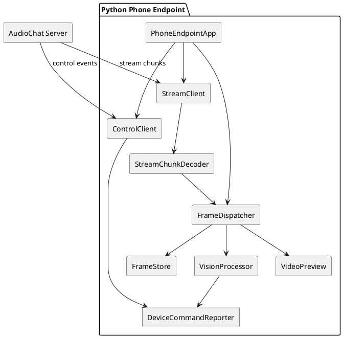
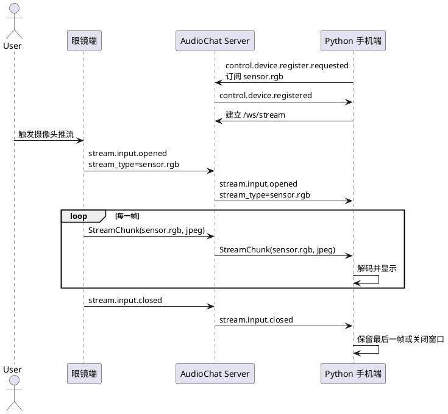

# Python 手机端视频显示设计

## 1. 背景与目标

`examples/dev-support/devices/python-phone` 当前是 Python 手机参考端，主要用于验证手机类设备的注册、事件订阅、端侧任务和 `sensor.rgb` 数据上传。下一阶段需要把它扩展成一个可长驻运行的 Python 手机端侧，使它能够显示眼镜端传过来的视频画面，并为后续在手机端执行 YOLO、OCR、红绿灯识别等本地视觉算法预留清晰扩展点。

本设计只定义 Python 手机端侧的实现方式，不改变 server 与设备之间的协议边界。设备之间仍然不点对点通信，眼镜端视频先通过 server 的 stream 服务进入同一 `user_id` 的设备组，再由事件订阅和 stream 转发下发给 Python 手机端。

## 2. 设计原则

1. 只使用现有两类通信方式：控制事件和 stream 数据流。
2. Python 手机端按设备注册，不引入固定 `phone` 类型分支；能力通过 `supports` 和 `properties` 声明。
3. 视频显示是端侧能力，server 只负责注册、订阅匹配、stream 路由和必要的资产缓存。
4. 视频预览链路优先可调试、可回放，再逐步追求低延迟和高帧率。
5. 未来 YOLO 等算法作为手机端本地处理模块挂到视频帧处理链路，不要求 server 了解具体算法细节。

## 3. 能力边界

### 3.1 本阶段要实现

Python 手机端应支持：

1. 作为设备注册到 server，并绑定到指定 `user_id`。
2. 订阅来自眼镜端的 `sensor.rgb` 视频 stream。
3. 接收 `sensor.rgb` chunk，解码成图像帧。
4. 在本地图形化窗口中实时显示画面。
5. 记录 stream 打开、首帧、关闭、错误等关键日志。
6. 保存最近一帧和运行统计，便于排查画面是否真实到达端侧。

### 3.2 本阶段不实现

1. 不直接连接眼镜端。
2. 不新增 HTTP、RPC 或私有 WebSocket 通道。
3. 不在 server 内做 YOLO 推理。
4. 不强制要求眼镜端必须连续推流；眼镜端可以按工具、任务或用户动作触发推流。
5. 不把视频显示做成 server 的内置页面。

## 4. 协议与订阅

Python 手机端注册时声明自己能消费 `sensor.rgb`：

```yaml
properties:
  endpoint.role.visual_display: true
  endpoint.compute.vision: true
  actuator.display.rgb: true

supports:
  - event: stream.input.*
    filter:
      stream_type: sensor.rgb
  - event: stream.control.*
    filter:
      stream_type: sensor.rgb
  - event: command.*
```

说明：

1. `stream.input.*` 用于接收眼镜端上行 stream 的生命周期事件，例如 `stream.input.opened`、`stream.input.closed`。
2. `stream.control.*` 用于接收 server 下发的控制事件，例如请求端侧打开或关闭本地处理。
3. `sensor.rgb` chunk 仍然走 `/ws/stream` 二进制通道，payload 通常是 JPEG、PNG 或压缩视频切片。
4. 如果后续需要深度相机或 IMU，可增加 `sensor.depth`、`sensor.imu` 订阅，不改变视频显示模块的核心结构。

## 5. 运行方式

本阶段只保留一种运行方式：启动一个图形化界面，然后作为设备注册到 server，并订阅 `sensor.rgb` 相关事件。收到眼镜端视频 stream 后，Python 手机端在本地窗口中显示画面。

建议配置：

```yaml
server_url: http://127.0.0.1:8765
user_id: user-demo-001
device_id: dev-python-phone-display-001
display:
  enabled: true
  backend: opencv
  window_title: audio-chat python phone
  max_fps: 15
  close_on_stream_closed: false
```

GUI 首版建议使用 OpenCV 窗口实现，而不是先引入完整 Python GUI 框架。原因是本阶段的界面核心只是视频预览，OpenCV 的 `cv2.imshow`、`cv2.waitKey` 足够轻量，依赖少，和后续图像处理、YOLO 推理链路也更容易衔接。等后续需要按钮、状态面板、任务列表、识别结果叠加开关等复杂交互时，再考虑 PySide6 或 Dear PyGui。

## 6. 模块设计



### 6.1 PhoneEndpointApp

Python 手机端主入口，负责读取配置、创建控制连接和 stream 连接，并协调各模块生命周期。

主要职责：

1. 启动图形化视频窗口。
2. 注册设备并订阅 `sensor.rgb` 相关事件。
3. 管理控制连接、stream 连接和视频显示生命周期。
4. 在退出时关闭窗口、释放 stream、写出运行结果。

### 6.2 ControlClient

控制事件连接，复用现有 `/ws/control` 协议。

主要职责：

1. 发送 `control.device.register.requested`。
2. 接收注册结果、stream 生命周期事件和设备命令事件。
3. 发送心跳和端侧任务状态事件。

### 6.3 StreamClient

stream 二进制连接，复用现有 `/ws/stream` 协议。

主要职责：

1. 接收 server 路由过来的 `sensor.rgb` chunk。
2. 过滤非目标 stream 类型。
3. 将 chunk 交给 `StreamChunkDecoder`。

### 6.4 StreamChunkDecoder

把协议 chunk 解码成可显示帧。

第一阶段只要求支持：

1. `codec: jpeg`：直接 `cv2.imdecode`。
2. `codec: png`：直接 `cv2.imdecode`。
3. `codec` 缺失时按 JPEG 尝试解码，失败后记录错误并丢弃该帧。

后续可扩展：

1. `h264`：使用 PyAV 或 OpenCV VideoCapture 管道解码。
2. `mjpeg`：按 JPEG 帧序列处理。

### 6.5 FrameDispatcher

帧分发器，负责把视频帧分发给显示、保存和算法模块。

主要职责：

1. 控制队列长度，避免显示端或算法端处理慢导致内存无限增长。
2. 按 `max_fps` 对显示链路限速。
3. 保留最新帧，供工具或任务读取。

### 6.6 VideoPreview

本地视频显示模块。

推荐首版使用 OpenCV：

1. `cv2.imshow` 显示窗口。
2. `cv2.waitKey` 处理关闭键。
3. `close_on_stream_closed=false` 时，stream 关闭后保留最后一帧。

后续如果需要更完整的桌面 UI，可增加 PySide6 或 Dear PyGui 实现，但首版不建议引入更重的 UI 框架。

### 6.7 FrameStore

帧缓存模块。

主要职责：

1. 保存最近一帧到内存。
2. 可选把最近一帧保存到文件。
3. 记录 `stream_id`、`seq`、时间戳、图像尺寸和 codec。

### 6.8 VisionProcessor

本地视觉算法扩展点。

第一阶段不启用推理处理，只预留接口和帧统计。后续 YOLO 可作为新的处理器实现：

```text
BaseVisionProcessor
YoloVisionProcessor
TrafficLightVisionProcessor
FindObjectVisionProcessor
```

算法结果不直接写给其他设备，而是通过控制事件回报 server。

## 7. 视频流时序



## 8. 后续 YOLO 扩展方式

YOLO 不应改变设备协议。它只消费 `FrameDispatcher` 提供的帧，并把结果作为设备命令状态或普通控制事件回报。

推荐配置：

```yaml
vision:
  enabled: true
  processor: yolo
  model_path: models/yolo11n.pt
  device: auto
  input_size: 640
  confidence_threshold: 0.35
  max_fps: 5
  result_event: command.progress
```

处理策略：

1. 显示链路和推理链路分离，推理慢不能阻塞画面显示。
2. 推理队列只保留最新帧，默认丢弃旧帧。
3. 推理结果包含 `stream_id`、`seq`、`objects`、`latency_ms`。
4. 如果任务要求找物，`task_id` 从 server 下发的命令事件中继承。

## 9. 配置草案

```yaml
server_url: http://127.0.0.1:8765
user_id: user-demo-001
device_id: dev-python-phone-display-001
name: Python 手机视频显示端
auth:
  mode: disabled

properties:
  endpoint.role.visual_display: true
  endpoint.compute.vision: true
  actuator.display.rgb: true

supports:
  - event: stream.input.*
    filter:
      stream_type: sensor.rgb
  - event: stream.control.*
    filter:
      stream_type: sensor.rgb
  - event: command.*

display:
  enabled: true
  backend: opencv
  window_title: audio-chat python phone
  max_fps: 15
  close_on_stream_closed: false
  save_latest_frame: runs/python-phone/latest-rgb.jpg

stream:
  accepted_stream_types:
    - sensor.rgb
  accepted_codecs:
    - jpeg
    - png
  frame_queue_size: 2

vision:
  enabled: false
  processor: none
  max_fps: 5
  queue_size: 1
```

## 10. 验收方案

### 10.1 本地 GUI 验收

启动 Python 手机端图形化界面：

```bash
uv run audio-chat.server.run --config examples/for-blind-app/audio-server/server.yaml
uv run python -m audio_chat_python_phone_mock --config examples/dev-support/devices/python-phone/phone.preview.yaml
```

预期结果：

1. Python 手机端注册成功。
2. 收到至少一个 `sensor.rgb` stream。
3. 解码帧数大于 0。
4. Python 手机端窗口显示眼镜画面。
5. 配置了 `display.save_latest_frame` 时，对应的最近帧文件存在。
6. 运行结果中包含 `stream_id`、`frame_count`、`first_frame_after_ms`。
7. 关闭眼镜端推流后，手机端记录 `stream.input.closed` 并保留最后一帧。

### 10.2 后续算法验收

YOLO 接入后增加：

1. 同一 stream 下显示帧不中断。
2. 推理结果通过控制事件回报 server。
3. 推理耗时、帧丢弃数量和最近结果写入运行产物。

## 11. 实现顺序

1. 新增 `phone.preview.yaml` 配置。
2. 在 Python phone endpoint 中增加图形化长驻运行入口。
3. 增加 `StreamChunkDecoder`、`FrameDispatcher`、`FrameStore`。
4. 增加 OpenCV `VideoPreview`。
5. 增加视频显示链路验收测试。
6. 再接入 YOLO 或其他视觉处理器。
