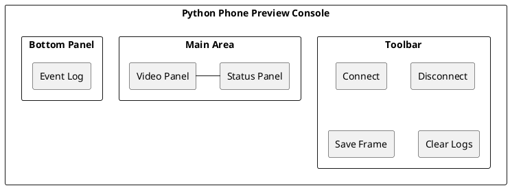
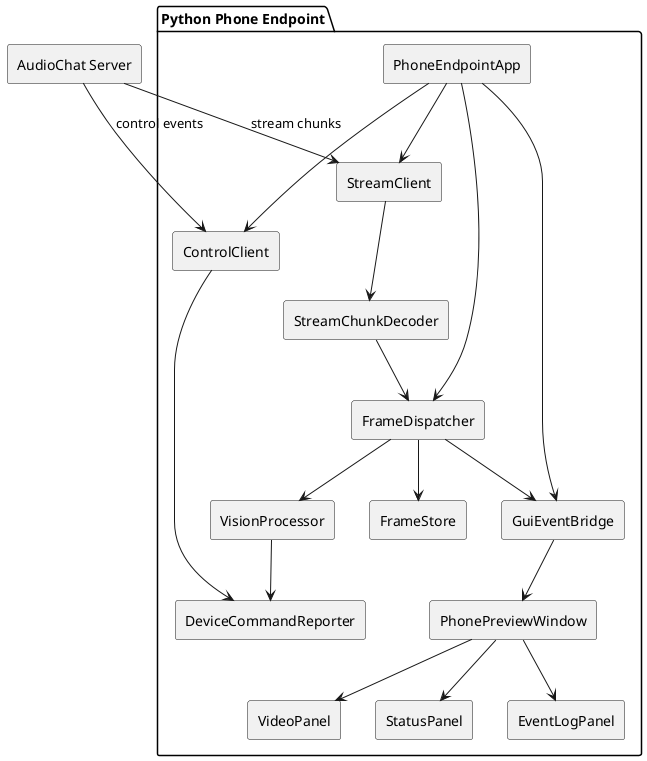
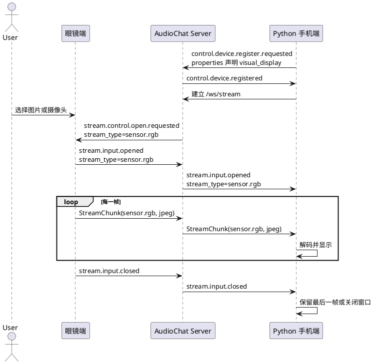

# Python 手机端视频显示设计

## 1. 背景与目标

`examples/dev-support/devices/python-phone` 当前是 Python 手机参考端，主要用于验证手机类设备的注册、事件订阅、端侧任务和 `sensor.rgb` 数据上传。下一阶段需要把它扩展成一个可长驻运行的 Python 手机端侧，使它能够显示眼镜端传过来的视频画面，并为后续在手机端执行 YOLO、OCR、红绿灯识别等本地视觉算法预留清晰扩展点。

本设计只定义 Python 手机端侧的实现方式，不改变 server 与设备之间的协议边界。设备之间仍然不点对点通信，眼镜端视频先通过 server 的 stream 服务进入同一 `user_id` 的设备组，再由事件订阅和 stream 转发下发给 Python 手机端。

## 2. 设计原则

1. 只使用现有两类通信方式：控制事件和 stream 数据流。
2. Python 手机端按设备注册，不引入固定 `phone` 类型分支；能力通过 `supports` 和 `properties` 声明。
3. 视频显示是端侧能力，server 只负责注册、订阅匹配、stream 路由和必要的资产缓存。
4. 视频预览链路优先可调试、可回放；窗口层应能承载状态、日志和操作控件，而不是只显示图像。
5. 未来 YOLO 等算法作为手机端本地处理模块挂到视频帧处理链路，不要求 server 了解具体算法细节。

## 3. 能力边界

### 3.1 本阶段要实现

Python 手机端应支持：

1. 作为设备注册到 server，并绑定到指定 `user_id`。
2. 订阅来自眼镜端的 `sensor.rgb` 视频 stream。
3. 接收 `sensor.rgb` chunk，解码成图像帧。
4. 在本地 GUI 控制台中实时显示画面。
5. 在窗口内显示连接状态、设备身份、stream 状态、帧统计、最近错误和关键日志。
6. 保存最近一帧和运行统计，便于排查画面是否真实到达端侧。

### 3.2 本阶段不实现

1. 不直接连接眼镜端。
2. 不新增 HTTP、RPC 或私有 WebSocket 通道。
3. 不在 server 内做 YOLO 推理。
4. 不强制要求眼镜端必须连续推流；眼镜端可以按工具、任务或用户动作触发推流。
5. 不把视频显示做成 server 的内置页面。

## 4. 协议与订阅

Python 手机端注册时必须区分两类能力：

1. 生产能力：设备能向 server 上传某类 stream，例如相机设备生产 `sensor.rgb`。
2. 消费能力：设备能从 server 接收并处理某类 stream，例如视频显示端消费 `sensor.rgb`。

当前公开注册入口只允许结构化 `supports`，不能在设备 payload 中手写 `routes`。
因此视频显示端不能继续使用旧式写法：

```yaml
supports:
  - event: stream.input.*
    filter:
      stream_type: sensor.rgb
```

推荐首版用 `properties` 表达“消费 RGB 显示”的语义，由 server 注册编译阶段把它转换成内部路由：

```yaml
properties:
  endpoint.role.visual_display: true
  endpoint.compute.vision: true
  actuator.display.rgb: true

supports:
  sensors: []
  actuators: []
```

server 应在注册时补齐内部路由：

```yaml
- event: stream.input.*
  filter:
    stream_type: sensor.rgb
```

如果后续需要把“显示器”正式做成结构化能力，可以新增 `supports.displays` 或 `supports.consumers`。本阶段不建议先扩大公开 schema，优先用 `properties` 补内部系统路由，减少协议面变更。

协议说明：

1. `stream.input.*` 用于接收眼镜端上行 stream 的生命周期事件，例如 `stream.input.opened`、`stream.input.closed`。
2. `sensor.rgb` chunk 仍然走 `/ws/stream` 二进制通道，payload 通常是 JPEG、PNG 或压缩视频切片。
3. 视频显示端不需要接收 `stream.control.open.requested(sensor.rgb)`；这类控制事件应下发给生产 `sensor.rgb` 的眼镜端。
4. Python phone 如果同时要作为测试相机上传帧，可以另开 `phone.mock.yaml` 或显式配置，不要让 `phone.preview.yaml` 同时承担生产和显示两种默认身份。
5. 如果后续需要深度相机或 IMU，可增加 `sensor.depth`、`sensor.imu` 订阅，不改变视频显示模块的核心结构。

## 5. 当前状态与缺口

截至当前代码状态，视频显示链路已经具备一部分基础。2026-05-12 的实现更新后，
browser-glass 到 python-phone 的“单张图片回显”链路已具备本地联调条件；持续视频流仍按后续阶段处理。

已具备：

1. `NetworkPythonPhoneMockEndpoint._stream_loop()` 已能接收 server 下发的二进制 stream chunk。
2. `StreamChunkImageDecoder` 已支持 JPEG / PNG 解码。
3. `FrameStore` 已支持保存最近一帧。
4. `OpenCvVideoPreview` 已支持启动占位窗口和刷新视频帧。
5. `StreamService.open_stream()` 已在非 `sensor.mic` 的 `sensor.*` 输入流打开时，按 `stream.input.opened` 匹配并冻结消费者。
6. `StreamService.on_chunk()` 已能把冻结消费者对应的 chunk 推送到设备的 `/ws/stream` 下行队列。
7. `browser-glass` 已能在收到 `stream.control.open.requested(sensor.rgb)` 后，把用户选择的图片或摄像头抓拍结果作为 `sensor.rgb` 上传。

已补齐：

1. `phone.preview.yaml` 改为 `mode: preview`，启动后长驻接收视频。
2. `phone.preview.yaml` 通过 `properties` 声明视觉显示端身份，不再默认声明 RGB 生产能力。
3. `compile_system_routes_from_properties()` 已支持把 `actuator.display.rgb` 或
   `endpoint.role.visual_display` 编译成 `stream.input.* + sensor.rgb` 内部路由。
4. browser-glass 和 python-phone 默认使用同一 `user_id`。
5. browser-glass 已提供“上传所选图片”按钮，便于不依赖模型工具调用直接触发回显。
6. Python phone 已增加 PySide6 GUI 事件桥、状态面板、日志面板和视频面板；OpenCV 保留为解码和保存最近帧。

仍需后续处理：

1. browser-glass 的 `mode=continuous` 当前仍按单张图片上传处理，不是真持续视频流。
2. PySide6 窗口首版只包含视频、状态和日志，工具栏按钮、日志过滤、runs 目录打开等增强项后续补。
3. 后续如果要正式表达“显示器”能力，仍建议新增 `supports.displays` 或
   `supports.consumers`，本阶段先不扩大公开 schema。

## 6. 运行方式

本阶段保留一种主运行方式：启动一个 Python GUI 控制台，然后作为设备注册到 server，并订阅 `sensor.rgb` 相关事件。收到眼镜端视频 stream 后，Python 手机端在窗口的视频区域显示画面，同时在同一个窗口显示关键状态和日志。

GUI 框架建议使用 PySide6。OpenCV 只保留在解码、颜色转换和保存最近帧的位置，不再直接承担窗口显示职责。

建议配置：

```yaml
mode: preview
server_url: http://127.0.0.1:8765
user_id: user-browser-glass-001
device_id: dev-python-phone-preview
name: Python 手机视频显示端
auth:
  mode: disabled

properties:
  endpoint.role.visual_display: true
  endpoint.compute.vision: true
  actuator.display.rgb: true

supports:
  sensors: []
  actuators: []

display:
  enabled: true
  backend: pyside6
  window_title: audio-chat Python Phone
  max_fps: 15
  save_latest_frame: runs/audio-chat/python-phone/latest-rgb.png
  log_limit: 200
  show_debug_events: true
```

### 6.1 GUI 框架选择

候选方案：

1. PySide6：Qt 官方 Python 绑定，适合做跨平台桌面控制台；可用 `QMainWindow`、`QLabel`、`QTextEdit`、`QTableWidget`、`QStatusBar`、`QTimer` 和 signal/slot 组织视频、状态、日志和后台网络事件。
2. Tkinter：Python 标准库自带，依赖最少，但复杂布局、图片刷新、日志面板和后续可扩展性较弱，更适合简单工具窗口。
3. Dear PyGui：适合快速做调试面板，动态纹理适合中小尺寸图像刷新，但在 macOS 上部分纹理格式有限制，且 UI 生态和团队熟悉度不如 Qt。
4. OpenCV highgui：只适合临时显示图像，不适合状态面板、日志窗口、按钮、图标和多区域布局。

本项目建议采用 PySide6，理由：

1. 这不是单纯看图工具，而是多设备联调控制台。
2. 需要稳定的窗口布局：左侧视频、右侧状态、底部日志、顶部工具栏。
3. 后续要增加按钮、过滤器、任务状态、YOLO 结果叠加、截图保存和导出运行摘要。
4. Qt 的 signal/slot 模型适合把 aiohttp 网络线程或 asyncio loop 的事件安全投递给 GUI 主线程。
5. PySide6 是额外依赖，但可以先作为开发支持端侧依赖，不进入 SDK 核心运行依赖；如果担心包体积，可以放进 dev/extra 依赖组。

### 6.2 GUI 信息架构

首版窗口建议布局：



窗口区域：

1. 顶部工具栏：连接、断开、保存当前帧、清空日志、打开 runs 目录。
2. 视频区域：显示最新 `sensor.rgb` 帧；无帧时显示等待状态。
3. 状态区域：显示 control/stream 连接状态、user_id、device_id、最新 stream_id、帧数、FPS、首帧时间、最近错误。
4. 事件日志：按时间追加关键事件，例如注册成功、stream 打开、首帧到达、解码失败、stream 关闭。
5. 底部状态栏：显示当前运行阶段和最近一次错误摘要。

## 7. 模块设计



### 7.1 PhoneEndpointApp

Python 手机端主入口，负责读取配置、创建控制连接和 stream 连接，并协调各模块生命周期。

主要职责：

1. 启动图形化视频窗口。
2. 注册设备并订阅 `sensor.rgb` 相关事件。
3. 管理控制连接、stream 连接和视频显示生命周期。
4. 在退出时关闭窗口、释放 stream、写出运行结果。

### 7.2 ControlClient

控制事件连接，复用现有 `/ws/control` 协议。

主要职责：

1. 发送 `control.device.register.requested`。
2. 接收注册结果、stream 生命周期事件和设备命令事件。
3. 发送心跳和端侧任务状态事件。

### 7.3 StreamClient

stream 二进制连接，复用现有 `/ws/stream` 协议。

主要职责：

1. 接收 server 路由过来的 `sensor.rgb` chunk。
2. 过滤非目标 stream 类型。
3. 将 chunk 交给 `StreamChunkDecoder`。

### 7.4 StreamChunkDecoder

把协议 chunk 解码成可显示帧。

第一阶段只要求支持：

1. `codec: jpeg`：直接 `cv2.imdecode`。
2. `codec: png`：直接 `cv2.imdecode`。
3. `codec` 缺失时按 JPEG 尝试解码，失败后记录错误并丢弃该帧。

后续可扩展：

1. `h264`：使用 PyAV 或 OpenCV VideoCapture 管道解码。
2. `mjpeg`：按 JPEG 帧序列处理。

### 7.5 FrameDispatcher

帧分发器，负责把视频帧分发给显示、保存和算法模块。

主要职责：

1. 控制队列长度，避免显示端或算法端处理慢导致内存无限增长。
2. 按 `max_fps` 对显示链路限速。
3. 保留最新帧，供工具或任务读取。

### 7.6 PhonePreviewWindow

PySide6 主窗口。

主要职责：

1. 创建并管理桌面窗口、工具栏、视频区域、状态区域和日志区域。
2. 接收 `GuiEventBridge` 投递的线程安全 GUI 事件。
3. 把最新帧渲染到 `VideoPanel`。
4. 把连接状态、帧统计和最近错误刷新到 `StatusPanel`。
5. 把关键事件追加到 `EventLogPanel`。

窗口刷新必须发生在 Qt 主线程；网络收包、图片解码和文件写入不能直接操作 Qt widget。

### 7.7 VideoPanel

视频显示面板。

主要职责：

1. 接收 BGR/RGB 图像帧。
2. 转成 `QImage` / `QPixmap` 后显示到 `QLabel` 或自定义 widget。
3. 保持宽高比缩放。
4. 支持无帧占位、stream 关闭后保留最后一帧、解码失败时显示错误覆盖层。

### 7.8 StatusPanel

状态面板。

首版字段：

1. control WebSocket：idle / connecting / connected / closed / error。
2. stream WebSocket：idle / connecting / connected / closed / error。
3. 设备身份：user_id、device_id、server_url。
4. 当前 stream：stream_id、stream_type、codec、width、height。
5. 帧统计：frame_count、decoded_count、dropped_count、decode_error_count、display_fps。
6. 时间指标：registered_at、first_frame_at、last_frame_at。
7. 最近错误：error_type、message。

### 7.9 EventLogPanel

事件日志面板。

主要职责：

1. 按时间追加关键事件。
2. 支持按级别显示 INFO / WARNING / ERROR。
3. 支持限制最大行数，避免长时间运行后内存增长。
4. 支持一键清空和后续导出到本地文件。

### 7.10 GuiEventBridge

网络与 GUI 之间的事件桥。

主要职责：

1. 把 control loop、stream loop、frame decoder 产生的状态变更归一成 GUI 事件。
2. 使用 Qt signal/slot 或线程安全队列把事件投递到 GUI 主线程。
3. 避免后台协程直接修改 widget。
4. 为无头测试提供可替换的 fake bridge。

### 7.11 FrameStore

帧缓存模块。

主要职责：

1. 保存最近一帧到内存。
2. 可选把最近一帧保存到文件。
3. 记录 `stream_id`、`seq`、时间戳、图像尺寸和 codec。

### 7.12 VisionProcessor

本地视觉算法扩展点。

第一阶段不启用推理处理，只预留接口和帧统计。后续 YOLO 可作为新的处理器实现：

```text
BaseVisionProcessor
YoloVisionProcessor
TrafficLightVisionProcessor
FindObjectVisionProcessor
```

算法结果不直接写给其他设备，而是通过控制事件回报 server。

## 8. 视频流时序



## 9. browser-glass 图片回显测试链路

首版测试目标不是持续视频，而是确认一张或多张浏览器上传图片能够经 server 回显到 Python phone。

联调顺序：

1. 启动 server。
2. 启动 `python-phone` preview，确认控制连接和 stream 连接都保持在线。
3. 打开 `browser-glass`，把 `User ID` 设置成和 phone preview 一致。
4. 在 browser-glass 中选择图片。
5. 通过测试工具、临时 CLI 或业务任务触发一次 `stream.control.open.requested(sensor.rgb)` 给 browser-glass。
6. browser-glass 发送 `stream.input.opened(sensor.rgb)`，随后通过 `/ws/stream` 上传 JPEG chunk。
7. server 在打开该输入流时按 `stream.input.opened(sensor.rgb)` 匹配 phone preview，冻结 `consumer_device_ids`。
8. server 收到 chunk 后下发给 phone preview。
9. phone preview 解码并显示，同时写出 `runs/python-phone/latest-rgb.jpg`。

观察点：

1. `/api/debug/devices` 中 browser-glass 和 python-phone 都在线，且 `user_id` 一致。
2. 根目录 `control-routes.jsonl` 里 `stream.input.opened(sensor.rgb)` 对 phone preview 的路由结果为 delivered。
3. session `stream-events.jsonl` 里能看到 `consumer_device_ids` 包含 phone preview。
4. phone 端 stdout 结果或退出摘要中 `video_frames` 数量大于 0，`video_errors` 为空。
5. `runs/python-phone/latest-rgb.jpg` 存在，并且内容是 browser-glass 选择的图片。

## 10. 后续 YOLO 扩展方式

YOLO 不应改变设备协议。它只消费 `FrameDispatcher` 提供的帧，并把结果作为设备命令状态或普通控制事件回报。

推荐配置：

```yaml
vision:
  enabled: true
  processor: yolo
  model_path: models/yolo11n.pt
  device: auto
  input_size: 640
  confidence_threshold: 0.35
  max_fps: 5
  result_event: command.progress
```

处理策略：

1. 显示链路和推理链路分离，推理慢不能阻塞画面显示。
2. 推理队列只保留最新帧，默认丢弃旧帧。
3. 推理结果包含 `stream_id`、`seq`、`objects`、`latency_ms`。
4. 如果任务要求找物，`task_id` 从 server 下发的命令事件中继承。

## 11. 配置草案

```yaml
mode: preview
server_url: http://127.0.0.1:8765
user_id: user-browser-glass-001
device_id: dev-python-phone-preview
name: Python 手机视频显示端
auth:
  mode: disabled

properties:
  endpoint.role.visual_display: true
  endpoint.compute.vision: true
  actuator.display.rgb: true

supports:
  sensors: []
  actuators: []

display:
  enabled: true
  backend: pyside6
  window_title: audio-chat python phone
  max_fps: 15
  close_on_stream_closed: false
  save_latest_frame: runs/python-phone/latest-rgb.jpg
  log_limit: 500
  show_debug_events: true

stream:
  accepted_stream_types:
    - sensor.rgb
  accepted_codecs:
    - jpeg
    - png
  frame_queue_size: 2

vision:
  enabled: false
  processor: none
  max_fps: 5
  queue_size: 1
```

## 12. 验收方案

### 12.1 自动化验收

先修复并通过现有回显测试：

```bash
uv run python -m pytest examples/dev-support/tests/test_python_phone_video_display.py -q
```

预期结果：

1. Python 手机端注册成功。
2. 收到至少一个 `sensor.rgb` stream。
3. 解码帧数大于 0。
4. 配置了 `display.save_latest_frame` 时，对应的最近帧文件存在。
5. `StreamHandle.consumer_device_ids` 包含 phone preview。
6. phone 端 `video_errors` 为空。

### 12.2 本地 GUI 验收

终端 1：

```bash
uv run audio-chat.server.run --config examples/for-blind-app/audio-server/server.yaml
```

终端 2：

```bash
uv run --extra gui python -m audio_chat_python_phone_mock --config examples/dev-support/devices/python-phone/phone.preview.yaml
```

终端 3 或浏览器：

```bash
uv run audio-chat.web.open --print-url
```

手动步骤：

1. browser-glass 的 `User ID` 使用 `user-browser-glass-001`。
2. browser-glass 连接并注册。
3. 选择一张图片。
4. 触发一次 RGB 采集请求。
5. 观察 Python 手机端窗口和 `runs/python-phone/latest-rgb.jpg`。

预期结果：

1. Python 手机端窗口显示 browser-glass 上传图片。
2. 最近帧文件存在并可打开。
3. `/api/debug/devices` 显示两个设备在线且同属一个 `user_id`。
4. `control-routes.jsonl` 显示 `stream.input.opened(sensor.rgb)` 投递到 phone preview。
5. `stream-events.jsonl` 记录 RGB chunk 收发和消费者设备。

### 12.3 后续算法验收

YOLO 接入后增加：

1. 同一 stream 下显示帧不中断。
2. 推理结果通过控制事件回报 server。
3. 推理耗时、帧丢弃数量和最近结果写入运行产物。

## 13. 详细开发计划

### 阶段 1：修正协议表达和路由编译

目标：让 server 能把 `sensor.rgb` 输入流路由到声明为视频显示端的 Python phone。

改动：

1. 在 `audio-server/audio_chat/device_capabilities.py` 中扩展 `compile_system_routes_from_properties()`。
2. 当 `properties.actuator.display.rgb=true` 或 `properties.endpoint.role.visual_display=true` 时，追加内部路由：

   ```yaml
   - event: stream.input.*
     filter:
       stream_type: sensor.rgb
   ```

3. 不允许业务代码手写 `routes`，继续保持当前注册边界。
4. 给路由编译补单元测试，确认 visual display properties 能生成 `stream.input.*`，普通 RGB 生产传感器仍只生成 `stream.control.*`。

验收：

```bash
uv run python -m pytest audio-server/tests/test_device_capabilities_semantics.py -q
```

### 阶段 2：修正 `phone.preview.yaml`

目标：让 preview 配置真正表达“长驻 GUI 显示端”，而不是注册后退出的 RGB 生产端。

改动：

1. 把 `mode: register_only` 改为 `mode: preview` 或其他会进入 `run_forever()` 的值。
2. 将 `user_id` 调整为和 browser-glass 默认值一致，建议先用 `user-browser-glass-001`。
3. 删除默认 `supports.sensors.rgb`，避免 preview 被当成相机生产设备。
4. 增加 display 配置：

   ```yaml
   display:
     enabled: true
     backend: pyside6
     window_title: audio-chat python phone
     max_fps: 15
     close_on_stream_closed: false
     save_latest_frame: runs/python-phone/latest-rgb.jpg
     log_limit: 500
     show_debug_events: true
   ```

5. 增加 properties：

   ```yaml
   properties:
     endpoint.role.visual_display: true
     endpoint.compute.vision: true
     actuator.display.rgb: true
   ```

验收：

```bash
uv run --extra gui python -m audio_chat_python_phone_mock --config examples/dev-support/devices/python-phone/phone.preview.yaml
```

启动后应保持运行，并显示包含视频占位区、连接状态和事件日志的 GUI 窗口。

### 阶段 3：引入 PySide6 GUI 控制台

目标：用真实 GUI 框架替代 OpenCV highgui 窗口，形成可长期使用的联调控制台。

改动：

1. 新增 GUI 模块，例如 `audio_chat_python_phone_mock/gui.py`。
2. 实现 `PhonePreviewWindow`、`VideoPanel`、`StatusPanel`、`EventLogPanel`。
3. 实现 `GuiEventBridge`，把后台网络事件转成 Qt signal。
4. `StreamChunkImageDecoder` 继续负责解码，GUI 层只接收已解码帧和状态事件。
5. 配置 `display.backend=pyside6` 时启动 GUI；`display.backend=none` 或 `display.enabled=false` 时保持无头测试能力。
6. 把 PySide6 放入开发支持依赖，避免 SDK 核心必须依赖桌面 GUI。

验收：

1. 启动后能看到一个主窗口，而不是 OpenCV 单图窗口。
2. 未收到帧时视频区域显示等待状态。
3. 注册成功、stream 连接、stream 打开、首帧到达、解码失败等事件能出现在日志面板。
4. 状态面板能实时更新 frame_count、latest_stream_id、latest_error。
5. 无头测试可以不启动 GUI，避免 CI 被桌面环境阻塞。

### 阶段 4：补齐自动化回显测试

目标：让现有失败测试成为回归保护，同时覆盖 GUI 事件桥的核心行为。

改动：

1. 更新 `examples/dev-support/tests/test_python_phone_video_display.py`，使 phone preview 使用新的 properties 和无生产 sensor 的 supports。
2. 保持测试使用真实 aiohttp server、真实 `/ws/control`、真实 `/ws/stream`。
3. 断言 phone 收到帧、保存最近帧、`consumer_device_ids` 包含 phone preview。
4. 增加一条负向测试：未声明 visual display 的普通设备不会收到 `sensor.rgb` chunk。
5. 增加 `GuiEventBridge` 的无头单元测试：模拟注册、首帧、错误事件，确认状态快照和日志队列更新。

验收：

```bash
uv run python -m pytest examples/dev-support/tests/test_python_phone_video_display.py -q
```

### 阶段 5：补一个可重复的触发入口

目标：手动联调时不依赖大模型猜测工具调用，能稳定让 browser-glass 上传一张图。

推荐方案：

1. 新增轻量 CLI，例如 `audio-chat.dev.request-rgb`，只用于开发支持。
2. CLI 通过 server 调试接口或控制面请求同一 `user_id` 下的 `sensor.rgb` 采集。
3. CLI 不新增业务协议，不绕过 stream；它只触发现有 `stream.control.open.requested(sensor.rgb)`。

备选方案：

1. 在 `browser-glass` 页面增加“上传所选图片作为 sensor.rgb”开发按钮。
2. 按当前协议发送 `stream.input.opened`、chunk、`stream.input.closed`。
3. 按钮明确标注为开发支持入口，不进入 SDK 核心包。

取舍：

1. CLI 更适合自动化和文档复现。
2. 页面按钮更适合手动探索。
3. 首版可以先做页面按钮，因为它不需要新增 server HTTP API；后续再补 CLI。

验收：

1. browser-glass 选择图片后，点击一次即可上传。
2. Python phone preview 能显示该图片。
3. `control-routes.jsonl` 和 `stream-events.jsonl` 有完整证据。

### 阶段 6：联调文档和运行产物对齐

目标：让 README、quickstart 和 cross-device 文档与真实命令一致。

改动：

1. 更新 `README.md` 的 Python 手机视频显示端说明。
2. 更新 `docs/getting-started/quickstart.md` 的 RGB 回显步骤。
3. 更新 `docs/how-to/cross-device-local-debug.md`，增加 browser-glass + python-phone 图片回显流程。
4. 明确说明 browser-glass 和 phone preview 必须使用同一 `user_id`。
5. 明确说明“图片选择后不会自动上传，需要点击开发按钮或触发 RGB 请求”。
6. 明确运行产物观察点：`control-routes.jsonl`、`stream-events.jsonl`、`latest-rgb.jpg`。

验收：

```bash
uv run python -m pytest audio-server/tests/test_docs_commands.py -q
```

如果文档命令无法自动覆盖本链路，至少执行一次手动联调并记录实际命令和结果。

### 阶段 7：持续视频能力后续扩展

目标：在图片回显稳定后，再把 browser-glass 的连续模式扩成真正连续视频。

改动：

1. browser-glass 收到 `mode=continuous` 时按 `frequency_hz` 周期上传多帧。
2. 支持 `stream.control.close.requested(sensor.rgb)` 停止连续推流。
3. 增加帧率限制和发送队列背压，避免浏览器内存堆积。
4. phone preview 增加丢帧统计和首帧耗时统计。

验收：

1. 连续推流 30 秒不崩溃。
2. phone preview 窗口持续刷新。
3. 关闭请求后 browser-glass 停止上传，phone preview 保留最后一帧。

## 14. 首轮最小闭环任务清单

1. 修 `compile_system_routes_from_properties()`，让 visual display properties 生成 `stream.input.* / sensor.rgb` 内部路由。
2. 修 `phone.preview.yaml`，让它长驻运行、消费 RGB、使用 PySide6 GUI、保存最近帧。
3. 新增 PySide6 GUI 控制台，至少包含视频区、状态区、日志区和基础工具栏。
4. 修并跑通 `test_python_phone_video_display.py`，并补 GUI 事件桥无头测试。
5. 给 browser-glass 增加一个开发用“上传所选图片”入口，或提供等效 CLI 触发入口。
6. 跑一次本地三端联调：server、python-phone preview、browser-glass。
7. 更新 README / quickstart / cross-device 文档中的命令和观察点。
