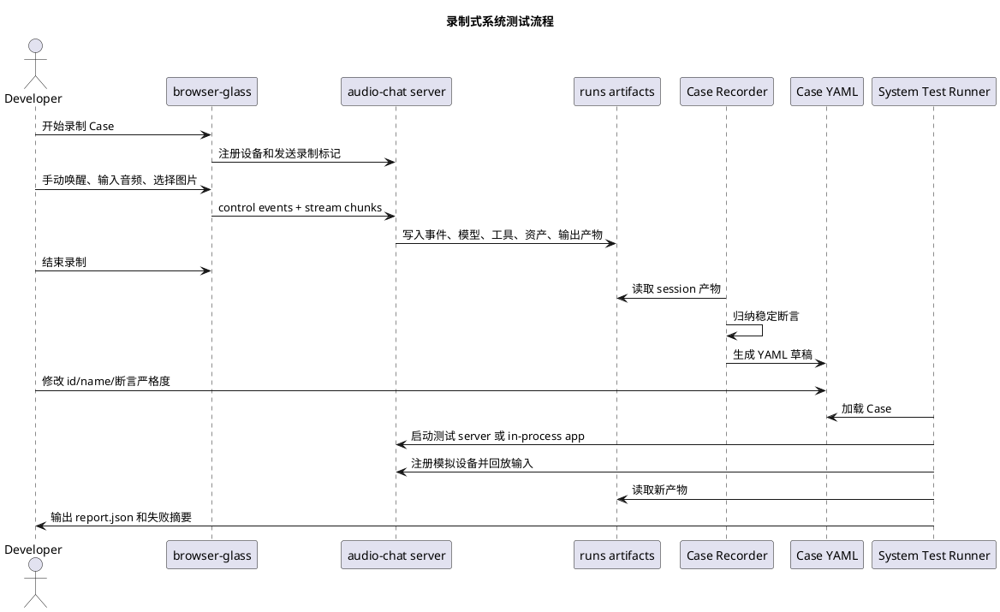

# 录制式系统集成测试设计

更新时间：2026-05-12

文档状态：下一阶段设计稿。本文记录通过 `browser-glass` 手动测试结果自动生成系统级 Case 草稿的方案，避免后续遗忘关键取舍。当前实现尚未完成，开发入口以本设计和后续开发计划为准。

## 1. 背景

当前仓库已经具备系统测试的基础能力：

1. `testdata/audio-sample/` 保存了可回放的语音样例。
2. `testdata/image-sample/` 保存了可作为 `sensor.rgb` fixture 的图片样例。
3. `python-glass` playback 能用真实协议或 in-process 方式上传 `sensor.mic`、响应 `sensor.rgb` 请求并消费 `actuator.speaker`。
4. `browser-glass` 能完成手动注册、唤醒、语音输入、图片上传和播放验证。
5. server 的 runs 产物已经记录事件、stream、Agent、Tool、Task、资产和输出链路。

下一阶段要做的不是普通单元测试，而是面向完整功能链路的系统级集成测试。测试 Case 应提前描述用户输入、设备行为和预期系统行为，每次修改代码后可以自动回放并检查所有 Case 是否仍通过。

手写 Case YAML 成本较高，因此需要支持从一次真实手动联调中自动录制 Case 草稿：开发者先用 `browser-glass` 完成探索式测试，再由工具根据 runs 产物归纳出可回放、可维护的 Case 文件。

## 2. 目标

本方案目标：

1. 通过 `browser-glass` 手动跑通一次真实链路。
2. 从 server runs 产物自动生成系统测试 Case 草稿。
3. 生成的 Case 能复用 `testdata/audio-sample` 和 `testdata/image-sample`。
4. Case 中保存稳定预期行为，而不是保存一次运行的所有动态细节。
5. 后续通过系统测试 runner 自动回放 Case 并输出结构化报告。
6. 失败时能指出是注册、控制事件、stream、Agent、Tool、Task、资产、输出还是系统错误层面失败。

非目标：

1. 不把它做成只断言函数返回值的单元测试。
2. 不把浏览器页面日志当作唯一真相。
3. 不逐字锁定真实大模型自然语言回复。
4. 不要求每个 Case 一开始覆盖真机、真实模型和所有端侧。
5. 不让 Case 文件保存 `event_id`、`timestamp_ms`、`stream_id` 等一次性动态字段。

## 3. 总体流程



## 4. 分工边界

### 4.1 browser-glass

`browser-glass` 负责交互式手动测试：

1. 注册普通 Device。
2. 发送 wake / interrupt / close 等控制事件。
3. 上传真实麦克风或离线音频。
4. 在 server 请求 `sensor.rgb` 时上传选择的图片或摄像头抓拍。
5. 播放 server 下发的 `actuator.speaker`。
6. 在录制模式下记录用户选择的样例文件名和录制元数据。

`browser-glass` 不负责完整推断系统 Case。它只知道前端行为，不完整知道 Agent、Tool、Task、资产缓存和播放仲裁是否符合预期。

### 4.2 server runs

server runs 是录制的主要真相来源：

1. `events.jsonl`：控制面事件和会话生命周期。
2. `stream-events.jsonl`：stream 生命周期和 chunk 摘要。
3. `agent-events.jsonl`：Agent Core 和 provider 关键事件。
4. `model-request.json`：本轮模型请求、提示词、messages 和 tools。
5. `tool-events.jsonl`：工具调用参数、结果、耗时和错误。
6. `task-signals.jsonl`：Task 启动、状态变化和业务信号。
7. `assets.jsonl`：图片等传感器资产写入。
8. `output-decisions.jsonl` / `playback-decisions.jsonl`：输出和播放仲裁。
9. `system-events.jsonl`：系统错误、降级和恢复事件。

### 4.3 Case Recorder

Case Recorder 负责把一次运行归纳成 Case 草稿：

1. 定位要录制的 `user_id`、`device_id`、`session_id`。
2. 读取该 session 的 runs 产物。
3. 推断输入音频和图片 fixture。
4. 从事件和产物中抽取稳定断言。
5. 过滤动态字段和高频 chunk 明细。
6. 输出 YAML 草稿和录制摘要。

第一阶段可以先做 CLI：

```bash
uv run audio-chat.system-test.record \
  --runs-root examples/for-blind-app/audio-server/runs \
  --user-id user-browser-glass-001 \
  --device-id dev-browser-glass-001 \
  --out examples/dev-support/system-tests/cases/draft/latest.yaml
```

后续再让 `browser-glass` 页面展示“导出 Case YAML”按钮。浏览器直接写仓库文件权限复杂，第一阶段可以只展示 YAML 文本供复制。

### 4.4 System Test Runner

System Test Runner 负责回放 Case：

1. 加载 Case YAML。
2. 启动 in-process app 或连接已有 server。
3. 注册一个或多个模拟设备。
4. 按 Case 上传音频、图片、视频或传感器数据。
5. 等待系统完成输出、Task 或超时。
6. 读取本轮 runs 产物。
7. 执行断言并输出 `report.json`。

## 5. Case 文件结构

建议目录：

```text
examples/dev-support/system-tests/
  cases/
    smoke/
    vision/
    memory/
    tasks/
    navigation/
    draft/
  suites/
    smoke.yaml
    full.yaml
  reports/
```

Case 示例：

```yaml
id: look_front_001
name: 看一下我前面有什么
description: 使用音频样例触发看图工具，并要求设备上传一张 RGB 图片。

source:
  recorded_from: browser-glass
  recorded_at: "2026-05-12T00:00:00+08:00"
  original_user_id: user-browser-glass-001
  original_device_id: dev-browser-glass-001

app:
  config: examples/for-blind-app/audio-server/server.yaml
  agent_mode: text
  providers: mock

inputs:
  audio:
    path: testdata/audio-sample/看一下我前面有什么.wav
    mode: realtime_chunks
    chunk_ms: 20
  sensors:
    sensor.rgb:
      fixtures:
        - path: testdata/image-sample/刚子看电脑.jpeg
          codec: jpeg

devices:
  - id: glass
    device_id: dev-system-test-glass
    user_id: user-system-test
    system_audio:
      input: sensor.mic
      output: actuator.speaker
    supports:
      sensors:
        - type: rgb
          modes: [single, continuous]
      actuators:
        - type: vibrator
          commands: [vibrate]

expect:
  events:
    includes:
      - control.device.registered
      - control.audio_session.open.requested
      - stream.control.open.requested
      - stream.output.open.requested
  streams:
    includes:
      - sensor.mic
      - sensor.rgb
      - actuator.speaker
  tools:
    called:
      - capture_photo
  assets:
    sensor.rgb:
      min_count: 1
  output:
    min_audio_chunks: 1
  errors:
    disallow_system_error: true
```

## 6. 录制归纳规则

录制器不能把一次手动运行原样变成全量断言。它需要把动态事实归纳成稳定预期。

应该保留：

1. 出现过的关键事件名。
2. 出现过的 stream 类型。
3. 被调用的 Tool 名称。
4. 被启动或完成的 Task 类型。
5. 资产类型和最小数量。
6. speaker 输出是否存在。
7. 是否出现系统错误。
8. 模型请求中是否包含关键 tools。

应该过滤：

1. `event_id`
2. `timestamp_ms`
3. `stream_id`
4. `session_id`
5. `asset_id`
6. 具体 chunk 数和每个 chunk 的字节数，除非 Case 明确要求。
7. 真实模型自然语言回复全文，除非在 mock lane 中可以稳定断言。

建议的稳定断言转换：

| 录制事实 | Case 断言 |
| --- | --- |
| 本次出现 `capture_photo` 调用 | `tools.called` 包含 `capture_photo` |
| 本次写入 1 张 JPEG | `assets.sensor.rgb.min_count: 1` |
| 本次 speaker 输出 18 个 chunk | `output.min_audio_chunks: 1` |
| 本次有 `stream.control.open.requested(sensor.rgb)` | `events.includes` 包含 `stream.control.open.requested`，`streams.includes` 包含 `sensor.rgb` |
| 本次无系统错误 | `errors.disallow_system_error: true` |
| 本次模型请求包含某工具 | `model_request.tools.includes` 包含工具名 |

## 7. 测试 Lane

建议至少三条 lane：

| Lane | 用途 | Provider | 触发时机 | 断言策略 |
| --- | --- | --- | --- | --- |
| `smoke` | 快速发现核心链路回归 | mock | 每次改代码后 | 严格检查事件、工具、资产、输出 |
| `acceptance` | 覆盖更多系统能力 | mock 或本地稳定 provider | 提交前 | 检查完整 Case 集和 runs 产物 |
| `live` | 验证真实模型和真实 provider | DashScope / OpenAI-compatible | 手动或 nightly | 不逐字锁定回复，重点检查链路和错误 |

第一阶段优先实现 `smoke`，避免被真实模型波动拖慢开发。

## 8. 失败报告

Runner 输出的 `report.json` 应包含：

```json
{
  "ok": false,
  "suite": "smoke",
  "case_count": 3,
  "passed": 2,
  "failed": 1,
  "cases": [
    {
      "id": "look_front_001",
      "ok": false,
      "failed_assertions": [
        {
          "path": "tools.called",
          "expected": "capture_photo",
          "actual": []
        }
      ],
      "runs_dir": "examples/for-blind-app/audio-server/runs/user-system-test/dev-system-test-glass"
    }
  ]
}
```

命令行输出只展示摘要和失败定位，详细证据保留到 report 和 runs 产物。

## 9. 注意点

1. Case 文件是系统行为契约，不是某次日志的拷贝。
2. 录制器必须默认生成“宽松但有效”的断言，避免后续因为时间戳、chunk 数或模型措辞变化产生误报。
3. 对真实 provider 的 Case 不能逐字断言 assistant 文本；mock provider lane 可以更严格。
4. 图片、音频、视频等输入应引用 `testdata` 文件路径，不把媒体字节写进 YAML。
5. 录制时如果使用了本地临时图片，应提示复制到 `testdata/image-sample/` 后再生成可提交 Case。
6. 录制时如果使用了真实用户音频、图片或视频，默认不生成可提交 Case，除非明确指定脱敏路径。
7. 系统测试不能绕过 Control Service、Stream Service、Asset Service 和 Output Service。
8. 第一阶段可以复用 `PythonPlaybackEndpoint.run_scripted()`，不要急着重写完整模拟器。
9. 后续统一 `python-device-sim` 时，应让 Case Runner 复用同一套场景定义。
10. 文档中的测试结果必须来自真实命令结果；设计阶段不要写“已通过”。

