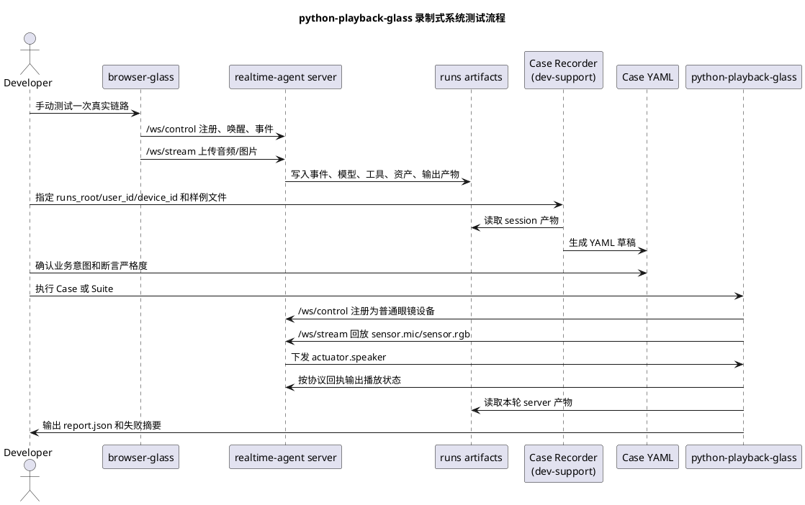

# 录制式系统集成测试设计

更新时间：2026-05-12

文档状态：下一阶段设计稿。本文记录新的定位：系统测试能力属于 `examples/dev-support` 下的特殊端侧实现，名称暂定为 `python-playback-glass`，即“眼镜回放设备”。它对 server 必须像普通端侧一样透明，不能成为 SDK 内部测试框架。

## 1. 核心定位

`python-playback-glass` 是一个开发支持端侧，不是 `realtime_agent` SDK 内部模块。

它在系统中的身份是“一台可脚本化的眼镜设备”：

1. 通过 `/ws/control` 注册设备、发送控制事件、接收 server 控制事件。
2. 通过 `/ws/stream` 上传 `sensor.mic`、`sensor.rgb` 等输入 stream。
3. 通过 `/ws/stream` 接收 `actuator.speaker` 输出 stream，并按协议回执 `stream.output.started/finished/closed`。
4. 按 Case 文件回放 `testdata/audio-sample/` 和 `testdata/image-sample/`。
5. 读取 server 的 runs 产物做系统级断言。

server 不能知道它是测试框架。对 server 来说，它和 `browser-glass`、`python-glass`、真实眼镜没有本质区别，只是 client_type、device_id 和能力声明不同。

## 2. 明确禁止

本方案禁止以下实现方式：

1. 不在 `agent-server/realtime_agent/` 下新增 `system_test` 之类测试框架目录。
2. 不新增 `realtime-agent.system-test.*` 这类 SDK CLI 入口。
3. 不在回放端侧中实例化 `RealtimeAgentApp`、`RealtimeAgentConfig`。
4. 不直接调用 `register_device()`、`publish_control_event()`、`open_input_stream()`、`write_input_chunk()`、`stream_service.close_stream()`。
5. 不直接调用 `ToolGateway`、`TaskEngine`、`OutputService`、`AssetService` 或 server recorder。
6. 不使用 in-process 模式作为系统测试主路径。
7. 不把 Case Runner 做成 server 内部调度器。

如果某个测试为了 SDK 单元或组件测试确实需要 in-process，那应放在 `agent-server/tests/`，并明确命名为组件测试；它不属于本文讨论的系统级端侧回放测试。

## 3. 背景

当前仓库已有可复用基础：

1. `testdata/audio-sample/` 保存可回放的语音样例。
2. `testdata/image-sample/` 保存可作为 `sensor.rgb` fixture 的图片样例。
3. `browser-glass` 能完成手动注册、唤醒、语音输入、图片上传和播放验证。
4. server runs 产物记录事件、stream、Agent、Tool、Task、资产和输出链路。
5. `python-glass` 中已有部分网络 WebSocket 端侧逻辑，可以作为参考，但需要独立整理成 `python-playback-glass`。

下一阶段要做的是系统级集成测试。测试 Case 应提前描述用户输入、设备行为和预期系统行为；每次改代码后，可以自动启动 server、启动回放设备、执行 Case，并检查所有预期是否满足。

## 4. 目标

本方案目标：

1. 支持从 `browser-glass` 手动测试 runs 产物生成 Case YAML 草稿。
2. 支持 `python-playback-glass` 按 Case YAML 自动回放音频和图片。
3. 回放设备只通过真实控制协议和数据流协议与 server 对话。
4. 支持检查事件、stream、Tool、Task、资产、输出和系统错误。
5. 支持输出结构化 `report.json`。
6. 支持 pytest 或本地命令调用，但 pytest 只作为外层启动器，不直接调用 server 内部对象。

非目标：

1. 不把它做成只断言函数返回值的单元测试。
2. 不把浏览器页面日志当作唯一真相。
3. 不逐字锁定真实大模型自然语言回复。
4. 不要求每个 Case 一开始覆盖真机、真实模型和所有端侧。
5. 不让 Case 文件保存 `event_id`、`timestamp_ms`、`stream_id` 等一次性动态字段。

## 5. 总体流程



## 6. 分工边界

### 6.1 browser-glass

`browser-glass` 负责交互式手动测试：

1. 注册普通 Device。
2. 发送 wake / interrupt / close 等控制事件。
3. 上传真实麦克风或离线音频。
4. 在 server 请求 `sensor.rgb` 时上传选择的图片或摄像头抓拍。
5. 播放 server 下发的 `actuator.speaker`。
6. 在录制模式下记录用户选择的样例文件名和录制元数据。

`browser-glass` 不负责推断完整 Case。它只提供手测入口和录制元数据；系统真相来自 server runs。

### 6.2 python-playback-glass

`python-playback-glass` 负责自动化回放：

1. 加载 Case YAML。
2. 使用 Case 中的设备声明注册为普通眼镜设备。
3. 收到 `control.audio_session.open.requested` 后按协议回 `control.audio_session.opened`。
4. 按音频 fixture 以真实 chunk 格式上传 `sensor.mic`。
5. 收到 `stream.control.open.requested(sensor.rgb)` 后上传图片 fixture。
6. 接收 `actuator.speaker` 二进制输出，统计 chunk 和字节数，并按协议回执。
7. 等待 session 关闭或超时。
8. 从 runs 产物读取证据并执行断言。

它可以有一个外层 harness 启动 server，但 harness 与回放设备应保持分层：回放设备本身不能拿到 server 对象引用。

### 6.3 server runs

server runs 是录制和断言的主要真相来源：

1. `events.jsonl`：控制面事件和会话生命周期。
2. `stream-events.jsonl`：stream 生命周期和 chunk 摘要。
3. `agent-events.jsonl`：Agent Core 和 provider 关键事件。
4. `model-request.json`：本轮模型请求、提示词、messages 和 tools。
5. `tool-events.jsonl`：工具调用参数、结果、耗时和错误。
6. `task-signals.jsonl`：Task 启动、状态变化和业务信号。
7. `assets.jsonl`：图片等传感器资产写入。
8. `output-decisions.jsonl` / `playback-decisions.jsonl`：输出和播放仲裁。
9. `system-events.jsonl`：系统错误、降级和恢复事件。

### 6.4 Case Recorder

Case Recorder 负责把一次运行归纳成 Case 草稿：

1. 定位 `runs_root`、`user_id`、`device_id`、可选 `session_id`。
2. 读取该 session 的 runs 产物。
3. 根据用户参数或 browser-glass 录制元数据填入音频和图片 fixture。
4. 从事件和产物中抽取稳定断言。
5. 过滤动态字段和高频 chunk 明细。
6. 输出 YAML 草稿和录制摘要。

第一阶段 CLI 应属于 dev-support 端侧工具，例如：

```bash
uv run python -m realtime_agent_python_playback_glass record \
  --runs-root examples/device_app_demo/agent-server/runs \
  --user-id user-browser-glass-001 \
  --device-id dev-browser-glass-001 \
  --audio testdata/audio-sample/看一下我前面有什么.wav \
  --image sensor.rgb=testdata/image-sample/刚子看电脑.jpeg \
  --out examples/dev-support/devices/python-playback-glass/cases/draft/look_front.yaml
```

## 7. 建议目录

```text
examples/dev-support/devices/python-playback-glass/
  README.md
  device.realtime-agent.yaml
  playback.glass.yaml
  realtime_agent_python_playback_glass/
    __init__.py
    __main__.py
    cli.py
    case_schema.py
    recorder.py
    runner.py
    device.py
    protocol_client.py
    assertions.py
    report.py
  cases/
    smoke/
    draft/
  suites/
    smoke.yaml
  reports/

examples/dev-support/unit-tests/python_playback_glass/
  test_case_schema.py
  test_recorder.py
  test_protocol_client.py
  test_smoke_suite.py
```

这里的 `runner.py` 是端侧回放 runner，不是 SDK runner。它可以启动 `protocol_client.py` 连接 server，但不能导入 `realtime_agent.app.RealtimeAgentApp`。

## 8. Case 文件结构

Case 描述端侧行为和系统预期，不描述 server 内部对象。

```yaml
id: look_front_001
name: 看一下我前面有什么
description: 使用音频样例触发看图工具，并要求回放眼镜上传一张 RGB 图片。

source:
  recorded_from: browser-glass
  recorded_at: "2026-05-12T00:00:00+08:00"
  original_user_id: user-browser-glass-001
  original_device_id: dev-browser-glass-001

device:
  user_id: user-system-test
  device_id: dev-python-playback-glass
  name: Python 回放眼镜
  client_type: python-playback-glass
  properties:
    realtime_agent.audio_input: sensor.mic
    realtime_agent.audio_output: actuator.speaker
  supports:
    sensors:
      - type: rgb
        modes: [single, continuous]
    actuators:
      - type: vibrator
        commands: [vibrate]

inputs:
  audio:
    path: testdata/audio-sample/看一下我前面有什么.wav
    mode: realtime_chunks
    chunk_ms: 20
  sensors:
    sensor.rgb:
      fixtures:
        - path: testdata/image-sample/刚子看电脑.jpeg
          codec: jpeg

expect:
  events:
    includes:
      - control.device.registered
      - control.audio_session.open.requested
      - stream.control.open.requested
      - stream.output.open.requested
  streams:
    includes:
      - sensor.mic
      - sensor.rgb
      - actuator.speaker
  tools:
    called:
      - capture_photo
  assets:
    sensor.rgb:
      min_count: 1
  output:
    min_audio_chunks: 1
  errors:
    disallow_system_error: true
```

`server_url`、server 启动命令、provider 配置和 runs 根目录应由命令行、环境变量或 suite 运行配置提供，不写进单个 Case 的端侧契约里。

## 9. 录制归纳规则

录制器不能把一次手动运行原样变成全量断言。它需要把动态事实归纳成稳定预期。

应该保留：

1. 出现过的关键事件名。
2. 出现过的 stream 类型。
3. 被调用的 Tool 名称。
4. 被启动或完成的 Task 类型。
5. 资产类型和最小数量。
6. speaker 输出是否存在。
7. 是否出现系统错误。
8. 模型请求中是否包含关键 tools。

应该过滤：

1. `event_id`
2. `timestamp_ms`
3. `stream_id`
4. `session_id`
5. `asset_id`
6. 具体 chunk 数和每个 chunk 的字节数，除非 Case 明确要求。
7. 真实模型自然语言回复全文，除非在 mock lane 中可以稳定断言。

建议的稳定断言转换：

| 录制事实 | Case 断言 |
| --- | --- |
| 本次出现 `capture_photo` 调用 | `tools.called` 包含 `capture_photo` |
| 本次写入 1 张 JPEG | `assets.sensor.rgb.min_count: 1` |
| 本次 speaker 输出 18 个 chunk | `output.min_audio_chunks: 1` |
| 本次有 `stream.control.open.requested(sensor.rgb)` | `events.includes` 包含 `stream.control.open.requested`，`streams.includes` 包含 `sensor.rgb` |
| 本次无系统错误 | `errors.disallow_system_error: true` |
| 本次模型请求包含某工具 | `model_request.tools.includes` 包含工具名 |

## 10. 测试 Lane

建议至少三条 lane：

| Lane | 用途 | Provider | 触发时机 | 断言策略 |
| --- | --- | --- | --- | --- |
| `smoke` | 快速发现核心链路回归 | mock | 每次改代码后 | 严格检查事件、工具、资产、输出 |
| `acceptance` | 覆盖更多系统能力 | mock 或本地稳定 provider | 提交前 | 检查完整 Case 集和 runs 产物 |
| `live` | 验证真实模型和真实 provider | DashScope / OpenAI-compatible | 手动或 nightly | 不逐字锁定回复，重点检查链路和错误 |

第一阶段优先实现 `smoke`，避免被真实模型波动拖慢开发。

## 11. 失败报告

`python-playback-glass` 输出的 `report.json` 应包含：

```json
{
  "ok": false,
  "suite": "smoke",
  "case_count": 3,
  "passed": 2,
  "failed": 1,
  "cases": [
    {
      "id": "look_front_001",
      "ok": false,
      "failed_assertions": [
        {
          "path": "tools.called",
          "expected": "capture_photo",
          "actual": []
        }
      ],
      "runs_dir": "examples/device_app_demo/agent-server/runs/user-system-test/dev-python-playback-glass"
    }
  ]
}
```

命令行输出只展示摘要和失败定位，详细证据保留到 report 和 runs 产物。

## 12. 注意点

1. Case 文件是系统行为契约，不是某次日志的拷贝。
2. 录制器默认生成“宽松但有效”的断言，避免后续因为时间戳、chunk 数或模型措辞变化产生误报。
3. 对真实 provider 的 Case 不能逐字断言 assistant 文本；mock provider lane 可以更严格。
4. 图片、音频、视频等输入应引用 `testdata` 文件路径，不把媒体字节写进 YAML。
5. 录制时如果使用了本地临时图片，应提示复制到 `testdata/image-sample/` 后再生成可提交 Case。
6. 录制时如果使用了真实用户音频、图片或视频，默认不生成可提交 Case，除非明确指定脱敏路径。
7. 系统测试必须覆盖真实 Control WebSocket、Stream WebSocket、资产写入和输出回执。
8. `python-playback-glass` 可以复用协议编码、设备能力声明和测试样例，但不能复用 server 内部对象。
9. 文档中的测试结果必须来自真实命令结果；设计阶段不要写“已通过”。

## 13. 当前落地状态

截至 2026-05-12，`python-playback-glass` 已按本文定位落在
`examples/dev-support/devices/python-playback-glass/`，并保持以下边界：

1. 端侧包不导入 `RealtimeAgentApp`、`RealtimeAgentConfig`、`ToolGateway`、`TaskEngine`、`OutputService`、`AssetService`。
2. 回放路径通过 `/ws/control` 和 `/ws/stream` 发送事件与二进制 chunk。
3. recorder 只读取 runs 文件产物，不调用 server 内部对象。
4. pytest 覆盖端侧 schema、协议编解码、recorder 和静态边界；完整系统回放仍需要外部启动 server 后执行 suite。
