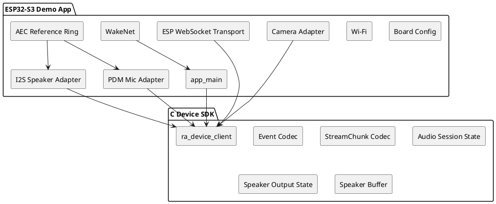
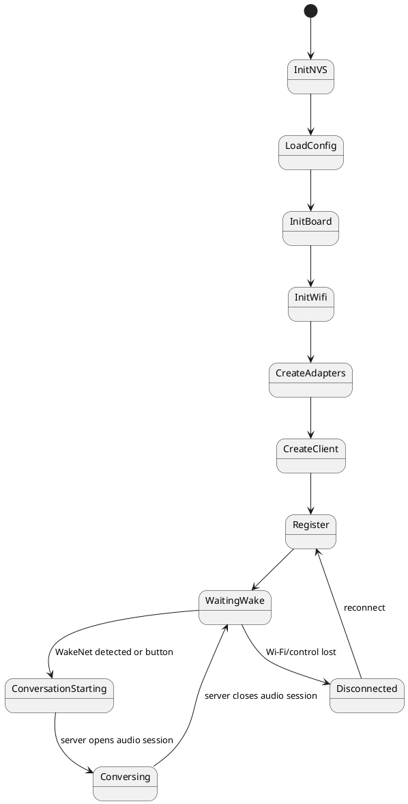
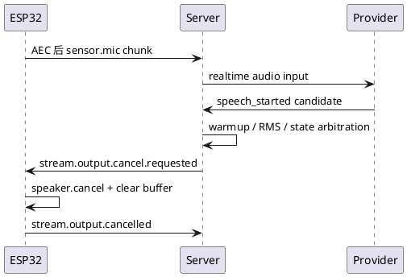

# ESP32-S3 Device Demo 设计草案

本文定义 `examples/device_app_demo/esp32-s3/` 的目标设计。该 demo 是基于 C Device SDK 的 ESP32-S3 端侧参考实现，用于验证 ESP32-S3 真机的麦克风、喇叭、相机、联网、注册、实时对话、回声抑制和打断链路。

## 1. 设计目标

ESP32-S3 demo app 负责板级和硬件相关能力：

- Wi-Fi 连接和本地配置读取。
- `esp_websocket_client` transport adapter。
- PDM/I2S 麦克风 adapter。
- I2S speaker adapter。
- esp32-camera JPEG 单帧 adapter。
- ESP-SR WakeNet 唤醒词。
- ESP-SR AEC 或等价 endpoint AEC。
- 具体板子的 pin map、sdkconfig、partition table 和组件依赖。
- 串口日志和真机诊断输出。

非目标：

- 不重新实现 C SDK 的协议状态机。
- 不在 app main 中手写标准事件 JSON。
- 不在业务代码中实现 speaker seq 重排、水位线、finish/cancel。
- 不把某块板子的 pin map 放入 `devices/c/`。

## 2. 与 C SDK 的边界



App 负责提供 adapter；SDK 负责调用 adapter 并发送标准协议事件。

## 3. 目录结构

目标结构：

```text
examples/device_app_demo/esp32-s3/
  ESP32_S3_DEVICE_DEMO_DESIGN.md
  README.md
  local.env.example
  firmware/
    CMakeLists.txt
    sdkconfig.defaults
    partitions.csv
    main/
      CMakeLists.txt
      idf_component.yml
      app_main.c
      board/
        board_config.h
        board_config.c
        boards/
          esp32_s3_glass_default.h
      adapters/
        ra_esp32_transport.c
        ra_esp32_transport.h
        ra_esp32_mic.c
        ra_esp32_mic.h
        ra_esp32_speaker.c
        ra_esp32_speaker.h
        ra_esp32_camera.c
        ra_esp32_camera.h
        ra_esp32_aec.c
        ra_esp32_aec.h
        ra_esp32_wake_word.c
        ra_esp32_wake_word.h
      diagnostics/
        ra_esp32_diag.c
        ra_esp32_diag.h
```

## 4. 板级配置

ESP32-S3 开发者可能使用不同引脚和传感器，因此 demo 必须把板级配置独立出来。

```c
typedef struct {
    int pdm_clk;
    int pdm_data;
    int sample_rate;
} esp32s3_mic_board_config_t;

typedef struct {
    int bclk;
    int lrck;
    int dout;
    int sample_rate;
    bool stereo_32bit_output;
} esp32s3_speaker_board_config_t;

typedef struct {
    int xclk;
    int sccb_sda;
    int sccb_scl;
    int d0;
    int d1;
    int d2;
    int d3;
    int d4;
    int d5;
    int d6;
    int d7;
    int vsync;
    int href;
    int pclk;
    int pwdn;
    int reset;
} esp32s3_camera_board_config_t;

typedef struct {
    esp32s3_mic_board_config_t mic;
    esp32s3_speaker_board_config_t speaker;
    esp32s3_camera_board_config_t camera;
    bool enable_wakenet;
    bool enable_aec;
} esp32s3_board_config_t;
```

历史 ESP32-S3 眼镜默认引脚可作为一个 board profile：

```text
PDM mic:
  clk = GPIO42
  data = GPIO41

I2S speaker:
  bclk = GPIO7
  lrck = GPIO8
  dout = GPIO9

Camera:
  xclk = GPIO10
  sccb_sda = GPIO40
  sccb_scl = GPIO39
  d7 = GPIO48
  d6 = GPIO11
  d5 = GPIO12
  d4 = GPIO14
  d3 = GPIO16
  d2 = GPIO18
  d1 = GPIO17
  d0 = GPIO15
  vsync = GPIO38
  href = GPIO47
  pclk = GPIO13
```

该 pin map 只属于 demo 的默认板型，不属于通用 C SDK。

## 5. 启动流程



启动步骤：

1. 初始化 NVS。
2. 读取 Wi-Fi、server URL、device id、user id、auth 和 board profile。
3. 初始化板级硬件。
4. 建立 Wi-Fi。
5. 创建 transport、mic、speaker、camera adapter。
6. 创建 `ra_device_client_t`。
7. 调用 SDK 注册。
8. 启动 WakeNet 或等待外部按钮触发。
9. 唤醒后调用 SDK `start_conversation()`。

## 6. 配置来源

本地配置来自 `realtime-agent.config.sync` 生成的 env，或 ESP-IDF Kconfig：

```text
REALTIME_AGENT_SERVER_URL=http://192.168.10.10:8765
REALTIME_AGENT_USER_ID=user-device-demo
REALTIME_AGENT_DEVICE_ID=dev-esp32-s3-001
REALTIME_AGENT_AUTH_MODE=disabled
REALTIME_AGENT_AUTH_TOKEN=
REALTIME_AGENT_AUDIO_SAMPLE_RATE=16000
REALTIME_AGENT_AUDIO_CHANNELS=1
REALTIME_AGENT_AUDIO_CHUNK_MS=20
REALTIME_AGENT_AEC_MODE=endpoint
REALTIME_AGENT_PLAYBACK_REFERENCE=endpoint_ring_buffer
REALTIME_AGENT_BOARD_PROFILE=esp32_s3_glass_default
```

Wi-Fi SSID、密码、token 和本地 IP 不能提交到仓库。

## 7. ESP-IDF 组件和 sdkconfig

组件依赖：

```yaml
dependencies:
  espressif/esp_websocket_client: '*'
  espressif/esp32-camera: '*'
  espressif/esp-sr: '*'
```

基础配置：

- 目标芯片：ESP32-S3。
- Flash：8MB。
- CPU：240MHz。
- PSRAM：启用，优先供 camera frame、speaker buffer、AEC reference ring 使用。
- partition：保留 model partition 给 ESP-SR。
- log：默认 INFO，最大 DEBUG。
- WebSocket：增加 task stack，启用 separate tx lock。

历史实现暴露过 ESP-IDF 5.0 与 `esp_websocket_client` API 兼容问题。新实现应先选定 ESP-IDF 版本，并把兼容补丁写入 `README.md`，不能让构建步骤依赖口头修改。

## 8. Transport Adapter

ESP32-S3 app 用 `esp_websocket_client` 实现 C SDK transport：

| C SDK channel | ESP32-S3 WebSocket URL |
| --- | --- |
| control | `/ws/control` |
| audio input | `/ws/stream/audio/input?device_id=<device_id>` |
| audio output | `/ws/stream/audio/output?device_id=<device_id>` |
| visual input | `/ws/stream/visual/input?device_id=<device_id>` |

实现要求：

- control 和 audio output 必须有 receive task。
- audio input 和 visual input 主要负责发送 binary。
- WebSocket 回调中不能做阻塞硬件操作。
- 大 binary fragment 必须累计完整帧后再交给 `ra_stream_chunk_decode()`。
- control 断开后必须通知 SDK 统一断连收口。

历史固件只有单 `/ws/stream`，新实现必须拆成三条媒体链路。

## 9. Mic Adapter

麦克风使用 PDM RX 或板级指定输入。

目标参数：

```text
codec = pcm16le
sample_rate = 16000
channels = 1
chunk_ms = 20
bytes_per_chunk = 640
```

任务建议：

```text
mic_capture_task:
  I2S/PDM read -> raw mic queue or AEC input

aec_task:
  raw mic + reference ring -> AEC output queue

sdk_mic_read:
  从 AEC output queue 取 20ms PCM
```

如果 AEC 未启用，`sdk_mic_read` 直接返回 PDM mic PCM。

约束：

- audio session 未打开时不上传 `sensor.mic`。
- 唤醒词监听可以常驻读取 mic，但它不等同于协议 mic stream。
- 播放期间默认继续上传 AEC 后 mic，用于 server/provider 判断打断。
- 如临时配置播放期间静音或丢弃 mic，必须在诊断中标记 `full_duplex=false` 或 `mic_policy=mute_during_speaker`。

## 10. Speaker Adapter

speaker 使用 I2S STD TX 或板级指定输出。

历史实现经验：

- speaker 用 I2S1，避免与 PDM mic 的 I2S0 冲突。
- 16-bit mono PCM 可以转换为 32-bit stereo I2S 输出。
- 大 speaker ring buffer 放 PSRAM。
- drain 不能只看瞬时 ring empty，要等待一段 idle 窗口，避免 server 分批发送时过早 finished。

新实现中，speaker adapter 不负责协议状态机，只实现：

```text
prepare(format)
write(pcm)
drain()
cancel()
```

SDK speaker buffer 负责 `stream.output.started/finished/cancelled`，adapter 只返回真实播放状态。

## 11. Camera Adapter

camera 使用 `esp32-camera`。

行为：

1. 收到 SDK 调用 `capture_jpeg()`。
2. 调用 `esp_camera_fb_get()`。
3. 返回 JPEG buffer 指针和长度。
4. SDK 发送 `sensor.rgb` chunk。
5. SDK 调用 `release_jpeg()` 后返回 frame buffer。

约束：

- 只做 server 请求触发的单帧采集。
- 默认 frame size 建议 VGA 或 QVGA，避免占用过多 PSRAM 和 Wi-Fi 带宽。
- 不做连续后台视频。
- 如果 camera 与 mic 资源冲突，优先保证实时音频；RGB 请求返回 `stream.input.failed`，不能假成功。

## 12. WakeNet

WakeNet 属于 ESP32-S3 demo app，不属于 C SDK。

行为：

- 注册成功后保持 WakeNet 监听。
- WakeNet 命中后调用 SDK `ra_device_client_start_conversation(client, "esp32_wakenet")`。
- SDK 发送 `control.user.wake.detected`。
- 真正进入对话仍等待 server 下发 `control.audio_session.open.requested`。

注意：

- WakeNet 监听读取 mic 只用于本地唤醒，不上传给 server。
- 进入 audio session 后，WakeNet 可以暂停或降级，避免和实时 mic/AEC 抢资源。
- 唤醒提示音如果启用，必须写入 AEC reference ring，避免被 mic 当作用户语音。

## 13. AEC 和回声抑制

### 13.1 推荐方案

ESP32-S3 demo 应优先基于 ESP-SR 官方 AEC：

```text
speaker PCM -> playback ring -> I2S write
                         \-> AEC reference ring

PDM mic PCM + AEC reference ring -> esp_aec -> AEC 后 mic PCM -> C SDK mic source
```

核心原则：

- speaker chunk 进入 SDK buffer 后，不代表已经可作为 AEC reference。
- 只有实际写入 I2S speaker 的同一帧 PCM，才写入 AEC reference ring。
- `mic.read()` 返回 AEC 后 PCM。
- 诊断中记录 `aec_reference_bytes`、`aec_output_bytes`、`speaker_bytes_played`。

### 13.2 不推荐作为默认的旧策略

历史固件里有播放期间丢弃 mic 或静音 mic 的策略，能降低自我打断，但会牺牲全双工插话。新实现中只能作为显式配置：

```text
mic_policy = keep_uploading_aec_output        # 默认
mic_policy = mute_during_speaker_playback     # 诊断或半双工产品模式
mic_policy = drop_during_speaker_playback     # 不推荐，仅临时排障
```

如果使用后两者，注册 properties 应明确：

```json
{
  "audio.full_duplex": false,
  "audio.mic_policy": "mute_during_speaker_playback"
}
```

## 14. 打断策略

当前推荐链路：



ESP32-S3 demo 不默认本地触发 output cancel。原因：

- server/provider 才能看到完整对话状态。
- 当前 Swift SDK 也采用 server barge-in。
- 端侧本地 VAD 容易把 speaker leakage、唤醒提示音或短噪声当成用户打断。

允许保留本地诊断：

- 播放期间检测到本地语音候选。
- 记录 `started_during_playback=true`。
- 记录能量、持续时间、播放 stream id。
- 不直接发送标准 cancel，除非后续产品明确启用本地打断模式。

## 15. 注册属性

ESP32-S3 demo 注册 payload 应由 C SDK 生成，board/app 只提供属性补充：

```json
{
  "client_type": "esp32-s3",
  "runtime": {
    "platform": "esp32s3",
    "language": "c",
    "framework": "esp-idf"
  },
  "properties": {
    "realtime_agent.audio_input": "sensor.mic",
    "realtime_agent.audio_output": "actuator.speaker",
    "audio.aec": "endpoint",
    "audio.playback_reference": "endpoint_ring_buffer",
    "audio.wake_word": "endpoint"
  },
  "supports": {
    "sensors": [
      {
        "type": "rgb",
        "modes": ["single"],
        "default": {
          "format": "jpeg",
          "sample_count": 1
        }
      }
    ]
  }
}
```

不允许生成旧 `routes` 或旧 `capabilities`。

## 16. 真机日志观察点

串口日志至少包含：

```text
wifi.connected ip=<ip>
control.connected
device.registered connection_id=<id>
wakenet.detected
audio_session.open.requested session=<id>
audio_session.opened mic_stream=<id>
mic.chunk sent seq=<n> bytes=640
speaker.output.start stream=<id>
speaker.ready stream=<id>
speaker.chunk received seq=<n> bytes=<n>
speaker.started stream=<id>
speaker.finish.requested expected_last_seq=<n>
speaker.finished stream=<id>
audio_session.close.requested
audio_session.closed
```

AEC 诊断至少包含：

```text
speaker_chunks_received=<n>
speaker_bytes_received=<n>
speaker_bytes_played=<n>
playback_ring_bytes=<n>
aec_reference_bytes=<n>
aec_output_bytes=<n>
mic_chunks_sent=<n>
mic_policy=<policy>
```

## 17. 测试和验收

### 17.1 无硬件测试

在 `examples/device_app_demo/app-tests/endpoints/` 中补 ESP32-S3 contract：

- 注册 payload 包含 `esp32-s3`、`audio.aec=endpoint`、结构化 `supports.sensors.rgb`。
- wake 前不上传 mic。
- audio session open 后才上传 mic。
- speaker chunk 同步进入 playback/reference 诊断模型。
- RGB 请求返回 JPEG 并通过 visual input stream 发送。
- config env round-trip。

### 17.2 固件静态检查

检查：

- `firmware/CMakeLists.txt`。
- `main/CMakeLists.txt`。
- `main/idf_component.yml`。
- `sdkconfig.defaults`。
- `partitions.csv`。
- 默认 board profile。
- 依赖包含 websocket、json、esp32-camera、esp-sr。

### 17.3 真机 smoke

真机验收必须同时提供：

- server 启动命令。
- `curl /api/health` 结果。
- `idf.py build` 结果。
- `idf.py flash monitor` 串口日志。
- server runs 目录。
- control events、stream events、output decisions 对照。

不能把 contract test 通过写成真机通过。

## 18. 与历史 ESP32-S3 代码的迁移关系

可复用：

- `229ec06` 中的 PDM mic、I2S speaker、camera pin、WakeNet、PSRAM ring buffer、WebSocket task 配置。
- `866ffc8` 中的 ESP32-S3 contract test 思路。
- `2d9e35d` 中 `test_official_aec.c` 的官方 AEC、playback ring、reference ring、mic send queue 思路。

必须重写：

- 单 `/ws/stream` 改成三条媒体 WebSocket。
- `audio-chat.v1` 改成 `realtime-agent.v1`。
- `stream.output.open/close.requested` 改成 `start/finish/cancel.requested`。
- mic `stream.input.opened/closed` 不再用于系统麦克风主链路。
- 旧 App 直接拼标准事件 JSON 的逻辑改为调用 C SDK。

## 19. 初始落地顺序

1. 实现 `devices/c` 的 Event、StreamChunk、speaker buffer 和 mock adapter 测试。
2. 实现 ESP32-S3 transport adapter 和 board config。
3. 实现 register + heartbeat 真机 smoke。
4. 接入 mic 上行。
5. 接入 speaker 下行和 drain。
6. 接入 camera 单帧。
7. 接入 WakeNet。
8. 接入官方 AEC。
9. 做播放期间打断验收。

