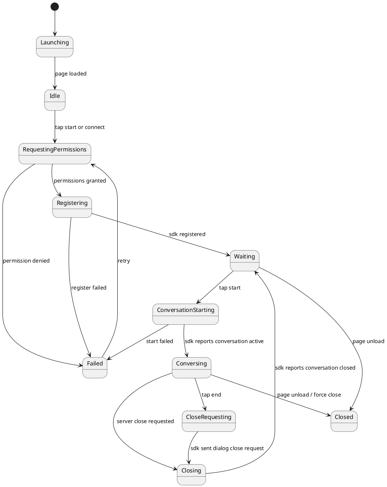

# Web Chat Device Demo App 设计草案

本文定义 `examples/device_app_demo/web-chat/` 的 Web App 目标设计。该 App 是 JavaScript Device SDK 的浏览器端最小验证入口，负责页面、交互、状态展示和业务自定义事件示例；不重复实现 JavaScript SDK 已负责的注册、录音、播放、媒体 WebSocket、speaker buffer、回声抑制或协议状态机。

## 1. 设计目标

Web Chat 的目标是提供一个足够简单、可复现、便于排障的浏览器页面：

- 页面启动后创建 JavaScript Device SDK client。
- 用户点击主按钮后，在浏览器用户手势内申请麦克风、相机和 AudioContext 权限。
- 权限成功后由 SDK 注册设备并绑定硬件能力。
- 注册成功后进入“等待通话”状态。
- 点击开始通话后，由 SDK 准备麦克风、相机、speaker 和 stream，并请求 server 开始对话。
- 对话页展示摄像头预览、对话状态、音频状态和结束按钮。
- 调试入口展示 SDK diagnostics、浏览器音频设置、最近日志和可复制排障信息。
- App 主动结束通话时，只通过 SDK 请求 server 关闭；最终仍由 server 下发关闭事件，SDK 完成资源清理。

非目标：

- 不在 App 中手写 control WebSocket 或 stream WebSocket。
- 不在 App 中手写 `StreamChunk` 编解码。
- 不在 App 中实现 speaker 水位线、乱序重排、finish/drain/cancel。
- 不在 App 中实现浏览器回声抑制、PCM 转换、VAD 或打断判定。
- 不在 App 中直接处理标准 `stream.output.*`、`stream.control.*`、`control.audio_session.*` 状态机。
- 不搬运 `browser-glass` 的开发支持功能，例如手动 wake、离线音频注入、peer video sender、haptic 模拟面板。

## 2. App 和 SDK 边界

| 能力 | Web Chat App | JavaScript Device SDK |
| --- | --- | --- |
| 页面布局 | 负责 | 不负责 |
| 主按钮是否可点 | 根据 SDK 状态展示 | 提供连接和对话状态 |
| Server URL 表单 | 负责输入、保存、展示 | 使用传入 URL |
| 权限触发时机 | 在用户手势内调用 SDK | 执行 `getUserMedia` 和 AudioContext 初始化 |
| 设备注册 | 调用 SDK | 生成 payload、连接 control、心跳 |
| 开始通话 | 调用 `client.startConversation()` | 准备硬件、发送 wake、等待 server open |
| 结束通话 | 调用 `client.requestConversationClose()` | 发送端侧关闭请求，等待 server close，清理资源 |
| 麦克风采集 | 不实现 | WebRTC AEC 约束、PCM 转换、音频上行 |
| speaker 播放 | 不实现 | Web Audio sink、playback buffer、状态回执 |
| camera preview | 负责展示 `<video>` | 可复用同一 frame source 上传单帧 |
| RGB 单帧上传 | 不手写 chunk | 响应 server 请求 |
| custom command 行为 | 负责业务动作 | 提供 `onCustomCommand` 上下文 |
| 标准事件 | 不直接消费 | SDK 内部消费 |
| 调试信息 | 展示和复制 | 提供 diagnostics 和 debug log |

## 3. 页面结构

页面保持最小 App 形态，而不是开发工具面板。

```text
WebChatDeviceDemo
  AppShell
    StartConversationView # URL 设置 + 中央开始按钮
    ConversationView      # camera preview + 音频状态 + 结束按钮
    ErrorView             # 权限拒绝、注册失败、连接失败
    DebugPanel            # SDK diagnostics、浏览器音频设置、日志
```

页面整体保持两屏：

1. 启动/等待页：中央主按钮，文案为 `开始\n音视频对话`；右上角是调试按钮；底部或调试面板中提供 server URL 设置。
2. 对话页：上方或中央显示摄像头预览；下方显示音频状态条和结束按钮；右上角保留调试按钮。

主页面不展示协议事件表、手动控制按钮或 stream 细节。详细状态放入调试面板。

## 4. App 状态机



App 状态只表达 UI。真实协议状态由 SDK 维护，App 不根据标准事件自行改协议状态。

## 5. 启动流程

Web Chat 不建议页面加载后立即弹权限。浏览器权限、AudioContext resume 和 autoplay 通常需要用户手势，因此推荐在主按钮点击后执行 bootstrap：

1. 页面读取 `localStorage` 中的 server URL、device ID 和 user ID。
2. 创建 `WebChatRuntime`。
3. 用户点击主按钮。
4. Runtime 创建 JavaScript SDK `DeviceClient`，声明硬件能力：
   - `audioInput: AudioInput.enabled()`
   - `speaker: Speaker.enabled({buffer: PlaybackBuffer.default(), duplexMode: "full_duplex_server_barge_in"})`
   - `camera: Camera.enabled({previewVideoElement})`
5. 注册 `onCustomCommand` 和 `onEvent("custom.*")` 示例 handler。
6. 调用 `client.requestPermissions()`。
7. 权限成功后调用 `client.register()`。
8. 注册成功后进入 `Waiting`。
9. 如果用户第一次点击就是“开始对话”，注册成功后继续调用 `client.startConversation()`。

目标伪代码：

```js
class WebChatRuntime {
  constructor() {
    this.phase = "idle";
    this.client = null;
    this.logs = [];
  }

  async bootstrap() {
    this.phase = "requestingPermissions";
    const client = this.makeClient();
    this.bindSDKCallbacks(client);
    this.client = client;

    const permissions = await client.requestPermissions();
    if (!permissions.isAuthorized) {
      throw new Error(`硬件权限未授权: ${JSON.stringify(permissions)}`);
    }

    this.phase = "registering";
    await client.register();
    this.phase = "waiting";
  }
}
```

## 6. 主按钮行为

主按钮承担准备、开始和重试三类动作：

| App 状态 | 主按钮文案 | 行为 |
| --- | --- | --- |
| `idle` | `开始\n音视频对话` | 申请权限、注册、开始对话 |
| `requestingPermissions` | `授权中` | 不可点击 |
| `registering` | `注册中` | 不可点击 |
| `waiting` | `开始\n音视频对话` | 调用 `startConversation()` |
| `conversationStarting` | `连接中` | 不可点击 |
| `failed(permission)` | `授权失败\n重试` | 重新申请权限 |
| `failed(registration)` | `注册失败\n重试` | 重新注册 |
| `failed(disconnected)` | `连接断开\n重连` | 重新创建 client 并注册 |

浏览器必须在用户手势内初始化 AudioContext。主按钮点击处理里应优先调用 SDK 提供的 `requestPermissions()` 或 `prepareBrowserAudio()`，不要在页面加载时偷偷创建播放上下文。

## 7. 开始通话流程

点击开始后：

1. App 状态改为 `conversationStarting`。
2. App 调用 `client.startConversation({reason: "web_chat_start_button"})`。
3. SDK 准备浏览器硬件资源：
   - 确认麦克风和相机权限。
   - 准备浏览器 AudioContext。
   - 用 WebRTC 约束打开麦克风并启用 AEC。
   - 准备 Web Audio speaker sink。
   - 建立或复用媒体 WebSocket。
   - 发送 `control.user.wake.detected`。
4. server 下发 `control.audio_session.open.requested`。
5. SDK 完成 audio session open，并开始 mic/speaker/rgb 链路。
6. SDK 通过状态回调告知 App 当前 conversation active。
7. App 切换到对话页。

App 不直接发送 `control.user.wake.detected`，也不直接建立 WebSocket。

## 8. 对话页

对话页展示三类信息：视觉、音频、操作。

### 8.1 视觉区

视觉区展示浏览器摄像头预览，用于让用户确认当前画面。

要求：

- 预览是 App UI 行为。
- SDK 响应 server 的 `sensor.rgb` 单帧请求时，可以从同一个 video/canvas frame source 获取最新帧。
- App 不手写 `sensor.rgb` chunk。
- 如果相机未授权或未启动，显示短错误和重试入口。
- 当前阶段不做后台连续视频上传。

### 8.2 音频状态区

音频状态来自 SDK status snapshot，不来自 App 解析标准协议事件。

建议状态：

- `等待用户说话`
- `正在听`
- `助手回复中`
- `正在结束`
- `连接异常`

音频状态区可以展示轻量波形动画，但该动画只表达活跃状态，不代表真实采样波形。真实 mic RMS、speaker underrun 和 AEC 设置放入调试面板。

### 8.3 操作区

至少包含：

- 结束对话按钮。
- 调试按钮。

结束按钮行为：

```js
async function endTapped() {
  runtime.phase = "closing";
  await runtime.client.requestConversationClose({reason: "user_tapped_end"});
}
```

App 不直接关闭 WebSocket，不直接停止麦克风，也不伪造 `control.audio_session.closed`。SDK 收到 server close 后负责收口。

## 9. 回声抑制设计边界

回声抑制是 Web Chat 端侧实现的最大难点，但它属于 JavaScript Device SDK 的默认 browser audio adapter，不属于 App 页面逻辑。

Web Chat App 只做：

1. 在用户手势中调用 SDK 权限和音频准备 API。
2. 展示 SDK diagnostics 中的 AEC 状态。
3. 在调试面板中展示浏览器 `track.getSettings()`。
4. 根据 SDK 的连接和对话状态切换 UI。

JavaScript SDK 负责：

1. 用 `getUserMedia` 请求浏览器 WebRTC AEC：

```js
navigator.mediaDevices.getUserMedia({
  audio: {
    echoCancellation: true,
    noiseSuppression: true,
    autoGainControl: true,
  },
});
```

2. 记录实际 settings：

```js
const track = stream.getAudioTracks()[0];
const settings = track.getSettings();
```

3. 把 Float32 输入转换为 `pcm16le / 16000Hz / mono / 20ms`。
4. speaker 播放期间继续上传麦克风，支持 server/provider 判定用户插话。
5. 收到 `stream.output.cancel.requested` 后立即停止 speaker 播放并清空 buffer。
6. 暴露 mic RMS、speaker playback state、underrun、track settings 等诊断信息。

不在第一版 App 中做：

- 页面级静音补丁。
- 根据音量阈值自行决定打断。
- 播放期间直接停止麦克风上传。
- 为了避免自打断而牺牲全双工对话语义。

如果后续真机浏览器验证发现 WebRTC AEC 不足，可以在 SDK 中增加配置化诊断策略，例如 speaker 起播 warmup mute、外放回采风险日志、RMS 相关性诊断；这些策略必须写在 SDK adapter 中，并通过配置显式打开，不放到 Web Chat 页面里。

## 10. 调试面板

调试面板用于排障，不作为主要交互页面。

建议展示：

- server URL、device ID、user ID。
- connection state、conversation state。
- SDK diagnostics：control state、stream state、事件计数、chunk 计数。
- browser audio：AudioContext state、sample rate、mic track settings。
- mic：format、chunk_ms、seq、bytes sent、RMS 摘要。
- speaker：当前 stream、buffered_ms、queued chunks、underrun、last seq、drain 状态。
- camera：permission、preview state、最近一次 frame size。
- 最近 200 条 debug log。
- 复制诊断信息按钮。
- 清空日志按钮。

调试面板可以允许修改 server URL，但主页面不要展示复杂协议控制按钮。

## 11. 断连和重连

SDK 发布 `disconnected(reason)` 后，Web Chat App 应：

1. 停止展示对话页。
2. 停止或隐藏 camera preview。
3. 主按钮显示 `连接断开\n重连`。
4. 保留最近 diagnostics 和日志。
5. 用户点击重连后，重新创建 SDK client 或调用 SDK 的重新注册入口。

App 不手动清理 mic、speaker、stream 或旧 session；这些必须由 SDK 完成，避免和 SDK 状态机重复执行。

页面 unload 时调用：

```js
window.addEventListener("beforeunload", () => {
  runtime.client?.close({force: true});
});
```

如果浏览器不保证异步 close 完成，SDK 仍应尽量本地释放资源；server 侧最终通过 control WebSocket 断开和 heartbeat 超时收口。

## 12. 与 browser-glass 的关系

`browser-glass` 是开发支持组件，功能更宽，包括手动事件、离线音频、图片/视频样例、peer video sender 和 haptic 模拟。Web Chat 是正式 Device SDK demo，功能应更窄。

可以借鉴：

- 浏览器 `getUserMedia` AEC 约束。
- 实时麦克风转 PCM16 的处理方法。
- 记录 mic settings 供排查。
- Web Audio 播 PCM16 的思路。
- 浏览器摄像头 canvas 抓 JPEG 的方式。

不能直接搬入：

- 旧 `/ws/stream?device_id=...` 单 stream 入口。
- 手写注册和标准事件处理。
- 手动 wake / interrupt / close 控制面板。
- 离线音频注入和样例目录选择。
- peer video sender。
- haptic 模拟器。

Web Chat 的目标是证明 App 只调用 JavaScript SDK 高层 API，也能完成基础音视频对话。

## 13. 契约测试

建议补 `examples/device_app_demo/app-tests/test_web_chat_device_demo_contract.py`，静态验证 App 没有绕开 SDK。

测试目标：

- Web Chat 引用 `devices/javascript` 本仓库 SDK。
- Web Chat 通过 `DeviceClient` 启用 `AudioInput.enabled()`、`Camera.enabled()`、`Speaker.enabled()`。
- Web Chat 调用 `client.requestPermissions()`、`client.register()`、`client.startConversation()`、`client.requestConversationClose()`。
- Web Chat 注册 `onDebugLog`、`onConnectionStateChange`、`onConversationStateChange`。
- Web Chat 不包含 `new WebSocket("/ws/control")`、`/ws/stream/audio/input`、`/ws/stream/audio/output`、`/ws/stream/visual/input`。
- Web Chat 不直接发送 `control.user.wake.detected`。
- Web Chat 不直接实现 `encodeStreamChunk` / `decodeStreamChunk`。
- Web Chat 不直接调用 `getUserMedia` 做麦克风 AEC；该逻辑应在 SDK browser adapter 中。

SDK 自身再通过 `devices/javascript` 的单元测试覆盖协议和媒体状态机。

## 14. 本地联调流程

启动 device app demo server：

```bash
uv run realtime-agent.server.run --config examples/device_app_demo/agent-server/server.yaml
```

启动 Web Chat 本地页面：

```bash
cd examples/device_app_demo/web-chat
npm install
npm run dev
```

浏览器打开页面后：

1. 设置 server URL，例如 `http://192.168.10.10:8765`。
2. 点击 `开始音视频对话`。
3. 授权麦克风和相机。
4. 观察进入对话页后是否有摄像头预览。
5. 说话后检查 server runs、Web Chat 调试面板和 speaker 播放状态。
6. 如果出现自打断，优先查看调试面板中的 `track.getSettings()`、mic RMS、speaker playback state、server `output_cancel_requested` 和 provider speech_started 事件。

不要把“浏览器页面打开成功”写成“音视频链路已验证”。基础验收必须至少覆盖注册、麦克风上行、speaker 下行、相机单帧请求和结束对话。
