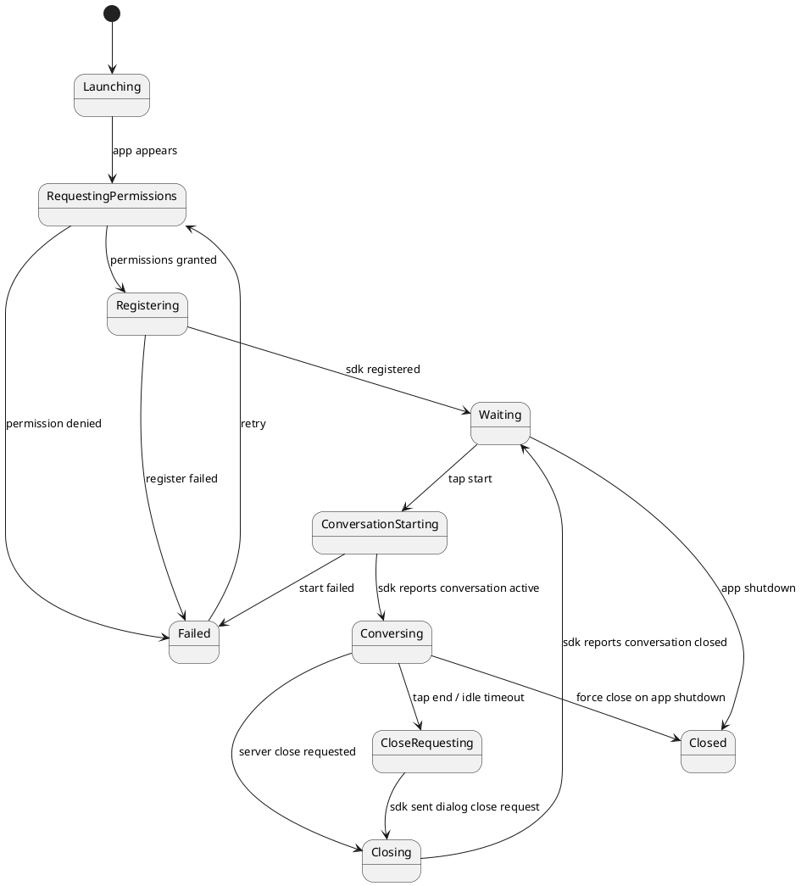
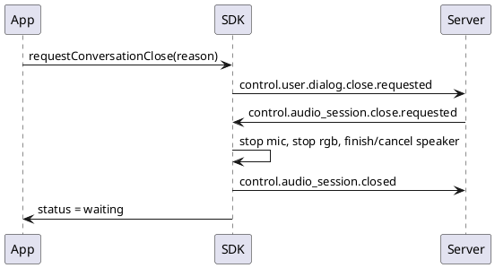

# Device Demo iOS App 设计草案

本文定义 `examples/device_demo/ios/` 的 iOS App 目标设计。该 App 是 Swift Device SDK 的最小真机验证入口，负责页面、交互、状态展示和业务自定义事件示例；不重复实现 Swift SDK 已负责的注册、录音、播放、媒体 WebSocket、speaker buffer、AEC 或协议状态机。

## 1. 设计目标

iOS App 的目标是提供一个足够简单、可复现、便于排障的真机页面：

- App 启动后自动调用 Swift SDK 申请硬件权限、注册设备并绑定硬件能力。
- 注册成功且权限授权成功后进入“等待通话”状态。
- “开始通话”按钮在未就绪时置灰，准备好后可点击。
- 点击开始通话后，由 Swift SDK 准备硬件资源并请求 server 开始对话。
- 对话页展示相机预览、对话状态、音频播放/录音状态和结束按钮。
- 调试入口展示 SDK diagnostics、最近事件、日志和可复制排障信息。
- App 主动结束通话时，只通过 SDK 请求 server 关闭；最终仍由 server 下发关闭事件，SDK 完成资源清理。

非目标：

- 不在 App 中手写 control WebSocket 或 stream WebSocket。
- 不在 App 中手写 `StreamChunk` 编解码。
- 不在 App 中实现 speaker 水位线、ring buffer、finish/drain/cancel。
- 不在 App 中实现 AEC、VAD、打断判定。
- 不在 App 中直接处理标准 `stream.output.*`、`control.audio_session.*` 状态机。

## 2. App 和 SDK 边界

| 能力 | iOS App | Swift SDK |
| --- | --- | --- |
| 页面布局 | 负责 | 不负责 |
| 按钮是否可点 | 根据 SDK 状态展示 | 提供状态 |
| 权限弹窗触发时机 | 启动后调用 SDK | 具体申请权限并返回状态 |
| 设备注册 | 调用 SDK | 生成 payload、连接 control、心跳 |
| 开始通话 | 调用 SDK `startConversation()` | 准备硬件、发送 wake、等待 server open |
| 结束通话 | 调用 SDK `requestConversationClose()` | 发送端侧关闭请求，等待 server close，清理资源 |
| 麦克风采集 | 不实现 | Voice Processing、PCM 转换、音频上行 |
| speaker 播放 | 不实现 | start/ready/started/finish/finished/cancel 状态机 |
| camera preview | App 展示预览 | SDK 需要可复用 frame source 上传单帧 |
| RGB 单帧上传 | 不手写 chunk | SDK 响应 server 请求 |
| custom command 行为 | 负责业务动作 | 提供 `onCustomCommand` 上下文 |
| 标准事件 | 不直接消费 | SDK 内部消费 |
| 调试信息 | 展示和复制 | 提供 diagnostics 和 debug log |

## 3. 页面结构

页面保持简单，参考旧 `ios-backup` 的最小交互，但不复用旧 runtime 边界。

```text
DeviceDemoApp
  ContentView
    StartConversationView # 注册/授权/等待页，中央圆形开始按钮
    ConversationView      # 对话中，相机预览 + 底部音频状态条
    ErrorView             # 权限拒绝、注册失败、连接失败
    DebugSheet            # SDK diagnostics、日志、复制信息
```

页面整体按草图保持两屏：

1. 启动/等待页：大面积留白，中央一个圆形按钮，文案为 `开始\n音视频对话`；右上角是圆形 `i` 调试按钮。
2. 对话页：右上角继续保留圆形 `i` 调试按钮；页面上半部分是竖向相机视频回显窗口；底部是音频状态条，左右为波形，中间文案为 `对话中`。

建议主屏右上角始终保留调试按钮，点击后打开调试信息和日志面板。这个按钮是 App UI，不属于 SDK。

## 4. App 状态机



App 状态只表达 UI。真实协议状态由 SDK 维护，App 不根据标准事件自行改协议状态。

## 5. 启动流程

App 启动后自动执行：

1. 创建 `DeviceDemoViewModel`。
2. ViewModel 创建 Swift SDK `DeviceClient`，声明硬件能力：
   - `audioInput: .enabled()`
   - `speaker: .enabled(buffer: .default, duplexMode: .fullDuplexServerBargeIn)`
   - `camera: .enabled(source: previewFrameSource)`
3. 注册 `onCustomCommand` 和 `onEvent("custom.*")` 示例 handler。
4. 调用 `client.requestPermissions()`。
5. 权限成功后调用 `client.register()`。
6. 注册成功后进入 `Waiting`。

目标伪代码：

```swift
@MainActor
final class DeviceDemoViewModel: ObservableObject {
    @Published private(set) var appState: DeviceDemoAppState = .launching
    @Published private(set) var sdkStatus: DeviceSDKStatusSnapshot = .empty
    @Published private(set) var logs: [DeviceDemoLogLine] = []

    private var client: DeviceClient?

    func bootstrap() async {
        appState = .requestingPermissions
        do {
            let client = try makeClient()
            bindSDKCallbacks(client)
            self.client = client

            let permissions = try await client.requestPermissions()
            record("permissions granted \(permissions)")

            appState = .registering
            try await client.register()
            appState = .waiting
        } catch {
            appState = .failed(message: error.localizedDescription)
        }
    }
}
```

## 6. 启动/等待页

启动/等待页用于表达“设备正在准备”或“设备已准备好，可以开始通话”。

显示内容：

- 中央圆形主按钮，固定在屏幕视觉中心附近。
- 主按钮文案：`开始\n音视频对话`。
- 未就绪时按钮置灰，点击无效。
- 准备中时按钮文案可以显示 `注册中`、`授权中` 或 `连接中`。
- 右上角圆形 `i` 调试按钮，点击打开调试信息/日志。
- 页面不默认展示复杂说明文字，详细状态放入调试面板。

按钮状态：

| 条件 | 按钮状态 |
| --- | --- |
| 权限未完成 | 灰色，不可点 |
| 注册中 | 灰色，不可点，显示 `注册中` |
| 注册失败 | 灰色，显示错误和重试 |
| 注册成功 | 亮色，可点 |
| 开始通话中 | 不可重复点击，显示 `连接中` |

按钮置灰和亮色是 App UI 行为，不属于 SDK 责任。

布局约束：

- 主按钮建议使用正圆形，直径约为屏幕宽度的 `38% - 45%`，最小不低于 `160pt`。
- 圆形按钮只承载开始动作，不展示注册细节。
- 失败时可以在按钮下方显示一行短错误和重试入口，但不要破坏主结构。
- 调试按钮固定在安全区右上角，尺寸建议 `44pt - 52pt`。

## 7. 开始通话流程

点击 `开始通话` 后：

1. App 状态改为 `conversationStarting`。
2. App 调用 `client.startConversation(reason: "device_demo_start_button")`。
3. SDK 准备硬件资源：
   - 确认权限。
   - 准备 AVAudioSession / mic / speaker runtime。
   - 建立或复用媒体连接。
   - 发送 `control.user.wake.detected`。
4. server 下发 `control.audio_session.open.requested`。
5. SDK 完成音频会话 open 并开始 mic/speaker/rgb 链路。
6. SDK 通过状态回调告知 App 当前 conversation active。
7. App 切换到对话页。

App 不直接发送 `control.user.wake.detected`，也不直接建立 WebSocket。

目标 API：

```swift
func startTapped() {
    Task {
        appState = .conversationStarting
        do {
            try await client.startConversation(reason: "device_demo_start_button")
        } catch {
            appState = .failed(message: error.localizedDescription)
        }
    }
}
```

## 8. 对话页

对话页展示三类信息：视觉、音频、操作。

### 8.1 视觉区

展示连续相机预览，用于让用户知道当前摄像头画面。视觉区按草图使用居中的竖向矩形窗口。

注意：

- 预览是 App UI 行为。
- SDK 响应 server 的 `sensor.rgb` 单帧请求时，可以从同一个 `CameraPreviewFrameSource` 获取最新帧。
- App 不手写 `sensor.rgb` chunk。
- 如果相机未启动，显示 `正在启动相机` 或错误提示。

布局约束：

- 相机窗口居中，保持竖向比例，建议 `aspectRatio = 0.72` 左右。
- 宽度建议为屏幕宽度的 `68% - 76%`，高度随比例计算。
- 窗口使用简单边框或轻量背景，不做复杂卡片嵌套。
- 相机窗口内的占位文案为 `摄像头视频回显窗口` 或运行时预览画面。
- 右上角调试按钮不能遮挡相机窗口。

### 8.2 音频状态区

展示简洁状态：

- `等待用户说话`
- `正在听`
- `助手回复中`
- `正在结束`
- `连接异常`

这些状态来自 SDK status snapshot，不来自 App 自己解析标准协议。

音频状态区按草图放在相机窗口下方，使用一个横向状态条：

```text
波形  |  对话中  |  波形
```

要求：

- 状态条居中，宽度建议为相机窗口宽度的 `90% - 110%`。
- 左右波形可以是 App UI 动画，只表达当前对话活跃状态，不代表真实音频采样。
- 中间文案根据 SDK 状态变化，例如 `对话中`、`正在听`、`助手回复中`、`正在结束`。
- 文案必须保持短，不在主页面展示协议细节。

### 8.3 操作区

至少包含：

- 对话中的结束动作入口。
- 调试按钮。

结束按钮行为：

```swift
func endTapped() {
    Task {
        appState = .closeRequesting
        try await client.requestConversationClose(reason: "user_tapped_end")
    }
}
```

App 不直接关闭 mic、speaker 或 WebSocket。SDK 发送 `control.user.dialog.close.requested`，server 接受后下发 `control.audio_session.close.requested`，SDK 再关闭资源并通知 App 回到等待页。

结束入口可以有两种形态，第一版建议先放在调试面板里，避免主页面变复杂；如果需要主页面入口，可在底部状态条下方放一个轻量 `结束通话` 按钮。无论入口在哪里，动作都必须调用 SDK，不直接清理音频资源。

## 9. 主动结束和空闲结束

### 9.1 用户主动结束



### 9.2 长时间无交互

长时间无交互优先由 server 判断并下发 close。App 可以展示倒计时或状态，但不自行推断协议关闭。

如果产品希望 App 侧也触发空闲结束，App 只能调用：

```swift
try await client.requestConversationClose(reason: "app_idle_timeout")
```

后续仍按 server close 链路收口。

### 9.3 App 退出或进入后台

第一版策略：

- App 进入后台：调用 `client.requestConversationClose(reason: "app_background")`。
- 如果系统即将终止，调用 `client.close(force: true)` 做本地保护性释放。
- force close 必须记录日志，因为它可能绕过 server 正常 close ack。

## 10. 调试面板

调试面板是这个 demo 的重要组成，必须保留。

内容：

- Server URL。
- App 状态。
- SDK 注册状态。
- 权限状态。
- Control channel 状态。
- Audio input channel 状态。
- Audio output channel 状态。
- Visual input channel 状态。
- 当前 audio session id。
- 当前 output stream id。
- speaker buffered ms。
- renderer buffered frames。
- 最近一次错误。
- 日志文件路径。

操作：

- 复制摘要。
- 复制完整日志。
- 清空日志。
- 重新注册。
- 请求结束通话。

调试面板不能成为业务状态源，只能读取 ViewModel 和 SDK diagnostics。

## 11. 日志设计

App 日志只记录 UI 和 SDK 回调摘要：

```text
app bootstrap started
permissions granted microphone=true camera=true
sdk registered device_id=...
start conversation tapped
sdk conversation starting
sdk conversation active session=...
end conversation tapped
close requested reason=user_tapped_end
sdk conversation closed
```

SDK debug log 原样进入 App 日志，但加 `sdk` 前缀。

App 不在日志里重复打印每个音频 chunk 的完整细节；高频音频诊断由 SDK 聚合后输出摘要。

## 12. ViewModel 设计

建议 ViewModel 类型：

```swift
@MainActor
final class DeviceDemoViewModel: ObservableObject {
    @Published private(set) var appState: DeviceDemoAppState
    @Published private(set) var permissionStatus: HardwarePermissionStatus
    @Published private(set) var sdkStatus: DeviceSDKStatusSnapshot
    @Published private(set) var audioDiagnostics: AudioInteractionDiagnostics
    @Published private(set) var logs: [DeviceDemoLogLine]
    @Published var serverURL: String

    func bootstrap() async
    func startConversation() async
    func requestClose(reason: String) async
    func retryRegistration() async
    func copyDebugSummary()
    func clearLogs()
}
```

`DeviceDemoViewModel` 不应暴露 SDK 内部对象给 View。View 只读 ViewModel 的发布状态并调用动作方法。

## 13. Camera Preview 设计

App 可以维护一个 `CameraPreviewController` 用于 UI 预览，同时实现 SDK 需要的 frame source 协议：

```swift
final class CameraPreviewFrameSource: NSObject, ObservableObject, RealtimeAgentCameraFrameSource {
    @Published private(set) var isRunning: Bool = false
    let previewLayerProvider: CameraPreviewLayerProvider

    func startPreview() async throws
    func stopPreview()
    func captureJPEG() async throws -> Data
}
```

边界：

- `startPreview()` 是 App 为 UI 启动预览。
- `captureJPEG()` 是 SDK 在收到 server 单帧请求时调用。
- App 不知道 `stream.control.open.requested`，只提供 frame source。

## 14. 自定义事件示例

Demo App 可以注册少量示例事件，用于证明 SDK 语法糖可用：

```swift
client.onCustomCommand("demo.ping") { context in
    try await context.emit("custom.demo.pong", ["ok": true])
}

client.onEvent("custom.demo.message") { event in
    viewModel.recordCustomMessage(event.payload)
}
```

不要在 Device Demo 里加入 for-blind 业务逻辑、导航业务、复杂任务编排或固定设备 ID 路由。

## 15. 错误处理

错误分层展示：

| 错误 | App 行为 |
| --- | --- |
| 麦克风权限拒绝 | 显示权限说明和重试入口 |
| 相机权限拒绝 | 显示权限说明；如果音频仍可用，可允许仅音频模式，第一版可先失败 |
| 注册失败 | 显示 server URL、错误信息、重试按钮 |
| 开始通话失败 | 回到等待页或失败页，保留日志 |
| 对话中断线 | 展示重连中；具体重连由 SDK 执行 |
| server close | 回到等待页 |

App 不通过错误处理绕过 SDK 协议状态机。

## 16. 文件和目录建议

```text
examples/device_demo/ios/
  IOS_DEVICE_DEMO_APP_DESIGN.md
  DeviceDemo.xcodeproj/
  DeviceDemo/
    DeviceDemoApp.swift
    ContentView.swift
    DeviceDemoViewModel.swift
    DeviceDemoAppState.swift
    CameraPreviewFrameSource.swift
    Views/
      LaunchStatusView.swift
      WaitingView.swift
      ConversationView.swift
      DebugSheet.swift
      ErrorView.swift
```

## 17. 与 Swift SDK 的交互清单

App 只应调用这些 SDK 能力：

- `DeviceClient(...)`
- `client.requestPermissions()`
- `client.register()`
- `client.startConversation(reason:)`
- `client.requestConversationClose(reason:)`
- `client.close(force:)`
- `client.onCustomCommand(...)`
- `client.onEvent("custom.*", ...)`
- `client.onDebugLog(...)`
- `client.diagnosticsSnapshot()`

App 不应调用或实现：

- `sendEvent("control.audio_session.opened")`
- `sendEvent("stream.output.*")`
- `sendStreamChunk(...)`
- speaker buffer append/drain/cancel
- AVAudioEngine speaker renderer
- mic PCM chunk 编码
- VAD 打断判断

## 18. 验收标准

App 设计完成后的验收点：

1. App 启动后自动申请权限并注册设备。
2. 权限和注册都成功后，“开始通话”可点击。
3. 点击开始通话后，App 只调用 SDK，不手写 wake/control/stream 细节。
4. 对话页能展示相机预览和音频状态。
5. server 请求 RGB 时，SDK 可通过 App 提供的 frame source 获取单帧。
6. speaker 播放完全由 SDK 处理，App 不含播放 buffer 或 renderer 逻辑。
7. 点击结束通话后，SDK 发送端侧结束请求，server 下发 close 后 App 回到等待页。
8. 调试面板能复制 SDK diagnostics 和 App 日志。
9. 代码中不出现 for-blind app、旧业务设备路由或 SDK 内部协议重实现。

## 19. 后续实现顺序

1. 先实现 ViewModel 状态和静态页面，不接真实 SDK。
2. 接入 `DeviceClient` 创建、权限申请和注册。
3. 接入等待页和开始通话按钮。
4. 接入相机预览 frame source。
5. 接入对话页和 SDK conversation status。
6. 接入结束通话请求。
7. 接入调试面板和日志复制。
8. 补 App 静态契约测试，确认只依赖 `../../../devices/swift` 且不重写 SDK 职责。
