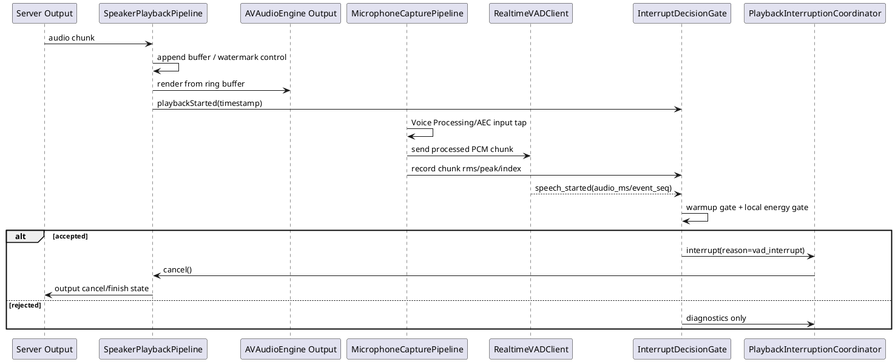

# E4 播放打断方案到 Swift SDK 的实现说明

本文记录 `playback_chain_experiment` 中 E4 实验对正式 Swift Device SDK 的实现指导。E4 不是完整 SDK
设计，而是对“边播放、边录音、实时 VAD 打断、降低自我打断”的一条可落地方案总结。

当前结论：E4 是目前可用性相对最好的候选方案。正式 Swift SDK 第一版可以按 E4 思路实现：

1. 播放链路继续使用水位线 buffer 和 ring-buffer renderer，保证播放不卡顿。
2. 麦克风链路开启 iOS Voice Processing/AEC，实时取处理后的输入音频。
3. AEC 后的麦克风 chunk 立即发送到 VAD 服务，不能等整段录音结束后再离线上传。
4. VAD 返回 `speech_started` 后，端侧再做 warmup gate 和本地能量门限过滤。
5. 通过过滤后才进入播放 cancel，清理待拉取、待播放和 renderer ring buffer。

## 1. 设计原则

正式 SDK 不能把 E4 写成一个大函数。至少要拆成以下模块：

| 模块 | 职责 | 不应该负责 |
| --- | --- | --- |
| `SpeakerPlaybackPipeline` | 接收下行音频、按水位线缓存、驱动 renderer、处理 finish/drain/cancel | 不处理麦克风、VAD、ASR |
| `MicrophoneCapturePipeline` | 配置 iOS 音频会话、开启 Voice Processing、输出 AEC 后的 PCM chunk | 不判断是否打断 |
| `RealtimeVADClient` | 把 AEC 后的 PCM chunk 发送到 server/provider VAD，并解析 `speech_started/speech_stopped` | 不直接清理播放资源 |
| `InterruptDecisionGate` | 组合 warmup gate、本地能量门限、事件去重，决定 VAD 事件是否可信 | 不做网络请求 |
| `PlaybackInterruptionCoordinator` | 收到可信打断后协调 speaker cancel、上行状态、协议回执和日志 | 不做音频格式转换 |
| `AudioDiagnostics` | 记录 chunk RMS、peak、水位线、cancel 耗时、VAD 事件和关键状态 | 不影响主流程 |

这几个模块应通过明确事件或 async API 串联，避免播放、水位线、AEC 和打断逻辑互相嵌套。

## 2. 推荐链路



关键点：

- VAD 输入必须来自 iOS Voice Processing/AEC 之后的麦克风 tap。
- VAD 必须实时处理 chunk，不能依赖最终 `mic.wav` 或离线 VAD。
- `speech_started` 不是最终打断信号，只是候选信号。
- 端侧本地门限只做“误触发过滤”，不能替代 VAD。

## 3. 播放链路实现要求

### 3.1 水位线 buffer

正式 SDK 的播放 buffer 应独立于 VAD 和 AEC，推荐参数从实验值收敛后再固化为配置：

```swift
public struct SpeakerBufferConfiguration: Sendable {
    public var startWatermarkMS: Int
    public var lowWatermarkMS: Int
    public var highWatermarkMS: Int
    public var maxBufferMS: Int
}
```

建议第一版默认值：

```text
start_watermark_ms = 120
low_watermark_ms = 300
high_watermark_ms = 800
max_buffer_ms = 1200
```

如果正式协议已经采用 `start` / `finish` 语义，播放生命周期不要再命名为 `open` / `close`。
推荐内部状态名：

```text
idle -> starting -> playing -> finishing -> drained
idle -> starting/playing/finishing -> cancelling -> cancelled
```

### 3.2 Renderer

实验中的 `AVAudioEngine + AVAudioSourceNode + Float ring buffer` 可以作为正式实现参考。
正式 SDK 中需要保留这些能力：

- 按 seq 连续播放，处理重复 chunk 和缺口。
- `finish` 到达后等待 buffer 和 ring buffer drain。
- `cancel` 立即清空 SDK buffer 和 renderer ring buffer。
- renderer underrun、dropped frames、buffered frames 必须进入诊断快照。

不要在 renderer 中混入 VAD 判断。renderer 只负责播放和清理。

## 4. 麦克风与 AEC 实现要求

### 4.1 iOS 音频会话

推荐默认配置：

```text
category = playAndRecord
mode = voiceChat
options 包含 defaultToSpeaker / allowBluetooth（按产品需要配置）
inputNode.setVoiceProcessingEnabled(true)
```

注意事项：

- E1 证明了在当前 24k/mono renderer 上直接调用 `engine.outputNode.setVoiceProcessingEnabled(true)`
  可能触发底层 `NSException`，正式 SDK 第一版不要依赖 output node voice processing 作为主方案。
- `AVAudioSession.setPrefersEchoCancelledInput(true)` 只能作为能力探测和可选增强，不应作为打断可靠性的前置条件。
- 麦克风 capture 输出给 VAD 的音频，需要和写入 `vad_upload.wav` 的音频一致，便于排查。

### 4.2 chunk 格式

正式 SDK 内部可以用设备原始采样率处理，但发给 VAD 的建议格式保持简单：

```text
pcm16le
16000 Hz
mono
100ms per VAD chunk
```

播放 chunk 可以仍然按 server 输出使用 `pcm16le / 24000Hz / 20ms`。播放格式和 VAD 上传格式不要混在同一个对象里。

## 5. E4 打断判定策略

E4 的核心是：服务端 VAD 只提供候选事件，端侧还要做两个本地 gate。

### 5.1 Warmup gate

播放开始后的短窗口内忽略 VAD `speech_started`：

```text
warmup_ignore_ms = 1500
```

原因：

- 当前真机观察中，误触发多发生在播放开始前几秒。
- 这段时间可能是 iOS AEC 收敛期、音频路由稳定期或播放初始能量变化期。
- warmup gate 是打断决策延迟，不是播放延迟，不影响播放本身。

实现要求：

- 以“实际播放开始”作为 `warmup` 起点，而不是 audio session 创建时间。
- 只忽略打断决策，不停止麦克风上传和 VAD 上传。
- warmup 内收到的 `speech_started` 必须记录日志，并继续等待后续事件。

日志示例：

```text
忽略 warmup speech_started event_seq=1 audio_ms=400 elapsed_ms=320 warmup_ms=1500 max_rms=...
```

### 5.2 本地能量门限

warmup 结束后，VAD 返回 `speech_started` 时，SDK 根据该事件对应上传 chunk 附近的能量做二次过滤。

当前参数先保持：

```text
min_rms = 0.025
lookup_window = event_chunk_index +/- 2 chunks
vad_chunk_ms = 100
```

当前样本：

| 样本 | max_rms | 结论 |
| --- | ---: | --- |
| 正常说话触发打断 | 0.1014 | 应接受 |
| 较大声说话触发打断 | 0.1252 | 应接受 |
| 未说话误触发 1 | 0.0091 | 应过滤 |
| 未说话误触发 2 | 0.0145 | 应过滤 |

因此 `min_rms=0.025` 暂时合理。后续如果真人小声插话无法触发，再考虑下调到 `0.018` 或
`0.020`，但必须基于真实日志，而不是凭主观感受调参。

实现建议：

```swift
public struct InterruptGateConfiguration: Sendable {
    public var warmupIgnoreMS: Int = 1500
    public var minRMS: Double = 0.025
    public var lookupWindowChunks: Int = 2
}
```

每个 VAD 上传 chunk 记录：

```swift
public struct VADUploadChunkLevel: Sendable {
    public let index: Int
    public let audioStartMS: Int
    public let audioEndMS: Int
    public let rms: Double
    public let peak: Double
}
```

`speech_started.audio_ms` 到 chunk 的映射：

```text
center_chunk = ceil(audio_ms / vad_chunk_ms)
lookup_range = center_chunk - 2 ... center_chunk + 2
```

如果 VAD provider 没有返回 `audio_ms`，可以临时用返回事件所在 ack chunk 作为 fallback，但日志必须标记：

```text
audio_ms=- fallback_chunk_index=...
```

### 5.3 去重和 speech stop

正式 SDK 应只接受每轮播放中的第一个可信 `speech_started`。后续重复 `speech_started` 只记录诊断。

如果场景需要“打断后继续听用户把话说完”，可以等待 `speech_stopped` 或超时：

```text
speech_stop_wait_timeout_ms = 8000
```

但这属于会话策略，不属于 speaker 播放模块。SDK 应通过配置让上层选择：

- `interruptOnly`：打断后立即停止本轮录音或交给 server 会话。
- `captureUntilSpeechStop`：打断后继续录音到 `speech_stopped` 或超时。

不要用 ASR 文本判断是否打断。当前实验中 ASR 文本可能来自外放残留或模型幻觉，不能作为打断依据。

## 6. 协议和状态机建议

正式 SDK 应遵守当前设备事件文档。播放过程如果使用 `start` / `finish` 语义，建议端侧内部状态与协议事件保持一致：

```text
Server -> Device: output.start/requested 或等价 start 事件
Device -> Server: output.started
Server -> Device: output chunk...
Server -> Device: output.finish/requested
Device -> Server: output.finished
```

打断路径：

```text
VAD speech_started
-> InterruptDecisionGate accepted
-> PlaybackInterruptionCoordinator.cancel(reason=vad_interrupt)
-> SpeakerPlaybackPipeline.cancel()
-> 清空待播放 buffer
-> 清空 renderer ring buffer
-> 停止/取消当前下行拉取或下行接收
-> Device -> Server: output.cancelled / interrupted
```

注意：

- `finish` 表示 server 结束发送，不等于端侧播放完成。
- `cancel` 必须能在 server 已 finish 但 renderer 还在 drain 时生效。
- 打断时要清理所有待播放资源，不能只停止网络拉取。

## 7. 日志和诊断要求

正式 SDK 至少要提供这些日志字段：

### 7.1 播放日志

```text
playback_started seq=...
buffer high_watermark buffered_ms=...
buffer low_watermark buffered_ms=...
output_finish_received last_seq=...
renderer_drain_started buffered_ms=...
renderer_drain_completed elapsed_ms=...
cancel_requested reason=... phase=...
buffer_cleared chunks=... duration_ms=...
renderer_cleared frames=... duration_ms=...
```

### 7.2 VAD 和打断日志

```text
vad_session_created id=... backend=...
vad_chunk_ack count=... events=... http_ms=... rms=... peak=...
ignore_warmup_speech_started event_seq=... audio_ms=... elapsed_ms=... warmup_ms=... max_rms=... max_peak=...
ignore_low_energy_speech_started event_seq=... audio_ms=... max_rms=... max_peak=... min_rms=... chunks=...
accepted_speech_started event_seq=... audio_ms=... max_rms=... max_peak=... min_rms=... chunks=...
speech_stopped event_seq=...
```

### 7.3 可复制诊断

iOS App 侧应该保留“复制日志”和“复制摘要”能力。SDK 层可以提供：

```swift
public struct AudioInteractionDiagnostics: Sendable {
    public let playbackState: String
    public let bufferedMS: Int
    public let vadChunkCount: Int
    public let lastSpeechStartedSeq: Int?
    public let lastAcceptedInterruptAtMS: Int?
    public let lastRejectedInterruptReason: String?
    public let recentChunkLevels: [VADUploadChunkLevel]
}
```

日志不能阻塞音频实时线程。音频 callback 中只做轻量计数和 ring buffer 写入，日志格式化放到后台队列。

## 8. SDK 配置建议

正式 SDK 可以暴露一组高层配置，默认启用 E4 策略：

```swift
public struct FullDuplexInterruptionConfiguration: Sendable {
    public var isEnabled: Bool = true
    public var vadChunkMS: Int = 100
    public var warmupIgnoreMS: Int = 1500
    public var minInterruptRMS: Double = 0.025
    public var lookupWindowChunks: Int = 2
    public var waitForSpeechStopAfterInterrupt: Bool = false
    public var speechStopTimeoutMS: Int = 8000
}
```

如果产品要关闭“全双工可打断式”对话，应该可以只关闭该配置，而不影响：

- speaker 播放；
- buffer 水位线；
- finish/drain；
- 手动或 server cancel。

这也是模块拆分的主要目的。

## 9. 验收用例

正式 SDK 实现后，至少要覆盖以下测试：

| 用例 | 方法 | 预期 |
| --- | --- | --- |
| 正常长音频播放 | server 连续下发 18 秒音频 | 无明显卡顿；finish 后 drain；无多余 cancel |
| server finish 后 cancel | server 已发送完但 renderer 未 drain，触发 cancel | 旧音频立即停止，待播放资源清空 |
| 无人说话外放回采 | 播放中不说话 | warmup 或 low-energy gate 过滤误触发 |
| 正常说话插话 | 播放中正常音量说话 | 通过 gate，触发 cancel |
| 打断后继续录音 | 打断后继续说完整句子 | 可等到 speech_stopped 或超时停止 |
| VAD 服务慢响应 | 人为增加 VAD HTTP 延迟 | 播放不能卡顿；日志记录 `http_ms` |
| VAD 服务错误 | 返回 error 或断网 | 不崩溃；按配置降级为不可打断或仅手动 cancel |

测试要区分三层结果：

1. 单元测试：状态机、gate、buffer、格式转换。
2. 模拟服务集成测试：chunk 顺序、finish/cancel、VAD 事件。
3. 真机测试：AEC、外放回采、真人插话、蓝牙/扬声器路由。

## 10. 不能直接照搬实验代码的部分

实验代码为排查而写，正式 SDK 不应直接复制以下设计：

1. HTTP pull audio server：正式 SDK 应接入当前设备协议的下行 stream，不使用实验 HTTP chunk API。
2. 单文件 `PlaybackExperimentRunner`：正式 SDK 必须拆分模块和 actor/队列边界。
3. UI 日志作为状态源：正式 SDK 应有结构化 diagnostics。
4. DashScope 特定字段硬编码在媒体模块中：VAD provider 细节应留在 VAD client 或 server adapter。
5. 离线 `mic.wav` VAD：正式打断路径只依赖实时 chunk VAD，WAV 只作为诊断产物。
6. ASR 文本打断判断：ASR 文本只可用于排查，不能用于是否 cancel 的决策。

## 11. 第一版落地顺序

推荐按以下顺序实现，避免再次把问题糅在一起：

1. 先实现 speaker buffer + renderer + finish/drain/cancel。
2. 再实现 mic capture + Voice Processing + `vad_upload.wav` 等价诊断。
3. 再接实时 VAD client，只打印事件，不触发 cancel。
4. 接入 `InterruptDecisionGate`，先记录 accepted/rejected。
5. 最后接 `PlaybackInterruptionCoordinator`，触发真实 cancel。
6. 完成后再打开全双工可打断默认配置。

每一步都要有独立日志和测试，不能等整个链路接完后再排查。
