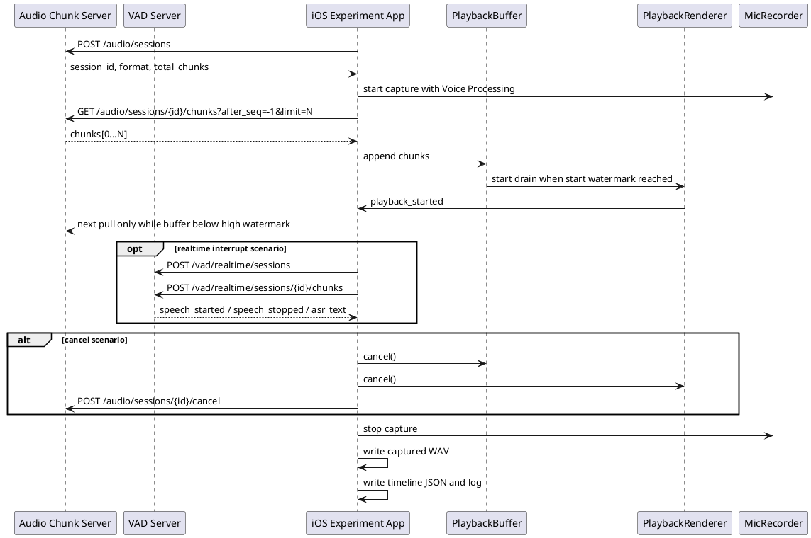

# iOS 播放链路最小实验设计

## 1. 背景

Swift Device SDK 下一版需要同时支持三件事：

1. speaker 下行播放的水位线 buffer 和背压。
2. iOS 系统 Voice Processing/AEC，降低外放回采导致的自打断。
3. 用户插话或 server cancel 时，立即清理待播放资源。

上一轮 `examples/aec_vad_experiment/` 只验证了最简单路径：真机开启
`AVAudioSession.playAndRecord + voiceChat + inputNode.setVoiceProcessingEnabled(true)` 后，
外放测试音频时，麦克风录到的系统处理后音频没有触发独立 VAD。该实验没有引入网络分片、
播放 buffer、水位线、cancel 和待播放资源清理。

本实验在保持链路尽量简单的前提下，引入一个本地 HTTP 音频分片服务，让 iOS 端像 SDK
消费 server 下行音频一样按需拉取离线音频 chunk。这样可以同时验证：

- iOS 端 buffer 水位线是否能控制拉取节奏。
- 引入 buffer 和 renderer 后，AEC 是否仍有效。
- cancel 后是否能清理服务端未拉取 chunk、端侧待播 chunk、端侧 renderer buffer。

本实验不连接 `agent-server`，不接真实模型 provider，不实现完整 Device SDK。

## 2. 目标和非目标

### 2.1 目标

- 使用真机麦克风和喇叭。
- 离线音频文件放在实验 server 侧，由 server 按 chunk 暴露。
- iOS 端通过“拉取音频 chunk”驱动本地 `PlaybackBuffer`。
- iOS 端根据 buffer 水位线暂停或恢复拉取。
- iOS 端开启 Voice Processing/AEC，并录制处理后的麦克风音频。
- iOS 端把 Voice Processing/AEC 后的麦克风 chunk 实时发送给独立 VAD 服务，用于打断判断。
- iOS 端保存完整录音 WAV，供人工复盘；主流程不再自动上传整段 WAV 做离线 VAD。
- iOS 端支持模拟 cancel，并记录 buffer 和 renderer 清理耗时。
- 实验代码都放在 `examples/playback_chain_experiment/` 下。

### 2.2 非目标

- 不实现完整 `RealtimeAgentDeviceKit`。
- 不连接 `examples/simple-agent-server`。
- 不验证模型 provider 的 `speech_started` 事件。
- 不实现相机、视觉采样、设备注册、心跳和多设备协议。
- 不把实验代码直接作为 SDK 正式实现。

## 3. 总体架构



## 4. 离线音频的使用方式

离线音频不再打包进 iOS App。实验 server 读取仓库里的 WAV 文件，例如：

```text
testdata/audio-sample/自我介绍一下.wav
```

server 启动时把 WAV 转成实验统一格式：

```text
codec = pcm16le
sample_rate = 24000
channels = 1
chunk_ms = 20
```

每个 chunk 都有稳定序号：

```json
{
  "seq": 0,
  "duration_ms": 20,
  "payload_base64": "...",
  "final": false
}
```

### 4.1 为什么音频放 server 侧

音频放 server 侧可以让 iOS 端真实执行“边拉取、边入 buffer、边播放、边暂停/恢复拉取”的过程。
如果音频直接内置在 iOS App 中，buffer 只是本地数组调度，无法验证 SDK 将来需要面对的
server 下行节奏和背压策略。

本实验的 server 不主动推送。iOS 端主动拉取 chunk，拉取频率由本地水位线决定：

- buffer 低于高水位：继续拉取。
- buffer 达到高水位：停止拉取。
- buffer 下降到低水位：恢复拉取。
- cancel：停止拉取并通知 server 取消 session。

这比真实 WebSocket 下行更简单，但保留了水位线控制的核心语义。

## 5. Server 设计

### 5.1 文件

```text
server/
  audio_chunk_server.py
  vad_server.py
```

`vad_server.py` 可以复用 `examples/aec_vad_experiment/server/vad_server.py` 的实现。

### 5.2 启动命令

```bash
python3 examples/playback_chain_experiment/server/audio_chunk_server.py \
  --host 0.0.0.0 \
  --port 8778 \
  --audio testdata/audio-sample/自我介绍一下.wav \
  --sample-rate 24000 \
  --chunk-ms 20

python3 examples/playback_chain_experiment/server/vad_server.py \
  --host 0.0.0.0 \
  --port 8777 \
  --backend dashscope \
  --dashscope-model qwen3-asr-flash-realtime \
  --dashscope-vad-threshold 0.0 \
  --dashscope-silence-duration-ms 400
```

`--dashscope-vad-threshold` 是当前 D2/D3 排查的主要调节项。值越高越不敏感，当前先用
官方推荐的 `0.0` 确认真人插话能否稳定触发；如果可触发但外放回采误触发，再逐档上调到 `0.1` 或 `0.2`。

### 5.3 API

#### `GET /health`

返回服务健康状态。

#### `POST /audio/sessions`

创建一次播放实验 session。

请求：

```json
{
  "scenario": "B1_buffer_vp_on_normal",
  "repeat": 1
}
```

响应：

```json
{
  "ok": true,
  "session_id": "audio_sess_001",
  "format": {
    "codec": "pcm16le",
    "sample_rate": 24000,
    "channels": 1,
    "chunk_ms": 20
  },
  "total_chunks": 430,
  "total_duration_ms": 8600
}
```

#### `GET /audio/sessions/{session_id}/chunks?after_seq=-1&limit=16`

拉取指定序号之后的 chunk。

响应：

```json
{
  "ok": true,
  "session_id": "audio_sess_001",
  "chunks": [
    {
      "seq": 0,
      "duration_ms": 20,
      "payload_base64": "...",
      "final": false
    }
  ],
  "next_seq": 1,
  "server_finished": false
}
```

约定：

- `after_seq=-1` 表示从第一片开始。
- `limit` 由 iOS 端按当前 buffer 空间决定，默认 8 到 32。
- server 不需要知道端侧是否播放，只负责稳定返回 chunk。
- chunk 可以重复拉取，iOS 端按 `seq` 去重。

#### `POST /audio/sessions/{session_id}/cancel`

模拟真实 `stream.output.cancel.requested` 后 server 侧停止本轮输出。

请求：

```json
{
  "reason": "experiment_cancel_requested",
  "client_last_received_seq": 52
}
```

响应：

```json
{
  "ok": true,
  "session_id": "audio_sess_001",
  "state": "cancelled"
}
```

cancel 后，chunk API 返回空列表和 `server_finished=true`。

## 6. iOS App 设计

### 6.1 文件

```text
ios/PlaybackChainExperiment/
  PlaybackChainExperimentApp.swift
  ContentView.swift
  ExperimentViewModel.swift
  PlaybackExperimentRunner.swift
  AudioSessionController.swift
  MicrophoneCaptureRecorder.swift
  WatermarkPlaybackBuffer.swift
  RingBufferPlaybackRenderer.swift
  PullingAudioChunkSource.swift
  ExperimentTimeline.swift
```

### 6.2 `AudioSessionController`

职责：只配置系统音频会话和 Voice Processing。

配置：

```text
AVAudioSession.Category.playAndRecord
AVAudioSession.Mode.voiceChat
options = [.defaultToSpeaker, .allowBluetoothHFP]
preferredSampleRate = 16000
preferredIOBufferDuration = 0.02
inputNode.setVoiceProcessingEnabled(true)
```

记录：

- 实际 input sample rate。
- 实际 input channels。
- 当前 route。
- voice processing 是否启用成功。
- route change / interruption / media services reset。

### 6.3 `MicrophoneCaptureRecorder`

职责：录制系统处理后的麦克风音频，供 VAD 分析。

要求：

- input tap 中只复制 buffer 到内存。
- 不在 tap 中写文件。
- 不在 tap 中做网络请求。
- 不在 tap 中做复杂格式转换。
- 实验结束后离线转为 16k mono PCM16 WAV。

### 6.4 `PullingAudioChunkSource`

职责：按水位线从 server 拉取 chunk。

接口：

```swift
func startSession(scenario: String) async throws -> AudioSessionInfo
func pull(afterSeq: Int, limit: Int) async throws -> [AudioChunk]
func cancel(lastReceivedSeq: Int) async throws
```

拉取策略：

```text
while not cancelled and not serverFinished:
  snapshot = buffer.snapshot()
  if snapshot.bufferedMS >= highWatermarkMS:
    wait until buffer drains below lowWatermarkMS
  limit = computeLimitByAvailableMS(maxBufferMS - bufferedMS)
  chunks = pull(afterSeq, limit)
  append chunks to PlaybackBuffer
```

### 6.5 `WatermarkPlaybackBuffer`

职责：模拟 SDK 内置 speaker buffer。

能力：

- 按 `seq` 暂存和去重。
- 达到 `start_watermark_ms` 后允许 renderer 起播。
- 达到 `high_watermark_ms` 后通知 source 暂停拉取。
- 降到 `low_watermark_ms` 后通知 source 恢复拉取。
- `finish(expectedLastSeq)` 等待最后一片进入 buffer 后再 drain。
- `cancel()` 立即清空未播放 chunk。

默认水位线：

```text
start_watermark_ms = 120
low_watermark_ms = 300
high_watermark_ms = 800
max_buffer_ms = 1200
```

压力水位线：

```text
start_watermark_ms = 600
low_watermark_ms = 3000
high_watermark_ms = 12000
max_buffer_ms = 20000
```

### 6.6 `RingBufferPlaybackRenderer`

职责：真实播放，不处理协议状态。

要求：

- 使用 `AVAudioEngine + AVAudioSourceNode + Float ring buffer`。
- `write(chunk)` 将 PCM16LE 转 Float 后写入 ring buffer。
- `drain()` 等 ring buffer 播放完成。
- `cancel()` 立即清空 ring buffer，并让 render 输出静音。
- 记录 underrun、dropped frames、buffered frames 和 cancel 清理量。

### 6.7 `PlaybackExperimentRunner`

职责：编排单次实验。

流程：

1. 创建 audio server session。
2. 配置音频会话和 Voice Processing。
3. 启动麦克风录制。
4. 启动拉取循环。
5. buffer 达到起播水位后启动 renderer drain loop。
6. 根据场景执行正常 finish 或 cancel。
7. 停止麦克风录制。
8. 离线生成 WAV。
9. 写入 timeline JSON 和日志。

## 7. 实验场景

实验按能力边界分成四组。每个场景至少重复 3 次；如果 3 次结果不一致，需要保留全部
timeline、WAV 和手机日志，不只记录成功样本。

### 7.1 A 组：基础播放和系统音频处理对照

A 组只验证“播放 + 麦克风 + 音频会话配置”是否成立，不测试水位线压力、cancel 或打断。

| 编号 | 配置 | 操作 | 目的 | 预期观察 |
| --- | --- | --- | --- | --- |
| A1 | VoiceProcessing 开；voiceChat；极小水位线 | 无真人说话，正常播完 | 建立正向基线，确认 server 拉取链路不会破坏 AEC/Voice Processing | 能听到播放；麦克风 WAV 中回声被明显压低；不执行离线 VAD |
| A2 | Raw playAndRecord；default mode；极小水位线 | 无真人说话，正常播完 | 负向对照，证明当前音量、摆位和录音路径能捕获扬声器回声 | WAV 中应更容易听到喇叭声；不执行离线 VAD，需要人工听录音对照 |
| A3 | voiceChat；`setVoiceProcessingEnabled(false)`；极小水位线 | 无真人说话，正常播完 | 拆分 voiceChat 和 input voice processing 开关的影响 | 结果可能介于 A1/A2；如果仍压低回声，说明 voiceChat 本身已有系统处理 |

### 7.2 B 组：水位线 buffer 和长音频播放稳定性

B 组正式目标是验证播放稳定性。界面上的 Cancel 按钮只作为人工中止工具，不作为 B 组验收项；
正式 cancel 清理只放到 C 组验证。

| 编号 | 配置 | 操作 | 目的 | 预期观察 |
| --- | --- | --- | --- | --- |
| B1 | VoiceProcessing 开；默认水位线 | 无真人说话，正常播完 | 验证默认 buffer 参数能稳定支撑长音频播放和 server finish 后 drain | 无明显卡顿；高低水位日志合理；不执行离线 VAD |
| B2 | VoiceProcessing 开；压力水位线 | 无真人说话，正常播完 | 验证大 buffer 对播放稳定性、drain 时长和资源占用的影响 | 无明显卡顿；可量化更长 drain/待播放时长；不因大 buffer 导致播放残留失控 |

### 7.3 C 组：无真人说话时的 cancel 清理

C 组只验证资源清理，不引入真人说话和实时 VAD/ASR。cancel 应由场景自动触发或按明确阶段触发，
不能把“B 组里手动点 Cancel”当作 C 组结果。

| 编号 | 配置 | 操作 | 目的 | 预期观察 |
| --- | --- | --- | --- | --- |
| C1 | VoiceProcessing 开；默认水位线 | 播放约 1 秒后自动 cancel；无真人说话 | 验证默认 buffer 下停止拉取、清空待播放队列、停止 renderer | cancel 后旧音频快速停止；buffer/ring 清理量进入 timeline；不执行离线 VAD |
| C2 | VoiceProcessing 开；压力水位线 | 播放约 1 秒后自动 cancel；无真人说话 | 验证大 buffer 最坏清理路径 | 即使已缓存大量 chunk，也能清空 buffer/ring；可量化 audible tail 和 renderer clear 耗时 |

后续如果 C1/C2 不能覆盖 server 已发送完成后的 drain 阶段，应增加 C3：server finish 后、renderer drain
未完成时自动 cancel，专门验证 drain 阶段的清理路径。

### 7.4 D 组：真人插话、实时 VAD/ASR 和打断

D 组用于验证用户说话路径。D1 只验证录音中是否能听到真人语音；D2/D3 必须使用
麦克风 tap 中已经过 iOS Voice Processing/AEC 的实时 PCM chunk，立即发送到 VAD server 的
`/vad/realtime/sessions` 会话，由服务端持续返回 `speech_started` 触发 cancel。所有 D 组都必须打印
ASR 文本，便于判断识别到的是用户语音还是外放回声。

| 编号 | 配置 | 操作 | 目的 | 预期观察 |
| --- | --- | --- | --- | --- |
| D1 | VoiceProcessing 开；默认水位线；不启用实时打断 | 播放开始约 1 秒后真人说“打断一下”，不 cancel | 验证播放中录音能保留真人插话，同时观察 AEC 后语音质量 | 播放正常完成；WAV 中可人工听到真人插话；不执行离线 VAD |
| D2 | VoiceProcessing 开；默认水位线；启用实时 VAD/ASR 打断 | 播放开始后真人说“打断一下” | 验证 `speech_started -> cancel -> 清理播放资源` 的实时打断链路 | 打印实时 ASR 文本；收到 speech_started 后进入 cancel；旧播放快速停止 |
| D3 | VoiceProcessing 开；默认水位线；启用实时 VAD/ASR 打断和 speech stop 等待 | 播放开始后真人持续说完整句子 | 验证 cancel 后仍继续捕获用户后续语音，直到 `speech_stopped` 再停止录音 | speech_started 触发 cancel；cancel 后继续录音；打印 ASR 文本；speech_stopped 后停止录音，超时才兜底 |

### 7.5 E 组：iOS AEC 配置对照

E 组沿用 D3 的交互流程，只改变 iOS 系统 AEC 配置。每轮必须同时保存 `mic.wav` 和
`vad_upload.wav`，并优先比较 `vad_upload.wav` 中的外放残留强度，而不是只看 DashScope
是否触发 `speech_started`。

| 编号 | 配置 | 操作 | 目的 | 预期观察 |
| --- | --- | --- | --- | --- |
| E1 | D3 + 播放 output voice processing 兼容性探测 | 播放开始后持续说一句话 | 记录 `AVAudioEngine` 当前 24k/mono renderer 不安全调用边界，避免 `setVoiceProcessingEnabled(true)` 触发底层 NSException | App 不崩溃；日志说明 output VP 已跳过；`vad_upload.wav` 可作为 D3 对照 |
| E2 | D3 + `AVAudioSession.setPrefersEchoCancelledInput(true)`（仅支持系统生效） | 播放开始后持续说一句话 | 验证 echo-cancelled input 偏好对输入端回声抑制的影响 | 日志打印 echo-cancelled input available/enabled/preferred；`vad_upload.wav` 外放残留应与 D3/E1 对比 |
| E3 | D3 + 本地低能量门限 `min_rms=0.025` | 播放开始后持续说一句话 | DashScope 返回 `speech_started` 后，按事件 `audio_ms` 回查对应上传 chunk 附近 RMS，过滤小声回放残留 | 低能量误触发会打印“忽略低能量 speech_started”；真人插话 RMS 足够高时仍触发 cancel |
| E4 | D3 + warmup 忽略 1500ms + 本地低能量门限 `min_rms=0.025` | 播放开始后持续说一句话 | 验证播放刚开始 AEC 收敛期的误触发是否可通过 warmup gate 隔离 | 前 1500ms 内触发会打印“忽略 warmup speech_started”；之后仍按 E3 能量门限判断 |

### 7.6 当前阶段结论

截至当前真机测试，E4 是可用性相对最好的候选方案。它不把 DashScope 的 `speech_started`
直接等同为用户插话，而是在服务端 VAD 之后增加两层端侧判定：

1. 播放开始后的 1500ms warmup 窗口内忽略打断，用于避开播放初期 AEC 收敛不稳定带来的误触发。
2. warmup 结束后按 `speech_started` 对应上传 chunk 附近的本地 RMS 做二次过滤，当前门限保持
   `min_rms=0.025`。

当前样本中，正常说话触发打断时 `max_rms` 约为 `0.1014`，较大声说话约为 `0.1252`；
未说话误触发样本被本地门限过滤，`max_rms` 约为 `0.0091` 到 `0.0145`。因此暂时不下调
`min_rms=0.025`，后续如果出现真人小声插话无法触发，再基于带 `max_rms/max_peak/chunks`
的日志决定是否调整到 `0.018` 或 `0.020`。

## 8. 关键时间线

每轮实验必须记录：

```text
t_session_created
t_audio_session_configured
t_voice_processing_enabled
t_mic_capture_started
t_first_pull_started
t_first_chunk_received
t_buffer_start_watermark_reached
t_playback_started
t_high_watermark_reached
t_pull_paused
t_low_watermark_reached
t_pull_resumed
t_finish_received
t_drain_completed
t_cancel_requested
t_buffer_cleared
t_renderer_cleared
t_mic_capture_stopped
t_wav_written
```

cancel 场景重点指标：

```text
buffer_clear_ms = t_buffer_cleared - t_cancel_requested
renderer_clear_ms = t_renderer_cleared - t_cancel_requested
audible_tail_ms = 主观或 renderer 估算的 cancel 后残留播放时长
```

目标阈值：

```text
buffer_clear_ms < 20
renderer_clear_ms < 50
audible_tail_ms < 300
```

## 9. 产物格式

iOS App 每轮写入：

```text
Documents/playback-chain/<run_id>/mic.wav
Documents/playback-chain/<run_id>/timeline.json
Documents/playback-chain/<run_id>/experiment.log
```

`timeline.json` 示例：

```json
{
  "run_id": "run_001",
  "scenario": "C2_large_buffer_cancel_no_user_speech",
  "audio_server_url": "http://192.168.10.10:8778",
  "vad_server_url": "http://192.168.10.10:8777/vad/analyze",
  "voice_processing": true,
  "route": "inputs[MicrophoneBuiltIn:iPhone 麦克风] outputs[Speaker:扬声器]",
  "input_sample_rate": 48000,
  "playback": {
    "start_watermark_ms": 600,
    "low_watermark_ms": 3000,
    "high_watermark_ms": 12000,
    "max_buffer_ms": 20000,
    "chunks_received": 180,
    "chunks_rendered": 51,
    "chunks_discarded_on_cancel": 129,
    "ring_frames_cleared_on_cancel": 12000,
    "underrun_events": 0,
    "dropped_frames": 0
  },
  "timing_ms": {
    "playback_started": 1220,
    "cancel_requested": 2220,
    "buffer_cleared": 2228,
    "renderer_cleared": 2250,
    "mic_capture_stopped": 8500
  },
  "vad": {
    "triggered": false,
    "speech_frames": 0,
    "total_frames": 440,
    "speech_ratio": 0.0,
    "first_speech_ms": null,
    "backend": "webrtcvad"
  }
}
```

## 10. 成功标准

### 10.1 AEC 成功

在无真人说话场景下：

- A1、B1、B2、C1、C2 的 `triggered=false`。
- A2 的作用是证明实验装置能录到扬声器回声，不能单独用于量化 AEC 开关收益。
- A3 的作用是和 A1 做更接近的单变量探针：保留 `voiceChat`，只关闭 `setVoiceProcessingEnabled`。
- 如果 A2 触发或 speech ratio 明显升高，说明 raw 负对照有效。
- 如果 A3 与 A1 接近，说明 `voiceChat` 本身可能已经启用了系统语音链路处理。
- 如果 A2 不触发，也不能判定 AEC 无效，只说明当前播放音量或 VAD 灵敏度不足，需要提高音量或调整 VAD。

### 10.2 水位线成功

- B1/B2 中出现正确的 start watermark、high watermark、pull pause、low watermark、pull resume 记录。
- 播放没有明显 underrun。
- 正常 finish 能 drain 完成。

### 10.3 cancel 成功

- C1/C2 中 cancel 后不继续播放旧音频。
- `buffer_clear_ms < 20`。
- `renderer_clear_ms < 50`。
- cancel 后旧音频不再继续播放。

### 10.4 全双工可打断成功

- D1 中真人插话进入最终 WAV，可人工听音复盘。
- D2/D3 中实时 VAD/ASR 可打印 ASR 文本，`speech_started` 可触发 cancel。
- D3 中 cancel 后继续录音，直到收到实时 VAD/ASR 的 `speech_stopped`，超时才兜底停止。
- D2 中 cancel 后旧播放停止。
- 麦克风采集不中断，插话音频进入最终 WAV。

## 11. 与 Swift SDK 设计的对应关系

| 实验模块 | 未来 SDK 模块 |
| --- | --- |
| `PullingAudioChunkSource` | Audio output transport / downstream flow control |
| `WatermarkPlaybackBuffer` | SDK speaker playback buffer |
| `RingBufferPlaybackRenderer` | 默认 AVFoundation speaker sink |
| `AudioSessionController` | Voice Processing / AEC controller |
| `MicrophoneCaptureRecorder` | 默认 microphone source 的采集侧 |
| `PlaybackExperimentRunner` | 未来 SDK 内部状态机测试参考 |

实验通过后，SDK 实现仍应保持模块化：水位线 buffer、AEC、cancel 清理分别测试和替换。

## 12. 实施顺序

1. 搭建 `audio_chunk_server.py`，支持固定 WAV 转 chunk 和拉取 API。
2. 复制或复用 `vad_server.py`。
3. iOS App 先实现 A1/A2/A3，确认 server 拉取后 AEC 基线和两个对照组成立。
4. 加 `WatermarkPlaybackBuffer`，跑 B1/B2。
5. 加 `RingBufferPlaybackRenderer`，复跑 B1/B2。
6. 加 cancel 清理，跑 C1/C2。
7. 加真人插话步骤，跑 D1/D2。
8. 写 `EXPERIMENT_REPORT.md`，记录真实命令、设备、路由、音量、结果 JSON 和结论。
