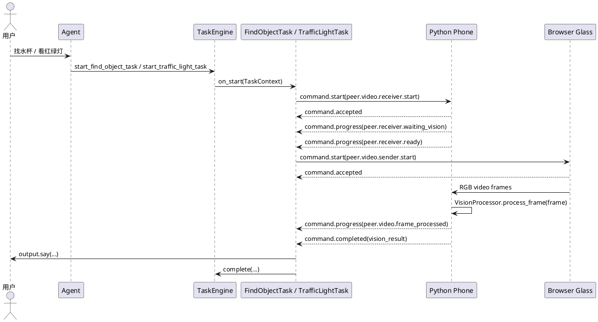
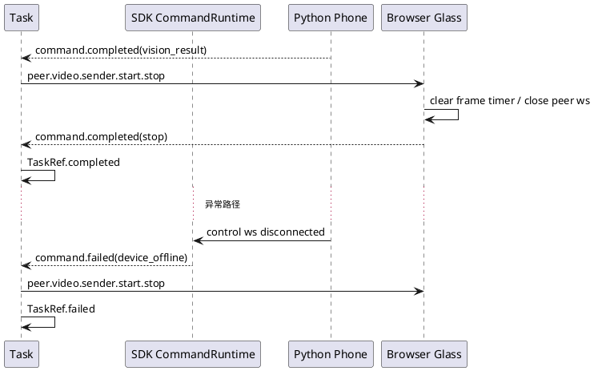
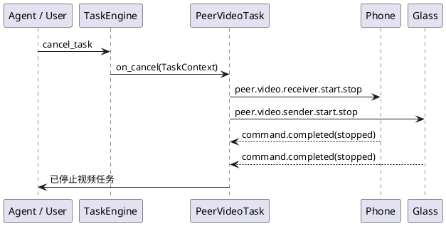

# 跨端设备直连视频任务设计

更新时间：2026-05-15

当前状态：已落地到 `for-blind-app`、`browser-glass` 和 `python-phone`。本文保留设计背景，同时把链路更新到当前实现：找物和红绿灯 Task 已经使用 peer video 编排，Python phone 端可运行真实 YOLO / YOLOE；mock provider 只作为无模型测试降级入口。

开发计划见 [跨端设备直连视频任务开发计划](peer-video-link-implementation-plan.md)。

## 1. 背景

找物和红绿灯识别已经迁移到手机端运行视觉处理。旧方案是 server 侧 Task 请求眼镜上传一张
`sensor.rgb` 图片给 server，再由 server mock 视觉结果；当前主线已经改成：

1. 眼镜端持续采集画面。
2. 手机端接收视频回显。
3. 手机端逐帧执行本地视觉算法。
4. server Task 只维护任务状态、播报关键结果和处理取消。

因此这类能力现在使用“server Task 编排两个端侧建立视频连接”，而不是“server 请求单个端侧上传图片”。

需要特别区分 realtime visual sampler：它在用户说话期间向 browser-glass 请求带
`request_id` 的 `sensor.rgb` 单资产帧，只用于把当前画面追加给模型，不会在 Task 前
转发给 Python phone，也不会建立 peer video 连接。

## 2. 目标

本设计要实现：

1. Agent 调用 `start_find_object_task` 或 `start_traffic_light_task`。
2. server 创建 `TaskRef`，以 `task_id` 作为跨端视频会话 ID。
3. Task 先让手机端进入视频接收和回显状态。
4. Task 再让眼镜端连接手机端并发送 RGB 视频帧。
5. 手机端每收到一帧，都通过 `VisionProcessor` 运行 YOLOE 找物或红绿灯 YOLO，并打印识别日志。
6. 手机端支持手动关闭、server stop 和业务超时。
7. 手机端结束时上报真实视觉结果；找物超时会返回 `found=false`，红绿灯稳定识别绿灯会返回 `can_cross=true`。
8. Task 持续维护端侧状态，上报关键 `TaskSignal`，支持取消时关闭两端连接。

当前实现已经接入 Python phone 端真实 YOLO / YOLOE。mock provider 只用于无模型环境和自动化测试，不作为主链路。

## 3. 非目标

本阶段不做：

1. 不在 server 内处理视频帧。
2. 不把视频帧作为 TaskSignal 或 control event payload 传输。
3. 不新增一套独立于 `command.*` 的端侧任务状态协议。
4. 不要求 browser-glass 和 Python phone 真正 WebRTC 点对点；首版可用局域网 WebSocket/HTTP 视频通道或 server 辅助 relay，但协议模型必须按 peer link 表达。
5. 不把 YOLO 依赖放进 server SDK；真实模型依赖仍属于 Python phone 开发支持组件自己的运行环境。

## 4. 总体模型

server Task 是跨设备编排器。它不拥有视频数据，只维护两个端侧的远程命令状态。



## 5. 为什么继续使用 `command.*`

当前 SDK 已有三层状态对象：

| 层级 | 对象 | 作用 | 是否承载端侧底层状态 |
| --- | --- | --- | --- |
| 控制协议 | `command.accepted/progress/completed/failed` | 设备命令和远程端侧任务的通用回执 | 是 |
| Task 运行时 | `TaskRef.state` | server Task 生命周期状态 | 否 |
| Task 业务信号 | `TaskSignal` | Task 对 Agent、通知、runs 产物暴露的业务信号 | 否 |

跨端视频连接仍然是“端侧远程任务”。它只需要更明确的 command 名称和 payload 约定，不需要新建协议。原因：

1. `TaskContext.devices.commands.start()` 已经只在 Task 中开放，正好表达长时端侧任务。
2. `CommandHandle.results()` 已经能持续消费端侧状态。
3. `command.progress` 可承载连接中、已就绪、帧处理、用户关闭、超时等中间状态。
4. `command.completed` 可承载最终视觉结果。
5. `command.failed` 可承载任一端建链失败。
6. Task 可以把重要 `CommandEvent` 转成 `TaskSignal`，但不把 TaskSignal 当作底层传输。

结论：本阶段不新增 `peer.*` 系统级事件。新增的是一组标准设备命令名称和 payload schema。

## 6. 设备命令约定

### 6.1 手机端接收命令

命令名：

```text
peer.video.receiver.start
```

Task 发送给手机端：

```json
{
  "command_id": "cmd_xxx",
  "command": "peer.video.receiver.start",
  "mode": "start",
  "params": {
    "peer_session_id": "task_xxx",
    "task_type": "find_object_task",
    "purpose": "find_object",
    "object_name": "水杯",
    "media_config": {
      "codec": "jpeg",
      "width": 960,
      "height": 540,
      "fps": 5
    },
    "timeout_seconds": 30
  }
}
```

手机端收到后需要：

1. 打开视频接收端口或准备 relay 接收。
2. 打开本地视频回显窗口。
3. 显示“等待眼镜连接”状态。
4. 返回 `command.accepted`。
5. 模型准备期间返回 `command.progress(status=peer.receiver.waiting_vision)`。
6. receiver 和视觉模型都准备完成后返回 `command.progress(status=peer.receiver.ready)`。

实现备注：当前 SDK 会拦截控制信令 payload 中名为 `video` 的字段以避免误把媒体字节放进 JSON，因此首版实现把接收端视频参数字段命名为 `media_config`。字段语义仍是 codec、宽高和 fps；实际 JPEG 帧只走 phone receiver 提供的 WebSocket 通道。

`peer.receiver.ready` 示例：

```json
{
  "command_id": "cmd_phone",
  "command": "peer.video.receiver.start",
  "status": "peer.receiver.ready",
  "peer_session_id": "task_xxx",
  "receiver": {
    "transport": "websocket",
    "url": "ws://192.168.1.20:19081/peer-video/task_xxx",
    "token": "short-lived-token"
  }
}
```

### 6.2 眼镜端发送命令

命令名：

```text
peer.video.sender.start
```

Task 在收到手机端 `peer.receiver.ready` 后发送给眼镜端：

```json
{
  "command_id": "cmd_xxx",
  "command": "peer.video.sender.start",
  "mode": "start",
  "params": {
    "peer_session_id": "task_xxx",
    "task_type": "find_object_task",
    "purpose": "find_object",
    "source": {
      "stream_type": "sensor.rgb",
      "codec": "jpeg",
      "fps": 5,
      "width": 960,
      "height": 540
    },
    "receiver": {
      "transport": "websocket",
      "url": "ws://192.168.1.20:19081/peer-video/task_xxx",
      "token": "short-lived-token"
    },
    "timeout_seconds": 30
  }
}
```

眼镜端收到后需要：

1. 打开摄像头或复用当前浏览器摄像头帧。
2. 连接手机端 receiver。
3. 按配置发送 RGB 帧。
4. 返回 `command.accepted`。
5. 连接成功后返回 `command.progress`，其中 `status=peer.sender.connected`。

### 6.3 停止命令

取消或结束时，Task 调用 `CommandHandle.stop()`。底层会发送：

```text
peer.video.receiver.start.stop
peer.video.sender.start.stop
```

params：

```json
{
  "command_id": "cmd_phone",
  "reason": "task_cancelled"
}
```

端侧收到 stop 后必须释放摄像头、关闭 peer 连接、关闭接收端口或停止回显窗口状态，并返回 `command.completed` 或 `command.failed`。

## 7. 生命周期和释放边界

视频长连接由三层共同维护，不能只依赖业务 timeout：

| 层级 | 负责对象 | 建立职责 | 释放职责 | 异常职责 |
| --- | --- | --- | --- | --- |
| SDK command runtime | `CommandHandle` / `CommandResultBroker` | 在下发 `command.requested` 前登记 command 与目标设备 | 设备离线时把该设备未完成 command 标记为 `failed` | 控制连接断开、心跳超时必须唤醒等待中的 Task |
| server Task | `FindObjectTask` / `TrafficLightTask` | 先启动 phone receiver，再启动 glass sender | 任务完成、失败、取消时 stop 已启动端侧，phone completed 后主动 stop glass sender | 任一端 failed 时 fail Task，并清理另一端 |
| phone receiver | Python phone / 后续 iOS phone | 打开本地 receiver，回显视频，逐帧运行 `VisionProcessor` | timeout、用户关闭、server stop、进程退出时关闭 receiver | sender WebSocket 断开时上报 `peer.video.sender_disconnected`，无帧时 failed |
| glass sender | browser-glass / 后续眼镜端 | 连接 phone receiver 并按 fps 发送 JPEG 帧 | server stop、页面关闭、控制连接断开时停止 timer 并关闭 WebSocket | peer WebSocket error/close 时上报 `command.failed` |

关键约束：

1. `timeout_seconds` 是业务兜底，不是资源释放的唯一机制。
2. phone/glass 任一控制连接离线，SDK 必须让对应 command 进入 failed，Task 不能继续等待端侧主动回包。
3. phone receiver 的 peer WebSocket 断开必须结束 receiver；如果已经收到可完成结果，可以按视觉结果完成；如果一帧未收到，应 failed。
4. Task 成功拿到 phone completed 后，仍要主动停止 glass sender，不能只等 receiver 关闭后由 sender 自行感知。
5. Python phone 退出时必须停止所有仍在运行的 peer receiver，避免端口占用和旧任务悬挂。

释放时序：



## 8. 状态回报约定

端侧状态全部走现有 `command.progress`，payload 中用 `status` 表达子状态。

这里的“约定”不应理解为每个开源开发者都要从零手写协议事件、日志和校验。合理边界是：

1. SDK 定义状态回报的公共信封、发送 API、日志格式和运行产物记录。
2. 开发者定义自己的 `status` 名称、业务 payload 和最终 result schema。
3. 示例端侧可以提供 helper，端侧 handler 调用 helper 上报状态，而不是直接拼 `command.progress`。
4. server Task 通过 `CommandHandle.results()` 消费标准化 `CommandEvent`，再按业务需要转成 `TaskSignal`。

推荐在 Python phone 开发支持组件里把状态回报抽象成 `RemoteTaskReporter`。这只是端侧实现的便利封装，不是跨语言协议对象；Swift、JavaScript、Kotlin、C 等端侧可以用各自语言的 helper，也可以直接发送 `command.progress` 控制事件。

```python
class RemoteTaskReporter:
    """端侧远程任务状态回报 helper。

    主要功能：封装 command.accepted/progress/completed/failed 事件发送、日志打印和
    payload 标准字段，端侧 handler 只填写 status、message、data 和 result。
    """

    async def accepted(self, *, message: str = "", data: dict | None = None) -> None: ...

    async def progress(
        self,
        status: str,
        *,
        message: str = "",
        data: dict | None = None,
        metrics: dict | None = None,
    ) -> None: ...

    async def completed(self, *, result: dict, message: str = "") -> None: ...

    async def failed(self, *, message: str, error_code: str = "remote_task_failed", data: dict | None = None) -> None: ...
```

Python phone 端侧 handler 中可以这样写：

```python
await reporter.progress(
    "peer.video.frame_processed",
    message="视觉处理完成一帧",
    data={"frame_seq": frame.seq, "label": "cup", "source": "yoloe"},
    metrics={"elapsed_ms": 8},
)
```

helper 负责生成统一 payload，并通过控制连接发送 `command.progress`：

```json
{
  "command_id": "cmd_phone",
  "command": "peer.video.receiver.start",
  "status": "peer.video.frame_processed",
  "message": "视觉处理完成一帧",
  "peer_session_id": "task_xxx",
  "task_type": "find_object_task",
  "role": "receiver",
  "data": {
    "frame_seq": 12,
    "label": "cup",
    "source": "yoloe"
  },
  "metrics": {
    "elapsed_ms": 8
  }
}
```

SDK 对状态回报的支持应该包含：

| 支持项 | SDK 负责 | 开发者负责 |
| --- | --- | --- |
| 回报信封 | `command_id`、`command`、`status`、`message`、`data`、`metrics`、时间戳 | 选择状态名和业务字段 |
| 发送方式 | helper 发送 `command.progress/completed/failed`；非 Python 端侧可直接发送等价控制事件 | 在合适的端侧处理节点调用 helper 或发送事件 |
| 日志 | helper 打印结构化日志，server 记录 `command-events.jsonl` | 补充业务 message 和指标 |
| 校验 | SDK 校验必填字段、payload 可 JSON 化、状态名非空 | 定义 result schema |
| Task 消费 | `CommandHandle.results()` 输出 `CommandEvent` | Task 决定哪些状态转成 `TaskSignal` |

状态名建议遵守命名习惯：

```text
<domain>.<object>.<state>
```

示例：

```text
peer.receiver.ready
peer.sender.connected
peer.video.first_frame
peer.video.frame_processed
vision.result
```

SDK 不应内置所有业务状态枚举，否则开源开发者扩展新设备、新算法、新任务时会被限制。SDK 只需要保留少量通用状态分类用于 UI 和日志聚合：

| 通用分类 | 判断方式 | 用途 |
| --- | --- | --- |
| `starting` | status 以 `.starting` 结尾 | 展示准备中 |
| `ready` | status 以 `.ready` 结尾 | 展示可继续下一步 |
| `connected` | status 以 `.connected` 结尾 | 展示链路已连接 |
| `processed` | status 以 `.processed` 结尾 | 展示处理进度 |
| `timeout` | status 以 `.timeout` 结尾 | 展示超时 |
| `closed` | status 包含 `.closed` | 展示已关闭 |

日志打印也分两层：

1. 端侧 helper 打印本地日志，便于开发者看 phone / glass 控制台。
2. server 的 command broker 记录所有 `command.*` 回执到运行产物，便于统一排查。

端侧日志示例：

```text
INFO peer.video.progress command_id=cmd_phone peer_session_id=task_xxx status=peer.video.frame_processed frame_seq=12 elapsed_ms=8
```

server 运行产物示例：

```json
{
  "event": "command.progress",
  "command_id": "cmd_phone",
  "command": "peer.video.receiver.start",
  "producer_id": "dev-python-phone-preview",
  "status": "peer.video.frame_processed",
  "peer_session_id": "task_xxx",
  "data": {"frame_seq": 12},
  "metrics": {"elapsed_ms": 8}
}
```

也就是说，开发者要定义“我的任务有哪些状态、什么时候上报、结果长什么样”；SDK 要负责“怎么上报、怎么记录、怎么让 Task 消费、怎么让调试人员看见”。

| status | 上报端 | 含义 | Task 处理 |
| --- | --- | --- | --- |
| `peer.receiver.starting` | phone | 手机端正在准备接收 | 更新 Task metadata |
| `peer.receiver.waiting_vision` | phone | 手机端 receiver 已启动，但视觉模型仍在加载或文本编码 | server 播报等待，眼镜暂不采集 |
| `peer.receiver.ready` | phone | 手机端 receiver 和视觉模型都已准备好，携带 receiver 参数 | server 播报开始识别，触发眼镜端 sender start |
| `peer.sender.connecting` | glass | 眼镜端正在连接手机 | 更新 Task metadata |
| `peer.sender.connected` | glass | 眼镜端已连接手机 | 可播报“视频已连接” |
| `peer.video.first_frame` | phone | 手机端收到首帧 | 记录首帧时间 |
| `peer.video.frame_processed` | phone | 手机端完成一帧视觉处理 | 记录帧数和最近日志 |
| `peer.video.closed_by_user` | phone | 用户点击关闭按钮 | stop 眼镜端并完成或取消任务 |
| `peer.video.timeout` | phone | 业务超时 | 等待或接受端侧 completed |

最终结果走 `command.completed`：

找物：

```json
{
  "command_id": "cmd_phone",
  "command": "peer.video.receiver.start",
  "peer_session_id": "task_xxx",
  "result": {
    "type": "find_object",
    "object_name": "水杯",
    "found": true,
    "confidence": 0.76,
    "message": "已找到水杯，位置在画面中间偏左。",
    "source": "yoloe"
  }
}
```

红绿灯：

```json
{
  "command_id": "cmd_phone",
  "command": "peer.video.receiver.start",
  "peer_session_id": "task_xxx",
  "result": {
    "type": "traffic_light",
    "state": "green",
    "can_cross": true,
    "message": "绿灯，可以在确认安全后通行。",
    "source": "yolo"
  }
}
```

## 9. Task 与 `TaskContext` 的结合方式

### 8.1 Task 启动逻辑

Task 使用 `context.devices.commands.start()` 同时维护两个远程端侧命令。

```python
class PeerVideoTaskMixin:
    async def start_peer_video(self, context: TaskContext, *, purpose: str, params: dict) -> None:
        peer_session_id = context.task_ref.task_id

        phone_handle = await context.devices.commands.start(
            name="peer.video.receiver.start",
            selector={"device_role": "phone"},
            params={
                "peer_session_id": peer_session_id,
                "purpose": purpose,
                **params,
            },
        )

        phone_ready = await self.wait_status(phone_handle, "peer.receiver.ready")

        glass_handle = await context.devices.commands.start(
            name="peer.video.sender.start",
            selector={"device_role": "glass"},
            params={
                "peer_session_id": peer_session_id,
                "purpose": purpose,
                "receiver": phone_ready.data["receiver"],
            },
        )

        await self.consume_peer_events(context, phone_handle, glass_handle)
```

注意：当前 `DeviceRuntime` 禁止业务 selector 直接使用 `device_id`、`target_device_id` 等字段，所以这里需要端侧注册时提供稳定 properties，例如：

```yaml
properties:
  device_role: phone
  endpoint.role.phone: true
  endpoint.compute.vision: true
```

```yaml
properties:
  device_role: glass
  endpoint.role.glass: true
```

### 8.2 Task 状态维护

Task 内部应维护：

```python
self.peer_session_id
self.phone_handle
self.glass_handle
self.receiver_ready
self.first_frame_at
self.frame_count
self.latest_result
```

但这些状态不直接暴露给模型。对外只通过：

1. `TaskRef.metadata` 或运行产物记录调试摘要。
2. `TaskSignal` 表达业务关键状态。
3. `context.output.say()` 播报用户需要知道的结果。

### 8.3 TaskSignal 使用边界

TaskSignal 只用于 Task 对外输出关键业务信号：

| TaskSignal | 触发条件 | 用途 |
| --- | --- | --- |
| `peer_video.connected` | phone 首帧或 glass connected | 记录和可选播报 |
| `find_object.found` | phone completed 返回 found=true | 播报找物结果 |
| `traffic_light.green` | phone completed 返回 green | 高优先级播报通行建议 |
| `peer_video.failed` | 任一端 failed | 失败说明和清理 |
| `peer_video.closed` | 手机按钮关闭或 timeout | 任务完成或取消 |

不要把每一帧都转成 TaskSignal。逐帧日志留在 phone 端日志和 `command.progress` 摘要中；Task 只保存计数和最近状态。

### 8.4 取消逻辑



Task 取消时：

1. 优先 stop 眼镜端，停止摄像头发送。
2. 再 stop 手机端，关闭接收端和回显。
3. 如果其中一端已经断开，记录 warning，不阻塞另一端清理。
4. 输出简短提示，例如“已停止找物”。

## 10. Python phone 改造要求

Python phone 开发支持组件已经从“接收 server 转发 stream 的预览端”扩展为
“peer video receiver + 本地视觉处理端”。当前默认 `provider=yolo`，mock provider
只作为测试和无模型环境的降级入口。

### 9.1 新增模块

建议新增：

```text
examples/dev-support/devices/python-phone/audio_chat_python_phone_mock/
  peer_video.py
  vision/
```

`peer_video.py` 负责：

1. 处理 `peer.video.receiver.start`。
2. 启动本地 WebSocket receiver。
3. 接收 browser-glass 发送的 JPEG/PNG 帧。
4. 更新 GUI 回显或现有 OpenCV 预览。
5. 维护业务超时。
6. 处理关闭按钮。
7. 上报 command progress/completed/failed。

`vision/` 负责：

1. 通过 `VisionProcessor` 按 `purpose` 分发到找物或红绿灯处理器。
2. 打印帧号、耗时、识别类别、置信度和稳定状态。
3. 不阻塞视频接收主循环。
4. `provider: mock` 仅作为无模型测试入口。

### 9.2 每帧视觉处理

手机端收到每一帧后必须调用 `VisionProcessor.process_frame()`。真实模型推理在线程中执行，
避免阻塞 peer WebSocket 接收。

示例语义：

```python
async def on_frame(frame: VideoFrame) -> None:
    preview.update(frame)
    logger.info("peer.video.frame.received session=%s seq=%s", frame.peer_session_id, frame.seq)
    result = await vision_processor.process_frame(frame.bytes, frame_count=frame.seq + 1)
    reporter.progress("peer.video.frame_processed", data={"detection": result.detection})
```

日志至少包含：

1. `peer_session_id`
2. `task_type`
3. `purpose`
4. `frame_seq`
5. `frame_size`
6. `elapsed_ms`
7. detection 摘要

### 9.3 手机端关闭方式

手机端需要支持两种关闭：

1. GUI 按钮：用户点击“结束视频”。
2. 自动超时：默认 30 秒，可由 Task 输入覆盖。

关闭按钮触发：

```text
command.progress(status=peer.video.closed_by_user)
command.completed(result=vision_result, close_reason=user_closed)
```

超时触发：

```text
command.progress(status=peer.video.timeout)
command.completed(result=vision_result, close_reason=timeout)
```

当前结果规则：

| task_type | 完成结果 |
| --- | --- |
| `find_object_task` | 稳定命中时 `found=true`；超时时 `found=false`，message 说明暂时未找到。 |
| `traffic_light_task` | 稳定绿灯时 `state=green`、`can_cross=true`；未稳定识别时继续等待直到超时或 stop。 |

### 9.4 配置建议

```yaml
peer_video:
  enabled: true
  listen_host: "0.0.0.0"
  listen_port: 19081
  timeout_seconds: 30
  close_button_enabled: true
vision:
  provider: yolo
  save_annotated_frame: runs/audio-chat/python-phone/latest-yolo.jpg
```

## 11. Browser glass 改造要求

browser-glass 需要支持 `peer.video.sender.start`。

### 10.1 新增行为

收到 `command.requested` 且 command 为 `peer.video.sender.start` 时：

1. 返回 `command.accepted`。
2. 从 params 读取 `receiver.url` 和 `receiver.token`。
3. 打开摄像头或使用已选择的图片作为连续帧来源。
4. 建立到手机端 receiver 的连接。
5. 返回 `command.progress(status=peer.sender.connected)`。
6. 按 fps 发送 JPEG 帧。
7. 收到 stop 或连接关闭时释放摄像头。

### 10.2 浏览器端帧来源

首版允许两种模式：

1. 摄像头模式：调用 `getUserMedia()`，从 video/canvas 抽帧编码 JPEG。
2. 图片回放模式：如果用户上传了图片，则按 fps 重复发送同一张图片，便于本地联调。

这样即使没有真实摄像头，也可以验证：

1. Task 编排。
2. 眼镜到手机连接。
3. 手机端视频回显。
4. 手机端逐帧 YOLO / YOLOE 日志。
5. 手机端视觉结果或超时结果。

### 10.3 设备能力声明

browser-glass 建议增加 properties：

```yaml
properties:
  device_role: glass
  endpoint.role.glass: true
  peer.video.sender: true
```

Python phone 建议增加 properties：

```yaml
properties:
  device_role: phone
  endpoint.role.phone: true
  endpoint.compute.vision: true
  peer.video.receiver: true
```

如果后续要让 server 根据 supports 自动编译 command 路由，可以再把 peer video 做成结构化 capability。本阶段先用 properties 和 command 通配能力保持改动小。

## 12. server Task 改造要求

### 11.1 `find_object_task`

旧逻辑：

```text
Task -> sensor.rgb.one() -> mock 结果 -> complete
```

目标逻辑：

```text
Task -> phone receiver start
     -> glass sender start
     -> consume command progress
     -> phone completed(found=true)
     -> output.say(message)
     -> complete
```

输入参数保留 `object_name` 和 `timeout_seconds`。模型可见 schema 不暴露端侧 provider
细节；phone 参考端通过 `vision.provider` 选择真实 YOLO / YOLOE 或测试 mock。

### 11.2 `traffic_light_task`

旧逻辑：

```text
Task -> sensor.rgb.one() -> mock 红绿灯状态 -> complete
```

目标逻辑：

```text
Task -> phone receiver start
     -> glass sender start
     -> consume command progress
     -> phone completed(state=green)
     -> output.say("绿灯，可以在确认安全后通行")
     -> complete
```

模型可见 schema 不暴露端侧 provider 细节；phone 参考端默认使用 `vision.provider=yolo`。

## 13. 错误处理

| 场景 | 处理 |
| --- | --- |
| 找不到 phone | Task fail，播报“手机端未连接，暂时无法启动视频识别。” |
| 找不到 glass | stop phone receiver，Task fail |
| phone receiver ready 超时 | Task fail |
| glass sender connected 超时 | stop phone receiver，Task fail |
| 视频首帧超时 | stop 两端，Task fail 或按 phone 超时结果完成 |
| phone 用户主动关闭 | stop glass，按 phone completed 结果完成 |
| phone 30 秒超时 | stop glass，按 phone completed 结果完成 |
| 任一端 command.failed | stop 另一端，Task fail |

## 14. 验收方案

### 13.1 本地联调启动顺序

终端 1：

```bash
uv run audio-chat.server.run --config examples/for-blind-app/audio-server/server.yaml
```

终端 2：

```bash
uv run python -m audio_chat_python_phone_mock --config examples/dev-support/devices/python-phone/phone.preview.yaml
```

终端 3：

```bash
uv run audio-chat.web.open --serve
```

浏览器页面使用和 phone 相同的 `user_id`，然后让用户发起：

```text
帮我找水杯
```

或：

```text
帮我看看红绿灯能不能过
```

### 13.2 必须观察到的日志

server：

1. `command.start.requested peer.video.receiver.start`
2. `command.start.requested peer.video.sender.start`
3. `command.progress peer.receiver.ready`
4. `command.progress peer.sender.connected`
5. `command.completed result.source=yolo/yoloe`，或测试环境为 `mock`
6. `task.completed`

phone：

1. `peer.video.receiver.start`
2. `peer.video.first_frame`
3. `peer video 帧处理完成`，并包含 `source=yolo` / `source=yoloe`
4. `peer.video.timeout` 或 `peer.video.closed_by_user`
5. `command.completed` 中包含找物或红绿灯结果

browser-glass：

1. `peer.video.sender.start`
2. `peer.sender.connected`
3. `peer.video.frame.sent`
4. `peer.video.sender.stop`

### 13.3 自动化测试建议

新增测试：

1. `test_peer_video_task_starts_phone_before_glass`
2. `test_peer_video_task_completes_with_phone_find_object_result`
3. `test_peer_video_task_completes_with_phone_traffic_light_result`
4. `test_peer_video_task_cancel_stops_phone_and_glass`
5. `test_python_phone_processes_vision_for_each_frame`
6. `test_browser_glass_handles_peer_video_sender_command`

## 15. 分阶段实施

### Phase 1：协议和 Task 骨架

1. 在 `find_object_task` 和 `traffic_light_task` 中改为启动 peer video commands。
2. 补充命令状态消费和取消逻辑。
3. 用 fake phone/glass 测试 Task 编排顺序。

### Phase 2：Python phone receiver

1. 实现 `peer.video.receiver.start`。
2. 实现本地视频 receiver。
3. 实现每帧 `VisionProcessor` 日志。
4. 实现关闭按钮和业务超时结果。

### Phase 3：browser-glass sender

1. 实现 `peer.video.sender.start`。
2. 支持摄像头抽帧和图片循环帧。
3. 支持 stop 释放资源。

### Phase 4：端到端联调

1. 跑 browser-glass + python-phone + server。
2. 验证找物和红绿灯两条 Task。
3. 固化 runs 产物和验收测试。

### Phase 5：真实 YOLO 替换

1. 已完成：`VisionProcessor` 已接入 YOLOE 找物模型和红绿灯 YOLO 模型。
2. 保留相同 result schema。
3. 增加性能指标：每帧耗时、丢帧数、最近识别结果、模型加载状态。
