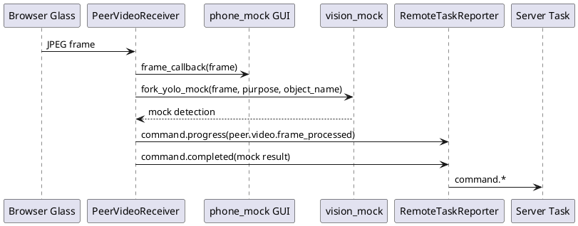
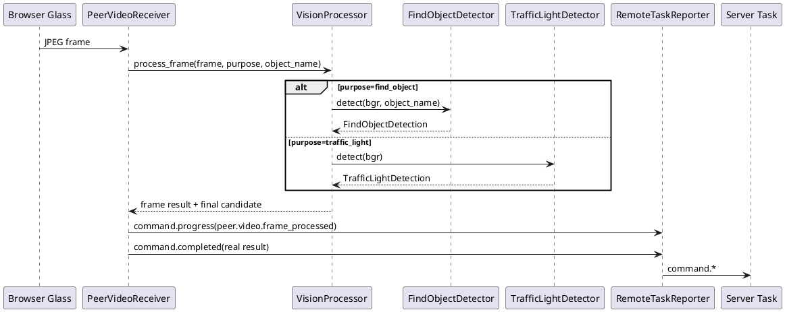
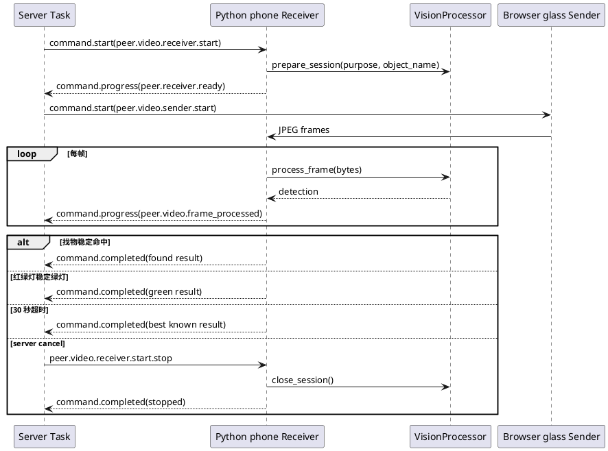

# Python phone YOLO 真实识别迁移设计

## 1. 背景

当前 `for-blind-app` 的找物和红绿灯任务已经改成跨端 peer video：

1. server Task 编排 Python phone 启动 `peer.video.receiver.start`。
2. browser-glass 连接 phone receiver 并持续发送 JPEG 帧。
3. Python phone 端显示视频回显。
4. Python phone 端当前仍调用 `fork_yolo_mock()`，只打印 mock 日志并在超时后返回 mock 结果。

下一步要把旧项目 `/Users/elio/dev/llm-project/OpenAIglasses_for_Navigation/origin-src` 中的 YOLO 相关实现迁移到当前 `examples/dev-support/devices/python-phone`，让 Python phone 真正完成：

1. 找物：根据用户目标物名称识别目标，输出位置、置信度和可播报结果。
2. 红绿灯：识别红、黄、绿灯状态，稳定后输出是否可通行。

## 2. 旧实现梳理

### 2.1 找物相关

主要文件：

```text
/Users/elio/dev/llm-project/OpenAIglasses_for_Navigation/origin-src/yolomedia.py
/Users/elio/dev/llm-project/OpenAIglasses_for_Navigation/origin-src/yoloe_backend.py
```

旧找物链路的核心特点：

| 能力 | 旧实现位置 | 当前可迁移程度 | 说明 |
| --- | --- | --- | --- |
| YOLOE 文本提示分割 | `yoloe_backend.YoloEBackend` | 高 | 封装较小，适合先迁移。支持 `set_text_classes()` 和 `segment()`。 |
| 单目标 prompt | `yolomedia.PROMPT_NAME` | 高 | 当前 Task 已有 `object_name`，可以映射为 YOLOE prompt。 |
| mask/box 选择 | `yolomedia` 中选择最大 mask、记录 tracker id | 中 | 首版只需要最大 mask 或最高置信结果，不迁移完整 TRACK 状态机。 |
| 光流追踪 | `yolomedia` 中 `TRACK` 模式 | 低 | 旧逻辑很重，依赖状态机和交互按键，不适合首版直接迁。 |
| 手部抓取判断 | `mediapipe hand_landmarker.task` | 暂不迁移 | 当前需求是“找到物体”，不是“引导抓取并判断拿到”。 |
| 本地音频播放 | `pygame` / `audio_player` | 不迁移 | 当前播报由 server Task 通过 `context.output.say()` 统一处理。 |

结论：找物首版应迁移 `YoloEBackend` 的模型加载、文本 prompt 和分割检测能力，不迁移 `yolomedia.py` 的完整手势、光流、抓取和音频播放流程。

### 2.2 红绿灯相关

主要文件：

```text
/Users/elio/dev/llm-project/OpenAIglasses_for_Navigation/origin-src/trafficlight_detection.py
/Users/elio/dev/llm-project/OpenAIglasses_for_Navigation/origin-src/navigation_master.py
```

旧红绿灯链路的核心特点：

| 能力 | 旧实现位置 | 当前可迁移程度 | 说明 |
| --- | --- | --- | --- |
| YOLO 红绿灯检测 | `trafficlight_detection.py` | 高 | 直接使用 `ultralytics.YOLO` 加载 `trafficlight.pt`。 |
| 类别过滤 | `FILTERED_CLASSES` | 高 | 过滤 `crossing`、`blank`、`countdown_blank`。 |
| 类别到语义映射 | `LIGHT_NAMES` / `LIGHT_VOICE_MAP` | 高 | `stop/countdown_stop -> red`，`go -> green`，`countdown_go -> yellow`。 |
| 多帧稳定判断 | `detection_history` 多数表决 | 高 | 当前 peer video 本来就是连续帧，适合保留。 |
| HSV 兜底 | `navigation_master.TrafficLightDetector` | 中 | 可作为无模型或低置信度时的可选 fallback，但不作为主路径。 |
| 本地语音播放 | `play_voice_text` | 不迁移 | 当前仍由 server Task 播报。 |

结论：红绿灯首版应迁移 `trafficlight_detection.process_single_frame()` 的“模型推理 + 类别过滤 + 多数表决”逻辑，同时保留 `navigation_master.TrafficLightDetector` 中 HSV 判色作为可配置 fallback。

## 3. 当前接入点

当前 Python phone 的 peer video 入口：

```text
examples/dev-support/devices/python-phone/audio_chat_python_phone_mock/peer_video.py
examples/dev-support/devices/python-phone/audio_chat_python_phone_mock/vision_mock.py
examples/dev-support/devices/python-phone/audio_chat_python_phone_mock/phone_mock.py
examples/dev-support/devices/python-phone/phone.preview.yaml
```

当前调用链：



迁移后，`vision_mock.py` 不再作为主实现，但保留为 fallback/test provider。新增真实视觉模块后调用链变为：



## 4. 目标架构

### 4.1 模块拆分

建议在 Python phone 包内新增独立视觉子模块：

```text
examples/dev-support/devices/python-phone/audio_chat_python_phone_mock/
  vision/
    __init__.py
    config.py
    models.py
    processor.py
    find_object.py
    traffic_light.py
    result.py
```

职责：

| 文件 | 职责 |
| --- | --- |
| `vision/config.py` | 解析 `phone.preview.yaml` 中的 YOLO 配置、模型路径、阈值、设备。 |
| `vision/models.py` | 统一封装模型懒加载和缓存，避免每个 peer session 重复加载大模型。 |
| `vision/result.py` | 定义找物和红绿灯的结构化结果，负责转成 `command.progress` / `command.completed` payload。 |
| `vision/find_object.py` | 迁移 `YoloEBackend`，实现按 `object_name` 设置文本 prompt 并检测目标。 |
| `vision/traffic_light.py` | 迁移 `trafficlight_detection.py` 的 YOLO 红绿灯检测、多数表决和类别映射。 |
| `vision/processor.py` | 根据 `purpose` 路由到找物或红绿灯 detector，并保留 mock fallback。 |

不建议把旧 `yolomedia.py` 整文件复制进来。它包含 GUI、音频、光流、手势、按键状态机和旧 `bridge_io`，会和当前 phone mock 的职责冲突。

### 4.2 配置

在 `phone.preview.yaml` 中新增：

```yaml
vision:
  provider: yolo          # yolo | mock
  device: auto            # auto | cpu | mps | cuda | cuda:0
  frame_stride: 1         # 每 N 帧跑一次模型；1 表示每帧
  save_annotated_frame: runs/audio-chat/python-phone/latest-yolo.jpg
  fallback_to_mock: false
  find_object:
    backend: yoloe
    model_path: ${YOLOE_MODEL_PATH}
    conf: 0.20
    iou: 0.45
    imgsz: 640
    stable_hits: 2
    min_area_ratio: 0.001
  traffic_light:
    backend: yolo
    model_path: ${TRAFFIC_LIGHT_MODEL_PATH}
    conf: 0.25
    history_size: 5
    majority_threshold: 3
    enable_hsv_fallback: true
```

约束：

1. 模型文件不提交到仓库，默认通过环境变量指定。
2. 如果模型路径缺失，启动时不直接崩溃；收到真实 YOLO 任务时返回 `command.failed`，错误说明必须包含缺失的配置名。
3. `provider: mock` 继续用于无模型环境和 CI。
4. `fallback_to_mock` 默认 `false`。真实联调时模型不可用应暴露问题，不能悄悄返回 mock。

### 4.3 依赖

当前 `pyproject.toml` 已有：

```text
opencv-python
numpy 间接依赖
```

真实 YOLO 依赖属于 Python phone 参考端的运行依赖，不属于 server SDK 必需依赖，也不应该要求非 Python 端侧理解 `audio-chat` 的 Python 包 extras。首版放在 phone 端自己的 requirements 文件中：

```text
examples/dev-support/devices/python-phone/requirements.vision.txt
```

安装方式：

```bash
uv pip install -r examples/dev-support/devices/python-phone/requirements.vision.txt
```

`mediapipe` 首版不加入。原因：

1. 当前找物任务目标是“发现目标并定位”，不是“引导手去拿”。
2. 旧 `yolomedia.py` 的手势和光流状态机会显著扩大迁移面。
3. 未来做“拿到目标”或“抓取引导”时再单独引入 `mediapipe` 和 `hand_landmarker.task`。

## 5. 数据结构

### 5.1 单帧检测结果

找物单帧结果：

```json
{
  "type": "find_object",
  "object_name": "水杯",
  "found": true,
  "confidence": 0.82,
  "bbox": [120, 80, 320, 260],
  "center": {"x": 220, "y": 170, "x_ratio": 0.34, "y_ratio": 0.31},
  "area_ratio": 0.046,
  "direction_hint": "front",
  "source": "yoloe"
}
```

红绿灯单帧结果：

```json
{
  "type": "traffic_light",
  "state": "green",
  "raw_class": "go",
  "can_cross": true,
  "confidence": 0.91,
  "bbox": [430, 70, 470, 130],
  "stable": true,
  "history": ["go", "go", "go", null, "go"],
  "source": "yolo"
}
```

### 5.2 最终任务结果

找物最终 result：

```json
{
  "type": "find_object",
  "object_name": "水杯",
  "found": true,
  "confidence": 0.82,
  "message": "已找到水杯，在画面中间偏左",
  "frame_count": 36,
  "source": "yoloe",
  "bbox": [120, 80, 320, 260],
  "center": {"x_ratio": 0.34, "y_ratio": 0.31}
}
```

红绿灯最终 result：

```json
{
  "type": "traffic_light",
  "state": "green",
  "can_cross": true,
  "message": "绿灯稳定，可以在确认安全后通行",
  "frame_count": 18,
  "source": "yolo",
  "confidence": 0.91
}
```

## 6. 找物设计

### 6.1 模型选择

首版使用旧 `yoloe_backend.YoloEBackend` 的思路：

1. `object_name` 来自 `find_object_task` 的 input。
2. Python phone 收到 `peer.video.receiver.start` 后为本 session 创建 detector。
3. detector 调用 `set_text_classes([object_name])`。
4. 每帧调用 `segment(frame_bgr, conf, iou, imgsz, persist=True)`。
5. 从返回结果中选择目标。

### 6.2 目标选择策略

旧 `yolomedia.py` 选择最大 mask，并在 TRACK 模式中优先使用 tracker id。首版策略：

1. 如果有 tracker id 且本帧仍存在该 id，优先选同 id。
2. 否则选择面积最大的 mask。
3. 如果有 bbox 置信度，面积相近时优先置信度更高。
4. 忽略过小目标：`area_ratio < min_area_ratio` 不认为有效找到。

不迁移首版不需要的逻辑：

1. 不做 Enter 键锁定。
2. 不做光流外推。
3. 不做手部抓取判定。
4. 不在 phone 端播放方向音频。

### 6.3 结果稳定

找物不应第一帧闪现就立刻 completed。建议：

1. `stable_hits=2` 或 `stable_hits=3`：连续或近 N 帧命中后认为找到。
2. 若 30 秒内始终未命中，返回 `found=false`。
3. 每帧仍上报 `peer.video.frame_processed`，其中 `data.detection.found` 可为 false。

## 7. 红绿灯设计

### 7.1 模型路径

旧代码使用：

```python
YOLO_MODEL_PATH = r"C:\Users\Administrator\Desktop\rebuild1002\model\trafficlight.pt"
```

当前迁移后改为：

```text
TRAFFIC_LIGHT_MODEL_PATH=/absolute/path/to/trafficlight.pt
```

如果后续要把模型放进统一目录，建议用：

```text
examples/dev-support/models/trafficlight.pt
examples/dev-support/models/yoloe-11l-seg.pt
```

但模型文件本身不要提交到 git。

### 7.2 类别映射

保留旧实现语义：

| 原始类别 | 业务 state | can_cross | 说明 |
| --- | --- | --- | --- |
| `go` | `green` | true | 绿灯 |
| `stop` | `red` | false | 红灯 |
| `countdown_go` | `yellow` | false | 绿灯倒计时，保守处理为不建议通行 |
| `countdown_stop` | `red` | false | 红灯倒计时 |
| `crossing` | 忽略 | false | 斑马线，不作为灯态 |
| `blank` | 忽略 | false | 空白 |
| `countdown_blank` | 忽略 | false | 倒计时空白 |

### 7.3 稳定判断

保留旧 `trafficlight_detection.py` 的多数表决：

1. 保存最近 `history_size=5` 帧。
2. 至少 `majority_threshold=3` 帧同类才认为稳定。
3. 稳定状态改变时打印 INFO 日志。
4. 未稳定时持续 progress，但不 completed。
5. 稳定绿灯可提前 completed；红灯/黄灯默认继续等待，直到超时返回当前稳定状态。

### 7.4 HSV fallback

`navigation_master.TrafficLightDetector` 中有 HSV fallback，可在以下场景启用：

1. `traffic_light.enable_hsv_fallback=true`。
2. YOLO 模型加载失败时不启用，仍应 failed，除非显式允许 fallback。
3. YOLO 没有检测框但图像上半屏存在明显红/黄/绿亮色时，用 HSV 作为低置信度结果。

HSV fallback 的 `source` 必须标为 `hsv_fallback`，不能伪装成 YOLO。

## 8. Peer video 生命周期



## 9. 日志和可观测性

Python phone 端新增日志事件：

| 日志 | 级别 | 触发 |
| --- | --- | --- |
| `vision.model.loading` | INFO | 首次加载模型 |
| `vision.model.loaded` | INFO | 模型加载完成，包含 device、model_path |
| `vision.model.failed` | ERROR | 模型加载失败 |
| `vision.frame.decoded` | DEBUG | JPEG 解码成功 |
| `vision.frame.processed` | INFO | 单帧识别完成，包含 purpose、elapsed_ms、frame_seq |
| `vision.find_object.detected` | INFO | 找物命中 |
| `vision.traffic_light.detected` | INFO | 红绿灯单帧命中 |
| `vision.traffic_light.stable` | INFO | 红绿灯多数表决稳定 |
| `vision.session.completed` | INFO | 端侧视觉任务完成 |

`command.progress(peer.video.frame_processed)` 应包含：

```json
{
  "status": "peer.video.frame_processed",
  "data": {
    "detection": {},
    "provider": "yolo",
    "purpose": "find_object"
  },
  "metrics": {
    "frame_count": 12,
    "frame_size": 52134,
    "decode_ms": 3,
    "inference_ms": 42,
    "elapsed_ms": 48
  }
}
```

## 10. 失败策略

| 场景 | 行为 |
| --- | --- |
| 模型路径缺失 | `command.failed`，message 写明缺失的环境变量或配置项。 |
| `ultralytics` 未安装 | `command.failed`，提示在 Python phone 端安装 `requirements.vision.txt`。 |
| 单帧解码失败 | 记录 WARNING，继续等待下一帧。 |
| 单帧推理异常 | 记录 ERROR，连续失败达到阈值后 `command.failed`。 |
| 30 秒未找到物体 | `command.completed(found=false)`。 |
| 30 秒未稳定绿灯 | `command.completed(state=best_known_or_unknown, can_cross=false)`。 |
| server 取消 | 停止 receiver，释放模型 session 状态，不卸载全局模型缓存。 |

## 11. 实施阶段

### Phase 1：抽象视觉处理接口

目标：不引入真实模型，先把 `fork_yolo_mock()` 包到统一接口后面。

改动：

1. 新增 `vision/result.py`、`vision/processor.py`。
2. `PeerVideoReceiver` 改为依赖 `VisionProcessor`。
3. mock provider 实现当前行为。
4. 补测试：mock provider 下结果不变。

### Phase 2：迁移红绿灯 YOLO

目标：优先完成红绿灯，因为旧实现较小、无手势和光流依赖。

改动：

1. 新增 `vision/traffic_light.py`。
2. 迁移 `LIGHT_NAMES`、`FILTERED_CLASSES`、多数表决逻辑。
3. 配置 `TRAFFIC_LIGHT_MODEL_PATH`。
4. 用本地图片或短视频帧做离线测试。
5. peer video 联调验证 `traffic_light_task` 能返回真实绿/红/黄状态。

### Phase 3：迁移找物 YOLOE

目标：完成按自然语言目标名找物。

改动：

1. 新增 `vision/find_object.py`。
2. 从旧 `yoloe_backend.py` 迁移 `YoloEBackend`，去掉硬编码 `cuda`，支持 `auto/cpu/mps/cuda`。
3. 用 `object_name` 设置文本 prompt。
4. 输出 bbox、center、area_ratio、direction_hint。
5. peer video 联调验证 `find_object_task` 能识别指定物体。

### Phase 4：结果可视化

目标：phone 窗口不仅显示原始帧，也显示识别结果。

改动：

1. 在 `VisionProcessor` 返回 annotated frame。
2. `phone_mock._handle_peer_video_frame()` 或 `PeerVideoReceiver` 支持把 annotated frame 发给 GUI。
3. 保存 `latest-yolo.jpg` 方便排障。

### Phase 5：性能和稳定性

目标：保证本机长时间运行不阻塞控制链路。

改动：

1. 支持 `frame_stride`。
2. 支持模型推理放入线程池，避免阻塞 aiohttp WebSocket 收帧。
3. 添加帧队列丢帧策略：只处理最新帧。
4. 增加 `/api/debug` 或 phone summary 中的 vision 状态快照。

## 12. 测试计划

### 单元测试

| 测试 | 目标 |
| --- | --- |
| `test_vision_processor_routes_find_object` | `purpose=find_object` 路由到找物 detector。 |
| `test_vision_processor_routes_traffic_light` | `purpose=traffic_light` 路由到红绿灯 detector。 |
| `test_traffic_light_majority_vote` | 多数表决逻辑稳定输出。 |
| `test_traffic_light_filters_crossing_blank` | 过滤斑马线和空白类别。 |
| `test_find_object_result_message` | bbox/center 转成可播报方位。 |
| `test_missing_model_reports_failed` | 模型缺失时不返回 mock，明确 failed。 |

### 离线图片测试

新增测试数据目录：

```text
testdata/vision/
  traffic_light/
  find_object/
```

模型文件不提交，测试默认跳过真实模型；只有设置环境变量时运行：

```bash
TRAFFIC_LIGHT_MODEL_PATH=/path/to/trafficlight.pt \
YOLOE_MODEL_PATH=/path/to/yoloe-11l-seg.pt \
uv run python -m pytest examples/dev-support/tests/python_phone/test_phone_yolo_vision.py -q
```

### 跨设备联调

启动顺序：

```bash
uv run audio-chat.server.run --config examples/for-blind-app/audio-server/server.yaml
uv run python -m audio_chat_python_phone_mock --config examples/dev-support/devices/python-phone/phone.preview.yaml
uv run audio-chat.web.open --print-url
```

环境变量：

```bash
export TRAFFIC_LIGHT_MODEL_PATH=/absolute/path/to/trafficlight.pt
export YOLOE_MODEL_PATH=/absolute/path/to/yoloe-11l-seg.pt
```

观察点：

1. Python phone 窗口有视频回显。
2. Python phone 日志出现 `vision.model.loaded`。
3. 每帧出现 `vision.frame.processed`。
4. server `command-events.jsonl` 出现 `peer.video.frame_processed`，且 `source` 为 `yolo` 或 `yoloe`。
5. 找物任务最终 `source=yoloe`。
6. 红绿灯任务最终 `source=yolo`，且 `can_cross` 与灯态一致。

## 13. 风险和取舍

| 风险 | 影响 | 处理 |
| --- | --- | --- |
| 模型文件不在仓库 | 无法直接跑真实识别 | 通过环境变量和文档明确配置，测试无模型时跳过。 |
| YOLOE 在 Mac 上性能不稳定 | phone 预览卡顿 | 支持 `frame_stride` 和最新帧丢帧策略。 |
| 旧找物逻辑过重 | 迁移周期失控 | 首版只迁移文本 prompt 检测，不迁移手势/光流/音频。 |
| 类别名和模型训练集不一致 | 红绿灯状态错误 | 配置化 class mapping，并在启动日志打印模型类别。 |
| mock fallback 掩盖真实问题 | 联调误判 | `fallback_to_mock=false`，真实模式模型不可用就 failed。 |

## 14. 首版验收标准

1. `phone.preview.yaml` 可配置 `vision.provider=yolo`。
2. 模型路径正确时，Python phone 启动任务后懒加载模型。
3. 找物任务能根据 `object_name` 做 YOLOE 文本 prompt 检测。
4. 红绿灯任务能用 `trafficlight.pt` 输出红、黄、绿或 unknown。
5. 每帧都有真实识别日志，不再打印 `yolo.mock.frame_processed`。
6. server Task 最终结果中 `source` 为 `yolo` 或 `yoloe`，不是 `mock`。
7. 无模型或依赖缺失时，Task failed 并给出明确错误，不静默降级为 mock。

## 15. 实施记录

### 阶段 1：抽象视觉处理接口

- 状态：已完成
- 目标：把 `fork_yolo_mock()` 收口到统一 `VisionProcessor` 后面，保证真实 YOLO 和 mock 共享 peer video 调用链。
- 实现：新增 `audio_chat_python_phone_mock.vision` 子模块，包含 `config.py`、`processor.py`、`result.py`；`PeerVideoReceiver` 改为调用 `VisionProcessor.prepare_session()`、`process_frame()` 和 `build_final_result()`。
- 文件：`examples/dev-support/devices/python-phone/audio_chat_python_phone_mock/vision/*`、`peer_video.py`、`phone_mock.py`。
- 验证：新增 `test_vision_processor_mock_provider_keeps_existing_result_shape`，确认 mock provider 不依赖真实模型且结果结构保持兼容。

### 阶段 2：迁移红绿灯 YOLO

- 状态：已完成
- 目标：迁移旧 `trafficlight_detection.py` 的 YOLO 检测、类别过滤和多数表决逻辑。
- 实现：新增 `vision/traffic_light.py`，支持 `trafficlight.pt`、`FILTERED_CLASSES`、`go/stop/countdown_*` 到 `green/red/yellow` 的映射，以及 history majority 稳定判断；保留 HSV fallback，并把 fallback source 标记为 `hsv_fallback`。
- 文件：`vision/traffic_light.py`、`phone.preview.yaml`。
- 验证：新增 `test_traffic_light_majority_vote_with_fake_model`，用假模型验证 3 帧稳定绿灯后 `can_cross=true`。

### 阶段 3：迁移找物 YOLOE

- 状态：已完成
- 目标：迁移旧 `yoloe_backend.py` 的文本 prompt 检测能力，按 `object_name` 识别目标。
- 实现：新增 `vision/find_object.py`，支持 `YOLOE.set_classes([object_name], get_text_pe(...))`、mask/box 归一化、最大目标选择、稳定命中计数、bbox/center/area_ratio/direction_hint 输出。
- 文件：`vision/find_object.py`、`vision/models.py`。
- 验证：代码路径已通过编译检查；真实 YOLOE 模型联调需要在 Python phone 端安装 `requirements.vision.txt` 后进行。

### 阶段 4：配置和依赖

- 状态：已完成
- 目标：让 Python phone 默认可指向本机 modelscope 模型目录，同时不把视觉依赖加入 SDK 基础安装。
- 实现：`phone.preview.yaml` 新增 `vision.provider=yolo`，模型路径指向 `/Users/elio/.cache/modelscope/hub/models/archifancy/AIGlasses_for_navigation`；`pyproject.toml` 新增 `vision` optional dependencies。
- 文件：`phone.preview.yaml`、`pyproject.toml`。
- 验证：新增 `test_phone_preview_config_declares_real_yolo_models` 和 `test_vision_config_uses_modelscope_default_paths`。

### 阶段 5：待人工验收

- 状态：待人工验收
- 目标：用真实 browser-glass + Python phone + server 观察端到端识别结果。
- 验收步骤：

```bash
uv pip install -e ".[vision,gui]"
uv run audio-chat.server.run --config examples/for-blind-app/audio-server/server.yaml
uv run python -m audio_chat_python_phone_mock --config examples/dev-support/devices/python-phone/phone.preview.yaml
uv run audio-chat.web.open --print-url
```

- 观察点：Python phone 日志应出现 `vision.model.loaded`、`vision.frame.processed`；server `command-events.jsonl` 的 `peer.video.frame_processed` 应包含 `source=yolo` 或 `source=yoloe`；最终 Task result 不应再是 `source=mock`。
