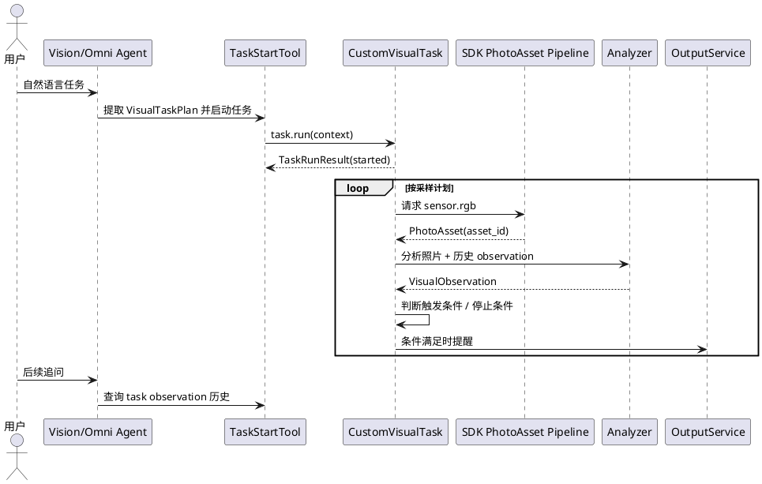

# for-blind-app 自定义视觉功能设计

更新时间：2026-05-22

本文只描述 for-blind-app 应用侧的自定义视觉功能。SDK 通用照片资产、turn buffer、claim、模型视觉 append 和协议设计见 [SDK 照片资产处理链路设计](../../../agent-server/docs/internal/photo-asset-pipeline-design.md)。

## 1. 功能定位

自定义视觉功能让用户用自然语言定义拍摄、识别、监测或定时任务。它不是固定的导航流程，也不是单次 Omni 问答，而是基于通用多模态模型和可配置 pipeline 的应用层能力。

核心特点：

1. 自然语言提取参数：用户用一句话即可定义拍摄范围、识别对象、监测条件、循环频率、持续时间和提醒方式。
2. 多轮上下文：连续拍照或监测过程中保留 observation 历史，用户可以后续追问、补充条件或要求总结。
3. 条件触发与循环：任务可按时间、次数、条件或持续时长自动执行，无需用户重复下指令。
4. 场景泛化：不绑定 YOLO 等固定模型，只要求 SDK 提供照片资产和 Task 运行时；应用层可选择 Omni、Vision/VL、专用模型或端侧模型作为 analyzer。

## 2. 能力类型

应用侧先支持三类自定义视觉能力：

| 类型 | 说明 | 典型输出 |
| --- | --- | --- |
| 360 识别 | 在短时间内多次采样，形成当前环境或物品分布描述。 | 多轮环境描述、物品清单、方位提示。 |
| 定时任务 | 到点触发提醒、总结或历史分析。 | 语音提醒、震动、每日/每周总结。 |
| 万物监测 | 按条件持续监测目标、状态或变化。 | 条件满足时提醒，否则继续循环或按停止条件结束。 |

已有找物、红绿灯和 peer video 任务不迁入 SDK core；它们可以逐步把结果适配为同一套 observation 历史。

## 3. 需求样例

### 3.1 360 识别

| 场景 | 用户自然语言示例 | 应用提取参数 | 运行逻辑 |
| --- | --- | --- | --- |
| 进入陌生房间，初步了解环境 | 帮我转一圈，看一下房间里都有什么 | 拍照间隔=1秒；识别对象=全场景；输出模式=多轮描述 | 转一圈拍摄 -> 图像送入模型 -> 生成房间布局、物品描述 -> 用户后续可提问细节 |
| 进入办公室，识别桌面物品 | 帮我转一圈，告诉我桌面上有什么文件和设备 | 拍照间隔=1秒；识别对象=文件、电脑、物品；输出模式=多轮描述 | 转一圈拍摄 -> 模型识别物品 -> 输出语音描述 -> 用户可问“哪个文件在左边” |
| 仓库货架检查 | 帮我把仓库货架扫一遍，看哪些货缺货 | 拍照间隔=1秒；识别对象=货物、货架；输出模式=多轮描述 | 转一圈拍摄 -> 模型识别每个货架 -> 输出缺货情况 -> 用户可继续问“右侧第二排缺什么” |

### 3.2 定时任务

| 场景 | 用户自然语言示例 | 应用提取参数 | 运行逻辑 |
| --- | --- | --- | --- |
| 会议提醒 | 每周一上午9点提醒我会议日程 | 任务类型=会议提醒；触发时间=周一9:00 | 定时触发 -> 模型生成会议提醒 -> 输出语音 |
| 药物服用提醒 | 每天中午12点提醒我吃药 | 任务类型=吃药提醒；触发时间=12:00 | 定时触发 -> 生成提醒 -> 输出语音或震动 |
| 晚上总结 | 每天晚上8点帮我总结今天看到的物品变化 | 任务类型=总结；触发时间=20:00 | 定时触发 -> 模型分析历史拍摄内容 -> 输出语音总结 |

### 3.3 万物监测

| 场景 | 用户自然语言示例 | 应用提取参数 | 运行逻辑 |
| --- | --- | --- | --- |
| 检测他人情绪 | 帮我观察这个人有没有生气 | 拍照间隔=1秒；识别对象=人脸/表情；触发条件=愤怒情绪 | 每秒拍照 -> 模型分析表情 -> 情绪愤怒时语音提醒，否则持续监测 |
| 检测公交车经过 | 每秒看一下前面有没有公交车经过 | 拍照间隔=1秒；识别对象=公交车；触发条件=公交车出现 | 每秒拍照 -> 模型识别公交车 -> 出现时提醒，未出现继续循环 |
| 检测水是否开 | 接下来5分钟帮我看水有没有开 | 拍照间隔=1秒；识别对象=水流/水壶；持续时间=5分钟；触发条件=水流出现 | 每秒拍照 -> 模型识别水流 -> 出现时提示；5分钟结束停止 |
| 宠物活动监测 | 帮我观察宠物在客厅的动作，如果靠近门就提醒我 | 拍照间隔=1秒；识别对象=宠物；触发条件=靠近门 | 每秒拍照 -> 模型识别宠物 -> 条件满足触发提醒，否则继续循环 |

## 4. 应用侧对象

### 4.1 VisualTaskPlan

`VisualTaskPlan` 是从用户自然语言提取出的任务计划：

```json
{
  "task_type": "scene_scan | scheduled_reminder | object_monitor",
  "user_goal": "帮我观察这个人有没有生气",
  "sampling": {
    "interval_seconds": 1,
    "duration_seconds": 300,
    "max_frames": 300
  },
  "targets": ["人脸", "表情"],
  "trigger": {
    "type": "condition",
    "condition_text": "出现愤怒情绪"
  },
  "output": {
    "mode": "voice | vibration | task_signal",
    "summary_style": "brief"
  }
}
```

参数提取应尽量由大模型完成，代码只做 schema 校验、默认值填充和安全边界限制。

### 4.2 VisualObservation

`VisualObservation` 是一次采样或一次分析结果：

```json
{
  "observation_id": "obs_xxx",
  "task_id": "task_xxx",
  "asset_id": "asset_xxx",
  "captured_at_ms": 1760000000000,
  "direction": "front",
  "analyzer": "omni | vision_vl | tool_internal | device_model",
  "structured_result": {},
  "summary": "前方出现一辆公交车。",
  "confidence": 0.82,
  "trigger_matched": true
}
```

后续多轮追问读取 observation 历史，不重新消费旧照片。

## 5. 运行流程



## 6. 与 SDK 的边界

SDK 负责：

1. `sensor.rgb` 协议采集。
2. `PhotoAsset`、`TurnPhotoBuffer`、claim 和异步归档。
3. Omni / Vision 的模型视觉 append。
4. Task 生命周期、TaskSignal 和运行产物。

for-blind-app 负责：

1. 自然语言参数提取 prompt 和 schema。
2. `VisualTaskPlan` / `VisualObservation` 的应用语义。
3. 360 识别、定时任务、万物监测的 Task 类型。
4. analyzer 选择和业务触发条件判断。
5. 用户可听提示、震动和后续追问体验。

## 7. 关键约束

1. Task `run()` 只返回启动结果，不能同步跑完整个长周期任务。
2. 长周期任务默认不把每帧原图 append 给主模型。
3. 触发提醒只输出必要结论，不刷屏。
4. 用户打断、取消任务或连续对话结束时必须停止采样。
5. 业务代码不能绕过 Context API 直接操作内部 WebSocket 或硬编码设备 ID。
6. 测试不能只用纯 mock 冒充场景验收；关键场景需要图片 fixture、回放数据或端侧联调方案。
