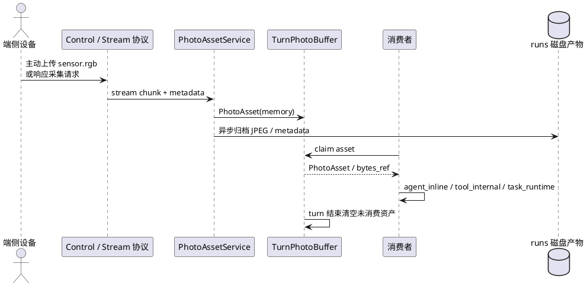

# 照片资产处理链路重构设计

更新时间：2026-05-22

当前状态：已完成首轮实现并进入实现对齐状态。本文用于约束 for-blind-app 的图片处理链路重构，覆盖协议 fixture、Server SDK、Device SDK、Omni / Vision 模型上下文拼接、Tool / Task 资产消费语义和测试体系更新。

## 1. 背景

当前 for-blind-app 已经存在多条图片处理路径：

1. `capture_photo` 请求一帧 `sensor.rgb`，再由 Vision 链路把工具返回的图片资产 append 给主模型。
2. Omni Realtime 在用户语音期间按固定频率采集图片，并直接 append 到 Realtime provider。
3. `interpret_image` / `interpret_current_view` 在 Tool 内部调用图片理解模型，但默认没有暴露给主模型。
4. 找物、红绿灯等长周期视觉任务通过 peer video 编排端侧，server 不直接消费每一帧。

这些路径能覆盖当前功能，但缺少统一的照片资产生命周期、消费语义和协议约束。接下来要支持 360 识别、万物监测、定时视觉任务、长周期视觉任务和已有找物 / 红绿灯任务，需要先把“照片如何上传、如何管理、如何被消费”拆清楚。

## 2. 目标和非目标

目标：

1. 统一 server 内照片资产对象，所有 `sensor.rgb` 上传都先进入同一资产模型。
2. 支持两类上传方式：端侧主动上传、server 发起采集请求后端侧上传。
3. 引入 turn 级照片资产 buffer，确保照片资产只在当前 turn 内自动可消费。
4. 明确业务消费只有三类：主模型直接看图、Tool 内部分析、Task 运行时分析。
5. 区分 Omni Realtime 与 Vision/VL 模型的 append 方式，避免把 provider 差异塞进业务 Tool。
6. 明确协议层变更、版本风险和协议测试范围。

非目标：

1. 本设计不把找物、红绿灯等业务算法抽进 SDK core。
2. 本设计不要求 server 统一处理所有视频帧；peer video 仍允许端侧直接处理长视频流。
3. 本设计不把运行产物排障读取定义为业务消费。
4. 本设计不在第一阶段强制迁移所有历史工具；迁移应分阶段、可回滚。

## 3. 总体模型

照片处理链路按三个独立问题拆分：照片上传、照片管理、照片消费。



### 3.1 照片上传

上传方式只有两类：

| 上传方式 | 发起方 | 协议入口 | 典型场景 |
| --- | --- | --- | --- |
| 端侧主动上传 | device | `/ws/stream` 输入 chunk | 端侧主动拍照、端侧连续采样、调试上传。 |
| server 请求采集 | server | `stream.control.open.requested` -> `/ws/stream` | `capture_photo`、realtime-video 自动采样、Task 周期采样。 |

两种上传方式进入 server 后都必须统一成为 `PhotoAsset`，业务层不再关心它来自主动上传还是请求采集。

### 3.2 照片管理

上传成功后，照片进入 `TurnPhotoBuffer`。buffer 是业务自动消费边界，磁盘归档是排障边界，二者不能混淆。

管理规则：

1. 每个 `sensor.rgb` 上传成功后生成一个 `PhotoAsset`。
2. `PhotoAsset` 先进入内存 buffer，主链路不等待磁盘写入完成。
3. 磁盘归档异步执行，写入 runs 目录，用于排障和回放证据。
4. 上传方可以设置 `ttl_seconds`，为空表示使用 server 默认有效期。
5. `ttl_seconds` 只控制照片在当前 turn buffer 内的最长可消费时间。
6. 无论 TTL 是否到期，只要当前用户 turn 结束，buffer 内未消费资产都必须清除。
7. 用户打断、provider 失败、正常完成都算 turn 结束。
8. 磁盘 runs 产物不参与消费状态，排障读取不会占用业务消费机会。

### 3.3 照片消费

业务消费只有三类：

| 消费方式 | 名称 | 主模型是否看到原图 | 典型场景 |
| --- | --- | --- | --- |
| 主模型直接看图 | `agent_inline` | 是 | 用户问“前面有什么”“看一下这张图”。 |
| Tool 内部分析 | `tool_internal` | 否 | OCR、固定格式图片解读、专用视觉模型工具。 |
| Task 运行时分析 | `task_runtime` | 通常否 | 360 识别、万物监测、找物、红绿灯、长周期监测。 |

`realtime-video` 不是第四种消费方式，它是自动采样策略。采样得到的照片最终仍由 `agent_inline` 消费，只是不同模型类型的 append 时机不同。

## 4. 核心对象

### 4.1 PhotoAsset

`PhotoAsset` 是 server 内部照片资产对象，建议字段如下：

```json
{
  "asset_id": "asset_xxx",
  "user_id": "user-001",
  "session_id": "device-or-session",
  "turn_id": "turn_xxx",
  "stream_type": "sensor.rgb",
  "mime_type": "image/jpeg",
  "created_at_ms": 1760000000000,
  "expires_at_ms": 1760000005000,
  "memory_ref": "in-memory-buffer-key",
  "disk_uri": "/runs/.../photos/asset_xxx.jpg",
  "size_bytes": 123456,
  "metadata": {
    "upload_mode": "device_push | server_requested",
    "request_id": "asset_req_xxx",
    "correlation_id": "turn_or_task_id",
    "producer_id": "device_id",
    "device_role": "glass",
    "capture_reason": "capture_photo | realtime_video | task_sampling",
    "captured_at_ms": 1760000000000,
    "sequence_index": 0,
    "direction": "front"
  }
}
```

说明：

1. `turn_id` 是自动消费和 turn 结束清理的关键字段。
2. `memory_ref` 用于当前 turn 内快速读取，避免业务主链路等待磁盘。
3. `disk_uri` 可以异步补齐；业务消费优先读取内存，排障读取走磁盘。
4. `direction` 第一阶段使用默认值 `front`；未来由端侧 IMU / 姿态融合解析后写入，方便 Vision/VL 组装“时间戳和方位信息”。

### 4.2 TurnPhotoBuffer

`TurnPhotoBuffer` 管理当前用户 turn 的照片资产。

职责：

1. 按 `user_id + session_id + turn_id` 存储 PhotoAsset。
2. 支持按条件查询未消费照片。
3. 支持业务消费 claim，确保每个资产只被一个业务消费路径拿走。
4. turn 结束时清空 buffer。
5. 对已归档磁盘产物不做删除承诺，磁盘清理由 runs retention 策略负责。

状态建议：

```text
buffered -> claimed -> consumed
buffered -> expired
buffered/claimed -> cleared_by_turn_end
```

`claimed` 用于避免两个消费者并发拿到同一张图。只有 claim 成功后才允许进入模型 append、Tool 内部分析或 Task 判断。

### 4.3 PhotoAssetClaim

业务消费必须显式声明消费方式：

```json
{
  "claim_id": "claim_xxx",
  "asset_id": "asset_xxx",
  "consumer": "agent_inline | tool_internal | task_runtime",
  "owner": "VisionRealtimeAgentCore | OmniRealtimeAgentCore | tool:capture_photo | task:custom_visual_task",
  "claimed_at_ms": 1760000001000,
  "reason": "tool_result_followup | realtime_video_append | task_observation"
}
```

排障读取不创建 claim。

## 5. 模型 append 策略

不同模型对图片 append 的方式差异较大，必须抽成模型适配层，而不是让 Tool / Task 直接感知 provider 差异。

建议抽象：

```text
ModelVisualAppender
  append_agent_inline(asset, context)
  append_visual_assets(visual_assets, context)
  flush_turn_assets(context)
```

### 5.1 Omni Realtime

Omni 模式下，realtime-video 开启后：

1. 每次唤醒或连续对话开始时生成 `turn_id`。
2. server 按配置频率请求 `sensor.rgb`。
3. 每张图片上传后生成 `PhotoAsset`。
4. `OmniVisualAppender` 立即 claim 并 append 到 Realtime provider。
5. provider 自己处理图像与音频时间关系。
6. turn 结束时停止采样并清 buffer。

Omni 不适合在 turn 结束后再批量 append，因为 Realtime provider 的上下文时间关系依赖输入流顺序。

### 5.2 Vision / VL 模型

Vision/VL 模式下，realtime-video 开启后：

1. 用户说话期间只采集并放入 buffer，不立刻调用模型。
2. ASR final 或 turn close 前，从 buffer 中按时间顺序 claim 当前 turn 的照片。
3. 构造单次模型请求，把用户文本和图片一起放入同一个用户 turn。
4. content 文本必须说明图片顺序、相对时间和方位信息。

示例：

```text
用户语音内容：帮我看看前面有什么。

以下是本轮语音期间采集的当前视野图片：
1. 第 1 张：语音开始后 0.2 秒，方向=front。
2. 第 2 张：语音开始后 1.2 秒，方向=front。
3. 第 3 张：语音开始后 2.2 秒，方向=front。
请按时间顺序理解这些图片，只基于本轮图片回答。
```

然后在同一个 user content 中追加对应 image blocks。

## 6. Tool / Task 资产返回语义

历史 `ToolResult.assets` 容易产生歧义：资产到底是给主模型看的，还是 Tool 内部已经消费过、只用于排障？重构后需要显式语义。

建议新增业务级视觉资产返回描述：

```json
{
  "asset_id": "asset_xxx",
  "visibility": "append_to_agent | internal_only",
  "consumer": "agent_inline | tool_internal | task_runtime",
  "text_context": "这是刚拍摄的当前画面，请结合用户问题回答。",
  "claim_required": true
}
```

规则：

1. `append_to_agent`：Tool 调度器或 AgentCore 可把资产和工具文本一起 append 给主模型。
2. `internal_only`：主模型只能看到 Tool 返回的文本或结构化结果，不能自动看到原图。
3. Task 运行时默认不把原始图片 append 给主模型，只返回 `VisualObservation` 或 `TaskSignal`。
4. `ToolResult.assets` 不能再作为视觉自动 append 通道；重构时要移除 `ModelMessageManager` 对该字段的自动 append 依赖。
5. 如果历史字段仍因其他非视觉用途存在，也只能作为普通结果字段，不能参与主模型看图链路。

Task 的启动语义需要单独约束：当前 `TaskEngine.create()` 会把 `task.run(context)` 提交给后台 `TaskRunner`，只在 `start_result_timeout_seconds` 内等待启动阶段的 `TaskRunResult`，随后返回 `TaskRef`。因此长周期视觉 Task 不能把 `run()` 设计成同步跑完整个监测流程；`run()` 只负责启动、订阅或初始化，后续观察结果应通过 `VisualObservation`、`TaskSignal`、`task.event.*` 和可追问历史推进。

## 7. 协议层变更

本次重构需要协议层修改，但应保持事件名稳定，优先扩展 payload / stream metadata。

### 7.1 stream chunk metadata 扩展

`sensor.rgb` stream header 的 `metadata` 建议支持：

| 字段 | 必填 | 说明 |
| --- | --- | --- |
| `request_id` | 条件 | server 请求采集时必填，用于匹配 pending 请求。 |
| `correlation_id` | 否 | 连续采样或 Task 关联 ID。 |
| `turn_id` | 否 | 当前用户 turn ID。端侧不知道时由 server 写入。 |
| `ttl_seconds` | 否 | 上传方请求的 buffer 有效期，单位秒。 |
| `capture_reason` | 否 | `capture_photo`、`realtime_video`、`task_sampling`、`device_push` 等。 |
| `captured_at_ms` | 否 | 端侧实际拍摄时间。 |
| `sequence_index` | 否 | 同一 turn / correlation 下的图片序号。 |
| `direction` | 否 | 用户语义方向，第一阶段默认 `front`；未来由 IMU / 姿态融合解析，例如 `front`、`left`、`right`。 |

风险：

1. 老端侧可能不会上传 `ttl_seconds` / `turn_id`，server 必须提供默认值。
2. `metadata` 字段不能放图片 bytes。
3. `ttl_seconds` 只能影响 buffer，不影响 runs 产物保留。

### 7.2 stream.control.open.requested payload 扩展

server 请求采集 `sensor.rgb` 时，payload 建议支持：

```json
{
  "stream_type": "sensor.rgb",
  "mode": "single | continuous",
  "format": "jpeg",
  "request_id": "asset_req_xxx",
  "correlation_id": "turn_or_task_id",
  "turn_id": "turn_xxx",
  "ttl_seconds": 5,
  "capture_reason": "realtime_video",
  "frequency_hz": 1,
  "sample_count": 1,
  "direction": "front"
}
```

兼容策略：

1. 已有 `request_id`、`correlation_id` 继续保留。
2. 新字段均为可选字段。
3. Device SDK 可逐步支持；旧端侧忽略未知字段不应失败。

### 7.3 设备能力声明扩展

`supports.sensors[].default` 可增加照片策略默认值：

```yaml
supports:
  sensors:
    - type: rgb
      modes: [single, continuous]
      default:
        format: jpeg
        frequency_hz: 1
        ttl_seconds: 5
        direction: front
```

风险：

1. 能力声明只表达默认采集策略，不表达业务消费方式。
2. 不能用能力声明替代 turn buffer 的生命周期控制。

### 7.4 不新增的协议项

第一阶段不新增以下事件：

1. 不新增 `photo.*` 控制事件。
2. 不新增独立图片上传 HTTP API。
3. 不新增点对点 `target_device_id` 字段。
4. 不改变 stream chunk 二进制帧格式。

保持事件名稳定能降低 Device SDK 和参考端同步风险。

## 8. 风险和边界

| 风险 | 影响 | 设计约束 |
| --- | --- | --- |
| 协议字段扩展导致旧端侧失败 | 端侧不能响应采集请求 | 新字段全部可选，端侧必须忽略未知字段。 |
| 异步落盘导致业务读取不到文件 | Tool 读取磁盘失败 | 业务消费优先读内存；磁盘只作归档。 |
| consume-once 影响多模型链路 | 同一图被多个消费者抢占 | 使用 claim，消费方必须显式声明 `consumer`。 |
| Tool 内部 analyzer 的原图泄漏给主模型 | 主模型看到不该看到的照片 | 用 `visibility` 控制 append，不再仅凭 `assets` 自动 append。 |
| Omni 与 VL append 时序不一致 | 回答引用错图或时间关系错乱 | 统一 `ModelVisualAppender` 接口，provider-specific 实现。 |
| turn 结束边界不清 | buffer 泄漏或跨轮污染 | 正常完成、打断、失败都触发 clear。 |

## 9. 测试策略

协议变更必须按 P0 / L1 / L3 分层补测试。

### 9.1 P0 协议资产测试

新增或更新：

1. `protocol/docs/protocol.md`：补充 `sensor.rgb` metadata 和 `stream.control.open.requested` payload 扩展说明。
2. `protocol/data/fixtures/events/stream-open-requested.json`：增加可选照片字段样例。
3. `protocol/data/fixtures/streams/rgb-header.json`：增加 `ttl_seconds`、`captured_at_ms`、`direction` 等 metadata。
4. `protocol/data/fixtures/invalid/events/control-payload-media.json`：继续确保控制 payload 禁止媒体 bytes。
5. `protocol/protocol-tests/test_protocol_schema_examples.py`：覆盖新 fixture。
6. `protocol/protocol-tests/test_stream_chunk_codec_contract.py`：覆盖 metadata 透传。

必跑命令：

```bash
uv run python -m pytest protocol/protocol-tests -q
uv run python -m pytest -m protocol_spec -q
```

### 9.2 L1 Server / Device 行为测试

Server SDK：

1. `AssetService` 收到 `sensor.rgb` 后生成 PhotoAsset 并进入 turn buffer。
2. `ttl_seconds` 只影响 buffer，不影响 runs 归档。
3. turn 正常完成、打断、失败都会清空 buffer。
4. 磁盘异步归档失败不阻塞模型主链路，但必须记录 system / asset event。
5. 视觉资产不再无条件 append，必须看 `visibility`。

Device SDK：

1. 老端侧忽略 `turn_id`、`ttl_seconds`、`capture_reason` 等未知字段仍能上传。
2. 新端侧可把这些字段写入 stream metadata。
3. `request_id` 仍能关联 server pending request。

建议命令：

```bash
uv run python -m pytest audio-server/protocol-tests -q
uv run python -m pytest audio-device/python/protocol-tests -q
uv run python -m pytest -m sdk -q
uv run python -m pytest -m device_sdk -q
```

### 9.3 L3 应用能力测试

for-blind-app：

1. `capture_photo` 返回 `append_to_agent` 时，Vision/VL 主模型能看到图片。
2. Tool 内部 analyzer 返回 `internal_only` 时，主模型只能看到解读结果。
3. Omni realtime-video 每张图即时 append。
4. Vision/VL realtime-video 在 ASR final 后批量 append 当前 turn 图片，并带时间戳说明。
5. 用户打断后 buffer 被清理，不污染下一轮。
6. 长周期 Task 不自动把每帧照片 append 给主模型，只返回 observation / TaskSignal。

建议命令：

```bash
uv run python -m pytest examples/for-blind-app/app-tests -q
uv run python -m pytest examples/for-blind-app/replay-tests -q
```

## 10. 结论

本次重构应先统一照片资产生命周期，再迁移模型 append 和 Tool / Task 消费语义。协议层应保持事件名和二进制帧格式稳定，只扩展 `sensor.rgb` 相关 metadata 和采集请求 payload。这样能支持长周期视觉任务，同时降低对现有 Device SDK、browser-glass、python-phone、iOS 和 ESP32 参考端的破坏面。
