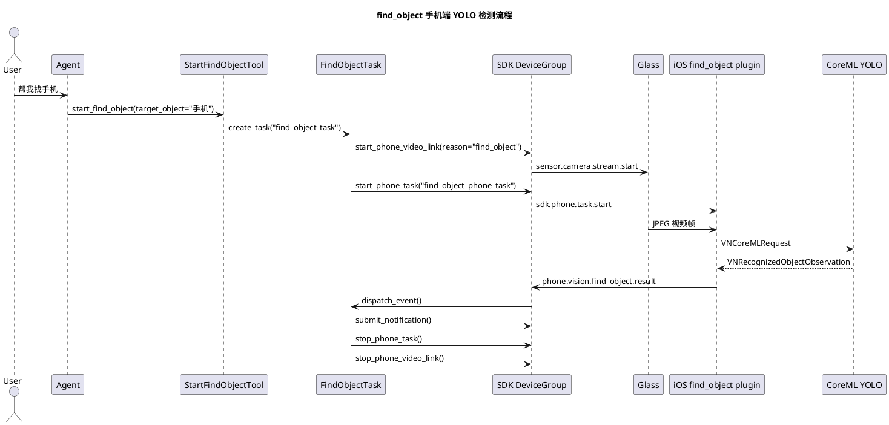

# FindObject YOLO 手机端迁移实施文档

更新时间：2026-05-02

## 1. 需求理解

本次目标是把旧项目 `/Users/elio/dev/llm-project/OpenAIglasses_for_Navigation` 中“寻找物体”的视觉检测能力迁移到当前三端 SDK 架构的业务层。迁移后：

1. 服务端只负责通过 `start_find_object` Tool 创建 `find_object_task`。
2. `find_object_task` 只通过 SDK `DeviceGroupContext` 启动眼镜到手机的视频链路和手机任务。
3. 真实 iPhone 手机端插件优先使用本机 CoreML YOLO 模型做检测，把结构化结果上报服务端。
4. 没有打包模型资源时保留启发式检测后备，只用于链路自测，不代表正式识别效果。

本次不修改 `openaiglass-sdk`，也不在业务侧手写三端协议、设备绑定、视频流或任务事件底座。

## 2. 旧项目现状分析

旧项目主实现位于 `origin-src/yolomedia.py` 和 `origin-src/yoloe_backend.py`：

1. `yoloe_backend.py` 使用 Ultralytics `YOLOE/YOLO` 加载分割模型，并输出 `masks`、`boxes`、`names` 和 `ids`。
2. `yolomedia.py` 在服务端 Python 进程内完成目标分割、目标居中引导、光流追踪、手部检测、手物接触判断和语音提示。
3. 旧项目中找物任务会让 `NavigationMaster` 进入 `ITEM_SEARCH`，由服务端进程直接接管视频帧处理和播报。

这些能力不能原样搬到当前服务端，因为当前架构要求视觉算力迁移到手机侧，服务端只维护任务状态和三端协调。

## 3. 实现方案描述

### 3.1 服务端业务层

`StartFindObjectTool` 增加可选参数：

1. `model_name`：手机端 CoreML YOLO 模型资源名，不带扩展名。
2. `score_threshold`：检测置信度阈值。
3. `frame_stride`：手机端抽帧推理间隔，降低发热和主线程压力。

`FindObjectTask` 在启动手机任务时把上述参数透传给 `find_object_phone_task`。视频链路仍通过：

```python
context.device_group.start_phone_video_link(...)
context.device_group.start_phone_task(...)
```

### 3.2 iOS 手机端业务插件

`FindObjectPhoneCapability.swift` 新增：

1. `CoreMLYoloObjectDetector`：使用 Vision `VNCoreMLRequest` 加载业务 App 资源里的 `.mlmodelc` 模型。
2. `FindObjectDetectorFactory`：优先创建 CoreML YOLO 检测器，找不到模型时回退启发式检测。
3. `FindObjectLabelMatcher`：把中文常用目标映射到 COCO/YOLO 英文标签，例如“手机”匹配 `cell phone`、`phone`、`iphone`。
4. `FindObjectGuidance`：根据检测框中心点生成“左侧、右侧、上方、下方、中间”提示。

手机上报的 `phone.vision.find_object.result` 增加：

```json
{
  "source": "coreml_yolo",
  "label": "cell phone",
  "bbox": {"x": 0.3, "y": 0.2, "width": 0.4, "height": 0.5}
}
```

`source=heuristic` 只代表无模型开发环境的链路自测。

### 3.3 模型资源约定

真实 iPhone 检测需要把转换好的 YOLO CoreML 模型作为业务 App 资源打包，推荐资源名：

```text
FindObjectYOLO.mlmodelc
```

也可以在 Tool 输入中传 `model_name` 指定其他资源名。当前代码会按以下顺序查找：

1. Tool 下发的 `model_name`
2. `FindObjectYOLO`
3. `find_object_yolo`
4. `YOLOv8FindObject`
5. `yolo_find_object`

模型需要是 Vision 可直接返回 `VNRecognizedObjectObservation` 的目标检测模型。原始 YOLO 张量输出的 NMS 和解码不在本轮业务层实现中硬编码。

## 4. 流程图



## 5. 自动化测试方案

单元测试目标：

1. `FindObjectTask` 会把手机端模型参数透传到 `start_phone_task`。
2. 手机端无模型时仍可用启发式检测跑通链路。
3. 手机端标签匹配和方向提示可通过 Swift 测试覆盖。

功能测试目标：

1. 启动服务端、真实 iOS 手机端和 `glass-playback`。
2. 通过对话或调试接口启动 `find_object_task`。
3. 观察手机端上报 `source=coreml_yolo` 的检测结果。
4. 观察服务端任务完成、通知提交、手机任务停止和视频链路释放。

## 6. 当前方案与架构设计的契合程度

当前方案符合业务层边界：

1. 服务端业务只扩展 `BaseTool` 和 `BaseTask`。
2. 手机端业务只通过 `PhoneTaskCapabilityRegistry` 注册插件。
3. 眼镜端只执行 SDK 的视频流和播报命令。
4. 任务状态、事件和通知都通过 SDK 托管运行时流转。

需要 SDK 团队继续评估的是：当前 iOS `PhoneTaskCapabilityRuntime.processFrame(...)` 是同步帧处理接口，真实 CoreML YOLO 长时间运行时需要更明确的异步推理、背压、丢帧和温控策略。

## 7. 开发后测试结果

本轮已执行：

```bash
PYTHONPATH=openaiglass-sdk/server-python:openaiglass-for-blind:. uv run python -m pytest openaiglass-for-blind/tests/test_capabilities_unit.py -q
PYTHONPATH=openaiglass-sdk/server-python:openaiglass-for-blind:. uv run python -m compileall -q openaiglass-for-blind/capabilities openaiglass-for-blind/host/server
uv run openaiglass.phone.build-sim --app-root openaiglass-for-blind
xcodebuild test -project openaiglass-for-blind/host/phone/ios/GlassesVideoReceiver.xcodeproj -scheme GlassesVideoReceiver -sdk iphonesimulator -destination 'platform=iOS Simulator,name=iPhone 17' CODE_SIGNING_ALLOWED=NO
PYTHONPATH=openaiglass-sdk/server-python:openaiglass-for-blind:. uv run openaiglass.sdk.preflight --app-root openaiglass-for-blind --report openaiglass-for-blind/logs/sdk-preflight-current.json
```

结果：

1. 业务单元测试通过，覆盖 `find_object_task` 手机端模型参数透传。
2. Python 编译检查通过。
3. iOS 模拟器构建通过，CoreML/Vision 接入没有编译错误。
4. iOS 单元测试通过，覆盖启发式后备、中文目标到 YOLO 标签映射、方向提示生成，以及原有手机 SDK 测试。
5. SDK 预检 8 项通过 7 项，失败项仍为当前 Python 3.13 环境下 `glass-playback` 触发音频依赖标准库 `audioop`，与本次业务代码无关，已在阻塞点文档保留。
6. 设备级回放需要真实 iPhone 或后续补充包含 CoreML 模型的测试构建。

## 8. 当前实现进展

已完成：

1. 服务端 Tool/Task 透传手机端 YOLO 参数。
2. iOS 插件支持 CoreML YOLO 检测器。
3. iOS 插件保留启发式后备检测器。
4. 找物结果事件补充 `source`、`label`、`bbox` 字段。
5. 单元测试补充手机任务参数透传断言。

未完成：

1. 仓库内未提交真实 YOLO CoreML 模型资源。
2. 未进行真实 iPhone 长时间检测性能、发热和帧率验证。
3. 未把旧项目中的手部 MediaPipe 和光流追踪迁移到 iOS；这部分需要结合 iOS 原生手势/人体关键点或专用模型另开阶段。
