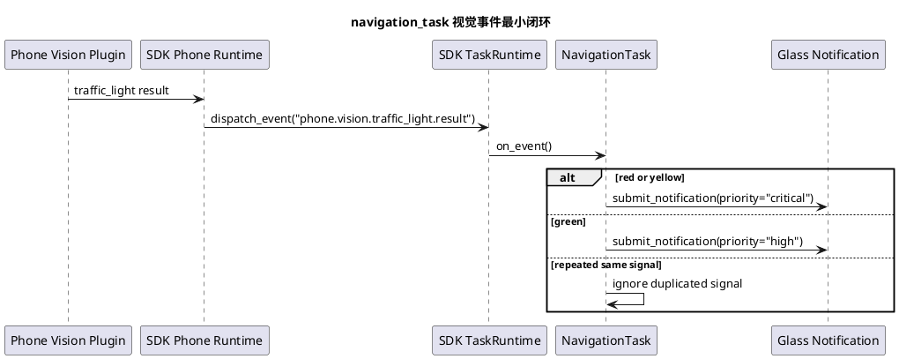

# Phase L navigation_task 最小闭环实施文档

## 1. 目标

Phase L 的目标是在不改 SDK 框架的前提下，让 `navigation_task` 从路线准备推进到可接收视觉事件的最小执行期任务。当前只实现红绿灯事件接入和通知去重，不实现复杂最后 10 米策略。

## 2. 实现范围

代码目录：

1. `capabilities/navigation/server/task.py`
2. `capabilities/navigation/server/tool.py`
3. `capabilities/navigation/mcp/amap_mock_adapter.py`

当前任务能力：

1. 可创建：`prepare_navigation` 创建 `navigation_task`。
2. 可查询：任务状态和 `task_data` 由 SDK `TaskRuntime` 托管。
3. 可取消：`on_cancel` 提交通知并进入 `cancelled`。
4. 可接收路线事件：`navigation.progress`、`navigation.arrived`。
5. 可接收视觉事件：`phone.vision.traffic_light.result`。

## 3. 视觉事件策略

输入事件：

```json
{
  "event_name": "phone.vision.traffic_light.result",
  "payload": {
    "signal": "red"
  }
}
```

最小策略：

1. `red`：提交 `critical` 通知，提示停下等待。
2. `yellow`：提交 `critical` 通知，提示暂缓通过。
3. `green`：提交 `high` 通知，提示可继续按导航前进。
4. 同一信号连续重复时不重复提交通知。
5. 未知信号忽略，不改变任务状态。

## 4. 流程图



## 5. 场景覆盖

新增场景：

1. `testdata/scenario/navigation_visual_traffic_light.json`

相关视觉主链路场景：

1. `testdata/scenario/find_object_external_phone_result.json`
2. `testdata/scenario/traffic_light_continuous_cancel.json`

测试目标：

1. `navigation_task` 能接收手机视觉事件。
2. 红灯、黄灯、绿灯能提交对应优先级通知。
3. 重复红灯事件不重复通知。
4. 任务仍由 SDK 托管，可继续查询和取消。

## 6. 跨设备联调方案

真机联调顺序：

1. 启动业务服务端，确认 `prepare_navigation`、`navigation_task`、`traffic_light` 已注册。
2. 启动 iOS 手机端，确认手机视频链路和红绿灯插件可用。
3. 启动眼镜端，确认通知播放链路可用。
4. 触发 `prepare_navigation` 创建导航任务。
5. 触发红绿灯识别任务或通过调试入口向导航任务发送 `phone.vision.traffic_light.result`。
6. 服务端观察任务事件、任务数据中的 `last_visual_signal` 和通知记录。
7. 眼镜端观察红灯、黄灯、绿灯提示是否按优先级播报。

当前没有发现 SDK 硬阻塞。若真实 iOS 宿主无法同时承载导航和红绿灯业务插件，应把插件装配能力记录为 SDK 阻塞点后交给 SDK 团队处理。
