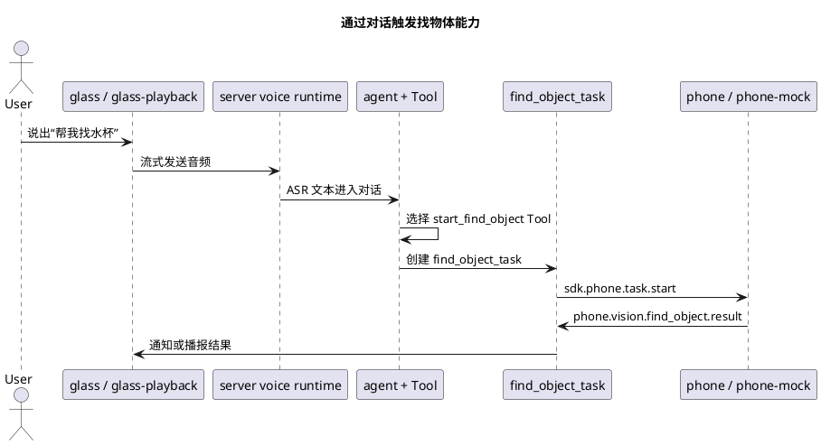

# 三端启动后状态验证指南

本文用于功能开发人员在启动 server、phone、glass 或对应虚拟设备后，快速判断系统是否处于可联调状态。

这里的验证分成两类：

1. **真实链路验证**：通过真实 glass 或 `glass-playback` 发送语音输入，让服务端 ASR、Agent、Tool、Task、phone 任务、执行器都走真实链路。
2. **调试接口验证**：通过 HTTP 调试接口直接检查设备状态、手动启动视频链路或业务任务，用于缩小问题范围。

当前服务端没有提供“直接 POST 文本并当成一轮对话”的 HTTP 入口。简单对话和通过对话触发 Tool，都应该通过真实眼镜语音链路或 `glass-playback` 的 `trigger_audio` 完成。

## 1. 启动顺序

推荐顺序：

1. 同步配置。
2. 启动服务端。
3. 启动真实 iOS phone 或 `phone-mock`。
4. 启动真实 ESP32 glass 或 `glass-playback`。
5. 查询服务端状态。
6. 发起一次简单对话。
7. 发起一次会触发 Tool 和手机任务的对话。

命令示例：

```bash
uv run openaiglass.config.sync --app-root openaiglass-for-blind

uv run openaiglass.server.run \
  --app-module host.server.main \
  --app-root openaiglass-for-blind \
  --config openaiglass-for-blind/config/local_server.env
```

使用真实 iOS 手机：

```bash
uv run openaiglass.phone.open --app-root openaiglass-for-blind
```

使用 `phone-mock`：

```bash
uv run openaiglass.phone.mock \
  --config openaiglass-for-blind/host/phone-mock/config/phone.mock.json
```

使用真实 ESP32 眼镜：

```bash
uv run openaiglass.glass.start \
  --app-root openaiglass-for-blind \
  --sdk-root openaiglass-sdk \
  --port '/dev/tty.usbmodem*'
```

使用 `glass-playback`：

```bash
uv run openaiglass.glass.start --runtime playback \
  --config openaiglass-for-blind/host/glass-playback/config/glass.water_cup.json \
  --sdk-root openaiglass-sdk
```

## 2. 服务端基础状态

健康检查：

```bash
curl http://127.0.0.1:8765/api/health
```

预期返回：

```json
{
  "status": "ok",
  "service": "server-api"
}
```

配置摘要：

```bash
curl http://127.0.0.1:8765/api/config-summary
```

用于确认服务端实际读取的端口、模型配置、日志配置和设备令牌摘要。该接口不替代设备注册检查，只用于排查“服务端是否按预期配置启动”。

## 3. 设备注册和绑定状态

查询运行态设备：

```bash
curl http://127.0.0.1:8765/api/runtime/devices
```

重点看：

| 字段 | 正常现象 |
| --- | --- |
| `runtime.online_devices` | 至少包含已经启动的 glass 和 phone 设备编号。 |
| `runtime.voice_sessions` | glass 注册后应存在对应语音会话。 |
| `runtime.device_groups.groups` | 需要手机能力时，glass 和 phone 应出现在同一组。 |
| `runtime.device_groups.groups[].devices[].online` | 设备应为 `true`。 |
| `runtime.connections[].camera_sink_ws_uri` | phone 应包含相机接收地址；真实 iOS phone 和 `phone-mock` 都会通过注册消息上报。 |
| `runtime.device_bindings` | 需要手机能力时，应能看到 glass 与 phone 的绑定关系。 |

常用过滤命令：

```bash
curl -s http://127.0.0.1:8765/api/runtime/devices \
  | python -m json.tool
```

如果启动了 `phone-mock`，应看到 `phone-001` 在线；如果启动了 `glass-playback`，应看到配置中的虚拟 glass 在线。

## 4. 开启一次简单对话

简单对话必须从 glass 侧进入。当前支持两种方式：

1. 真实 ESP32 眼镜：按真实唤醒和录音流程说一句简单问题，例如“现在系统正常吗”。
2. `glass-playback`：准备一段包含简单问题的 `trigger_audio`，启动 `glass-playback` 后由它自动流式发送。

验证点：

| 位置 | 观察内容 |
| --- | --- |
| 服务端日志 | 是否出现音频段开始、ASR 文本、Agent 处理、TTS 或执行器下发日志。 |
| `/api/runtime/devices` | glass 仍然在线，语音会话存在。 |
| `glass-playback` 输出 | 是否记录 `voice.trigger_audio.started`、`voice.trigger_audio.finished` 和 `actuator.audio.play`。 |
| 真实眼镜串口 | 是否收到播放、通知或控制消息。 |

如果需要查看某个会话的 Agent 调试快照，先从 `/api/runtime/devices` 或服务端日志中找到 `session_id`，再查询：

```bash
curl "http://127.0.0.1:8765/api/agent/session?session_id=<session_id>" \
  | python -m json.tool
```

重点看：

| 字段 | 用途 |
| --- | --- |
| `session.messages` | 当前会话写入的用户和助手消息。 |
| `session.model_request` | 最近一次实际发给模型的请求。 |
| `session.capability_traces` | Tool、MCP 或能力调用轨迹。 |
| `session.tasks` | Agent 会话内关联的任务引用。 |

## 5. 发起一次 Tool 调用

Tool 调用也应优先通过对话触发。例如要验证找物体能力，使用真实眼镜说：

```text
帮我找水杯
```

或把同样内容录成 `glass-playback` 的 `trigger_audio`。

预期链路：



验证点：

| 位置 | 正常现象 |
| --- | --- |
| `/api/agent/session?session_id=...` | `capability_traces` 中出现 `start_find_object` 或相关能力调用。 |
| 服务端日志 | 出现 `find_object_task` 创建、启动和任务事件。 |
| phone 或 `phone-mock` | 收到 `sdk.phone.task.start`。 |
| `/api/runtime/devices` | 设备组中 glass 和 phone 同组在线。 |
| `glass-playback` actuator 日志 | 出现结果播报或通知相关执行器输出。 |

## 6. 通过对话建立跟手机的连接

“跟手机建立连接”不是单独的用户命令，而是某些业务能力在 Task 中启动手机侧能力时自动发生。

以“帮我找水杯”为例：

1. 对话触发 `start_find_object` Tool。
2. Tool 创建 `find_object_task`。
3. `find_object_task` 调用 `context.device_group.start_phone_video_link(...)`。
4. SDK 向 glass 下发 `sensor.camera.stream.start`。
5. SDK 向 phone 下发 `sdk.phone.task.start`。
6. phone 或 `phone-mock` 上报 `phone.vision.find_object.result`。

如果希望缩小问题范围，可以不用对话，直接用业务调试接口启动找物体任务：

```bash
curl -X POST http://127.0.0.1:8765/api/debug/find-object/start \
  -H 'Content-Type: application/json' \
  -d '{
    "glass_device_id": "glass-001",
    "target_object": "水杯",
    "frame_interval_ms": 500,
    "reason": "manual_debug"
  }'
```

使用 `glass-playback` 时把 `glass_device_id` 改成对应虚拟眼镜编号，例如 `glass-playback-001`。

该接口会绕过 Agent 对话，但仍然通过 SDK 任务和设备组能力启动手机任务，适合排查“Tool 选择没触发”还是“设备链路本身有问题”。

## 7. 手动验证眼镜到手机的视频链路

直接启动视频链路：

```bash
curl -X POST http://127.0.0.1:8765/api/debug/phone-video-link/start \
  -H 'Content-Type: application/json' \
  -d '{
    "glass_device_id": "glass-001",
    "frame_interval_ms": 500,
    "reason": "manual_debug"
  }'
```

如果不传 `target_ws_uri`，服务端会优先使用已注册 phone 的相机接收地址。真实 iOS phone 和 `phone-mock` 都应该在注册元数据中提供该地址。

该接口要求目标 glass 已经在线并打开语音会话。如果返回“目标眼镜尚未打开语音会话”，先通过真实眼镜或 `glass-playback` 完成一次语音会话打开。

停止视频链路：

```bash
curl -X POST http://127.0.0.1:8765/api/debug/phone-video-link/stop \
  -H 'Content-Type: application/json' \
  -d '{
    "glass_device_id": "glass-001"
  }'
```

验证点：

| 位置 | 正常现象 |
| --- | --- |
| 服务端响应 | `status=ok`，返回 `phone_video_link_task` 的 `task_id` 和 `state`。 |
| glass 日志 | 收到 `sensor.camera.stream.start` 或 `sensor.camera.stream.stop`。 |
| iOS phone | 页面显示最近帧或最近接收事件。 |
| `phone-mock` | `runs/phone-mock/<device_id>/camera/frames.jsonl` 记录收到的帧。 |

## 8. 手动上报手机任务事件

通常不需要手动调用该接口，真实 iOS phone 和 `phone-mock` 会自动调用。只有在排查 Task 事件处理时才使用。

```bash
curl -X POST http://127.0.0.1:8765/api/tasks/report-event \
  -H 'Content-Type: application/json' \
  -d '{
    "task_id": "<task_id>",
    "phone_device_id": "phone-001",
    "event_name": "phone.vision.find_object.result",
    "payload": {
      "target_object": "水杯",
      "found": true,
      "confidence": 0.9,
      "position": "center",
      "summary": "找到水杯了"
    }
  }'
```

注意：

1. `task_id` 必须是真实存在且正在运行的 SDK 任务。
2. `phone_device_id` 必须与任务绑定的 phone 一致。
3. 该接口只验证任务事件处理，不验证设备注册、视频链路和手机端运行时。

## 9. 常见判断

| 现象 | 优先检查 |
| --- | --- |
| `/api/health` 不通 | 服务端是否启动、端口是否与 `local_server.env` 一致。 |
| phone 不在线 | iOS App 或 `phone-mock` 是否启动；`DEVICE_TOKEN_MAP` 是否包含该 phone 的令牌。 |
| glass 不在线 | ESP32 串口日志或 `glass-playback` 配置；`pair_token` 是否与服务端一致。 |
| glass 和 phone 未绑定 | 两个设备是否都在线；配置中的目标设备编号是否一致。 |
| 简单对话无响应 | 音频是否真的发送；ASR 是否有文本；模型配置是否可用。 |
| 对话没有触发 Tool | 查看 `/api/agent/session` 的 `model_request` 和 `capability_traces`。 |
| Tool 触发但手机无动作 | 查看 `sdk.phone.task.start` 是否下发，phone 或 `phone-mock` 是否在线。 |
| 手机有结果但任务不完成 | 查看 `/api/tasks/report-event` 响应和业务 Task 的 `on_event` 事件名匹配。 |
