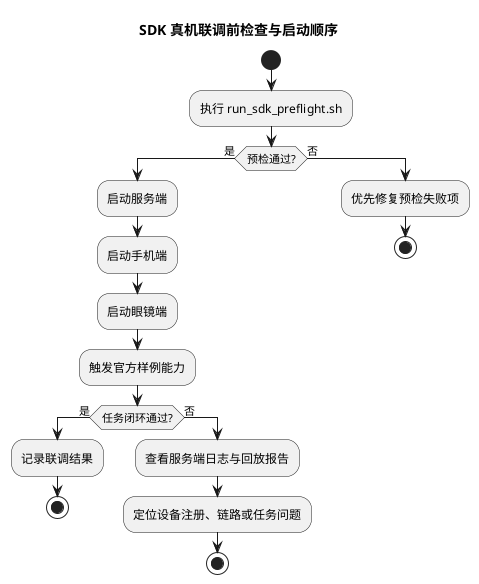

# SDK 真机联调前检查与联调步骤

## 1. 文档目的

本文档用于统一真机联调前的检查项、启动顺序、观察点和问题定位入口。

目标不是替代详细研发文档，而是让开发者在进入真机联调前，先用一套固定流程确认：

1. SDK 核心能力是否已经通过离线预检。
2. 官方样例是否具备联调入口。
3. 服务端、手机端、眼镜端应该按什么顺序启动。
4. 联调失败时应优先看哪些输出。

## 2. 联调前必须先完成的预检

进入真机联调前，建议先执行：

```bash
bash script/run_sdk_preflight.sh --report logs/sdk-preflight.json
bash script/sync_sdk_live_config.sh
bash script/run_sdk_live_check.sh --report logs/sdk-live-check.json
```

`run_sdk_preflight.sh` 当前会统一检查：

1. `compileall` 语法编译检查。
2. `server`、`phone`、`glass` 及主流程脚本是否存在。
3. `openaiglass-sdk/testdata/contracts` 下 SDK 公共契约测试是否通过。
4. `testdata/compat` 下官方样例兼容性回归是否通过。
5. `testdata/scenario` 下全部 SDK 回放场景是否通过。
6. 第二期核心 pytest 是否通过。
7. 服务端 `/api/health` 最小健康检查是否通过。

`run_sdk_live_check.sh` 当前会统一检查：

1. 真机联调入口文件是否存在。
2. 最近一次 SDK 预检报告是否通过。
3. `config/local_server.env`、手机 `AppConfig.plist`、眼镜 Kconfig 中的设备编号、配对令牌和服务端地址是否一致。
4. 如果服务端已启动，检查本机 `/api/health` 是否可访问。

`sync_sdk_live_config.sh` 会从 `config/local_server.env` 读取：

1. `SERVER_PUBLIC_HOST`
2. `PORT`
3. `DEVICE_TOKEN_MAP`

并同步到：

1. 手机 `../../openaiglass-sdk/phone-ios/GlassesVideoReceiver/AppConfig.plist`
2. 眼镜 `host/glass/config/local_build.env`

预检通过的最低标准：

1. 退出码为 `0`。
2. 报告文件中的 `ok=true`。
3. `failed_count=0`。

如果预检不过，不建议直接进入真机联调。

截至 2026-04-25，当前离线 SDK 预检与真机联调配置检查均已通过。当前同步后的局域网服务端地址为：

1. 手机 HTTP 地址：`http://172.20.10.12:8765`
2. 眼镜控制面地址：`ws://172.20.10.12:8765/ws/control`

## 3. 当前推荐联调顺序

### 3.1 启动顺序

1. 先执行 SDK 预检。
2. 启动服务端。
3. 启动手机端。
4. 启动眼镜端。
5. 执行一次最小功能触发，例如找物体任务。

推荐命令：

```bash
bash script/run_sdk_preflight.sh --report logs/sdk-preflight.json
bash script/sync_sdk_live_config.sh
bash script/run_sdk_live_check.sh --report logs/sdk-live-check-before-start.json
bash script/run_server.sh
bash script/run_sdk_live_check.sh --require-server --report logs/sdk-live-check-after-start.json
bash ../../openaiglass-sdk/phone-ios/GlassesVideoReceiver.xcodeproj
bash scripts/run_glass.sh
```

### 3.2 各端职责

1. 服务端
   - 承担设备注册、设备组运行时、任务运行时、Agent 装配和通知协调。
2. 手机端
   - 承担视频接收、本地处理器执行、手机任务运行和结果回传。
3. 眼镜端
   - 承担采集、上行媒体、下行通知和设备侧反馈。

## 4. 联调流程图（PlantUML）



## 5. 联调时优先观察的输出

### 5.1 服务端

优先关注：

1. `/api/health` 是否正常。
2. 设备是否成功注册。
3. 眼镜与手机是否成功绑定。
4. `find_object_task` 是否创建成功。
5. 是否出现任务失败、链路启动失败或通知未下发。

建议本地联调时打开 DEBUG 日志：

```bash
LOG_LEVEL=DEBUG bash script/run_server.sh
```

如果直接使用 SDK 示例服务端，也可以执行：

```bash
LOG_LEVEL=DEBUG uv run python -m host.server.main --host 0.0.0.0 --port 8765
```

心跳超时或连接关闭时，服务端日志应至少包含：

1. `device_id`
2. `session_id`
3. `connection_id`
4. `peer`
5. `device_type`
6. `heartbeat_age_ms`
7. `heartbeat_timeout_ms`
8. `close_code`
9. `close_reason`

日志格式为：

```text
{timestamp}-{level}-{logger}-{message_id}-{message} key=value key=value
```

示例：

```text
2026-04-25T10:38:57.272417+08:00-WARNING-server.control-conn_xxx-设备心跳超时，关闭连接 device_id=glass-001 session_id=sess_xxx connection_id=conn_xxx peer=192.168.1.10:12345 device_type=glass heartbeat_age_ms=16000 heartbeat_timeout_ms=15000 close_code=4000 close_reason=heartbeat timeout
```

### 5.2 手机端

优先关注：

1. 是否成功接收视频流。
2. 本地处理器是否启动。
3. 是否产出结构化结果。
4. 是否将结果正确回传到服务端。

### 5.3 眼镜端

优先关注：

1. 是否成功连上服务端。
2. 是否成功推送媒体帧。
3. 是否收到通知或控制命令。

## 6. 问题定位建议

如果联调失败，建议按以下顺序排查：

1. 先看 `logs/sdk-preflight.json`
   - 确认是否是离线预检已经失败但未修复。
2. 再看服务端健康检查和服务端日志
   - 确认服务端是否正常启动。
3. 再看设备注册与绑定
   - 确认手机与眼镜是否进入同一设备组。
4. 再看样例任务创建与事件推进
   - 确认失败点是在任务启动、视频链路、手机处理器还是结果回传。

## 7. 当前适合联调的验收重点

当前阶段建议优先验收以下内容：

1. 官方 `find_object` 样例能否完成最小真机闭环。
2. 设备组绑定、视频链路、任务创建、结果回传是否按 SDK 设计运行。
3. 当链路异常或设备缺失时，SDK 是否能输出结构化错误并被预检场景覆盖。
4. 联调前是否能通过统一预检脚本快速发现大部分基础问题。
