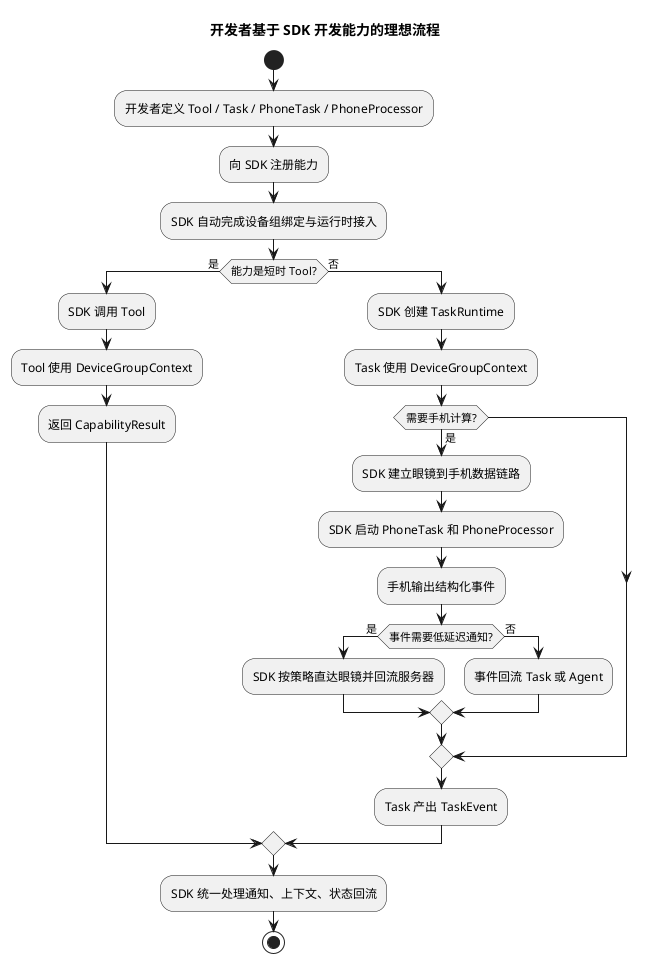

# 开发者如何基于 SDK 完成一期与设想功能开发

## 1. 文档定位

本文档不是继续讨论系统内部怎么实现，而是切换到 **SDK 使用者视角**，回答下面两个问题：

1. 一个外部开发者如果拿到当前 SDK，应当如何基于 SDK 完成眼镜、手机、服务器三端业务能力开发。
2. 一个外部开发者如果要继续完成 [设想的功能与实现方案](../../../openaiglass-for-blind/docs/restriction/设想的功能与实现方案.md) 中的核心能力，应当如何使用 SDK。

本文档的核心目的不是提供某个具体 API 细节，而是通过“开发者如何开发”来反向验证 SDK 的设计是否合理。

如果在描述开发流程时，开发者仍然需要关心以下内容，则说明 SDK 设计还不够成熟：

1. 设备如何绑定
2. 控制消息如何路由
3. 媒体流应该走哪个连接
4. 上下文如何同步
5. 任务事件如何回流
6. 通知如何插播与抢占

---

## 2. 文档目标

本文档希望建立一个清晰判断标准：

**未来 SDK 的使用方式，应当让开发者主要围绕“能力”开发，而不是围绕“系统”开发。**

更具体地说：

1. 开发者新增一个能力时，主要写 `Tool`、`Task` 或 `PhoneProcessor`。
2. 开发者不应直接操作眼镜、手机、服务器之间的底层连接。
3. 开发者不应自己维护设备组绑定关系和任务编排状态。
4. 开发者不应自己拼装协议消息和媒体帧。
5. 开发者只应描述：
   - 需要什么输入
   - 做什么业务计算
   - 输出什么结构化结果
   - 何时结束

---

## 3. 先给出结论

如果要让 SDK 真正支持一期功能和后续设想功能的开发，建议 SDK 至少向开发者提供以下三类扩展面：

1. **服务器侧扩展面**
   - `BaseTool`
   - `BaseTask`
   - `DeviceGroupContext`
   - `NotificationPort`
   - `TaskGateway`

2. **手机侧扩展面**
   - `BasePhoneProcessor`
   - `FrameProcessor`
   - `BasePhoneTask`
   - `BaseSensorProvider`
   - `PhoneTask`

3. **系统托管能力**
   - 设备组绑定
   - 控制面与数据面路由
   - 语音上下文维护
   - 媒体流生命周期管理
   - 通知协调
   - 任务状态保存与事件回流

换句话说：

- 开发者可以扩展业务能力
- SDK 必须吞掉系统复杂度

---

## 4. 假设的 SDK 使用模型

为了让后文更具体，本文先约定一个面向开发者的最小 SDK 模型。

## 4.1 服务器侧开发者可见抽象

### 4.1.1 `BaseTool`

适合短时能力，例如：

1. 抓拍一张图片
2. 查询设备状态
3. 创建一个后台任务
4. 查询地图

开发者只需要实现：

1. 输入参数模型
2. 业务逻辑
3. 结构化返回结果

### 4.1.2 `BaseTask`

适合长生命周期能力，例如：

1. 导航
2. 寻找物体
3. 寻找通路
4. 周期检查
5. 手机直连视频任务

开发者只需要实现：

1. 任务输入参数
2. 任务状态推进逻辑
3. 外部事件如何推进任务
4. 完成条件

### 4.1.3 `DeviceGroupContext`

这是开发者最重要的上下文对象。

它应当提供高层能力，而不是底层连接句柄，例如：

1. `capture_photo()`
2. `start_phone_video_link()`
3. `request_glass_audio_play()`
4. `submit_notification()`
5. `query_bound_devices()`
6. `create_task()`
7. `emit_task_state()`

开发者不能直接拿到底层 WebSocket 或媒体连接。

## 4.2 手机侧开发者可见抽象

### 4.2.1 `BasePhoneProcessor`

适合手机本地推理能力，例如：

1. YOLO 检测
2. 红绿灯识别
3. 障碍物检测
4. 盲道检测

开发者只需要实现：

1. 模型初始化
2. 单帧或多帧处理逻辑
3. 结构化结果输出

SDK 负责：

1. 接收眼镜视频流
2. 把帧投递给处理器
3. 将结果回传服务器或眼镜

### 4.2.2 `PhoneTask`

适合手机本地持续任务，例如：

1. 手机端持续视频检测
2. 连续场景分析
3. 轻量导航辅助

### 4.2.3 `BaseSensorProvider`

适合封装手机或眼镜侧传感器，例如：

1. GPS
2. 陀螺仪
3. 方向角
4. ToF 深度信息
5. IMU

开发者不应直接处理底层系统传感器 API，而应通过 SDK 提供的结构化传感器数据完成业务判断。

## 4.3 Skill、Tool、Task 的关系

产品讨论中经常会使用 “Skill” 这个词。

在 SDK 实现上，建议这样理解：

1. `Skill` 是面向产品和用户的能力包概念。
2. 一个 `Skill` 内部可以组合多个 `Tool`、`Task`、`PhoneTask`、`PhoneProcessor`。
3. SDK 底层不必把 Skill 做成第一优先级的运行时概念，但需要允许开发者用清晰目录或声明文件组织能力包。

以导航为例：

1. `navigation_skill` 是产品层能力包。
2. `prepare_navigation` 是服务器侧 Tool。
3. `navigation_task` 是服务器侧后台任务。
4. `phone_navigation_task` 是手机侧本地任务。
5. `sidewalk_yolo_processor`、`traffic_light_processor`、`tof_safety_processor` 是手机侧处理器。

这样既保留产品语义，也避免把所有逻辑塞进一个巨大的 Skill 类。

---

## 5. 开发者完成第一期功能时，应该如何使用 SDK

下面逐项用开发者视角重写一期功能。

## 5.1 第 1 项：眼镜与服务器配对注册

### 5.1.1 理想的开发者体验

这一项 **不应该由业务开发者实现**。

原因：

1. 设备注册属于系统层能力
2. 配对鉴权属于系统层能力
3. 控制连接建立属于系统层能力

### 5.1.2 SDK 应承担的内容

SDK 应默认提供：

1. 眼镜端注册客户端
2. 服务端设备注册运行时
3. 心跳维护
4. 设备在线状态维护
5. 设备组绑定接口

### 5.1.3 对开发者的意义

开发者在写业务能力时，应该只需要拿到：

```python
device_group = context.device_group
glass = device_group.require_glass()
```

而不是：

1. 自己处理 `device.register`
2. 自己拼 `pair_token`
3. 自己维护在线表

### 5.1.4 对 SDK 设计的验证

如果开发者为了写一个业务能力，还得先学会注册流程，那么 SDK 设计不合格。

## 5.2 第 2 项：非实时语音对话

### 5.2.1 理想的开发者体验

这一项也不应由普通业务开发者从零实现。

SDK 应内置：

1. 语音会话生命周期
2. WakeNet 唤醒接入
3. 端点检测
4. ASR 调用
5. Agent 输入组装
6. 回复播报

### 5.2.2 开发者真正应该做什么

开发者真正关心的是：

1. 如何定义 system prompt
2. 如何注册可调用 Tool
3. 如何定义回复风格

例如：

```python
assistant = sdk.create_voice_agent(
    name="glasses_assistant",
    system_prompt="你是盲人眼镜助手，请简短口语化回答。",
    tools=[capture_photo_tool],
)
```

### 5.2.3 对 SDK 设计的验证

如果开发者想接入一个语音助手，还需要自己管 `/ws_audio`、`/stream.wav`、播放时闭麦，这说明 SDK 还停留在系统内部实现，不是开发者产品。

## 5.3 第 3 项：实时语音对话，支持用户打断

### 5.3.1 理想的开发者体验

这项能力应被设计成语音运行时的系统配置，而不是业务能力开发者单独实现的逻辑。

例如开发者应该只需要配置：

```python
assistant = sdk.create_voice_agent(
    name="glasses_assistant",
    interrupt_policy="allow_user_barge_in",
)
```

### 5.3.2 SDK 应承担的内容

SDK 应统一处理：

1. 播放期间继续收麦
2. 用户起说检测
3. 中断当前播报
4. 切换到新一轮语音输入
5. 上下文回流

### 5.3.3 对 SDK 设计的验证

如果未来让开发者自己写“打断检测 + 插播 + 重新转写 + 重新组织上下文”，那这项能力就不是 SDK 提供，而是把系统难题甩给了开发者。

## 5.4 第 4 项：引入 AgentCore 调用工具

### 5.4.1 理想的开发者体验

开发者应当只需要注册 Tool，而不需要理解 Agent Loop 内部细节。

例如：

```python
sdk.register_tool(capture_photo_tool)
sdk.register_tool(find_object_tool)
```

### 5.4.2 SDK 应承担的内容

SDK 负责：

1. Tool 注册
2. 参数校验
3. Tool trace
4. Tool 调用与结果回写上下文
5. Tool 与 Agent 的桥接

### 5.4.3 对 SDK 设计的验证

如果开发者为了新增一个 Tool，需要理解会话存储、trace、OpenAI Agents SDK 的事件流，那 SDK 扩展面还没有收敛好。

## 5.5 第 5 项：引入工具与 MCP

### 5.5.1 理想的开发者体验

开发者应当能统一地注册一个 Tool 或一个 MCP Adapter，而不需要考虑它们在系统内部怎么被调度。

例如：

```python
sdk.register_tool(capture_photo_tool)
sdk.register_mcp_adapter(amap_adapter)
```

### 5.5.2 开发者真正关注的内容

开发者主要只关心：

1. 我需要什么能力
2. 输入参数是什么
3. 输出结构化结果是什么

### 5.5.3 对 SDK 设计的验证

如果 Tool 和 MCP 在开发体验上是两套完全不同的东西，那么 SDK 的能力层设计还不够统一。

## 5.6 第 6 项：拍照工具，并根据图片完成解读

### 5.6.1 理想的开发者体验

开发者应该只需要实现一个 `capture_photo` Tool，或者直接复用 SDK 内置的 `capture_photo`。

例如：

```python
class DescribeCurrentSceneTool(BaseTool):
    name = "describe_current_scene"

    def run(self, context, input):
        image = context.capture_photo(reason="describe_scene")
        return context.ask_vision_model(
            prompt="请简短描述用户眼前画面",
            image=image,
        )
```

### 5.6.2 SDK 应承担的内容

SDK 负责：

1. 下发抓拍请求
2. 等待设备回图
3. 图片落盘
4. 构造图片资产
5. 注入模型输入

开发者不应处理：

1. `sensor.camera.capture`
2. base64
3. 图片资产路径
4. 图片 MIME 类型

### 5.6.3 对 SDK 设计的验证

如果开发者写一个“看一下我眼前有什么”的能力，还要自己维护抓拍请求表和超时表，这说明系统能力没有被 SDK 化。

## 5.7 第 7 项：AMap MCP 导航能力

### 5.7.1 理想的开发者体验

导航不应被理解成“只调用一次 AMap MCP”。

面向盲人用户的导航至少包含两个阶段：

1. 前置确认阶段
   - 由 agent 与用户确认目的地、出行方式、路线偏好
   - 适合用服务器侧 `Tool` 或产品层 `Skill` 组织
2. 导航执行阶段
   - 由服务器侧 `navigation_task` 管理长期状态
   - 由手机侧 `phone_navigation_task` 和多个 `PhoneProcessor` 执行本地引导

例如：

```python
class PrepareNavigationTool(BaseTool):
    name = "prepare_navigation"

    def run(self, context, input):
        route = context.mcp("amap.route_plan", {
            "origin": input.origin,
            "destination": input.destination,
            "strategy": input.strategy,
        })
        return {
            "route_id": route["route_id"],
            "summary": route["summary"],
        }
```

### 5.7.2 SDK 应承担的内容

SDK 负责：

1. 地图 MCP 调用封装
2. 返回结构统一化
3. 结果写入上下文
4. 后续导航任务启动接口
5. 将确认后的路线下发给手机端任务
6. 维护导航任务与手机本地导航会话的绑定

### 5.7.3 对 SDK 设计的验证

如果开发者为了写导航能力，还要区分“地图结果怎么挂上下文、手机控制连接怎么找、视频流怎么建、传感器事件怎么回流”，那导航扩展面还不够高层。

### 5.7.4 复合导航推荐实现方式

复合导航建议拆为以下开发者可见组件：

1. `PrepareNavigationTool`
   - 服务器侧 Tool
   - 负责地点确认、路线偏好确认和路线准备
2. `NavigationTask`
   - 服务器侧 `BaseTask`
   - 负责跨端任务生命周期、策略下发、状态回流和异常处理
3. `PhoneNavigationTask`
   - 手机侧 `BasePhoneTask`
   - 负责调起高德 SDK、读取 GPS 和陀螺仪、维护手机本地导航态
4. `SidewalkYoloProcessor`
   - 手机侧 `BasePhoneProcessor`
   - 负责识别人行道、车道、非机动车道和可行进区域
5. `TrafficLightProcessor`
   - 手机侧 `BasePhoneProcessor`
   - 负责红绿灯和斑马线识别
6. `TofSafetyProcessor`
   - 手机侧 `BasePhoneProcessor`
   - 负责近距离坑洞、台阶、障碍物兜底检测

对应伪代码如下：

```python
class NavigationTask(BaseTask):
    task_type = "navigation_task"

    def on_start(self, context):
        context.device_group.require_phone()
        context.device_group.require_glass()
        context.start_phone_task(
            task_type="phone_navigation_task",
            parameters={
                "route": self.input.route,
                "notification_policy": {
                    "safety_events": "direct_to_glass_and_report_server",
                    "route_events": "report_server_first",
                },
            },
        )
        context.start_phone_video_link(
            processors=[
                "sidewalk_yolo_processor",
                "traffic_light_processor",
                "tof_safety_processor",
            ],
        )
        context.set_state("running")

    def on_external_event(self, context, event):
        if event.name == "safety.blocked":
            context.notify_user(event.payload["hint"], priority="critical")
        if event.name == "route.deviated":
            context.ask_agent_to_replan(event.payload)
        if event.name == "navigation.completed":
            context.complete(event.payload)
```

手机侧伪代码如下：

```python
class PhoneNavigationTask(BasePhoneTask):
    task_type = "phone_navigation_task"

    def on_start(self, context):
        self.amap_session = context.local_sdk("amap").start_navigation(context.parameters["route"])
        self.gyro = context.sensor("gyroscope")
        self.gps = context.sensor("gps")

    def on_tick(self, context):
        heading = self.gyro.read_heading()
        gps_direction = self.gps.read_direction()
        if self._heading_drift_too_large(heading, gps_direction):
            context.emit_event("route.heading_drift", {"hint": "方向偏了，请稍微向左调整"})
```

开发者不应该在这些代码里处理：

1. 手机和眼镜如何绑定
2. 眼镜视频流如何到手机
3. 手机事件如何送回服务器任务
4. 手机如何直接让眼镜震动或播报
5. 同一时间多个通知如何抢占

## 5.8 第 8 项：后台任务管理工具

### 5.8.1 理想的开发者体验

开发者应当实现 `BaseTask` 子类，而不是自己管理线程或定时器句柄。

例如：

```python
class TimerTask(BaseTask):
    task_type = "timer_task"

    def on_start(self, context):
        context.schedule_after(seconds=self.input.duration_seconds)
        context.set_state("running")

    def on_timeout(self, context):
        context.notify_user("计时结束")
        context.complete({"message": "timer_done"})
```

### 5.8.2 SDK 应承担的内容

SDK 负责：

1. 任务创建
2. 任务查询
3. 任务取消
4. 定时调度
5. 任务状态存储
6. 事件发布与回流

### 5.8.3 对 SDK 设计的验证

如果开发者要自己开线程、存任务状态、决定如何回流 agent，那么 `BaseTask` 只是一个名字，不是真正的 SDK 托管能力。

## 5.9 第 9 项：引入手机设备并实现绑定

### 5.9.1 理想的开发者体验

这一项也应该主要由系统层提供，而不是让业务开发者从零搭。

SDK 应提供：

1. 手机注册运行时
2. 设备组绑定关系维护
3. 一对一绑定策略
4. 绑定状态查询接口

### 5.9.2 开发者真正应该拿到的能力

开发者应只需要：

```python
phone = context.device_group.require_phone()
glass = context.device_group.require_glass()
```

而不需要：

1. 自己建立手机控制连接
2. 自己记录哪个手机对应哪个眼镜
3. 自己做绑定状态持久化

### 5.9.3 对 SDK 设计的验证

如果“写一个需要手机参与的能力”之前，开发者还得先实现手机注册和绑定逻辑，那么 SDK 还没有把系统层封装干净。

## 5.10 第 10 项：大模型创建手机与眼镜直连后台任务

### 5.10.1 理想的开发者体验

这是最能检验 SDK 是否合理的一项。

开发者理想上应该只需要写：

1. 一个服务器侧 `PhoneVideoLinkTask`
2. 一个手机侧 `FrameProcessor`

例如：

```python
class FindObjectTask(BaseTask):
    task_type = "find_object_task"

    def on_start(self, context):
        context.start_phone_video_link(
            processor="yolo_find_object",
            parameters={"target": self.input.target_name},
        )
        context.set_state("running")

    def on_external_event(self, context, event):
        if event.name == "object_found":
            context.notify_user(event.payload["hint"])
        if event.name == "task_completed":
            context.complete(event.payload)
```

手机侧：

```python
class YoloFindObjectProcessor(BasePhoneProcessor):
    processor_name = "yolo_find_object"

    def process_frame(self, frame, context):
        result = self.model.detect(frame, target=context.parameters["target"])
        return result.to_structured_event()
```

### 5.10.2 SDK 应承担的内容

SDK 负责：

1. 眼镜与手机直连链路建立
2. 帧流传输
3. 帧路由给手机处理器
4. 手机结果回传任务
5. 任务事件回流服务器
6. 任务通知用户

### 5.10.3 对 SDK 设计的验证

如果开发者要自己管：

1. 眼镜与手机谁先连
2. 视频流怎么编码
3. 哪条链路发结果
4. 任务事件怎么回服务器

那这一项就足以说明 SDK 的系统层设计还没有成立。

---

## 6. 开发者完成“设想功能”时，应该如何使用 SDK

下面再从更长期的设想功能看 SDK 应有的开发方式。

## 6.1 室内主动系统：寻找常见物体

### 6.1.1 开发者应实现什么

开发者应主要实现两部分：

1. 服务器侧 `find_object_task`
2. 手机侧 `yolo_find_object_processor`

### 6.1.2 不应由开发者实现什么

开发者不应实现：

1. 眼镜和手机如何建立直连
2. 视频流如何传输
3. 检测结果如何送回 agent
4. 任务状态如何被主智能体查询

### 6.1.3 这项能力对 SDK 的要求

这要求 SDK 已具备：

1. 设备组概念
2. 手机侧处理器注册机制
3. 跨端任务运行时
4. 结构化事件回流机制

## 6.2 室内主动系统：阅读纸质书籍/药品说明书

### 6.2.1 开发者应实现什么

开发者应只需要写一个高层 Tool：

1. 触发抓拍
2. 调用视觉模型
3. 返回摘要结果

### 6.2.2 这项能力对 SDK 的要求

SDK 需要提供：

1. 内置 `capture_photo`
2. 图片资产注入大模型
3. 结果播报

这类能力如果都还要开发者自己处理图片落盘和模型输入，那 SDK 的视觉扩展面就不够友好。

## 6.3 室外主动系统：点到点导航

### 6.3.1 开发者应实现什么

开发者应主要实现一个产品层 `navigation_skill`，内部拆成：

1. `prepare_navigation` Tool
2. `navigation_task`
3. `phone_navigation_task`
4. 多个手机侧视觉和传感器处理器

### 6.3.2 SDK 需要承担什么

SDK 应统一承接：

1. 地图 MCP 调用
2. 导航状态维护
3. 手机导航状态输入
4. 任务事件回流
5. 通知协调
6. 眼镜到手机的视频流
7. 手机传感器事件和服务器任务的绑定
8. 手机本地安全提示直达眼镜的授权策略

### 6.3.3 对 SDK 的验证

如果导航任务需要开发者同时理解地图、agent、任务、手机、通知、媒体五条链路，说明抽象层级过低。

### 6.3.4 复合导航中的事件分级

导航场景必须把事件分成至少三类：

1. 安全类事件
   - 例如前方有坑、近距离障碍、需要立即停下
   - 手机可以在任务策略授权下直达眼镜
   - 服务器必须异步记录
2. 行进引导类事件
   - 例如向左微调、保持直行、准备过斑马线
   - 手机可以生成高频提示，但 SDK 应做节流、去重和优先级控制
3. 决策类事件
   - 例如偏离路线、路线不可通行、需要重新规划
   - 应回流服务器任务和 agent，由 agent 决定是否追问或重规划

如果 SDK 没有内建这类通知和事件分级能力，导航开发者就会被迫自己做大量系统逻辑。

## 6.4 室外主动系统：寻找通路 / 红绿灯 / 盲道 / 非机动车道

### 6.4.1 开发者应实现什么

开发者主要应实现不同的手机侧处理器：

1. `path_finding_processor`
2. `traffic_light_processor`
3. `blind_path_processor`
4. `non_motor_lane_processor`

服务器侧则实现统一任务模板：

1. `visual_guidance_task`

### 6.4.2 这项能力对 SDK 的要求

SDK 需要支持：

1. 一个任务绑定不同手机处理器
2. 手机处理器输出统一结构化事件
3. 服务器任务根据事件推进状态

如果这些都需要每个开发者自己拼，那么后续能力会大量重复造轮子。

### 6.4.3 与导航任务的关系

这些能力不应全部做成互相独立的孤立 Skill。

更合理的方式是：

1. `navigation_task` 可以按场景启用不同处理器
2. `visual_guidance_task` 可以复用同一批处理器
3. 红绿灯、斑马线、盲道、障碍物都输出统一 `GuidanceEvent`
4. 任务根据事件类型和优先级决定是否直达眼镜或回流 agent

这样才能避免每个能力重复实现一套手机视频链路、通知策略和任务状态机。

## 6.5 用户自定义系统：定时检查画面变化

### 6.5.1 开发者应实现什么

开发者应写一个周期任务：

1. 周期性抓拍
2. 周期性对比
3. 满足条件时通知用户

### 6.5.2 SDK 应承担什么

SDK 负责：

1. 调度
2. 抓拍
3. 任务状态保存
4. 与主智能体上下文同步

### 6.5.3 这项能力对 SDK 的验证

如果写一个“每 3 秒看一下画面”的能力都必须自己写调度器和抓拍回调，那后台任务中心就还没有 SDK 化。

## 6.6 用户自定义系统：记忆时长 / 提示词 / 知识库

### 6.6.1 开发者应实现什么

开发者更适合实现：

1. 记忆策略插件
2. 提示词策略插件
3. 知识源适配器

### 6.6.2 SDK 应承担什么

SDK 应统一承接：

1. 会话上下文裁剪
2. 长期记忆写入
3. 记忆读取
4. 系统提示词拼装

如果这些都散落在业务代码中，后续会很难维护。

---

## 7. 反向验证：如果 SDK 设计合理，开发者文档应该呈现什么样子

一个合理的 SDK，在开发者文档中应该主要出现以下内容：

1. 如何定义 `Tool`
2. 如何定义 `Task`
3. 如何定义 `PhoneProcessor`
4. 如何使用 `DeviceGroupContext`
5. 如何提交通知
6. 如何订阅任务事件

而不应该主要出现以下内容：

1. WebSocket 地址列表
2. 控制消息 JSON 示例大全
3. 流媒体头部手工拼装方式
4. 设备绑定状态机细节
5. 上下文持久化表结构

如果未来面向开发者的文档主要还是后一类内容，那说明 SDK 还没有真正形成产品层。

---

## 8. 当前 SDK 设计的合理处

结合当前已有设计和代码，可以认为下面这些方向是正确的：

1. 已经开始把能力收敛成 `Tool / Task / MCP`
2. 已经有 `agent-core` 与 `backend-task-core` 的边界
3. 已经有抓拍 Tool、任务网关、通知协调器这些中间层
4. 已经意识到手机应承担边缘计算角色

这些都说明系统在往 SDK 化方向走。

---

## 9. 当前 SDK 设计的关键缺口

但如果从“开发者如何使用 SDK”来反看，当前还存在几个关键缺口：

## 9.1 缺少正式的 `DeviceGroupRuntime`

现在虽然有设备、会话、任务，但从开发者视角还没有一个清晰的“当前设备组”抽象。

这会导致开发者在写跨端能力时，很容易又回到“直接找 phone / glass / server 连接对象”的低层模式。

## 9.2 手机侧扩展面还没有成型

这是当前最大的缺口。

现在还没有一个明确的手机侧开发模型，例如：

1. 开发者如何注册手机处理器
2. 手机如何声明自己支持哪些本地能力
3. 服务器如何调度某个手机处理器
4. 手机本地任务如何接入高德 SDK、GPS、陀螺仪、ToF
5. 手机本地安全提示如何在策略授权下直达眼镜

如果这个扩展面不补齐，很多设想功能都无法真正以 SDK 方式交付。

## 9.3 任务扩展面还不够高层

`timer_task` 是一个好开始，但还不足以证明复杂跨端任务可以被开发者轻松扩展。

SDK 还需要证明：

1. `navigation_task`
2. `find_object_task`
3. `phone_video_link_task`

这类任务也能以同样方式扩展。

## 9.4 开发者上下文对象还需要继续收敛

未来开发者最常接触的对象应该是：

1. `DeviceGroupContext`
2. `TaskContext`
3. `PhoneProcessorContext`

而不是各种 gateway 和 runtime 的组合。

---

## 10. 对下一阶段 SDK 设计的建议

为了让本文档描述的开发方式真正成立，建议下一阶段优先补齐以下内容。

## 10.1 固化开发者主入口

建议未来开发者主要通过如下方式工作：

```python
sdk = OpenAIGlassesSDK()
sdk.register_tool(...)
sdk.register_task(...)
sdk.register_phone_processor(...)
sdk.run()
```

这会比直接暴露一堆 registry、gateway、runtime 更适合作为开源产品。

## 10.2 引入正式的手机侧处理器模型

建议明确增加：

1. `BasePhoneProcessor`
2. `PhoneProcessorRegistry`
3. `PhoneTaskContext`
4. `BasePhoneTask`
5. `BaseSensorProvider`

这会让“YOLO 放在手机端运行”这件事在 SDK 里有明确归属。

## 10.3 用复合导航样板能力验证设计

建议用两个递进样板能力验证 SDK：

1. `find_object_task`
   - 验证眼镜视频流、手机 YOLO、服务器任务编排
2. `navigation_task`
   - 验证地图 SDK、手机传感器、视觉处理、ToF、安全通知和长期任务编排

其中 `navigation_task` 是更强的最终验收样板，因为它最能验证：

1. 设备组是否成立
2. 手机处理器模型是否成立
3. 跨端任务模型是否成立
4. 通知回流是否成立
5. 手机本地低延迟决策是否能被 SDK 安全托管

---

## 11. 流程图（PlantUML）

下面用一张图说明未来开发者应如何通过 SDK 开发能力。



---

## 12. 最终结论

如果未来 SDK 设计合理，那么开发者完成一期功能和后续设想功能时，应主要围绕下面三件事开发：

1. 写 `Tool`
2. 写 `Task`
3. 写 `PhoneTask / PhoneProcessor`

而不应主要围绕下面三件事开发：

1. 配设备
2. 连设备
3. 管协议

因此，本文档反向验证得到的结论是：

1. 当前项目已经有 SDK 化的正确方向，但还没有完全形成开发者产品。
2. 最大缺口是 `DeviceGroupRuntime` 和手机侧扩展面。
3. 导航能力说明手机不是简单推理节点，而是需要承接本地导航 SDK、传感器融合和低延迟安全判断的边缘运行时。
4. 下一阶段若要验证 SDK 是否合理，最好的方法不是再做一个简单能力，而是用“寻找物体 -> 复合导航”两个递进样板验证。
5. 只有当开发者可以在不理解系统内部细节的前提下完成复合导航开发，才能说明 SDK 设计真正成立。
