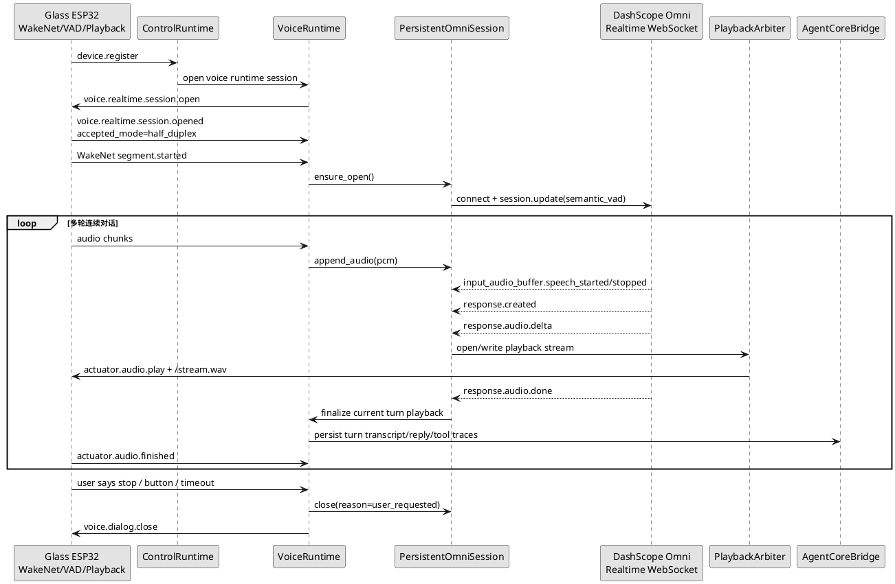
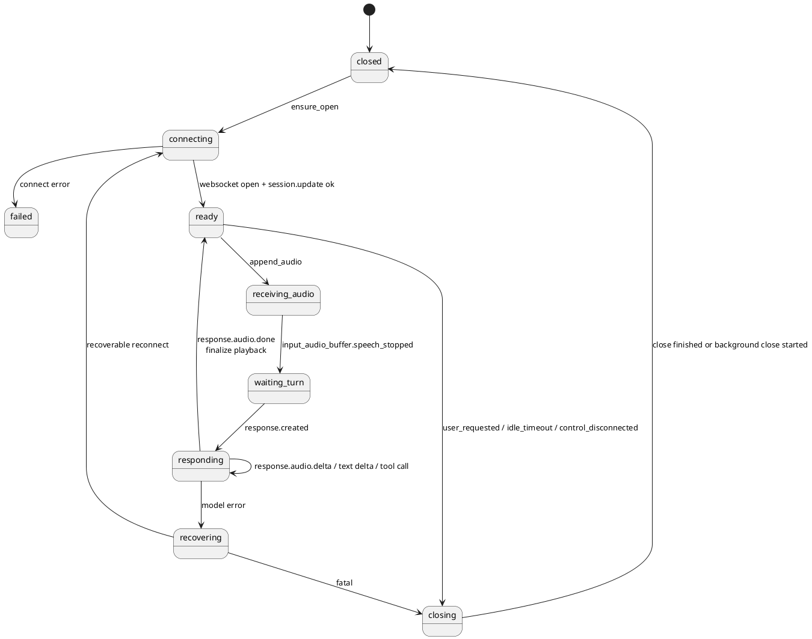
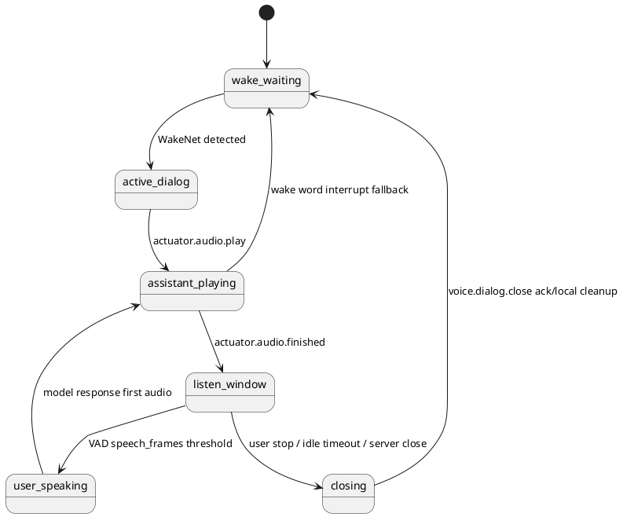

# Omni Realtime 长连接连续对话重构设计

更新时间：2026-05-04

## 1. 背景

当前 SDK 的 `omni_realtime + realtime_semantic_vad` 链路采用“端侧连续、SDK 会话连续、Omni 连接逐轮”的折中实现：每个 `sensor.audio.segment.started/finished` 会创建或复用一条短生命周期 Omni Realtime 会话，本轮回复完成后关闭该模型连接。

真机联调暴露出这个折中实现的几个问题：

1. 逐轮建连和逐轮关闭会放大 DashScope SDK 事件、关闭和超时行为的不确定性。
2. 播放流收口与模型连接关闭耦合后，底层 `close()` 阻塞会影响眼镜端 `/stream.wav` 读取结束。
3. “连续对话”语义被拆成端侧连续窗口和服务端逐轮模型请求，和 Qwen-Omni-Realtime 官方推荐的实时长连接交互不一致。
4. 用户主动要求结束连续对话的语义，应该关闭端侧连续窗口和模型长连接；普通每轮回复完成不应关闭连续对话。

Qwen-Omni-Realtime 官方文档给出的核心使用方式是：

1. 通过 WebSocket 建立 Realtime 会话。
2. 通过 `session.update` 配置输出模态、音色、指令和 `turn_detection`。
3. 在 VAD 模式下持续 `append_audio`，服务端检测语音结束后自动提交并触发响应。
4. 通过 `response.audio.delta` 接收音频，通过 `response.audio.done` 判断音频数据生成完成。
5. 单次 WebSocket 会话最长可持续 120 分钟，模型会维护对话历史上下文。

因此下一阶段 SDK 应改为“模型长连接连续对话”：同一个设备语音会话内维护一条长期 Omni Realtime 连接，只在用户主动结束、会话超时、设备断连或不可恢复错误时关闭。

参考：

1. [Qwen-Omni-Realtime 官方文档](https://help.aliyun.com/zh/model-studio/realtime)
2. [Qwen-Omni-Realtime 服务端事件文档](https://help.aliyun.com/zh/model-studio/server-events)

## 2. 目标

本重构目标是让 SDK 的连续对话语义和官方 Realtime 模式一致：

1. 一次唤醒进入一个长期 Omni Realtime session。
2. 后续多轮用户语音都 append 到同一条 Omni 连接。
3. Omni `semantic_vad` 负责 turn detection、自动提交和自动响应。
4. 每轮只收口当前播放流，不关闭模型连接。
5. 只有用户主动结束、端侧退出、长静音超时、控制连接断开或模型不可恢复错误时，才关闭模型连接和端侧连续窗口。
6. Agent-Core、Tool、Task、Skill、MCP、长期记忆和运行态观测继续通过 SDK 统一抽象暴露，不把 DashScope 协议泄漏给业务能力代码。

非目标：

1. 本阶段不解决端侧 AEC。没有可靠 AEC 前，真实 ESP32 仍保持播放期间半双工，只开放播放结束后的连续追问和唤醒词打断。
2. 本阶段不让业务代码直接操作 Omni 连接。
3. 本阶段不把 SDK 重构为纯 DashScope 应用；仍保留模型供应商 Adapter 边界。

## 3. 当前实现问题定位

### 3.1 连接生命周期错误

当前实现中，`OmniRealtimeStreamingSession` 绑定单个语音段：

```text
segment.started -> start_streaming_reply -> append_audio...
segment.finished -> finish -> complete_prepared_native_audio_turn -> close omni_session
```

这会导致每轮用户追问都需要重新建立模型连接。即使 SDK 会话保存了历史消息，模型 Realtime session 本身并不连续。

### 3.2 播放流与模型 close 耦合

真机日志显示 SDK 收到 `response.audio.done` 后，如果继续同步执行 DashScope SDK `close()`，底层 close 可能阻塞到 `request timeout after 23 seconds`。这会延迟播放流 finalize，使眼镜端长时间卡在读取 `/stream.wav`。

短期热修复是非阻塞 close；长期正确做法是普通轮次不 close 模型连接。

### 3.3 连续对话关闭语义不清

需要明确区分三类关闭：

| 关闭对象 | 触发时机 | 是否每轮发生 |
| --- | --- | --- |
| 当前播放流 | `response.audio.done` 或播放异常 | 是 |
| 当前 response | `response.done` / `response.cancelled` / `response.audio.done` 后的 SDK 轮次收口 | 是 |
| Omni Realtime 长连接 | 用户主动结束、长静音、断连、不可恢复错误 | 否 |
| 眼镜连续对话窗口 | 用户主动结束、长静音、异常恢复策略 | 否 |

## 4. 总体架构



核心变化：

1. `VoiceSessionController` 拥有 `PersistentOmniSession`，而不是 `SegmentBuffer` 拥有短会话。
2. `SegmentBuffer` 只表示端侧一次上行音频段，用于资产落盘、日志、sidecar ASR 回填和播放窗口协调。
3. Omni response 事件按 `response_id` 分轮归档，每个 response 对应一个 SDK turn。
4. 播放流生命周期独立于 Omni 连接生命周期。

## 5. 新增核心对象

### 5.1 PersistentOmniRealtimeSession

职责：

1. 维护一条 DashScope Omni Realtime WebSocket。
2. 执行 `connect()`、`session.update(...)`、`append_audio(...)`、`append_video(...)`、`create_item(...)`、`close(...)`。
3. 将 DashScope server events 转为 SDK 内部事件。
4. 按 `response_id` 管理当前正在输出的 response。
5. 管理 Realtime function calling 工具回填。
6. 处理可恢复错误和重连。

建议接口：

```python
class PersistentOmniRealtimeSession:
    def ensure_open(self) -> None: ...
    def append_audio(self, segment_id: str, pcm: bytes) -> None: ...
    def append_image(self, segment_id: str, image_bytes: bytes) -> None: ...
    def close(self, *, reason: str, blocking: bool = False) -> None: ...
    def build_snapshot(self) -> dict[str, Any]: ...
```

### 5.2 OmniTurnTracker

职责：

1. 跟踪一个 Omni response 对应的 SDK turn。
2. 收集用户转写、助手文本、音频输出、工具调用和事件时间戳。
3. 在 `response.audio.done` 时 finalize 当前播放流。
4. 在 `response.done` 时 finalize 当前 response 元数据。
5. 在 `conversation.item.input_audio_transcription.completed` 时写回用户转写。

建议字段：

| 字段 | 含义 |
| --- | --- |
| `response_id` | Omni response id。 |
| `turn_id` | SDK Agent turn id。 |
| `segment_ids` | 本轮关联的端侧 segment。 |
| `playback_stream_id` | 当前下行播放流。 |
| `assistant_text_parts` | 助手文本增量。 |
| `transcript` | 用户转写。 |
| `audio_done` | 是否收到 `response.audio.done`。 |
| `response_done` | 是否收到 `response.done`。 |
| `pending_tool_calls` | 未回填工具调用数量。 |

### 5.3 AgentCoreBridge

职责：

1. 在长连接模式下继续生成 system instructions、tools schema、Tool handler。
2. 将模型工具调用映射到 SDK ToolGateway。
3. 将每轮 response 的用户转写、助手文本、音频资产、工具轨迹写回 Agent-Core。
4. 注入长期记忆、active Skill、Task 状态和设备上下文。

注意：官方 Realtime session 自己也维护上下文，但 SDK 仍需要 Agent-Core 会话记录作为业务状态真相。两者关系应是：

```text
Omni session context = 模型实时推理上下文
Agent-Core session = SDK 业务上下文、记忆、任务、回放、审计真相
```

## 6. 状态机

### 6.1 模型长连接状态机



### 6.2 端侧连续对话窗口状态机



关键规则：

1. `assistant_playing -> listen_window` 不关闭 Omni 长连接。
2. `listen_window -> closing` 才关闭端侧连续窗口。
3. `voice.dialog.close` 只由用户主动结束、长静音超时、异常恢复策略触发。

## 7. 事件处理规则

### 7.1 官方事件到 SDK 行为映射

| 官方事件 | SDK 行为 |
| --- | --- |
| `input_audio_buffer.speech_started` | 记录用户开始说话，可用于唤醒后首响和追问延迟统计。 |
| `input_audio_buffer.speech_stopped` | 记录 Omni 判定用户 turn 结束。 |
| `input_audio_buffer.committed` | 标记本轮输入已提交。 |
| `response.created` | 创建或绑定 `OmniTurnTracker`，准备播放流。 |
| `response.audio.delta` | 写入当前播放流；首次 delta 下发 `actuator.audio.play`。 |
| `response.audio.done` | finalize 当前播放流；不关闭 Omni 长连接。 |
| `response.audio_transcript.delta` | 累积助手文本。 |
| `response.audio_transcript.done` | 记录助手最终文本；不作为播放完成依据。 |
| `conversation.item.input_audio_transcription.completed` | 写回用户转写；不阻塞播放流。 |
| `response.function_call_arguments.done` | 执行 SDK Tool，回填 `function_call_output`，触发后续 response。 |
| `response.done` | 标记当前 response 对象完成，补齐审计元数据。 |
| `response.cancelled` | 当前 response 被取消，关闭当前播放流或标记中断。 |
| `error` | 进入 recovering 或 closing。 |

### 7.2 播放流收口

播放流收口以 `response.audio.done` 为主：

```text
response.audio.delta first -> open playback stream
response.audio.done -> finalize playback stream
actuator.audio.finished -> 端侧确认播完，进入 listen_window
```

如果只有 `response.done` 而没有 `response.audio.done`：

1. 有音频输出过：按兼容策略 finalize 播放流，记录 `finish_reason=response_done_without_audio_done`。
2. 没有音频输出：不创建播放流，只写回文本或错误。

### 7.3 工具调用

工具调用期间不能让旧 response 的 done 类事件结束整轮：

```text
response.function_call_arguments.done -> pending_tool_calls += 1
ToolGateway.invoke -> create_item(function_call_output)
create_response -> 新 response
旧 response.done/audio.done -> 如果 pending_tool_calls > 0，忽略
新 response.audio.done -> finalize 最终播放流
```

`close_continuous_dialog` 是系统工具：

1. 模型调用后，SDK 记录 `turn_meta.close_continuous_dialog`。
2. 当前回复音频播放完成后，SDK 下发 `voice.dialog.close`。
3. SDK 关闭 Persistent Omni session，原因 `model_tool_close_continuous_dialog`。
4. 端侧关闭连续窗口，回到 WakeNet 待命。

## 8. 连接生命周期

### 8.1 打开

打开时机建议：

1. `voice.realtime.session.opened` 后只记录端侧能力，不立即打开模型连接。
2. WakeNet 首次命中或首个 `sensor.audio.segment.started` 到达时调用 `ensure_open()`。
3. 如果连接耗时影响首响，可在 WakeNet 命中后立即预连接。

### 8.2 保持

保持规则：

1. 普通每轮 `response.audio.done` 不关闭连接。
2. 播放完成后，模型连接继续 `ready`。
3. 端侧连续窗口还开着时，新 segment 继续 append 到同一连接。
4. 如果 DashScope 会话达到 120 分钟上限前，SDK 提前滚动重建连接，并保留 Agent-Core 上下文。

### 8.3 关闭

关闭触发：

| 触发 | 行为 |
| --- | --- |
| 用户说“结束对话/安静/先这样” | 当前回复播放完成后 `voice.dialog.close` + 关闭 Omni 长连接。 |
| 端侧按键退出 | 立即 `voice.dialog.close` + 关闭 Omni 长连接。 |
| 连续窗口长静音超时 | 关闭端侧窗口和 Omni 长连接，原因 `idle_timeout`。 |
| 控制连接断开 | 后台关闭 Omni 长连接，清理 controller。 |
| DashScope 不可恢复错误 | 关闭模型连接，必要时下发错误提示和 `voice.dialog.close`。 |
| DashScope 连接达到寿命阈值 | 滚动重连，不关闭端侧连续窗口。 |

## 9. 半双工 ESP32 约束

真实 ESP32 当前没有可靠 AEC，因此长连接不等于全双工自然插话。

第一阶段交互策略：

1. 播放期间不把普通麦克风音频持续送给 Omni，避免助手声音回灌。
2. 播放期间只保留 WakeNet 打断。
3. 播放结束后进入受限连续窗口，端侧 VAD 达到稳定帧数后启动下一段上行音频。
4. 服务端把下一段音频 append 到同一条 Omni 长连接。

等端侧 AEC 可用后，再打开：

1. 播放期间持续上行 AEC 后音频。
2. 支持 Omni semantic interruption 或 SDK 打断仲裁。
3. 用户自然插话时取消当前 response 并保留新输入。

## 10. 与 Agent-Core 的关系

长连接后不能简单依赖 Omni 自己的上下文作为唯一状态。SDK 仍要每轮落盘：

1. 用户最终转写。
2. 助手最终文本。
3. 下行音频资产。
4. 工具调用轨迹。
5. Task/Skill/MCP 产物。
6. close_continuous_dialog 等系统工具意图。

建议实现：

1. 长连接打开时由 Agent-Core 生成一次基础 instructions 和 tools schema。
2. 每次 active Skill、用户记忆、设备上下文变化后，可通过 `session.update` 刷新 instructions/tools。
3. 每个 `response_id` 完成后调用 `AgentFacade.complete_realtime_turn(...)` 写回会话。
4. 如果 Agent-Core 需要强策略规划，可保留“长连接 Realtime 负责语音 turn + 工具调用，Agent-Core 负责工具上下文和持久化”的桥接模式。

## 11. 照片与视觉输入

长连接下，照片不能继续无条件附加到每个普通问题。

规则：

1. 只有本轮意图明确是视觉问题，才 append image。
2. 视觉意图优先由模型自己理解用户语音；SDK 不应等待 sidecar ASR 才决定是否调用模型。
3. 第一阶段可保留“已就绪 sidecar ASR 明确视觉关键词时 append image”的低风险策略。
4. 更完整方案是提供模型工具 `request_current_frame`，让 Omni 在需要视觉上下文时主动请求当前帧。

推荐演进：

| 阶段 | 方案 |
| --- | --- |
| v1 | 已就绪 sidecar ASR 明确视觉关键词时 append image。 |
| v2 | 暴露 `request_current_frame` Realtime function tool。 |
| v3 | 手机/眼镜持续低帧率视觉 stream，Omni 长连接按需消费。 |

## 12. 错误恢复

| 错误 | 恢复策略 |
| --- | --- |
| `response.audio.done` 未到但 `response.done` 到达 | 兼容收口播放流，记录异常事件。 |
| `response.audio.done` 到达但底层 close 阻塞 | 普通轮次不 close；真正关闭时后台 close。 |
| WebSocket 断开 | 如果端侧连续窗口仍有效，重建 Persistent session，并用 Agent-Core 最近上下文恢复 instructions。 |
| Tool 调用超时 | 回填结构化错误给 Omni，让模型播报失败或降级。 |
| 模型长连接达到寿命 | 在空闲窗口滚动重连。 |
| 端侧连续窗口已关但模型仍输出 | cancel response，丢弃后续音频分片。 |

## 13. 可观测性

新增日志：

```text
Omni persistent session opening device_id=... session_id=...
Omni persistent session ready connection_id=...
Omni server event type=... response_id=... payload=...
Omni turn opened response_id=... turn_id=...
Omni playback finalized response_id=... stream_id=... reason=response.audio.done
Omni persistent session kept_alive idle_ms=...
Omni persistent session closing reason=...
Omni persistent session closed close_ms=...
```

运行态快照新增字段：

| 字段 | 含义 |
| --- | --- |
| `omni_persistent_state` | closed/connecting/ready/responding/recovering/closing。 |
| `omni_connection_id` | 当前模型连接编号。 |
| `omni_opened_at_ms` | 模型连接打开时间。 |
| `omni_last_event_at_ms` | 最近 server event 时间。 |
| `omni_active_response_id` | 当前 response。 |
| `omni_turn_count` | 当前长连接累计轮次。 |
| `omni_pending_tool_calls` | 未完成工具调用数。 |
| `continuous_dialog_window_state` | 端侧连续窗口状态。 |
| `continuous_dialog_close_reason` | 最近关闭原因。 |

## 14. 回放与真机测试

### 14.1 单元测试

1. `response.audio.done` 后不关闭 Persistent session。
2. 用户调用 `close_continuous_dialog` 后，当前播放完成才关闭端侧窗口和 Persistent session。
3. 工具调用第一轮 response 的 done/audio.done 不结束最终回复。
4. WebSocket 断开后能重建 Persistent session。
5. active Skill 或 memory 更新后能刷新 session instructions。

### 14.2 glass-playback

新增连续多轮回放：

```text
wake -> 问时间 -> 播放完成 -> 追问天气 -> 播放完成 -> 说先这样 -> voice.dialog.close
```

断言：

1. 只打开一次 persistent Omni session。
2. 前两轮不下发 `voice.dialog.close`。
3. 第三轮模型工具请求后才下发 `voice.dialog.close`。
4. 每轮播放流都在 `response.audio.done` 后及时结束。

### 14.3 真机测试

必测 case：

1. 一次唤醒后连续追问 3 轮。
2. 普通每轮回复完成后不关闭连续窗口。
3. 用户说“停下/安静/先这样”后，播报简短确认并关闭连续窗口。
4. 播放期间喊“嗨乐鑫”能打断或重新进入待命。
5. 背景音和助手回声不触发持续自问自答。
6. 服务端 DEBUG 日志能看到完整 Omni server event 摘要。

## 15. 迁移计划

### Phase A：抽象 PersistentOmniRealtimeSession

1. 从 `DashscopeOmniRealtimeReplyClient.start_streaming_reply(...)` 拆出长连接对象。
2. 保留现有逐轮实现作为 fallback。
3. 增加配置：

```text
VOICE_OMNI_SESSION_LIFECYCLE=per_turn|persistent
```

默认先保持 `per_turn`，真机验证后切 `persistent`。

### Phase B：VoiceSessionController 持有长连接

1. 给 `VoiceSessionController` 增加 `persistent_omni_session`。
2. WakeNet 命中或首段音频到达时 `ensure_open()`。
3. 播放完成不 close 模型连接。
4. `voice.dialog.close`、连接断开和 idle timeout 才 close。

### Phase C：多轮 response 归档

1. 引入 `OmniTurnTracker`。
2. 按 `response_id` 写回 Agent-Core。
3. 补齐每轮 transcript、assistant text、audio artifact、tool traces。

### Phase D：工具与视觉能力长连接适配

1. Realtime function calling 工具在长连接中持续可用。
2. `close_continuous_dialog` 关闭长连接和端侧窗口。
3. 评估 `request_current_frame` 工具替代自动照片。

### Phase E：默认切换

真机满足以下条件后，把默认值改为：

```text
VOICE_OMNI_SESSION_LIFECYCLE=persistent
```

切换门槛：

1. 连续 3 轮追问稳定。
2. 用户主动结束成功率接近 100%。
3. 无效背景音不引起持续自回复。
4. 播放流无 10 秒以上异常悬挂。
5. 长连接异常可恢复。

## 16. 风险与开放问题

1. DashScope SDK 是否支持在同一连接内长期稳定多轮 function calling，需要真机和压力测试验证。
2. 官方 120 分钟连接上限需要 SDK 提前滚动重连。
3. 长连接内上下文由模型维护，和 Agent-Core 记忆注入可能重复或漂移，需要定义刷新策略。
4. 没有 AEC 前，播放期间自然插话仍不能开放。
5. 如果模型在长连接内自主维护过多历史，可能带来 token 成本和行为漂移，需要定期摘要或重建会话。

## 17. 结论

SDK 下一轮不应继续在“逐轮 Omni 连接”上打补丁。正确方向是把 Omni Realtime 生命周期提升到设备语音会话级别，按官方推荐方式维护长连接；每轮只收口播放流和 response，不关闭模型连接。端侧连续窗口和模型长连接都只在用户主动结束、长静音、断连或不可恢复错误时关闭。
