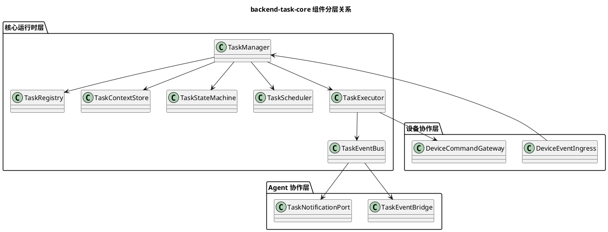
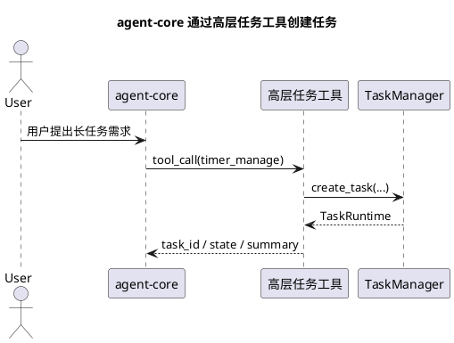
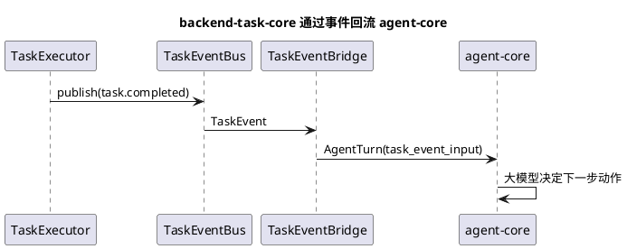
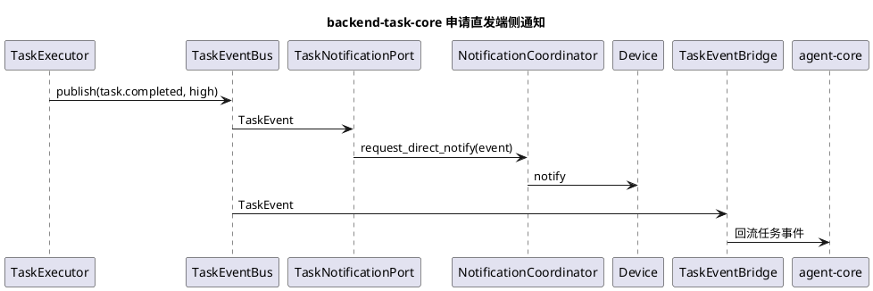
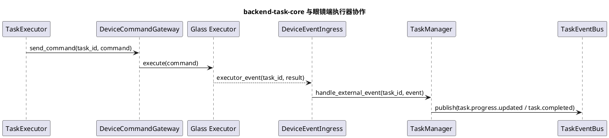

# backend-task-core 设计

## 0. 术语说明

本文中的 `backend-task-core` 即系统中的 `task-core`，表示与 `agent-core` 平级的独立后台任务运行模块。

---

## 1. 文档定位

本文档是当前项目 `backend-task-core` 的详细设计文档。

本文档重点回答以下问题：

1. `backend-task-core` 与 `agent-core` 的职责边界是什么。
2. 两者之间通过什么接口和事件协作。
3. `backend-task-core` 内部需要哪些核心模块。
4. 任务实例、状态机、事件流、调度器如何设计。
5. 后台任务结果如何回流 `agent-core`，以及何时允许直接通知端侧。

本文档是 [agent-core设计.md](./agent-core设计.md) 中任务运行时部分的详细展开稿。

---

## 2. 设计目标

`backend-task-core` 的设计目标如下：

1. 统一承接所有长生命周期后台任务。
2. 让 `agent-core` 不必持有长期任务运行状态。
3. 让不同任务模板都能在统一框架下注册、运行和观测。
4. 让任务结果通过标准事件回流 `agent-core`，以便利用大模型进行后续决策。
5. 让 `agent-core` 与 `backend-task-core` 都可以在受控条件下直接通知端侧。
6. 让后续开发者新增任务模板时，只需要实现 `Task` 模板，不需要修改核心运行时。

---

## 3. 设计原则

1. `agent-core` 与 `backend-task-core` 是平级独立模块，前者偏开放式决策，后者偏后台执行。
2. 模型不能直接调用 `Task`，只能通过高层任务管理工具调用 `backend-task-core`。
3. 任务状态必须结构化保存，不能只放在临时内存变量里。
4. 任务运行必须有统一生命周期、统一状态机和统一事件模型。
5. `backend-task-core` 不直接做自然语言决策。
6. 任务处理结果默认先产出结构化事件，再回流 `agent-core` 决策下一步动作。
7. `agent-core` 与 `backend-task-core` 都允许直接通知端侧，但必须受统一优先级管理和通知调度机制约束。
8. 第一阶段优先做“正确的边界”和“最小可用骨架”，不提前追求过强泛化能力。

---

## 4. 核心结论

### 4.1 `agent-core` 与 `backend-task-core` 的最终边界

#### `agent-core` 负责

1. 理解用户意图。
2. 决定是否需要创建后台任务。
3. 决定需要调用哪个高层任务管理工具。
4. 在收到任务事件后，利用大模型决定下一步动作。
5. 决定是否播报、追问、确认或继续调用其他 Tool。
6. 维护开放式会话上下文。

#### `backend-task-core` 负责

1. 创建任务实例。
2. 保存任务上下文。
3. 驱动任务状态机。
4. 管理任务生命周期。
5. 发布结构化任务事件。
6. 接受任务控制命令。
7. 调用外部资源、设备能力和其他底层执行能力。
8. 在需要时直接向端侧发送受控通知。

### 4.2 两者的三条通信主链路

#### 链路 1：`agent-core -> backend-task-core`

1. `agent-core` 不直接操作任务实例。
2. `agent-core` 通过高层任务管理工具调用 `backend-task-core` 的 `TaskManager` 或等价任务管理服务。
3. 这些高层工具负责把模型调用转换为任务管理调用。

#### 链路 2：`backend-task-core -> agent-core`

1. `backend-task-core` 不直接输出自然语言回复。
2. `backend-task-core` 通过标准 `TaskEvent` 把任务处理结果回流给 `agent-core`。
3. `agent-core` 把 `TaskEvent` 转成新的输入上下文，再利用大模型决定下一步动作。

#### 链路 3：到端侧的直接通知

1. `agent-core` 允许直接给端侧下发通知。
2. `backend-task-core` 也允许直接给端侧下发通知。
3. 两者不能各自随意发送，必须经过统一通知协调机制。
4. 是否直发、何时直发、是否抢占当前播报，都由统一通知优先级和调度规则决定。

### 4.3 关键约束

1. `agent-core` 不能直接持有任务实例内部状态。
2. `backend-task-core` 不能直接做自然语言决策。
3. `backend-task-core` 发布的是结构化事件，不是面向用户的最终回复文案。
4. 所有任务都必须注册为标准 `Task` 模板，不能以临时线程或临时协程偷偷运行。
5. 所有任务控制动作都必须通过统一任务管理服务暴露。

---

## 5. 整体架构

建议 `backend-task-core` 由以下模块组成：

1. `TaskRegistry`
2. `TaskManager`
3. `TaskContextStore`
4. `TaskScheduler`
5. `TaskStateMachine`
6. `TaskExecutor`
7. `TaskEventBus`
8. `TaskEventBridge`
9. `TaskNotificationPort`
10. `DeviceCommandGateway`
11. `DeviceEventIngress`

### 5.1 模块分层

建议按三层理解这些组件：

1. 核心运行时层：`TaskRegistry`、`TaskManager`、`TaskContextStore`、`TaskScheduler`、`TaskStateMachine`、`TaskExecutor`、`TaskEventBus`
2. Agent 协作层：`TaskEventBridge`、`TaskNotificationPort`
3. 设备协作层：`DeviceCommandGateway`、`DeviceEventIngress`

其中：

1. 核心运行时层负责“任务怎么创建、怎么运行、怎么保存状态”
2. Agent 协作层负责“任务结果如何回流前台 Agent，如何申请通知”
3. 设备协作层负责“如何把命令发给眼镜端执行器，如何接收眼镜端事件”

### 5.2 模块职责

#### `TaskRegistry`

职责：

1. 注册 `Task` 模板。
2. 根据 `task_type` 返回任务模板定义。

#### `TaskManager`

职责：

1. 任务创建入口。
2. 任务查询入口。
3. 任务取消、暂停、恢复入口。
4. 统一管理活动任务句柄。
5. 承接来自高层任务管理工具的 northbound 调用。
6. 承接来自设备事件入口的外部事件推进。

#### `TaskContextStore`

职责：

1. 保存任务实例对象。
2. 保存任务输入、状态、结果、错误、事件索引。
3. 保存任务与 `session_id`、`device_id`、`parent_task_id` 等关系。

#### `TaskScheduler`

职责：

1. 负责延迟触发。
2. 负责超时监控。
3. 负责定时任务唤醒。

#### `TaskStateMachine`

职责：

1. 定义统一状态。
2. 校验状态迁移是否合法。
3. 避免任务模板各自发明不同状态语义。

#### `TaskExecutor`

职责：

1. 执行任务模板的业务逻辑。
2. 执行状态迁移。
3. 产出领域事件。
4. 负责重新推进 `waiting_external` 任务。

#### `TaskEventBus`

职责：

1. 发布任务生命周期事件。
2. 提供订阅能力。
3. 把任务事件分发给桥接器和通知模块。

#### `TaskEventBridge`

职责：

1. 监听 `TaskEventBus`。
2. 把任务事件转换为 `agent-core` 能理解的结构化输入。
3. 把需要回流的事件投递给 `agent-core`。

#### `TaskNotificationPort`

职责：

1. 承接 `backend-task-core` 发起的端侧通知请求。
2. 不直接决定是否发送。
3. 把通知请求交给统一通知协调模块。

#### `DeviceCommandGateway`

职责：

1. 把 `Task` 产出的设备控制命令发送给眼镜端执行器。
2. 统一屏蔽底层连接协议，例如 WebSocket、消息总线或 RPC。
3. 统一处理命令超时、重试、幂等号和错误模型。

#### `DeviceEventIngress`

职责：

1. 接收眼镜端执行器上报的结构化执行事件。
2. 将执行事件关联到对应 `task_id` 或 `command_id`。
3. 把外部事件转交给 `TaskManager` 推进任务。

### 5.3 组件关系图



---

## 6. 任务对象模型

建议至少定义以下核心对象。

## 6.1 TaskSpec

表示一个 `Task` 模板定义。

建议字段：

```json
{
  "task_type": "timer_task",
  "version": "v1",
  "description": "计时器后台任务",
  "input_schema": {
    "duration_seconds": "int"
  },
  "supports_cancel": true,
  "supports_pause": false,
  "supports_resume": false,
  "timeout_seconds": 86400
}
```

## 6.2 TaskRuntime

表示某个 `Task` 被启动后的任务实例。

建议字段：

```json
{
  "task_id": "task_01J...",
  "task_type": "timer_task",
  "version": "v1",
  "session_id": "sess_01J...",
  "device_id": "glass-001",
  "state": "running",
  "input": {
    "duration_seconds": 180
  },
  "context": {
    "phase": "counting_down"
  },
  "result": null,
  "error": null,
  "created_at": 1744262400000,
  "updated_at": 1744262405000,
  "started_at": 1744262401000,
  "completed_at": null,
  "parent_task_id": null
}
```

## 6.3 Task

`Task` 是未启动的后台任务模板代码。

其本质是：

1. 一套可注册、可发现的后台能力模板。
2. 一段在 `backend-task-core` 中运行的任务逻辑。
3. 一个允许自由组装设备网关、MCP 能力、其他本地能力和子任务的执行单元。

## 6.4 TaskCommand

表示对任务的控制命令。

建议类型：

1. `create`
2. `query`
3. `cancel`
4. `pause`
5. `resume`

## 6.5 TaskEvent

表示任务生命周期事件。

建议字段：

```json
{
  "event_id": "evt_01J...",
  "event_name": "task.completed",
  "task_id": "task_01J...",
  "task_type": "timer_task",
  "session_id": "sess_01J...",
  "device_id": "glass-001",
  "priority": "normal",
  "requires_agent_decision": true,
  "allow_direct_notify": false,
  "ts": 1744262580000,
  "payload": {
    "message": "三分钟计时已结束"
  }
}
```

字段补充说明：

1. `priority`
   - 表示事件优先级。
   - 建议统一为 `low / normal / high / critical`。
2. `requires_agent_decision`
   - 表示该事件是否必须回流 `agent-core` 做后续决策。
   - 默认建议为 `true`。
3. `allow_direct_notify`
   - 表示该事件是否允许申请直接通知端侧。
   - 允许申请不等于一定发送，最终仍由统一通知协调模块裁决。

---

## 7. 生命周期状态与业务阶段

### 7.1 生命周期状态由框架统一维护

`TaskRuntime.state` 属于框架生命周期状态，不应由社区开发者手工维护。

统一由框架维护以下标准状态：

1. `scheduled`
2. `running`
3. `waiting_external`
4. `completed`
5. `cancelled`
6. `failed`
7. `timeout`

社区开发者的任务模板不应直接修改：

1. `runtime.state`
2. `created_at / updated_at / completed_at`
3. 终态事件发布时间

### 7.2 生命周期状态迁移由框架统一校验

统一允许：

1. `scheduled -> running`
2. `running -> waiting_external`
3. `waiting_external -> running`
4. `running -> completed`
5. `waiting_external -> completed`
6. `running -> cancelled`
7. `waiting_external -> cancelled`
8. `running -> failed`
9. `waiting_external -> failed`
10. `scheduled -> cancelled`
11. `running -> timeout`
12. `waiting_external -> timeout`

统一禁止：

1. `completed` 再回到 `running`
2. `cancelled` 再回到 `running`
3. `failed` 再回到 `running`
4. `timeout` 再回到 `running`

### 7.3 业务阶段由任务模板维护

社区开发者需要维护的不是生命周期状态，而是任务自己的业务阶段。

业务阶段建议保存在：

1. `runtime.context["phase"]`
2. 或 `runtime.context["step"]`

例如：

1. 导航任务：`prepare_route / wait_user_confirmation / start_navigation`
2. 视频链路任务：`prepare_link / wait_device_ready / streaming`

### 7.4 为什么要这样拆分

原因：

1. 便于 `agent-core` 和观测系统理解统一任务状态。
2. 避免不同任务模板各自定义不兼容状态名。
3. 让社区开发者只关注业务流程，不需要重复实现运行时托管逻辑。

---

## 8. 生命周期事件设计

### 8.1 标准事件名

建议统一标准事件名：

1. `task.created`
2. `task.scheduled`
3. `task.started`
4. `task.state.changed`
5. `task.progress.updated`
6. `task.waiting_external`
7. `task.completed`
8. `task.cancelled`
9. `task.failed`
10. `task.timeout`

### 8.2 事件使用原则

1. `task.state.changed` 用于通用状态同步。
2. `task.completed / failed / cancelled / timeout` 用于强语义终态。
3. `task.progress.updated` 用于长任务增量汇报。
4. `task.waiting_external` 用于表达任务当前被外部依赖阻塞。

### 8.3 事件与后续动作的关系

必须遵守：

1. 事件始终是结构化系统信号。
2. 事件先表达“发生了什么”，不直接表达“应该怎么回复用户”。
3. 任务处理结果默认先回流 `agent-core`。
4. 是否允许直发端侧通知，必须受统一通知策略控制。

---

## 9. `agent-core` 与 `backend-task-core` 的通信方式

这是当前设计中最关键的边界定义。

### 9.1 `agent-core -> backend-task-core`

`agent-core` 通过高层任务管理工具调用 `backend-task-core`。

调用链如下：

1. 用户输入进入 `agent-core`
2. 大模型选择某个高层任务管理工具
3. 该工具调用 `TaskManager`
4. `TaskManager` 创建、查询、取消或恢复任务
5. 工具将结构化结果返回给模型

结论：

1. `agent-core` 不直接依赖 `TaskManager` 内部对象。
2. 高层任务管理工具是两者之间唯一标准 northbound 接口。

### 9.2 `backend-task-core -> agent-core`

`backend-task-core` 通过标准任务事件把结果回流给 `agent-core`。

调用链如下：

1. `TaskExecutor` 产出 `TaskEvent`
2. `TaskEventBus` 发布事件
3. `TaskEventBridge` 订阅事件
4. `TaskEventBridge` 把事件转换成新的 `AgentTurn` 或等价结构化输入
5. `agent-core` 接收该输入
6. 大模型基于当前会话和该事件决定下一步动作

结论：

1. `backend-task-core` 不直接拼自然语言最终回复。
2. `agent-core` 才是开放式对话决策中心。

### 9.3 到端侧的直接通知

`agent-core` 与 `backend-task-core` 都允许直接通知端侧，但必须满足以下原则：

1. 直发通知不是默认路径。
2. 任务结果默认仍要回流 `agent-core`。
3. 只有满足优先级、时效性或安全性要求时，才允许申请直发。
4. 所有直发请求必须走统一通知协调模块。

### 9.4 三条通信链路的优先级关系

建议优先级如下：

1. 第一优先：任务结果结构化回流 `agent-core`
2. 第二优先：由 `agent-core` 做开放式决策并决定是否播报
3. 第三优先：在必要场景下由统一通知协调模块批准直发端侧

也就是说：

1. 回流 `agent-core` 是主路径。
2. 直接通知端侧是受控旁路。

### 9.5 与眼镜端执行器的协作

调用链如下：

1. `TaskExecutor` 执行某个 `Task`
2. `Task` 通过 `DeviceCommandGateway` 向眼镜端执行器下发结构化命令
3. 眼镜端执行器执行命令并上报结构化结果
4. `DeviceEventIngress` 接收结果并关联 `task_id`
5. `TaskManager` 根据该外部事件继续推进任务

结论：

1. `backend-task-core` 负责控制平面，不直接承担端侧具体执行逻辑。
2. 眼镜端执行器负责动作执行和设备侧状态回报。
3. 长任务的事实状态仍以 `TaskRuntime` 为准，而不是以端侧局部状态为准。

---

## 10. 典型时序

### 10.1 创建任务



### 10.2 任务完成并回流 agent-core



### 10.3 高优先级任务结果直发端侧



### 10.4 任务驱动眼镜端执行器并等待回报



---

## 11. 与设备层、MCP、其他执行资源的关系

### 11.1 与设备层

`backend-task-core` 可以通过统一执行网关访问眼镜端执行器。

推荐拆成两个方向：

1. `DeviceCommandGateway`
   - 负责下发控制命令
   - 例如拍照、开始导航播报、打开视频链路、播放提示音
2. `DeviceEventIngress`
   - 负责接收执行结果或状态回报
   - 例如拍照完成、导航界面已启动、视频链路断开、音频播放结束

在更细的实现层里，可以继续细分：

1. `CameraGateway`
2. `AudioGateway`
3. `NavigationGateway`
4. 其他设备控制网关

约束：

1. 任务模板不能直接操作底层 WebSocket。
2. 一切设备控制必须走统一网关。
3. 设备回报事件不能直接改任务状态，必须先进入 `DeviceEventIngress`，再由 `TaskManager` 推进。

### 11.2 与 MCP

任务模板可以依赖外部能力，但不应直接把 MCP Server 暴露给模型。

约束：

1. 后台任务内部访问外部能力时，应通过统一适配层。
2. 超时、鉴权、错误模型必须统一处理。

### 11.3 与手机侧

后续手机加入后，`backend-task-core` 需要支持跨端任务，例如：

1. `navigation_task`
2. `phone_video_link_task`

共同特征：

1. 服务器负责任务控制平面。
2. 眼镜和手机负责数据平面。
3. 任务实例仍由服务器 `backend-task-core` 统一托管。

---

## 12. Task 扩展设计

### 12.1 设计目标

`Task` 是 `backend-task-core` 中最重要的扩展单元。

设计目标：

1. 让开发者可以扩展后台任务能力，而不需要修改运行时框架。
2. 让每个 `Task` 都在统一生命周期、统一状态机、统一事件模型下运行。
3. 让 `Task` 可以在内部自由组装需要的执行能力。

### 12.2 Task 与 Tool 的关系

当前架构下的关系应明确为：

1. `Tool` 是模型可调用单元。
2. `Task` 是后台执行模板。
3. `Task` 不直接暴露给模型。
4. 模型通过高层任务管理工具间接管理 `Task`。
5. 新增任务能力时，优先扩展 `Task` 模板，而不是新增专用模型入口。

### 12.3 Task 开发者扩展约束

新增一个 `Task` 时，开发者至少需要提供：

1. `TaskSpec`
2. 输入参数定义
3. 业务阶段设计
4. `run()` 或等价执行入口
5. 事件产出规则
6. 错误处理策略
7. 如果依赖眼镜端执行器，还要定义设备命令和设备事件映射

运行时只负责：

1. 注册
2. 调度
3. 实例托管
4. 状态迁移校验
5. 事件分发
6. 外部事件推进

---

## 13. 第一阶段任务模板设计

### 13.1 `timer_task`

定位：

1. 第一个最小后台任务模板。

输入：

1. `duration_seconds`

流程：

1. 创建后进入 `scheduled` 或 `running`
2. 注册延时触发
3. 到点后进入 `completed`
4. 发布 `task.completed`

特点：

1. 无复杂外部依赖
2. 无复杂状态迁移
3. 很适合先验证骨架

### 13.2 `navigation_task`

定位：

1. 导航类长期任务模板。

输入：

1. 目的地
2. 出行方式
3. 路线偏好

典型业务阶段：

1. `prepare_route`
2. `wait_user_confirmation`
3. `start_navigation`
4. `running_navigation`
5. `completed`

特点：

1. 依赖地图能力
2. 依赖设备状态
3. 可能依赖手机侧持续能力

### 当前结论

第一阶段不实现完整 `navigation_task`，但设计必须为它预留：

1. `task.progress.updated`
2. `waiting_external`
3. 跨端执行
4. 通知优先级协调

### 13.3 `phone_video_link_task`

定位：

1. 眼镜与手机建立直连视频链路的长期任务。

特点：

1. 明显跨设备
2. 有准备态、运行态、异常态、结束态
3. 对任务状态机和通知协调要求高

### 当前结论

只作为后续阶段设计目标预留。

---

## 14. 失败处理与恢复策略

### 14.1 任务失败

统一要求：

1. 写入 `error`
2. 状态迁移到 `failed`
3. 发布 `task.failed`
4. 默认回流 `agent-core`

### 14.2 任务超时

统一要求：

1. 由 `TaskScheduler` 负责检测
2. 迁移到 `timeout`
3. 发布 `task.timeout`
4. 默认回流 `agent-core`

### 14.3 服务重启恢复

第一阶段可暂不实现完整恢复。

但必须预留：

1. `TaskContextStore` 持久化接口
2. `TaskManager.restore_active_tasks()` 启动入口

---

## 15. 接口设计建议

### 15.1 TaskManager

```python
create_task(task_type, session_id, device_id, input) -> TaskRuntime
query_task(task_id) -> TaskRuntime
list_tasks(session_id=None, device_id=None, state=None) -> list[TaskRuntime]
cancel_task(task_id) -> TaskRuntime
append_task_input(task_id, payload) -> TaskRuntime
handle_external_event(task_id, event) -> TaskRuntime
pause_task(task_id) -> TaskRuntime
resume_task(task_id) -> TaskRuntime
```

### 15.2 TaskEventBridge

```python
publish_task_event(event: TaskEvent) -> None
subscribe_task_events(handler) -> None
convert_task_event_to_agent_turn(event: TaskEvent) -> AgentTurn
dispatch_to_agent_core(event: TaskEvent) -> None
```

### 15.3 TaskNotificationPort

```python
request_direct_notify(event: TaskEvent) -> None
build_notification_request(event: TaskEvent) -> NotificationRequest
```

说明：

1. `TaskNotificationPort` 只负责提出通知申请。
2. 最终是否发送，由统一通知协调模块决定。

### 15.4 DeviceCommandGateway

```python
send_command(device_id, command) -> CommandReceipt
cancel_command(device_id, command_id) -> None
```

### 15.5 DeviceEventIngress

```python
ingest_executor_event(event) -> None
bind_command_to_task(command_id, task_id) -> None
```

---

## 16. 实施优先级

建议实施顺序如下：

1. 先落 `TaskStateMachine`
2. 再落 `TaskRuntime / TaskSpec / TaskEvent`
3. 再落 `TaskRegistry + TaskContextStore`
4. 再落 `TaskManager`
5. 再落 `TaskEventBus + TaskEventBridge`
6. 再落 `TaskScheduler`
7. 再落 `TaskNotificationPort`
8. 最后实现 `timer_task`

原因：

1. 先把边界和对象模型固定下来。
2. 再把事件回流链路固定下来。
3. 最后接具体任务模板。

---

## 17. 与 `agent-core设计.md` 的关系

本设计稿是 `backend-task-core` 的详细展开文档。

最终约束如下：

1. [agent-core设计.md](./agent-core设计.md) 保留系统级最终边界。
2. 本文档负责详细定义 `backend-task-core` 的内部设计。
3. 具体业务任务模板落地方式见 `openaiglass-for-blind/capabilities` 下的 `timer`、`navigation`、`find_object` 和 `traffic_light` 样板。
4. 通知优先级、抢占、合并、排队等细节不在本文档展开，统一放到 [agent-core与backend-task-core通知协调设计.md](./agent-core与backend-task-core通知协调设计.md)。

---

## 18. 最终设计结论

1. `backend-task-core` 必须作为独立运行时中心存在。
2. `agent-core` 通过高层任务管理工具调用 `backend-task-core` 的任务管理服务，这是两者之间唯一标准任务控制入口。
3. `backend-task-core` 必须通过结构化 `TaskEvent` 把任务结果回流给 `agent-core`，由大模型决定下一步动作。
4. `agent-core` 与 `backend-task-core` 都允许直接通知端侧，但必须经过统一优先级管理和通知调度机制。
5. `backend-task-core` 的核心不是某个任务模板，而是统一的任务模板模型、任务实例模型、状态机、事件流、桥接链路和任务管理服务。
6. 第一阶段应先做 `timer_task` 验证任务创建、事件回流和最小通知闭环，再扩展到导航和跨设备任务。
