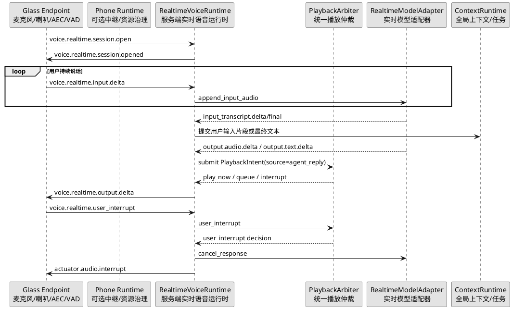
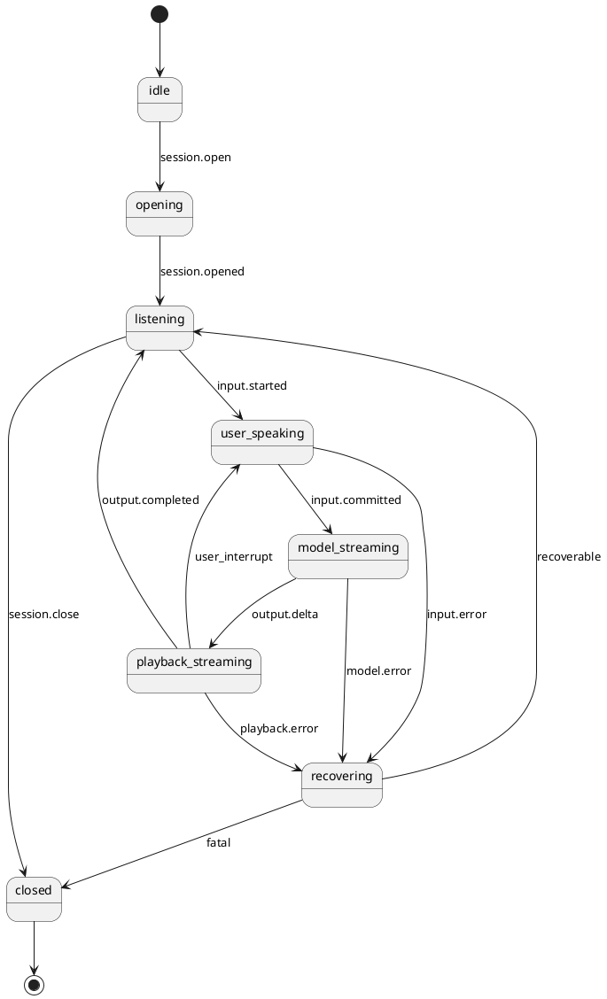

# 全双工实时语音对话设计

更新时间：2026-04-28

## 1. 设计目标

本文档定义 SDK 层的全双工实时语音对话能力。目标是让眼镜、手机、服务器在同一个实时语音会话内同时处理：

1. 用户上行音频持续进入 SDK。
2. 模型文本或音频增量持续下发到设备。
3. 播放期间用户说话可以自然打断或压低当前播报。
4. 普通 Agent 回复、任务通知、视觉告警和用户打断继续复用统一播放仲裁。
5. SDK 运行态能解释每次打断、排队、恢复、丢弃和延迟异常。

现有 [语音对话协议与时序设计](./语音对话协议与时序设计.md) 是半双工基线：播放期间暂停麦克风和 WakeNet。本文档描述新的全双工能力，两者需要长期共存，业务开发者可以按设备能力选择会话模式。

## 2. 能力边界

SDK 负责：

1. 定义实时语音会话协议、事件模型和运行态状态机。
2. 管理服务端实时会话、模型 Adapter、播放仲裁和上下文提交。
3. 提供端侧/手机侧 SDK 需要实现的接口契约。
4. 提供回放测试、延迟断言和误触发断言。

SDK 不负责：

1. 在服务端手写声学回声消除算法。
2. 把具体盲人业务能力写进语音运行时。
3. 要求第一版必须使用 WebRTC。
4. 把某家实时模型供应商协议暴露给业务层。

## 3. 总体架构



核心分层：

1. 端侧实时输入层：采集麦克风音频，尽可能完成 AEC、VAD、端点检测和打断置信度判断。
2. 服务端实时会话层：维护全双工会话状态，把上行音频、模型事件和下行播放连接起来。
3. 播放仲裁层：统一处理 Agent 回复、任务通知、视觉告警、系统提示和用户打断。
4. 模型 Adapter 层：屏蔽不同实时模型供应商差异，输出 SDK 内部统一事件。
5. 回放测试层：用录制或合成事件复现打断、回声、延迟和异常关闭。

## 4. 会话模式

`voice.session.open` 增加可选字段 `mode`：

| mode | 含义 |
| --- | --- |
| `half_duplex` | 现有半双工模式，播放期间暂停收音。 |
| `full_duplex_realtime` | 新全双工实时模式，播放和收音可并行。 |

服务端应允许按设备能力、账号配置或远程配置选择模式。如果设备不支持全双工，必须结构化降级到 `half_duplex`，不能让业务代码自行判断。

## 5. 控制消息

### 5.1 打开实时会话

消息名：`voice.realtime.session.open`

```json
{
  "session_id": "voice_rt_01J...",
  "mode": "full_duplex_realtime",
  "input": {
    "sample_rate": 16000,
    "channels": 1,
    "codec": "pcm16",
    "frame_ms": 20,
    "aec_required": true,
    "vad_required": true
  },
  "output": {
    "sample_rate": 16000,
    "channels": 1,
    "codec": "pcm16",
    "frame_ms": 20
  },
  "interrupt": {
    "enabled": true,
    "min_barge_in_confidence": 0.72,
    "clear_agent_output_on_interrupt": true
  }
}
```

返回消息：`voice.realtime.session.opened`

```json
{
  "session_id": "voice_rt_01J...",
  "accepted_mode": "full_duplex_realtime",
  "transport": "websocket_media_frame",
  "capabilities": {
    "aec": "endpoint",
    "vad": "endpoint",
    "barge_in": true,
    "output_cancel": true
  }
}
```

### 5.2 上行音频

事件名：`voice.realtime.input.delta`

媒体数据走二进制 `MediaFrame`，控制元数据建议包含：

```json
{
  "session_id": "voice_rt_01J...",
  "input_stream_id": "input_01J...",
  "chunk_index": 42,
  "capture_ts_ms": 1730000000123,
  "echo_suppressed": true,
  "voice_activity": "speech",
  "barge_in_confidence": 0.81
}
```

端侧检测到用户开始说话时，应先发：

```json
{
  "name": "voice.realtime.input.started",
  "payload": {
    "session_id": "voice_rt_01J...",
    "input_stream_id": "input_01J...",
    "reason": "vad_speech"
  }
}
```

端侧认为本次用户输入可提交时，应发：

```json
{
  "name": "voice.realtime.input.committed",
  "payload": {
    "session_id": "voice_rt_01J...",
    "input_stream_id": "input_01J...",
    "duration_ms": 1840,
    "finish_reason": "endpoint_detected"
  }
}
```

### 5.3 用户打断

事件名：`voice.realtime.user_interrupt`

```json
{
  "session_id": "voice_rt_01J...",
  "input_stream_id": "input_01J...",
  "reason": "barge_in",
  "barge_in_confidence": 0.86,
  "clear_current_output": true,
  "clear_pending_playback": false
}
```

服务端处理顺序：

1. 记录实时会话打断事件。
2. 转换为 `UserInterruptEvent` 提交给 `PlaybackArbiter`。
3. 取消当前模型输出或丢弃后续模型分片。
4. 下发 `actuator.audio.interrupt` 或 `voice.realtime.output.cancelled`。
5. 保留用户当前输入，继续进入实时模型或降级 ASR。

### 5.4 下行输出

事件名：`voice.realtime.output.delta`

```json
{
  "session_id": "voice_rt_01J...",
  "output_stream_id": "output_01J...",
  "source": "agent_reply",
  "chunk_index": 12,
  "format": "pcm16",
  "playback_intent_id": "agent_reply:output_01J..."
}
```

输出完成：

```json
{
  "name": "voice.realtime.output.completed",
  "payload": {
    "session_id": "voice_rt_01J...",
    "output_stream_id": "output_01J...",
    "finish_reason": "completed"
  }
}
```

会话关闭：

```json
{
  "name": "voice.realtime.session.closed",
  "payload": {
    "session_id": "voice_rt_01J...",
    "reason": "client_closed"
  }
}
```

## 6. 状态机



状态说明：

| 状态 | 含义 |
| --- | --- |
| `idle` | 没有实时会话。 |
| `opening` | 正在协商能力和媒体格式。 |
| `listening` | 可同时接收端侧音频和播放仲裁事件。 |
| `user_speaking` | 检测到用户正在说话，可触发打断。 |
| `model_streaming` | 模型正在输出文本或音频增量。 |
| `playback_streaming` | 设备正在播放 SDK 下发的实时输出。 |
| `recovering` | 当前轮出现可恢复错误，准备降级或重开会话。 |
| `closed` | 会话已关闭。 |

## 7. 播放仲裁关系

全双工实时语音不能绕过 `PlaybackArbiter`。

| 输入 | 仲裁方式 |
| --- | --- |
| 实时模型回复 | 转成 `PlaybackIntent(source=agent_reply)`。 |
| 任务通知 | 转成 `PlaybackIntent(source=task_notification)`。 |
| 手机视觉告警 | 转成 `PlaybackIntent(source=vision_alert)`。 |
| 用户插话 | 转成 `UserInterruptEvent`。 |
| 系统错误提示 | 转成 `PlaybackIntent(source=system_alert)`。 |

默认规则：

1. 用户插话可以打断普通 Agent 回复。
2. 用户插话默认不打断 `critical` 视觉告警，但可以在告警短播报结束后立即进入用户输入处理。
3. 被用户打断的模型输出默认丢弃剩余分片。
4. 待播通知是否保留由 `clear_pending_playback` 和 `resume_policy` 决定。

## 8. 上下文与任务语义

实时会话内会产生两类文本：

1. `partial_transcript`：模型或 ASR 返回的临时转写，只用于调试和 UI 提示。
2. `final_transcript`：可以提交到全局上下文、触发 Tool/Task 的最终文本。

SDK 约束：

1. 只有 `final_transcript` 可以触发业务 Tool/Task。
2. 用户打断当前 Agent 回复时，应取消当前未完成回复对应的输出流。
3. 如果模型已经触发 Tool/Task，任务是否取消必须由 Task 运行时根据取消策略决定，不能由播放器直接取消业务任务。
4. 会话快照应保留最近输入、输出、打断和任务关联信息，便于回放。

## 9. 可观测性

`RealtimeVoiceRuntime.build_runtime_snapshot()` 至少输出：

| 字段 | 含义 |
| --- | --- |
| `active_realtime_session` | 当前实时语音会话。 |
| `realtime_state` | 当前状态机状态。 |
| `active_input_stream_id` | 当前用户输入流。 |
| `active_output_stream_id` | 当前模型输出流。 |
| `recent_realtime_events` | 最近实时语音事件。 |
| `recent_interrupts` | 最近用户打断事件。 |
| `active_playback_intent` | 当前播放仲裁状态，复用已有字段。 |
| `latency_metrics` | 关键延迟指标。 |

关键延迟指标：

| 指标 | 含义 |
| --- | --- |
| `input_first_audio_ms` | 会话打开到第一块上行音频。 |
| `vad_trigger_ms` | 第一块人声音频到 VAD 触发。 |
| `interrupt_decision_ms` | 用户插话到仲裁决策完成。 |
| `model_first_delta_ms` | 输入提交到模型首个增量。 |
| `output_first_audio_ms` | 模型输出到设备首个可播放音频。 |
| `barge_in_count` | 用户打断次数。 |
| `echo_rejected_count` | 回声候选被拒绝次数。 |

## 10. 错误与降级

| 错误 | SDK 行为 |
| --- | --- |
| 端侧不支持 AEC | 拒绝全双工或降级半双工。 |
| VAD 置信度不足 | 不触发用户打断，只记录候选事件。 |
| 实时模型不可用 | 降级到半双工 ASR + 流式 TTS。 |
| 播放器无法取消当前输出 | 标记输出不可打断，并在快照中暴露原因。 |
| 媒体帧乱序或丢失 | 记录流错误，必要时关闭当前实时会话。 |

降级必须通过结构化事件表达，例如：

```json
{
  "name": "voice.realtime.session.degraded",
  "payload": {
    "session_id": "voice_rt_01J...",
    "from": "full_duplex_realtime",
    "to": "half_duplex",
    "reason": "endpoint_aec_not_available"
  }
}
```

## 11. 回放测试要求

全双工专项必须新增回放夹具，至少覆盖：

1. 播放期间用户说话，触发 `voice.realtime.user_interrupt`。
2. 播放期间只有喇叭回声，不触发用户打断。
3. 模型输出首包延迟过高时，快照包含延迟指标。
4. 用户连续插话时，旧输出流被取消，新的输入流继续提交。
5. 半双工设备请求全双工时，结构化降级到半双工。
