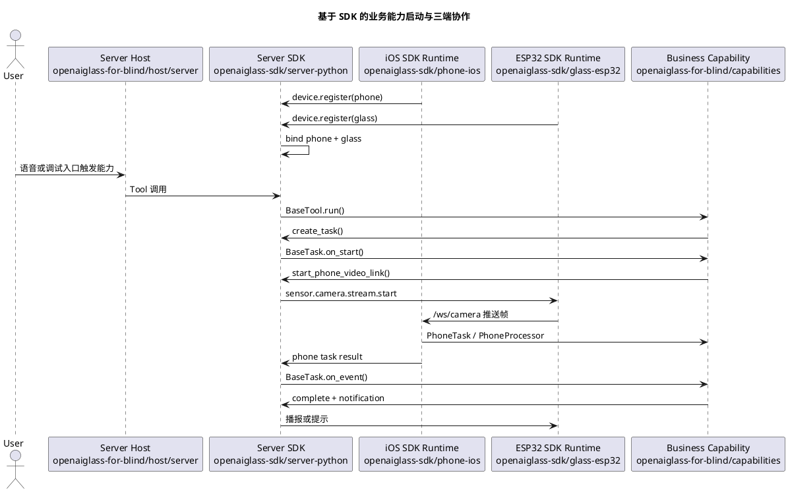

# SDK 安装与能力开发指南

本文面向将要基于 OpenAI Glasses SDK 开发真实业务能力的团队。

开发者不需要理解 SDK 内部的 WebSocket、设备绑定、任务状态机和媒体协议细节，但必须知道三端 SDK 各自负责什么、业务代码应该写在哪里，以及如何完成离线验证和真机联调。

当前指南对应 SDK 版本：`sdk-v4`。本版本新增 `phone_video_link_task` 最小 peer-link 生命周期语义，支持查询、取消、端侧事件回流、结构化失败和错误手机拒绝上报；实时语音打断、全双工语音和公网/NAT 穿透暂不覆盖。

## 1. 当前目录边界

当前仓库拆成两条主线：

| 目录 | 面向对象 | 职责 |
| --- | --- | --- |
| [../openaiglass-sdk/server-python](../openaiglass-sdk/server-python) | 服务端 SDK 开发者 | Python SDK、协议模型、服务端运行时、Tool/Task/Skill 扩展面、测试工具。 |
| [../openaiglass-sdk/phone-ios](../openaiglass-sdk/phone-ios) | iOS 手机端 SDK 开发者 | iOS 通用手机运行时，负责注册、心跳、视频接收、手机任务承载和结果回传。 |
| [../openaiglass-sdk/glass-esp32](../openaiglass-sdk/glass-esp32) | ESP32 眼镜端 SDK 开发者 | ESP32 通用眼镜运行时，负责 WiFi、控制连接、音频、摄像头和端侧命令处理。 |
| [host](./host) | 盲人产品装配团队 | 服务端、手机端、眼镜端宿主配置和启动说明。 |
| [capabilities](./capabilities) | 业务能力开发团队 | `find_object`、导航、识别等真实业务能力。 |
| [docs](./docs) | 产品和研发团队 | 需求、阶段计划、功能设计、验收和当前实现状态。 |
| [testdata](./testdata) | 测试和业务开发团队 | 场景回放、音频、图像、传感器和兼容性数据。 |

业务能力开发优先修改 `openaiglass-for-blind/capabilities` 和 `openaiglass-for-blind/host`。只有当 SDK 公开抽象无法表达新业务时，才向 `openaiglass-sdk` 提交 SDK 层改造。

## 2. 三端 SDK 职责

### 2.1 服务端 Python SDK

服务端 SDK 负责：

1. 设备注册、设备组绑定和心跳维护。
2. 统一控制消息、媒体消息和任务事件模型。
3. Agent、Tool、Task、Skill 和 MCP Adapter 装配。
4. 全局上下文、任务状态、通知和异常处理。
5. 离线场景回放、契约测试和 SDK 包验证。

开发者主要使用：

```python
from openaiglasses import (
    BasePhoneProcessor,
    BasePhoneTask,
    BaseTask,
    BaseTool,
    CapabilityResult,
    OpenAIGlassesSDK,
    PhoneProcessorContext,
    PhoneTaskContext,
    ScenarioRunner,
    ServerSettings,
    TaskContext,
    TaskEvent,
)
```

### 2.2 iOS 手机 SDK 运行时和业务入口

iOS SDK 运行时代码位于 [../openaiglass-sdk/phone-ios](../openaiglass-sdk/phone-ios)。业务开发者不要直接打开或修改 SDK 目录下的 Xcode 工程；盲人业务项目提供自己的手机端 Xcode 入口：

```text
openaiglass-for-blind/host/phone/ios/GlassesVideoReceiver.xcodeproj
```

这个业务侧 Xcode 工程引用 SDK 通用 iOS 运行时代码，并把业务目录下的配置文件打包进 App。

它负责：

1. 从业务工程的 `AppConfig.plist` 读取服务端地址、手机设备编号、配对令牌和目标眼镜编号。
2. 自动连接服务端 `/ws/control`，完成手机注册和心跳。
3. 在本机启动 `/ws/camera` 接收服务，接收眼镜推送的 JPEG 视频帧。
4. 承载手机侧任务，执行手机侧能力插件。
5. 将手机侧处理结果上报回服务端。
6. 提供调试页面，展示接收地址、注册状态、最近帧和最近事件。

`sdk-v2` 起，iOS 运行时已经支持多业务能力并存。业务插件应通过 `PhoneTaskCapabilityRegistry.register(taskType:runtimeBuilder:)` 按服务端下发的 `task_type` 注册；运行时收到 `sdk.phone.task.start` 后会按 `task_type` 选择对应业务插件。旧的 `PhoneCapabilityRuntimeFactory.register { ... }` 只作为单能力兼容入口保留，新能力不要再使用。

业务侧手机配置文件：

```text
openaiglass-for-blind/host/phone/config/AppConfig.plist
```

模板：

```text
openaiglass-for-blind/host/phone/config/AppConfig.plist.example
```

同步脚本只写业务侧配置文件。业务侧 Xcode 工程会把该文件作为 App 资源打包，不再写入 SDK 目录下的 iOS 配置文件。

```text
openaiglass-for-blind/host/phone/config/AppConfig.plist
```

关键配置项：

| 配置项 | 说明 |
| --- | --- |
| `serverBaseURLString` | 服务端 HTTP 地址，例如 `http://192.168.1.10:8765`。运行时会自动转换成控制 WebSocket 地址。 |
| `phoneDeviceID` | 手机设备编号，例如 `phone-001`。 |
| `pairToken` | 手机配对令牌，必须与服务端配置一致。 |
| `desiredGlassDeviceID` | 希望绑定的眼镜设备编号，例如 `glass-001`。 |

服务端本地配置也归属业务工程：

```text
openaiglass-for-blind/config/local_server.env
```

模板：

```text
openaiglass-for-blind/config/local_server.env.example
```

执行配置同步时，脚本会自动探测当前 Mac 可供手机和眼镜访问的局域网 IPv4，并回写 `SERVER_PUBLIC_HOST`：

```bash
bash openaiglass-for-blind/scripts/sync_sdk_live_config.sh
```

如果自动探测失败，可以手动指定一次：

```bash
bash openaiglass-for-blind/scripts/sync_sdk_live_config.sh --public-host 192.168.1.23
```

业务开发者通过业务工程入口打开手机端，不直接进入 SDK 目录：

```bash
bash openaiglass-for-blind/scripts/run_phone.sh open
```

命令行构建示例：

```bash
bash openaiglass-for-blind/scripts/run_phone.sh build-sim
```

### 2.3 ESP32 眼镜 SDK 运行时

眼镜 SDK 运行时位于 [../openaiglass-sdk/glass-esp32](../openaiglass-sdk/glass-esp32)，当前以 ESP-IDF 工程形式交付。

它负责：

1. 读取 WiFi、服务端控制地址、眼镜设备编号和配对令牌。
2. 连接服务端 `/ws/control`，发送 `device.register` 和 `device.heartbeat`。
3. 连接服务端 `/ws_audio`，上传语音片段并接收播放控制。
4. 响应 `sensor.camera.capture`，完成单次抓拍并回传 `sensor.camera.captured`。
5. 响应 `sensor.camera.stream.start/stop`，把摄像头帧推送到手机 `/ws/camera`。
6. 处理通知、播报、唤醒和端侧运行状态。

本地私有配置：

```text
openaiglass-for-blind/host/glass/config/local_build.env
```

模板：

```text
openaiglass-for-blind/host/glass/config/local_build.env.example
```

关键配置项：

| 配置项 | 说明 |
| --- | --- |
| `GLASS_WIFI_PRIMARY_SSID` | 主 WiFi 名称。 |
| `GLASS_WIFI_PRIMARY_PASSWORD` | 主 WiFi 密码。 |
| `GLASS_SERVER_WS_URI` | 服务端控制 WebSocket 地址，例如 `ws://192.168.1.10:8765/ws/control`。 |
| `GLASS_DEVICE_ID` | 眼镜设备编号，例如 `glass-001`。 |
| `GLASS_PAIR_TOKEN` | 眼镜配对令牌，必须与服务端配置一致。 |
| `GLASS_HEARTBEAT_INTERVAL_MS` | 心跳间隔。 |

构建示例：

```bash
PROJECT_DIR=openaiglass-sdk/glass-esp32 \
  bash openaiglass-for-blind/scripts/run_glass.sh --build-only
```

烧录和串口监控按实际设备端口执行：

```bash
PORT=/dev/tty.usbmodemXXXX \
  bash openaiglass-for-blind/scripts/run_glass.sh
```

## 3. 安装服务端 Python SDK

正式发布后，在业务项目中安装：

```bash
pip install openaiglasses-sdk
```

当前仓库本地开发或发布前验证：

```bash
pip install ./openaiglass-sdk/server-python
```

安装后公开导入入口是：

```python
import openaiglasses
```

本仓库推荐使用 `uv` 执行命令：

```bash
PYTHONPATH=openaiglass-sdk/server-python:openaiglass-for-blind:. \
  uv run python -c "import openaiglasses; print(openaiglasses.__all__)"
```

SDK 包验证：

```bash
uv run python openaiglass-sdk/scripts/run_sdk_package_check.py
```

## 4. 推荐业务能力工程结构

外部团队开发新能力时，建议按能力聚合，而不是按设备散落业务代码：

```text
my-glasses-capability/
  pyproject.toml
  src/
    my_capability/
      __init__.py
      server/
        tool.py
        task.py
      phone/
        processor.py
        task.py
        ios/
          MyPhoneCapability.swift
      glass/
        README.md
        config/
          local_build.env.example
      scenario.py
      main.py
  testdata/
    scenario/
      my_capability_basic.json
```

在本仓库内新增盲人业务能力时，建议使用：

```text
openaiglass-for-blind/capabilities/<capability_name>/
  README.md
  server/
    tool.py
    task.py
  phone/
    processor.py
    task.py
    ios/
  scenario.py
```

可以参考现有找物体能力：

1. [capabilities/find_object/server/tool.py](./capabilities/find_object/server/tool.py)
2. [capabilities/find_object/server/task.py](./capabilities/find_object/server/task.py)
3. [capabilities/find_object/phone/processor.py](./capabilities/find_object/phone/processor.py)
4. [capabilities/find_object/phone/task.py](./capabilities/find_object/phone/task.py)
5. [capabilities/find_object/phone/ios](./capabilities/find_object/phone/ios)
6. [capabilities/find_object/scenario.py](./capabilities/find_object/scenario.py)

## 5. 开发服务端 Tool

Tool 是模型可以调用的短时业务入口。它应该表达“启动什么能力”或“查询什么业务结果”，不应该直接处理 WebSocket、设备绑定表或媒体帧。

```python
from typing import Any

from pydantic import BaseModel, Field

from openaiglasses import BaseTool, CapabilityResult


class StartDemoInput(BaseModel):
    target: str = Field(description="用户希望处理的目标")


class StartDemoTool(BaseTool):
    name = "start_demo"
    description = "启动一个演示能力"
    input_model = StartDemoInput

    def run(self, context, input_data: dict[str, Any]) -> CapabilityResult:
        target = str(input_data.get("target") or "").strip()
        if not target:
            return CapabilityResult.failed(code="invalid_input", message="target 不能为空")

        task = context.create_task(
            task_type="demo_task",
            input_data={"target": target},
        )
        return CapabilityResult.success(
            data={"task_id": task.task_id, "target": target},
            message=f"已启动演示任务：{target}",
        )
```

Tool 中常用的 `context` 高层能力：

| 方法 | 用途 |
| --- | --- |
| `require_glass()` | 获取当前设备组的在线眼镜。 |
| `require_phone()` | 获取当前设备组的在线手机。 |
| `query_devices()` | 查询当前设备组所有设备。 |
| `capture_photo(reason=...)` | 请求眼镜单次抓拍。 |
| `start_phone_video_link(reason=..., params=...)` | 启动眼镜到手机的视频链路。 |
| `stop_phone_video_link(reason=...)` | 停止眼镜到手机的视频链路。 |
| `create_task(task_type=..., input_data=...)` | 创建 SDK 托管任务。 |
| `query_task(task_id)` | 查询任务状态。 |
| `cancel_task(task_id)` | 取消任务。 |
| `start_phone_task(task_type=..., params=...)` | 启动手机侧持续任务。 |
| `stop_phone_task(task_type=..., reason=...)` | 停止手机侧持续任务。 |
| `submit_notification(text=..., priority=...)` | 向设备侧提交播报或提示。 |
| `mcp(method_name, arguments)` | 调用 SDK 统一注册的 MCP 方法，例如地图、搜索或导航规划。 |

### 5.1 在 Tool 中调用 MCP

`sdk-v3` 起，业务 Tool 可以直接通过 `context.mcp(...)` 调用 SDK 已注册的 MCP adapter。业务代码不要直接 import 具体 adapter，也不要自行构造 `McpRegistry`、`McpGateway` 或 `AgentToolContext`。

推荐写法：

```python
from typing import Any

from pydantic import BaseModel, Field

from openaiglasses import BaseTool, CapabilityResult


class PrepareNavigationInput(BaseModel):
    origin: str = Field(description="起点")
    destination: str = Field(description="终点")
    strategy: str = Field(default="walking", description="路线策略")


class PrepareNavigationTool(BaseTool):
    name = "prepare_navigation"
    description = "准备一条导航路线"
    input_model = PrepareNavigationInput

    def run(self, context, input_data: dict[str, Any]) -> CapabilityResult:
        route = context.mcp(
            "amap.route_plan",
            {
                "origin": input_data["origin"],
                "destination": input_data["destination"],
                "strategy": input_data.get("strategy", "walking"),
            },
        )
        if not route.ok:
            return route
        return CapabilityResult.success(data={"route": route.data})
```

MCP adapter 仍由宿主装配入口注册：

```python
def create_sdk() -> OpenAIGlassesSDK:
    sdk = OpenAIGlassesSDK()
    sdk.register_mcp_adapter(AmapMcpAdapter())
    sdk.register_tool(PrepareNavigationTool())
    return sdk
```

`context.mcp(...)` 的失败会返回 `CapabilityResult.failed(...)`，错误结果中包含 `method_name`、输入摘要和 SDK 统一错误码。真实服务端运行时会把 MCP 调用轨迹写入 agent session trace；离线测试中可以通过 `sdk.device_groups.list_mcp_traces()` 断言调用是否发生。

## 6. 开发服务端 Task

Task 用于长流程能力，例如找物、导航、持续观察、识别或状态追踪。

```python
from openaiglasses import BaseTask, TaskContext, TaskEvent


class DemoTask(BaseTask):
    task_type = "demo_task"
    description = "演示后台任务"

    def on_start(self, context: TaskContext) -> None:
        target = str(context.input.get("target") or "")
        context.update({"target": target})
        context.emit_state("running", {"phase": "started"})
        context.device_group.start_phone_video_link(
            reason="demo",
            params={"target": target, "processor_type": "demo_processor"},
        )
        context.device_group.start_phone_task(
            task_type="demo_phone_task",
            params={"target": target, "processor_type": "demo_processor"},
        )

    def on_event(self, context: TaskContext, event: TaskEvent) -> None:
        if event.name == "phone.demo.result":
            context.device_group.submit_notification(
                text=str(event.payload.get("summary") or "任务已完成"),
                priority="high",
            )
            context.device_group.stop_phone_task(
                task_type="demo_phone_task",
                reason="task.completed",
            )
            context.complete(dict(event.payload))

    def on_cancel(self, context: TaskContext) -> None:
        context.device_group.stop_phone_task(
            task_type="demo_phone_task",
            reason="task.cancelled",
        )
        context.device_group.stop_phone_video_link(reason="task.cancelled")
        super().on_cancel(context)
```

Task 中不要直接持有 WebSocket 连接，不要自己维护任务状态表。任务状态通过 `TaskContext` 更新，设备能力通过 `context.device_group` 获取。

### 6.1 视频直连系统任务

`sdk-v4` 起，`phone_video_link_task` 是 SDK 系统任务。业务能力仍然只通过公开入口启动、查询和取消，不需要自己实现 peer-link 状态机。

```python
link = context.device_group.start_phone_video_link(
    reason="need_live_frames",
    params={"frame_interval_ms": 350},
)

current = context.device_group.query_task(link["task_id"])
if current.context.get("phase") == "streaming":
    context.device_group.submit_notification(text="视频链路已就绪")

context.device_group.cancel_task(link["task_id"])
```

任务查询结果中的关键字段：

| 字段 | 含义 |
| --- | --- |
| `state` | 统一任务状态，可为 `running`、`completed`、`cancelled`、`failed`、`timeout`。 |
| `context.phase` | 视频链路阶段，可为 `peer_link_preparing`、`peer_link_ready`、`streaming`、`stopping`、`completed`、`cancelled`、`failed`、`timeout`。 |
| `context.stream_id` | 本次视频流编号，眼镜推流和手机上报事件都应携带。 |
| `context.phone_device_id` | 绑定的手机编号。手机上报事件时必须一致，否则服务端拒绝。 |
| `context.target_ws_uri` | 眼镜应推送视频帧的手机接收地址。 |
| `context.last_peer_link_event` | 最近一次 peer-link 事件。 |
| `context.last_camera_event` | 最近一次 camera stream 事件。 |
| `error` / `context.last_error` | 结构化失败信息。 |

端侧标准事件如下：

| 事件名 | 上报时机 | SDK 行为 |
| --- | --- | --- |
| `peer_link.ready` | 手机确认已准备好接收眼镜推流。 | 任务阶段进入 `peer_link_ready`。 |
| `camera.stream.started` | 手机已经收到或确认视频流开始。 | 任务阶段进入 `streaming`。 |
| `peer_link.failed` | 建链失败，例如地址不可达、鉴权失败。 | 任务进入 `failed`，保留结构化错误。 |
| `peer_link.broken` | 运行中链路断开。 | 任务进入 `failed`，保留结构化错误。 |
| `peer_link.closed` | 手机主动关闭链路。 | 任务进入 `completed`。 |
| `camera.stream.stopped` | 手机确认视频流已停止。 | 活动任务进入 `completed`；如果任务已取消，则保持 `cancelled` 终态。 |

手机或眼镜可以通过服务端 HTTP 上报事件：

```bash
curl -X POST http://127.0.0.1:8000/api/tasks/report-event \
  -H 'Content-Type: application/json' \
  -d '{
    "task_id": "task_xxx",
    "phone_device_id": "phone-001",
    "event_name": "peer_link.ready",
    "payload": {
      "stream_id": "stream_xxx",
      "transport": "lan"
    }
  }'
```

业务侧不要在 `openaiglass-for-blind/capabilities` 内自行维护视频任务状态表，也不要自行绕过 SDK 给眼镜发送 `sensor.camera.stream.start/stop`。真实公网/NAT 穿透、自动重试、链路健康检查仍由 SDK 后续版本统一补齐。

## 7. 开发手机侧能力

手机侧能力分为两层：

1. `BasePhoneProcessor`：处理一帧图像、一段传感器数据或一次本地模型输出。
2. `BasePhoneTask`：组织一个持续任务，决定什么时候调用处理器、什么时候输出结果。

### 7.1 PhoneProcessor

```python
from typing import Any

from openaiglasses import BasePhoneProcessor, PhoneProcessorContext


class DemoProcessor(BasePhoneProcessor):
    processor_type = "demo_processor"
    description = "演示手机处理器"

    def on_frame(self, context: PhoneProcessorContext, frame: Any) -> None:
        text = str(frame)
        context.emit_result(
            {
                "event_name": "phone.demo.result",
                "found": "目标" in text,
                "summary": f"已处理帧：{text}",
            }
        )
```

### 7.2 PhoneTask

```python
from typing import Any

from openaiglasses import BasePhoneTask, PhoneTaskContext


class DemoPhoneTask(BasePhoneTask):
    task_type = "demo_phone_task"
    description = "演示手机任务"

    def on_start(self, context: PhoneTaskContext) -> None:
        context.emit_state("running", {"phase": "waiting_frame"})

    def on_frame(self, context: PhoneTaskContext, frame: Any) -> None:
        result = context.process_frame(
            processor_type=str(context.params.get("processor_type") or "demo_processor"),
            frame=frame,
        )
        if result:
            context.emit_result(result)

    def on_stop(self, context: PhoneTaskContext) -> None:
        context.emit_state("stopped", {"reason": "server_requested"})
```

### 7.3 iOS 插件代码放在哪里

Python `PhoneProcessor` 和 `PhoneTask` 用于 SDK 回放、服务端装配和能力契约。真正跑在 iPhone 上的业务插件应放在业务能力目录下，例如：

```text
openaiglass-for-blind/capabilities/find_object/phone/ios/
```

iOS 通用运行时仍然放在：

```text
openaiglass-sdk/phone-ios/
```

不要把具体业务识别逻辑直接写进 `openaiglass-sdk/phone-ios` 的通用运行时里。通用运行时只负责注册、接收、分发、状态展示和结果回传。

### 7.4 iOS 插件如何注册到通用运行时

本节是 `sdk-v2` 新增的 iOS 手机能力接入方式。

每个 iOS 业务插件只注册自己负责的 `taskType`。不要在业务侧手写组合 Runtime，也不要为了支持多个能力去修改 `CameraStreamStore` 或控制连接代码。

推荐写法：

```swift
enum DemoPhoneCapabilityInstaller {
    static func install() {
        PhoneCapabilityBootstrap.registerInstaller {
            PhoneTaskCapabilityRegistry.register(taskType: "demo_phone_task") {
                DemoPhoneCapabilityRuntime()
            }
        }
    }
}
```

宿主 App 启动时需要做两件事：

1. 确保每个业务插件的 `install()` 被调用一次。
2. 调用 `PhoneCapabilityBootstrap.applyRegisteredInstallers()`，让 SDK 执行所有已登记的安装函数。

当前仓库仍以业务侧 Xcode 工程承载手机端 App，工程入口为 `openaiglass-for-blind/host/phone/ios/GlassesVideoReceiver.xcodeproj`。它引用 SDK 通用运行时代码，业务插件接入 target 的推荐方式是：

1. 在 `openaiglass-for-blind/capabilities/<capability>/phone/ios/` 下维护业务 Swift 文件。
2. 在 Xcode 中把这些 Swift 文件加入手机宿主 App target 的 Compile Sources。
3. 在宿主 App 的启动入口集中调用各插件 `install()`。
4. 多个插件同时加入 target 时，只要 `taskType` 不重复，SDK 会自动按任务类型分发。

暂不建议业务团队自行封装 Swift Package 或 XCFramework。等 SDK 发布形态进一步稳定后，再由 SDK 团队统一提供包结构和版本兼容规则。

## 8. 眼镜端能力扩展方式

当前 ESP32 眼镜 SDK 运行时主要提供通用硬件能力，不建议业务团队直接在 `openaiglass-sdk/glass-esp32` 中写具体业务策略。

业务能力应该优先通过服务端 Task 调用这些系统能力：

| 眼镜能力 | 服务端调用方式 | 眼镜端处理 |
| --- | --- | --- |
| 单次抓拍 | `context.capture_photo(reason=...)` | 响应 `sensor.camera.capture`，回传 `sensor.camera.captured`。 |
| 视频流到手机 | `context.start_phone_video_link(...)` | 响应 `sensor.camera.stream.start`，向手机 `/ws/camera` 推送帧。 |
| 停止视频流 | `context.stop_phone_video_link(...)` | 响应 `sensor.camera.stream.stop`。 |
| 语音输入 | SDK 服务端 `/ws_audio` | 眼镜录音、上传音频段。 |
| 播报和通知 | `context.submit_notification(...)` | 眼镜接收通知并播放或提示。 |

如果新业务必须新增眼镜硬件能力，应按下面顺序处理：

1. 先在业务文档中说明新增硬件能力的输入、输出和失败情况。
2. 在 `openaiglass-sdk/docs/structure-design` 中补 SDK 协议或运行时设计。
3. 在服务端 SDK 中补公开上下文方法或标准控制消息。
4. 在 `openaiglass-sdk/glass-esp32` 中实现通用能力，不写业务策略。
5. 在 `openaiglass-for-blind/capabilities/<capability>` 中调用新能力。

## 9. 装配 SDK 并启动服务端

每个业务项目都应该有一个很薄的装配入口，只负责注册业务能力。

```python
from openaiglasses import OpenAIGlassesSDK, ServerSettings

from my_capability.phone.processor import DemoProcessor
from my_capability.phone.task import DemoPhoneTask
from my_capability.server.task import DemoTask
from my_capability.server.tool import StartDemoTool


def create_sdk() -> OpenAIGlassesSDK:
    sdk = OpenAIGlassesSDK()
    sdk.register_tool(StartDemoTool())
    sdk.register_task(DemoTask())
    sdk.register_phone_processor(DemoProcessor())
    sdk.register_phone_task(DemoPhoneTask())
    return sdk


def main() -> None:
    settings = ServerSettings.from_env()
    create_sdk().run_server(settings)


if __name__ == "__main__":
    main()
```

本仓库盲人业务服务端装配入口是：

```text
openaiglass-for-blind/host/server/main.py
```

它注册了 `find_object`、`traffic_light`、`navigation`、`timer` 等盲人业务能力的 Tool、Task、PhoneProcessor、PhoneTask、MCP adapter 和场景回放处理器。

启动盲人业务服务端：

```bash
PYTHONPATH=openaiglass-sdk/server-python:openaiglass-for-blind:. \
  uv run python openaiglass-for-blind/host/server/main.py --host 0.0.0.0 --port 8765
```

也可以使用封装脚本：

```bash
bash openaiglass-for-blind/scripts/run_server.sh
```

## 10. 离线回放验证

业务能力开发应先通过离线回放，再进入真机联调。

这里的“回放”不是播放视频给人看，而是把一次真实多设备交互过程离线重新驱动给 SDK 和业务能力。真实设备链路里按时间发生的输入，例如眼镜帧、传感器读数、手机处理结果和任务事件，会被写成固定场景数据；测试时由 SDK 用 mock 眼镜、mock 手机和回放传感器提供者重新执行一遍。

SDK 对测试的支持主要包括：

| 能力 | 用途 |
| --- | --- |
| `ScenarioRunner.run(...)` | 执行一个场景，驱动 Tool、Task、PhoneProcessor、PhoneTask 和场景处理器完成闭环。 |
| `ScenarioRunner.describe(...)` | 读取场景摘要，检查 capability、输入资产和期望断言。 |
| `ScenarioRunner.validate(...)` | 校验场景 manifest 和资产引用，不执行完整业务流程。 |
| `ReplayTimeline` | 表达按时间发生的帧、传感器和任务事件。 |
| `ReplaySensorProvider` | 在没有真实传感器时，向业务能力提供固定传感器读数。 |
| `MockGlassRuntime` / `MockPhoneRuntime` | 替代真实眼镜和手机，记录下发命令、手机任务和通知结果。 |

离线回放适合验证：

1. Tool 是否能创建正确的 SDK 托管任务。
2. Task 是否能启动和停止手机任务、视频链路或传感器输入。
3. 手机侧 Processor / PhoneTask 是否能处理固定输入并回传事件。
4. 服务端是否能根据手机事件完成、失败或取消任务。
5. 最终通知、设备命令、任务状态和结构化结果是否符合预期。

离线回放不替代真机测试。它不验证真实网络抖动、摄像头权限、iOS 后台行为、ESP32 引脚、电源、音频链路和模型性能；这些仍需要进入真机联调阶段验证。

最小调用：

```python
from pathlib import Path

from openaiglasses import ScenarioRunner

from my_capability.main import create_sdk


result = ScenarioRunner(create_sdk()).run(
    Path("testdata/scenario/my_capability_basic.json")
)
assert result["assertions"]["passed"]
```

场景文件应描述：

1. 设备组中有哪些 mock 设备。
2. 要启动哪个能力或任务。
3. 输入帧、传感器、任务事件的时间线。
4. 期望的任务状态、结果、通知和设备命令。

开发新能力时，建议至少准备以下场景：

| 场景 | 目标 |
| --- | --- |
| 成功路径 | 验证能力可以从触发到完成。 |
| 缺少设备 | 验证没有手机或眼镜时能给出结构化失败。 |
| 启动失败 | 验证视频链路、手机任务或传感器启动失败时的任务状态。 |
| 取消路径 | 验证任务取消后能停止手机任务和端侧链路。 |
| 传感器组合输入 | 验证视觉帧和方向、位置等传感器输入能一起驱动能力。 |

本仓库已有场景：

```text
openaiglass-for-blind/testdata/scenario/
```

执行：

```bash
uv run python openaiglass-for-blind/scripts/run_sdk_scenario.py \
  --scenario-dir openaiglass-for-blind/testdata/scenario \
  --pretty
```

只查看场景摘要：

```bash
uv run python openaiglass-for-blind/scripts/run_sdk_scenario.py \
  --describe-scenario openaiglass-for-blind/testdata/scenario/find_object_with_testdata.json \
  --pretty
```

只校验场景和资产引用：

```bash
uv run python openaiglass-for-blind/scripts/run_sdk_scenario.py \
  --validate-scenarios openaiglass-for-blind/testdata/scenario \
  --pretty
```

进入真机联调前，还应执行完整预检。预检会组合 Python 编译检查、入口检查、边界检查、场景回放、SDK 契约测试、兼容性测试和健康检查：

```bash
uv run python openaiglass-for-blind/scripts/run_sdk_preflight.py \
  --report logs/sdk-preflight-current.json
```

## 11. 三端真机联调流程

真机联调前，先同步配置并检查：

```bash
bash openaiglass-for-blind/scripts/sync_sdk_live_config.sh
bash openaiglass-for-blind/scripts/run_sdk_live_check.sh \
  --report logs/sdk-live-check-current.json
```

`sync_sdk_live_config.sh` 会在每次执行时自动探测当前本机服务端局域网 IP，并同步到：

1. `openaiglass-for-blind/config/local_server.env` 的 `SERVER_PUBLIC_HOST`。
2. `openaiglass-for-blind/host/phone/config/AppConfig.plist` 的 `serverBaseURLString`。
3. `openaiglass-for-blind/host/glass/config/local_build.env` 的 `GLASS_SERVER_WS_URI`。

如果开发机网络频繁变化，不需要手动改手机或眼镜配置；重新执行同步脚本即可。自动探测失败时再使用：

```bash
bash openaiglass-for-blind/scripts/sync_sdk_live_config.sh --public-host 192.168.1.23
```

推荐启动顺序：

1. 启动服务端。
2. 启动 iOS 手机端 SDK 运行时。
3. 启动 ESP32 眼镜端 SDK 运行时。
4. 确认手机和眼镜都注册到服务端并绑定到同一设备组。
5. 触发语音、调试入口或 Tool。
6. 观察服务端任务事件、手机端检测结果、眼镜端抓拍或视频流日志。

服务端：

```bash
bash openaiglass-for-blind/scripts/run_server.sh local start
```

iOS 手机端：

```bash
bash openaiglass-for-blind/scripts/run_phone.sh open
```

该命令会先同步业务配置，再打开业务侧 Xcode 工程：

```text
openaiglass-for-blind/host/phone/ios/GlassesVideoReceiver.xcodeproj
```

不要打开 `openaiglass-sdk/phone-ios` 下的工程作为业务开发入口。

眼镜端：

```bash
PORT=/dev/tty.usbmodemXXXX \
  bash openaiglass-for-blind/scripts/run_glass.sh
```

联调时优先看：

| 端 | 观察点 |
| --- | --- |
| 服务端 | `/api/health`、`/api/runtime/devices`、设备注册、绑定、任务创建、任务事件、错误码。 |
| iOS 手机 | 页面中的服务端状态、当前接收地址、最近帧、最近任务结果、最近错误。 |
| ESP32 眼镜 | WiFi 连接、`device.registered`、心跳、`sensor.camera.capture`、`sensor.camera.stream.start/stop`、音频连接。 |

## 12. 三端链路时序



## 13. 功能文档与实现对齐

新团队开发能力前，建议先阅读：

1. [docs/当前实现状态.md](./docs/当前实现状态.md)
2. [docs/restriction/设想的功能与实现方案.md](./docs/restriction/设想的功能与实现方案.md)
3. [docs/restriction/软件架构设计.md](./docs/restriction/软件架构设计.md)
4. [docs/stage1/plan/第一期功能开发计划.md](./docs/stage1/plan/第一期功能开发计划.md)

如果要新增一个能力，至少补齐：

1. 能力目标和验收方式。
2. 服务端 Tool 和 Task。
3. 手机端 Processor 和 PhoneTask。
4. 如有必要，补 iOS 业务插件。
5. 如有必要，提出眼镜端通用硬件能力扩展。
6. 至少一个离线回放场景。
7. 三端联调启动顺序和日志观察点。

## 14. 预检和回归命令

SDK 包检查：

```bash
uv run python openaiglass-sdk/scripts/run_sdk_package_check.py
```

SDK 契约和核心单元测试：

```bash
uv run python -m pytest \
  openaiglass-sdk/tests/contracts \
  openaiglass-sdk/tests/unit/test_sdk_phase_two.py \
  -q
```

盲人业务场景回放：

```bash
uv run python openaiglass-for-blind/scripts/run_sdk_scenario.py \
  --scenario-dir openaiglass-for-blind/testdata/scenario \
  --pretty
```

综合预检：

```bash
uv run python openaiglass-for-blind/scripts/run_sdk_preflight.py \
  --report logs/sdk-preflight-current.json
```

真机配置检查：

```bash
uv run python openaiglass-for-blind/scripts/run_sdk_live_check.py \
  --report logs/sdk-live-check-current.json
```

## 15. 开发者不要做的事

为了让业务能力可以复用和迁移，开发者不要：

1. 在 `openaiglass-sdk/server-python` 中写具体业务能力。
2. 在 `openaiglass-sdk/phone-ios` 中直接写 `find_object`、导航、地图、计时器等业务策略。
3. 在 `openaiglass-sdk/glass-esp32` 中写具体业务流程判断。
4. 直接拼接控制 WebSocket 消息。
5. 直接读写设备绑定表。
6. 为单个业务能力新增专用系统接口。
7. 跳过离线回放，直接进入真机联调。
8. 为了调用地图、导航或外部服务而直接 import SDK 内部 MCP adapter；应使用 `context.mcp(...)`。

如果业务能力需要新的系统级抽象，应先写清需求、输入输出、异常情况和验收方式，再把它沉淀为 SDK 的公开接口。

## 16. 常见问题

### 16.1 为什么业务项目还要写手机和眼镜目录？

SDK 提供通用运行时，业务项目提供业务插件、产品配置和启动说明。手机和眼镜宿主目录不应复制 SDK 主体代码，只保留业务装配和产品差异。

### 16.2 iOS SDK 当前是不是已经能作为 Swift Package 引入？

当前还没有收敛为 Swift Package 或 XCFramework。现在的推荐方式是：业务开发者打开 `openaiglass-for-blind/host/phone/ios/GlassesVideoReceiver.xcodeproj`，该工程引用 `openaiglass-sdk/phone-ios` 作为通用运行时；业务插件放在 `capabilities/<name>/phone/ios`，配置放在 `openaiglass-for-blind/host/phone/config`。

### 16.3 ESP32 SDK 当前是不是已经能作为 ESP-IDF component 引入？

当前仍是 ESP-IDF 工程，后续可以继续拆成 component。现在的推荐方式是通过 `openaiglass-for-blind/scripts/run_glass.sh` 构建 `openaiglass-sdk/glass-esp32`，业务侧只提供配置和硬件能力需求。

### 16.4 新能力什么时候应该改 SDK？

只有当多个业务都会用到同一种系统能力，或者现有 `DeviceGroupContext`、`TaskContext`、`PhoneTaskContext` 无法表达业务需求时，才应该改 SDK。

### 16.5 如何判断路径是否又混乱了？

执行：

```bash
rg -n "openaiglass-sdk/python|openaiglass-for-blind/host/phone/ios|openaiglass-for-blind/host/glass/src|openaiglass-for-blind/server|openaiglass-for-blind/phone|openaiglass-for-blind/glass|openaiglass-sdk/openaiglass-sdk|openaiglass-for-blind/openaiglass-for-blind" \
  openaiglass-sdk openaiglass-for-blind README.md 工作边界说明.md
```

正常情况下不应命中迁移前路径。
