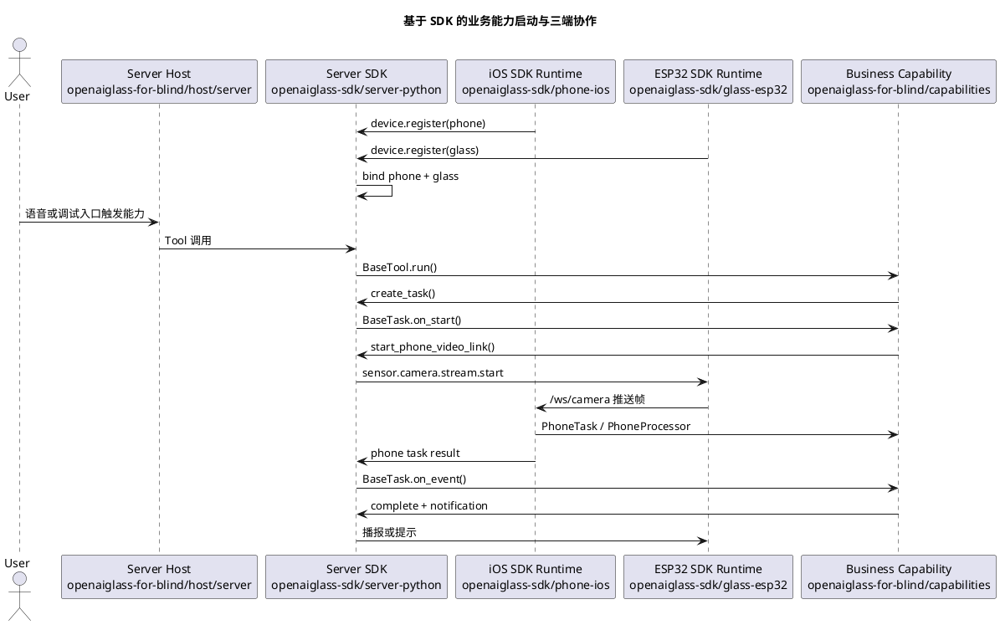

# SDK 安装与能力开发指南

本文面向将要基于 OpenAI Glasses SDK 开发真实业务能力的团队。

开发者不需要理解 SDK 内部的 WebSocket、设备绑定、任务状态机和媒体协议细节，但必须知道三端 SDK 各自负责什么、业务代码应该写在哪里，以及如何使用设备级数据回放完成高效自测，再进入真机联调。

当前指南对应 SDK 版本：`sdk-v18`。本版本补齐全双工实时语音对话第一版，新增 `RealtimeVoiceRuntime`、实时语音协议事件、`/ws_realtime_audio` 媒体入口、实时用户插话、迟到输出丢弃、回声候选观测和运行态快照；上一版本补齐 SQLite 任务持久化第一版。公网/NAT 穿透、跨机器分布式任务平台、iOS 二进制 XCFramework 和 ESP32 component registry 发布暂不覆盖。

当前 SDK 能力状态：

| 能力 | 当前状态 | 业务开发者应如何使用 |
| --- | --- | --- |
| 半双工语音问答 | 可用 | 继续按 `/ws_audio`、`voice.session.open` 和普通 Tool/Task 开发业务能力。 |
| 全双工实时语音 | `sdk-v18` 第一版可联调 | 端侧或手机侧接入 `voice.realtime.*` 协议；业务 Tool/Task 不直接处理实时语音协议。 |
| 播放仲裁和用户打断 | 可用 | 业务只提交通知优先级和策略，不直接控制播放器。 |
| 账号、组织、权限和配置 | 可用 | 业务通过 `DeviceGroupContext` 读取配置和做权限检查，不自建绑定表。 |
| SQLite 任务持久化 | 可用 | 单机多进程可用 SQLite；跨机器部署仍需后续外部数据库方案。 |
| iOS/ESP32 SDK 包形态 | 源码包可检查 | 业务工程引用 SDK 源码运行时；二进制发布仍是后续工作。 |

## 1. 当前目录边界

当前仓库拆成两条主线：

| 目录 | 面向对象 | 职责 |
| --- | --- | --- |
| [../openaiglass-sdk/server-python](../openaiglass-sdk/server-python) | 服务端 SDK 开发者 | Python SDK、协议模型、服务端运行时、Tool/Task/Skill 扩展面、测试工具。 |
| [../openaiglass-sdk/phone-ios](../openaiglass-sdk/phone-ios) | iOS 手机端 SDK 开发者 | iOS 通用手机运行时，负责注册、心跳、视频接收、手机任务承载和结果回传。 |
| [../openaiglass-sdk/glass-esp32](../openaiglass-sdk/glass-esp32) | ESP32 眼镜端 SDK 开发者 | ESP32 通用眼镜运行时，负责 WiFi、控制连接、音频、摄像头和端侧命令处理。 |
| [host](./host) | 盲人产品装配团队 | 服务端、手机端、眼镜端宿主配置和启动说明。 |
| [capabilities](./capabilities) | 业务能力开发团队 | `find_object`、导航、识别等真实业务能力。 |
| [docs](./docs) | 产品和研发团队 | 需求、阶段计划、功能设计、验收和当前实现状态。 |
| [testdata](./testdata) | 测试和业务开发团队 | 设备级数据回放使用的音频、视频、图像、传感器和兼容性数据资产。 |

业务能力开发优先修改 `openaiglass-for-blind/capabilities` 和 `openaiglass-for-blind/host`。只有当 SDK 公开抽象无法表达新业务时，才向 `openaiglass-sdk` 提交 SDK 层改造。

## 2. 三端 SDK 职责

### 2.1 服务端 Python SDK

服务端 SDK 负责：

1. 设备注册、设备组绑定和心跳维护。
2. 统一控制消息、媒体消息和任务事件模型。
3. Agent、Tool、Task、Skill 和 MCP Adapter 装配。
4. 全局上下文、任务状态、通知和异常处理。
5. 半双工语音、全双工实时语音、播放仲裁和用户打断。
6. 设备级数据回放、契约测试和 SDK 包验证。

开发者主要使用：

```python
from openaiglasses import (
    BaseTask,
    BaseTool,
    CapabilityResult,
    OpenAIGlassesSDK,
    ServerSettings,
    TaskContext,
    TaskEvent,
)
```

### 2.2 iOS 手机 SDK 运行时和业务入口

iOS SDK 运行时代码位于 [../openaiglass-sdk/phone-ios](../openaiglass-sdk/phone-ios)。业务开发者不要直接打开或修改 SDK 目录下的 Xcode 工程；盲人业务项目提供自己的手机端 Xcode 入口：

```text
openaiglass-for-blind/host/phone/ios/GlassesVideoReceiver.xcodeproj
```

这个业务侧 Xcode 工程引用 SDK 通用 iOS 运行时代码，并把业务目录下的配置文件打包进 App。

它负责：

1. 从业务工程的 `AppConfig.plist` 读取服务端地址、手机设备编号、配对令牌和目标眼镜编号。
2. 自动连接服务端 `/ws/control`，完成手机注册和心跳。
3. 在本机启动 `/ws/camera` 接收服务，接收眼镜推送的 JPEG 视频帧。
4. 承载手机侧任务，执行手机侧能力插件。
5. 将手机侧处理结果上报回服务端。
6. 提供调试页面，展示接收地址、注册状态、最近帧和最近事件。

`sdk-v2` 起，iOS 运行时已经支持多业务能力并存。业务插件应通过 `PhoneTaskCapabilityRegistry.register(taskType:runtimeBuilder:)` 按服务端下发的 `task_type` 注册；运行时收到 `sdk.phone.task.start` 后会按 `task_type` 选择对应业务插件。旧的 `PhoneCapabilityRuntimeFactory.register { ... }` 只作为单能力兼容入口保留，新能力不要再使用。

业务侧手机配置文件：

```text
openaiglass-for-blind/host/phone/config/AppConfig.plist
```

模板：

```text
openaiglass-for-blind/host/phone/config/AppConfig.plist.example
```

同步脚本只写业务侧配置文件。业务侧 Xcode 工程会把该文件作为 App 资源打包，不再写入 SDK 目录下的 iOS 配置文件。

关键配置项：

| 配置项 | 说明 |
| --- | --- |
| `serverBaseURLString` | 服务端 HTTP 地址，例如 `http://192.168.1.10:8765`。运行时会自动转换成控制 WebSocket 地址。 |
| `phoneDeviceID` | 手机设备编号，例如 `phone-001`。 |
| `pairToken` | 手机配对令牌，必须与服务端配置一致。 |
| `desiredGlassDeviceID` | 希望绑定的眼镜设备编号，例如 `glass-001`。 |

手机端配置同步和启动统一按第 3 节的流程执行。业务开发者只打开业务侧 Xcode 工程，不直接打开 `openaiglass-sdk/phone-ios` 下的 SDK 工程。

### 2.3 ESP32 眼镜 SDK 运行时

眼镜 SDK 运行时位于 [../openaiglass-sdk/glass-esp32](../openaiglass-sdk/glass-esp32)，当前以 ESP-IDF 工程形式交付。

它负责：

1. 读取 WiFi、服务端控制地址、眼镜设备编号和配对令牌。
2. 连接服务端 `/ws/control`，发送 `device.register` 和 `device.heartbeat`。
3. 连接服务端 `/ws_audio`，上传半双工语音片段并接收播放控制；支持全双工的固件可改连 `/ws_realtime_audio` 上传实时媒体帧。
4. 响应 `sensor.camera.capture`，完成单次抓拍并回传 `sensor.camera.captured`。
5. 响应 `sensor.camera.stream.start/stop`，把摄像头帧推送到手机 `/ws/camera`。
6. 处理通知、播报、唤醒和端侧运行状态。

全双工实时语音对眼镜端有额外要求：端侧需要持续采集麦克风并尽量提供 AEC/VAD 结果，通过 `voice.realtime.input.delta` 媒体帧和 `voice.realtime.user_interrupt` 控制事件告诉服务端“这是用户插话”还是“这是喇叭回声”。如果端侧无法提供 AEC，服务端会把实时会话降级到半双工，业务功能不需要自己做兜底。

本地私有配置：

```text
openaiglass-for-blind/host/glass/config/local_build.env
```

模板：

```text
openaiglass-for-blind/host/glass/config/local_build.env.example
```

关键配置项：

| 配置项 | 说明 |
| --- | --- |
| `GLASS_WIFI_PRIMARY_SSID` | 主 WiFi 名称。 |
| `GLASS_WIFI_PRIMARY_PASSWORD` | 主 WiFi 密码。 |
| `GLASS_SERVER_WS_URI` | 服务端控制 WebSocket 地址，例如 `ws://192.168.1.10:8765/ws/control`。 |
| `GLASS_DEVICE_ID` | 眼镜设备编号，例如 `glass-001`。 |
| `GLASS_PAIR_TOKEN` | 眼镜配对令牌，必须与服务端配置一致。 |
| `GLASS_HEARTBEAT_INTERVAL_MS` | 心跳间隔。 |

眼镜端配置同步、构建、烧录和串口监控统一按第 3 节的流程执行。

## 3. 安装、同步配置和启动

本节是功能开发人员日常使用 SDK 的标准流程。三端启动、配置同步、预检和联调检查都统一使用 `openaiglass` 命令。

### 3.1 安装 SDK 和统一命令

正式发布后，在业务项目中安装：

```bash
pip install openaiglasses-sdk
```

当前仓库本地开发或发布前验证，推荐安装为 editable 包：

```bash
uv sync --python 3.11
uv pip install -e openaiglass-sdk/server-python
```

安装后公开导入入口是：

```python
import openaiglasses
```

统一设备命令是：

```bash
uv run openaiglass --help
```

本文命令示例统一使用 `uv run openaiglass...`。这种形式会通过当前项目的 `.venv` 查找 SDK 命令，不要求开发者先手动激活虚拟环境。

SDK CLI 同时支持两种命令组织方式：

1. 点分命令：`uv run openaiglass.config.sync`、`uv run openaiglass.server.run`、`uv run openaiglass.phone.open`、`uv run openaiglass.phone.mock`、`uv run openaiglass.glass.start`。
2. 根命令加子命令：`uv run openaiglass config sync`。

本文后续统一使用点分命令。只有在已经激活 `.venv`，或 SDK 已安装到当前 shell 的 Python 环境中时，才可以省略 `uv run`，例如直接执行 `openaiglass.config.sync`。

如果新增 CLI 后提示 `Failed to spawn` 或 `No such file or directory`，说明当前虚拟环境里的 SDK entry points 还没有刷新，重新执行一次本节的 editable 安装命令即可。

### 3.2 同步三端联调配置

如果直接基于 `openaiglass-for-blind` 目录继续开发，默认使用自动同步即可完成三端联调配置，不需要手动修改手机端和眼镜端的服务地址、设备编号和配对令牌。

同步命令必须在 server host 上执行，也就是实际运行服务端启动命令的那台机器上执行。命令会探测这台机器可被 iOS 手机和 ESP32 眼镜访问的局域网 IPv4；如果在手机、眼镜或另一台开发机上执行，写入的 `SERVER_PUBLIC_HOST` 很可能不是设备实际应该连接的服务端地址。

每次开发机网络变化、端口变化、设备令牌变化后，都执行一次同步：

```bash
uv run openaiglass.config.sync --app-root openaiglass-for-blind
```

同步命令会自动探测当前 Mac 可供手机和眼镜访问的局域网 IPv4，并写入：

1. `openaiglass-for-blind/config/local_server.env` 的 `SERVER_PUBLIC_HOST`。
2. `openaiglass-for-blind/host/phone/config/AppConfig.plist` 的 `serverBaseURLString`、`phoneDeviceID`、`pairToken`、`desiredGlassDeviceID`。
3. `openaiglass-for-blind/host/phone-mock/config/phone.mock.json` 的 `control_ws_url`、`device_id`、`pair_token` 和 `camera_sink.public_host`。
3. `openaiglass-for-blind/host/glass/config/local_build.env` 的 `GLASS_SERVER_WS_URI`、`GLASS_DEVICE_ID`、`GLASS_PAIR_TOKEN`。

如果自动探测失败，手动指定一次：

```bash
uv run openaiglass.config.sync --app-root openaiglass-for-blind \
  --public-host 192.168.1.23
```

同步后执行配置检查：

```bash
uv run openaiglass.sdk.live-check \
  --report logs/sdk-live-check-current.json
```

如果服务端已经启动，可以加 `--require-server`，让检查同时验证 `/api/health`：

```bash
uv run openaiglass.sdk.live-check \
  --require-server \
  --report logs/sdk-live-check-current.json
```

### 3.3 配置文件说明和手动准备

服务端、手机端、眼镜端的本地配置都归属业务工程：

| 配置文件 | 作用 |
| --- | --- |
| `openaiglass-for-blind/config/local_server.env` | 服务端监听地址、端口、设备令牌、模型和日志配置。 |
| `openaiglass-for-blind/host/phone/config/AppConfig.plist` | iOS 手机端服务端地址、设备编号、配对令牌和目标眼镜编号。 |
| `openaiglass-for-blind/host/phone-mock/config/phone.mock.json` | Python 虚拟手机设备编号、配对令牌、服务端控制地址和 mock 任务事件。 |
| `openaiglass-for-blind/host/glass/config/local_build.env` | ESP32 眼镜端 WiFi、控制 WebSocket、设备编号和配对令牌。 |

如果是首次搭建新目录，或自动同步提示本地配置文件不存在，先从模板复制：

```bash
cp openaiglass-for-blind/config/local_server.env.example \
  openaiglass-for-blind/config/local_server.env
cp openaiglass-for-blind/host/phone/config/AppConfig.plist.example \
  openaiglass-for-blind/host/phone/config/AppConfig.plist
cp openaiglass-for-blind/host/glass/config/local_build.env.example \
  openaiglass-for-blind/host/glass/config/local_build.env
```

然后至少检查这些值：

| 配置项 | 文件 | 说明 |
| --- | --- | --- |
| `PORT` | `config/local_server.env` | 服务端端口，默认 `8765`。 |
| `DEVICE_TOKEN_MAP` | `config/local_server.env` | 必须包含真实设备、`glass-playback` 或 `phone-mock` 的 `device_id=pair_token`。 |
| `GLASS_WIFI_PRIMARY_SSID` / `GLASS_WIFI_PRIMARY_PASSWORD` | `host/glass/config/local_build.env` | 真实 ESP32 眼镜联网所需 WiFi。 |

### 3.4 启动真实业务服务端

盲人业务服务端入口是：

```text
openaiglass-for-blind/host/server/main.py
```

它负责装配业务能力，SDK CLI 负责通用进程管理、PID、日志和健康检查。

日常联调优先使用前台运行：

```bash
uv run openaiglass.server.run \
  --app-module host.server.main \
  --app-root openaiglass-for-blind \
  --config openaiglass-for-blind/config/local_server.env
```

这个命令会先启动服务端，再直接进入日志跟随；大多数开发场景不需要再额外执行一次 `logs`。

如果确实需要后台守护方式，再拆成下面三条命令。

后台启动：

```bash
uv run openaiglass.server.start \
  --app-module host.server.main \
  --app-root openaiglass-for-blind \
  --config openaiglass-for-blind/config/local_server.env
```

跟随日志：

```bash
uv run openaiglass.server.logs
```

这里不需要再重复传 `--app-module`、`--app-root`、`--config`，因为 `logs` 只跟随当前仓库默认日志文件，`stop` 也只根据当前仓库默认 PID 文件停止唯一的本地服务端进程。

停止：

```bash
uv run openaiglass.server.stop
```

启动后检查：

```bash
curl http://127.0.0.1:8765/api/health
curl http://127.0.0.1:8765/api/runtime/devices
```

新能力开发统一使用 SDK CLI 的服务端点分命令。

### 3.5 启动真实 iOS 手机端

打开业务侧 Xcode 工程：

```bash
uv run openaiglass.phone.open --app-root openaiglass-for-blind
```

该命令会先执行业务配置同步，再打开：

```text
openaiglass-for-blind/host/phone/ios/GlassesVideoReceiver.xcodeproj
```

只验证模拟器构建：

```bash
uv run openaiglass.phone.build-sim --app-root openaiglass-for-blind
```

真机运行和签名配置仍在 Xcode 中完成，SDK 侧只保留统一的手机工程打开入口。

不要把 `openaiglass-sdk/phone-ios` 下的 SDK 工程作为业务开发入口。

如果本次只需要验证服务端下发手机任务和接收手机结果事件，可以不启动 iPhone，改为启动 `phone-mock`：

```bash
uv run openaiglass.phone.mock \
  --config openaiglass-for-blind/host/phone-mock/config/phone.mock.json
```

`phone-mock` 会像真实 phone 一样连接服务端、注册、心跳、接收 `sdk.phone.task.start/stop`，再按配置把 mock 事件上报到 `/api/tasks/report-event`。它不是 iOS 模拟器，也不模拟 Swift UI、系统权限或真实相机。

### 3.6 构建、烧录和监看真实 ESP32 眼镜

`openaiglass.glass.start` 不要求业务项目一定放在 `OpenAIglassesDemo_2` 这种 monorepo 目录结构下。它涉及四类路径：

| 参数 | 含义 | 默认来源 |
| --- | --- | --- |
| `--repo-root` | 仓库根目录，只作为当前 monorepo 开发时的便捷路径锚点。 | 未传时为当前目录。 |
| `--app-root` | 业务工程根目录，用来查找 `host/glass/config/local_build.env`。 | 默认 `<repo-root>/openaiglass-for-blind`。 |
| `--sdk-root` | SDK 源码或 SDK 资产根目录，用来查找内置固件工程 `glass-esp32`。 | 默认 `<repo-root>/openaiglass-sdk`。 |
| `--project-dir` | ESP-IDF 眼镜固件工程目录，目录下必须有 `CMakeLists.txt`。 | 默认 `<sdk-root>/glass-esp32`。 |
| `--idf-root` | ESP-IDF 安装目录。 | 优先用环境变量 `IDF_PATH`，否则默认 `<repo-root>/.cache/esp-idf-v5.3.2`。 |
| `--config` | 眼镜本地配置文件，包含 WiFi、服务端地址、设备编号和配对令牌。 | 默认 `<app-root>/host/glass/config/local_build.env`。 |
| `--sdkconfig-defaults` | 固件默认配置文件。 | 默认 `<project-dir>/sdkconfig.defaults`。 |

如果直接在当前仓库根目录开发，可以使用最短命令：

```bash
uv run openaiglass.glass.start \
  --repo-root . \
  --port '/dev/tty.usbmodem*'
```

`--repo-root .` 只表示“按当前仓库默认布局推导其他路径”，不是 SDK 对业务项目目录结构的要求。新业务项目如果不采用当前仓库布局，优先使用下面的显式路径写法。

仅编译：

```bash
uv run openaiglass.glass.start \
  --app-root /path/to/my-app \
  --sdk-root /path/to/openaiglass-sdk \
  --idf-root /path/to/esp-idf \
  --build-only
```

构建、烧录并进入串口监看：

```bash
uv run openaiglass.glass.start \
  --app-root /path/to/my-app \
  --sdk-root /path/to/openaiglass-sdk \
  --idf-root /path/to/esp-idf \
  --port '/dev/tty.usbmodem*'
```

仅串口监看：

```bash
uv run openaiglass.glass.start \
  --monitor-only \
  --app-root /path/to/my-app \
  --sdk-root /path/to/openaiglass-sdk \
  --idf-root /path/to/esp-idf \
  --port '/dev/tty.usbmodem*'
```

如果业务工程和 SDK 源码分开放，也是同样显式指定业务工程和 SDK 根目录：

```bash
uv run openaiglass.glass.start \
  --app-root /path/to/my-app \
  --sdk-root /path/to/openaiglass-sdk \
  --idf-root /path/to/esp-idf \
  --port '/dev/tty.usbmodem*'
```

如果没有下载完整 `openaiglass-sdk` 源码，但已经有可编译的 ESP-IDF 眼镜固件工程，应直接指定固件工程和配置文件：

```bash
uv run openaiglass.glass.start \
  --app-root /path/to/my-app \
  --project-dir /path/to/glass-esp32 \
  --sdkconfig-defaults /path/to/glass-esp32/sdkconfig.defaults \
  --idf-root /path/to/esp-idf \
  --port '/dev/tty.usbmodem*'
```

这种情况下，当前目录下不需要存在 `openaiglass-sdk/glass-esp32`。但真实固件构建仍然必须能找到一个 ESP-IDF 工程目录，且该目录至少包含 `CMakeLists.txt` 和可用的 `sdkconfig.defaults`；业务工程也必须提供眼镜本地配置文件，或通过 `--config` 显式传入。

`--port` 支持精确路径和通配符。通配符请加引号，避免 shell 提前展开；如果匹配到多个串口，命令会打印候选列表并要求开发者明确选择其中一个。

新能力开发统一使用 SDK CLI 的眼镜端点分命令。

### 3.7 两层启动边界

1. SDK 层提供通用命令、配置读取、进程管理、健康检查和工具链调度。
2. 业务层只提供 profile、业务服务端装配入口、iOS 工程路径、ESP-IDF 本地配置和业务能力代码。
3. 业务工程不再保留启动脚本；如果需要新增通用启动或检查能力，优先进入 SDK CLI。

### 3.8 普通语音回复流式和首包观测

`sdk-v7` 起，普通文本回复会从 AgentCore 的流式事件中提取文本增量，并通过 `reply_text_delta_callback` 直接进入 `VoiceRuntime` 的流式 TTS 会话。普通问答不再必须等到完整 `final_output` 后才开始向 TTS 推送文本。

当前运行态快照会记录首包相关字段：

| 字段 | 说明 |
| --- | --- |
| `reply_first_text_delta_at_ms` | 当前回复首个文本增量到达服务端播放流的时间。 |
| `reply_first_audio_chunk_at_ms` | 当前回复首个 TTS 音频分片进入播放队列的时间。 |
| `reply_first_play_request_at_ms` | 当前回复首次下发 `actuator.audio.play` 的时间。 |
| `reply_text_to_first_audio_ms` | 首文本到首音频的耗时。 |
| `reply_audio_to_play_request_ms` | 首音频到播放请求的耗时。 |

这些字段可以通过运行态接口和联调日志观察，用于判断当前链路是否真的在流式推进。如果 `reply_text_to_first_audio_ms` 很大，优先检查当前 TTS 是否回退到了全文合成；这不应该由业务 Tool 或 Task 自行处理。

注意：`sdk-v18` 已新增全双工实时语音第一版。普通半双工链路仍然保留，播放期间暂停麦克风；全双工链路需要端侧或手机侧提供 AEC/VAD 能力，并通过实时语音协议上报用户插话、回声候选和输入提交事件。

### 3.9 通知仲裁、抢播和打断边界

`sdk-v15` 起，所有播放型输出都会先进入统一播放仲裁器：

| 来源 | `source` | 说明 |
| --- | --- | --- |
| 普通 Agent 回复 | `agent_reply` | 语音问答、工具调用后最终回复和中间提示。 |
| 任务通知 | `task_notification` | `TaskEventBridge` 或业务 Task 提交的结构化通知。 |
| 视觉告警 | `vision_alert` | 手机视觉运行时产生的高优先级安全提示。 |
| 用户主动打断 | `user_interrupt` | 眼镜端用户语音、按键或端侧打断事件。 |

`sdk-v8` 的 `NotificationCoordinator` 仍然保留为通知去重、通知队列和兼容层；通过协调器批准的通知会继续转换成 `PlaybackIntent`，不再绕过统一播放策略。

通知请求支持以下策略字段：

| 字段 | 说明 |
| --- | --- |
| `interrupt_policy` | 抢播策略。可选 `never`、`higher_priority`、`critical_only`、`always`。 |
| `resume_policy` | 被抢播内容后续处理策略。当前默认 `drop_interrupted`。 |

当前兼容旧字段：如果没有显式传 `interrupt_policy`，`allow_interrupt=true` 会按 `higher_priority` 处理，否则按 `never` 处理。

运行态快照中会出现：

| 字段 | 说明 |
| --- | --- |
| `active_playback_intent` | 当前设备占用播报通道的统一播放意图。 |
| `pending_playback_intents` | 当前设备待播意图队列，按优先级和创建时间排序。 |
| `recent_playback_decisions` | 最近播放仲裁决策，包含 `play_now`、`queue`、`interrupt`、`user_interrupt` 等动作和原因。 |
| `active_notification` | 当前设备正在播报或等待完成的活动通知。 |
| `pending_notifications` | 当前设备待播通知队列。 |
| `recent_notification_decisions` | 最近通知仲裁决策，包含直发、排队、抢播和去重原因。 |

眼镜端可通过控制消息上报用户主动打断：

```json
{
  "name": "user.voice.interrupt",
  "semantic": "notify",
  "session_id": "sess_xxx",
  "payload": {
    "reason": "user_voice_interrupt",
    "clear_queue": true
  }
}
```

SDK 收到该消息后会：

1. 停止当前播报并下发 `actuator.audio.interrupt`。
2. 按 `clear_queue` 决定是否丢弃待播队列。
3. 在 `last_playback_state`、`last_playback_reason` 和 `recent_playback_decisions` 中记录打断原因。

业务开发者需要注意：

1. 普通任务进度建议使用 `priority=normal` 或 `low`，不要抢播。
2. 视觉风险、导航安全类事件可以使用 `priority=critical` 和 `interrupt_policy=critical_only`。
3. 业务 Task 不要直接发送 `actuator.audio.interrupt`。
4. 半双工打断继续使用 `user.voice.interrupt`；全双工插话使用 `voice.realtime.user_interrupt`，两者最终都进入 SDK 播放仲裁器。

### 3.10 全双工实时语音对话

`sdk-v18` 起，SDK 服务端新增全双工实时语音第一版。它不是业务能力，而是系统运行时能力：端侧可以在播放期间持续上传实时音频，SDK 根据端侧 VAD/AEC 结果处理用户插话，并复用统一播放仲裁器取消当前实时输出。

服务端公开的新增入口：

| 入口 | 说明 |
| --- | --- |
| `VoiceRuntime.build_realtime_open_payload()` | 生成 `voice.realtime.session.open` 打开请求。 |
| `VoiceRuntime.open_realtime_session(...)` | 在服务端创建实时语音会话。 |
| `/ws_realtime_audio?device_id=...` | 全双工实时媒体帧入口；帧格式仍使用 SDK `MediaFrame`。 |
| `VoiceRuntime.build_runtime_snapshot()` | 新增实时会话状态、输入流、输出流、打断、回声和延迟字段。 |

端侧或手机侧需要支持以下控制事件：

| 事件 | 方向 | 说明 |
| --- | --- | --- |
| `voice.realtime.session.open` | 服务端或端侧发起 | 打开全双工实时语音会话。端侧主动发起时，服务端会回 `voice.realtime.session.opened`。 |
| `voice.realtime.session.opened` | 端侧到服务端 | 上报已接受模式和 AEC/VAD 能力。端侧缺少 AEC 时，SDK 会结构化降级为 `half_duplex`。 |
| `voice.realtime.input.started` | 端侧到服务端 | 端侧 VAD 判断用户开始说话。 |
| `voice.realtime.input.delta` | 端侧到服务端 | 实时上行媒体帧的 `frame_type`，通过 `MediaFrame` 二进制发送。 |
| `voice.realtime.input.committed` | 端侧到服务端 | 当前用户输入可提交给模型或降级链路。 |
| `voice.realtime.user_interrupt` | 端侧到服务端 | 用户在播放期间插话，携带 `barge_in_confidence`。 |
| `voice.realtime.output.delta` | 服务端到端侧 | SDK 下发实时模型输出分片。 |
| `voice.realtime.output.cancelled` | 服务端到端侧 | 用户插话后，当前输出流已取消。 |

实时媒体帧头建议至少包含：

```json
{
  "version": "v1",
  "session_id": "sess_rt_001",
  "stream_id": "rt_in_001",
  "input_stream_id": "rt_in_001",
  "frame_type": "voice.realtime.input.delta",
  "seq": 0,
  "chunk_index": 0,
  "ts_ms": 1730000000000,
  "codec": "pcm16",
  "payload_size": 320,
  "final": false,
  "voice_activity": "speech",
  "barge_in_confidence": 0.86,
  "echo_suppressed": true
}
```

运行态快照新增字段：

| 字段 | 说明 |
| --- | --- |
| `active_realtime_session` | 当前设备实时语音会话完整摘要。 |
| `realtime_state` | `opening`、`listening`、`user_speaking`、`model_streaming`、`playback_streaming`、`degraded`、`closed`。 |
| `active_realtime_input_stream_id` | 当前实时用户输入流编号。 |
| `active_realtime_output_stream_id` | 当前实时模型输出流编号。 |
| `recent_realtime_events` | 最近实时语音协议事件。 |
| `recent_realtime_interrupts` | 最近用户插话事件和仲裁结果。 |
| `realtime_latency_metrics` | 首音频、模型首分片、输出首包、打断决策等延迟指标。 |
| `realtime_echo_rejected_count` | 被 SDK 记录为回声候选且未触发打断的次数。 |

最小联调流程：

1. 设备完成 `/ws/control` 注册，拿到普通 SDK `session_id`。
2. 端侧发送或响应 `voice.realtime.session.open`。
3. 端侧回 `voice.realtime.session.opened`，payload 中声明 `capabilities.aec`、`capabilities.vad`、`barge_in` 和 `output_cancel`。
4. 端侧连接 `/ws_realtime_audio?device_id=<glass_device_id>`。
5. 用户开始说话时发 `voice.realtime.input.started`，随后持续发送 `MediaFrame(frame_type=voice.realtime.input.delta)`。
6. 用户本轮输入可提交时发 `voice.realtime.input.committed`。
7. 服务端通过 `voice.realtime.output.delta` 下发实时输出；如果用户播放中插话，端侧发 `voice.realtime.user_interrupt`。
8. SDK 下发 `actuator.audio.interrupt` 和 `voice.realtime.output.cancelled`，并在快照中记录打断决策。

端侧 `voice.realtime.user_interrupt` 示例：

```json
{
  "name": "voice.realtime.user_interrupt",
  "semantic": "notify",
  "session_id": "sess_rt_001",
  "payload": {
    "input_stream_id": "rt_in_002",
    "reason": "barge_in",
    "barge_in_confidence": 0.86,
    "clear_current_output": true,
    "clear_pending_playback": false
  }
}
```

调试时优先看 `/api/runtime/devices` 中这些字段：

| 现象 | 重点字段 |
| --- | --- |
| 实时会话没有打开 | `active_realtime_session`、`realtime_state`、`recent_realtime_events`。 |
| 用户插话没有打断播放 | `recent_realtime_interrupts`、`recent_playback_decisions`、`active_playback_intent`。 |
| 回声被误判为插话 | `realtime_echo_rejected_count`、`recent_realtime_events` 中的 `voice.realtime.echo.rejected`。 |
| 模型或 TTS 首包慢 | `realtime_latency_metrics`。 |
| 插话后旧音频继续播 | `active_realtime_session.cancelled_output_stream_ids`、`voice.realtime.output.cancelled` 控制消息。 |

业务开发者边界：

1. 业务 Tool/Task 不直接处理 `voice.realtime.*` 协议。
2. 业务代码不直接取消播放器，也不自行判断回声或插话。
3. 端侧 AEC/VAD 是硬件和端侧 SDK 职责；服务端只消费结构化字段和做仲裁。
4. 当前第一版提供 loopback/fallback Adapter 和回放级验证，真实实时模型供应商接入仍通过 `RealtimeModelAdapter` 扩展。
5. 如果设备无法提供 AEC，SDK 会把实时会话降级到 `half_duplex`，业务能力不需要自行兜底。

### 3.11 账号级设备组织和多设备绑定

`sdk-v9` 起，控制面注册和 `DeviceGroupRuntime` 支持账号级设备索引。`sdk-v16` 起，SDK 在账号索引之上增加账号治理运行时，覆盖组织节点、角色绑定、权限决策、审计事件和远程配置 Provider。

业务侧仍然只表达设备和账号关系，不自行维护绑定表、在线表或跨设备路由。

注册消息可选字段：

| 字段 | 说明 |
| --- | --- |
| `account_id` | 账号编号。同一个账号下可有多副眼镜、多台手机和多个设备组。 |
| `user_id` | 外部用户编号。SDK 只记录和透传，不做业务授权判断。 |
| `desired_glass_device_id` | 手机希望绑定的眼镜编号。 |
| `desired_phone_device_id` | 眼镜希望绑定的手机编号。 |

运行态快照新增：

```text
runtime.device_groups.accounts[]
```

其中每个账号条目包含：

| 字段 | 说明 |
| --- | --- |
| `account_id/user_id` | 账号和用户编号。 |
| `device_ids` | 账号下设备编号列表。 |
| `group_ids` | 账号下设备组编号列表。 |
| `online_device_count` | 当前在线设备数量。 |
| `bindings` | 当前账号下已形成的 glass-phone 绑定关系。 |

边界：

1. SDK 会拒绝两个不同 `account_id` 的眼镜和手机绑定。
2. 只有一方声明账号时，为兼容旧设备，绑定后 SDK 会把同组设备归入该账号。
3. `sdk-v16` 是 SDK 内部账号治理骨架，不包含商业后台 UI、外部用户中心和云端配置服务。
4. 功能代码需要多设备信息时，优先从 `DeviceGroupContext` 或运行态快照读取，不要在业务 Task 中自行维护全局设备表。
5. 功能代码不要绕过 SDK 自建权限系统；如果某个权限点 SDK 还不能覆盖，应记录为 SDK 阻塞点。

`sdk-v16` 运行态快照新增：

| 字段 | 说明 |
| --- | --- |
| `device_groups.governance.organization_nodes` | SDK 维护的组织树节点。 |
| `device_groups.governance.role_bindings` | 用户、设备或服务账号的角色绑定。 |
| `device_groups.governance.recent_audit_events` | 最近权限、注册、绑定等审计事件。 |
| `device_groups.governance.config` | 当前配置 Provider、版本和各作用域配置摘要。 |

业务代码可以通过 `DeviceGroupContext` 读取 SDK 策略配置：

```python
priority = context.get_config(
    "sdk.playback.default_priority",
    default="normal",
)
```

也可以在需要明确授权的业务入口做权限检查：

```python
context.require_permission(
    actor_id="user-demo",
    action="task.create",
    resource_type="device_group",
    resource_id=context.group_id,
)
```

当前内置角色：

| 角色 | 适合场景 | 典型权限 |
| --- | --- | --- |
| `owner` | 账号所有者 | 全部 SDK 动作。 |
| `admin` | 管理员 | 设备注册、绑定、任务、工具、配置和审计读取。 |
| `developer` | 功能开发者 | 创建/取消任务、调用工具、读取配置。 |
| `viewer` | 观察者 | 读取配置和审计。 |
| `device` | 设备身份 | 注册、创建任务、读取配置。 |

Provider 边界：

1. `MemoryConfigProvider` 用于单元测试、本地开发和默认单机模式。
2. `FileConfigProvider` 用于单机部署、回放和可版本化配置文件。
3. 真实云端配置服务后续应实现同一个 Provider 接口，业务代码不应直接依赖具体配置来源。

### 3.12 Skill Runtime

`sdk-v10` 起，Skill Runtime 成为正式 SDK 扩展面。Skill 用于描述一类复合任务的工作流程、工具边界和注意事项；真正执行仍然通过 Tool、Task、MCP 和设备组上下文完成。

最小注册方式：

```python
from openaiglasses import OpenAIGlassesSDK, SkillDocument, SkillManifest

sdk = OpenAIGlassesSDK()
sdk.register_skill(
    SkillDocument(
        manifest=SkillManifest(
            name="navigation_guide",
            version="1.0.0",
            description="导航引导 Skill",
            allowed_tools=["capture_photo", "start_navigation"],
            allowed_mcp_methods=["amap.route_plan"],
        ),
        content="根据当前路线、定位和视觉事件，给用户一句短导航提示。",
    )
)
```

运行机制：

1. 未激活 Skill 时，模型会在 system prompt 中看到可用 Skill 摘要。
2. 模型需要具体说明时，调用内置工具 `read_skill(skill_name=...)`。
3. `read_skill` 会读取 Skill 正文，并把该 Skill 加入当前会话 active 状态。
4. 会话存在 active Skill 后，模型可见工具会收敛到 `read_skill` 加 Skill 声明的 `allowed_tools/allowed_mcp_methods`。
5. `ToolGateway` 在执行前也会校验当前会话工具白名单，避免模型或代码绕过策略。

边界：

1. Skill 不直接操作 WebSocket、摄像头、音频或任务线程。
2. Skill 不替代 `BaseTask`，长流程状态仍应放在 Task 中。
3. Skill 不内置具体业务算法；找物、导航、读文档等能力仍由业务目录实现。
4. 当前 Skill 来源为业务代码显式注册，暂不支持远程动态下发、审批和权限后台。

## 4. 推荐业务能力工程结构

外部团队开发新能力时，建议按能力聚合，而不是按设备散落业务代码：

```text
my-glasses-capability/
  pyproject.toml
  src/
    my_capability/
      __init__.py
      server/
        tool.py
        task.py
      phone/
        processor.py
        task.py
        ios/
          MyPhoneCapability.swift
      glass/
        README.md
        config/
          local_build.env.example
      main.py
  testdata/
    scenario/
      my_capability_basic.json
```

在本仓库内新增盲人业务能力时，建议使用：

```text
openaiglass-for-blind/capabilities/<capability_name>/
  README.md
  server/
    tool.py
    task.py
  phone/
    processor.py
    task.py
    ios/
```

业务能力目录不再需要 `scenario.py`。`glass-playback` 配置统一放在 `host/glass-playback/config`，音频、视频、图像和传感器资产放在 `testdata` 对应目录下；日常调试时由独立的 `glass-playback` 虚拟眼镜进程消费。

可以参考现有找物体能力：

1. [capabilities/find_object/server/tool.py](./capabilities/find_object/server/tool.py)
2. [capabilities/find_object/server/task.py](./capabilities/find_object/server/task.py)
3. [capabilities/find_object/phone/processor.py](./capabilities/find_object/phone/processor.py)
4. [capabilities/find_object/phone/task.py](./capabilities/find_object/phone/task.py)
5. [capabilities/find_object/phone/ios](./capabilities/find_object/phone/ios)

## 5. 开发服务端 Tool

Tool 是模型可以调用的短时业务入口。它应该表达“启动什么能力”或“查询什么业务结果”，不应该直接处理 WebSocket、设备绑定表或媒体帧。

```python
from typing import Any

from pydantic import BaseModel, Field

from openaiglasses import BaseTool, CapabilityResult


class StartDemoInput(BaseModel):
    target: str = Field(description="用户希望处理的目标")


class StartDemoTool(BaseTool):
    name = "start_demo"
    description = "启动一个演示能力"
    input_model = StartDemoInput

    def run(self, context, input_data: dict[str, Any]) -> CapabilityResult:
        target = str(input_data.get("target") or "").strip()
        if not target:
            return CapabilityResult.failed(code="invalid_input", message="target 不能为空")

        task = context.create_task(
            task_type="demo_task",
            input_data={"target": target},
        )
        return CapabilityResult.success(
            data={"task_id": task.task_id, "target": target},
            message=f"已启动演示任务：{target}",
        )
```

Tool 中常用的 `context` 高层能力：

| 方法 | 用途 |
| --- | --- |
| `require_glass()` | 获取当前设备组的在线眼镜。 |
| `require_phone()` | 获取当前设备组的在线手机。 |
| `query_devices()` | 查询当前设备组所有设备。 |
| `capture_photo(reason=...)` | 请求眼镜单次抓拍。 |
| `start_phone_video_link(reason=..., params=...)` | 启动眼镜到手机的视频链路。 |
| `stop_phone_video_link(reason=...)` | 停止眼镜到手机的视频链路。 |
| `create_task(task_type=..., input_data=...)` | 创建 SDK 托管任务。 |
| `query_task(task_id)` | 查询任务状态。 |
| `cancel_task(task_id)` | 取消任务。 |
| `start_phone_task(task_type=..., params=...)` | 启动手机侧持续任务。 |
| `stop_phone_task(task_type=..., reason=...)` | 停止手机侧持续任务。 |
| `submit_notification(text=..., priority=...)` | 向设备侧提交播报或提示。 |
| `mcp(method_name, arguments)` | 调用 SDK 统一注册的 MCP 方法，例如地图、搜索或导航规划。 |

### 5.1 在 Tool 中调用 MCP

`sdk-v3` 起，业务 Tool 可以直接通过 `context.mcp(...)` 调用 SDK 已注册的 MCP adapter。业务代码不要直接 import 具体 adapter，也不要自行构造 `McpRegistry`、`McpGateway` 或 `AgentToolContext`。

推荐写法：

```python
from typing import Any

from pydantic import BaseModel, Field

from openaiglasses import BaseTool, CapabilityResult


class PrepareNavigationInput(BaseModel):
    origin: str = Field(description="起点")
    destination: str = Field(description="终点")
    strategy: str = Field(default="walking", description="路线策略")


class PrepareNavigationTool(BaseTool):
    name = "prepare_navigation"
    description = "准备一条导航路线"
    input_model = PrepareNavigationInput

    def run(self, context, input_data: dict[str, Any]) -> CapabilityResult:
        route = context.mcp(
            "amap.route_plan",
            {
                "origin": input_data["origin"],
                "destination": input_data["destination"],
                "strategy": input_data.get("strategy", "walking"),
            },
        )
        if not route.ok:
            return route
        return CapabilityResult.success(data={"route": route.data})
```

MCP adapter 仍由宿主装配入口注册：

```python
def create_sdk() -> OpenAIGlassesSDK:
    sdk = OpenAIGlassesSDK()
    sdk.register_mcp_adapter(AmapMcpAdapter())
    sdk.register_tool(PrepareNavigationTool())
    return sdk
```

`context.mcp(...)` 的失败会返回 `CapabilityResult.failed(...)`，错误结果中包含 `method_name`、输入摘要和 SDK 统一错误码。真实服务端运行时会把 MCP 调用轨迹写入 agent session trace；本地调试中可以通过 `sdk.device_groups.list_mcp_traces()` 查看调用是否发生。

## 6. 开发服务端 Task

Task 用于长流程能力，例如找物、导航、持续观察、识别或状态追踪。

```python
from openaiglasses import BaseTask, TaskContext, TaskEvent


class DemoTask(BaseTask):
    task_type = "demo_task"
    description = "演示后台任务"

    def on_start(self, context: TaskContext) -> None:
        target = str(context.input.get("target") or "")
        context.update({"target": target})
        context.emit_state("running", {"phase": "started"})
        context.device_group.start_phone_video_link(
            reason="demo",
            params={"target": target, "processor_type": "demo_processor"},
        )
        context.device_group.start_phone_task(
            task_type="demo_phone_task",
            params={"target": target, "processor_type": "demo_processor"},
        )

    def on_event(self, context: TaskContext, event: TaskEvent) -> None:
        if event.name == "phone.demo.result":
            context.device_group.submit_notification(
                text=str(event.payload.get("summary") or "任务已完成"),
                priority="high",
            )
            context.device_group.stop_phone_task(
                task_type="demo_phone_task",
                reason="task.completed",
            )
            context.complete(dict(event.payload))

    def on_cancel(self, context: TaskContext) -> None:
        context.device_group.stop_phone_task(
            task_type="demo_phone_task",
            reason="task.cancelled",
        )
        context.device_group.stop_phone_video_link(reason="task.cancelled")
        super().on_cancel(context)
```

Task 中不要直接持有 WebSocket 连接，不要自己维护任务状态表。任务状态通过 `TaskContext` 更新，设备能力通过 `context.device_group` 获取。

### 6.1 视频直连系统任务

`sdk-v4` 起，`phone_video_link_task` 是 SDK 系统任务。业务能力仍然只通过公开入口启动、查询和取消，不需要自己实现 peer-link 状态机。

```python
link = context.device_group.start_phone_video_link(
    reason="need_live_frames",
    params={"frame_interval_ms": 350},
)

current = context.device_group.query_task(link["task_id"])
if current.context.get("phase") == "streaming":
    context.device_group.submit_notification(text="视频链路已就绪")

context.device_group.cancel_task(link["task_id"])
```

任务查询结果中的关键字段：

| 字段 | 含义 |
| --- | --- |
| `state` | 统一任务状态，可为 `running`、`completed`、`cancelled`、`failed`、`timeout`。 |
| `context.phase` | 视频链路阶段，可为 `peer_link_preparing`、`peer_link_ready`、`streaming`、`stopping`、`completed`、`cancelled`、`failed`、`timeout`。 |
| `context.stream_id` | 本次视频流编号，眼镜推流和手机上报事件都应携带。 |
| `context.phone_device_id` | 绑定的手机编号。手机上报事件时必须一致，否则服务端拒绝。 |
| `context.target_ws_uri` | 眼镜应推送视频帧的手机接收地址。 |
| `context.last_peer_link_event` | 最近一次 peer-link 事件。 |
| `context.last_camera_event` | 最近一次 camera stream 事件。 |
| `error` / `context.last_error` | 结构化失败信息。 |

端侧标准事件如下：

| 事件名 | 上报时机 | SDK 行为 |
| --- | --- | --- |
| `peer_link.ready` | 手机确认已准备好接收眼镜推流。 | 任务阶段进入 `peer_link_ready`。 |
| `camera.stream.started` | 手机已经收到或确认视频流开始。 | 任务阶段进入 `streaming`。 |
| `peer_link.failed` | 建链失败，例如地址不可达、鉴权失败。 | 任务进入 `failed`，保留结构化错误。 |
| `peer_link.broken` | 运行中链路断开。 | 任务进入 `failed`，保留结构化错误。 |
| `peer_link.closed` | 手机主动关闭链路。 | 任务进入 `completed`。 |
| `camera.stream.stopped` | 手机确认视频流已停止。 | 活动任务进入 `completed`；如果任务已取消，则保持 `cancelled` 终态。 |

手机或眼镜可以通过服务端 HTTP 上报事件：

```bash
curl -X POST http://127.0.0.1:8000/api/tasks/report-event \
  -H 'Content-Type: application/json' \
  -d '{
    "task_id": "task_xxx",
    "phone_device_id": "phone-001",
    "event_name": "peer_link.ready",
    "payload": {
      "stream_id": "stream_xxx",
      "transport": "lan"
    }
  }'
```

业务侧不要在 `openaiglass-for-blind/capabilities` 内自行维护视频任务状态表，也不要自行绕过 SDK 给眼镜发送 `sensor.camera.stream.start/stop`。真实公网/NAT 穿透、自动重试、链路健康检查仍由 SDK 后续版本统一补齐。

### 6.2 SDK 托管任务持久化与恢复

`sdk-v11` 起，SDK 业务 Task 运行时在原有快照恢复基础上增加文件型自动持久化、原子写入、事件幂等和终态清理。业务 Task 不需要改接口，仍然使用 `context.emit_state(...)`、`context.complete(...)`、`on_event(...)` 和 `on_cancel(...)`。

任务快照新增字段：

| 字段 | 含义 |
| --- | --- |
| `created_at_ms` / `updated_at_ms` | 任务创建和最近更新时间。 |
| `started_at_ms` / `completed_at_ms` | 任务开始和终态时间。 |
| `timeout_ms` / `deadline_at_ms` | 可选超时配置和截止时间。 |
| `events` | SDK 记录的 `task.created`、`task.started`、外部事件、`task.completed`、`task.failed`、`task.cancelled`、`task.timeout` 等事件。 |

创建任务时可传入 `timeout_ms`。如果任务在查询、取消或事件派发前已经超过截止时间，SDK 会自动推进到 `timeout` 并写入结构化错误：

```python
runtime = context.device_group.create_task(
    task_type="demo_task",
    input_data={"target": "demo", "timeout_ms": 30000},
)
latest = context.device_group.query_task(runtime.task_id)
```

宿主服务可以手动保存任务快照：

```python
sdk.task_runtime.save_snapshots("logs/sdk-task-snapshots.json")
sdk.task_runtime.load_snapshots("logs/sdk-task-snapshots.json")
```

也可以启用自动文件持久化：

```python
sdk.task_runtime.enable_persistence(
    "logs/sdk-task-store.json",
    restore=True,
)
```

启用后，创建任务、取消任务、派发事件、恢复快照和清理终态任务都会自动写入文件。SDK 使用临时文件加原子替换，避免写入中断留下半截 JSON。

端侧或手机侧上报任务事件时，可以在 payload 中放入 `event_id` 或 `idempotency_key`。同一个任务下相同事件编号只会处理一次：

```python
context.runtime.dispatch_event(
    task_id="task_xxx",
    event_name="phone.demo.done",
    payload={"event_id": "phone_evt_001", "ok": True},
    source="phone",
)
```

终态任务可按保留期清理：

```python
sdk.task_runtime.prune_tasks(retain_terminal_ms=24 * 60 * 60 * 1000)
```

`sdk-v17` 起，也可以启用 SQLite 持久化：

```python
sdk.task_runtime.enable_sqlite_persistence(
    "logs/sdk-task-store.sqlite3",
    restore=True,
    owner_id="server-worker-001",
)
```

SQLite 存储会创建以下表：

| 表 | 说明 |
| --- | --- |
| `schema_migrations` | SQLite schema 版本。 |
| `tasks` | 当前任务快照和状态索引。 |
| `task_events` | 任务事件日志，`(task_id, event_id)` 做幂等。 |
| `task_leases` | 单机多进程任务恢复和执行归属租约。 |

如果宿主需要做恢复协调，可以直接使用 store 的租约能力：

```python
from openaiglasses import SQLiteTaskPersistenceStore

store = SQLiteTaskPersistenceStore(
    "logs/sdk-task-store.sqlite3",
    owner_id="server-worker-001",
)
acquired = store.acquire_lease(
    "task_xxx",
    ttl_ms=30000,
)
```

边界：`sdk-v17` 的 SQLite 存储只保证单机 SQLite 文件内的多进程协调，不是跨机器分布式数据库任务平台。多台服务器部署、跨主机锁、远程任务审计后台和事件消费服务仍需要后续接入 PostgreSQL、MySQL 或专用任务平台。

## 7. 开发手机侧能力

手机侧能力必须先区分三个对象：

| 对象 | 语言 | 是否运行在真实 iPhone 上 | 定位 |
| --- | --- | --- | --- |
| iOS 真实手机运行时 | Swift | 是 | 承载真实 App、接收眼镜视频帧、执行手机本地能力、上报任务事件。 |
| `phone-mock` 设备 | Python | 否 | 像一台独立的 Python 虚拟手机设备，用于 mock 测试服务端与手机任务协议。 |
| Python `PhoneRuntime` | Python | 否 | `phone-mock` 内部可复用的本地任务执行模型，不作为业务开发者直接面对的手机开发入口。 |

真实手机端能力开发应优先写 Swift。Python `BasePhoneProcessor` / `BasePhoneTask` 不能运行在 iPhone 上，后续统一封装到 `phone-mock` 设备内部。业务开发者不应该把它们理解为手机 App 插件，也不应该在 SDK 指南中把它们当成真机手机开发主路径。

`phone-mock` 的定位和 `glass-playback` 类似，都是独立启动的虚拟设备；区别是当前 `phone-mock` 只用于 mock 测试，不支持回放数据编排，也不模拟真实 iOS UI。它后续应像真实 phone 一样连接真实服务端、注册、心跳、接收 `sdk.phone.task.start/stop`，并按配置或内置 Python handler 产出任务事件。

### 7.0 手机视觉资源策略

`sdk-v6` 起，Python `PhoneRuntime` 支持手机视觉任务资源策略。`sdk-v14` 起，真 iOS SDK 运行时也接入同名 `vision_policy`，由 SDK 通用运行时统一处理帧率限制、最大帧数、独占模型资源租约、高优先级抢占、功耗降级和资源事件回流。

创建手机任务时可以在参数中传入 `vision_policy`：

```python
snapshot = sdk.phone_runtime.start_task(
    task_type="demo_phone_task",
    params={
        "stream_id": "stream_cam_001",
        "vision_policy": {
            "min_frame_interval_ms": 1000,
            "max_frames": 30,
            "priority": 10,
            "emit_overload_events": True,
        },
    },
)
```

字段说明：

| 字段 | 说明 |
| --- | --- |
| `min_frame_interval_ms` | 同一个手机任务两次实际处理帧之间的最小间隔。 |
| `max_frames` | 单个任务最多处理的帧数，未设置或为 0 表示不限制。 |
| `priority` | 任务优先级，当前先进入快照，后续用于多任务资源仲裁。 |
| `emit_overload_events` | 是否在 SDK 丢帧时记录 `vision.task.overloaded`。 |

当帧被 SDK 资源策略丢弃时，业务任务的 `on_frame(...)` 不会被调用，`PhoneTaskSnapshot` 会记录：

1. `frames_dropped`
2. `resource_events`
3. `vision_policy`

资源事件示例：

```json
{
  "event_name": "vision.task.overloaded",
  "reason": "frame_rate_limited",
  "task_type": "demo_phone_task",
  "stream_id": "stream_cam_001",
  "frames_processed": 1,
  "frames_dropped": 1
}
```

当前 `reason` 包括：

| reason | 含义 |
| --- | --- |
| `frame_rate_limited` | 当前帧与上一帧实际处理时间间隔不足。 |
| `max_frames_reached` | 当前任务已经达到最大处理帧数。 |

真 iOS 运行时还会产生以下资源事件：

| 事件名 | 含义 |
| --- | --- |
| `vision.resource.lease_granted` | 任务获得 SDK 视觉资源租约。 |
| `vision.resource.denied` | 任务因独占模型槽位不足等原因被拒绝。 |
| `vision.task.preempted` | 低优先级任务被更高优先级任务抢占。 |
| `vision.task.degraded` | 任务因低电量、后台或过热策略被降频。 |

注意：

1. 业务能力不要自行维护全局帧队列或跨任务资源优先级。
2. 回放测试和 `phone-mock` 可以断言 `frames_dropped` 与 `resource_events`。
3. 真 iPhone 插件应声明 `vision_policy`，不要自行实现全局帧率、抢占、功耗和模型资源池。
4. 具体 YOLO、盲道、红绿灯、找物等算法仍属于业务层，不进入 SDK。

### 7.1 真机 iOS 手机能力怎么接入

SDK 当前提供的是 iOS 通用运行时代码。业务手机 App 通过业务侧 Xcode 工程引用 SDK iOS 运行时代码：

```text
openaiglass-for-blind/host/phone/ios/GlassesVideoReceiver.xcodeproj
```

iOS 通用运行时位于：

```text
openaiglass-sdk/phone-ios/
```

业务 Swift 插件放在业务能力目录下，例如：

```text
openaiglass-for-blind/capabilities/find_object/phone/ios/
openaiglass-for-blind/capabilities/traffic_light/phone/ios/
```

不要把具体业务识别逻辑直接写进 `openaiglass-sdk/phone-ios`。SDK iOS 运行时只负责：

1. 读取 App 配置。
2. 连接服务端控制 WebSocket。
3. 完成手机注册、心跳和设备绑定。
4. 启动 `/ws/camera` 接收服务。
5. 根据服务端下发的 `sdk.phone.task.start` 创建对应 `taskType` 的业务插件运行时。
6. 把眼镜推来的视频帧分发给当前活跃手机任务。
7. 通过 `PhoneTaskEventReportAPI` 把业务结果上报回服务端。

### 7.2 Swift 插件接口

业务插件通过 `PhoneTaskCapabilityRuntime` 接入通用运行时。最小结构如下：

```swift
@MainActor
final class DemoPhoneCapabilityRuntime: PhoneTaskCapabilityRuntime {
    private var activeTask: PhoneTaskState?

    var activeTaskDescription: String? {
        activeTask?.taskType
    }

    var latestSummary: String?
    var latestSuccess: Bool?

    func startTask(
        store: CameraStreamStore,
        taskID: String,
        taskType: String,
        streamID: String,
        glassDeviceID: String,
        phoneDeviceID: String,
        params: [String: Any]
    ) {
        activeTask = PhoneTaskState(
            taskID: taskID,
            taskType: taskType,
            streamID: streamID,
            glassDeviceID: glassDeviceID,
            phoneDeviceID: phoneDeviceID
        )
    }

    func stopTask(
        store: CameraStreamStore,
        taskID: String,
        taskType: String,
        reason: String
    ) {
        activeTask = nil
    }

    func processFrame(
        store: CameraStreamStore,
        image: UIImage,
        sequence: Int
    ) {
        guard let activeTask else {
            return
        }
        latestSummary = "已处理第 \(sequence) 帧"
        latestSuccess = true

        Task {
            try? await PhoneTaskEventReportAPI.report(
                taskID: activeTask.taskID,
                phoneDeviceID: activeTask.phoneDeviceID,
                eventName: "phone.demo.result",
                payload: [
                    "frame_seq": sequence,
                    "summary": latestSummary ?? "",
                ]
            )
        }
    }
}
```

真实业务可以参考：

1. [capabilities/find_object/phone/ios/FindObjectPhoneCapability.swift](./capabilities/find_object/phone/ios/FindObjectPhoneCapability.swift)
2. [capabilities/traffic_light/phone/ios/TrafficLightPhoneCapability.swift](./capabilities/traffic_light/phone/ios/TrafficLightPhoneCapability.swift)

### 7.3 Swift 插件如何注册到通用运行时

每个 iOS 业务插件只注册自己负责的 `taskType`。这个 `taskType` 必须与服务端业务 Task 调用 `start_phone_task(task_type=...)` 时传入的值一致。

推荐写法：

```swift
enum DemoPhoneCapabilityInstaller {
    static func install() {
        PhoneTaskCapabilityRegistry.register(taskType: "demo_phone_task") {
            DemoPhoneCapabilityRuntime()
        }
    }
}
```

宿主 App 启动时集中调用各业务插件的 `install()`：

```swift
@main
struct BusinessGlassesVideoReceiverApp: App {
    init() {
        FindObjectPhoneCapabilityInstaller.install()
        TrafficLightPhoneCapabilityInstaller.install()
    }

    var body: some Scene {
        WindowGroup {
            ContentView()
        }
    }
}
```

当前仓库的业务手机入口是：

```text
openaiglass-for-blind/host/phone/ios/BusinessGlassesVideoReceiverApp.swift
```

业务插件接入 target 的推荐方式：

1. 在 `openaiglass-for-blind/capabilities/<capability>/phone/ios/` 下维护业务 Swift 文件。
2. 在 Xcode 中把这些 Swift 文件加入手机宿主 App target 的 Compile Sources。
3. 在宿主 App 启动入口调用每个插件的 `install()`。
4. 多个插件同时加入 target 时，只要 `taskType` 不重复，SDK 会自动按任务类型分发。

`PhoneCapabilityRuntimeFactory.register { ... }` 只保留为旧式单能力接入兼容入口。新业务能力不要使用该入口，因为它不能表达多个 `taskType` 的并行注册关系。

### 7.4 phone-mock 设备和 Python 测试代码

Python 手机侧测试代码不再作为“手机侧能力开发方式”散落在业务指南里，而应封装到 `phone-mock` 设备中。

当前 `phone-mock` 已经落在：

```text
openaiglass-sdk/phone-mock
```

业务侧默认配置位于：

```text
openaiglass-for-blind/host/phone-mock/config/phone.mock.json
```

`phone-mock` 的运行行为：

1. 像真实 iOS phone 一样独立启动。
2. 连接真实服务端 `/ws/control`。
3. 发送 `device.register(device_type=phone)` 并维持心跳。
4. 接收服务端下发的 `sdk.phone.task.start` 和 `sdk.phone.task.stop`。
5. 启动一个最小相机帧接收 WebSocket，并在注册时上报 `camera_sink_ws_uri`，让服务端视频链路指向真实存在的 phone 地址。
6. 根据 `task_type` 读取配置中的 mock 事件。
7. 通过真实服务端 HTTP 任务事件接口上报 `phone.*` 结果事件。
8. 把注册、任务启动、任务停止、相机帧接收和事件上报记录到 `outputs.event_log` 或 `camera_sink.save_dir`。
9. 只用于 mock 测试，不承诺与 iOS 本地模型、相机、系统权限或 UI 行为一致。

`phone-mock` 和 `glass-playback` 的区别：

| 设备 | 当前定位 | 数据来源 | 典型用途 |
| --- | --- | --- | --- |
| `glass-playback` | 设备级数据回放眼镜 | 触发音频、图片、视频帧、传感器时间线和执行器配置 | 用真实服务端验证眼镜侧输入触发完整业务链路。 |
| `phone-mock` | mock 测试手机 | Python mock handler 和固定响应策略 | 不启动 iPhone 时，验证服务端下发手机任务和接收手机结果事件的协议闭环。 |

Python `BasePhoneProcessor` / `BasePhoneTask` 后续应作为 `phone-mock` 的内部实现接口或测试辅助接口。它们和真实 iOS 运行时的关系是“契约对应”，不是“代码复用”：

| 概念 | `phone-mock` / Python 本地模型 | iOS 真机运行时 |
| --- | --- | --- |
| 手机任务类型 | `BasePhoneTask.task_type` | `PhoneTaskCapabilityRegistry.register(taskType:)` |
| 单帧处理 | `BasePhoneProcessor.on_frame(...)` | `PhoneTaskCapabilityRuntime.processFrame(...)` |
| 任务启动 | `phone-mock` 收到 `sdk.phone.task.start` 后触发 | 服务端下发 `sdk.phone.task.start` 后由 iOS 控制连接触发 |
| 结果输出 | mock handler 上报 `phone.*` 事件 | `PhoneTaskEventReportAPI.report(...)` |

因此，业务进入真机手机端实现阶段时，应优先补 Swift 插件；只有在补 `phone-mock` mock 行为、SDK 契约测试或设备级联调辅助时，才补 Python 手机侧测试代码。

启动方式：

```bash
uv run openaiglass.phone.mock \
  --config openaiglass-for-blind/host/phone-mock/config/phone.mock.json
```

配置示例：

```json
{
  "device_type": "phone",
  "device_id": "phone-001",
  "pair_token": "pair-phone-token",
  "control_ws_url": "ws://127.0.0.1:8765/ws/control",
  "camera_sink": {
    "enabled": true,
    "bind_host": "0.0.0.0",
    "public_host": "127.0.0.1",
    "port": 0,
    "path": "/ws/camera",
    "save_dir": "openaiglass-for-blind/runs/phone-mock/phone-001/camera"
  },
  "task_handlers": {
    "find_object_phone_task": {
      "events": [
        {
          "delay_ms": 500,
          "event_name": "phone.vision.find_object.result",
          "payload": {
            "target_object": "水杯",
            "found": true,
            "confidence": 0.9,
            "position": "center",
            "summary": "找到水杯了"
          }
        }
      ]
    }
  },
  "outputs": {
    "event_log": "openaiglass-for-blind/runs/phone-mock/phone-001/events.jsonl"
  }
}
```

当前版本只支持根据配置发送固定 mock 事件，不支持断言检查、批量测试，也不支持真实视频帧回放。开发者需要根据服务端日志、SDK 任务状态和 `outputs.event_log` 判断行为是否符合预期。

### 7.5 iOS 源码包清单、Swift Package 和 XCFramework 发布形态

`sdk-v13` 起，iOS SDK 运行时提供源码包清单：

```text
openaiglass-sdk/phone-ios/package-manifest.json
```

该清单声明当前 SDK 可发布输入，包括 Xcode 工程、运行时代码、测试代码、资源文件、最低 iOS/Swift 版本和公开能力。SDK 包检查会校验清单字段和文件完整性：

```bash
PYTHONPATH=openaiglass-sdk/server-python uv run openaiglass.sdk.package-check --repo-root .
```

这代表 iOS SDK 已经具备可检查的源码包形态，适合内部源码集成、真机调试和版本边界确认。业务开发者仍不应直接修改 `openaiglass-sdk/phone-ios`，而应在业务侧 Xcode 工程引用 SDK 运行时代码并注册自己的业务插件。

可以尝试把 iOS SDK 发布成 Swift Package 或 XCFramework，但两者目标不同：

| 形态 | 是否需要业务方下载 SDK 源码 | 适合场景 | 主要限制 |
| --- | --- | --- | --- |
| Swift Package 源码包 | 需要拉取源码或源码包 | 开发期调试、源码透明、接口变化频繁 | 业务方仍会拿到 SDK 源码，不满足“不要下载源码”的目标。 |
| Swift Package `binaryTarget` | 不需要下载源码，只下载二进制 artifact | 通过 SPM 管理版本，同时隐藏源码 | 需要稳定产出 `.xcframework` 和 checksum。 |
| 直接发布 XCFramework | 不需要下载源码 | 企业内部分发、手动或脚本集成 | 业务工程需要手动管理 framework、资源和版本。 |

如果目标是“不需要下载源码”，优先路线应是：

1. 先把 `openaiglass-sdk/phone-ios/GlassesVideoReceiver` 中的通用运行时代码拆成独立 framework target。
2. 把业务 App 入口、`AppConfig.plist`、找物体/红绿灯等业务插件从 SDK framework 中移出。
3. 明确 SDK framework 的公开 Swift API，例如 `PhoneTaskCapabilityRuntime`、`PhoneTaskCapabilityRegistry`、`PhoneTaskEventReportAPI`、`CameraStreamStore`。
4. 用 `xcodebuild archive` 分别构建 `iphoneos` 和 `iphonesimulator`。
5. 用 `xcodebuild -create-xcframework` 生成 `OpenAIGlassesPhoneSDK.xcframework`。
6. 再选择直接分发 `.xcframework`，或用 Swift Package 的 `binaryTarget` 包一层版本化发布。

当前代码结构已经具备可检查的源码包清单，也具备尝试拆分的基础，但还不能直接发布成干净的二进制 SDK，主要原因是：

1. 当前 `phone-ios` 仍是 App 工程，不是 framework/package-first 结构。
2. `ContentView`、`AppConfig.plist`、业务宿主入口和 SDK runtime 还没有完全分离。
3. 部分类型的访问级别需要整理成稳定的 `public` API。
4. 资源文件、Info.plist、网络权限说明和宿主 App 职责需要重新切边界。

建议下一步先做一个最小 XCFramework 试点：只导出通用控制连接、视频接收、任务分发和事件上报能力，不包含任何业务插件。业务 App 通过 `OpenAIGlassesPhoneSDK.xcframework` 引入 SDK，再在自己的 target 中实现并注册 Swift 业务插件。

## 8. 眼镜端能力扩展方式

当前 ESP32 眼镜 SDK 运行时主要提供通用硬件能力，不建议业务团队直接在 `openaiglass-sdk/glass-esp32` 中写具体业务策略。

业务能力应该优先通过服务端 Task 调用这些系统能力：

| 眼镜能力 | 服务端调用方式 | 眼镜端处理 |
| --- | --- | --- |
| 单次抓拍 | `context.capture_photo(reason=...)` | 响应 `sensor.camera.capture`，回传 `sensor.camera.captured`。 |
| 视频流到手机 | `context.start_phone_video_link(...)` | 响应 `sensor.camera.stream.start`，向手机 `/ws/camera` 推送帧。 |
| 停止视频流 | `context.stop_phone_video_link(...)` | 响应 `sensor.camera.stream.stop`。 |
| 语音输入 | SDK 服务端 `/ws_audio` | 眼镜录音、上传音频段。 |
| 全双工实时语音 | SDK 服务端 `/ws_realtime_audio` + `voice.realtime.*` | 眼镜持续上行实时媒体帧，端侧上报 AEC/VAD 和用户插话。 |
| 播报和通知 | `context.submit_notification(...)` | 眼镜接收通知并播放或提示。 |

如果新业务必须新增眼镜硬件能力，应按下面顺序处理：

1. 先在业务文档中说明新增硬件能力的输入、输出和失败情况。
2. 在 `openaiglass-sdk/docs/structure-design` 中补 SDK 协议或运行时设计。
3. 在服务端 SDK 中补公开上下文方法或标准控制消息。
4. 在 `openaiglass-sdk/glass-esp32` 中实现通用能力，不写业务策略。
5. 在 `openaiglass-for-blind/capabilities/<capability>` 中调用新能力。

## 9. 装配 SDK 并启动服务端

每个业务项目都应该有一个很薄的装配入口，只负责注册业务能力。

```python
from openaiglasses import OpenAIGlassesSDK, ServerSettings

from my_capability.phone.processor import DemoProcessor
from my_capability.phone.task import DemoPhoneTask
from my_capability.server.task import DemoTask
from my_capability.server.tool import StartDemoTool


def create_sdk() -> OpenAIGlassesSDK:
    sdk = OpenAIGlassesSDK()
    sdk.register_tool(StartDemoTool())
    sdk.register_task(DemoTask())
    sdk.register_phone_processor(DemoProcessor())
    sdk.register_phone_task(DemoPhoneTask())
    return sdk


def main() -> None:
    settings = ServerSettings.from_env()
    create_sdk().run_server(settings)


if __name__ == "__main__":
    main()
```

本仓库盲人业务服务端装配入口是：

```text
openaiglass-for-blind/host/server/main.py
```

它注册了 `find_object`、`traffic_light`、`navigation`、`timer` 等盲人业务能力的 Tool、Task、PhoneProcessor、PhoneTask 和 MCP adapter。测试时，`glass-playback` 会像真实眼镜一样连接这个服务端完成注册、心跳、音频流和执行器回执；业务能力不再需要提供单独测试 handler。

启动盲人业务服务端：

```bash
uv run openaiglass.server.run \
  --app-module host.server.main \
  --app-root openaiglass-for-blind \
  --config openaiglass-for-blind/config/local_server.env
```

安装、配置同步、日志跟随和停止命令统一见第 3 节。

## 10. 设备级数据回放验证

业务能力开发应先通过设备级数据回放，再进入真机联调。

这里的“回放”不是播放视频给人看，也不是绕过协议直接调用某个业务组件。当前支持的 playback 设备只有 `glass-playback`：它在开发者视角里就是一个独立的 Python 虚拟眼镜设备，像真实 ESP32 眼镜一样单独启动、连接真实服务端、发送 `device.register`、维持心跳、接收控制消息、发送音频流，并按配置执行或记录执行器命令。

`glass-playback` 的代码位于 `openaiglass-sdk/glass-playback`，与 `server-python`、`phone-ios`、`glass-esp32` 同级。`server-python` 只保留统一命令入口，不承载 `glass-playback` 主体实现。

区别只在于 `glass-playback` 的数据来源和执行器行为由配置文件决定：

1. 真实眼镜从麦克风、摄像头和硬件按钮读取输入；`glass-playback` 从预先准备好的触发音频、抓拍图片、视频帧和传感器时间线读取输入。
2. 真实眼镜会播放音频、震动或控制硬件；`glass-playback` 按配置记录、自动完成或保存执行器调用。
3. 服务端、业务 Tool、Task、设备绑定、任务事件和控制协议全部使用真实实现。

### 10.1 触发音频是必填项

每个 `glass-playback` 配置必须包含一段 `trigger_audio`。这段音频用于模拟“眼镜端唤醒词已成功识别，并开始录音”的过程。

运行时行为固定为：

1. `glass-playback` 启动后连接真实服务端 `/ws/control`。
2. 按配置发送 `device.register(device_type=glass)`。
3. 等待 `device.registered`。
4. 等待 `voice.session.open` 并回传 `voice.session.opened`。
5. 等待服务端完成必要的设备绑定。如果本次回放需要手机，绑定对象是真实 iOS phone；如果不需要手机，可只要求 glass 注册和 voice session 打开。
6. 在注册、voice session 和必要绑定都完成后，自动把 `trigger_audio.path` 指向的音频按流式 `MediaFrame(audio_chunk)` 发送到服务端 `/ws_audio`。
7. 服务端按真实语音链路处理这段音频，后续 Tool、Task、通知和执行器行为都走真实运行时。

`trigger_audio` 不是可选语音样例，而是启动一次设备级回放的触发源。它不测试 WakeNet 本身；它假设唤醒已经成功，只模拟唤醒后麦克风开始录音并持续向服务端推流。

注意：当前 `glass-playback` 主流程仍模拟半双工触发音频。`sdk-v18` 的全双工实时语音回放级验证先由 SDK 单元测试覆盖，真机或端侧中继需要按第 3.10 节主动发送 `voice.realtime.*` 事件和 `/ws_realtime_audio` 媒体帧。

### 10.2 开发者日常测试流程

新增或修改业务能力后，建议按下面顺序自测：

1. 准备 `glass-playback` 配置，分配稳定的 `device_id`、`pair_token` 和目标服务端地址。
2. 准备必填的 `trigger_audio`，放到 `testdata/audio`。
3. 如能力需要视觉或传感器输入，再准备 `camera_capture`、`camera_stream`、`heading` 等数据资产。
4. 准备执行器策略，例如音频播放请求是只记录、保存到文件，还是立即回传 started/finished。
5. 像真机联调一样启动真实业务 server。
6. 如果能力需要手机端，像真机联调一样启动真实 iOS 手机端；如果只需要 mock 手机结果，可以启动 `phone-mock`，并确认它完成注册和绑定。
7. 单独启动 `glass-playback`，确认它在 `/api/runtime/devices` 中显示为在线 glass。
8. 等待它自动发送 `trigger_audio`，观察服务端任务、控制消息、执行器记录和最终通知。
9. 稳定后，根据 `actuators` 输出、服务端日志和真实手机端日志判断本次行为是否符合预期。

### 10.3 像真实设备一样启动 glass-playback

启动顺序与真机眼镜联调一致。

第一步，按第 3.4 节启动真实业务服务端：

```bash
uv run openaiglass.server.run \
  --app-module host.server.main \
  --app-root openaiglass-for-blind \
  --config openaiglass-for-blind/config/local_server.env
```

服务端配置方式与真机一致。唯一需要注意的是，`device_token_map` 中要包含虚拟眼镜的编号和配对令牌，例如 `glass-playback-001=pair_playback`。如果同时使用真实 iOS 手机，也要包含真实手机的编号和配对令牌。

第二步，如果能力需要手机端，按第 3.5 节启动真实 iOS 手机端：

```bash
uv run openaiglass.phone.open --app-root openaiglass-for-blind
```

第三步，启动虚拟眼镜设备：

```bash
uv run openaiglass.glass.start --runtime playback \
  --config openaiglass-for-blind/host/glass-playback/config/glass.water_cup.json \
  --sdk-root openaiglass-sdk
```

启动后，开发者检查方式与真机相同：

```bash
curl http://127.0.0.1:8765/api/runtime/devices
```

预期能看到：

1. `glass-playback-001` 已注册，`device_type=glass`。
2. 如果使用真实 iOS 手机，runtime snapshot 中存在 glass 与 phone 的绑定关系。
3. glass voice session 已打开。
4. `trigger_audio` 已开始或已经完成流式发送。

如果这些状态成立，后续调试方式与真实 ESP32 眼镜一致。

### 10.4 glass-playback 配置文件

playback 配置文件描述的是“这台虚拟眼镜有哪些传感器数据、执行器怎么处理”，不是业务组件测试脚本。配置文件属于 `glass-playback` 设备组件，统一放在 `openaiglass-for-blind/host/glass-playback/config`。

`glass.water_cup.json` 示例：

```json
{
  "device_type": "glass",
  "device_id": "glass-playback-001",
  "pair_token": "pair_playback",
  "control_ws_url": "ws://127.0.0.1:8765/ws/control",
  "desired_phone_device_id": "phone-001",
  "startup": {
    "wait_for_registration": true,
    "wait_for_binding": true,
    "wait_for_voice_session": true,
    "auto_stream_trigger_audio": true
  },
  "sensors": {
    "trigger_audio": {
      "path": "testdata/audio/find_water_cup_trigger.wav",
      "chunk_ms": 40,
      "sample_rate_hz": 16000,
      "format": "wav"
    },
    "camera_capture": {
      "path": "testdata/image/cup.jpg"
    },
    "camera_stream": {
      "path": "testdata/video/find_object_water_cup.mp4",
      "codec": "mp4",
      "frame_interval_ms": 100
    },
    "heading": {
      "path": "testdata/sensor/find_object_heading.json"
    }
  },
  "actuators": {
    "audio_play": {
      "mode": "record_and_auto_finish",
      "save_audio_to": "runs/playback/glass-playback-001/audio"
    },
    "vibrate": {
      "mode": "record"
    }
  }
}
```

配置原则：

1. `device_id` 和 `pair_token` 必须与服务端 `device_token_map` 匹配，和真机一致。
2. `trigger_audio` 必填，用于自动触发一次真实语音链路。
3. `desired_phone_device_id` 只在能力需要真实 iOS 手机时配置。
4. `startup.wait_for_binding=true` 表示等设备绑定完成后再发送触发音频；需要纯 glass-only 回放时可以关闭。
5. `sensors` 只描述虚拟眼镜能读到什么输入。
6. `actuators` 只描述虚拟眼镜收到命令后如何执行或记录。

### 10.5 数据资产格式

`trigger_audio` 推荐使用 WAV 文件。它应包含完整的一次用户请求，例如“帮我找一下水杯”，而不是只包含唤醒词。SDK 会把它当作唤醒成功后的麦克风录音流发送给服务端。

`camera_stream` 应模拟真实摄像头视频输入，优先使用 MP4：

```json
{
  "path": "testdata/video/find_object_water_cup.mp4",
  "codec": "mp4",
  "frame_interval_ms": 100
}
```

MP4 会由 `glass-playback` 在本机通过 `ffmpeg` 解成 JPEG 帧，再按真实 `MediaFrame(camera_frame)` 推送到服务端下发的 `target_ws_uri`，也就是真实 iOS phone 注册时提供的 camera sink。如果开发机没有安装 `ffmpeg`，请改用图片帧序列，或先安装 `ffmpeg`。

需要逐帧控制时，可以使用图片帧序列：

```json
{
  "frames": [
    {
      "path": "image/cup-001.jpg",
      "codec": "jpeg",
      "t_ms": 0
    },
    {
      "path": "image/cup-002.jpg",
      "codec": "jpeg",
      "t_ms": 100
    }
  ]
}
```

### 10.6 推荐覆盖用例

开发新能力时，建议至少准备以下 `glass-playback` 配置和数据资产组合：

| 用例 | 目标 |
| --- | --- |
| 成功路径 | 验证能力可以通过真实 server 和 `glass-playback` 从触发音频走到完成。 |
| 缺少 phone | 如果能力依赖手机，验证真实 iOS 手机未在线或未绑定时能给出结构化失败。 |
| 视频链路失败 | 如果能力依赖视频，验证真实 iOS 手机接收地址不可用时任务状态和错误信息正确。 |
| 取消路径 | 验证任务取消后能停止视频链路和眼镜端推流。 |
| 传感器组合输入 | 验证触发音频、视觉帧和方向、位置等传感器输入能一起驱动能力。 |
| 执行器输出 | 验证音频播放、震动等眼镜执行器命令符合预期。 |
| 全双工插话 | 端侧或测试中继播放中上报 `voice.realtime.user_interrupt`，验证当前输出被取消。 |
| 全双工回声候选 | 注入 `voice_activity=echo` 或低置信度帧，验证只记录回声拒绝，不触发用户打断。 |

### 10.7 如何判断回放结果

`sdk-v12` 起，真实音频样例批量回归支持声明式断言。开发者可以用 JSON 文件描述每条样例的期望回复片段、能力调用轨迹和模型请求片段。

示例：

```json
{
  "defaults": {
    "model_request_contains": ["qwen3.6-plus"]
  },
  "cases": {
    "你是谁呀": {
      "reply_text_contains": ["乐鑫"],
      "reply_text_not_contains": ["抱歉"],
      "required_capability_traces": [
        {"capability_name": "capture_photo", "status": "succeeded"}
      ]
    }
  }
}
```

运行：

```bash
PYTHONPATH=openaiglass-sdk/server-python:openaiglass-for-blind \
uv run python -m devtools.audio_sample_batch_runner \
  --host 127.0.0.1 \
  --port 8765 \
  --expectations openaiglass-for-blind/testdata/audio-sample/expectations.json
```

每条样例的 `result.json` 会新增：

| 字段 | 说明 |
| --- | --- |
| `assertions_ok` | 当前样例断言是否全部通过。 |
| `assertion_failures` | 失败断言列表。 |
| `expectations` | 当前样例实际使用的断言配置。 |

当前断言能力先覆盖音频样例批量回归；`glass-playback` 的事件日志和执行器日志仍主要用于人工排障，后续会继续扩展到设备级配置内断言。

重点看这些内容：

| 字段 | 含义 |
| --- | --- |
| `actuators.audio_play` 输出 | 服务端是否向眼镜下发了期望的语音播放内容，以及播放流是否保存到指定目录。 |
| `actuators.vibrate` 输出 | 服务端是否下发了预期震动命令。 |
| `glass-playback` 控制日志 | 是否完成注册、心跳、voice session 打开和 `trigger_audio` 流式发送。 |
| 服务端任务日志 | Tool、Task、任务事件、通知和错误码是否符合预期。 |
| `/api/runtime/devices` | 虚拟眼镜是否在线；如果使用真实手机，glass 与 phone 是否已绑定。 |
| `active_realtime_session` | 全双工会话是否打开、是否降级、当前输入输出流和最近事件是否符合预期。 |
| `recent_realtime_interrupts` | 用户插话是否进入播放仲裁，是否取消了当前输出流。 |
| `realtime_echo_rejected_count` | 回声候选是否被识别为非用户插话。 |
| 真实 iOS 手机端日志 | 需要手机能力时，确认手机任务、视频接收和业务插件结果是否符合预期。 |

常见失败定位：

1. 虚拟眼镜未注册：检查 `device_token_map`、`pair_token` 和设备编号。
2. voice session 未打开：检查服务端是否允许该 glass 设备注册并创建语音会话。
3. 触发音频没有发送：检查 `trigger_audio.path`、音频格式和启动等待条件。
4. 没有业务任务：检查触发音频内容是否能被 ASR 和 agent 识别为目标能力请求。
5. 没有执行器调用：检查业务 Task 是否提交了通知或音频播放请求。
6. 全双工插话没有生效：检查端侧是否已打开实时会话、是否连接 `/ws_realtime_audio`、是否上报 `voice.realtime.user_interrupt`，并查看 `recent_playback_decisions`。

## 11. 三端真机联调流程

真机联调前，先按第 3.2 节在 server host 上同步配置；如果提示本地配置文件不存在，再按第 3.3 节从模板准备配置文件。开发机网络频繁变化时，不需要手动改手机或眼镜配置，重新执行 `uv run openaiglass.config.sync --app-root openaiglass-for-blind` 即可。

推荐启动顺序：

1. 启动服务端。
2. 启动 iOS 手机端 SDK 运行时。
3. 启动 ESP32 眼镜端 SDK 运行时。
4. 确认手机和眼镜都注册到服务端并绑定到同一设备组。
5. 触发语音、调试入口或 Tool。
6. 观察服务端任务事件、手机端检测结果、眼镜端抓拍或视频流日志。

服务端按第 3.4 节启动。iOS 手机端按第 3.5 节启动。ESP32 眼镜端按第 3.6 节构建、烧录和监看。

常用命令汇总：

```bash
uv run openaiglass.server.run \
  --app-module host.server.main \
  --app-root openaiglass-for-blind \
  --config openaiglass-for-blind/config/local_server.env
```

iOS 手机端：

```bash
uv run openaiglass.phone.open --app-root openaiglass-for-blind
```

ESP32 眼镜端：

```bash
uv run openaiglass.glass.start \
  --app-root openaiglass-for-blind \
  --sdk-root openaiglass-sdk \
  --port '/dev/tty.usbmodem*'
```

不要打开 `openaiglass-sdk/phone-ios` 下的工程作为业务开发入口。

联调时优先看：

| 端 | 观察点 |
| --- | --- |
| 服务端 | `/api/health`、`/api/runtime/devices`、设备注册、绑定、任务创建、任务事件、错误码。 |
| iOS 手机 | 页面中的服务端状态、当前接收地址、最近帧、最近任务结果、最近错误。 |
| ESP32 眼镜 | WiFi 连接、`device.registered`、心跳、`sensor.camera.capture`、`sensor.camera.stream.start/stop`、音频连接。 |

全双工实时语音真机验收追加步骤：

1. 服务端 `LOG_LEVEL=DEBUG` 启动，确认 `/api/runtime/devices` 中能看到 `realtime_state` 字段。
2. 眼镜端或手机中继端打开 `voice.realtime.session.open/opened`，并声明 `capabilities.aec` 与 `capabilities.vad`。
3. 连接 `/ws_realtime_audio` 并发送 `frame_type=voice.realtime.input.delta` 的 `MediaFrame`。
4. 在服务端正在下发播报时，上报 `voice.realtime.user_interrupt`。
5. 确认服务端下发 `actuator.audio.interrupt` 和 `voice.realtime.output.cancelled`。
6. 注入喇叭回采或低置信度帧，确认 `realtime_echo_rejected_count` 增加，`recent_playback_decisions` 不出现新的 `user_interrupt`。
7. 关闭会话后确认没有残留 `active_realtime_output_stream_id`。

全双工验收时的关键观察点：

| 端 | 观察点 |
| --- | --- |
| 服务端 | `realtime_state`、`recent_realtime_events`、`recent_realtime_interrupts`、`recent_playback_decisions`、`realtime_latency_metrics`。 |
| 眼镜端 | AEC/VAD 状态、`barge_in_confidence`、上行帧序号、喇叭播放中是否还能继续采集。 |
| 手机中继端 | 如果由手机承载音频中继，观察音频路由、蓝牙/扬声器模式、上行延迟和重连。 |

## 12. 启动后状态验证

三端或虚拟设备启动后，开发者不应该只看进程是否还在运行，还需要确认服务端健康、设备注册、设备绑定、语音会话、简单对话、Tool 触发、手机任务和视频链路是否处于可用状态。

为避免本指南堆叠过长的接口说明，详细检查步骤统一放在独立文档中：

[docs/三端启动后状态验证指南.md](./docs/三端启动后状态验证指南.md)

该文档覆盖：

1. `/api/health`、`/api/config-summary`、`/api/runtime/devices` 状态查询。
2. 如何通过真实 glass 或 `glass-playback` 开启一次简单对话。
3. 如何查看 `/api/agent/session?session_id=...` 判断模型请求、消息、Tool trace 和任务状态。
4. 如何通过对话触发 Tool，例如“帮我找水杯”。
5. 如何通过对话和业务 Task 建立 glass 到 phone 的连接。
6. 如何用 `/api/debug/find-object/start`、`/api/debug/phone-video-link/start|stop` 缩小联调问题范围。
7. 如何用 `/api/tasks/report-event` 排查手机任务事件处理。
8. 如何查看全双工实时语音快照字段，判断插话、回声和输出取消是否生效。

## 13. 三端链路时序



## 14. 功能文档与实现对齐

新团队开发能力前，建议先阅读：

1. [docs/当前实现状态.md](./docs/当前实现状态.md)
2. [docs/restriction/设想的功能与实现方案.md](./docs/restriction/设想的功能与实现方案.md)
3. [docs/restriction/软件架构设计.md](./docs/restriction/软件架构设计.md)
4. [docs/stage1/plan/第一期功能开发计划.md](./docs/stage1/plan/第一期功能开发计划.md)

如果要新增一个能力，至少补齐：

1. 能力目标和验收方式。
2. 服务端 Tool 和 Task。
3. 手机端 Processor 和 PhoneTask。
4. 如有必要，补 iOS 业务插件。
5. 如有必要，提出眼镜端通用硬件能力扩展。
6. 至少一份 `glass-playback` 配置和对应触发音频、传感器数据。
7. 三端联调启动顺序和日志观察点。

## 15. 预检和回归命令

SDK 契约和核心单元测试：

```bash
PYTHONPATH=openaiglass-sdk/server-python:openaiglass-for-blind \
uv run --with pytest python -m pytest \
  openaiglass-sdk/tests/contracts \
  openaiglass-sdk/tests/unit \
  -q
```

全双工实时语音专项测试：

```bash
PYTHONPATH=openaiglass-sdk/server-python:openaiglass-for-blind \
uv run --with pytest python -m pytest openaiglass-sdk/tests/unit/test_realtime_voice_runtime.py -q
```

编译和 SDK 包检查：

```bash
python -m compileall -q openaiglass-sdk/server-python
PYTHONPATH=openaiglass-sdk/server-python \
uv run --with setuptools --with wheel openaiglass.sdk.package-check --repo-root .
git diff --check
```

综合预检：

```bash
uv run openaiglass.sdk.preflight \
  --report logs/sdk-preflight-current.json
```

真机配置检查：

```bash
uv run openaiglass.sdk.live-check \
  --report logs/sdk-live-check-current.json
```

## 16. 开发者不要做的事

为了让业务能力可以复用和迁移，开发者不要：

1. 在 `openaiglass-sdk/server-python` 中写具体业务能力。
2. 在 `openaiglass-sdk/phone-ios` 中直接写 `find_object`、导航、地图、计时器等业务策略。
3. 在 `openaiglass-sdk/glass-esp32` 中写具体业务流程判断。
4. 直接拼接控制 WebSocket 消息。
5. 在业务 Tool/Task 中直接处理 `voice.realtime.*` 或自行取消播放器。
6. 直接读写设备绑定表。
7. 为单个业务能力新增专用系统接口。
8. 跳过设备级数据回放，直接进入真机联调。
9. 为了调用地图、导航或外部服务而直接 import SDK 内部 MCP adapter；应使用 `context.mcp(...)`。

如果业务能力需要新的系统级抽象，应先写清需求、输入输出、异常情况和验收方式，再把它沉淀为 SDK 的公开接口。

## 17. 常见问题

### 17.1 为什么业务项目还要写手机和眼镜目录？

SDK 提供通用运行时，业务项目提供业务插件、产品配置和启动说明。手机和眼镜宿主目录不应复制 SDK 主体代码，只保留业务装配和产品差异。

### 17.2 iOS SDK 是否可以发布成 Swift Package 或 XCFramework？

可以尝试，但如果目标是业务方“不下载 SDK 源码”，优先应做 XCFramework 或 Swift Package `binaryTarget`，而不是源码型 Swift Package。

`sdk-v13` 已经提供 `openaiglass-sdk/phone-ios/package-manifest.json`，可以通过 `openaiglass.sdk.package-check` 校验源码包输入是否齐全。当前代码还没有达到可直接二进制发布的状态，因为 `phone-ios` 仍是 App 工程，通用运行时、宿主页面、配置资源和业务工程引用边界还需要拆开。推荐先做最小 XCFramework 试点：只导出控制连接、视频接收、任务分发和事件上报能力；业务 App 在自己的 target 中实现并注册 Swift 插件。详细路线见第 7.5 节。

### 17.3 ESP32 SDK 当前是不是已经能作为 ESP-IDF component 引入？

`sdk-v13` 已经提供 `openaiglass-sdk/glass-esp32/component-manifest.json`，可以通过 `openaiglass.sdk.package-check` 校验 ESP-IDF 源码工程输入是否齐全。当前仍是 ESP-IDF 工程，不是发布到 ESP-IDF component registry 的独立组件；后续可以继续拆成 component。现在的推荐方式是通过 `uv run openaiglass.glass.start` 调度一个可编译的 ESP-IDF 固件工程。

在当前仓库内开发时，可以用 `--repo-root .` 让命令按默认 monorepo 布局推导 `openaiglass-sdk/glass-esp32`。在独立业务项目中，不要求当前目录存在 `openaiglass-sdk/glass-esp32`；应使用 `--project-dir /path/to/glass-esp32` 指向真实固件工程，并用 `--app-root` 或 `--config` 指向业务侧眼镜配置。

### 17.4 新能力什么时候应该改 SDK？

只有当多个业务都会用到同一种系统能力，或者现有 `DeviceGroupContext`、`TaskContext`、iOS `PhoneTaskCapabilityRuntime` 等公开接口无法表达业务需求时，才应该改 SDK。

全双工实时语音相关问题优先按 SDK 问题处理，例如协议事件缺失、打断仲裁不完整、回声观测字段不足、实时模型 Adapter 无法表达供应商能力。业务能力只声明自己需要语音输入或通知输出，不在业务目录里补播放器、VAD、队列或全局会话状态。

### 17.5 如何判断路径是否又混乱了？

执行：

```bash
rg -n "openaiglass-sdk/python|openaiglass-for-blind/host/phone/ios|openaiglass-for-blind/host/glass/src|openaiglass-for-blind/server|openaiglass-for-blind/phone|openaiglass-for-blind/glass|openaiglass-sdk/openaiglass-sdk|openaiglass-for-blind/openaiglass-for-blind" \
  openaiglass-sdk openaiglass-for-blind README.md 工作边界说明.md
```

正常情况下不应命中迁移前路径。
